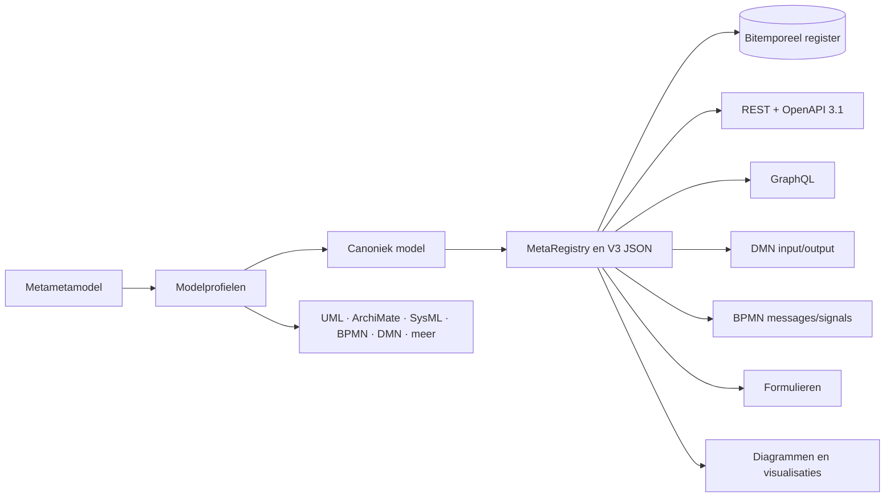

# Omnium Studio en het bitemporele register

Deze repository bevat de ontwikkeling van een proof of concept voor een
**bitemporeel register** tot een kleine, modelgedreven **online IDE**. De
actieve ontwikkelversie staat in
[`bitemp_register_v06/`](bitemp_register_v06/README.md). De mappen v01 tot en
met v05 laten de aanloop en eerdere ontwerpkeuzes zien; v05 is alleen nog een
referentie.

De kern is nog steeds dezelfde: één expliciet informatiemodel stuurt niet
alleen de opslag aan, maar ook API's, regels, processen, berichten, formulieren
en visualisaties. De werkbank waarin die modellen worden gemaakt en met elkaar
worden verbonden heet **Omnium Studio**.

> **Status:** dit is een breed proof of concept en een onderzoeksomgeving, geen
> productieplatform. Het bitemporele register, het V3-modelformaat, de
> MetaRegistry, REST/GraphQL-generatie en verschillende editors werken. Een
> aantal modelprofielen en koppelingen is nog preview; standaarduitwisseling
> voor onder meer ArchiMate en volledige XMI-roundtrip staat nog op de roadmap.

## Van register-POC naar modelleeromgeving

Het project begon met de vraag hoe gegevens zodanig kunnen worden vastgelegd
dat zowel hun **registratiegeschiedenis** als hun **geldigheid in de
werkelijkheid** opvraagbaar blijft. Het register gebruikt daarvoor twee
tijdsdimensies:

- **formele tijd**: wanneer werd iets geregistreerd, gecorrigeerd of afgevoerd;
- **materiële tijd**: vanaf en tot wanneer geldt het gegeven in de werkelijkheid.

Commando's leggen registraties en wijzigingen vast; query's reconstrueren de
gewenste toestand op een formeel en/of materieel tijdstip. Dat sluit aan op een
CQRS-benadering: schrijven bewaart de betekenisvolle registratiehandeling en
lezen levert een daarvan afgeleide momentopname. Correcties en
ongedaanmakingen blijven daardoor onderdeel van de audit trail.

De gegevensdefinitie kwam aanvankelijk uit een aangevuld UML-klassediagram: een
dun profiel boven op UML met concretere concepten voor **entiteit**,
**gegevenselement**, **relatie**, **referentielijst** en
**referentielijstitem**, aangevuld met afgeleide velden en validatieregels. In
dit project heet dat het **canonieke model**.

Vervolgens werd dat model de directe bron voor meer dan alleen tabellen:

- dynamische REST- en GraphQL-API's en OpenAPI-documentatie;
- invoer- en uitvoergegevens van DMN-beslissingen;
- gegevens in BPMN-events, in het bijzonder messages en signals;
- schema-gedreven invoer, validatie, referentielijsten en formulieren;
- codegeneratie, diagrammen, tijdlijnen en andere visualisaties.

Om meerdere modelsoorten op dezelfde manier te kunnen beschrijven is een
**metametamodel (MMM)** toegevoegd. Daardoor is de diagrammotor niet meer
gebonden aan één UML-profiel: een profiel definieert zelf zijn elementtypen,
relaties, eigenschappen, vormen en regels. Dezelfde motor ondersteunt nu onder
meer het canonieke model, UML, MIM, OpenAPI, ERD, ArchiMate, SysML, BPMN, DMN,
CMMN, state machines, activity-, sequence- en use-casediagrammen. Met de
profiel-editor en profiel-ontwerper kunnen ook eigen modelprofielen worden
gemaakt.

Dat maakt v06 feitelijk een compacte online IDE: **Omnium Studio** brengt
modelleren, projectstructuur, modelprofielen, API's, beslissingen, processen,
berichten, formulieren, registerinhoud en beheer bijeen in één werkbank.

## Eén model als verbindende laag



V3 JSON is het platformonafhankelijke uitwisselformaat van het canonieke
model. In de draaiende Go-applicatie is de **MetaRegistry** de runtimebron voor
typen en hun gedrag. Generieke handlers, routes, GraphQL, OpenAPI, codegen en
de schema-gedreven frontend lezen uit diezelfde metadata. Voor geversioneerde
inhoud gebruikt v06 het **Hub + `_Data`-patroon**: een stabiel associatief
anker, geversioneerde inhoud en afzonderlijke materiële aanvang/einde-plumbing.

## Wat Omnium Studio demonstreert

| Gebied | Mogelijkheden | Stand |
|---|---|---|
| Bitemporeel register | registreren, corrigeren, ongedaan maken, formeel en materieel tijdreizen | werkend POC |
| Canoniek model | entiteiten, gegevenselementen, relaties, referentielijsten, afleidingen en validatie | werkend |
| Modelgedreven API | dynamische REST-routes, GraphQL en OpenAPI 3.1 vanuit de MetaRegistry | werkend |
| Omnium Studio | projectbrowser, diagramtabs, inspectors, activiteiten, import/export en publicatie | werkend/doorontwikkeld |
| Profielen via MMM | declaratieve diagrammotor en zelf te definiëren modelprofielen | preview |
| Standaardnotaties | UML, MIM, OAS, ERD, ArchiMate, SysML, BPMN, DMN, CMMN en gedragsdiagrammen | per profiel actief of preview |
| Beslissingen en processen | DMN-tabellen/DRD en BPMN-processen, gekoppeld aan modelvelden en berichttypen | werkend POC |
| Formulieren | schema-gedreven formulieren, bitemporele formulierdefinities en visuele formuliereditor | werkend POC |
| Toegangsspraak | klare-taal toegangsregels, modelcontrole, diagramprojectie en ODRL JSON-LD-export | werkend prototype |
| Interoperabiliteit | V3 JSON, OpenAPI JSON/YAML, BPMN XML, DMN XML en enkele profielspecifieke imports | gedeeltelijk |

### Toegangsspraak en ODRL

De activiteit **Toegangverlening** voegt een gecontroleerde Nederlandse taal
toe voor toegangsbeleid: wie mag welke gegevens voor welke handeling gebruiken,
onder welke voorwaarden en verplichtingen. De editor parseert en controleert
die tekst tegen het canonieke model, visualiseert regels als model en
projecteert ze naar ODRL JSON-LD. Dit werk sluit aan op FTV en het Register
Toegangsbeleid. Een runtime PDP, identiteitsbeheer en volledige vertaling naar
bijvoorbeeld Rego of Cedar zijn nadrukkelijk vervolgwerk.

### Formulierdefinities

Formulieren worden uit modelmetadata opgebouwd, maar kunnen ook een eigen
definitie voor indeling, groepen, labels, voorwaardelijkheid en herhaling
krijgen. Die formulierdefinities kunnen zelf bitemporeel in het register worden
vastgelegd. Als demonstratie van de profielarchitectuur is dezelfde definitie
ook als diagramprofiel te bekijken en te bewerken.

## Architectuurmodellen

De architectuur is in meerdere, bewust overlappende vormen vastgelegd:

- [architectuuroverzicht en leeswijzer](bitemp_register_v06/docs/diagrammen/architectuur-overzicht.md);
- [ArchiMate Exchange-model](bitemp_register_v06/docs/diagrammen/omnium-studio-architectuur.archimate.xml), te importeren in Archi;
- [Mermaid-architectuurdiagrammen](bitemp_register_v06/docs/diagrammen/omnium-studio-architectuur.mmd), bruikbaar als documentatie en invoer voor de Mermaid-import;
- [PlantUML UML-diagrammen](bitemp_register_v06/docs/diagrammen/omnium-studio-architectuur.puml), met component-, deployment- en sequencediagrammen.

De eigen ArchiMate-profielactiviteit kan ArchiMate al modelleren, maar leest het
standaard ArchiMate Exchange-formaat nog niet in. Dat importpad is gepland. De
XML is daarom nu bedoeld voor Archi en als toekomstig roundtrip-testmodel. XMI
import/export is eveneens nog niet compleet; voor UML zijn Mermaid en PlantUML
op dit moment de transparantere bronformaten.

## Begin hier

| Onderwerp | Documentatie |
|---|---|
| Omnium Studio | [`docs/STUDIO.md`](bitemp_register_v06/docs/STUDIO.md) |
| Studio-diagrammotor en profielen | [`docs/STUDIO-05-verslag.md`](bitemp_register_v06/docs/STUDIO-05-verslag.md) |
| Stand van de modelnotaties | [`docs/plans/2026-07-29 Overdracht Notaties — diagramprofielen (status).md`](bitemp_register_v06/docs/plans/2026-07-29%20Overdracht%20Notaties%20%E2%80%94%20diagramprofielen%20%28status%29.md) |
| Canoniek V3-model en codegen | [`docs/CODEGEN.md`](bitemp_register_v06/docs/CODEGEN.md) |
| Hub + `_Data`-patroon | [`ONTWERP_DATA_PATTERN.md`](bitemp_register_v06/ONTWERP_DATA_PATTERN.md) |
| Bitemporele registratiepatronen | [`docs/registratie-patronen.md`](bitemp_register_v06/docs/registratie-patronen.md) |
| GraphQL | [`GRAPHQL.md`](bitemp_register_v06/GRAPHQL.md) |
| OpenAPI 3.1 | [`docs/OPENAPI.md`](bitemp_register_v06/docs/OPENAPI.md) |
| IDE en V3 import/export | [`docs/IDE.md`](bitemp_register_v06/docs/IDE.md) |
| Visuele formulieren | [`docs/plans/2026-07-25 Overdracht Formulieren (laptop).md`](bitemp_register_v06/docs/plans/2026-07-25%20Overdracht%20Formulieren%20%28laptop%29.md) |
| Toegangsspraak en ODRL | [`docs/TOEGANGSSPRAAK.md`](bitemp_register_v06/docs/TOEGANGSSPRAAK.md) |
| Devloop en self-rebuild | [`docs/DEVLOOP.md`](bitemp_register_v06/docs/DEVLOOP.md) |
| Docker en deployment | [`docker.md`](bitemp_register_v06/docker.md) |
| Backlog | [`docs/BACKLOG.md`](bitemp_register_v06/docs/BACKLOG.md) |

## Lokaal draaien

Voor de actieve versie zijn Go, Node.js en PostgreSQL nodig. De repository bevat
ook meerdere Docker Compose-profielen.

```sh
# API, standaard op http://localhost:8082
cd bitemp_register_v06
go run main.go

# frontend, in een tweede terminal
cd bitemp_register_v06/web/vite
npm install
npm run dev -- --host
```

Belangrijke lokale ingangen:

| Functie | URL |
|---|---|
| Omnium Studio | `http://localhost:8082/viz/react/studio.html` |
| Registervisualisatie | `http://localhost:8082/viz/react/` |
| GraphiQL | `http://localhost:8082/graphql` |
| Swagger UI | `http://localhost:8082/swagger` |
| ReDoc | `http://localhost:8082/redoc` |
| OpenAPI | `http://localhost:8082/openapi.json` |

Zie voor de volledige ontwikkelcyclus, publicatie, codegeneratie en herstelpaden
de [devloop-handleiding](bitemp_register_v06/docs/DEVLOOP.md).

## Repository-indeling

| Map | Rol |
|---|---|
| [`bitemp_register_v06/`](bitemp_register_v06/) | actieve codebase en documentatie van Omnium Studio en het register |
| [`bitemporal_go_API_v05/`](bitemporal_go_API_v05/) | laatste referentie vóór de v06-architectuur |
| `bitemporal_go_API_v01/` t/m `v04/` | historische iteraties van het register-POC |
| [`Bitemp2026-PG/`](Bitemp2026-PG/) | PostgreSQL DDL, views en query-experimenten |
| [`HRv4-SQLLite/`](HRv4-SQLLite/) | eerdere SQLite-variant van het gegevensmodel |
| [`process_engine_v01/`](process_engine_v01/) | afzonderlijk historisch procesengine-experiment |
| [`Source_material/`](Source_material/) | bronmateriaal en referentiedocumenten |

Nieuwe ontwikkeling hoort in `bitemp_register_v06/`; de overige versiemappen
zijn geschiedenis en vergelijkingsmateriaal.
