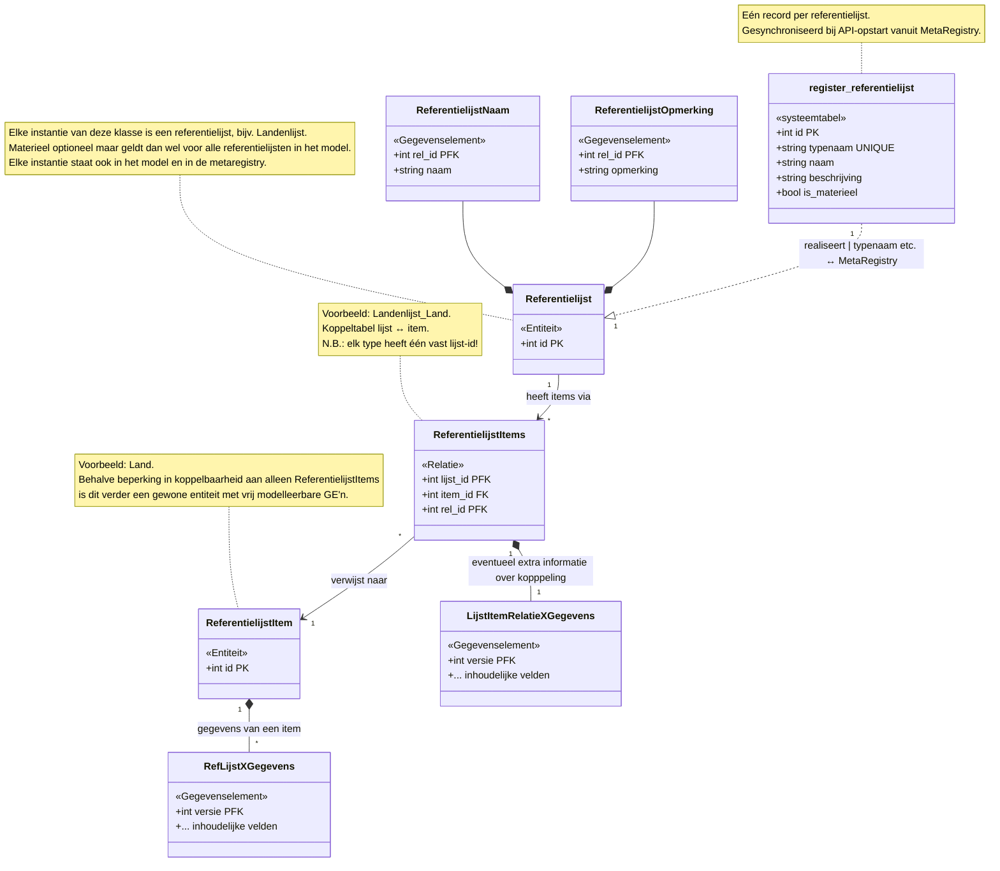
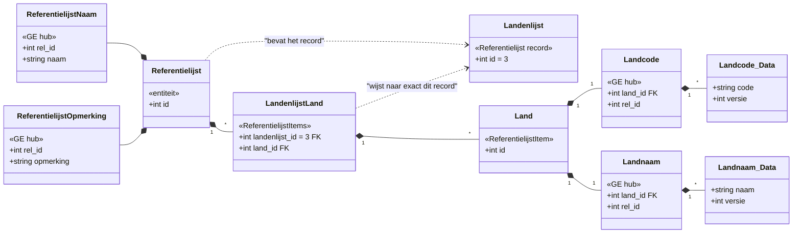
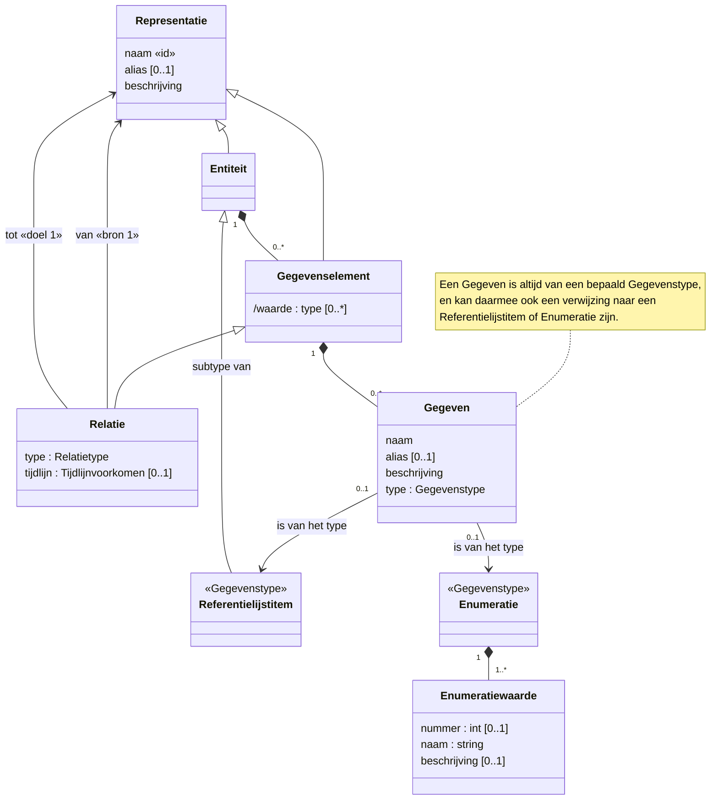
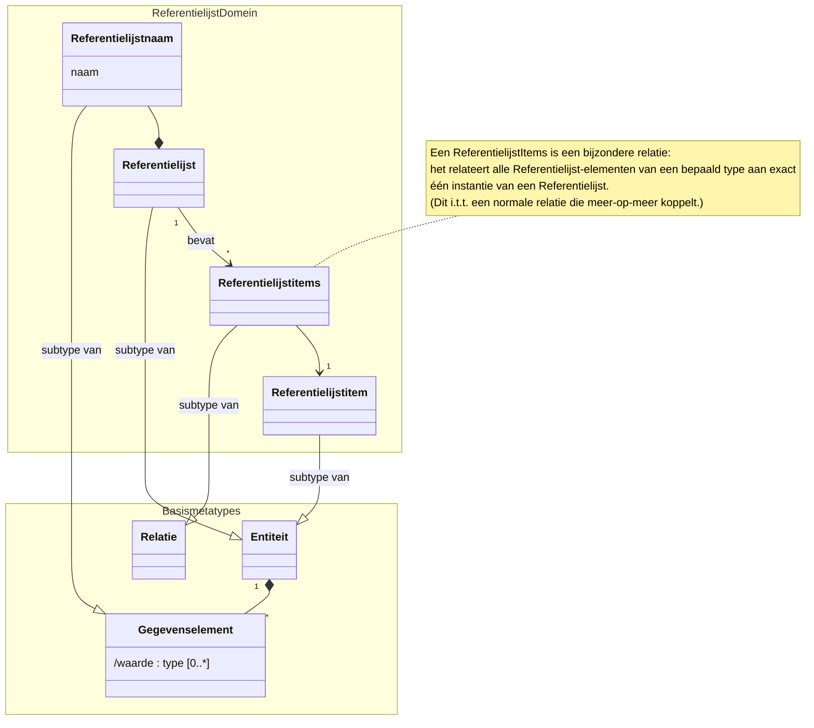
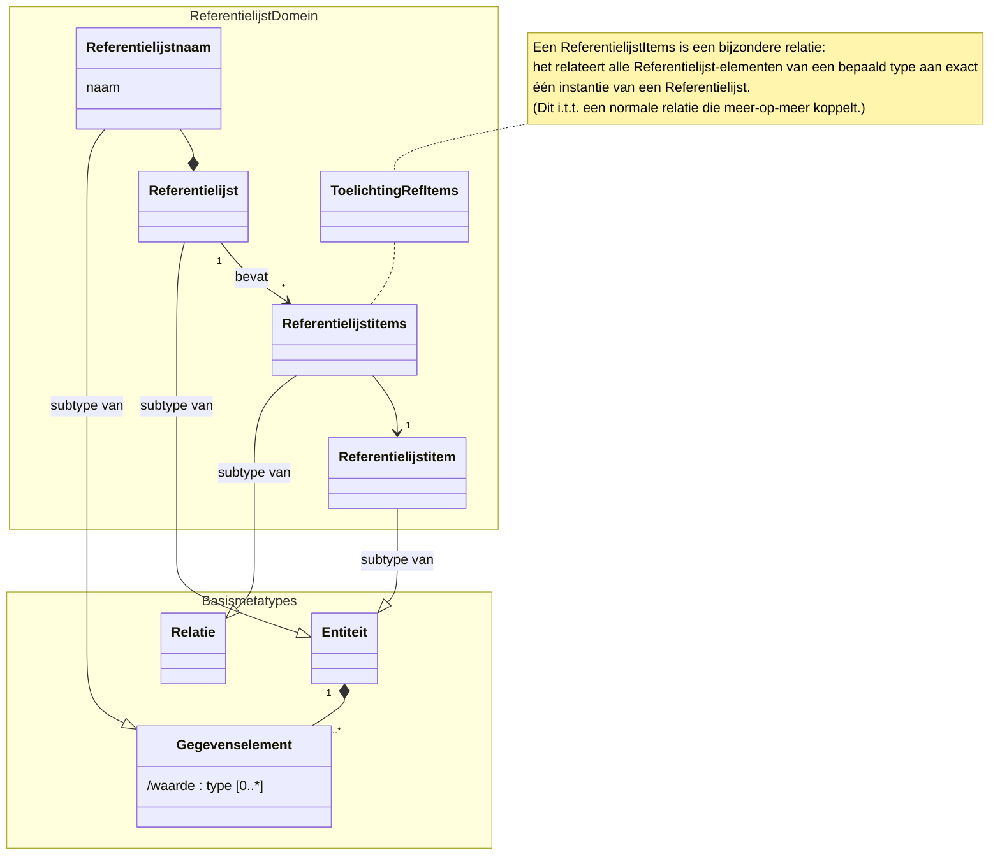

# Referentielijsten — Ontwerp & Ontwerpkeuzen

> **Status**: ontwerp, fase 1 (editor + V3-model) in uitvoering.  
> **Datum**: 2026-03-27

---

## 1. Doel

Referentielijsten zijn benoemde verzamelingen van items (bijv. "Landen", "EU-Lidstaten") die als keuzelijst dienen in het register. Ze worden gemodelleerd als subtypes van de bestaande metatypes (entiteit, relatie) en maken volledig gebruik van de bestaande bitemporele registratielogica.

---

## 2. Drie nieuwe subtypes

| Subtype | Is subtype van | Gedraagt zich als | Voorbeeld |
|---|---|---|---|
| **referentielijst** | entiteit | Entiteit met ID + onderliggende systeem-GE's (naam, opmerking) | geen: elk record is een referentielijst. Voorbeeld van lijsten: landenlijst, EU-lidstaten-lijst |
| **referentielijst_item** | entiteit | Gewone entiteit (ID + vrije GE's/relaties) | "Land" |
| **referentielijst_items** | relatie | Koppeltabel (FK naar lijst-record + FK naar item) | "Landen_Land" |

### Overzichtsdiagram



### Concreet voorbeeld: Landenlijst



### Relatie tot bestaand metamodel

- De drie subtypes erven alle eigenschappen van hun basis-metatype: hub+data-patroon, aanvang/einde (indien materieel), relatieve autoincrement, formele opvoer/afvoer.
- Het onderscheid met gewone entiteiten/relaties zit puur in **metamodel-metadata** (`entiteitSubtype` / `relatieSubtype`), niet in runtime-gedrag.

### Metamodel (META-niveau)

#### Algemeen representatie metamodel
Dit bevat wel het Referentielijstitem, dat zich als een gegevenstype gedraagt.


#### Referentielijsten toegevoegd aan het metamodel
Onderstaand diagram toont hoe referentielijsten zich verhouden tot de bestaande metamodel-concepten (Entiteit, Gegevenselement, Relatie, Gegeven, Gegevenstype).
Representatie is er voor de duidelijkheid uitgelaten. Zie hierboven het metamodel met de representatie superklasse.



Verbeterde variant (toelichting als class in namespace):



 **Verschil:** In deze variant staat de toelichting als class **binnen** het ReferentielijstDomein namespace, niet erbuiten. Dit zorgt ervoor dat de toelichting altijd zichtbaar blijft, ook in dark theme op GitHub.

### Enkelvoud en meervoud

Omdat het Nederlands onregelmatig is (land/landen, lidstaat/lidstaten), moeten enkelvoud en meervoud altijd expliciet worden vastgelegd in het model, net als bij gewone entiteiten.

---

## 3. Systeemtabel `register_referentielijst`

Elke referentielijst mapt op een **record** in de registersysteemtabel `register_referentielijst`. Deze tabel gedraagt zich als een entiteit-register van alle referentielijsten in het systeem.

```
register_referentielijst
├── id            (PK, autoincrement)
├── typenaam      (unique, naam uit het metamodel, bijv. "Landen")
├── naam          (weergavenaam)
├── beschrijving  (optioneel)
└── is_materieel  (bool)
```

### Synchronisatie bij opstart

Bij elke opstart van de API wordt de systeemtabel gesynchroniseerd met de MetaRegistry:
- Loop door alle entries met `EntiteitSubtype == "referentielijst"`
- `INSERT ... ON CONFLICT (typenaam) DO UPDATE` zodat naamswijzigingen en beschrijvingen worden bijgewerkt
- Dit zorgt ervoor dat modelwijzigingen automatisch worden doorgevoerd

---

## 4. API-routes

### Gescheiden van gewone types

Referentielijsten worden **niet** gemixed met gewone entiteit-routes. In plaats daarvan:

```
GET  /referentielijsten                       → overzicht van alle referentielijsten (uit systeemtabel)
GET  /referentielijsten/{naam}                → detail van één referentielijst (bijv. /referentielijsten/landen)
GET  /full/referentielijsten/{naam}           → volledige lijst met alle items (expanded)
```

De `{naam}` is de naam van de lijst **zonder meervoud-s**, omdat de lijstnaam in principe al meervoud is (de Landen-lijst, de EU-Lidstaten-lijst).

### Items en relaties

Items en koppelrelaties krijgen wél gewone MetaRegistry-routes omdat ze zich exact als entiteiten/relaties gedragen:

```
GET  /lands                                   → alle Land-items
GET  /lands/:id                               → één Land
GET  /landen_lands                             → alle Landen_Land koppelingen
POST /registratie/                             → registreer items via bestaande registratie-API
```

### Registratieworkflow

1. Items worden aangemaakt via de reguliere `/registratie/` endpoint (net als elke entiteit)
2. De koppeling aan de referentielijst geschiedt via een aparte registratie van de relatie, omdat het ID van het item pas na stap 1 bekend is
3. Later kan een "handelingsgedreven" endpoint worden toegevoegd dat stap 1+2 combineert

---

## 5. Materieel / formeel

Referentielijsten, items en koppelingen zijn **standaard formeel**. Materieel kan worden gekozen, net als bij elke andere entiteit of relatie.

- **Formeel** (standaard): het register houdt bij wanneer iets is geregistreerd (opvoer/afvoer)
- **Materieel** (optioneel): ook geldigheidsperiode (aanvang/einde) bijhouden. Nuttig als de lijst zelf of individuele items een ingangsdatum moeten hebben

---

## 6. Metamodel V3 wijzigingen

### Entiteit-niveau
Optioneel nieuw veld op entiteiten:
```json
"entiteitSubtype": "referentielijst" | "referentielijst_item"
```

### Relatie-niveau
Optioneel nieuw veld op relaties:
```json
"relatieSubtype": "referentielijst_items"
```

Beide velden zijn **backwards compatible**: bestaande modellen zonder deze velden werken onveranderd.

---

## 7. Editor (UML)

### Toolbar

- **"+ Referentielijst"** knop: maakt in één klik drie nodes + edges aan:
  1. referentielijst-entiteit (met standaard naam-GE en opmerking-GE)
  2. referentielijst_item-entiteit (leeg)
  3. referentielijst_items-relatie (1→2 verbinding)
- **"+ Ref. Item"** en **"+ Ref. Items"** losse knoppen voor extra items/koppelingen
- Groepering onder een dropdown/submenu "Referentielijsten ▼" om de toolbar beheersbaar te houden

### Node-weergave

- Referentielijst-entiteiten krijgen een badge/stereotype: `«referentielijst»`
- Referentielijst_item-entiteiten: `«ref.lijst item»`
- Referentielijst_items-relaties: `«ref.lijst items»`
- Eigen kleuren per subtype

### Type-keuzelijst

`referentielijst_item`-typen verschijnen in de type-keuzelijst van GE-velden, vergelijkbaar met enumeraties. Wanneer een veld van type "Land" wordt gekozen, genereert de editor automatisch een dependency-edge naar dat ref.lijst-item type.

### Edge-constraints (editor only)

- Bij een `referentielijst_items`-relatie: bron mag alleen referentielijst zijn, doel mag alleen referentielijst_item zijn
- Dit is een **editor-constraint**, geen DB-constraint

---

## 8. Naamconventie

Vrij, niet afgedwongen. Voorbeelden:

| Referentielijst | Item-type | Relatie |
|---|---|---|
| Landen | Land | Landen_Land |
| EU_Lidstaten | Land | EU_Lidstaten_Land |
| Plantensoorten | Plant | Plantensoorten_Plant |

Een item-type (bijv. "Land") kan in meerdere referentielijsten voorkomen.

---

## 9. MetaRegistry

### Nieuwe velden in TypeMeta

```go
EntiteitSubtype   string  // "", "referentielijst", "referentielijst_item"
RelatieSubtype    string  // "", "referentielijst_items"
```

### Constanten

```go
const EntiteitSubtypeReferentielijst     = "referentielijst"
const EntiteitSubtypeReferentielijstItem = "referentielijst_item"
const RelatieSubtypeReferentielijstItems = "referentielijst_items"
```

---

## 10. Code generator

Na validatie van het handmatige testmodel wordt de codegenerator (`cmd/codegen/`) aangepast:

- V3 JSON parsen: `entiteitSubtype`, `relatieSubtype` herkennen
- `gen_registry.go`: subtype-waarden meegenereren in TypeMeta-entries
- `gen_structs.go`: commentaar toevoegen dat het een referentielijst-subtype betreft

---

## 11. Implementatiefasen

| Fase | Stappen | Validatie |
|---|---|---|
| **1** | V3 modelschema + Editor (types, import/export, toolbar, nodes) | Editor kan ref.lijsten aanmaken en exporteren als V3 JSON |
| **2** | MetaRegistry plumbing + systeemtabel + handmatig testmodel | Tabellen, routes en registratie werken voor testmodel |
| **3** | Schema-API + frontend index/formulieren | Ref.lijsten zichtbaar en bruikbaar in frontend |
| **4** | Code generator aanpassen | V3 model → gegenereerde Go-code inclusief ref.lijsten |
