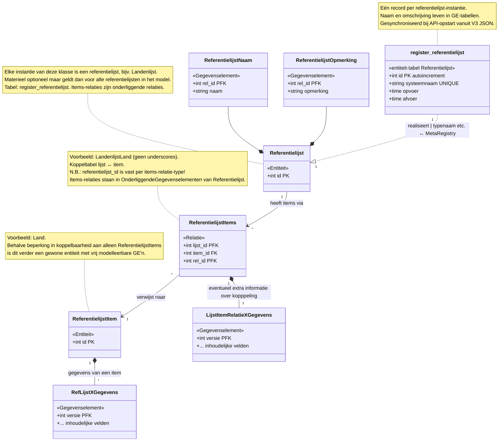
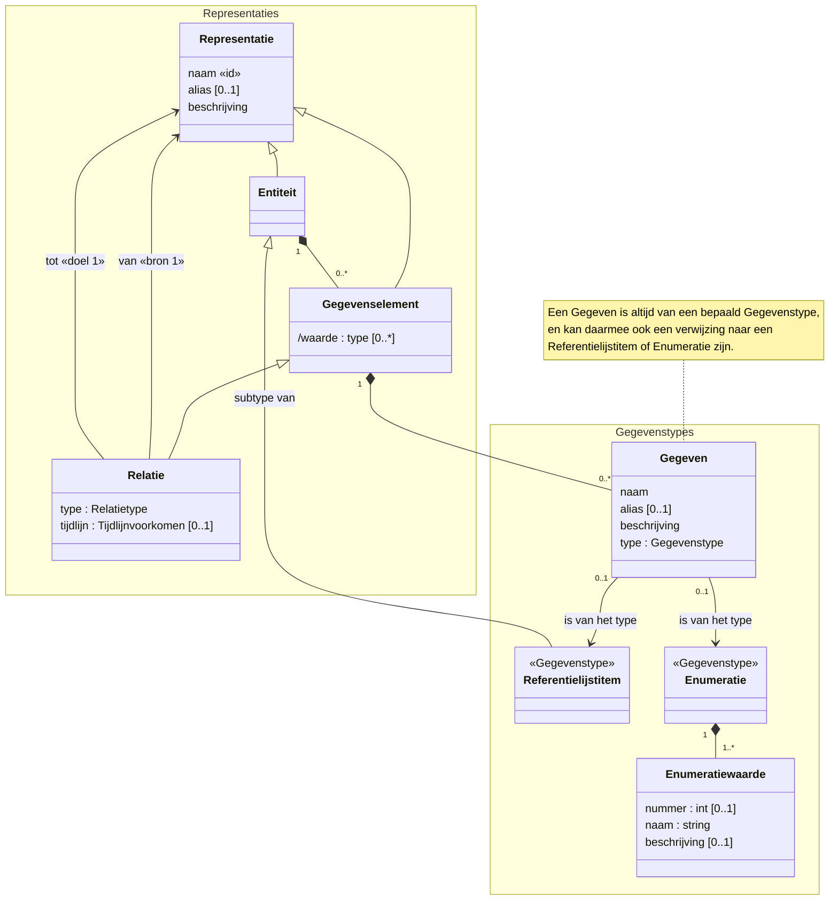
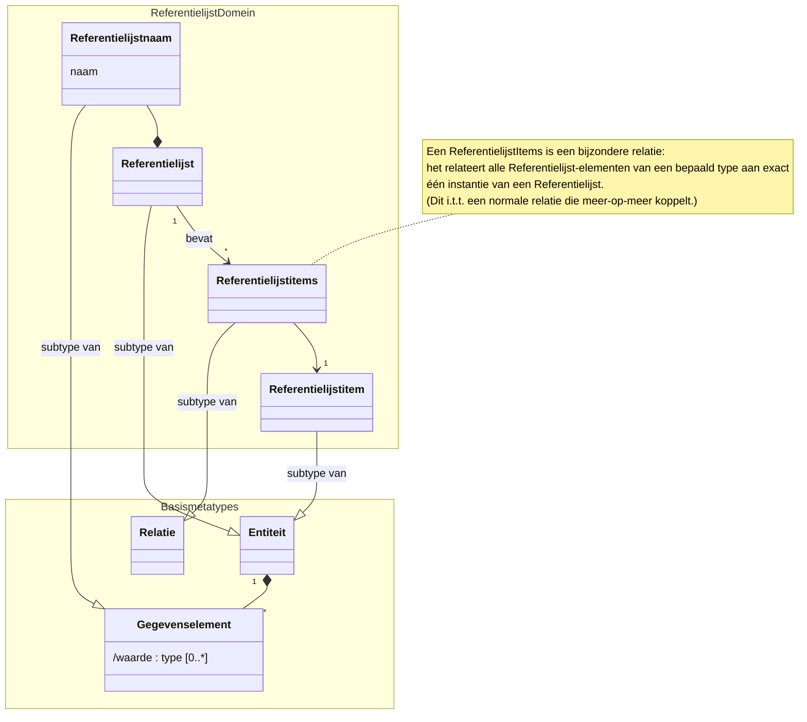

# Referentielijsten — Ontwerp & Ontwerpkeuzen

> **Status**: ontwerp, fase 0–2 (refactoring klasse/instantie + backend) in uitvoering.  
> **Datum**: 2026-03-29 (bijgewerkt vanuit implementatieplan)

---

## 1. Doel

Referentielijsten zijn benoemde verzamelingen van items (bijv. "Landen", "EU-Lidstaten") die als keuzelijst dienen in het register. Ze worden gemodelleerd als subtypes van de bestaande metatypes (entiteit, relatie) en maken volledig gebruik van de bestaande bitemporele registratielogica.

---

## 2. Drie nieuwe subtypes

| Subtype | Is subtype van | Gedraagt zich als | Voorbeeld |
|---|---|---|---|
| **referentielijst** | entiteit | Entiteit met ID + onderliggende systeem-GE's (naam, omschrijving) | Eén Go struct `Referentielijst`; elke instantie (bijv. Landenlijst, EULidstaten) is een **record** in de tabel `register_referentielijst` |
| **referentielijst_item** | entiteit | Gewone entiteit (ID + vrije GE's/relaties) | `Land` |
| **referentielijst_items** | relatie | Koppeltabel (FK naar lijst-record + FK naar item), onderliggend aan Referentielijst | `LandenlijstLand` (geen underscores in gewone klassen) |

> **Klasse vs instantie**: `Referentielijst` is de Go-struct (klasse). `Landenlijst`, `EULidstaten` etc. zijn **instanties** (records) van die klasse. Per items-relatie (bijv. `LandenlijstLand`) is de primaire FK (`referentielijst_id`) altijd gebonden aan één specifiek instantie-ID.

### Overzichtsdiagram



### Concreet voorbeeld: Landenlijst


### Relatie tot bestaand metamodel

- De drie subtypes erven alle eigenschappen van hun basis-metatype: hub+data-patroon, aanvang/einde (indien materieel), relatieve autoincrement, formele opvoer/afvoer.
- Het onderscheid met gewone entiteiten/relaties zit puur in **metamodel-metadata** (`entiteitSubtype` / `relatieSubtype`), niet in runtime-gedrag.

### Metamodel (META-niveau)

#### Algemeen representatie metamodel
Dit bevat wel het Referentielijstitem, dat zich als een gegevenstype gedraagt.


#### Referentielijsten toegevoegd aan het metamodel
Onderstaand diagram toont hoe referentielijsten zich verhouden tot de bestaande metamodel-concepten (Entiteit, Gegevenselement, Relatie, Gegeven, Gegevenstype).
Representatie is er voor de duidelijkheid uitgelaten. Zie hierboven het metamodel met de representatie superklasse.



### Enkelvoud en meervoud

Omdat het Nederlands onregelmatig is (land/landen, lidstaat/lidstaten), moeten enkelvoud en meervoud altijd expliciet worden vastgelegd in het model, net als bij gewone entiteiten.

---

## 3. Tabel `register_referentielijst` — entiteit-tabel

> **Gewijzigd 2026-03-29**: was een aparte systeemtabel, is nu de reguliere entiteit-tabel voor de `Referentielijst`-klasse.

Elke referentielijst-instantie (bijv. Landenlijst, EULidstaten) is een **record** in de tabel `register_referentielijst`. Deze tabel wordt aangemaakt via de standaard MetaRegistry-driven DDL (`createModelTables`), net als elke andere entiteit.

```
register_referentielijst
├── id            (PK, autoincrement)
├── systeemnaam   (UNIQUE, stabiele identifier voor sync/routing/binding)
├── opvoer        (timestamptz, formele tijd)
└── afvoer        (timestamptz, formele tijd)
```

**Naam en omschrijving** staan niet meer in deze tabel, maar in aparte GE-tabellen (zie §3a). Dit maakt het mogelijk om naam en omschrijving bitemporeel te wijzigen.

`is_materieel` is een klasse-eigenschap die in de MetaRegistry staat en geldt voor alle instanties uniform.

### Synchronisatie bij opstart

Bij elke opstart van de API worden referentielijst-instanties gesynchroniseerd vanuit de **V3 model JSON** (niet meer vanuit MetaRegistry-entries):
- Lees `referentielijstInstanties` uit het actieve V3 model
- Per instantie: `INSERT register_referentielijst (systeemnaam, opvoer) ON CONFLICT (systeemnaam) DO NOTHING`
- Bij nieuw record: bootstrap initiële GE-records (Referentielijstnaam, Referentielijstomschrijving) via directe INSERT
- Dit vervangt de oude `syncReferentielijstRegister()` die MetaRegistry-entries filterde

---

## 3a. Gegevenselementen: Referentielijstnaam en Referentielijstomschrijving

> **Nieuw 2026-03-29**: naam en omschrijving zijn nu GE's i.p.v. kolommen in de systeemtabel.

Elke referentielijst-instantie heeft twee standaard gegevenselementen:

| GE | Hub-tabel | Data-tabel | Veld | Momentvoorkomen |
|---|---|---|---|---|
| **Referentielijstnaam** | `referentielijstnaam` | `referentielijstnaam_data` | `naam` (string) | Enkelvoudig |
| **Referentielijstomschrijving** | `referentielijstomschrijving` | `referentielijstomschrijving_data` | `omschrijving` (string) | Enkelvoudig |

Beide volgen het standaard hub+data versiepatroon:
- Hub: `referentielijst_id (PFK), rel_id (PFK, autoincrement), opvoer, afvoer`
- Data: `referentielijst_id (PFK), rel_id (PFK), versie (PFK, autoincrement), naam/omschrijving, opvoer, afvoer`

Dit stelt ons in staat om de naam en omschrijving van een referentielijst bitemporeel te wijzigen — zowel over de formele als de materiële as (indien materieel is ingeschakeld).

---

## 4. API-routes

### Gescheiden van gewone types

Referentielijsten worden **niet** gemixed met gewone entiteit-routes. In plaats daarvan:

```
GET  /referentielijsten                       → overzicht van alle referentielijsten (uit systeemtabel)
GET  /referentielijsten/{naam}                → detail van één referentielijst (bijv. /referentielijsten/landen)
GET  /full/referentielijsten/{naam}           → volledige lijst met alle items (expanded)
```

De `{naam}` is de naam van de lijst **zonder meervoud-s**, omdat de lijstnaam in principe al meervoud is (de Landen-lijst, de EU-Lidstaten-lijst).

### Items en relaties

Items en koppelrelaties krijgen wél gewone MetaRegistry-routes omdat ze zich exact als entiteiten/relaties gedragen:

```
GET  /landen                                   → alle Land-items
GET  /landen/:id                               → één Land
GET  /landenlijst_landen                        → alle LandenlijstLand koppelingen
POST /registratie/                             → registreer items via bestaande registratie-API
```

### Registratieworkflow

1. Items worden aangemaakt via de reguliere `/registratie/` endpoint (net als elke entiteit)
2. De koppeling aan de referentielijst geschiedt via een aparte registratie van de relatie, omdat het ID van het item pas na stap 1 bekend is
3. Later kan een "handelingsgedreven" endpoint worden toegevoegd dat stap 1+2 combineert

---

## 5. Materieel / formeel

Referentielijsten, items en koppelingen zijn **standaard formeel**. Materieel kan worden gekozen, net als bij elke andere entiteit of relatie.

- **Formeel** (standaard): het register houdt bij wanneer iets is geregistreerd (opvoer/afvoer)
- **Materieel** (optioneel): ook geldigheidsperiode (aanvang/einde) bijhouden. Nuttig als de lijst zelf of individuele items een ingangsdatum moeten hebben

---

## 6. Metamodel V3 wijzigingen

### Entiteit-niveau
Optioneel nieuw veld op entiteiten:
```json
"entiteitSubtype": "referentielijst" | "referentielijst_item"
```

### Relatie-niveau
Optionele nieuwe velden op relaties:
```json
"relatieSubtype": "referentielijst_items",
"referentielijstInstantie": "Landenlijst"
```

`referentielijstInstantie` geeft aan welke referentielijst-instantie (systeemnaam) aan deze items-relatie gebonden is.

### Nieuw: `referentielijstInstanties` sectie in V3 model

Het V3 model krijgt een top-level sectie voor referentielijst-instanties:
```json
{
  "versie": "v3",
  "referentielijstInstanties": [
    {
      "systeemnaam": "Landenlijst",
      "naam": "Landen",
      "omschrijving": "Een lijst van alle landen",
      "positie": { "x": 100, "y": 200 }
    }
  ],
  "entiteiten": [
    {
      "typenaam": "Referentielijst",
      "entiteitSubtype": "referentielijst",
      "isMaterieel": true,
      "gegevenselementen": [
        { "naam": "Referentielijstnaam", "velden": [{"naam": "Naam", "type": "string"}] },
        { "naam": "Referentielijstomschrijving", "velden": [{"naam": "Omschrijving", "type": "string"}] }
      ],
      "relaties": [
        {
          "naam": "LandenlijstLand",
          "relatieSubtype": "referentielijst_items",
          "doelEntiteit": "Land",
          "referentielijstInstantie": "Landenlijst"
        }
      ]
    }
  ]
}
```

Alle velden zijn **backwards compatible**: bestaande modellen zonder deze velden werken onveranderd.

---

## 7. Editor (UML)

### Toolbar

- **"+ Referentielijst"** knop: maakt in één klik drie nodes + edges aan:
  1. referentielijst-entiteit (met standaard naam-GE en opmerking-GE)
  2. referentielijst_item-entiteit (leeg)
  3. referentielijst_items-relatie (1→2 verbinding)
- **"+ Ref. Item"** en **"+ Ref. Items"** losse knoppen voor extra items/koppelingen
- Groepering onder een dropdown/submenu "Referentielijsten ▼" om de toolbar beheersbaar te houden

### Node-weergave

- Referentielijst-entiteiten krijgen een badge/stereotype: `«referentielijst»`
- Referentielijst_item-entiteiten: `«ref.lijst item»`
- Referentielijst_items-relaties: `«ref.lijst items»`
- Eigen kleuren per subtype

### Type-keuzelijst

`referentielijst_item`-typen verschijnen in de type-keuzelijst van GE-velden, vergelijkbaar met enumeraties. Wanneer een veld van type "Land" wordt gekozen, genereert de editor automatisch een dependency-edge naar dat ref.lijst-item type.

### Edge-constraints (editor only)

- Bij een `referentielijst_items`-relatie: bron mag alleen referentielijst zijn, doel mag alleen referentielijst_item zijn
- Dit is een **editor-constraint**, geen DB-constraint

---

## 8. Naamconventie

> **Gewijzigd 2026-03-29**: geen underscores meer in gewone klassenamen.

Gewone klassen (entiteiten, relaties, gegevenselementen) gebruiken **PascalCase zonder underscores**. Underscores zijn gereserveerd voor systeemsuffixen (`_Data`, `_Aanvang`, `_Einde`, `_Input`).

Dit geldt voor alle types in het model, niet alleen referentielijsten.

| Instantienaam (systeemnaam) | Item-type | Items-relatie | Items-relatie Data |
|---|---|---|---|
| Landenlijst | Land | LandenlijstLand | LandenlijstLand_Data |
| EULidstaten | Land | EULidstatenLand | EULidstatenLand_Data |
| Plantensoorten | Plant | PlantensoortenPlant | PlantensoortenPlant_Data |

Een item-type (bijv. `Land`) kan in meerdere referentielijsten voorkomen.

Nederlands kan lange woorden hebben (bijv. `Ondercuratelstelling`). Dat is prima — PascalCase zonder underscores blijft leesbaar.

---

## 9. MetaRegistry

### Velden in TypeMeta

```go
EntiteitSubtype          string  // "", "referentielijst", "referentielijst_item"
RelatieSubtype           string  // "", "referentielijst_items"
ReferentielijstInstantie string  // systeemnaam van gebonden instantie; alleen voor referentielijst_items relaties
```

### Constanten

```go
const EntiteitSubtypeReferentielijst     = "referentielijst"
const EntiteitSubtypeReferentielijstItem = "referentielijst_item"
const RelatieSubtypeReferentielijstItems = "referentielijst_items"
```

### Items-relaties als onderliggende relaties

Items-relaties (bijv. `LandenlijstLand`) staan in **OnderliggendeGegevenselementen** van de `Referentielijst`-entry. Ze zijn tegelijkertijd zelfstandige MetaRegistry-entries met eigen routes. Dit is consistent met hoe bijv. Bereikbaarheid onder NatuurlijkPersoon staat maar ook een eigen entry heeft.

De full-entity handler filtert op de FK van het specifieke record (`referentielijst_id`), waardoor bij `GET /full/referentielijsten/Landenlijst` alleen de relevante items-relaties data bevatten en andere lege arrays zijn.

---


## 10. Code generator

Na validatie van het handmatige testmodel wordt de codegenerator (`cmd/codegen/`) aangepast:

- V3 JSON parsen: `entiteitSubtype`, `relatieSubtype` herkennen
- `gen_registry.go`: subtype-waarden meegenereren in TypeMeta-entries
- `gen_structs.go`: commentaar toevoegen dat het een referentielijst-subtype betreft

---

## 11. Implementatiefasen

> **Gewijzigd 2026-03-29**: Fase 1+2 zijn gedeeltelijk geïmplementeerd. Refactoring klasse/instantie vereist een nieuw implementatieplan.

Zie `docs/implementatieplan-referentielijsten.md` voor het gedetailleerde stappenplan.

| Fase | Stappen | Status |
|---|---|---|
| **0** | Documentatie bijwerken (dit bestand) | ✅ Gedaan |
| **A** | V3 JSON format + MetaRegistry plumbing uitbreiden | In uitvoering |
| **B** | Go model refactoring: Referentielijst generieke struct, GE's, hernoemen, verplaatsen | Gepland |
| **C** | MetaRegistry entries herschrijven | Gepland |
| **D** | Database setup: tabel-creatie + instantie-sync | Gepland |
| **E** | V3 exporter/importer aanpassen | Gepland |
| **F** | Routes aanpassen | Gepland |
| **G** | Editor: instantie-nodes + binding-edges | Gepland |
| **H** | Verificatie (build, tests, API, editor round-trip) | Gepland |
| *(later)* | Code generator aanpassen | Buiten scope dit plan |

---

## 12. Beslissingen

1. **Tabel `register_referentielijst` hergebruiken**: de tabel behoudt zijn naam maar wordt nu de entiteit-tabel voor Referentielijst. Kolommen gewijzigd: `typenaam` → `systeemnaam`, `naam`/`beschrijving`/`is_materieel` verwijderd (gaan naar GE's resp. MetaRegistry).
2. **`systeemnaam` als stabiele identifier**: elk referentielijst-record heeft een immutable systeemnaam die gebruikt wordt voor V3 JSON sync, routing, en binding van items-relaties.
3. **Items-relaties in OnderliggendeGegevenselementen**: ze zijn gewone onderliggende relaties van Referentielijst, met de constraint dat de primaire FK altijd hetzelfde instantie-ID heeft. Tegelijk zelfstandige MetaRegistry-entries met eigen routes.
4. **`is_materieel` is klasse-eigenschap**: geldt voor alle referentielijst-instanties uniform. Staat in MetaRegistry, niet per-record.
5. **Naamconventie**: geen underscores in gewone klassen (`LandenlijstLand` i.p.v. `Landenlijst_Land`). Systeemsuffixen (`_Data`, `_Aanvang`, `_Einde`) behouden underscores.
6. **Codegenerator buiten scope**: wordt pas aangepast nadat de handmatige constructie werkt.

---

## 13. Openstaande overwegingen

1. **Instantie-ID management**: `systeemnaam` voor lookup, `id` wordt autoincrement. Bij match op systeemnaam wordt bestaand record hergebruikt. ✅ Besloten.
2. **Cross-model referentielijsten**: nu buiten scope, maar structuur moet dit niet blokkeren. Referentielijsten en gegevenstypen zijn potentieel generiek over modellen heen. Toekomstige iteratie.
3. **Bootstrap GE-data**: directe INSERT voor bootstrap bij eerste sync. ✅ Besloten.
4. **Items-relatie FK constraint**: `referentielijst_id` is altijd het ID van de gebonden instantie. Nu via applicatielogica afgedwongen; later evt. DB CHECK constraint.


# Nieuw plan 29 maart 2026!!
D:\Git\Bitemporal_2026\bitemp_register_v06\docs\copilot-chats\exports\2026-03-29 referentielijsten PLAN.md


# Observaties na implementatie stappen 1 t/m 9 van het nieuwe plan

## metaregistry
1. omschrijvingen van NP en GEn en Locatie en GEn zijn nog op ABXY gebaseerd.
- graag updaten naar logische omschrijvingen en onderstaande definities:
  - natuurlijk persoon: "Een mens voor zover deze door Nederlandse wetgeving met rechten en plichten wordt bekleed."
  - locatie: hier wordt de nauwere definitie van fysiek bezoekbare locatie bedoeld. Fysiek bezoekbare locatie is een locatie die fysiek bezocht kan worden en is gelegen op het aardoppervlak. De locatie is verdeeld in twee typen:
    - Een binnenlandse locatie:
      - Een Binnenlandse locatie die ligt binnen de rijksgrenzen van Nederland binnen het Koninkrijk der Nederlanden, waarbij de ruimte verder wordt beperkt door de rijksgrens met Duitsland en België. De drie openbare lichamen: Bonaire, Sint Eustatius en Saba vallen niet binnen deze ruimte. In de BAG betreffen dit de verblijfsobjecten, lig- en standplaatsen. 
    - Een buitenlandse locatie:
      -Een Buitenlandse locatie is een op het aardoppervlak gelegen locatie, maar die niet ligt binnen de rijksgrenzen van Nederland binnen het Koninkrijk der Nederlanden, waarbij de ruimte verder wordt beperkt door de rijksgrens met Duitsland en België.
  - Adres: een locatieaanduiding. Dat kan in voor een binnenlandse of buitenlandse locatie zijn. We hebben hier alleen de binnenlandse locatie gemodelleerd als Adres:
    - Een binnenlands adres is een aanduiding van een binnenlandse locatie. Een binnenlands adres wordt uitgegeven door de gemeente en geregistreerd in de basisregistratie adressen en gebouwen (BAG). In de BAG wordt een adres geregistreerd als nummeraanduiding.
  - Baglocatie: De unieke identificatie van het adresseerbaar object (verblijfsobject, stand- of ligplaats) uitgegeven door het bevoegd gemeentelijke orgaan. In de BAG betreft dit de nummeraanduiding van een verblijfsobject, een standplaats of een ligplaats.

2. Voor roundtrip engineering zou het goed zijn om ook de locatie van de klassen in de metaregistry te schrijven, zodat alle informatie overal hetzelfde staat:
- in de metaregistry + structs
- in de json V3 naar en van de editor
- in de html editor op het scherm
- in de database als schema_json (ook V3)

acties:
a. Zou je de posities (alleen die, de rest is niet zo goed) uit de schema json #18 in de DB willen halen en in de metaregistry zetten?
b. wil je de export van het json model v3 *vanuit code* aanvullen met die posities uit de metaregistry?

3. enums zijn niet ingesteld in de code:
- postcode is een postcode en
- bsn is een BSN
Kun je dat instellen, zodat we kunnen zien of dat ook goed meekomt in de export? (en later in de codegeneratie natuurlijk)
- ✅ Opgelost: `schema:"datatype:NLPostcode"` en `schema:"datatype:BSN"` tags op de struct-velden. V3Veld heeft nu een `Datatype` veld dat meegaat in de export.

4. Adres zou ook een land mogen hebben met een referentie naar de Landenlijst (het type wordt eigenlijk dan LandenlijstLand: dat is het object waar ie naartoe wijst).
- ✅ Geïmplementeerd via Optie B: `schema:"ref:LandenlijstLand"` tag op `Locatie_Adres_Data.Land` (int).
  - `V3Veld.Ref` veld met JSON-tag `"$ref"` (analoog aan OAS 3.1 `$ref`)
  - V3 exporter leest `schema:"ref:..."` tag en zet `$ref` in de export
  - Editor toont de refnaam als type in de veldlijst (i.p.v. "integer")
  - Editor maakt dependency edge van GE-node naar de referentielijst-items relatie node

5. bij export zou het fijn zijn alleen 1 model te kunnen kiezen (dus nl-loc), omdat ABXY enz. (domein "AB", nu prefixloos) nu ook meekomen.
- moet domein ook in de metaregistry (bij elk top level item)? naam (natuurlijke personen, locaties en adres + referentielijsten) + code (np-loc)
- ✅ Opgelost: `Domein string` veld op TypeMeta. NP/Locatie/Referentielijst/Land entiteiten staan op `"np-loc"`. Export via `GET /api/schema/model/code?domein=np-loc`.

6. np_loc_modellen_entiteiten -> hierin staan Referentielijst en Referentielijst_Aanvang en _Einde. Dat zou eigenlijk plumbing moeten zijn.
  - probleem: `LandenlijstLanden             []LandenlijstLand             bun:"rel:has-many,join:id=referentielijst_id" json:"landenlijst_landen,omitempty"`
  - Elk model kan zijn eigen relaties toevoegen aan deze struct...
  - hoe doen we dat?
  - ⏳ Wordt opgelost via codegen + lagen-architectuur (zie §14).

## editor
1. ✅ Editor toont nu `$ref` (refnaam) en `datatype` (datatypeNaam) correct als veldtype.
   - `convertV3Veld` leest `v3Veld["$ref"]` en `v3Veld.datatype` uit V3 JSON
   - Dependency edges naar gegevenstype-nodes en referentielijst-items-nodes
   - Zowel in `web/vite/src/v3ModelNaarEditor.js` als `uml-editor/src/metamodel/v3ModelNaarEditor.js`

---

## 14. Lagen-architectuur: domeinen, visibility en externe referentielijsten

### 14.1 Drie visibility-niveaus

Referentielijsten, gegevenstypen en enums kunnen op drie niveaus zichtbaar zijn:

| Niveau | Domein | Scope | Voorbeelden |
|---|---|---|---|
| **Registerbasis** | `"register"` | Alle modellen in het register | Referentielijsten (Landenlijst, EULidstaten), basisgegevenstypen (BSN, NLPostcode), registerbrede enums |
| **Modelspecifiek** | `"np-loc"`, `"hr"`, etc. | Eén model | NatuurlijkPersoon, Locatie, modelspecifieke referentielijsten en gegevenstypen |
| **Extern** | `"extern"` | Buiten het register | BRP-Landenlijst, KvK-Rechtsvormenlijst — logische referentie naar een externe API |

Elk domein heeft een **unieke naam** die overeenkomt met de `Domein`-waarde op `TypeMeta`.

### 14.2 Referentielijst visibility

Elke referentielijst-instantie (record in `register_referentielijst`) krijgt een Visibility die bepaalt in welk domein de lijst beschikbaar is. Dit wordt vastgelegd als een structureel gegevenselement:

#### Nieuw GE: ReferentielijstVisibility

| Hub-tabel | Data-tabel | Velden | Momentvoorkomen |
|---|---|---|---|
| `register_referentielijst_visibility` | `register_referentielijst_visibility_data` | `domein` (string) | Enkelvoudig |

- `domein` bevat de domeinnaam, bijv. `"register"`, `"np-loc"`, `"extern"`.
- Registerbreed (`"register"`) beschikbare lijsten zijn zichtbaar in alle modellen.
- Modelspecifieke lijsten zijn alleen zichtbaar in hun eigen model.
- Externe lijsten (`"extern"`) zijn logische referenties — de data wordt niet lokaal beheerd.

> **N.B.**: Tabel-prefix `register_referentielijst_` is consequent met de bestaande `register_referentielijst`-tabel.

### 14.3 Externe referentielijsten

Externe referentielijsten zijn referentielijsten waarvan de data niet in ons register leeft, maar bij een externe partij. Ze worden wél als `Referentielijst`-record in de database vastgelegd, zodat:
- Ze dezelfde structuur hebben als interne lijsten (systeemnaam, naam, omschrijving via GE's)
- Ze in de UML-editor en het V3 model verschijnen
- Velden via `schema:"ref:..."` naar ze kunnen verwijzen
- Een connectivity-tussenlaag weet hoe de data op te halen

#### Nieuw GE: ReferentielijstInternetadres (meervoudig)

| Hub-tabel | Data-tabel | Velden | Momentvoorkomen |
|---|---|---|---|
| `register_referentielijst_internetadres` | `register_referentielijst_internetadres_data` | `adrestype` (enum: `"URL"` / `"URN"`), `adres` (string), `organisatie` (int, `schema:"ref:OrganisatiesOrganisatie"`) | Meervoudig |

- Meervoudig omdat een externe lijst meerdere adressen kan hebben (productie, acceptatie, documentatie, etc.)
- `adrestype`: URL (directe HTTP-endpoint) of URN (logische identifier die de connectivity-laag resolved)
- `organisatie`: referentie naar de verantwoordelijke organisatie — zelf ook een referentielijst-item uit een "Organisaties"-referentielijst (circulariteit is valide: de Organisaties-lijst is een registerbrede interne lijst)

### 14.4 Domeinnaamgeving

| Domein | Prefix | Tabel-prefix bestaand | Toelichting |
|---|---|---|---|
| `"register"` | `register_` | `register_referentielijst`, `register_referentielijst_*` | Registerbrede plumbing: Referentielijst-klasse + systeem-GE's |
| `"extern"` | `register_` (zelfde tabel) | n.v.t. | Externe lijsten zijn records in dezelfde Referentielijst-tabel met Visibility `"extern"` |
| `"np-loc"` | (geen prefix) | `natuurlijkpersoon`, `locatie_adres_data`, etc. | Modelspecifiek: eigen entiteiten, GE's, relaties |
| andere modellen | (geen prefix) | tbd | Elk model krijgt een uniek domein |

De prefix `register_` wordt consequent gebruikt voor alle Referentielijst-gerelateerde tabellen (de klasse en zijn systeem-GE's). Modelspecifieke items-relaties (bijv. `landenlijst_land`) hebben geen `register_`-prefix.

### 14.5 Gegevenstypen en enums: zelfde visibility-patroon

Het visibility-vraagstuk geldt niet alleen voor referentielijsten maar ook voor gegevenstypen en enums:

| Type | Registerbasis (`"register"`) | Modelspecifiek | Extern |
|---|---|---|---|
| **Gegevenstype** | BSN, NLPostcode | (modelspecifieke datatypes) | n.v.t. |
| **Enum** | (registerbrede enums) | Bereikbaarheidssoort, Naamgebruiksoort | n.v.t. |
| **Referentielijst** | Landenlijst, EULidstaten, Organisaties | (modelspecifieke lijsten) | BRP-Landenlijst, KvK-Rechtsvormen |

Gegevenstypen en enums worden via het `Domein`-veld op `TypeMeta` resp. `EnumEditorLayouts` / `DatatypeRegistry` al aan een domein gekoppeld. De editor en codegen filteren op domein bij het laden van een model.

### 14.6 UML-editor: basismodel altijd meeladen

Bij het openen van een model (bijv. `np-loc`) laadt de editor:
1. **Registerbasismodel** (`domein:"register"`) — altijd, als onderlaag
2. **Het geselecteerde model** (`domein:"np-loc"`) — het model dat bewerkt wordt
3. **Externe referentielijsten** (`domein:"extern"`) — als lichtgrijze readonly nodes

Dit garandeert dat een veld van type `schema:"ref:LandenlijstLand"` altijd een zichtbaar doel heeft in de editor, ook als de Landenlijst in het registerbasisdomein leeft.

---

## 15. Implementatieplan: visibility + extern + domeinnaamgeving

### Fase I: Ontwerp valideren & registerbasisdomein inrichten
1. Hernoem het huidige lege domein `""` (ABXY/basis) naar `"register"` voor TypeMeta-entries die registerbasis zijn (Referentielijst, Referentielijst_Aanvang/Einde, systeem-GE's)
2. Voeg `"register"` domein toe aan DatatypeRegistry entries (BSN, NLPostcode) die registerbasis zijn
3. Bevestig dat `"np-loc"` domein op modelspecifieke entries correct is
4. Houd ABXY-types voorlopig zonder domein (zijn test/demo)

### Fase II: ReferentielijstVisibility GE
5. Definieer struct `ReferentielijstVisibility` + `ReferentielijstVisibility_Data` met `Domein string`
6. Voeg TypeMeta-entries toe voor hub + data (GESubtype, Tabelnaam, Factory, etc.)
7. Voeg toe aan `OnderliggendeGegevenselementen` van Referentielijst
8. DB-tabel aanmaken in `createModelTables` (met `register_`-prefix)
9. Bootstrap visibility bij instantie-sync: defaultwaarde `"register"` voor bestaande lijsten

### Fase III: ReferentielijstInternetadres GE (meervoudig)
10. Definieer struct `ReferentielijstInternetadres` + `ReferentielijstInternetadres_Data` met `Adrestype`, `Adres`, `Organisatie`
11. Definieer enum `ReferentielijstAdrestype` met waarden `"URL"`, `"URN"`
12. TypeMeta-entries (hub + data), `OnderliggendeGegevenselementen` update
13. DB-tabel + bootstrap (leeg bij bestaande lijsten; wordt alleen gevuld voor externe)

### Fase IV: Externe referentielijsten testdata
14. Maak een externe referentielijst aan (bijv. "BRP-Landenlijst") met visibility `"extern"`
15. Voeg internetadres GE-data toe (productie-URL, verantwoordelijke organisatie)
16. Maak een "Organisaties"-referentielijst als registerbrede interne lijst (`"register"`)

### Fase V: Editor multi-domein laden
17. Pas de editor aan om bij het laden van een model ook het registerbasismodel en externe referentielijsten mee te laden
18. Toon registerbasis en externe nodes als readonly / lichtgrijze achtergrond
19. Dependency edges vanuit modelspecifieke velden naar registerbasis-types werken al via `$ref`

### Fase VI: Codegen domeinfiltering
20. Pas de codegen aan om per domein een Go package te genereren
21. Registerbasis-package bevat Referentielijst plumbing + systeem-GE's
22. Modelspecifieke packages importeren het basis-package en voegen eigen types toe
23. Delta-analyse: detecteer non-breaking model-toevoegingen


##98 OPGELOSTE BEVINDINGEN
1. *Laten we nog even de metaregistries en structs goed structureren zodat we voorbereid zijn op genereren*

np_loc_metaregistry.go bevat:
- MetaRegistry["Referentielijst"]
- MetaRegistry["Referentielijstnaam"] + Opmerking + visibility + internetadres + organisatie + _Data
- MetaRegistry["Referentielijst_Aanvang"]
- MetaRegistry["Referentielijst_Einde"] 

--> dat is allemaal het register domein. Dat moet dus niet in nl_loc
--> hetzelfde geldt voor de bijbehorende structs en methods

ik zou dat allemaal in een register_modellen_*** zetten

Idem de register-scope enums en types.

Maar, wat doen we als we een Ref lijst (instantie) hebben die _niet_ in register-scope staat, maar enkel domein-scope?

In 	`MetaRegistry["Referentielijst"] = TypeMeta{`
 staat:
 ```
 		OnderliggendeGegevenselementen: []OnderliggendGegevenselement{
			{Rolnaam: "Referentielijstnamen", JSONRolnaam: "referentielijstnamen", Doeltype: "Referentielijstnaam", Momentvoorkomen: Enkelvoudig},
			{Rolnaam: "Referentielijstomschrijvingen", JSONRolnaam: "referentielijstomschrijvingen", Doeltype: "Referentielijstomschrijving", Momentvoorkomen: Enkelvoudig},
			{Rolnaam: "Visibilities", JSONRolnaam: "visibilities", Doeltype: "ReferentielijstVisibility", Momentvoorkomen: Enkelvoudig},
			{Rolnaam: "Internetadressen", JSONRolnaam: "internetadressen", Doeltype: "ReferentielijstInternetadres", Momentvoorkomen: Meervoudig},
			{Rolnaam: "LandenlijstLanden", JSONRolnaam: "landenlijst_landen", Doeltype: "LandenlijstLand", Momentvoorkomen: Meervoudig},
			{Rolnaam: "Aanvang", JSONRolnaam: "aanvang", Doeltype: "Referentielijst_Aanvang", Momentvoorkomen: Enkelvoudig},
			{Rolnaam: "Einde", JSONRolnaam: "einde", Doeltype: "Referentielijst_Einde", Momentvoorkomen: Enkelvoudig},
		},
```
Met name dus het element `	{Rolnaam: "LandenlijstLanden", JSONRolnaam: "landenlijst_landen", Doeltype: "LandenlijstLand", Momentvoorkomen: Meervoudig}, `
zou dan in een ander domein zitten. Kun je, vanuit de code in dat domein, die LandenlijstLanden dan nog toevoegen aan de OnderliggendeGegevenselementen van de Referentielijst?!

## 99 Bevindingen / verder ontwerp
2. referentie naar een ref lijst moet ook (afgeleide) veldnaam als extra info kunnen hebben. Misschien alleen voor de weergave, maar soms ook wel specifiek. Bijv. bij landcode bij Burgerschap. Dat die code op LandenlijstLand niveau beschikbaar is, is te regelen via een afgeleid veld, of door door te drillen in de subklassen, maar dat ons specifiek dit veld interesseert, is wel belangrijk.

3. 


