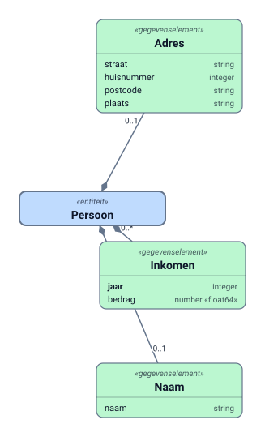

# GBO-voorbeeld — PJ's FTV GraphQL-profiel vanuit het canoniek model

Het voorbeeld uit het FTV GraphQL-profiel (Peter-Jan Karens, draft-01, september 2026;
slides *AuthZEN & GraphQL* 29-09) nagebouwd langs ónze keten: **canoniek model → GraphQL-
schema + policybundel**, en het beleid **in Toegangsspraak → ODRL → PDP**. Twee PDP-varianten
draaien op dezelfde veldrecords en geven dezelfde beslissingen als PJ's Rego:

| Variant | Wat | Per evaluatie (query `inkomens-2024`, 6 veldrecords) |
|---|---|---|
| `bundel/pj/` | PJ's vaste `ftv/graphql.rego` (slides 17–18) + **uit ODRL gegenereerde** `rules/*.rego` in zijn stijl (slides 15–16) — de roundtrip ODRL → Rego | **179 µs** (OPA, `opa bench`) |
| `bundel/data/` | zelfde vaste deel, maar regels als **data** met index (`data.json`) en de NLGov-leftOperands als predicaten (`nlgov/cond.rego`) | **158 µs** (OPA) |
| `scripts/pdp_odre.py` | **native ODRL**: pyodre (ODRE, UPM) evalueert per gebonden regel de oorspronkelijke ODRL-constraints | **5–11 ms** per query (≈ 2 ms per veldrecord; rdflib parst de permission per evaluatie) |

Achtergrond en analyse: `docs/plans/2026-09-30 FTV GraphQL-profiel (GBO) versus modelpaden —
uitvoerbaarheid van ODRL in de PDP.md`.

## Het model

`model/gbo-persoon — v3-model.json` — Persoon met de gegevenselementen Naam, Adres en Inkomen
(meervoudig). Getekend met dezelfde tekenaar als Studio en de render-API
(`web/vite/src/diagramsvg`, `node scripts/render_diagram.mjs`):



Eén verschil met PJ's schema: bij hem is `Persoon.naam` een scalar; in het canoniek model leeft
elke eigenschap in een gegevenselement (hub + `_Data`), dus `naam { naam }`. Daardoor is
`Persoon.naam` een objectveld (edge) met type `Naam`; de regel dekt hem via `covers_fields` +
`covers_types`, precies zoals PJ het voor `adres` doet.

`model/api-profiel.json` bevat wat níet in het model hoort maar wél nodig is voor schema en
bundel: het root-veld `persoon(bsn)` met de betrokkene-identificatie, het argument
`inkomens(jaren)`, en de vertaling van "het jaar van de aanvraag" naar dat argument (elk jaar).

## De keten

```
beleid/gbo-persoon.toegangsspraak ─parser+odrl.js─▶ beleid/gbo-persoon.odrl.json
                                                            │
model/gbo-persoon — v3-model.json + api-profiel.json ───────┤ scripts/compiler.py
                                                            ▼
bundel/schema.graphql (SDL)            ← gbo_model.py   (GBO-projectie van het model)
bundel/padtabel.json                   ← registerpad ENT.GE.veld → ParentType.field
bundel/data/data.json (+ index)        ← regels als data, PIP-data (toestemming, autorisaties)
bundel/pj/rules/*.rego                 ← dezelfde regels in PJ's stijl
                                                            │
queries/*.json ─scripts/mapper.py (graphql-core)─▶ bundel/requests/*.authzen.json (veldrecords)
                                                            │
                                    scripts/pdp_opa.py (Docker OPA) · scripts/pdp_odre.py (pyodre)
```

`bash scripts/run.sh` draait alles; zie de kop van dat script voor de vereisten (node, python
met `scripts/requirements.txt`, Docker).

### Het beleid in Toegangsspraak

```
Beleid "GBO persoon".
  Doel: "inkomensverstrekking".

  Begrippen.
    Een afnemer is: iemand met rol "afnemer".
    Een geautoriseerde afnemer is: iemand met autorisatie "naam-en-adres".
    Inkomensgegevens zijn: alle gegevens van het inkomen van een persoon.

  Regel "persoon op bsn".
    Een afnemer mag alle gegevens van een persoon bekijken
    als er een toestemming voor de betrokkene is.

  Regel "naam en adres".
    Een geautoriseerde afnemer mag de naam van een persoon bekijken.

  Regel "adres".
    Een geautoriseerde afnemer mag het adres van een persoon bekijken.

  Regel "inkomens tot en met 2024".
    Een afnemer mag de inkomens van een persoon bekijken
    als het jaar van de aanvraag ten hoogste 2024 is.

  Regel "inkomen velden".
    Een geautoriseerde afnemer mag de inkomensgegevens bekijken.
```

Dit zijn PJ's vier regels (persoon-op-bsn, naam-en-adres, inkomens-tot-en-met-2024,
inkomen-velden), met adres als aparte regel omdat een Toegangsspraak-regel één gegevensselectie
heeft. De parser en `odrl.js` zijn de echte uit `web/vite/src/toegangsspraak`.

### Afbeelding ODRL → veldsleutels (compiler-keuzes)

| ODRL-target | Betekenis | covers_fields | covers_types |
|---|---|---|---|
| `nlgov:register:Persoon` (entiteit) | het root-veld | `Query.persoon` | — |
| `nlgov:register:Persoon.Naam` (GE, zonder argument-conditie) | het element en zijn velden (`partOf`) | `Persoon.naam` | `Naam` |
| `nlgov:register:Persoon.Inkomen` (GE, **mét** argument-conditie) | alleen het veld dat de argumenten draagt (profiel §8.3: argumenten erven nooit) | `Persoon.inkomens` | — |
| AssetCollection "alle gegevens van het inkomen" | alleen de velden | — | `Inkomen` |
| `nlgov:register:Persoon.Adres.plaats` (veld) | één blad | `Adres.plaats` | — |

De gegenereerde `bundel/pj/rules/*.rego` komen zo uit op PJ's vorm, bv.
`inkomens-tot-en-met-2024`:

```rego
package rules["inkomens-tot-en-met-2024"]
import rego.v1
import input.field
import input.subject
covers_fields := {"Persoon.inkomens"}
allow if {
	subject.properties.role == "afnemer"
	jaren := field.args.jaren
	jaren.origin != "schema-default"
	every w in jaren.value { w <= 2024 }
}
```

### Resultaten (alle drie de PDP's gelijk)

| Query | Records | Beslissing | Geweigerd |
|---|---|---|---|
| `toegestaan` (slide 12 links) | 6 | allow | |
| `inkomens-2024` (slide 14) | 6 | allow | |
| `inkomens-2025` (slide 14) | 4 | deny | `persoon.inkomens` |
| `inkomens-zonder-jaren` (slide 14) | 3 | deny | `persoon.inkomens` |
| `geen-toestemming` (slide 15) | 3 | deny | `persoon` |
| `zonder-autorisatie` | 3 | deny | `persoon.naam`, `persoon.naam.naam` |
| `alias-en-fragment` (slide 19) | 3 | allow | |

## Bevindingen

- **Roundtrip klopt.** ODRL uit Toegangsspraak → gegenereerde Rego in PJ's stijl geeft op alle
  zeven queries dezelfde beslissing als de data-gedreven bundel én als de native ODRL-evaluator.
  Het regelformaat van het profiel is dus een prima *compilatiedoel*; de *bron* kan NLGov-ODRL zijn.
- **Snelheid.** OPA: ~160–180 µs per query van zes records (ruim onder de HTTP-hop). pyodre:
  ~2 ms per record, omdat elke evaluatie de permission opnieuw als RDF parst — bruikbaar voor
  doorrekenen in de editor, niet als per-request-PDP. Beide zijn "snel" in absolute zin; het
  verschil zit in de orde van grootte en in wat pyodre níet doet (binding, assignee, PIP).
- **ODRL kent geen query-nesting, en dat hoeft niet.** De mapper vlakt af; per record is er één
  ODRL-vraag tegen het registerpad of een voorouder (`partOf` ≙ `covers_types`).
- **`odrl.js`: "alle gegevens van X" als los target is niet te onderscheiden van "X".** In een
  begrip wordt het wél een AssetCollection (met `source`), en daar leunt de compiler op. Voorstel:
  ook een directe "alle gegevens van …"-selectie als AssetCollection exporteren.
- **pyodre-beperkingen** (v1.0.6): alleen `odrl:dateTime` als leftOperand en `eq/lt/gt/lteq/gteq/neq`
  als operatoren; geen `isAnyOf`, geen target-matching, geen assignee. Uitbreiding kan via de
  prefix-mapping en functies in de interpreter-namespace (zie `pdp_odre.py`) — dat is legitiem
  ODRE-gebruik, maar de "PDP" is dan grotendeels de schil eromheen.
- **`Persoon.naam` als edge** laat het type-versus-pad-punt zien: de regel op `Naam` geldt voor
  élke `Naam` in het schema, niet alleen voor die van Persoon. In dit model is dat hetzelfde; in
  een model met gedeelde GE-typen niet (zie de analyse, §2.1).
