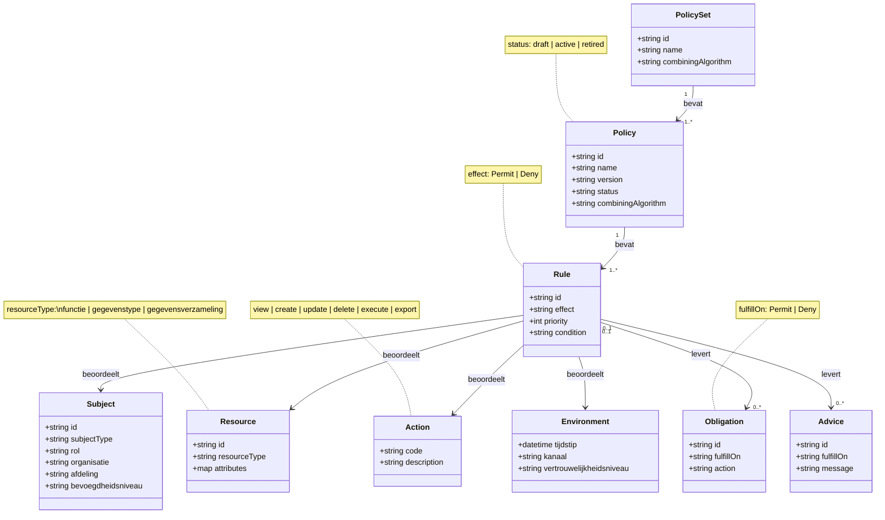

# Autoriseren in een canoniek model (PBAC + PxP)

## Doel en scope
Dit document beschrijft een standaard en praktisch bruikbare manier om autorisaties vast te leggen voor:
- het uitvoeren van functies, processen en deelprocessen
- het zien, wijzigen en verwijderen van gegevenstypen
- het zien van gegevensverzamelingen

De opzet is bedoeld voor gebruik binnen:
- PBAC (Policy Based Access Control)
- PxP patroon: PIP, PAP, PDP, PEP
- een canoniek gegevensmodel in UML

## Kernadvies
Gebruik XACML 3.0 als referentiemodel voor begrippen en policy-evaluatie, en leg policies leesbaar vast in een DSL zoals ALFA of Cedar.

Waarom dit werkt:
- XACML is de volwassen standaard voor policy-gebaseerde autorisatie.
- XACML sluit direct aan op PxP (PAP/PDP/PEP/PIP).
- ALFA en Cedar maken policies voor mensen beter leesbaar en onderhoudbaar.

## Begrippenkader
Autorisatiebeslissingen worden bepaald op basis van vier assen:
- Subject: wie vraagt toegang (gebruiker, rol, team, systeem)
- Resource: waarop wordt toegang gevraagd (functie, representatie, gegevensverzameling)
- Action: wat wil men doen (view, create, update, delete, execute)
- Environment: context (tijd, kanaal, locatie, vertrouwelijkheidsniveau)

Dit sluit 1-op-1 aan op klassieke policymodellen.

## Relatie met jouw domeinmodel
Voor jouw Representatie - Entiteit - Gegevenselement - Relatie model is de resource-as als volgt te structureren:

- ResourceType `functie`
  - Voorbeelden: registreren, valideren, muteren, replay uitvoeren, export draaien

- ResourceType `gegevenstype`
  - Voorbeelden: Entiteit `NatuurlijkPersoon`, Gegevenselement `Naam`, Relatie `Bereikbaarheid`
  - Acties: view, create, update, delete

- ResourceType `gegevensverzameling`
  - Voorbeelden: zoekresultaten, rapportagesets, samengestelde views
  - Acties: view, export

## Canoniek autorisatiemodel in UML
Modelleer in UML minimaal de volgende concepten:

- Subject
  - id
  - subjectType (user, service)
  - attributes (rol, organisatie, afdeling, bevoegdheidsniveau)

- Action
  - code (view, create, update, delete, execute, export)
  - description

- Resource
  - id
  - resourceType (functie, gegevenstype, gegevensverzameling)
  - attributes (metatype, classificatie, eigenaar, bron)

- Policy
  - id
  - name
  - version
  - status (draft, active, retired)
  - combiningAlgorithm (deny-overrides, permit-overrides, first-applicable)

- Rule
  - id
  - effect (Permit, Deny)
  - priority
  - condition (expressie over Subject, Resource, Action, Environment)

- Obligation (optioneel)
  - acties die verplicht zijn bij Permit of Deny (bijv. logging, masking)

- Advice (optioneel)
  - niet-verplichte aanwijzingen voor afhandeling

Belangrijke associaties:
- Policy bevat 1..n Rules
- Rule beoordeelt Subject + Resource + Action + Environment
- Rule kan 0..n Obligations en 0..n Advice opleveren

### Mermaid class diagram



## Mapping naar PxP
Gebruik de volgende taakverdeling:

- PAP (Policy Administration Point)
  - beheert policydefinities, versies, publicatie en deactivering

- PIP (Policy Information Point)
  - levert attributen van Subject, Resource en Environment
  - haalt resource-metadata uit MetaRegistry (metatype, padnaam, type-informatie)

- PDP (Policy Decision Point)
  - evalueert request tegen policies
  - produceert Permit, Deny, NotApplicable of Indeterminate

- PEP (Policy Enforcement Point)
  - dwingt beslissing af in API, backend-services en eventueel frontend
  - voert obligations uit (bijv. audit-log)

## Advies voor policy-structuur
Gebruik een gelaagde policyset:

1. Basispolicies
- standaard deny op alles tenzij expliciet toegestaan
- uitzonderingen alleen expliciet en traceerbaar

2. Domeinpolicies
- rechten per domein, proces of representatietype

3. Contextpolicies
- extra voorwaarden op tijd, kanaal, vertrouwelijkheidsniveau

4. Nood- en beheerpaden
- break-glass regels met extra logging en verantwoording

Aanbevolen combining algorithm:
- deny-overrides als veilige standaard

## Voorbeeldnotatie (conceptueel, XACML-achtig)

```text
Policy: NP_lezen_intern
Target:
  Subject.role in {"raadpleger", "behandelaar"}
  Resource.resourceType == "gegevenstype"
  Resource.type in {"NatuurlijkPersoon", "Naam", "Persoonsidentificatie"}
  Action == "view"
Rule:
  Effect: Permit
  Condition:
    Environment.channel == "intern"
```

## Voorbeeldnotatie (Cedar stijl)

```cedar
permit(
  principal in Role::"behandelaar",
  action == Action::"execute",
  resource == Proces::"registratie_np"
);

permit(
  principal in Role::"raadpleger",
  action in [Action::"view"],
  resource is Representatie
) when {
  resource.metatype in ["entiteit", "gegevenselement", "relatie"]
};

forbid(
  principal in Role::"extern",
  action == Action::"view",
  resource == Verzameling::"bsn_register"
);
```

## ALFA vs Cedar — vergelijking

### Herkomst en positionering

| Aspect | ALFA | Cedar |
|---|---|---|
| Voluit | Abbreviated Language for Authorization | Cedar (geen acroniem) |
| Gemaakt door | Axiomatics (commercieel, nu Ping Identity) | Amazon Web Services (open source, 2023) |
| Standaard | Compileert naar XACML 3.0 | Eigenstandig, met formele semantiek |
| Rijpheid | Volwassen, 10+ jaar bestaan | Relatief nieuw, snel groeiend |
| Open source | Nee (taal is open, tooling commercieel) | Ja (Apache 2.0) |

### Overeenkomsten

Beide talen:
- bieden een leesbare DSL als alternatief voor XACML-XML
- werken met Subject / Resource / Action als kernassen
- ondersteunen Permit en Deny als beslissingseffecten
- zijn bedoeld voor PBAC / ABAC beleidsnotatie
- ondersteunen een expliciete Deny die een Permit kan overrulen
- kennen condities (`when` / `condition`) voor contextafhankelijke regels
- zijn geschikt voor gelaagde policies (meerdere regels per policy)

### Verschillen in detail

#### Syntaxmodel

ALFA heeft een geneste structuur die dicht bij XACML ligt:

```alfa
policyset NatuurlijkPersoonPolicies {
  apply denyOverrides

  policy NP_Lezen {
    target clause Attributes.subjectRole == "raadpleger"
    apply permitOverrides

    rule LezenToegestaan {
      target clause Attributes.resourceType == "gegevenstype"
               and Attributes.action == "view"
      permit
      condition Attributes.channel == "intern"
    }
  }
}
```

Cedar heeft een vlakkere, compactere stijl:

```cedar
permit(
  principal in Role::"raadpleger",
  action == Action::"view",
  resource is Representatie
) when {
  resource.metatype in ["entiteit", "gegevenselement"] &&
  context.kanaal == "intern"
};
```

#### Semantiek en typesysteem

| Aspect | ALFA | Cedar |
|---|---|---|
| Typesysteem | Zwak getypeerd (strings dominant) | Sterk getypeerd (entities, sets, records) |
| Formele verificatie | Beperkt | Formeel bewezen correct (Lean4) |
| Schema-validatie | Via XACML PIP-definitie | Via cedar-schema bestand |
| Entiteitshiërarchie | Via attribuutwaarden | Ingebouwd, eerste klas concept |
| Namespace / entiteittype | Via attribuutstring | `Type::"id"` notatie, type-veilig |

#### Tooling en ecosysteem

| Aspect | ALFA | Cedar |
|---|---|---|
| IDE-ondersteuning | Axiomatics Eclipse plugin, beperkt | VS Code extensie, CLI, Rust/Go/Java SDK |
| CLI | Commercieel | `cedar` CLI open source |
| Evaluatieengine | Axiomatics PDP (commercieel) | `cedar-policy` crate (Rust, open source) |
| Taaloutput | XACML 3.0 XML | Eigen binair/JSON formaat |
| Cloudintegratie | Neutraal | AWS (AVP = Amazon Verified Permissions) |
| Community | Klein, professioneel | Groeiend, open source actief |

#### Expressiviteit

| Aspect | ALFA | Cedar |
|---|---|---|
| Obligations | Ja (conform XACML) | Nee (bewust weggelaten) |
| Advice | Ja (conform XACML) | Nee |
| Combining algorithms | Alle XACML-varianten | Impliciet: permit tenzij forbid wint |
| Negatie in condities | Ja | Ja (`!`, `unless`) |
| Verzamelingen | Via XACML bags | Ingebouwd als eerste klas type |
| Hiërarchische resources | Via attribuutfiltering | Via entiteitstype en `in`-operator |

### Kracht en zwakte

#### ALFA

Krachten:
- directe compilatie naar XACML 3.0 maakt integratie met bestaande XACML-engines eenvoudig
- volledig model: Obligations en Advice zijn onderdeel van de taal
- bewezen in grote enterprise-omgevingen
- alle combining algorithms uit XACML beschikbaar
- formele XACML semantiek = maximale standaardconformiteit

Zwakten:
- tooling is grotendeels commercieel of verouderd
- verbosere syntax dan Cedar bij eenvoudige policies
- zwak getypeerd: fouten in attribuutnamen worden laat ontdekt
- kleine community buiten enterprise IAM-wereld
- afhankelijkheid van Axiomatics/Ping Identity voor productiewaardige tooling

#### Cedar

Krachten:
- formeel bewezen correct (verificatie via Lean4)
- sterk getypeerd met schema-validatie: typefouten vroegtijdig gevonden
- compacte, leesbare syntax
- volledig open source, actieve community
- entiteitshiërarchie als eerste klas concept (past goed bij OOP/UML-domeinmodellen)
- verzamelingen en records ingebouwd
- bruikbaar zonder cloud-lock-in ondanks AWS-herkomst

Zwakten:
- geen Obligations of Advice: verplichte bijacties (logging, maskering) moeten buiten de policy worden geregeld
- combining algorithm is vereenvoudigd: `forbid` wint altijd van `permit`; geen fijnmaziger algoritmen
- relatief jong: minder productietrack-record dan XACML/ALFA
- AWS-oorsprong roept bij sommige organisaties vendor-associaties op
- schema is verplicht voor typecontrole: extra beheerwerk

### Wanneer kies je wat?

| Situatie | Aanbeveling |
|---|---|
| Bestaande XACML-omgeving | ALFA — directe compilatie naar XACML |
| Obligations verplicht (logging, maskering) | ALFA — Cedar ondersteunt dit niet |
| Open source, geen vendorlock | Cedar |
| Sterke typeveiligheid gewenst | Cedar — formeel bewezen |
| Integratie met AWS-diensten | Cedar (AVP) |
| Maximale standaardconformiteit (OASIS) | ALFA / XACML |
| Klein team, leesbare policies | Cedar — compacter en eenvoudiger |
| Domeinmodel is entiteitshierarchisch (UML) | Cedar — entiteitstypen zijn eerste klas |

### Advies voor dit project

Gegeven de architectuur van dit project (UML domeinmodel, MetaRegistry als PIP, Go/API-gedreven) is Cedar de betere keuze als notatietaal:
- entiteitstypen sluiten aan op jouw Representatie/Entiteit/GE-model
- open source tooling past bij de open architectuur
- schema-bestand kan worden gegenereerd vanuit de MetaRegistry
- compacte syntax maakt policies goed beheerbaar naast de Go-code

Gebruik XACML uitsluitend als conceptueel referentiemodel voor de PxP-architectuur en termendefinities.
Implementeer Obligations (logging, maskering) als PEP-middleware buiten de policy-engine.

## Fijnmazigheid van rechten
Leg rechten niet alleen op topniveau vast. Gebruik meerdere granulariteitslagen:

- functieniveau
  - execute op proces/deelproces

- type-niveau
  - CRUD op representatietype

- instantie-niveau (optioneel)
  - rechten op specifieke records of subsets

- veldniveau (optioneel)
  - toegestaan, gemaskeerd of volledig verboden

- set-niveau
  - rechten op queryresultaten, views, exports en rapportages

## Inpassing in MetaRegistry-gedreven architectuur
Voor jouw model is dit een sterke route:

- MetaRegistry blijft de bron voor resource-beschrijving.
- Autorisatiemodel voegt policy-semantiek toe.
- PIP leest typekenmerken uit MetaRegistry en levert die als attributen aan PDP.
- PEP gebruikt beslissing voor route-toegang, query-filtering en veldmaskering.

Praktische attributen vanuit MetaRegistry:
- metatype
- padnaam
- typenaam
- isMaterieel
- relationele context (onderliggende elementen)

## Beheer en governance
Minimale governance-afspraken:

- versioneer policies altijd
- koppel policywijzigingen aan change- en releaseproces
- maak policytests verplicht in CI
- leg audittrail vast van besluit en gebruikte attributen
- hanteer standaard naming conventies voor policies en rules

Aanbevolen policy naming:
- <domein>_<resource>_<actie>_<context>
- voorbeeld: brp_natuurlijkpersoon_view_intern

## Teststrategie
Test minimaal op drie niveaus:

1. Unit tests (PDP)
- policy-evaluatie met synthetische attributensets

2. Integratietests (PEP + PDP + PIP)
- volledige requestflow met echte metadata-attributen

3. Regressietests
- bij elke policywijziging automatische vergelijking van beslismatrix

Beslismatrix per testgeval:
- subject
- action
- resource
- environment
- expectedDecision

## Migratiepad (stapsgewijs)

1. Definieer canoniek UML autorisatiemodel met Subject, Resource, Action, Policy, Rule.
2. Leg resource-taxonomie vast: functie, gegevenstype, gegevensverzameling.
3. Introduceer standaard actieset: view, create, update, delete, execute, export.
4. Bouw PIP-adapter die MetaRegistry-attributen omzet naar policy-attributen.
5. Implementeer PDP met deny-overrides als start.
6. Plaats PEP op API-routes en op datalevering (masking/filtering).
7. Voeg policy testset en auditlogging toe aan CI/CD.

## Conclusie
Een goede, standaardmatige aanpak voor jouw situatie is:
- conceptueel en architecturaal referentiemodel: XACML 3.0 (PxP-architectuur, begrippenkader)
- beleidsnotatietaal: Cedar voor nieuwe implementaties, ALFA bij bestaande XACML-omgevingen
- architectuur: PxP met duidelijke PAP/PIP/PDP/PEP scheiding
- datamodel: canoniek UML model met drie resourcefamilies (functie, gegevenstype, gegevensverzameling)
- implementatie: MetaRegistry als resource-attributenbron voor de PIP
- diagram: Mermaid class diagram in dit document als levende documentatie

Deze combinatie is voldoende formeel voor governance en audit, en tegelijk praktisch genoeg om in code en configuratie beheersbaar te blijven.

Cedar verdient de voorkeur door de formele correctheidsgaranties, het type-veilige schema, en de open source-toolchain die goed aansluit op een API-gedreven Go-architectuur met een UML-gebaseerd domeinmodel.
