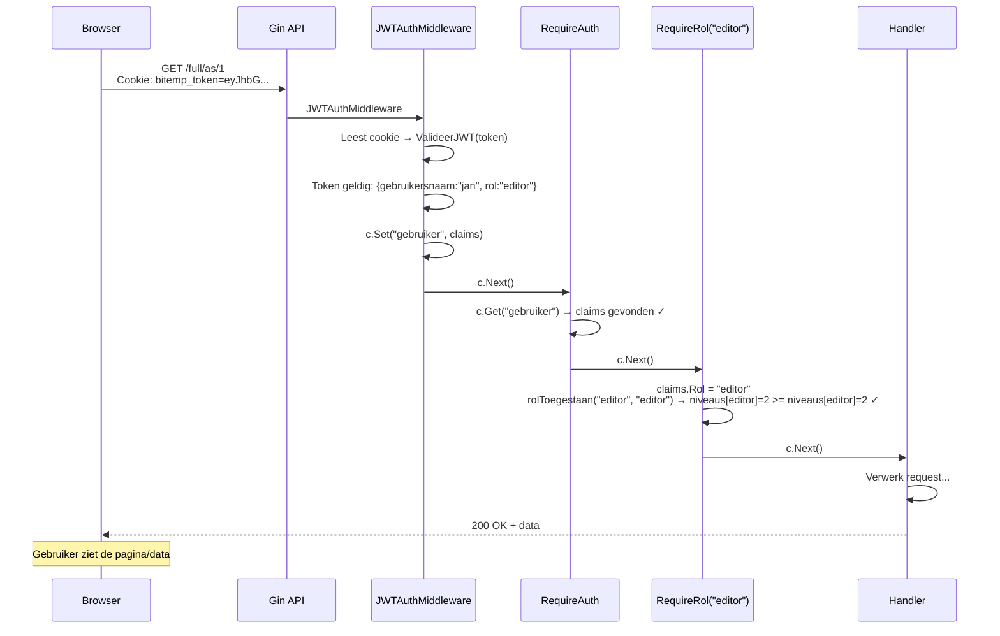
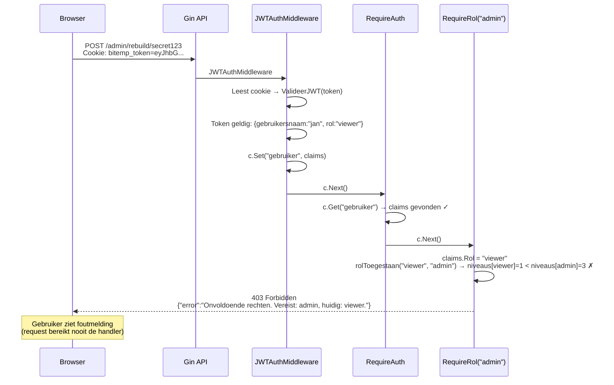
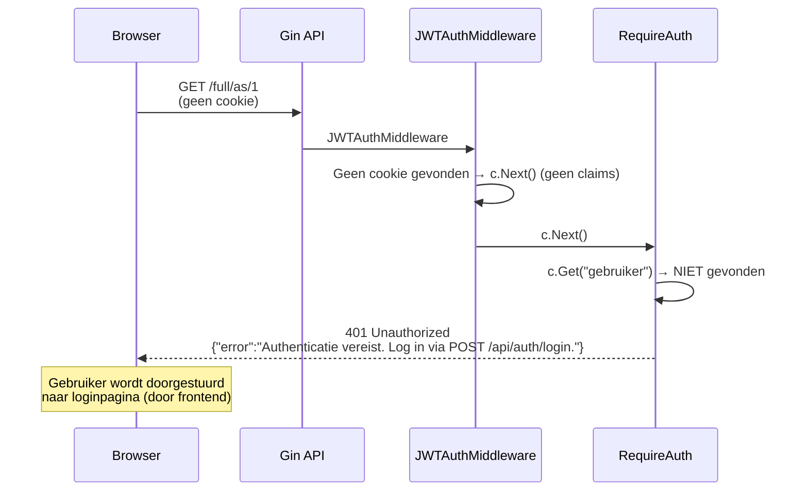
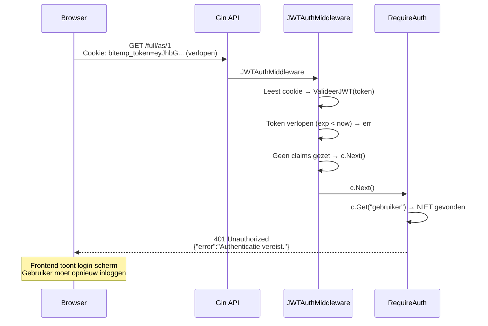
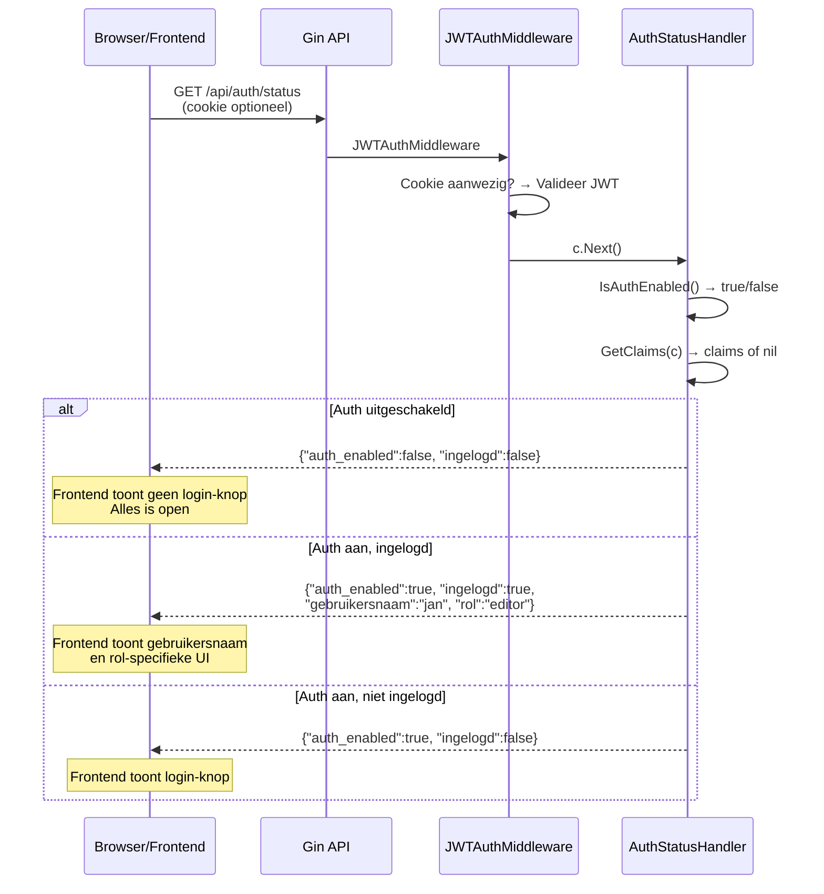

# Autorisatie & Authenticatie — Developer Guide

> Ontwikkelaarshandleiding voor het authenticatie- en autorisatiesysteem van bitemp_register_v06.
> Laatst bijgewerkt: 2026-04-17.

---

## Inhoudsopgave

1. [Woordenlijst](#1-woordenlijst)
2. [Architectuuroverzicht](#2-architectuuroverzicht)
3. [Hoe werkt het — stap voor stap](#3-hoe-werkt-het--stap-voor-stap)
4. [Scenario's met sequence-diagrammen](#4-scenarios-met-sequence-diagrammen)
5. [Bestanden en verantwoordelijkheden](#5-bestanden-en-verantwoordelijkheden)
6. [Database: Gebruiker-tabel](#6-database-gebruiker-tabel)
7. [Feature flag: AUTH_ENABLED](#7-feature-flag-auth_enabled)
8. [Rollen en hiërarchie](#8-rollen-en-hiërarchie)
9. [OpenFTV sidecar](#9-openftv-sidecar)
10. [Veelgestelde vragen](#10-veelgestelde-vragen)

---

## 1. Woordenlijst

| Term | Uitleg |
|------|--------|
| **Authenticatie** | Vaststellen *wie* je bent (identiteit). Bij ons: gebruikersnaam + wachtwoord → JWT-token. |
| **Autorisatie** | Vaststellen *wat* je mag (rechten). Bij ons: rolgebaseerd (viewer/editor/admin) + OpenFTV PDP. |
| **Middleware** | Code die *tussen* het binnenkomende HTTP-request en de uiteindelijke handler zit. Vergelijk het met een reeks filters in een pijplijn: elk filter kan het request inspecteren, verrijken of afwijzen voordat het de volgende schakel (of de uiteindelijke endpoint-handler) bereikt. In Gin registreer je middleware via `router.Use(...)`. Ons systeem heeft vier middlewares: CORS, RequestBodyLogger, JWTAuthMiddleware en AuthzPEPMiddleware. |
| **Token** | Een digitaal "pasje" dat bewijst wie je bent. Bij ons een **JWT** (JSON Web Token): een base64-gecodeerde string met drie delen (header.payload.signature). Het bevat je gebruikersnaam, rol en verloopdatum, ondertekend met een geheim (HS256). |
| **JWT** | **JSON Web Token** — een open standaard (RFC 7519) voor het veilig overdragen van claims (informatie) tussen twee partijen. De server ondertekent het token; de server kan het later verifiëren zonder database-lookup. |
| **httpOnly cookie** | Een cookie die de browser *wel* automatisch meestuurt bij elk request, maar die *niet* leesbaar is vanuit JavaScript. Dit beschermt tegen XSS-aanvallen (cross-site scripting). |
| **CORS** | **Cross-Origin Resource Sharing** — een browsermechanisme dat bepaalt of een webpagina op domein A (bijv. `localhost:5173`) requests mag doen naar domein B (bijv. `localhost:8082`). Onze CORS-middleware staat specifieke origins toe en stuurt `Access-Control-Allow-Credentials: true` mee zodat cookies over cross-origin requests werken. |
| **Sidecar** | Een apart draaiend proces (vaak een Docker-container) dat naast je hoofdapplicatie draait en een specifieke taak vervult. In ons geval is de **OpenFTV sidecar** een set containers (PDP, Manager, MI, DB) die naast de Go API draaien en autorisatiebeleid evalueren. De API roept de sidecar aan, niet andersom. |
| **PDP** | **Policy Decision Point** — het component dat een autorisatievraag beantwoordt: "mag deze gebruiker deze actie op deze resource?" → ja/nee. Bij ons: OpenFTV PDP (draait op poort 9004). |
| **PAP** | **Policy Administration Point** — het component waar je autorisatiebeleid beheert (aanmaken, wijzigen, verwijderen van policies). Bij ons: de OpenFTV Manager. |
| **PIP** | **Policy Information Point** — het component dat extra informatie levert die nodig is voor een autorisatiebeslissing (bijv. roldefinities, pagina-eigenschappen). Bij ons ingebouwd in de OpenFTV Manager via de `data/entities/` JSON-bestanden. |
| **PEP** | **Policy Enforcement Point** — het component dat de autorisatiebeslissing *afdwingt*. Bij ons: de `AuthzPEPMiddleware()` in `middleware/authz_pep.go` — een Gin middleware die het PDP-antwoord controleert en bij `decision: false` een 403 Forbidden retourneert. Geactiveerd met `AUTHZ_PDP_ENABLED=true`. |
| **AuthZEN** | Een open standaard voor autorisatie-evaluatie-API's. Definieert een POST-endpoint met een vaste structuur: `{subject, action, resource, context}` → `{decision: bool}`. OpenFTV implementeert deze standaard. |
| **Rego** | De beleidstaal van **OPA** (Open Policy Agent). Declaratief: je beschrijft *regels* die evalueren naar true/false. Ons beleid staat in `authz/manager/policies/bitemp_authz.rego`. |
| **OPA** | **Open Policy Agent** — een open-source policy engine. Evalueert Rego-beleid. OpenFTV kan OPA als engine gebruiken (naast Cedar, Cerbos, OpenFGA). |
| **Bundle** | Een pakket van policies + data dat de OpenFTV Manager distribueert naar de PDP. De PDP haalt periodiek de nieuwste bundle op van de Manager, zodat beleidswijzigingen automatisch worden doorgepropt. |
| **bcrypt** | Een wachtwoord-hashalgoritme dat bewust traag is (om brute-force aanvallen moeilijker te maken). Wachtwoorden worden nooit als leesbare tekst opgeslagen; alleen de hash staat in de database. |
| **Feature flag** | Een aan/uit-schakelaar (bij ons `AUTH_ENABLED` environment variable) waarmee je een feature kunt in- of uitschakelen zonder code te wijzigen. Default is `false` (auth uit), zodat bestaande workflows niet breken. |
| **Seed** | Het automatisch aanmaken van initiële data bij het starten van de applicatie. Bij ons: `SeedAdminGebruiker()` maakt een admin-gebruiker aan als `ADMIN_USERNAME` en `ADMIN_PASSWORD` zijn ingesteld. |
| **Gin** | Het Go web-framework dat we gebruiken voor HTTP routing en middleware. Vergelijkbaar met Express.js (Node) of Flask (Python). |
| **Bun** | De Go ORM (Object-Relational Mapper) die we gebruiken voor database-interactie met PostgreSQL. Vertaalt Go structs naar SQL en terug. |

---

## 2. Architectuuroverzicht

```
┌─────────────────────────────────────────────────────────────────────┐
│                          Browser (React)                            │
│  Stuurt requests met httpOnly cookie (bitemp_token) naar de API    │
└─────────────┬───────────────────────────────────────────────────────┘
              │ HTTP request + cookie
              ▼
┌─────────────────────────────────────────────────────────────────────┐
│                     Gin Router (Go API, :8082)                      │
│                                                                     │
│  ┌────────────┐   ┌────────────────┐   ┌──────────────────────┐    │
│  │    CORS    │──▶│ JWTAuthMiddle- │──▶│  RequireAuth()       │    │
│  │ middleware │   │ ware()         │   │  RequireRol("editor")│    │
│  └────────────┘   └────────────────┘   └──────────┬───────────┘    │
│                          │                         │                │
│                   Extraheert JWT                   │                │
│                   uit cookie, valideert,     Blokkeert als         │
│                   zet claims in context      rol onvoldoende       │
│                          │                         │                │
│                          ▼                         ▼                │
│                   ┌────────────────────────────────────┐            │
│                   │         Endpoint Handler           │            │
│                   │  (LoginHandler, GetEntiteiten, …) │            │
│                   └────────────────────────────────────┘            │
│                                                                     │
│  Plumbing tabellen:                                                 │
│   ┌───────────┐  ┌────────────┐  ┌────────────┐                   │
│   │ gebruiker │  │ registratie│  │ wijziging   │                   │
│   └───────────┘  └────────────┘  └────────────┘                   │
└─────────────────────────────────────────────────────────────────────┘
              │
              │ (Phase 3: AuthZEN call)
              ▼
┌─────────────────────────────────────────────────────────────────────┐
│                  OpenFTV Sidecar (Docker)                           │
│                                                                     │
│  ┌──────────────┐    ┌──────────────┐    ┌──────────────┐          │
│  │   PDP :9004  │◀───│ Manager :9000│───▶│   MI :8180   │          │
│  │ (evaluatie)  │    │ (PAP + PIP)  │    │  (web UI)    │          │
│  └──────────────┘    └──────────────┘    └──────────────┘          │
│         ▲                    │                                      │
│         │ bundles            │ policies + data                     │
│         │────────────────────┘                                      │
│                    ┌──────────────┐                                 │
│                    │ openftv-db   │                                 │
│                    │  :5400 (PG)  │                                 │
│                    └──────────────┘                                 │
└─────────────────────────────────────────────────────────────────────┘
```

### Twee lagen van autorisatie

1. **Lokale rolcheck** (Phase 1): De Gin middleware (`RequireAuth()`, `RequireRol()`) controleert de rol uit het JWT-token. Snel, geen externe call. Altijd actief als `AUTH_ENABLED=true`.
2. **PDP-evaluatie** (Phase 3): De `AuthzPEPMiddleware()` stuurt een AuthZEN-request naar de OpenFTV PDP voor fijnmazige autorisatie. De PDP evalueert het Rego-beleid en retourneert `{decision: true/false}`. Actief als `AUTH_ENABLED=true` EN `AUTHZ_PDP_ENABLED=true`.

---

## 3. Hoe werkt het — stap voor stap

### 3.1 Gebruiker-tabel in de database

De `Gebruiker` struct in `model/gebruiker.go` is een **plumbing-tabel** — geen bitemporele representatie. Dat betekent:

- Geen `opvoer`/`afvoer` (formele tijd)
- Geen `aanvang`/`einde` (materiële tijd)
- Geen registratiesysteem of wijzigingsaudittrail
- Gewoon een standaard CRUD-tabel

> **Kan dat later bitemporeel worden?** Ja, absoluut. De `Gebruiker` kan op elk moment worden omgezet naar een volwaardige bitemporele representatie via de MetaRegistry. Voor nu is een simpele tabel pragmatisch: authenticatie is plumbing, niet domeindata.

De tabel wordt aangemaakt in `dbsetup/createtables.go`:

```go
// In CreateTables():
_, err = db.NewCreateTable().
    Model((*model.Gebruiker)(nil)).
    IfNotExists().
    Exec(ctx)
```

Dit werkt via **Bun ORM**: Bun leest de struct-tags (`bun:"table:gebruiker,alias:g"`, `bun:"id,pk,autoincrement"`, etc.) en genereert automatisch de juiste `CREATE TABLE IF NOT EXISTS` SQL. Je hoeft geen handmatige DDL te schrijven.

### 3.2 Wachtwoord-hashing

Wachtwoorden worden **nooit** als leesbare tekst opgeslagen. De flow:

1. Bij **seed** of **registratie**: `bcrypt.GenerateFromPassword(password, bcrypt.DefaultCost)` → hash
2. Bij **login**: `bcrypt.CompareHashAndPassword(storedHash, inputPassword)` → match of niet
3. De hash staat in kolom `wachtwoord_hash`; de JSON-tag is `json:"-"` (wordt nooit naar de client gestuurd)

### 3.3 JWT-generatie en -validatie

Na succesvolle login genereert `middleware.GenereerJWT()`:

```
Header:   {"alg": "HS256", "typ": "JWT"}
Payload:  {"sub": "jan", "iss": "bitemp-register-v06",
           "iat": 1713350400, "exp": 1713436800,
           "gebruikersnaam": "jan", "rol": "editor", "email": "jan@example.com"}
Signature: HMAC-SHA256(header + "." + payload, JWT_SECRET)
```

Het token wordt als **httpOnly cookie** meegegeven:
- **Naam**: `bitemp_token`
- **httpOnly**: `true` (niet leesbaar door JavaScript)
- **Secure**: `true` in release-mode (`GIN_MODE=release`), `false` lokaal
- **SameSite**: `Lax` (bescherming tegen CSRF)
- **MaxAge**: `JWT_EXPIRY_HOURS * 3600` seconden (default: 24 uur)

### 3.4 Middleware-keten

Elke request doorloopt deze keten (geregistreerd in `routes/addroutes.go` → `SetupMiddleware()`):

```
Request binnenkomst
    │
    ▼
[1] corsMiddleware()        — Zet Access-Control-Allow-Origin header
    │
    ▼
[2] RequestBodyLogger()     — Logt POST/PUT/PATCH body (als APP_DEBUG_LOGS=1)
    │
    ▼
[3] JWTAuthMiddleware()     — Als AUTH_ENABLED=true:
    │                          • Leest cookie "bitemp_token"
    │                          • Valideert JWT (signature, expiry)
    │                          • Zet JWTClaims in Gin context (key: "gebruiker")
    │                          • Blokkeert NIET als cookie ontbreekt
    │                        Als AUTH_ENABLED=false:
    │                          • Doet niets (c.Next())
    ▼
[4] AuthzPEPMiddleware()    — Als AUTHZ_PDP_ENABLED=true:
    │                          • Mapt method+pad → AuthZEN actie+resource
    │                          • Stuurt evaluatieverzoek naar OpenFTV PDP
    │                          • Bij decision=false → 403 Forbidden
    │                          • Bij PDP-fout → fail-open (of fail-closed via AUTHZ_DENY_ON_ERROR)
    │                        Als AUTHZ_PDP_ENABLED=false:
    │                          • Doet niets (c.Next())
    ▼
[5] RequireAuth()           — Optioneel per route-groep:
    │                          • Checkt of "gebruiker" in context staat
    │                          • Zo nee: 401 Unauthorized
    ▼
[6] RequireRol("editor")   — Optioneel per route-groep:
    │                          • Checkt rol-hiërarchie
    │                          • Zo onvoldoende: 403 Forbidden
    ▼
    Endpoint handler (bijv. GetEntiteiten, LoginHandler, …)
```

### 3.5 Admin seed bij opstarten

In `main.go`, na database-connectie:

```go
if middleware.IsAuthEnabled() {
    if err := handlers.SeedAdminGebruiker(context.Background()); err != nil {
        fmt.Println("WARN: Admin-seed mislukt:", err)
    }
}
```

Dit leest `ADMIN_USERNAME` en `ADMIN_PASSWORD` uit de environment en maakt (eenmalig) een admin-gebruiker aan als die nog niet bestaat.

---

## 4. Scenario's met sequence-diagrammen

### 4.1 Eerste login (succesvolle authenticatie)

```mermaid
sequenceDiagram
    participant B as Browser
    participant G as Gin API
    participant MW as JWTAuthMiddleware
    participant H as LoginHandler
    participant DB as PostgreSQL

    B->>G: POST /api/auth/login<br/>{"gebruikersnaam":"jan","wachtwoord":"geheim"}
    G->>MW: (middleware keten — geen cookie aanwezig)
    MW->>MW: Geen cookie → c.Next() (geen claims gezet)
    MW->>H: Request doorgestuurd

    H->>DB: SELECT * FROM gebruiker<br/>WHERE gebruikersnaam='jan' AND actief=true
    DB-->>H: Gebruiker gevonden (met wachtwoord_hash)

    H->>H: bcrypt.CompareHashAndPassword(hash, "geheim") ✓
    H->>H: middleware.GenereerJWT("jan", "editor", "jan@example.com")
    H->>H: JWT-token aangemaakt

    H->>DB: UPDATE gebruiker SET laatste_login_op = NOW()

    H-->>B: 200 OK<br/>Set-Cookie: bitemp_token=eyJhbG...; HttpOnly; Path=/; SameSite=Lax<br/>{"bericht":"Succesvol ingelogd.","rol":"editor"}

    Note over B: Cookie wordt automatisch opgeslagen<br/>door de browser (niet leesbaar door JS)
```

### 4.2 Toegang tot een beschermde pagina (toegestaan)



### 4.3 Toegang tot een beschermde pagina (onvoldoende rechten)



### 4.4 Toegang zonder ingelogd te zijn



### 4.5 Verlopen token



### 4.6 Uitloggen

```mermaid
sequenceDiagram
    participant B as Browser
    participant G as Gin API
    participant H as LogoutHandler

    B->>G: POST /api/auth/logout<br/>Cookie: bitemp_token=eyJhbG...

    G->>H: (middleware keten doorlopen)

    H->>H: SetCookie("bitemp_token", "", maxAge=-1)
    H-->>B: 200 OK<br/>Set-Cookie: bitemp_token=; Max-Age=-1; HttpOnly<br/>{"bericht":"Uitgelogd."}

    Note over B: Browser verwijdert de cookie<br/>Volgende requests zijn anoniem
```

### 4.7 Auth status check (voor frontend)



### 4.8 PEP + PDP evaluatie (Phase 3)

```mermaid
sequenceDiagram
    participant B as Browser
    participant G as Gin API
    participant MW as JWTAuthMiddleware
    participant PEP as PEP Middleware
    participant PDP as OpenFTV PDP (:9004)
    participant H as Handler

    B->>G: POST /registreer<br/>Cookie: bitemp_token=eyJhbG...

    G->>MW: JWTAuthMiddleware
    MW->>MW: JWT geldig → claims in context
    MW->>PEP: c.Next()

    PEP->>PEP: Bouw AuthZEN request:<br/>{subject:{id:"jan",properties:{role:"editor"}},<br/>action:{name:"write"},<br/>resource:{type:"api",id:"registreer"}}

    PEP->>PDP: POST /authzen/v1/evaluation
    PDP->>PDP: Evalueer bitemp_authz.rego<br/>editor mag "write" op "api" → allow = true
    PDP-->>PEP: {"decision": true}

    PEP->>H: c.Next()
    H->>H: Verwerk registratie...
    H-->>B: 200 OK

    Note over PDP: Het Rego-beleid definieert de regels.<br/>De PDP evalueert; de PEP dwingt af.
```

---

## 5. Bestanden en verantwoordelijkheden

### Authenticatie (Phase 1)

| Bestand | Verantwoordelijkheid |
|---------|---------------------|
| `model/gebruiker.go` | **Struct definitie**: `Gebruiker` met Bun-tags voor DB-mapping en JSON-tags voor API-serialisatie. Definieert `Rol` type (admin/editor/viewer). Bevat `json:"-"` op `WachtwoordHash` zodat het wachtwoord nooit in een response verschijnt. |
| `dbsetup/createtables.go` | **Tabel-aanmaak**: Bun leest de `Gebruiker` struct-tags en genereert `CREATE TABLE IF NOT EXISTS gebruiker (…)`. Wordt aangeroepen bij elke startup → idempotent. |
| `middleware/auth_middleware.go` | **JWT-logica + middleware**: `GenereerJWT()` (maakt tokens), `ValideerJWT()` (parseert + verifieert), `JWTAuthMiddleware()` (extraheert cookie → context), `RequireAuth()` (401 als niet ingelogd), `RequireRol()` (403 als onvoldoende rol), `IsAuthEnabled()` (feature flag check). |
| `handlers/auth_handler.go` | **HTTP handlers**: `LoginHandler()` (credentials → JWT cookie), `LogoutHandler()` (verwijder cookie), `MeHandler()` (huidige gebruiker), `AuthStatusHandler()` (auth-status voor frontend), `SeedAdminGebruiker()` (initiële admin bij startup). |
| `main.go` | **Wiring**: registreert `/api/auth/*` routes en roept `SeedAdminGebruiker()` aan bij startup als auth is ingeschakeld. |
| `routes/addroutes.go` | **Middleware-registratie**: `SetupMiddleware()` registreert CORS, RequestBodyLogger en JWTAuthMiddleware op de Gin engine. |
| `.env.example` | **Configuratie-template**: documenteert alle auth-gerelateerde environment variables. |

### Autorisatie / OpenFTV (Phase 2)

| Bestand | Verantwoordelijkheid |
|---------|---------------------|
| `docker-compose.auth.yml` | Docker Compose voor OpenFTV sidecar (PDP, Manager, MI, DB). |
| `authz/manager/policies/bitemp_authz.rego` | Rego-beleid: rolhiërarchie, publieke/beschermde pagina's, API-toegangsniveaus. Dit is het **hoofdbeleid** dat de Manager distribueert naar de PDP via bundles. |
| `authz/manager/data/entities/pages.json` | Pagina-definities voor PIP (welke pagina's bestaan, met optionele `vereiste_rol`). |
| `authz/manager/data/entities/roles.json` | Roldefinities (admin/editor/viewer) met hiërarchie-niveaus. |
| `authz/manager/bundles/bitemp-pdp.yaml` | Bundleconfiguratie: welke policies/data worden naar de PDP gedistribueerd. |
| `authz/pdp/policies/bitemp_authz.rego` | Lokaal fallback-beleid voor de PDP (voor als bundles nog niet zijn geladen). |
| `authz/README.md` | Documentatie van de autorisatie-architectuur en configuratie. |

### PEP Middleware (Phase 3)

| Bestand | Verantwoordelijkheid |
|---------|---------------------|
| `authz/authzen_client.go` | **AuthZEN HTTP-client**: stuurt evaluatieverzoeken naar de OpenFTV PDP (`POST /authzen/v1/evaluation`). Bevat structs voor AuthZEN-protocol (`EvaluatieVerzoek`, `EvaluatieResultaat`), connection pooling, timeout (5s), en convenience-methode `EvalueerKort()`. Leest `OPENFTV_PDP_URL` (default: `http://localhost:9004`). |
| `middleware/authz_pep.go` | **PEP middleware**: `AuthzPEPMiddleware()` — mapt HTTP method+pad → AuthZEN actie+resource, stuurt evaluatieverzoek naar PDP, dwingt `decision: false` af met 403. Publieke paden (OPTIONS, `/api/auth/*`, `/viz/*`, etc.) slaan PDP over. Feature flags: `AUTHZ_PDP_ENABLED`, `AUTHZ_DENY_ON_ERROR`. Lazy client-initialisatie via `initAuthzClient()`. |
| `middleware/authz_pep_test.go` | **Unit tests**: 3 testfuncties met ~50 cases voor `BepaalAuthZENActie()`, `BepaalAuthZENResource()` en `isPubliekPad()`. |

---

## 6. Database: Gebruiker-tabel

```sql
CREATE TABLE IF NOT EXISTS gebruiker (
    id               BIGSERIAL    PRIMARY KEY,
    gebruikersnaam   TEXT         NOT NULL UNIQUE,
    wachtwoord_hash  TEXT         NOT NULL,       -- bcrypt hash, NOOIT leesbare tekst
    email            TEXT,
    rol              TEXT         NOT NULL DEFAULT 'viewer',
    actief           BOOLEAN      NOT NULL DEFAULT TRUE,
    aangemaakt_op    TIMESTAMPTZ  NOT NULL DEFAULT CURRENT_TIMESTAMP,
    laatste_login_op TIMESTAMPTZ
);
```

> **Let op**: deze tabel wordt automatisch aangemaakt door Bun op basis van de Go struct-tags. Je hoeft geen handmatige DDL uit te voeren.

### Is Gebruiker bitemporeel?

**Nee, bewust niet.** De `Gebruiker` is een plumbing-tabel (net als `Registratie` en `Wijziging`). Authenticatie is infrastructuur, geen domeindata.

Als in de toekomst blijkt dat je een audittrail wilt bijhouden van wie wanneer welke rol had, of wanneer een account is geactiveerd/gedeactiveerd, dan kan `Gebruiker` worden omgezet naar een volwaardige bitemporele representatie via de MetaRegistry. De refactoring is:

1. Maak een `Gebruiker` entry in de MetaRegistry (metatype: `entiteit`)
2. Voeg `opvoer`/`afvoer` toe (afgeleid uit registratie/wijziging)
3. Optioneel: Hub+_Data patroon voor versioned content
4. Routes worden automatisch gegenereerd

Dit is een relatief kleine refactoring die op elk moment kan worden gedaan.

---

## 7. Feature flags

### AUTH_ENABLED

| Waarde | Effect |
|--------|--------|
| `false` / niet gezet (default) | **Alles open**: JWTAuthMiddleware is een no-op, RequireAuth/RequireRol laten alles door. Geen admin-seed. De API werkt precies zoals vóór de auth-implementatie. |
| `true` / `1` / `yes` / `on` | **Auth actief**: JWT-middleware extraheert cookies, RequireAuth blokkeert niet-ingelogde gebruikers, RequireRol controleert rollen. Admin-seed bij startup. |

Dit wordt gecontroleerd in `middleware.IsAuthEnabled()` en gelezen uit de `AUTH_ENABLED` environment variable.

### AUTHZ_PDP_ENABLED

| Waarde | Effect |
|--------|--------|
| `false` / niet gezet (default) | **PDP uit**: AuthzPEPMiddleware is een no-op. Alleen lokale rolchecks (RequireAuth/RequireRol) zijn actief. |
| `true` / `1` / `yes` / `on` | **PDP actief**: AuthzPEPMiddleware stuurt evaluatieverzoeken naar de OpenFTV PDP. Vereist dat `AUTH_ENABLED=true` ook is ingesteld. |

### AUTHZ_DENY_ON_ERROR

| Waarde | Effect |
|--------|--------|
| `false` / niet gezet (default) | **Fail-open**: bij PDP-communicatiefouten wordt het request doorgelaten met een waarschuwing in de logs. Voorkomt dat een onbereikbare PDP de gehele API blokkeert. |
| `true` | **Fail-closed**: bij PDP-fouten wordt het request geweigerd met 403 Forbidden. Veiliger, maar vereist een stabiele PDP. |

---

## 8. Rollen en hiërarchie

```
admin (3)  ──▶  editor (2)  ──▶  viewer (1)
   │               │                │
   │               │                └── Kan alleen lezen (GET endpoints)
   │               └── Kan lezen + schrijven (registratie, correctie, schema-publicatie)
   └── Kan alles + admin-endpoints (drop tables, rebuild, gebruikersbeheer)
```

De hiërarchie is geïmplementeerd als een simpele integer-vergelijking:

```go
// In middleware/auth_middleware.go:
func rolToegestaan(huidig, vereist string) bool {
    niveaus := map[string]int{"viewer": 1, "editor": 2, "admin": 3}
    return niveaus[huidig] >= niveaus[vereist]
}
```

Dezelfde hiërarchie staat in het Rego-beleid:

```rego
# In authz/manager/policies/bitemp_authz.rego:
rol_niveau := {"admin": 3, "editor": 2, "viewer": 1}
heeft_minimaal_rol(vereist) if {
    rol_niveau[input.subject.properties.role] >= rol_niveau[vereist]
}
```

### Pagina-toegang

| Pagina | Minimale rol | Toelichting |
|--------|-------------|-------------|
| index, tijdlijn, registraties, universum | - (publiek) | Altijd toegankelijk |
| swagger, redoc, graphiql | - (publiek) | API-documentatie |
| publicatie | - (publiek) | Schema publicatie |
| editor-v2, editor, ide, inhoud | editor | UML/metamodel/inhoud editors |

---

## 9. OpenFTV sidecar

### Wat is OpenFTV?

[OpenFTV](https://gitlab.com/digilab.overheid.nl/ecosystem/ftv/open-ftv) is een open-source autorisatie-framework van Digilab (Overheid NL). Het implementeert het PxP-patroon (PIP/PAP/PDP/PEP) en ondersteunt meerdere policy engines (OPA/Rego, Cedar, Cerbos, OpenFGA).

### Hoe start je de sidecar?

```bash
# Vanuit bitemp_register_v06/
docker compose -f docker-compose.auth.yml up --build

# Vereist: open-ftv repo in D:\Git\open-ftv (of ../open-ftv relatief)
```

### Endpoints na starten

| Service | URL | Functie |
|---------|-----|---------|
| PDP | http://localhost:9004/authzen/v1/evaluation | Autorisatie-evaluatie |
| Manager | http://localhost:9000 | Beleidsbeheer API |
| MI | http://localhost:8180 | Management Interface (web UI) |
| PDP Health | http://localhost:8104/livez | Health check |

### Policy-wijzigingen doorvoeren

1. Wijzig `authz/manager/policies/bitemp_authz.rego`
2. Herstart de Manager: `docker compose -f docker-compose.auth.yml restart openftv-manager`
3. De PDP haalt automatisch de nieuwe bundle op (polling interval)

---

## 10. Veelgestelde vragen

**Q: Waarom een httpOnly cookie in plaats van `Authorization: Bearer` header?**
A: Een httpOnly cookie is veiliger tegen XSS (JavaScript kan het token niet lezen). De browser stuurt de cookie automatisch mee; de frontend hoeft het token niet op te slaan of te beheren.

**Q: Wat gebeurt er als de database niet bereikbaar is bij login?**
A: Bun retourneert een fout bij de SELECT query; de `LoginHandler` geeft een generiek "Ongeldige gebruikersnaam of wachtwoord" terug (om user enumeration te voorkomen).

**Q: Kan ik lokaal ontwikkelen zonder auth?**
A: Ja — laat `AUTH_ENABLED` weg uit je `.env` (of zet op `false`). Alle endpoints zijn dan publiek, net als vóór de auth-implementatie.

**Q: Hoe maak ik een nieuwe gebruiker aan?**
A: Momenteel alleen via de admin-seed (`ADMIN_USERNAME`/`ADMIN_PASSWORD` in `.env`) of direct in de database. Een gebruikersbeheer-UI en API komen in een latere fase.

**Q: Wat als ik mijn wachtwoord vergeet?**
A: Reset via de database: `UPDATE gebruiker SET wachtwoord_hash = '<nieuwe bcrypt hash>' WHERE gebruikersnaam = '...'`. Een self-service password reset komt in een latere fase.

**Q: Hoe test ik authenticatie handmatig?**
A:
```bash
# Login
curl -c cookies.txt -X POST http://localhost:8082/api/auth/login \
  -H "Content-Type: application/json" \
  -d '{"gebruikersnaam":"admin","wachtwoord":"admin123"}'

# Beschermd endpoint aanroepen met cookie
curl -b cookies.txt http://localhost:8082/api/auth/me

# Status check
curl -b cookies.txt http://localhost:8082/api/auth/status

# Logout
curl -b cookies.txt -X POST http://localhost:8082/api/auth/logout
```
