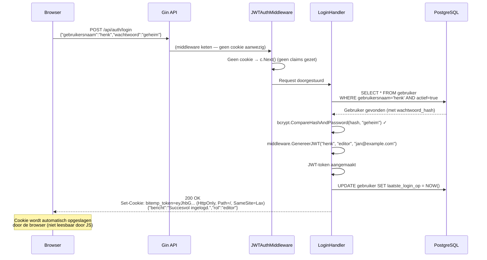
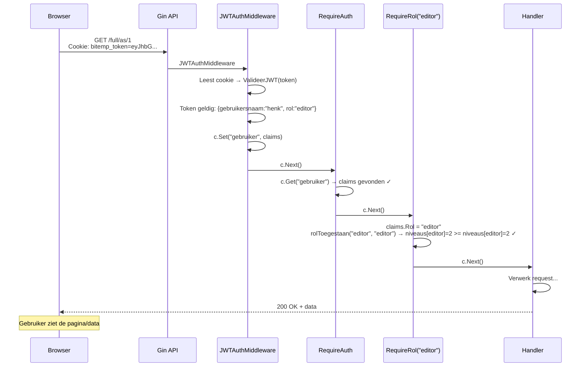
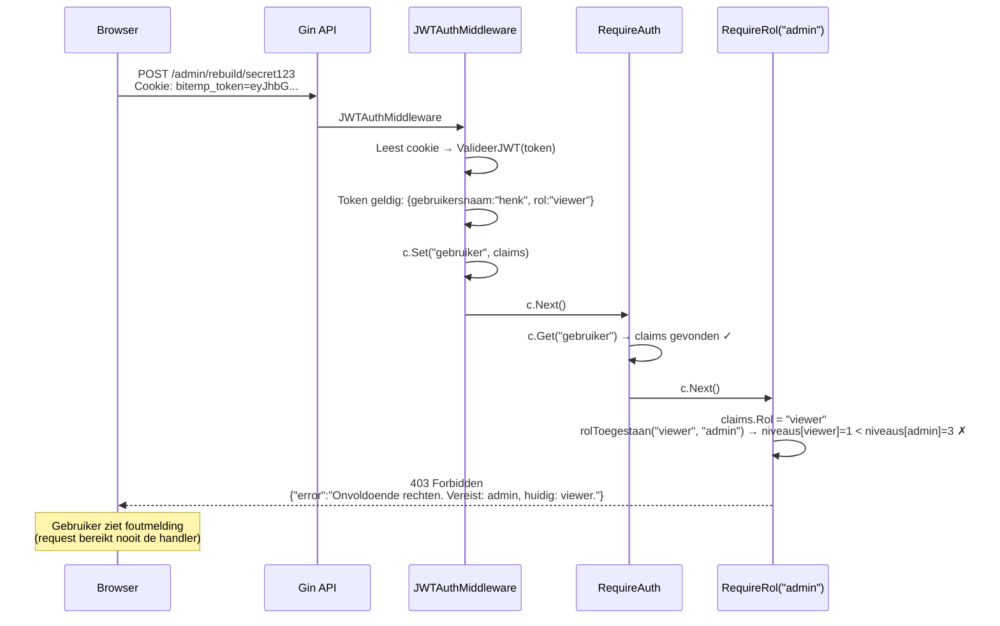
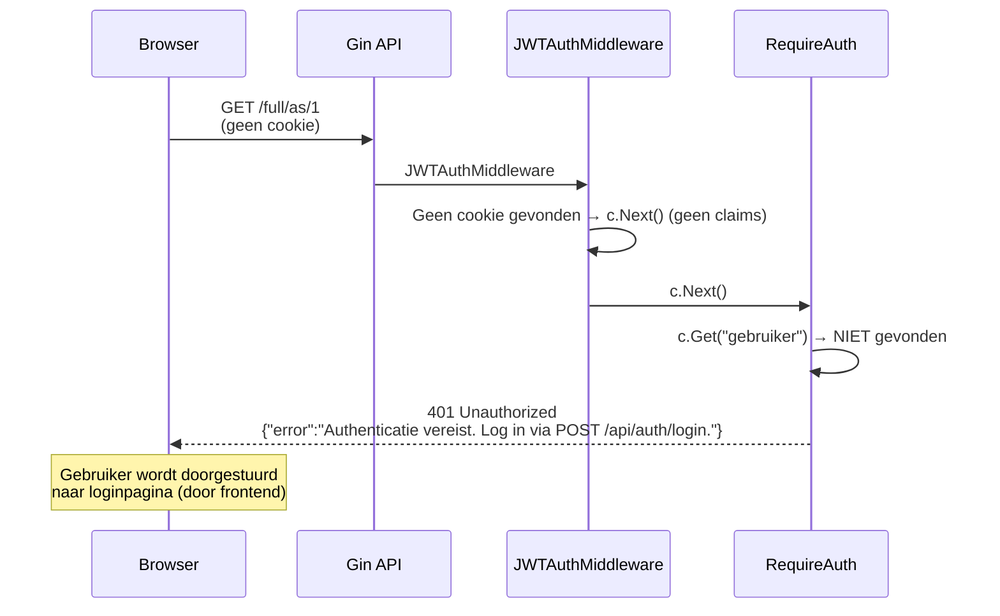
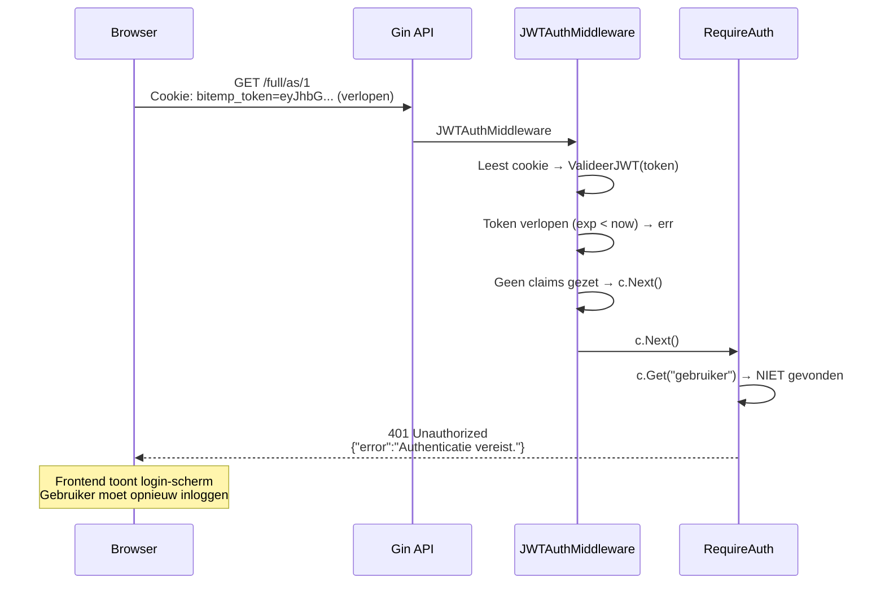
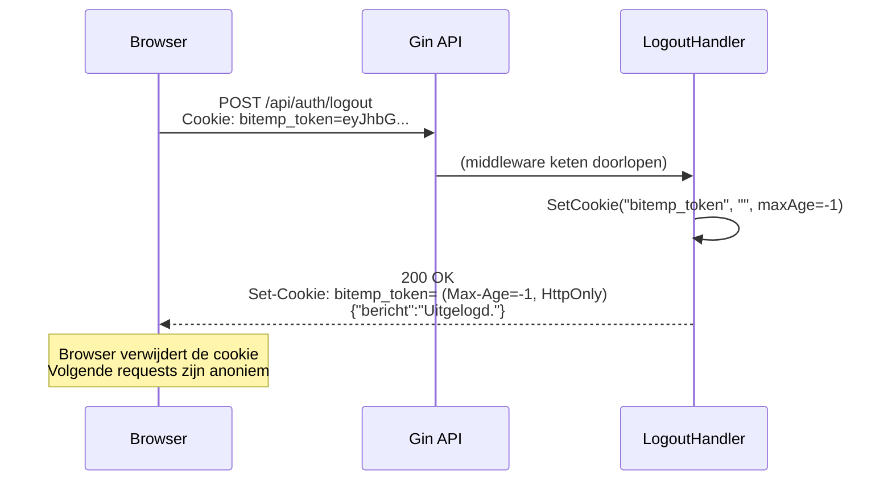
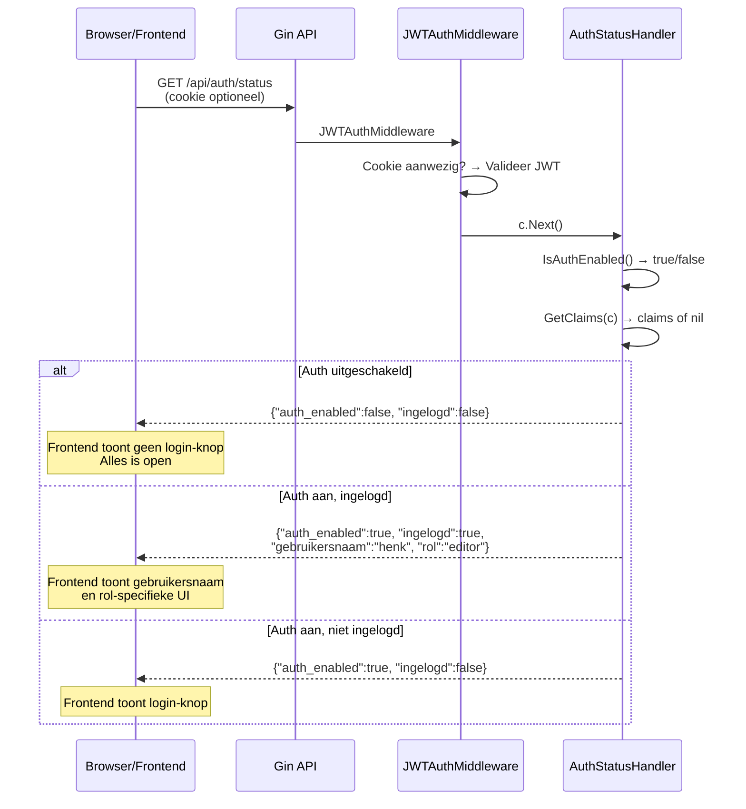
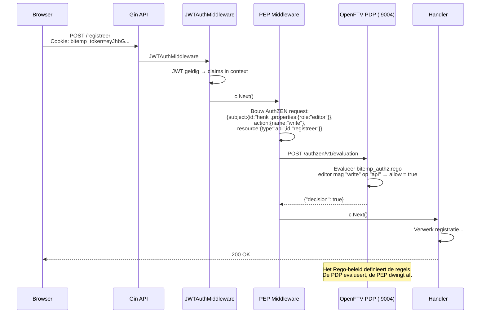

# Autorisatie & Authenticatie — Developer Guide

> Ontwikkelaarshandleiding voor het authenticatie- en autorisatiesysteem van bitemp_register_v06.
> Laatst bijgewerkt: 2026-04-17.

---

## Inhoudsopgave

1. [Woordenlijst](#1-woordenlijst)
2. [Architectuuroverzicht](#2-architectuuroverzicht)
3. [Hoe werkt het — stap voor stap](#3-hoe-werkt-het--stap-voor-stap)
4. [Scenario's met sequence-diagrammen](#4-scenarios-met-sequence-diagrammen)
5. [Bestanden en verantwoordelijkheden](#5-bestanden-en-verantwoordelijkheden)
6. [Database: Gebruiker-tabel](#6-database-gebruiker-tabel)
7. [Feature flags](#7-feature-flags)
8. [Rollen en hiërarchie](#8-rollen-en-hiërarchie)
9. [OpenFTV sidecar](#9-openftv-sidecar)
10. [Frontend authenticatie](#10-frontend-authenticatie)
11. [Gebruikersbeheer](#11-gebruikersbeheer)
12. [Veelgestelde vragen](#12-veelgestelde-vragen)

---

## 1. Woordenlijst

| Term | Uitleg |
|------|--------|
| **Authenticatie** | Vaststellen *wie* je bent (identiteit). Bij ons: gebruikersnaam + wachtwoord → JWT-token. |
| **Autorisatie** | Vaststellen *wat* je mag (rechten). Bij ons: rolgebaseerd (viewer/editor/admin) + OpenFTV PDP. |
| **Middleware** | Code die *tussen* het binnenkomende HTTP-request en de uiteindelijke handler zit. Vergelijk het met een reeks filters in een pijplijn: elk filter kan het request inspecteren, verrijken of afwijzen voordat het de volgende schakel (of de uiteindelijke endpoint-handler) bereikt. In Gin registreer je middleware via `router.Use(...)`. Ons systeem heeft vier middlewares: CORS, RequestBodyLogger, JWTAuthMiddleware en AuthzPEPMiddleware. |
| **Token** | Een digitaal "pasje" dat bewijst wie je bent. Bij ons een **JWT** (JSON Web Token): een base64-gecodeerde string met drie delen (header.payload.signature). Het bevat je gebruikersnaam, rol en verloopdatum, ondertekend met een geheim (HS256). |
| **JWT** | **JSON Web Token** — een open standaard (RFC 7519) voor het veilig overdragen van claims (informatie) tussen twee partijen. De server ondertekent het token; de server kan het later verifiëren zonder database-lookup. |
| **httpOnly cookie** | Een cookie die de browser *wel* automatisch meestuurt bij elk request, maar die *niet* leesbaar is vanuit JavaScript. Dit beschermt tegen XSS-aanvallen (cross-site scripting). |
| **CORS** | **Cross-Origin Resource Sharing** — een browsermechanisme dat bepaalt of een webpagina op domein A (bijv. `localhost:5173`) requests mag doen naar domein B (bijv. `localhost:8082`). Onze CORS-middleware staat specifieke origins toe en stuurt `Access-Control-Allow-Credentials: true` mee zodat cookies over cross-origin requests werken. |
| **Sidecar** | Een apart draaiend proces (vaak een Docker-container) dat naast je hoofdapplicatie draait en een specifieke taak vervult. In ons geval is de **OpenFTV sidecar** een set containers (PDP, Manager, MI, DB) die naast de Go API draaien en autorisatiebeleid evalueren. De API roept de sidecar aan, niet andersom. |
| **PDP** | **Policy Decision Point** — het component dat een autorisatievraag beantwoordt: "mag deze gebruiker deze actie op deze resource?" → ja/nee. Bij ons: OpenFTV PDP (draait op poort 9004). |
| **PAP** | **Policy Administration Point** — het component waar je autorisatiebeleid beheert (aanmaken, wijzigen, verwijderen van policies). Bij ons: de OpenFTV Manager. |
| **PIP** | **Policy Information Point** — het component dat extra informatie levert die nodig is voor een autorisatiebeslissing (bijv. roldefinities, pagina-eigenschappen). Bij ons ingebouwd in de OpenFTV Manager via de `data/entities/` JSON-bestanden. |
| **PEP** | **Policy Enforcement Point** — het component dat de autorisatiebeslissing *afdwingt*. Bij ons: de `AuthzPEPMiddleware()` in `middleware/authz_pep.go` — een Gin middleware die het PDP-antwoord controleert en bij `decision: false` een 403 Forbidden retourneert. Geactiveerd met `AUTHZ_PDP_ENABLED=true`. |
| **AuthZEN** | Een open standaard voor autorisatie-evaluatie-API's. Definieert een POST-endpoint met een vaste structuur: `{subject, action, resource, context}` → `{decision: bool}`. OpenFTV implementeert deze standaard. |
| **Rego** | De beleidstaal van **OPA** (Open Policy Agent). Declaratief: je beschrijft *regels* die evalueren naar true/false. Ons beleid staat in `authz/manager/policies/bitemp_authz.rego`. |
| **OPA** | **Open Policy Agent** — een open-source policy engine. Evalueert Rego-beleid. OpenFTV kan OPA als engine gebruiken (naast Cedar, Cerbos, OpenFGA). |
| **Bundle** | Een pakket van policies + data dat de OpenFTV Manager distribueert naar de PDP. De PDP haalt periodiek de nieuwste bundle op van de Manager, zodat beleidswijzigingen automatisch worden doorgepropt. |
| **bcrypt** | Een wachtwoord-hashalgoritme dat bewust traag is (om brute-force aanvallen moeilijker te maken). Wachtwoorden worden nooit als leesbare tekst opgeslagen; alleen de hash staat in de database. |
| **Feature flag** | Een aan/uit-schakelaar (bij ons `AUTH_ENABLED` environment variable) waarmee je een feature kunt in- of uitschakelen zonder code te wijzigen. Default is `false` (auth uit), zodat bestaande workflows niet breken. |
| **Seed** | Het automatisch aanmaken van initiële data bij het starten van de applicatie. Bij ons: `gebruikers.SeedAdmin()` maakt een admin-gebruiker aan (via de registratie-engine) als `ADMIN_USERNAME` en `ADMIN_PASSWORD` zijn ingesteld. |
| **Gin** | Het Go web-framework dat we gebruiken voor HTTP routing en middleware. Vergelijkbaar met Express.js (Node) of Flask (Python). |
| **Bun** | De Go ORM (Object-Relational Mapper) die we gebruiken voor database-interactie met PostgreSQL. Vertaalt Go structs naar SQL en terug. |

---

## 2. Architectuuroverzicht

```
┌─────────────────────────────────────────────────────────────────────┐
│                          Browser (React)                            │
│  Stuurt requests met httpOnly cookie (bitemp_token) naar de API    │
└─────────────┬───────────────────────────────────────────────────────┘
              │ HTTP request + cookie
              ▼
┌─────────────────────────────────────────────────────────────────────┐
│                     Gin Router (Go API, :8082)                      │
│                                                                     │
│  ┌────────────┐   ┌────────────────┐   ┌──────────────────────┐    │
│  │    CORS    │──▶│ JWTAuthMiddle- │──▶│  RequireAuth()       │    │
│  │ middleware │   │ ware()         │   │  RequireRol("editor")│    │
│  └────────────┘   └────────────────┘   └──────────┬───────────┘    │
│                          │                         │                │
│                   Extraheert JWT                   │                │
│                   uit cookie, valideert,     Blokkeert als         │
│                   zet claims in context      rol onvoldoende       │
│                          │                         │                │
│                          ▼                         ▼                │
│                   ┌────────────────────────────────────┐            │
│                   │         Endpoint Handler           │            │
│                   │  (LoginHandler, GetEntiteiten, …) │            │
│                   └────────────────────────────────────┘            │
│                                                                     │
│  Plumbing tabellen:                                                 │
│   ┌───────────┐  ┌────────────┐  ┌────────────┐                   │
│   │ gebruiker │  │ registratie│  │ wijziging   │                   │
│   └───────────┘  └────────────┘  └────────────┘                   │
└─────────────────────────────────────────────────────────────────────┘
              │
              │ (Phase 3: AuthZEN call)
              ▼
┌─────────────────────────────────────────────────────────────────────┐
│                  OpenFTV Sidecar (Docker)                           │
│                                                                     │
│  ┌──────────────┐    ┌──────────────┐    ┌──────────────┐          │
│  │   PDP :9004  │◀───│ Manager :9010│───▶│   MI :8180   │          │
│  │ (evaluatie)  │    │ (PAP + PIP)  │    │  (web UI)    │          │
│  └──────────────┘    └──────────────┘    └──────────────┘          │
│         ▲                    │                                      │
│         │ bundles            │ policies + data                     │
│         │────────────────────┘                                      │
│                    ┌──────────────┐                                 │
│                    │ openftv-db   │                                 │
│                    │  :5400 (PG)  │                                 │
│                    └──────────────┘                                 │
└─────────────────────────────────────────────────────────────────────┘
```

### Twee lagen van autorisatie

1. **Lokale rolcheck** (Phase 1): De Gin middleware (`RequireAuth()`, `RequireRol()`) controleert de rol uit het JWT-token. Snel, geen externe call. Altijd actief als `AUTH_ENABLED=true`.
2. **PDP-evaluatie** (Phase 3): De `AuthzPEPMiddleware()` stuurt een AuthZEN-request naar de OpenFTV PDP voor fijnmazige autorisatie. De PDP evalueert het Rego-beleid en retourneert `{decision: true/false}`. Actief als `AUTH_ENABLED=true` EN `AUTHZ_PDP_ENABLED=true`.

---

## 3. Hoe werkt het — stap voor stap

### 3.1 Gebruiker-tabel in de database

> **Gewijzigd in oktober 2026.** `Gebruiker` is nu een **bitemporele entiteit** (domein
> `beheer`, gegenereerd uit een V3-model); alleen de wachtwoord-hash en de laatste login staan
> nog in een plumbing-tabel, `gebruiker_inlog`. Zie [§6](#6-database-gebruiker-tabel) en
> [§11](#11-gebruikersbeheer); ontwerp en besluiten in [`plans/gebruikersbeheer/`](plans/gebruikersbeheer/). De tekst hieronder
> beschrijft de oorspronkelijke platte tabel en is historisch.

De `Gebruiker` struct in `model/gebruiker.go` was een **plumbing-tabel** — geen bitemporele representatie. Dat betekende:

- Geen `opvoer`/`afvoer` (formele tijd)
- Geen `aanvang`/`einde` (materiële tijd)
- Geen registratiesysteem of wijzigingsaudittrail
- Gewoon een standaard CRUD-tabel

> **Kan dat later bitemporeel worden?** Ja, absoluut. De `Gebruiker` kan op elk moment worden omgezet naar een volwaardige bitemporele representatie via de MetaRegistry. Voor nu is een simpele tabel pragmatisch: authenticatie is plumbing, niet domeindata.

De tabel wordt aangemaakt in `dbsetup/createtables.go`:

```go
// In CreateTables():
_, err = db.NewCreateTable().
    Model((*model.Gebruiker)(nil)).
    IfNotExists().
    Exec(ctx)
```

Dit werkt via **Bun ORM**: Bun leest de struct-tags (`bun:"table:gebruiker,alias:g"`, `bun:"id,pk,autoincrement"`, etc.) en genereert automatisch de juiste `CREATE TABLE IF NOT EXISTS` SQL. Je hoeft geen handmatige DDL te schrijven.

### 3.2 Wachtwoord-hashing

Wachtwoorden worden **nooit** als leesbare tekst opgeslagen. De flow:

1. Bij **seed** of **registratie**: `bcrypt.GenerateFromPassword(password, bcrypt.DefaultCost)` → hash
2. Bij **login**: `bcrypt.CompareHashAndPassword(storedHash, inputPassword)` → match of niet
3. De hash staat in kolom `wachtwoord_hash`; de JSON-tag is `json:"-"` (wordt nooit naar de client gestuurd)

### 3.3 JWT-generatie en -validatie

Na succesvolle login genereert `middleware.GenereerJWT()`:

```
Header:   {"alg": "HS256", "typ": "JWT"}
Payload:  {"sub": "henk", "iss": "bitemp-register-v06",
           "iat": 1713350400, "exp": 1713436800,
           "gebruikersnaam": "henk", "rol": "editor", "email": "jan@example.com"}
Signature: HMAC-SHA256(header + "." + payload, JWT_SECRET)
```

Het token wordt als **httpOnly cookie** meegegeven:
- **Naam**: `bitemp_token`
- **httpOnly**: `true` (niet leesbaar door JavaScript)
- **Secure**: `true` in release-mode (`GIN_MODE=release`), `false` lokaal
- **SameSite**: `Lax` (bescherming tegen CSRF)
- **MaxAge**: `JWT_EXPIRY_HOURS * 3600` seconden (default: 24 uur)

### 3.4 Middleware-keten

Elke request doorloopt deze keten (geregistreerd in `routes/addroutes.go` → `SetupMiddleware()`):

```
Request binnenkomst
    │
    ▼
[1] corsMiddleware()        — Zet Access-Control-Allow-Origin header
    │
    ▼
[2] RequestBodyLogger()     — Logt POST/PUT/PATCH body (als APP_DEBUG_LOGS=1)
    │
    ▼
[3] JWTAuthMiddleware()     — Als AUTH_ENABLED=true:
    │                          • Leest cookie "bitemp_token"
    │                          • Valideert JWT (signature, expiry)
    │                          • Zet JWTClaims in Gin context (key: "gebruiker")
    │                          • Blokkeert NIET als cookie ontbreekt
    │                        Als AUTH_ENABLED=false:
    │                          • Doet niets (c.Next())
    ▼
[4] AuthzPEPMiddleware()    — Als AUTHZ_PDP_ENABLED=true:
    │                          • Mapt method+pad → AuthZEN actie+resource
    │                          • Stuurt evaluatieverzoek naar OpenFTV PDP
    │                          • Bij decision=false → 403 Forbidden
    │                          • Bij PDP-fout → fail-closed / deny (default sinds 2026-07-07;
    │                            fail-open alleen expliciet via AUTHZ_DENY_ON_ERROR=false)
    │                        Als AUTHZ_PDP_ENABLED=false:
    │                          • Doet niets (c.Next())
    ▼
[5] GraphQL-mutatiecontrole — In de handler van /graphql/query (sinds 2026-09-22, zie §3.6):
    │                          • Query → door, zonder login (net als REST-GET's)
    │                          • Document met een mutatie → ControleerRol("editor"):
    │                            anoniem 401, viewer 403
    │                          (Van 2026-07-07 tot 2026-09-22: RequireAuth() op het hele endpoint.)
    ▼
[6] RequireRol("editor")   — Aangesloten op alle muterende routes;
    │                        RequireRol("admin") op /admin/* en schema-activeren
    │                        (BE-review 2026-07-07, actiepunt 3):
    │                          • Checkt rol-hiërarchie
    │                          • Zo onvoldoende: 403 Forbidden
    ▼
    Endpoint handler (bijv. GetEntiteiten, LoginHandler, …)
```

### 3.5 Admin seed bij opstarten

In `main.go`, ná `NewRouter()` (de seed leest het register via dynql, dat pas na `BuildSchema` klaar is):

```go
if middleware.IsAuthEnabled() {
    gebruikers.MigreerOudeGebruikers(sysCtx) // eenmalig: oude platte tabel → register
    gebruikers.SeedAdmin(sysCtx)             // eerste admin, via de registratie-engine
    middleware.ZetGebruikerResolver(gebruikers.Resolver) // rol en status per verzoek
}
```

`SeedAdmin` leest `ADMIN_USERNAME` en `ADMIN_PASSWORD` uit de environment en maakt (eenmalig) een admin-gebruiker aan als die nog niet bestaat.

### 3.5a Rol en status per verzoek (oktober 2026)

Het JWT zegt alleen *wie* er is ingelogd. `JWTAuthMiddleware` zoekt bij elk verzoek de actuele
stand op in het register (`middleware/gebruiker_stand.go` → `gebruikers.Resolver`): de hoogste
geldige roltoewijzing zonder domein, en of het account geblokkeerd is. Geblokkeerd of geen rol
→ het verzoek is anoniem. De uitkomst wordt 30 seconden gecachet (`StandCacheDuur`), dus een
blokkade of een verlopen proefrol werkt binnen een halve minuut, niet pas als het token na
24 uur verloopt. Bij een databasefout blijven de claims uit het token gelden.

De middleware zet de claims ook in de request-context (`middleware.MetClaims`), zodat de
registratie-engine kan controleren wie er registreert (§11, admin-eis voor domein `beheer`).


### 3.6 GraphQL: queries openbaar (tenzij `LEESTOEGANG=documenten`, §7), mutaties vereisen `editor`

`/graphql/query` (GET en POST) is **één endpoint voor lezen én schrijven**. Een route-middleware
ziet het verschil niet; daarom beslist de handler op basis van het GraphQL-document zelf.

| Verzoek | Anoniem | viewer | editor / admin |
|---|---|---|---|
| Query (`{ … }`, `query …`) | ✅ | ✅ | ✅ |
| Document met een `mutation` | 401 | 403 | ✅ |

Zo geldt voor GraphQL precies hetzelfde als voor REST: **lezen is openbaar, schrijven vraagt
`editor`** (§8). Met `AUTH_ENABLED=false` is de controle een no-op.

**Waarom (22 september 2026).** Tot die datum stond het hele endpoint achter `RequireAuth()`
(BE-review 2026-07-07, als tijdelijke maatregel; fijnmazige controle stond als vervolgwerk genoteerd).
Dat had twee gevolgen:

1. **Anoniem lezen via GraphQL was dicht.** De publicatiepagina haalt de detailweergave via GraphQL
   op zodra er een detail-template in de WeergaveDefinitie staat (diepe navigatie via FK's). Op
   pf.common-ground-lab.nl kon je daardoor zonder inloggen wel de tabel zien (REST `/full/…`), maar
   niet doorklikken naar een initiatief — ook niet in het iframe op commonground.nl, waar inloggen
   niet kan.
2. **Een `viewer` kon muteren.** `RequireAuth()` vraagt alleen *ingelogd*, geen rol; via REST
   mag een viewer niets schrijven, via GraphQL wél.

**Hoe.**

- `dynql.BevatMutatie(query)` parset het document (graphql-go `parser`) en meldt of er **ergens** een
  `mutation`-operatie in staat. Bewust ruim: een document met een query én een mutatie telt als
  mutatie, ongeacht `operationName`. Zo kan niemand met `operationName` langs de controle.
  Een document dat niet parset, telt als geen mutatie; `graphql.Do` voert het toch niet uit.
- `dynql.GraphQLHandler(schema, magMuteren)` roept bij een mutatie `magMuteren(c)` aan. In `main.go`
  is dat `middleware.ControleerRol(c, "editor")`: dezelfde controle als `RequireRol`, maar
  aanroepbaar binnen een handler. Bij `false` is het verzoek al afgebroken met 401/403.
- Tests: `dynql/handler_test.go` (anoniem/viewer/editor/admin, query+mutatie met `operationName`,
  mutatie via GET).

**Let op bij OpenFTV (`AUTHZ_PDP_ENABLED=true`).** De PEP (§3.4 stap 4) beoordeelt op methode en
pad; `POST /graphql/query` wordt daar de actie `write`. Anoniem lezen via GraphQL-POST wordt dan
door het beleid geweigerd. Bij het aanzetten van OpenFTV (bv. op pf, werkpakket F) dus óf het
beleid lezen via `graphql` laten toestaan, óf de PEP voor `/graphql/query` hetzelfde onderscheid
laten maken (`BevatMutatie` → `read`/`write`).

**Nog open.** Anonieme queries kunnen dieper nesten dan één REST-aanroep. Lijsten zijn begrensd
(max. 100 per niveau), maar er is geen limiet op diepte of complexiteit. Voor een openbare instantie
met veel verkeer: een dieptegrens toevoegen.

---

## 4. Scenario's met sequence-diagrammen

### 4.1 Eerste login (succesvolle authenticatie)


```mermaid
sequenceDiagram
    participant B as Browser
    participant G as Gin API
    participant MW as JWTAuthMiddleware
    participant H as LoginHandler
    participant DB as PostgreSQL

    B->>G: POST /api/auth/login<br/>{"gebruikersnaam":"henk","wachtwoord":"geheim"}
    G->>MW: (middleware keten — geen cookie aanwezig)
    MW->>MW: Geen cookie → c.Next() (geen claims gezet)
    MW->>H: Request doorgestuurd

    H->>DB: SELECT * FROM gebruiker<br/>WHERE gebruikersnaam='henk' AND actief=true
    DB-->>H: Gebruiker gevonden (met wachtwoord_hash)

    H->>H: bcrypt.CompareHashAndPassword(hash, "geheim") ✓
    H->>H: middleware.GenereerJWT("henk", "editor", "jan@example.com")
    H->>H: JWT-token aangemaakt

    H->>DB: UPDATE gebruiker SET laatste_login_op = NOW()

    H-->>B: 200 OK<br/>Set-Cookie: bitemp_token=eyJhbG... (HttpOnly, Path=/, SameSite=Lax)<br/>{"bericht":"Succesvol ingelogd.","rol":"editor"}

    Note over B: Cookie wordt automatisch opgeslagen<br/>door de browser (niet leesbaar door JS)
```

### 4.2 Toegang tot een beschermde pagina (toegestaan)


```mermaid
sequenceDiagram
    participant B as Browser
    participant G as Gin API
    participant MW as JWTAuthMiddleware
    participant RA as RequireAuth
    participant RR as RequireRol("editor")
    participant H as Handler

    B->>G: GET /full/as/1<br/>Cookie: bitemp_token=eyJhbG...

    G->>MW: JWTAuthMiddleware
    MW->>MW: Leest cookie → ValideerJWT(token)
    MW->>MW: Token geldig: {gebruikersnaam:"henk", rol:"editor"}
    MW->>MW: c.Set("gebruiker", claims)
    MW->>RA: c.Next()

    RA->>RA: c.Get("gebruiker") → claims gevonden ✓
    RA->>RR: c.Next()

    RR->>RR: claims.Rol = "editor"<br/>rolToegestaan("editor", "editor") → niveaus[editor]=2 >= niveaus[editor]=2 ✓
    RR->>H: c.Next()

    H->>H: Verwerk request...
    H-->>B: 200 OK + data

    Note over B: Gebruiker ziet de pagina/data
```

### 4.3 Toegang tot een beschermde pagina (onvoldoende rechten)


```mermaid
sequenceDiagram
    participant B as Browser
    participant G as Gin API
    participant MW as JWTAuthMiddleware
    participant RA as RequireAuth
    participant RR as RequireRol("admin")

    B->>G: POST /admin/rebuild/secret123<br/>Cookie: bitemp_token=eyJhbG...

    G->>MW: JWTAuthMiddleware
    MW->>MW: Leest cookie → ValideerJWT(token)
    MW->>MW: Token geldig: {gebruikersnaam:"henk", rol:"viewer"}
    MW->>MW: c.Set("gebruiker", claims)
    MW->>RA: c.Next()

    RA->>RA: c.Get("gebruiker") → claims gevonden ✓
    RA->>RR: c.Next()

    RR->>RR: claims.Rol = "viewer"<br/>rolToegestaan("viewer", "admin") → niveaus[viewer]=1 < niveaus[admin]=3 ✗
    RR-->>B: 403 Forbidden<br/>{"error":"Onvoldoende rechten. Vereist: admin, huidig: viewer."}

    Note over B: Gebruiker ziet foutmelding<br/>(request bereikt nooit de handler)
```

### 4.4 Toegang zonder ingelogd te zijn


```mermaid
sequenceDiagram
    participant B as Browser
    participant G as Gin API
    participant MW as JWTAuthMiddleware
    participant RA as RequireAuth

    B->>G: GET /full/as/1<br/>(geen cookie)

    G->>MW: JWTAuthMiddleware
    MW->>MW: Geen cookie gevonden → c.Next() (geen claims)
    MW->>RA: c.Next()

    RA->>RA: c.Get("gebruiker") → NIET gevonden
    RA-->>B: 401 Unauthorized<br/>{"error":"Authenticatie vereist. Log in via POST /api/auth/login."}

    Note over B: Gebruiker wordt doorgestuurd<br/>naar loginpagina (door frontend)
```

### 4.5 Verlopen token


```mermaid
sequenceDiagram
    participant B as Browser
    participant G as Gin API
    participant MW as JWTAuthMiddleware
    participant RA as RequireAuth

    B->>G: GET /full/as/1<br/>Cookie: bitemp_token=eyJhbG... (verlopen)

    G->>MW: JWTAuthMiddleware
    MW->>MW: Leest cookie → ValideerJWT(token)
    MW->>MW: Token verlopen (exp < now) → err
    MW->>MW: Geen claims gezet → c.Next()
    MW->>RA: c.Next()

    RA->>RA: c.Get("gebruiker") → NIET gevonden
    RA-->>B: 401 Unauthorized<br/>{"error":"Authenticatie vereist."}

    Note over B: Frontend toont login-scherm<br/>Gebruiker moet opnieuw inloggen
```

### 4.6 Uitloggen


```mermaid
sequenceDiagram
    participant B as Browser
    participant G as Gin API
    participant H as LogoutHandler

    B->>G: POST /api/auth/logout<br/>Cookie: bitemp_token=eyJhbG...

    G->>H: (middleware keten doorlopen)

    H->>H: SetCookie("bitemp_token", "", maxAge=-1)
    H-->>B: 200 OK<br/>Set-Cookie: bitemp_token= (Max-Age=-1, HttpOnly)<br/>{"bericht":"Uitgelogd."}

    Note over B: Browser verwijdert de cookie<br/>Volgende requests zijn anoniem
```

### 4.7 Auth status check (voor frontend)


```mermaid
sequenceDiagram
    participant B as Browser/Frontend
    participant G as Gin API
    participant MW as JWTAuthMiddleware
    participant H as AuthStatusHandler

    B->>G: GET /api/auth/status<br/>(cookie optioneel)

    G->>MW: JWTAuthMiddleware
    MW->>MW: Cookie aanwezig? → Valideer JWT
    MW->>H: c.Next()

    H->>H: IsAuthEnabled() → true/false
    H->>H: GetClaims(c) → claims of nil

    alt Auth uitgeschakeld
        H-->>B: {"auth_enabled":false, "ingelogd":false}
        Note over B: Frontend toont geen login-knop<br/>Alles is open
    else Auth aan, ingelogd
        H-->>B: {"auth_enabled":true, "ingelogd":true,<br/>"gebruikersnaam":"henk", "rol":"editor"}
        Note over B: Frontend toont gebruikersnaam<br/>en rol-specifieke UI
    else Auth aan, niet ingelogd
        H-->>B: {"auth_enabled":true, "ingelogd":false}
        Note over B: Frontend toont login-knop
    end
```

### 4.8 PEP + PDP evaluatie (Phase 3)


```mermaid
sequenceDiagram
    participant B as Browser
    participant G as Gin API
    participant MW as JWTAuthMiddleware
    participant PEP as PEP Middleware
    participant PDP as OpenFTV PDP (:9004)
    participant H as Handler

    B->>G: POST /registreer<br/>Cookie: bitemp_token=eyJhbG...

    G->>MW: JWTAuthMiddleware
    MW->>MW: JWT geldig → claims in context
    MW->>PEP: c.Next()

    PEP->>PEP: Bouw AuthZEN request:<br/>{subject:{id:"henk",properties:{role:"editor"}},<br/>action:{name:"write"},<br/>resource:{type:"api",id:"registreer"}}

    PEP->>PDP: POST /authzen/v1/evaluation
    PDP->>PDP: Evalueer bitemp_authz.rego<br/>editor mag "write" op "api" → allow = true
    PDP-->>PEP: {"decision": true}

    PEP->>H: c.Next()
    H->>H: Verwerk registratie...
    H-->>B: 200 OK

    Note over PDP: Het Rego-beleid definieert de regels.<br/>De PDP evalueert, de PEP dwingt af.
```

---

## 5. Bestanden en verantwoordelijkheden

### Authenticatie (Phase 1)

| Bestand | Verantwoordelijkheid |
|---------|---------------------|
| `model/gebruiker.go` | **Plumbing**: `GebruikerInlog` (tabel `gebruiker_inlog`: hash, laatste login; `json:"-"` op de hash) en `GebruikerOud` (de oude platte tabel, voor de migratie). De entiteit `Gebruiker` zelf is gegenereerd: `model/beheer_*.go`. |
| `gebruikers/` | **Gebruikersbeheer**: stand "nu" lezen (`stand.go`), aanmaken via de engine (`aanmaken.go`), seed, migratie van de oude tabel, login en wachtwoord-endpoints (`handlers.go`). |
| `middleware/gebruiker_stand.go` | Rol en status per verzoek uit het register (met cache), claims in de request-context, `MagBeheren`. |
| `handlers/registration_beheer.go` | De engine weigert wijzigingen in domein `beheer` zonder admin (ook via `/registratie/` en GraphQL). |
| `dbsetup/gebruiker_tabellen.go` | Hernoemt de oude tabel `gebruiker` naar `gebruiker_oud` vóór de hub wordt aangemaakt; maakt `gebruiker_inlog`. |
| `dbsetup/createtables.go` | **Tabel-aanmaak**: Bun leest de `Gebruiker` struct-tags en genereert `CREATE TABLE IF NOT EXISTS gebruiker (…)`. Wordt aangeroepen bij elke startup → idempotent. |
| `middleware/auth_middleware.go` | **JWT-logica + middleware**: `GenereerJWT()` (maakt tokens), `ValideerJWT()` (parseert + verifieert), `JWTAuthMiddleware()` (extraheert cookie → context), `RequireAuth()` (401 als niet ingelogd), `RequireRol()` (403 als onvoldoende rol), `IsAuthEnabled()` (feature flag check). |
| `handlers/auth_handler.go` | **HTTP handlers**: `LogoutHandler()` (verwijder cookie), `MeHandler()` (huidige gebruiker), `AuthStatusHandler()` (auth-status voor frontend). Inloggen en de seed staan sinds oktober 2026 in `gebruikers/`. |
| `main.go` | **Wiring**: registreert `/api/auth/*` en `/api/gebruikers*`, en draait na `NewRouter()` de migratie, de seed en `ZetGebruikerResolver` als auth is ingeschakeld. |
| `routes/addroutes.go` | **Middleware-registratie**: `SetupMiddleware()` registreert CORS, RequestBodyLogger en JWTAuthMiddleware op de Gin engine. |
| `.env.example` | **Configuratie-template**: documenteert alle auth-gerelateerde environment variables. |

### Autorisatie / OpenFTV (Phase 2)

| Bestand | Verantwoordelijkheid |
|---------|---------------------|
| `docker-compose.auth.yml` | Docker Compose voor OpenFTV sidecar (PDP, Manager, MI, DB). |
| `authz/manager/policies/bitemp_authz.rego` | Rego-beleid: rolhiërarchie, publieke/beschermde pagina's, API-toegangsniveaus. Dit is het **hoofdbeleid** dat de Manager distribueert naar de PDP via bundles. |
| `authz/manager/data/entities/pages.json` | Pagina-definities voor PIP (welke pagina's bestaan, met optionele `vereiste_rol`). |
| `authz/manager/data/entities/roles.json` | Roldefinities (admin/editor/viewer) met hiërarchie-niveaus. |
| `authz/manager/bundles/bitemp-pdp.yaml` | Bundleconfiguratie: welke policies/data worden naar de PDP gedistribueerd. |
| `authz/pdp/policies/bitemp_authz.rego` | Lokaal fallback-beleid voor de PDP (voor als bundles nog niet zijn geladen). |
| `authz/README.md` | Documentatie van de autorisatie-architectuur en configuratie. |

### PEP Middleware (Phase 3)

| Bestand | Verantwoordelijkheid |
|---------|---------------------|
| `authz/authzen_client.go` | **AuthZEN HTTP-client**: stuurt evaluatieverzoeken naar de OpenFTV PDP (`POST /authzen/v1/evaluation`). Bevat structs voor AuthZEN-protocol (`EvaluatieVerzoek`, `EvaluatieResultaat`), connection pooling, timeout (5s), en convenience-methode `EvalueerKort()`. Leest `OPENFTV_PDP_URL` (default: `http://localhost:9004`). |
| `middleware/authz_pep.go` | **PEP middleware**: `AuthzPEPMiddleware()` — mapt HTTP method+pad → AuthZEN actie+resource, stuurt evaluatieverzoek naar PDP, dwingt `decision: false` af met 403. Publieke paden (OPTIONS, `/api/auth/*`, `/viz/*`, etc.) slaan PDP over. Feature flags: `AUTHZ_PDP_ENABLED`, `AUTHZ_DENY_ON_ERROR`. Lazy client-initialisatie via `initAuthzClient()`. |
| `middleware/authz_pep_test.go` | **Unit tests**: 3 testfuncties met ~50 cases voor `BepaalAuthZENActie()`, `BepaalAuthZENResource()` en `isPubliekPad()`. |

### Frontend Authenticatie (Phase 4)

| Bestand | Verantwoordelijkheid |
|---------|---------------------|
| `web/vite/src/context/AuthContext.jsx` | **Auth state management**: `AuthProvider` (React Context) haalt bij mount de status op via `GET /api/auth/status`. Biedt: `authEnabled`, `ingelogd`, `gebruiker`, `laden`, `fout`, `login()`, `logout()`, `verversStatus()`. Cookie is httpOnly → wordt automatisch meegestuurd, geen JS token-opslag nodig. |
| `web/vite/src/components/LoginPagina.jsx` | **Inlogformulier**: gebruikersnaam + wachtwoord in Common Ground / Utrecht stijl. Toont foutmeldingen van backend. |
| `web/vite/src/components/AuthBeschermd.jsx` | **Route-bescherming**: wrapper-component dat een pagina alleen toont als de gebruiker is ingelogd met de vereiste rol. Als `AUTH_ENABLED=false` → alles open. Bij onvoldoende rechten toont het een foutpagina. |
| `web/vite/src/components/GebruikerBadge.jsx` | **Gebruikersindicator**: toont gebruikersnaam + rol-badge + uitlogknop in de header-balk. Verbergt zichzelf als auth niet actief is. |
| `web/vite/src/main.jsx` | **Gewrapped** met `<AuthProvider>` zodat alle 7 MPA-pagina's toegang hebben tot auth-status. |
| `web/vite/src/App.jsx` | **Beschermde routes**: `editor-v2`, `editor` en `ide` zijn gewrapped met `<AuthBeschermd vereistRol="editor">`. Publieke pagina's (index, tijdlijn, registraties, universum) zijn onbeschermd. |
| `web/vite/src/editor/main.jsx` | **Inhoud editor**: gewrapped met `<AuthProvider>` + `<AuthBeschermd vereistRol="editor">` + `<GebruikerBadge>` in de header. |
| `web/vite/src/publicatie/main.jsx` | **Publicatie**: gewrapped met `<AuthProvider>` + `<GebruikerBadge>` in de header. Publicatie is leesbaar voor iedereen, maar toont gebruikersinfo als ingelogd. |

---

## 6. Database: Gebruiker-tabel

Sinds oktober 2026 is `Gebruiker` een **bitemporele entiteit** in domein `beheer`, gegenereerd
uit [`plans/gebruikersbeheer/gebruiker — v3-model.json`](plans/gebruikersbeheer/) met
`go run ./cmd/codegen --mode additive --domein beheer --prefix beheer`:

| GE | Momentvoorkomen | Tijd | Velden |
|---|---|---|---|
| `GebruikerIdentiteit` | enkelvoudig | formeel | `gebruikersnaam` (uniek), `weergavenaam`, `email` |
| `GebruikerStatus` | enkelvoudig | materieel | `status` (`actief`/`geblokkeerd`), `toelichting` |
| `GebruikerRoltoewijzing` | meervoudig | materieel | `rol` (`viewer`/`editor`/`admin`), `domein` (leeg = alle), `toelichting` |

Zonder status-GE geldt *actief*. Afvoer of een einde op de entiteit = account beëindigd. Met een
einde op een roltoewijzing verloopt een proefaccount vanzelf. Rollen mét domein tellen nog niet
mee voor de rol in de middleware; die zijn bedoeld voor de autorisatielaag (FTV/PIP).

**Bewust niet bitemporeel:** de wachtwoord-hash en de laatste login. Registraties worden nooit
gewist (een oude hash zou eeuwig blijven), de gegenereerde API zou ze tonen, en elke login zou
een registratie opleveren. Die staan in de plumbing-tabel:

```sql
CREATE TABLE IF NOT EXISTS gebruiker_inlog (
    gebruiker_id            BIGINT      PRIMARY KEY REFERENCES gebruiker(id),
    wachtwoord_hash         TEXT        NOT NULL,   -- bcrypt, NOOIT leesbare tekst
    wachtwoord_gewijzigd_op TIMESTAMPTZ NOT NULL DEFAULT CURRENT_TIMESTAMP,
    laatste_login_op        TIMESTAMPTZ
);
```

**Migratie van de oude platte tabel.** Bij de eerste opstart van deze versie hernoemt
`dbsetup` de oude tabel `gebruiker` (herkenbaar aan kolom `wachtwoord_hash`) naar
`gebruiker_oud`, vóór de hub wordt aangemaakt. Na `NewRouter()` zet
`gebruikers.MigreerOudeGebruikers` elke rij om in een registratie (bron `gebruikersbeheer`):
identiteit, status (`actief=false` → `geblokkeerd`) en één roltoewijzing; de hash en de laatste
login gaan ongewijzigd naar `gebruiker_inlog`, dus iedereen houdt zijn wachtwoord. Idempotent
(een gebruikersnaam die al bestaat wordt overgeslagen). `gebruiker_oud` blijft staan; verwijder
hem met de hand als alles klopt (`DROP TABLE gebruiker_oud;`).

---

## 7. Feature flags

### AUTH_ENABLED

| Waarde | Effect |
|--------|--------|
| `false` / niet gezet (default) | **Alles open**: JWTAuthMiddleware is een no-op, RequireAuth/RequireRol laten alles door. Geen admin-seed. De API werkt precies zoals vóór de auth-implementatie. |
| `true` / `1` / `yes` / `on` | **Auth actief**: JWT-middleware extraheert cookies, RequireAuth blokkeert niet-ingelogde gebruikers, RequireRol controleert rollen. Admin-seed bij startup. |

Dit wordt gecontroleerd in `middleware.IsAuthEnabled()` en gelezen uit de `AUTH_ENABLED` environment variable.

### AUTHZ_PDP_ENABLED

| Waarde | Effect |
|--------|--------|
| `false` / niet gezet (default) | **PDP uit**: AuthzPEPMiddleware is een no-op. Alleen lokale rolchecks (RequireAuth/RequireRol) zijn actief. |
| `true` / `1` / `yes` / `on` | **PDP actief**: AuthzPEPMiddleware stuurt evaluatieverzoeken naar de OpenFTV PDP. Vereist dat `AUTH_ENABLED=true` ook is ingesteld. |

### AUTHZ_DENY_ON_ERROR

| Waarde | Effect |
|--------|--------|
| `true` / niet gezet (default sinds 2026-07-07) | **Fail-closed**: bij PDP-fouten wordt het request geweigerd met 403 Forbidden. Wie autorisatie aanzet, wil niet dat een onbereikbare PDP alles openzet. |
| `false` / `0` / `no` / `off` | **Fail-open**: bij PDP-communicatiefouten wordt het request doorgelaten met een waarschuwing in de logs. Alleen bedoeld voor dev-testen zonder stabiele PDP. |

### JWT_SECRET verplicht bij AUTH_ENABLED=true

Sinds 2026-07-07 (BE-review actiepunt 3) valideert de applicatie bij startup de
auth-configuratie via `middleware.ValideerAuthConfiguratie()`:

- `AUTH_ENABLED=true` zonder `JWT_SECRET` → **startup geweigerd**.
- `JWT_SECRET` gelijk aan de dev-default → **startup geweigerd in productie**
  (`APP_ENV=production` of `GIN_MODE=release`), waarschuwing daarbuiten.
- Kort secret (< 32 tekens) → waarschuwing.

---


### LEESTOEGANG

*Sinds 24 september 2026 (voorbereid; standaard uit).* De **leespoort** voor anoniem lezen.

| Waarde | Gedrag |
|---|---|
| `open` (default) | zoals voorheen: alle GET-routes en GraphQL-queries zijn anoniem leesbaar |
| `documenten` | anoniem lezen van **registerdata** vereist minimaal de rol `viewer`; anoniem mag alleen nog: publieke opgeslagen documenten (`documentId`, zie `docs/dynamische-graphql-laag.md` § Uitvoeren op naam), GraphQL-introspectie, het configuratie-domein (WeergaveDefinitie, FormulierDefinitie, QueryDefinitie), referentielijsten, schema- en metadata-endpoints en de documentatie |

Net als `RequireRol` is dit een no-op zolang `AUTH_ENABLED=false` (de API logt dan een WARN).
Wat "registerdata" is en wat niet, wordt uit het model afgeleid (`routes.OpenbaarLeesbaar`:
domein `configuratie` en subtype referentielijst zijn open); er staat geen typenaam in de code.
Implementatie: `middleware/leestoegang.go` (`MagLezen`, `RequireLezer`), `routes/leestoegang.go`,
de vierde guard van `dynql.GraphQLHandler`. Tests: `routes/leestoegang_test.go`,
`dynql/leestoegang_test.go`.

Zet de poort pas dicht als de publicatiepagina aantoonbaar via opgeslagen documenten werkt
(`docs/VPS_DEPLOYMENT.md` §9); anders valt de embed op commonground.nl weg. Op termijn neemt
toegangsspraak dit over met rijcondities (plan 2026-09-22 §7.7 stap 4).
## 8. Rollen en hiërarchie

```
admin (3)  ──▶  editor (2)  ──▶  viewer (1)
   │               │                │
   │               │                └── Kan alleen lezen (GET endpoints)
   │               └── Kan lezen + schrijven (registratie, correctie, schema-publicatie)
   └── Kan alles + admin-endpoints (drop tables, rebuild, gebruikersbeheer)
```

De hiërarchie is geïmplementeerd als een simpele integer-vergelijking:

```go
// In middleware/auth_middleware.go:
func rolToegestaan(huidig, vereist string) bool {
    niveaus := map[string]int{"viewer": 1, "editor": 2, "admin": 3}
    return niveaus[huidig] >= niveaus[vereist]
}
```

Dezelfde hiërarchie staat in het Rego-beleid:

```rego
# In authz/manager/policies/bitemp_authz.rego:
rol_niveau := {"admin": 3, "editor": 2, "viewer": 1}
heeft_minimaal_rol(vereist) if {
    rol_niveau[input.subject.properties.role] >= rol_niveau[vereist]
}
```

### Pagina-toegang

| Pagina | Minimale rol | Toelichting |
|--------|-------------|-------------|
| index, tijdlijn, registraties, universum | - (publiek) | Altijd toegankelijk |
| swagger, redoc, graphiql | - (publiek) | API-documentatie; GraphQL-mutaties vragen wel `editor` (§3.6) |
| publicatie | - (publiek) | Schema publicatie |
| editor-v2, editor, ide, inhoud | editor | UML/metamodel/inhoud editors |

---

## 9. OpenFTV sidecar

### Wat is OpenFTV?

[OpenFTV](https://gitlab.com/digilab.overheid.nl/ecosystem/ftv/open-ftv) is een open-source autorisatie-framework van Digilab (Overheid NL). Het implementeert het PxP-patroon (PIP/PAP/PDP/PEP) en ondersteunt meerdere policy engines (OPA/Rego, Cedar, Cerbos, OpenFGA).

### Hoe start je de sidecar?

```bash
# Vanuit bitemp_register_v06/
docker compose -f docker-compose.auth.yml up --build

# Vereist: open-ftv repo in D:\Git\open-ftv (of ../open-ftv relatief)
```

### Endpoints na starten

| Service | URL | Functie |
|---------|-----|---------|
| PDP | http://localhost:9004/authzen/v1/evaluation | Autorisatie-evaluatie |
| Manager | http://localhost:9010 | Beleidsbeheer API |
| MI | http://localhost:8180 | Management Interface (web UI) |
| PDP Health | http://localhost:8104/livez | Health check |

### Policy-wijzigingen doorvoeren

1. Wijzig `authz/manager/policies/bitemp_authz.rego`
2. Herstart de Manager: `docker compose -f docker-compose.auth.yml restart openftv-manager`
3. De PDP haalt automatisch de nieuwe bundle op (polling interval)

---

## 10. Frontend authenticatie

De frontend is een **Multi-Page Application** (MPA) met 9 HTML entry-points. Authenticatie is geïntegreerd via React Context, zonder extra routing-library.

### Architectuur

```
main.jsx (7 pagina's)           editor/main.jsx (inhoud)     publicatie/main.jsx
    │                                │                            │
    └─ <AuthProvider>                └─ <AuthProvider>            └─ <AuthProvider>
        └─ <App>                        └─ <AuthBeschermd>           └─ <GebruikerBadge>
            ├─ index        (open)          └─ <EditorApp>               └─ <PublicatieApp>
            ├─ tijdlijn     (open)              └─ <GebruikerBadge>
            ├─ registraties (open)
            ├─ universum    (open)
            ├─ editor-v2    (editor) ← AuthBeschermd
            ├─ editor       (editor) ← AuthBeschermd
            └─ ide          (editor) ← AuthBeschermd
```

### Hoe het werkt

1. **Bij mount** haalt `AuthProvider` de status op via `GET /api/auth/status`
2. Als `auth_enabled: false` → alles open, geen loginscherm, geen badge
3. Als `auth_enabled: true` en een beschermde pagina wordt geopend:
   - Niet ingelogd → `LoginPagina` wordt getoond
   - Ingelogd met verkeerde rol → "Onvoldoende rechten" bericht
   - Ingelogd met juiste rol → pagina wordt getoond + `GebruikerBadge` in header
4. Cookie is httpOnly → wordt automatisch meegestuurd door de browser, geen JS token-opslag

### Beschermde pagina's

| Pagina | Vereiste rol | Entry point |
|--------|-------------|-------------|
| editor-v2 | editor | `main.jsx` → `App.jsx` |
| editor | editor | `main.jsx` → `App.jsx` |
| ide | editor | `main.jsx` → `App.jsx` |
| inhoud | editor | `editor/main.jsx` |
| index, tijdlijn, registraties, universum | geen | `main.jsx` → `App.jsx` |
| publicatie | geen | `publicatie/main.jsx` |

---

## 11. Gebruikersbeheer

Ontwerp en besluiten: [`plans/gebruikersbeheer/`](plans/gebruikersbeheer/). **In de Studio: activiteit *Gebruikers*** (groep
beheer, `web/vite/src/studio/activities/gebruikersActivity.jsx`) doet alles hieronder met
knoppen; daar wijzigt ook iedereen zijn eigen wachtwoord. De rest van deze sectie beschrijft de
API eronder. **Alle routes hieronder vragen de rol admin**, behalve het eigen wachtwoord.

> **Rol erbij met een einddatum:** gebruik `/registratie/` (zoals hieronder), niet
> `PATCH /full/gebruikers/:id`. De PATCH voegt het nieuwe item wel toe, maar laat `aanvang` en
> `einde` ervan stilzwijgend vallen (gezien 06-10-2026; algemeen PATCH-gedrag, niet specifiek
> voor gebruikers).

### Eerste admin

Via `.env`, zoals voorheen:

```env
AUTH_ENABLED=true
ADMIN_USERNAME=admin
ADMIN_PASSWORD=een-lang-wachtwoord
ADMIN_EMAIL=admin@example.com   # optioneel
```

`gebruikers.SeedAdmin()` maakt deze gebruiker bij de opstart aan als hij nog niet bestaat
(registratie via de engine + wachtwoord in `gebruiker_inlog`). Bestaande gebruikers worden nooit
overschreven; na de eerste keer mag `ADMIN_PASSWORD` uit de `.env`.

### Overzicht

`GET /api/gebruikers` geeft de stand "nu": per gebruiker id, gebruikersnaam, weergavenaam,
e-mail, status, geldige rollen, laatste login, `heeft_wachtwoord` en `mag_inloggen`.

### Gebruiker aanmaken

Via de gegenereerde route, in één registratie (een plaatshouder als id):

```bash
curl -b admin.jar -X POST https://<host>/full/gebruikers -H 'Content-Type: application/json' -d '{
  "id": "$nieuw.g",
  "gebruiker_identiteiten":    [{"gebruikersnaam": "jan", "weergavenaam": "Jan", "email": "jan@example.org"}],
  "gebruiker_roltoewijzingen": [{"rol": "editor", "toelichting": "proefaccount", "einde": "2026-12-31"}]
}'
```

Zonder `gebruiker_statussen` is de gebruiker actief. `einde` (en `aanvang`) op de roltoewijzing
is optioneel: met een einde verloopt de rol vanzelf.

### Wachtwoord zetten of resetten

```bash
# Zelf een wachtwoord kiezen (minstens 10 tekens):
curl -b admin.jar -X PUT https://<host>/api/gebruikers/<id>/wachtwoord -H 'Content-Type: application/json' -d '{"wachtwoord":"..."}'
# Of de server er een laten maken; het antwoord bevat het één keer:
curl -b admin.jar -X PUT https://<host>/api/gebruikers/<id>/wachtwoord
```

Het eigen wachtwoord wijzigen (ingelogd, elke rol):
`PUT /api/auth/wachtwoord` met `{"huidig": "...", "nieuw": "..."}`.

### Rol wijzigen, blokkeren, beëindigen

Gewone registraties op de GE's, via `/registratie/` of `PATCH /full/gebruikers/:id`:

```json
{"registratie": {"registratietype": "registratie", "opmerking": "Jan geblokkeerd"},
 "wijzigingen": [{"opvoer": {"gebruikerstatus": {"gebruiker_id": 5, "status": "geblokkeerd", "toelichting": "..."}}}]}
```

- **Blokkeren / deblokkeren:** een nieuwe `gebruikerstatus` (enkelvoudig; de vorige sluit vanzelf af).
- **Rol erbij:** opvoer van een `gebruikerroltoewijzing`, eventueel met `"einde": "2026-12-31"`
  (de engine koppelt het einde aan de nieuwe hub); **rol eraf:** afvoer met de `rel_id` uit
  `GET /api/gebruikers` (`{"afvoer": {"gebruikerroltoewijzing": {"gebruiker_id": 5, "rel_id": 2}}}`).
- **Account beëindigen:** afvoer van de entiteit (`DELETE /gebruikers/:id`) of een einde op de
  entiteit. Niets wordt hard verwijderd; de geschiedenis blijft.

Een wijziging werkt binnen 30 seconden (cache in de middleware, §3.5a).

### Wie mag wat

- De gegenereerde routes van domein `beheer` (`/gebruikers`, `/full/gebruikers`, de GE-routes)
  vragen admin, ook voor lezen en ook met `LEESTOEGANG=open` (`routes/leestoegang.go`).
- De registratie-engine weigert elke wijziging in domein `beheer` zonder admin, dus ook via
  `/registratie/`, PATCH, DELETE en GraphQL (`handlers/registration_beheer.go`). Anders kon een
  editor zichzelf admin maken.
- Domein `beheer` staat niet in het GraphQL-schema (lezen gaat daar per document, niet per type).
- Seed en migratie registreren als systeemaanroep (`middleware.AlsSysteem`).
- Registraties hebben (nog) geen actor-veld; bron `gebruikersbeheer` markeert seed en migratie.

### Inloggen

`POST /api/auth/login` zoekt de gebruikersnaam in het register, controleert het wachtwoord uit
`gebruiker_inlog` en weigert met 403 als het account geblokkeerd is of nu geen rol heeft (pas
ná een juist wachtwoord, om user enumeration te voorkomen).

### Let op bij een devloop-rebuild

Een volledige rebuild (`/admin/rebuild`, alleen met `-tags devtools`) uit een V3-model zónder
domein `beheer` verwijdert `model/beheer_*.go`. De API bouwt dan nog wel, maar niemand kan meer
inloggen. Neem het gebruikersmodel mee in het model of rebuild per domein.

---

## 12. Veelgestelde vragen

**Q: Waarom een httpOnly cookie in plaats van `Authorization: Bearer` header?**
A: Een httpOnly cookie is veiliger tegen XSS (JavaScript kan het token niet lezen). De browser stuurt de cookie automatisch mee; de frontend hoeft het token niet op te slaan of te beheren.

**Q: Wat gebeurt er als de database niet bereikbaar is bij login?**
A: Het opzoeken in het register mislukt; `gebruikers.LoginHandler` geeft 500 ("Kon de gebruiker niet opzoeken") en logt de fout. Voor al ingelogde gebruikers blijven de claims uit het token gelden zolang de database weg is.

**Q: Kan ik lokaal ontwikkelen zonder auth?**
A: Ja — laat `AUTH_ENABLED` weg uit je `.env` (of zet op `false`). Alle endpoints zijn dan publiek, net als vóór de auth-implementatie.

**Q: Hoe maak ik een nieuwe gebruiker aan?**
A: Zie [sectie 11 — Gebruikersbeheer](#11-gebruikersbeheer): de eerste admin via de seed in `.env`, verdere gebruikers via `POST /full/gebruikers` en `PUT /api/gebruikers/:id/wachtwoord` (admin).

**Q: Wat als ik mijn wachtwoord vergeet?**
A: Een admin reset het met `PUT /api/gebruikers/:id/wachtwoord` (zie [sectie 11](#11-gebruikersbeheer)). Herstel per e-mail komt in een latere fase.

**Q: Hoe test ik authenticatie handmatig?**
A:
```bash
# Login
curl -c cookies.txt -X POST http://localhost:8082/api/auth/login \
  -H "Content-Type: application/json" \
  -d '{"gebruikersnaam":"admin","wachtwoord":"admin123"}'

# Beschermd endpoint aanroepen met cookie
curl -b cookies.txt http://localhost:8082/api/auth/me

# Status check
curl -b cookies.txt http://localhost:8082/api/auth/status

# Logout
curl -b cookies.txt -X POST http://localhost:8082/api/auth/logout
```
