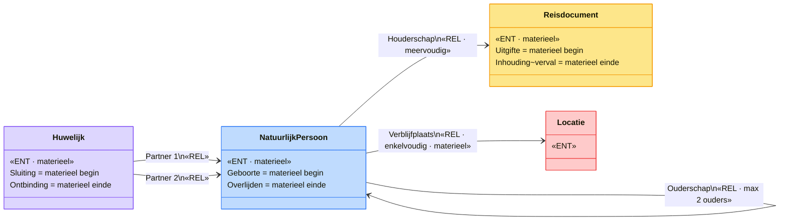
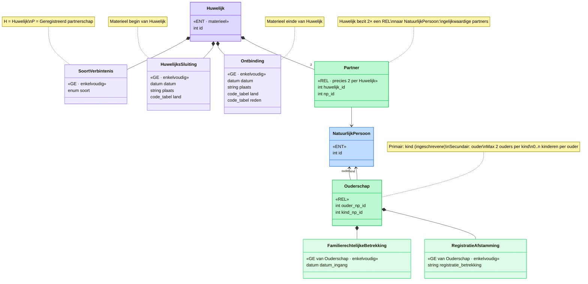
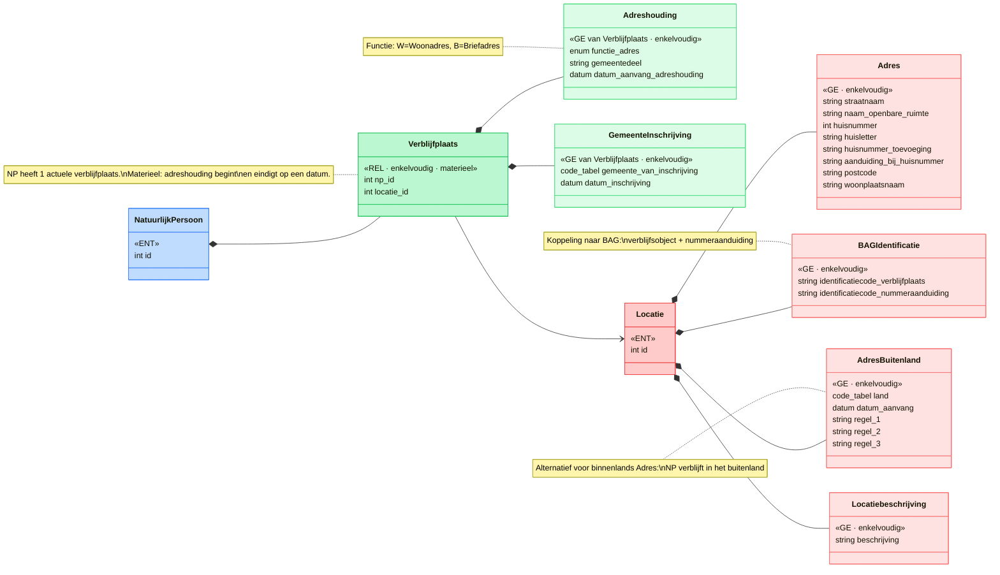
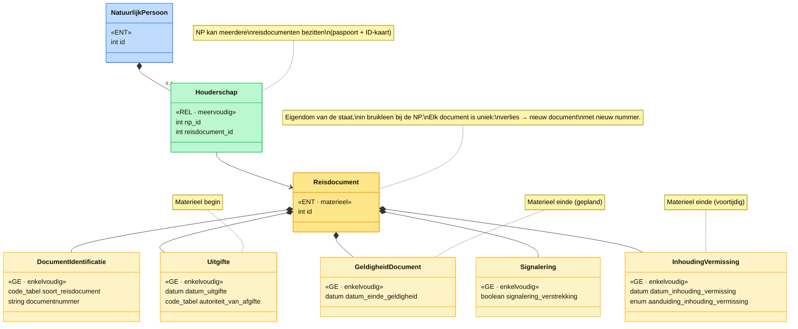
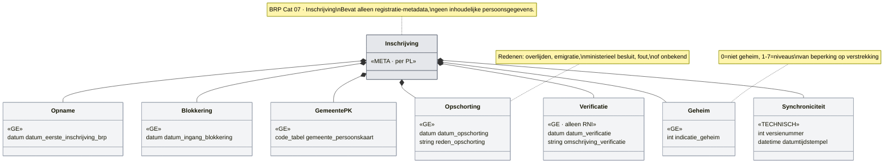
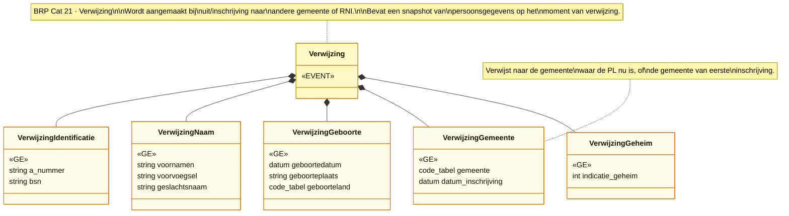
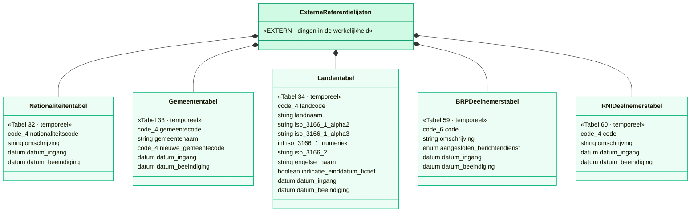
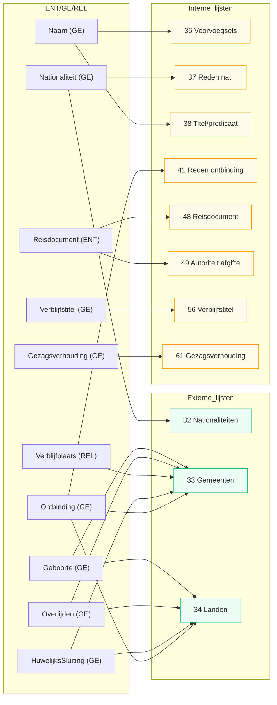

# BRP Informatiemodel — conceptueel UML-model

> **Bron:** Logisch Ontwerp BRP, versie 2026.Q2 (1 april 2026)
>
> **Doel:** Het destilleren van een conceptueel informatiemodel (entiteiten, gegevenselementen, relaties) uit het platte opslagmodel van de BRP-persoonslijst. Het BRP LO beschrijft categorieën → groepen → elementen op een "platte kaart". Hier vertalen we dat naar een genormaliseerd ENT/GE/REL-model in UML (Mermaid).
>
> **Modelleerconventies:**
> - **ENT** (entiteit): iets of iemand in de werkelijkheid met eigen identiteit en materieel bestaan
> - **GE** (gegevenselement): integraal onderdeel van een ENT, geen eigen identiteit buiten de ENT
> - **REL** (relatie): verbinding tussen twee ENTs, met een primaire (bezittende) en secundaire kant
> - Enkelvoudig/meervoudig: per formeel tijdstip t, kan een GE/REL 1× of n× voorkomen
> - Materieel: heeft een aanvang en (optioneel) einde in de werkelijkheid

---

## 1. Overzichtsdiagram

Vier entiteiten, vier relaties. Geen velden — alleen de structuur.

### Toelichting overzicht

| Entiteit | BRP-categorie | Materieel begin | Materieel einde |
|---|---|---|---|
| NatuurlijkPersoon | Cat 01 Persoon | Geboorte (datum, plaats, land) | Overlijden (datum, plaats, land) |
| Huwelijk | Cat 05 Huwelijk/GP | Sluiting (datum, plaats, land) | Ontbinding (datum, plaats, land, reden) |
| Reisdocument | Cat 12 Reisdocument | Uitgifte (datum, autoriteit) | Einde geldigheid / Inhouding |
| Locatie | Cat 08 Verblijfplaats (impliciet) | — | — |

**Belangrijk verschil met het generieke Aanvang/Einde-patroon:**
Geboorte, Overlijden, Sluiting en Ontbinding zijn *rijkere* GE's dan de generieke `Aanvang` (die alleen een datum heeft). Ze bevatten aanvullende velden zoals plaats en land. Ze fungeren als materieel begin/einde maar zijn inhoudelijke GE's op zichzelf.

---

## 2. NatuurlijkPersoon — kern

Alle gegevenselementen die direct onder de NatuurlijkPersoon vallen.

```mermaid
classDiagram
    direction TB

    class NatuurlijkPersoon {
        «ENT · materieel»
        int id
    }

    class Identificatie {
        «GE · enkelvoudig»
        string a_nummer
        string bsn
    }

    class Naam {
        «GE · enkelvoudig»
        string voornamen
        string adellijke_titel_predicaat
        string voorvoegsel
        string geslachtsnaam
    }

    class Geboorte {
        «GE · enkelvoudig»
        datum geboortedatum
        string geboorteplaats
        code_tabel geboorteland
    }

    class Geslacht {
        «GE · enkelvoudig»
        enum geslachtsaanduiding
    }

    class Naamgebruik {
        «GE · enkelvoudig»
        enum aanduiding_naamgebruik
    }

    class Overlijden {
        «GE · enkelvoudig»
        datum datum_overlijden
        string plaats_overlijden
        code_tabel land_overlijden
    }

    class Nationaliteit {
        «GE · meervoudig · materieel»
        code_tabel nationaliteit
        string reden_opname
        string reden_beeindiging
        string bijzonder_nederlanderschap
        string eu_persoonsnummer
    }

    class Verblijfstitel {
        «GE · enkelvoudig»
        code_tabel aanduiding
        datum datum_einde
        datum ingangsdatum
    }

    class Gezagsverhouding {
        «GE · enkelvoudig»
        enum indicatie_gezag_minderjarige
        boolean indicatie_curateleregister
    }

    class EuropeesKiesrecht {
        «GE · enkelvoudig»
        enum aanduiding
        datum datum_verzoek_mededeling
        datum einddatum_uitsluiting
    }

    class UitsluitingKiesrecht {
        «GE · enkelvoudig»
        enum aanduiding_uitgesloten
        datum einddatum
    }

    class Immigratie {
        «GE · enkelvoudig»
        code_tabel land_vanwaar_ingeschreven
        datum datum_vestiging_in_nederland
    }

    class Contactgegevens {
        «GE · enkelvoudig · alleen RNI»
        string telefoonnummer
        boolean telefoon_verificatie
        datum telefoon_geldig_vanaf
        string emailadres
        boolean email_verificatie
        datum email_geldig_vanaf
    }

    NatuurlijkPersoon *-- Identificatie
    NatuurlijkPersoon *-- Naam
    NatuurlijkPersoon *-- Geboorte
    NatuurlijkPersoon *-- Geslacht
    NatuurlijkPersoon *-- Naamgebruik
    NatuurlijkPersoon *-- Overlijden
    NatuurlijkPersoon *-- "0..*" Nationaliteit
    NatuurlijkPersoon *-- Verblijfstitel
    NatuurlijkPersoon *-- Gezagsverhouding
    NatuurlijkPersoon *-- EuropeesKiesrecht
    NatuurlijkPersoon *-- UitsluitingKiesrecht
    NatuurlijkPersoon *-- Immigratie
    NatuurlijkPersoon *-- Contactgegevens

    note for Geboorte "Fungeert als materieel begin\nvan NatuurlijkPersoon"
    note for Overlijden "Fungeert als materieel einde\nvan NatuurlijkPersoon"
    note for Nationaliteit "Meervoudig: persoon kan\nmeerdere nationaliteiten hebben.\nMaterieel: nationaliteit kan\nbeëindigd worden."
    note for Contactgegevens "Alleen voor niet-ingezetenen\n(RNI-deelnemers)"

    style NatuurlijkPersoon fill:#bfdbfe,stroke:#3b82f6
    style Identificatie fill:#dbeafe,stroke:#60a5fa
    style Naam fill:#dbeafe,stroke:#60a5fa
    style Geboorte fill:#dbeafe,stroke:#60a5fa
    style Geslacht fill:#dbeafe,stroke:#60a5fa
    style Naamgebruik fill:#dbeafe,stroke:#60a5fa
    style Overlijden fill:#dbeafe,stroke:#60a5fa
    style Nationaliteit fill:#dbeafe,stroke:#60a5fa
    style Verblijfstitel fill:#dbeafe,stroke:#60a5fa
    style Gezagsverhouding fill:#dbeafe,stroke:#60a5fa
    style EuropeesKiesrecht fill:#dbeafe,stroke:#60a5fa
    style UitsluitingKiesrecht fill:#dbeafe,stroke:#60a5fa
    style Immigratie fill:#dbeafe,stroke:#60a5fa
    style Contactgegevens fill:#dbeafe,stroke:#60a5fa
```

### BRP-groepen → GE mapping voor NatuurlijkPersoon

| GE | BRP-groep(en) | Voorkomen | Toelichting |
|---|---|---|---|
| Identificatie | 01 Identificatienummers | enkelvoudig | A-nummer + BSN |
| Naam | 02 Naam | enkelvoudig | Voornamen, voorvoegsel, geslachtsnaam, titel |
| Geboorte | 03 Geboorte | enkelvoudig | Datum + plaats + land; materieel begin |
| Geslacht | 04 Geslacht | enkelvoudig | M/V/O |
| Naamgebruik | 61 Naamgebruik | enkelvoudig | Hoe de geslachtsnaam wordt gevoerd |
| Overlijden | 08 Overlijden (cat 06) | enkelvoudig | Datum + plaats + land; materieel einde |
| Nationaliteit | 05 + 63/64/65/73 (cat 04) | **meervoudig, materieel** | Code, reden opname/beëindigen, bijzonder NL, EU-nr |
| Verblijfstitel | 39 (cat 10) | enkelvoudig | Alleen voor niet-Nederlanders |
| Gezagsverhouding | 32 + 33 (cat 11) | enkelvoudig | Gezag of curatele |
| EuropeesKiesrecht | 31 (cat 13) | enkelvoudig | EU-kiesrechtgegevens |
| UitsluitingKiesrecht | 38 (cat 13) | enkelvoudig | Uitsluiting van Nederlands kiesrecht |
| Immigratie | 14 (cat 08) | enkelvoudig | Land van herkomst, vestigingsdatum |
| Contactgegevens | 16 + 17 (cat 17) | enkelvoudig | Alleen RNI: telefoon + email |

---

## 3. Familierechtelijk — Ouderschap en Huwelijk

### Toelichting familierechtelijk model

**Ouderschap** is een REL tussen twee NatuurlijkPersoon-instanties. In het BRP LO verschijnen ouders als cat 02/03 (Ouder1/2) op de PL van het kind, en kinderen als cat 09 op de PL van de ouder. Dit zijn twee perspectieven op dezelfde relatie. In het BRP worden de naam-, geboorte- en identificatiegegevens van de gerelateerde persoon *gekopieerd* naar de relatie — dat is denormalisatie die in een conceptueel model niet nodig is (de REL verwijst naar het ENT-record van de gerelateerde NP).

**Huwelijk** is een zelfstandige ENT, geen REL. Het is een 'ding' in de werkelijkheid dat bestaat (wordt gesloten, kan ontbonden). Het heeft twee gelijkwaardige partners — daarom is het geen REL (die altijd asymmetrisch is: primair/secundair). In plaats daarvan heeft het Huwelijk 2× een Partner-REL naar NatuurlijkPersoon.

In het BRP LO (cat 05) wordt het huwelijk beschreven vanuit de PL van de ingeschrevene, inclusief gekopieerde gegevens van de partner. Conceptueel is het één Huwelijk-record met twee verwijzingen.

---

## 4. Verblijf en Bereikbaarheid

### Toelichting Verblijfplaats

In het BRP LO is cat 08 Verblijfplaats een complexe categorie die meerdere concepten combineert:

- **Groep 09 Gemeente** + **Groep 10 Adreshouding**: context over de inschrijving → gemodelleerd als GE's op de Verblijfplaats-REL
- **Groep 11 Adres** + **Groep 12 Locatie**: het fysieke adres → gemodelleerd als GE's op de Locatie-ENT
- **Groep 13 Adres buitenland**: alternatief voor binnenlands adres (of 11/12, of 13)
- **Groep 14 Immigratie**: eenmalige vestigingsgegevens → gemodelleerd als GE op NatuurlijkPersoon (zie §2)

NB: In het BRP kan een verblijfplaats binnenlands (groep 11 Adres) of buitenlands (groep 13) zijn, maar niet beide tegelijk. Bij een binnenlands adres is er altijd een BAG-koppeling.

**Vergelijking met np-loc model:** de Verblijfplaats-REL komt overeen met de Bereikbaarheid-REL in het bestaande np-loc model. Het `functie_adres` veld (W/B) komt overeen met het `soort` enum (Bereikbaarheidssoort).

---

## 5. Reisdocument

### Toelichting Reisdocument

Een Reisdocument (paspoort, Nederlandse Identiteitskaart) is een zelfstandige ENT: het is een fysiek object met eigen identiteit (documentnummer), eigendom van de staat, in bruikleen gegeven aan een NatuurlijkPersoon. Als een document verloren raakt, komt er een *nieuw* document — niet hetzelfde.

De Houderschap-REL is primair vanuit NatuurlijkPersoon (de persoon "heeft" documenten).

**Materiële levenscyclus:**
- **Begin**: Uitgifte (datum + autoriteit)
- **Gepland einde**: Datum einde geldigheid (verloopt)
- **Voortijdig einde**: Inhouding of vermissing (met aanduiding I=Ingehouden, V=Vermist)
- **Signalering**: blokkade op verstrekking van een nieuw document

---

## 6. Administratie / Metadata

Dit is *geen* inhoudelijk deel van het informatiemodel, maar beschrijft de registratie-context rond de persoonslijst. Vergelijkbaar met metadata over de registratie zelf.

---

## 7. Verwijzing (event)

Een Verwijzing is een geobjectiveerd event: het moment waarop een persoon wordt uit- of ingeschreven bij een gemeente of de RNI. De oorspronkelijke gemeente bewaart een kopie van de identificerende gegevens als doorverwijzing.

---

## 8. Landelijke tabellen — referentielijsten (analyse)

Het BRP LO definieert 15 "landelijke tabellen" (§4.7). Dit zijn code- of referentielijsten die *geen* onderdeel van de persoonslijst zijn, maar als hulpmiddel fungeren bij bijhouding en verstrekking. Elementen op de PL verwijzen via codes naar rijen in deze tabellen.

### Classificatie: intern vs. extern

Er is een duidelijk onderscheid te maken:

**Domein-inhoudelijke lijsten** — beschrijven "dingen in de werkelijkheid" die ook buiten de BRP bestaan:

| # | Tabel | Type | Sleutel | Kolommen | Temporeel | Toelichting |
|---|---|---|---|---|---|---|
| 32 | **Nationaliteitentabel** | extern | 4-cijferige code | code, omschrijving, datum ingang, datum beëindiging | ✓ geldigheidsperiode | Alle door NL erkende nationaliteiten. Bron: internationaal recht. |
| 33 | **Gemeententabel** | extern | 4-cijferige code | code, naam, nieuwe gemeentecode, datum ingang, datum beëindiging | ✓ geldigheidsperiode | Alle huidige en voormalige NL gemeenten. Bron: CBS. Bevat doorverwijzing (nieuwe gemeentecode) bij herindeling. |
| 34 | **Landentabel** | extern | 4-cijferige code | code, naam, ISO 3166-1 alpha-2/alpha-3/numeriek, ISO 3166-2, Engelse naam, indicatie einddatum fictief, datum ingang, datum beëindiging | ✓ geldigheidsperiode | Alle huidige en voormalige landen. Rijkste tabel: 8 kolommen incl. ISO-crossrefs. Bevat fictieve einddatums (indicator *). |
| 59 | **BRP-deelnemerstabel** | extern | 6-cijferige code | code, omschrijving, aangesloten op berichtendienst (0/1/2/3), datum ingang, datum beëindiging | ✓ geldigheidsperiode | Alle deelnemers aan het BRP-stelsel (gemeenten, afnemers). |
| 60 | **RNI-deelnemerstabel** | extern | 4-cijferige code | code, omschrijving, datum ingang, datum beëindiging | ✓ geldigheidsperiode | Bestuursorganen die als RNI-deelnemer gegevens leveren. |

**Domein-interne codelijsten** — zijn specifiek voor de BRP-registratie en coderen juridische of administratieve begrippen:

| # | Tabel | Type | Sleutel | Kolommen | Temporeel | Toelichting |
|---|---|---|---|---|---|---|
| 36 | **Voorvoegseltabel** | intern | voorvoegsel (tekst) | voorvoegsel | ✗ geen geldigheid | Toegestane voorvoegsels bij geslachtsnaam. Simpelste tabel: 1 kolom. |
| 37 | **Reden opnemen/beëindigen nationaliteit** | intern | 3-cijferige code | code, omschrijving, soort (VK/OP/VL/BE), datum ingang, datum beëindiging | ✓ geldigheidsperiode | Wettelijke gronden voor verkrijging/verlies NL-schap en opname/beëindiging overige nationaliteiten. |
| 38 | **Adellijke titel/predicaat** | intern | 1-2 letter code | code, omschrijving, soort ("titel"/"predicaat") | ✗ geen geldigheid | B=Baron, BS=Barones, G=Graaf, etc. |
| 39 | **Akteaanduiding** | intern | 3-positie code | aanduiding (register+deel+soort), omschrijving | ✗ geen geldigheid | Model van akten in burgerlijke stand. Positie 1: soort register (1=geboorte, 2=overlijden, 3=huwelijk, 5=GP). |
| 41 | **Reden ontbinding/nietigverklaring H/GP** | intern | 1-letter code | code, omschrijving, datum ingang, datum beëindiging | ✓ geldigheidsperiode | Wettelijke gronden voor ontbinding huwelijk/GP. |
| 48 | **Nederlands reisdocument** | intern | 2-letter code | code, omschrijving, datum ingang, datum beëindiging | ✓ geldigheidsperiode | Modellen van NL paspoorten en ID-kaarten. |
| 49 | **Autoriteit van afgifte reisdocument** | intern | 2-6 pos. code | code, omschrijving, datum ingang, datum beëindiging | ✓ geldigheidsperiode | Wie het reisdocument heeft uitgegeven. |
| 56 | **Verblijfstiteltabel** | intern | 2-cijferige code | code, omschrijving, datum ingang, datum beëindiging | ✓ geldigheidsperiode | Verblijfsrechtelijke statussen voor niet-Nederlanders. |
| 61 | **Gezagsverhoudingtabel** | intern | 1-2 pos. code | code, omschrijving, datum ingang, datum beëindiging | ✓ geldigheidsperiode | Mogelijke gezagsverhoudingen bij minderjarigen. |

**Systeem-/autorisatietabel** — puur voor de werking van het BRP-stelsel:

| # | Tabel | Type | Sleutel | Kolommen | Temporeel | Toelichting |
|---|---|---|---|---|---|---|
| 35 | **Autorisatietabel** | systeem | 6-cijferige code | code, naam, indicatie geheimhouding, verstrekkingsbeperking, rubrieknummers (spontaan/selectie/ad hoc), voorwaardenregels, media, etc. | ✓ geldigheidsperiode | Zeer uitgebreide tabel (>25 kolommen). Regelt welke afnemers welke rubrieken mogen ontvangen via welke kanalen. Puur systeem-metadata. |

### Overzicht in Mermaid

```mermaid
classDiagram
    direction TB

    class InterneCodelijsten {
        «INTERN · BRP-specifieke begrippen»
    }

    class Voorvoegseltabel {
        «Tabel 36 · statisch»
        string voorvoegsel
    }

    class RedenNationaliteit {
        «Tabel 37 · temporeel»
        code_3 code
        string omschrijving
        enum soort__VK_OP_VL_BE
        datum datum_ingang
        datum datum_beeindiging
    }

    class AdellijkeTitelPredicaat {
        «Tabel 38 · statisch»
        code_2 code
        string omschrijving
        enum soort__titel_predicaat
    }

    class Akteaanduiding {
        «Tabel 39 · statisch»
        code_3 aanduiding
        string omschrijving
    }

    class RedenOntbindingHuwelijk {
        «Tabel 41 · temporeel»
        code_1 code
        string omschrijving
        datum datum_ingang
        datum datum_beeindiging
    }

    class NederlandsReisdocument {
        «Tabel 48 · temporeel»
        code_2 code
        string omschrijving
        datum datum_ingang
        datum datum_beeindiging
    }

    class AutoriteitAfgifte {
        «Tabel 49 · temporeel»
        code_2_6 code
        string omschrijving
        datum datum_ingang
        datum datum_beeindiging
    }

    class Verblijfstiteltabel {
        «Tabel 56 · temporeel»
        code_2 code
        string omschrijving
        datum datum_ingang
        datum datum_beeindiging
    }

    class Gezagsverhoudingtabel {
        «Tabel 61 · temporeel»
        code_2 code
        string omschrijving
        datum datum_ingang
        datum datum_beeindiging
    }

    InterneCodelijsten *-- Voorvoegseltabel
    InterneCodelijsten *-- RedenNationaliteit
    InterneCodelijsten *-- AdellijkeTitelPredicaat
    InterneCodelijsten *-- Akteaanduiding
    InterneCodelijsten *-- RedenOntbindingHuwelijk
    InterneCodelijsten *-- NederlandsReisdocument
    InterneCodelijsten *-- AutoriteitAfgifte
    InterneCodelijsten *-- Verblijfstiteltabel
    InterneCodelijsten *-- Gezagsverhoudingtabel

    style InterneCodelijsten fill:#fef3c7,stroke:#d97706
    style Voorvoegseltabel fill:#fffbeb,stroke:#f59e0b
    style RedenNationaliteit fill:#fffbeb,stroke:#f59e0b
    style AdellijkeTitelPredicaat fill:#fffbeb,stroke:#f59e0b
    style Akteaanduiding fill:#fffbeb,stroke:#f59e0b
    style RedenOntbindingHuwelijk fill:#fffbeb,stroke:#f59e0b
    style NederlandsReisdocument fill:#fffbeb,stroke:#f59e0b
    style AutoriteitAfgifte fill:#fffbeb,stroke:#f59e0b
    style Verblijfstiteltabel fill:#fffbeb,stroke:#f59e0b
    style Gezagsverhoudingtabel fill:#fffbeb,stroke:#f59e0b
```

### Kenmerken en patronen

**Gemeenschappelijk patroon:** Bijna alle tabellen (12 van 15) hebben dezelfde basisstructuur:
- Een **code** (sleutel)
- Een **omschrijving** (leesbare tekst)
- **Datum ingang** en **datum beëindiging** tabelregel (temporele geldigheid)

Dit betekent dat ze temporeel zijn: tabelregels kunnen verlopen. Een nationaliteit die in 1990 bestond, hoeft in 2026 niet meer te bestaan (bijv. "Joegoslavisch"). De tabel bewaart dan een regel met einddatum.

**Drie uitzonderingen zonder temporele geldigheid:**
- Tabel 36 (Voorvoegseltabel): alleen een lijst van toegestane voorvoegsels, geen datums
- Tabel 38 (Adellijke titel/predicaat): statische lijst, geen datums
- Tabel 39 (Akteaanduiding): statische codelijst, geen datums

**Bijzondere tabellen:**
- **Tabel 34 (Landentabel)** is veruit de rijkste: 8 inhoudelijke kolommen inclusief 4 ISO 3166-crossrefs + een "indicatie einddatum fictief" vlag
- **Tabel 33 (Gemeententabel)** heeft een uniek veld: `nieuwe_gemeentecode` — een doorverwijzing bij gemeentelijke herindeling (de oude gemeentecode verwijst naar de nieuwe)
- **Tabel 35 (Autorisatietabel)** is een buitenbeentje: >25 kolommen, puur systeemtechnisch, geen domeininhoud
- **Tabel 37 (Reden nationaliteit)** heeft een `soort`-kolom die dubbelgebruik van dezelfde tabel mogelijk maakt: VK (verkrijging) en OP (opname) voor element 63.10, VL (verlies) en BE (beëindiging) voor element 64.10

### Welke GE/REL gebruikt welke tabel

### Mapping naar v06 referentielijstmodel

In het v06-model is het referentielijst-concept al geïmplementeerd: de `Referentielijst` is een generieke ENT met instantie-records (bijv. "Landenlijst"), en items als relatie (bijv. `LandenlijstLand`). De BRP-tabellen mappen hier als volgt op:

| BRP-tabel | v06-equivalent | Wijze |
|---|---|---|
| 34 Landentabel | Referentielijst instantie "Landenlijst" + LandenlijstLand items | Al geïmplementeerd in np-loc |
| 32 Nationaliteitentabel | Referentielijst instantie "Nationaliteiten" + items | Nieuw; zelfde patroon als Landenlijst |
| 33 Gemeententabel | Referentielijst instantie "Gemeenten" + items | Nieuw; extra veld: nieuwe_gemeentecode (doorverwijzing) |
| 36 Voorvoegseltabel | Kleine statische enum of referentielijst | Eenvoudigst als enum |
| 38 Adellijke titel/predicaat | Kleine statische enum of referentielijst | Eenvoudigst als enum met soort-discriminator |
| 37, 41 Reden-tabellen | Referentielijst instanties | Temporeel; soort-kolom voor dubbelgebruik |
| 48, 49 Reisdocument-tabellen | Referentielijst instanties | Temporeel |
| 56 Verblijfstiteltabel | Referentielijst instantie | Temporeel |
| 61 Gezagsverhoudingtabel | Referentielijst instantie | Temporeel |
| 35 Autorisatietabel | Buiten scope (systeem-metadata) | Niet relevant voor informatiemodel |
| 59, 60 Deelnemerstabellen | Referentielijst instanties of buiten scope | Organisatiegegevens, niet direct PL-inhoud |

---

## Bijlage: Volledige mapping BRP-categorieën → model

| BRP Cat | Naam | Model-element | Type | Toelichting |
|---|---|---|---|---|
| 01 | Persoon | NatuurlijkPersoon | ENT | Kernentiteit |
| 02/03 | Ouder1/Ouder2 | Ouderschap | REL | Denormalisatie van ouder-gegevens op kind-PL |
| 04 | Nationaliteit | Nationaliteit | GE (NP) | Meervoudig, materieel |
| 05 | Huwelijk/GP | Huwelijk + Partner | ENT + REL | Zelfstandig 'ding' met twee partner-RELs |
| 06 | Overlijden | Overlijden | GE (NP) | Materieel einde van NP |
| 07 | Inschrijving | Inschrijving | META | Registratie-metadata |
| 08 | Verblijfplaats | Verblijfplaats + Locatie | REL + ENT | REL van NP→Locatie; adres-GEs op Locatie |
| 09 | Kind | Ouderschap (omgekeerd) | REL | Zelfde REL, nu vanuit ouder-perspectief |
| 10 | Verblijfstitel | Verblijfstitel | GE (NP) | |
| 11 | Gezagsverhouding | Gezagsverhouding | GE (NP) | |
| 12 | Reisdocument | Reisdocument + Houderschap | ENT + REL | Zelfstandig fysiek object |
| 13 | Kiesrecht | EuropeesKiesrecht + UitsluitingKiesrecht | GE (NP) | |
| 14 | Afnemersindicatie | — | buiten scope | Systeem-metadata BRP-V |
| 16 | Tijdelijk verblijfsadres | Verblijfplaats (variant) | REL | Alleen RNI |
| 17 | Contactgegevens | Contactgegevens | GE (NP) | Alleen RNI |
| 21 | Verwijzing | Verwijzing | EVENT | Geobjectiveerd event |

---

## Vergelijking met bestaand np-loc model

| Aspect | np-loc model (v06) | BRP conceptueel |
|---|---|---|
| NatuurlijkPersoon | ✓ ENT met Identificatie, Naam, Burgerschap | ✓ Uitgebreider: + Geboorte, Geslacht, Overlijden, etc. |
| Materieel begin NP | generieke `Aanvang` (alleen datum) | `Geboorte` GE (datum + plaats + land) |
| Materieel einde NP | generieke `Einde` (alleen datum) | `Overlijden` GE (datum + plaats + land) |
| Locatie | ✓ ENT met Adres, BAGlocatie | ✓ Vergelijkbaar + AdresBuitenland |
| Bereikbaarheid | ✓ REL NP→Locatie met soort | ≈ Verblijfplaats REL met functie_adres |
| Burgerschap/Nationaliteit | ✓ GE meervoudig: landcode, nationaliteit | ✓ Vergelijkbaar + reden opname/beëindigen, bijzonder NL |
| Huwelijk | — (niet in np-loc) | ✓ Aparte ENT met Partner-RELs |
| Reisdocument | — (niet in np-loc) | ✓ Aparte ENT met Houderschap-REL |
| Ouderschap | — (niet in np-loc) | ✓ REL NP↔NP |
