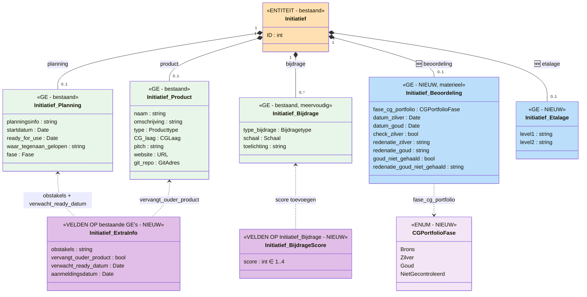

# Analyse Extra-data CG Portfolio

## Bronbestanden

| Bestand | Rijen (raw) | Na CRLF-fix | Na dedup (per ID) | Kolommen |
|---------|-------------|-------------|---------------------|----------|
| `uitgebreid.txt` | 769 | 218 (11 corrupt) | **60 unieke initiatieven** | 95 |
| `Compact.txt` | 769 | ~218 | ~60 | 95 |

### CRLF-probleem
Velden met vrije tekst (Obstakels, Korte omschrijving, Bijdrage-teksten) bevatten embedded CRLF's die regels afbreken. Fix: herken goede regelstart als `0\t{ID}\t`, join tussenregels. 11 rijen (ID=70, 76×8, 107, 111) blijven corrupt na fix (extra tabs in vrije tekst).

### Duplicatie
Rijen zijn gedupliceerd per multi-valued veld (Gemeenten die gebruik maken). Na dedup op ID: **60 unieke initiatieven**.

---

## Kolom-mapping: wat is al in het model, wat is nieuw?

### Al gedekt door het huidige CG-model

| # | Kolom | → Huidig model |
|---|-------|----------------|
| 1 | Id | `Initiatief.ID` + `Initiatief_Initiatiefinfo.PbiID` |
| 4 | Naam | `Initiatief_Product.naam` |
| 8 | Identificatie | (PbiID mapping) |
| 9 | Korte omschrijving | `Initiatief_Product.omschrijving` |
| 10 | Type | `Initiatief_Product.type` (enum Producttype) |
| 12-13 | Gemeenten realisatie/gebruik | `InitiatiefGemeente` (rel met Gemeenterol) |
| 14 | Startdatum initiatief | `Initiatief_Planning.startdatum` |
| 15 | Contact organisatie | `InitiatiefOrganisatie` (rol=Contactorganisatie) |
| 16 | Contactpersoon | `Contactpersoon` (rel Organisatie→Persoon) |
| 17-19 | Bijdrage wendbaarheid/dienstverlening/regie | `Initiatief_Bijdrage.toelichting` (tekst) |
| 20 | Informatie over de planning | `Initiatief_Planning.planningsinfo` |
| 21 | Toegepaste standaarden | `InitiatiefAPIStandaard` (rel) |
| 23 | Fase initiatief | `Initiatief_Planning.fase` (enum Fase) — **identiek** |
| 32-35 | Gemeenten gebruik/realisatie + leveranciers | `InitiatiefGemeente` + `InitiatiefOrganisatie` |
| 34 | Website | `Initiatief_Product.website` |
| 42 | Github | `Initiatief_Product.git_repo` |
| 45 | ReadyForUse | `Initiatief_Planning.ready_for_use` |
| 56-65 | Domeinen (unpivoted) | `InitiatiefDomein` (rel) |
| 66-70 | Organisatietypes (unpivoted) | `Initiatief_BetrokkenOrganisatie.type` |
| 71-75 | Lagen (unpivoted) | `Initiatief_Product.CG_laag` (enum CGLaag) |

### **NIEUW — niet in het huidige model**

| # | Kolom | Waarden | Voorstel |
|---|-------|---------|----------|
| **27** | **Fase CG portfolio** | `Brons` (10), `Zilver` (24), `Goud` (12), `Niet gecontroleerd` (3) | **Nieuw enum `CGPortfolioFase`** |
| **36** | **Maandzilver** | Datum (bijv. `3/11/2024 11:00:00 PM`) | Datum beoordeling Zilver |
| **37** | **Maandgoud** | Datum (bijv. `5/27/2024 10:00:00 PM`) | Datum beoordeling Goud |
| **26** | **Checkcategoriezilver** | `ja` (2), `nee` (33) | Boolean: voldoet aan zilver-criteria |
| **39** | **RedenatiepromoverenZilver** | Vrije tekst (motivatie) | string |
| **40** | **Redenatiepromoverengoud** | Vrije tekst (motivatie) | string |
| **46** | **Goudnietgehaald** | `Ja` (1) | Boolean: goud-assessment gefaald |
| **47** | **Redenatiegoudnietgehaald** | Vrije tekst | string |
| **43** | **Etalagelevel1** | `Platform dienstverlening` (12), `Nee` (1) | string (classificatie) |
| **44** | **Etalagelevel2** | `Online Interactie omgeving` (1) | string (classificatie) |
| **29-31** | **Bijdragescores** (OData_16/18/22) | 1–4 (numeriek) | int scores voor wendbaarheid/dienstverlening/regie |
| **24** | **Obstakels** | Vrije tekst | string |
| **22** | **Vervangt ouder product** | `Ja`/`Nee` | boolean |
| **28** | **Verwacht ready datum** | Datum (`2024-02-01`) | Datum |
| **38** | **Uitgebreide beschrijving** | (lang) | string (pitch-achtig) |
| **50** | **Aanmeldingsdatum** | Datum | Datum eerste aanmelding |
| **49** | **Modified** | Datum | SharePoint last modified |

---

## Mermaid-diagram: extra data t.o.v. Initiatief



### Legenda
- 🟠 **Oranje**: bestaande entiteit (Initiatief)
- 🟢 **Groen**: bestaande GE's
- 🔵 **Blauw**: **NIEUWE** GE's
- 🟣 **Paars**: **NIEUWE** velden op bestaande GE's / enums

---

## Voorstel voor modeluitbreiding

### 1. Nieuw GE: `Initiatief_Beoordeling` (materieel, enkelvoudig)

Dit is de kern van de nieuwe data: het CG Portfolio beoordelingsproces (Brons → Zilver → Goud).

| Veld | Type | Bron kolom |
|------|------|-----------|
| `fase_cg_portfolio` | enum `CGPortfolioFase` | col 27: Fase CG portfolio |
| `datum_zilver` | Date | col 36: Maandzilver |
| `datum_goud` | Date | col 37: Maandgoud |
| `check_zilver` | bool | col 26: Checkcategoriezilver |
| `redenatie_zilver` | string | col 39: RedenatiepromoverenZilver |
| `redenatie_goud` | string | col 40: Redenatiepromoverengoud |
| `goud_niet_gehaald` | bool | col 46: Goudnietgehaald |
| `redenatie_goud_niet_gehaald` | string | col 47: Redenatiegoudnietgehaald |

**Materieel** omdat een beoordeling door de tijd heen verandert (Brons → Zilver → Goud).

### 2. Nieuw GE: `Initiatief_Etalage` (enkelvoudig)

| Veld | Type | Bron kolom |
|------|------|-----------|
| `level1` | string | col 43: Etalagelevel1 |
| `level2` | string | col 44: Etalagelevel2 |

### 3. Nieuw enum: `CGPortfolioFase`

```
"Brons", "Zilver", "Goud", "Niet gecontroleerd"
```

### 4. Nieuwe velden op bestaande GE's

| GE | Nieuw veld | Type | Bron |
|----|-----------|------|------|
| `Initiatief_Bijdrage` | `score` | int (1-4) | col 29/30/31 (per bijdragetype) |
| `Initiatief_Planning` | `obstakels` | string | col 24 |
| `Initiatief_Planning` | `verwacht_ready_datum` | Date | col 28 |
| `Initiatief_Product` | `vervangt_ouder_product` | bool | col 22 |

### 5. Meta-data (niet in model)

Deze kolommen zijn SharePoint/OData-metadata en horen *niet* in het model:
- col 0: FileSystemObjectType (altijd 0)
- col 2-3: ServerRedirectedEmbedUri/Url
- col 5: OData__ColorTag, col 6: ComplianceAssetId
- col 48: ID.1 (duplicaat), col 51-53: AuthorId/EditorId/UIVersionString
- col 54-55: Attachments, GUID
- col 49: Modified (SharePoint), col 50: Aanmeldingsdatum (→ evt. later als registratiedatum)

---

## Datakwaliteit

| Issue | Aantal | Impact |
|-------|--------|--------|
| CRLF in vrije tekst | ~550 gebroken regels | Fix via regex op regelstart `0\t{ID}` |
| Corrupt na fix (extra tabs) | 11 rijen (ID=70, 76, 107, 111) | Handmatige inspectie nodig |
| Duplicatie per gemeente | ~3.4× gemiddeld | Dedup op ID |
| Lege "Fase CG portfolio" | 11 van 60 | Onbeoordeelde initiatieven |

---

## Implementatiestatus (juni 2025)

### ✅ V3 JSON export + aanpassing
- CG-domein geëxporteerd via `go run ./cmd/export_v3 --domein CG`
- Alle uitbreidingen (§1–§4) verwerkt in `_temp/cg_export_clean.v3.json`

### ✅ Codegen
- `go run ./cmd/codegen --input _temp/cg_export_clean.v3.json --output model/ --prefix cg --mode additive --domein CG`
- 8 bestanden gegenereerd, `go build ./...` slaagt

### ✅ DB-migratie
- **Nieuwe tabellen** (auto via Bun ORM `IfNotExists()` bij startup):
  - `initiatief_beoordeling` (hub)
  - `initiatief_beoordeling_data` (_Data)
  - `initiatief_beoordeling_aanvang` (_Aanvang)
  - `initiatief_beoordeling_einde` (_Einde)
  - `initiatief_etalage` (hub)
  - `initiatief_etalage_data` (_Data)
- **Nieuwe kolommen** op bestaande tabellen (handmatige SQL):
  - `dbsetup/migrations/20260611_add_cg_beoordeling_etalage_extra_velden.sql`

| Tabel | Kolom | Type |
|-------|-------|------|
| `initiatief_planning_data` | `obstakels` | TEXT |
| `initiatief_planning_data` | `verwacht_ready_datum` | DATE |
| `initiatief_product_data` | `vervangt_ouder_product` | BOOLEAN |
| `initiatief_bijdrage_data` | `score` | INTEGER |
| `initiatief_initiatiefinfo_data` | `aanmeldingsdatum` | DATE |

### ✅ Replay + SQL data-import
- **Generator**: `Replay files/generate_extra_data_replay.py`
- **Replay**: `7. Extra data CG Portfolio.replay.json` — 50 entries (48 beoordelingen, 15 etalages)
- **SQL updates**: `7b. Extra data CG Portfolio - updates.sql` — extra velden op bestaande records
- **Matching**: 61/64 rijen gematcht op productnaam uit replay 4
  - 3 niet gematcht (niet in replay 4): OneGround, MijnOmgeving-as-a-service, OPENinschrijving

| Bestand | Type data | Methode |
|---------|-----------|---------|
| Replay 7 | Beoordeling (hub+data), Etalage (hub+data) | Opvoer via `/registratie/` |
| SQL 7b | obstakels, verwacht_ready_datum, score, vervangt_ouder_product, aanmeldingsdatum | Direct UPDATE op _Data records |

### ⚠️ Volgorde van uitvoering
1. Schema-migratie: `dbsetup/migrations/20260611_add_cg_beoordeling_etalage_extra_velden.sql`
2. Start backend (Bun maakt nieuwe tabellen aan)
3. Replay 1–4 afspelen (als dat nog niet gebeurd is)
4. Replay 7 afspelen (beoordeling + etalage opvoer)
5. SQL 7b uitvoeren (extra velden op bestaande records)

```bash
psql -U <user> -d bitemp_go_db_v06 -f dbsetup/migrations/20260611_add_cg_beoordeling_etalage_extra_velden.sql
```
