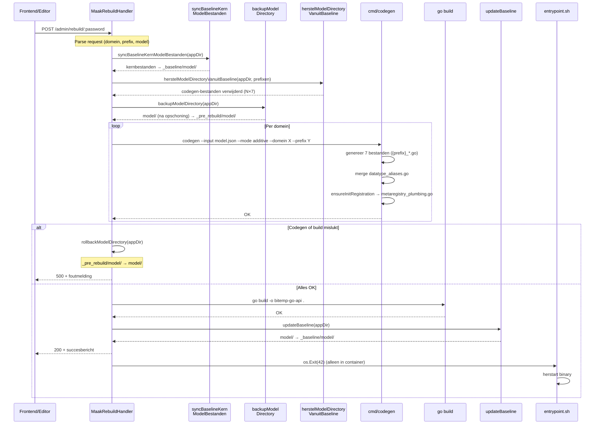

# Devloop — Self-rebuilding Register in Docker

## Concept

De **devloop** omgeving is een Docker-setup waarin het register zichzelf kan
hergenereren en hercompileren. De container bevat niet alleen de draaiende
API, maar ook de volledige Go-toolchain en broncode. Hierdoor kun je via de
UML-editor het model wijzigen, code laten genereren, en de API herstarten —
allemaal binnen dezelfde container.

```
┌──────────────────────────────────────────────────────┐
│  Docker: bitemp-devloop-api                          │
│                                                      │
│   ┌──────────┐   V3 JSON    ┌──────────┐            │
│   │  Frontend │ ──────────→ │ /admin/  │            │
│   │  Editor   │             │ rebuild  │            │
│   └──────────┘             └────┬─────┘            │
│                                  │                   │
│                    ┌─────────────▼──────────────┐   │
│                    │  1. codegen (V3 → Go)      │   │
│                    │  2. go build               │   │
│                    │  3. herstart API (exit 42)  │   │
│                    └────────────────────────────┘   │
│                                                      │
│   ┌──────────────────────────────────┐              │
│   │  entrypoint.sh (restart loop)    │              │
│   │  → start binary                  │              │
│   │  → exit 42? → herstart           │              │
│   └──────────────────────────────────┘              │
└──────────────────────────────────────────────────────┘
         │
         ▼
┌──────────────────┐
│  PostgreSQL DB   │
└──────────────────┘
```

## Bestanden

| Bestand | Doel |
|---------|------|
| `Dockerfile.devloop` | Docker image met Go + Node + volledige source |
| `docker-compose.devloop.yml` | Compose met PostgreSQL + devloop container |
| `scripts/devloop-entrypoint.sh` | Entrypoint met automatische herstart loop |
| `handlers/rebuild_handler.go` | API endpoint voor rebuild |

## Starten

```bash
cd bitemp_register_v06

# Bouw en start de devloop omgeving
docker compose -f docker-compose.devloop.yml up --build
```

De API is standaard bereikbaar op `http://localhost:8182` in de devloop-compose.

> In de UML-editor wordt bij lokaal Vite-dev (`:5173`/`:5174`/`:5175`) standaard ook `http://localhost:8182` als API-basis voorgesteld. Buiten Vite-dev valt de editor terug op `window.location.origin`.

### Lokaal testen buiten Docker

De rebuild-flow heeft **geen harde afhankelijkheid op poort `8182`**. Je kunt hem dus ook lokaal testen, bijvoorbeeld op `http://localhost:8082`, zolang de API met `DEVLOOP=true` gestart is.

Sinds 2026-04-04 is de automatische `os.Exit(42)` herstart **alleen actief in container-modus** (`DEVLOOP_CONTAINER=true`). Daardoor geldt:

- **Docker / devloop-compose** → na een succesvolle rebuild sluit de API af met exit code `42`, waarna `devloop-entrypoint.sh` automatisch de nieuwe binary herstart.
- **Lokale Go-run op Windows/macOS/Linux** → de rebuild werkt ook, maar het proces blijft na succes gewoon draaien; je hoeft dus niet handmatig opnieuw te starten.
- Een UI op `http://localhost:8182` mag daarbij ook een lokale API op `http://localhost:8082` aanroepen; de CORS-middleware staat deze lokale dev-origins expliciet toe.

## Model wijzigen en rebuilden

### Via de frontend editor

1. Open de UML-editor: `http://localhost:8182/viz/react/editor-v2.html`
2. Wijzig het model
3. Klik **Publiceer naar Schema Registry** (de V3 JSON wordt opgeslagen)
4. Stuur een rebuild request:

```bash
# Haal het gepubliceerde model op en stuur het door naar rebuild
curl -s http://localhost:8182/api/schema/model | \
  curl -X POST http://localhost:8182/admin/rebuild/1234 \
    -H "Content-Type: application/json" \
    -d @-
```

### Via een V3 JSON bestand

```bash
curl -X POST http://localhost:8182/admin/rebuild/1234 \
  -H "Content-Type: application/json" \
  -d '{
    "domein": "register",
    "prefix": "register",
    "mode": "additive",
    "model": { ... V3 JSON hier ... }
  }'
```

### Multi-domein rebuild/codegen

De rebuild-endpoint ondersteunt ook meerdere codegen-runs in één keer. Dat is de standaardroute voor het schema waarin bijvoorbeeld `register`, `np-loc` en `abuvwxy` naast elkaar bestaan.

Alle domeinen gebruiken **additive** mode met een eigen prefix:
- `register` → `prefix: register`
- `np-loc` → `prefix: np_loc`
- `abuvwxy` → `prefix: abuvwxy`

Standalone mode is niet meer nodig: elk domein genereert zijn eigen `{prefix}_*` bestanden. De lege `var MetaRegistry` en `var DatatypeRegistry` declaraties staan in `metaregistry_plumbing.go`; domein-specifieke entries worden via `initXxxMetaRegistry()`/`initXxxDatatypeRegistry()`/`initXxxEnumRegistry()` functies toegevoegd.

> **Let op**: het abuvwxy-domein (A, B entiteiten) is handmatig onderhouden referentiecode en staat *niet* in het V3 model JSON. De `abuvwxy_*` bestanden worden daarom niet door de codegen gegenereerd, maar handmatig beheerd in dezelfde additive structuur als de andere domeinen.

```bash
curl -X POST http://localhost:8182/admin/rebuild/1234 \
  -H "Content-Type: application/json" \
  -d '{
    "schema_versie_id": 27,
    "domeinen": [
      { "domein": "register", "prefix": "register", "mode": "additive" },
      { "domein": "np-loc",   "prefix": "np_loc",   "mode": "additive" },
      { "domein": "abuvwxy",  "prefix": "abuvwxy",  "mode": "additive" }
    ]
  }'
```

> In de editor wordt dit nu via checkboxen ondersteund: je kunt één of meer beschikbare domeinen aankruisen voor `Rebuild` of `Publiceer + Rebuild`.

### Rebuild vanuit databaseversie

Het endpoint kan het model ook rechtstreeks uit `schema_versies` laden. Dat is handig om een eerder gepubliceerd model opnieuw te genereren zonder eerst iets vanuit de editor op te halen.

```bash
curl -X POST http://localhost:8182/admin/rebuild/1234 \
  -H "Content-Type: application/json" \
  -d '{
    "schema_versie_id": 27,
    "domeinen": [
      { "domein": "register", "prefix": "register", "mode": "additive" },
      { "domein": "np-loc",   "prefix": "np_loc",   "mode": "additive" },
      { "domein": "abuvwxy",  "prefix": "abuvwxy",  "mode": "additive" }
    ]
  }'
```

Ondersteunde bronnen zijn:
- `model` in de request body — actuele editorinhoud
- `schema_versie_id` — expliciet record uit `schema_versies`
- `schema_bron: "actief"`
- `schema_bron: "latest_proposed"`
- geen body — export vanuit de huidige code/MetaRegistry

### Zonder model (huidige code re-exporteren en rebuilden)

```bash
curl -X POST http://localhost:8182/admin/rebuild/1234 \
  -H "Content-Type: application/json" \
  -d '{"domein": "register"}'
```

## Devloop status controleren

```bash
curl http://localhost:8182/admin/rebuild/status
```

Retourneert:
```json
{
  "devloop": true,
  "go_versie": "go version go1.24 linux/amd64",
  "codegen_beschikbaar": true,
  "werkdirectory": "/app",
  "model_directory": "/app/model"
}
```

## Hoe het werkt

### Overzicht

1. **Entrypoint** (`devloop-entrypoint.sh`) start de API binary in een loop.
2. **Rebuild endpoint** (`POST /admin/rebuild/:password`) ontvangt een V3 model of haalt er één uit de database/code.
3. De rebuild-handler voert een veilige **backup → opschoning → codegen → build** cyclus uit (zie stappen hieronder).
4. Alleen bij succes wordt de baseline bijgewerkt en herstart de API.

### Rebuild-stappen in detail

De rebuild-handler (`MaakRebuildHandler()` in `handlers/rebuild_handler.go`) doorloopt deze stappen:

#### Stap 0a: Baseline-synchronisatie van kernbestanden

Functie: `syncBaselineKernModelBestanden(appDir)`

Handmatige kernbestanden in `model/` worden **gekopieerd** naar `_baseline/model/`, zodat de baseline altijd de meest recente versie bevat. Dit is nodig voor de crash-fallback (zie [Fallback / rollback gedrag](#fallback--rollback-gedrag)).

De gesynchroniseerde bestanden (`baselineKernModelBestanden`):
- `model_plumbing.go` — interfaces, plumbing-types
- `metaregistry_plumbing.go` — `TypeMeta`-struct, `var MetaRegistry`, `init()` met alle `initXxx()` calls
- `v3_format.go` — V3 JSON structs
- `v3_exporter.go` — MetaRegistry → V3 JSON export
- `gebruiker.go` — gebruiker/autorisatie-model
- `json/` — bewust bewaarde V3 JSON-bronbestanden (zoals `model/json/model v3/*`)

> **Let op:** deze stap **kopieert** de bestanden naar `_baseline/model/` maar haalt ze **niet** weg uit `model/`. Het is een synchronisatie, geen verplaatsing.

#### Stap 0b: Opschoning van codegen-bestanden

Functie: `herstelModelDirectoryVanuitBaseline(appDir, prefixen)`

Nu worden de codegen-gegenereerde bestanden voor de doeldomeinen **verwijderd** uit `model/`. Per domeinprefix worden exact **7 bestanden** verwijderd:

| # | Suffix | Inhoud |
|---|--------|--------|
| 1 | `{prefix}_datatype_registry.go` | Custom datatype-registraties voor dit domein |
| 2 | `{prefix}_enum_registry.go` | Enum-registraties voor dit domein |
| 3 | `{prefix}_metaregistry.go` | `TypeMeta`-entries + `initXxxMetaRegistry()` functie |
| 4 | `{prefix}_modellen_entiteiten.go` | Entiteitstructs + materiële plumbing |
| 5 | `{prefix}_modellen_ge_rel.go` | GE/relatie hubs + \_Data + \_Aanvang/\_Einde structs |
| 6 | `{prefix}_modellen_input.go` | Afgevlakte input-structs voor registratie-API |
| 7 | `{prefix}_modellen_methods.go` | Interface-implementaties (GetID, Metatype, etc.) |

Bij een **single-domein rebuild** (bijv. `prefix=np_loc`) worden alleen die 7 bestanden verwijderd; bestanden van andere domeinen blijven staan. Bij een **volledige rebuild** (alle domeinen) worden de 7 bestanden van elk domein verwijderd, én ook het gedeelde bestand `datatype_aliases.go` (zie [Gedeelde bestanden](#gedeelde-bestanden-bij-rebuild)).

Alle handmatige bestanden, tests, utilities en submappen (`json/`, `*_test.go`, etc.) blijven altijd intact.

#### Stap 0c: Backup van model/ naar \_pre\_rebuild/

Functie: `backupModelDirectory(appDir)`

De **gehele** `model/`-directory (na opschoning) wordt gekopieerd naar `_pre_rebuild/model/`. Dit is de rollback-bron: als codegen of build mislukt, wordt `model/` vanuit deze backup hersteld. Omdat de backup ná de opschoning wordt gemaakt, bevat deze alle handmatige bestanden en bestanden van niet-doeldomeinen, maar niet de zojuist verwijderde codegen-bestanden van het doeldomein.

#### Stap 1: Modelbron bepalen en opslaan

Het V3 model wordt uit één van de bronnen opgehaald (request body, schema_versie, code-export) en tijdelijk weggeschreven als `_devloop_model.json`.

#### Stap 2: Codegen per domein

Per geselecteerd domein wordt een aparte codegen-run uitgevoerd (altijd in `additive` mode). Elk domein genereert opnieuw de 7 bestanden.

De codegen doet daarbij twee extra dingen met gedeelde bestanden:

1. **`datatype_aliases.go`** — nieuw gegenereerde type-aliases worden **gemerged** met de bestaande types in dit bestand (via `mergeGedeeldBestand()`). Hierdoor verdwijnen types van andere domeinen niet. Zie [Gedeelde bestanden bij rebuild](#gedeelde-bestanden-bij-rebuild).

2. **`metaregistry_plumbing.go`** — de codegen controleert via `ensureInitRegistration()` of de drie init-calls (`initXxxMetaRegistry()`, `initXxxDatatypeRegistry()`, `initXxxEnumRegistry()`) voor het domein al in de `init()` functie staan. Zo niet, worden ze automatisch toegevoegd vóór `propageerDomeinNaarOnderliggende()`. Bij afwijkende casing worden bestaande calls gecorrigeerd.

Bij een fout in codegen wordt `model/` direct gerestored vanuit `_pre_rebuild/model/` (rollback).

#### Stap 3: Go build

`go build` compileert de nieuwe binary. Bij een buildfout wordt `model/` eveneens gerestored vanuit `_pre_rebuild/model/`.

#### Stap 4: Succes-afhandeling

Alleen bij een succesvolle build:
- `updateBaseline(appDir)` overschrijft `_baseline/model/` met de nieuw bewezen `model/`
- de API stuurt een succes-response terug
- **alleen als `DEVLOOP_CONTAINER=true`**: de API exit met code `42`
- het tijdelijke `_devloop_model.json` wordt opgeruimd
- een auto-snapshot wordt opgeslagen als `IdeBestand`

#### Stap 5: Herstart (Docker)

Het Docker-entrypoint detecteert exit code `42` en herstart de nieuwe binary. Buiten Docker blijft de lokale server na een rebuild gewoon actief.

### Sequence diagram: rebuild function calls



### Gedeelde bestanden bij rebuild

Twee bestanden in `model/` zijn **niet** domeinspecifiek maar worden wél door de codegen aangepast:

#### `datatype_aliases.go` — gedeelde Go type-aliases

Dit bestand bevat Go type-aliases voor custom datatypes die in het V3 model zijn gedefinieerd:

```go
type NLPostcode string
type BSN string
type Datum string
type URL string
type Emailadres string
type Telefoonnummer string
type GitAdres string
```

Deze aliases worden in de hele codebase gebruikt (structs, handlers, GraphQL-types, etc.) en zijn **gedeeld over alle domeinen**. Meerdere domeinen kunnen dezelfde datatypes gebruiken (bijv. `BSN` wordt in zowel `np-loc` als `register` gebruikt).

**Bij rebuild:**
- **Single-domein**: `datatype_aliases.go` wordt **niet** verwijderd. De codegen merget nieuwe types in het bestaande bestand via `mergeGedeeldBestand()`, zodat types van andere domeinen behouden blijven.
- **Volledige rebuild**: `datatype_aliases.go` wordt wél verwijderd en opnieuw gegenereerd door de codegen-runs van alle domeinen (de eerste run creëert, vervolgrunnen mergen).

#### `metaregistry_plumbing.go` — centrale init-registratie

Dit bestand bevat de `init()` functie die bij het starten van de applicatie de domein-specifieke init-functies aanroept:

```go
func init() {
    initAbuvwxyEnumRegistry()
    initAbuvwxyDatatypeRegistry()
    initAbuvwxyMetaRegistry()
    initRegisterEnumRegistry()
    initRegisterDatatypeRegistry()
    initRegisterMetaRegistry()
    // ... etc. per domein ...
    propageerDomeinNaarOnderliggende()
}
```

De codegen past dit bestand aan via `ensureInitRegistration()`:
- Als de init-calls voor het domein **ontbreken**, worden ze automatisch toegevoegd vóór `propageerDomeinNaarOnderliggende()`.
- Als de init-calls bestaan maar met **afwijkende casing** (bijv. `initCGMetaRegistry` i.p.v. `initCgMetaRegistry`), worden ze gecorrigeerd.
- Als de init-calls al correct aanwezig zijn, wordt het bestand niet gewijzigd.

### Drie typen rebuild-scenario's

De rebuild-flow ondersteunt drie fundamenteel verschillende scenario's. Het gedrag verschilt per scenario:

#### 1. Domein vervangen (standaard)

De code van één of meer bestaande domeinen wordt opnieuw gegenereerd. Dit is de meest voorkomende flow.

| Aspect | Gedrag |
|--------|--------|
| Codegen-bestanden | 7 bestanden per domein verwijderd + opnieuw gegenereerd |
| `datatype_aliases.go` | Gemerged (bestaande types blijven, nieuwe worden toegevoegd) |
| `metaregistry_plumbing.go` | Ongewijzigd (init-calls bestaan al) |

#### 2. Nieuw domein toevoegen

Er wordt een domein gegenereerd dat er voorheen niet was.

| Aspect | Gedrag |
|--------|--------|
| Codegen-bestanden | 7 nieuwe bestanden aangemaakt |
| `datatype_aliases.go` | Gemerged (nieuwe types worden toegevoegd aan bestaande) |
| `metaregistry_plumbing.go` | **Uitgebreid**: `ensureInitRegistration()` voegt de 3 init-calls toe (`initXxxEnumRegistry()`, `initXxxDatatypeRegistry()`, `initXxxMetaRegistry()`) |

#### 3. Domein verwijderen

Een domein dat voorheen bestond wordt niet meer meegenomen. **Let op:** dit scenario heeft momenteel nog geen volledige ondersteuning in de rebuild-flow.

| Aspect | Huidige situatie | Nodig |
|--------|-----------------|-------|
| Codegen-bestanden | Worden niet automatisch verwijderd als het domein niet meer in de request zit | Opschoning van de 7 bestanden van het verwijderde domein |
| `datatype_aliases.go` | Types van het verwijderde domein blijven staan | Opschoning van niet meer gebruikte type-aliases |
| `metaregistry_plumbing.go` | Init-calls van het verwijderde domein blijven staan | Verwijdering van de 3 init-calls + eventueel de `VoegOnderliggendGEToe()` cross-domein calls |

> **Status:** Het basisdomein `register` kan nooit verwijderd worden. Er is nog geen flow in de frontend voor het verwijderen van een domein. Dit staat op de backlog als **DM7** (zie [BACKLOG.md](BACKLOG.md)). Handmatig is het mogelijk door de 7 domeinbestanden en de relevante regels in `datatype_aliases.go` en `metaregistry_plumbing.go` te verwijderen.
>
> **Zie ook:** Voor het bouwen van een Docker-image met een **deelverzameling** van domeinen (zonder een domein definitief te verwijderen) bestaat het selectieve-build script `scripts/selectieve-build.ps1`. Dit verplaatst tijdelijk de codegen-bestanden van uitgesloten domeinen en commentarieert hun init-calls uit in `metaregistry_plumbing.go`. Zie [docker.md §2C](../docker.md#2c-selectieve-domeinbuild-deelverzameling-van-modellen).

### Rebuild-flow per scenario (visueel)

#### Single-domein rebuild (bijv. alleen np-loc)

```
model/
├── model_plumbing.go                ← blijft (handmatig)
├── metaregistry_plumbing.go         ← blijft (codegen past init-calls aan indien nodig)
├── gebruiker.go                     ← blijft (handmatig)
├── nested.go                        ← blijft (handmatig)
├── datatype_aliases.go              ← blijft (gedeeld, codegen merget nieuwe types)
├── register_datatype_registry.go    ← blijft (ander domein)
├── register_enum_registry.go        ← blijft (ander domein)
├── register_metaregistry.go         ← blijft (ander domein)
├── register_modellen_entiteiten.go  ← blijft (ander domein)
├── register_modellen_ge_rel.go      ← blijft (ander domein)
├── register_modellen_input.go       ← blijft (ander domein)
├── register_modellen_methods.go     ← blijft (ander domein)
├── np_loc_datatype_registry.go      ← GEBACKUPPED → VERWIJDERD → OPNIEUW GEGENEREERD
├── np_loc_enum_registry.go          ← GEBACKUPPED → VERWIJDERD → OPNIEUW GEGENEREERD
├── np_loc_metaregistry.go           ← GEBACKUPPED → VERWIJDERD → OPNIEUW GEGENEREERD
├── np_loc_modellen_entiteiten.go    ← GEBACKUPPED → VERWIJDERD → OPNIEUW GEGENEREERD
├── np_loc_modellen_ge_rel.go        ← GEBACKUPPED → VERWIJDERD → OPNIEUW GEGENEREERD
├── np_loc_modellen_input.go         ← GEBACKUPPED → VERWIJDERD → OPNIEUW GEGENEREERD
├── np_loc_modellen_methods.go       ← GEBACKUPPED → VERWIJDERD → OPNIEUW GEGENEREERD
└── json/                            ← blijft (submap)
```

Na opschoning draait codegen alleen voor np-loc → 7 bestanden worden (her)gegenereerd.
Bij een codegen- of buildfout wordt `model/` volledig teruggedraaid vanuit `_pre_rebuild/model/`.

#### Volledige rebuild (alle domeinen)

```
model/
├── model_plumbing.go                ← blijft (handmatig)
├── metaregistry_plumbing.go         ← blijft (codegen past init-calls aan)
├── gebruiker.go                     ← blijft (handmatig)
├── nested.go                        ← blijft (handmatig)
├── datatype_aliases.go              ← GEBACKUPPED → VERWIJDERD → OPNIEUW GEGENEREERD
├── register_*.go (7 bestanden)      ← GEBACKUPPED → VERWIJDERD → OPNIEUW GEGENEREERD
├── np_loc_*.go (7 bestanden)        ← GEBACKUPPED → VERWIJDERD → OPNIEUW GEGENEREERD
├── cg_*.go (7 bestanden)            ← GEBACKUPPED → VERWIJDERD → OPNIEUW GEGENEREERD
└── json/                            ← blijft (submap)
```

Alle domein-specifieke (N×7) en gedeelde codegen-bestanden worden verwijderd en daarna per domein opnieuw gegenereerd.

### Fallback / rollback gedrag

De devloop is expliciet defensief gemaakt zodat een mislukte generatie niet meteen de hele applicatie onbruikbaar maakt:

| Situatie | Actie | Bron |
|----------|-------|------|
| **Codegen fout** | `model/` wordt direct gerestored | `_pre_rebuild/model/` |
| **Build fout** | `model/` wordt gerestored | `_pre_rebuild/model/` |
| **Crash kort na herstart** (< 10 sec) | Entrypoint herstelt `model/` en hercompileert | `_baseline/model/` |
| **Ongeldige rebuild-JSON** | Directe `400` response | Geen restore nodig (er is niets verwijderd) |

De twee niveaus van bescherming:

1. **`_pre_rebuild/model/`** — snapshot van `model/` vlak vóór de opschoning. Beschermt tegen codegen- en buildfouten. Wordt aangemaakt bij elke rebuild en weggegooid bij succes.
2. **`_baseline/model/`** — snapshot van de laatst succesvol gebouwde `model/`. Beschermt tegen crashes na herstart. Wordt pas bijgewerkt ná een succesvolle build. De baseline-synchronisatie in stap 0a zorgt dat ook recente handmatige wijzigingen meegenomen worden.

Hierdoor blijft er altijd een laatste bewezen toestand beschikbaar.

> **Architectuurwijziging 2026-04-18:** De rebuild strategie is gewijzigd van "wipe-alles + herstel vanuit baseline" naar "backup + verwijder codegen-bestanden + regenereer". Dit voorkomt dat handmatige bestanden (zoals `gebruiker.go`, `nested.go`, `date.go`, tests) verloren gaan bij een rebuild. De `baselineKernModelBestanden` whitelist is nu alleen nog nodig voor de `_baseline` → herstart-fallback, niet meer voor de reguliere rebuild-flow.

### Verificatie op 2026-04-04 (schema_versie_id = 27)

Voor het record `schema_versie_id=27` is gecontroleerd dat opnieuw genereren naar tijdelijke output dezelfde code oplevert als de huidige codebasis, met deze uitkomst:

| Domein | Uitkomst |
|--------|----------|
| `register` | modelbestanden identiek; verschillen alleen in editorposities/layout |
| `np-loc` | model grotendeels identiek; inhoudelijk alleen verbetering naar getypeerde velden zoals `BSN` en `NLPostcode` |
| `abuvwxy` | nu ook additive met prefix `abuvwxy`; handmatig onderhouden referentiecode (A, B entiteiten) is geconverteerd naar dezelfde `{prefix}_*` structuur als de andere domeinen |

Praktisch betekent dit dat **1x publiceren naar de schema registry + meervoudige codegen per domein** een werkbare en controleerbare workflow is.

### Fix multi-domein codegen (2026-04-07)

Bij het toevoegen van het CG Portfolio domein (`cg_` prefix) bleek de rebuild te falen met `exit code 1` doordat `go build` dubbele type-declaraties tegenkwam. Oorzaak: elke additive codegen-run genereerde een eigen `{prefix}_datatype_aliases.go` met dezelfde Go types (`NLPostcode`, `BSN`, etc.), en de baseline bevatte stale bestanden van eerdere runs.

**Aanpassingen in `cmd/codegen`**:

1. **Gedeeld `datatype_aliases.go`** — het bestand wordt nu zonder prefix gegenereerd (`noPrefix: true`). In additive mode worden nieuwe types gemerged met bestaande types via `mergeGedeeldBestand()`, zodat de types uit alle domeinen in één bestand staan zonder duplicaten.
2. **Automatische opruiming** — bij elke additive run verwijdert `verwijderPrefixSpecifiekeAliases()` eventuele stale `{prefix}_datatype_aliases.go` bestanden, zodat er geen conflicten meer ontstaan.
3. **Conditionele imports** — `gen_structs.go` en `gen_methods.go` genereren `import "time"` en `import "bun"` nu alleen als er daadwerkelijk entiteiten of GE's/relaties in het domein zitten. Dit voorkomt `unused import` fouten wanneer een domeinfilter alle entities uitsluit.
4. **stderr → stdout** — informatieve "Overgeslagen" berichten gaan nu naar stdout i.p.v. stderr, zodat PowerShell geen `NativeCommandError` genereert.

## Beveiliging

- Het rebuild endpoint is beveiligd met een wachtwoord (`DEVLOOP_PASSWORD`)
- Het endpoint is alleen actief als `DEVLOOP=true` is ingesteld
- **Gebruik dit NIET in productie** — de Go toolchain en broncode horen
  niet in een productie-image

## Bestandsstructuur model/

Na de refactoring (2026-04-04) heeft elk domein een eigen set van **7 bestanden** met prefix:

| Prefix | Bestanden (7 per domein) | Bron |
|--------|-----------|------|
| `abuvwxy_` | `abuvwxy_datatype_registry.go`, `abuvwxy_enum_registry.go`, `abuvwxy_metaregistry.go`, `abuvwxy_modellen_entiteiten.go`, `abuvwxy_modellen_ge_rel.go`, `abuvwxy_modellen_input.go`, `abuvwxy_modellen_methods.go` | Handmatig (geconverteerd uit v05-basismodel) |
| `register_` | idem patroon met `register_` prefix | Gegenereerd door codegen |
| `np_loc_` | idem patroon met `np_loc_` prefix | Gegenereerd door codegen |
| `cg_` | idem patroon met `cg_` prefix | Gegenereerd door codegen (CG Portfolio domein) |
| *(geen prefix)* | `metaregistry_plumbing.go`, `model_plumbing.go`, `datatype_aliases.go`, `gebruiker.go`, `v3_format.go`, `v3_exporter.go`, `nested.go`, `date.go` | Handmatig/plumbing |

De **lege `var MetaRegistry`** en **`var DatatypeRegistry`** declaraties staan in `metaregistry_plumbing.go`. Domein-entries worden via `initXxx()` functies vanuit de plumbing `init()` aangeroepen:

```go
func init() {
    initAbuvwxyMetaRegistry()     // abuvwxy-basisdomein
    initAbuvwxyDatatypeRegistry()
    initAbuvwxyEnumRegistry()
    initRegisterMetaRegistry()    // register-domein
    initRegisterDatatypeRegistry()
    initRegisterEnumRegistry()
    initNpLocEnumRegistry()       // np-loc-domein
    initNpLocDatatypeRegistry()
    initNpLocMetaRegistry()
    initCgEnumRegistry()          // cg — CG Portfolio domein
    initCgDatatypeRegistry()
    initCgMetaRegistry()
    propageerDomeinNaarOnderliggende()
}
```

### `datatype_aliases.go` (gedeeld)

`datatype_aliases.go` bevat **Go type-aliases voor custom datatypes** die in het V3 model gedefinieerd zijn. Deze aliases zorgen ervoor dat domeinspecifieke concepten een eigen Go-type krijgen in plaats van een generiek `string`:

```go
type NLPostcode string   // Nederlandse postcode (1234 AB)
type BSN string          // Burgerservicenummer
type Datum string        // Datum in YYYY-MM-DD formaat
type URL string          // URL/URI
type Emailadres string   // E-mailadres
type Telefoonnummer string
type GitAdres string
```

Deze types worden in de hele codebase gebruikt: in struct-velden (bijv. `BSN` in `NP_Bsn_Data`), in handlers, in de GraphQL-laag en bij JSON-serialisatie. Doordat het benoemde types zijn (geen plain `string`), biedt Go compile-time bescherming tegen het per ongeluk verwisselen van bijv. een BSN en een postcode.

Het bestand is **gedeeld over alle domeinen** (geen prefix). Meerdere domeinen kunnen dezelfde datatypes gebruiken. In additive mode worden nieuwe types gemerged met bestaande types via `mergeGedeeldBestand()`, zodat er geen duplicaten ontstaan. Prefix-specifieke alias-bestanden (`{prefix}_datatype_aliases.go`) worden automatisch verwijderd door de codegen bij een additive run, om dubbele type-declaraties te voorkomen.

De aliases worden afgeleid uit de `datatypes` sectie van het V3 model.

## Configuratie

Omgevingsvariabelen in `docker-compose.devloop.yml`:

| Variabele | Default | Betekenis |
|-----------|---------|-----------|
| `DEVLOOP` | `true` | Activeert devloop modus |
| `DEVLOOP_CONTAINER` | `true` in Docker compose | Activeert de automatische `exit 42` herstartlus; lokaal meestal weglaten |
| `DEVLOOP_PASSWORD` | `1234` | Wachtwoord voor rebuild endpoint |
| `ALLOW_DROP_TABLES` | `true` | Staat admin drop-tables toe |
| `DB_USER` | `postgres` | PostgreSQL gebruiker |
| `DB_PASSWORD` | `1234` | PostgreSQL wachtwoord |
| `DB_NAME` | `bitemp_go_db_v06` | Database naam |
| `API_PORT` | `8182` | Externe poort voor de API (mapped naar `:8080` intern) |

## Verschil met productie Docker

| Aspect | Productie (`Dockerfile`) | Devloop (`Dockerfile.devloop`) |
|--------|--------------------------|-------------------------------|
| Image grootte | ~30 MB (Alpine + binary) | ~800 MB (Go + Node + source) |
| Go toolchain | Niet aanwezig | Aanwezig |
| Broncode | Niet aanwezig | Volledig aanwezig |
| Rebuild mogelijk | Nee | Ja |
| Doel | Deployment | Ontwikkeling / demo |

## Beveiliging van de devloop-endpoints (BE-review 2026-07-07, §3.3)

De `/admin/*`-endpoints (droptables, createtables, rebuild, diff) zijn nu op drie
manieren afgeschermd:

1. **Build-tag `devtools`** — de routes worden alleen geregistreerd in builds met
   `go build -tags devtools`. `Dockerfile.devloop` en `scripts/devloop-entrypoint.sh`
   bouwen met deze tag (ook de in-container rebuild zelf, anders zou de herbouwde
   binary zijn eigen rebuild-endpoint verliezen). Productie-images (`Dockerfile`,
   `Dockerfile.api`) bouwen zónder tag: daar bestaan de endpoints niet (404).
   **Let op bij lokale devloop buiten Docker:** start de API dan ook met
   `go run -tags devtools .` (of build met die tag), anders geeft `/admin/rebuild` 404.
2. **Rol "admin"** zodra `AUTH_ENABLED=true` (no-op zolang auth uit staat).
3. **Wachtwoordcheck in de handler** — constante-tijd vergelijking; wachtwoord bij
   voorkeur via de header `X-Beheer-Wachtwoord` op `POST /admin/rebuild` /
   `POST /admin/diff` / `DELETE /admin/db/droptables` (de `:password`-padvariant
   blijft werken voor bestaande clients, maar padsegmenten lekken via access-logs).
   De dev-default `1234` geldt alléén buiten productie; in productiecontext zonder
   `DEVLOOP_PASSWORD`/`ADMIN_DROP_PASSWORD` weigert het endpoint (403).

Rebuilds zijn bovendien geserialiseerd met een mutex: een tweede gelijktijdige
rebuild krijgt direct `409 Conflict` in plaats van een corrupte backup/rollback.
