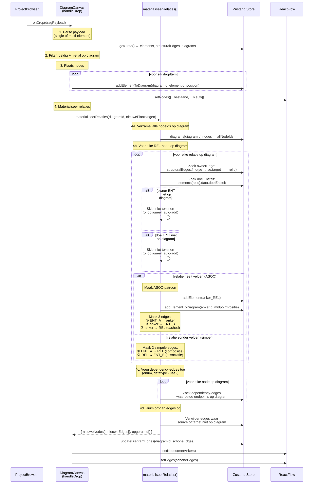
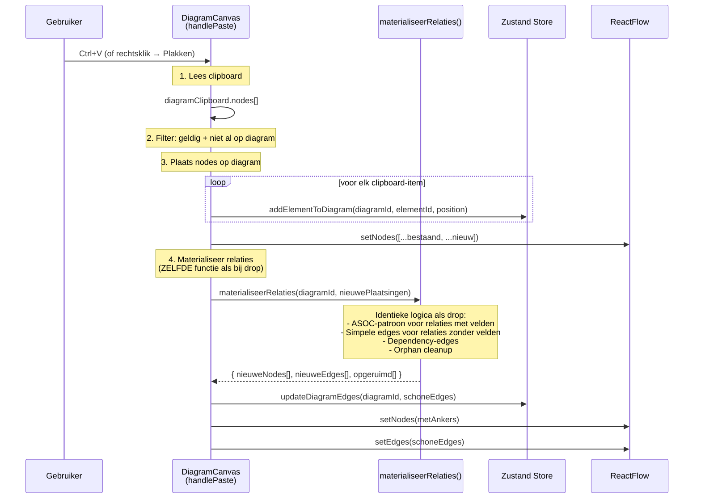
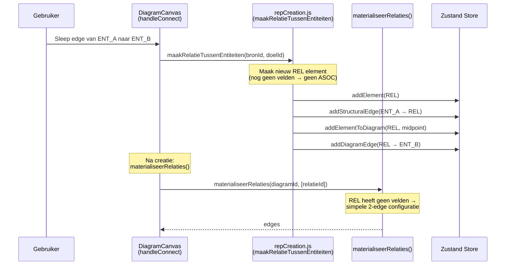

# Drop / Paste Logic — Sequence Diagram & Analyse

## Huidige situatie — problemen

### Kernprobleem
De huidige code heeft **drie losse codepaden** (drop, paste, create) die elk op hun eigen manier edges aanmaken. Geen van deze paden maakt het **volledige ASOC-patroon** (anker + 3 edges) aan bij het plaatsen van een relatie. Het ASOC-patroon wordt alleen gecreëerd door `convertVeldenForward()` (wanneer het eerste veld aan een relatie wordt toegevoegd), niet bij drop/paste.

### Specifieke problemen
1. **Shift+drag vanuit PB** — cursor verandert niet in drag-icoon (react-arborist conflicteert met Shift)
2. **Drop relatie** — doelEdge + ownerEdge worden niet altijd correct gevonden; ASOC-anker wordt nooit gemaakt
3. **Paste** — kopieert boundary-edges (halve edges) die zinloos zijn zonder hun endpoints
4. **Orphan edges** — edges waarvan een endpoint niet op het diagram staat, worden nooit opgeruimd

---

## Huidige architectuur

### Hoe het ASOC-patroon vandaag werkt
```
Stap 1: V3 import of IDE-creatie maakt:
  - structuralEdge: ENT_A → REL (owner, compositie)
  - diagramEdge: REL → ENT_B (doelEdge, in "Overzicht" diagram)
  - Géén anker-node, géén ASOC-edges

Stap 2: Gebruiker voegt velden toe aan REL → convertVeldenForward():
  - Maakt anker_REL node (type: "associatieAnker")
  - Vervangt 2 edges door 3 ASOC-edges:
    Edge1: ENT_A → anker (isAssociation)
    Edge2: anker → ENT_B (isAssociation)
    Edge3: anker → REL   (isAssociationClassLink, dashed)

Stap 3: Gebruiker verwijdert alle velden → convertVeldenReverse():
  - Verwijdert anker + 3 ASOC-edges
  - Herstelt 2 oorspronkelijke edges
```

### Probleem: drop en paste weten niets van dit ASOC-systeem

| Actie | Maakt ownerEdge? | Maakt doelEdge? | Maakt anker? | Maakt ASOC-edges? |
|-------|-----------------|-----------------|-------------|-------------------|
| V3 import | ✅ structural | ✅ diagram | ❌ | ❌ |
| `maakRelatieTussenEntiteiten()` | ✅ structural | ✅ extraDiagram | ❌ | ❌ |
| `convertVeldenForward()` | (opruimen) | (opruimen) | ✅ | ✅ |
| `handleDrop()` | via discover | via discover | ❌ | ❌ |
| `handlePaste()` | via discover | via discover | ❌ | ❌ |

---

## Gewenst gedrag

### Principe
> Bij **elke** plaatsingsactie (drop, paste, create) moet het diagram **consistent** zijn:
> - Alle edges hebben beide endpoints op het diagram
> - Relaties met velden tonen het ASOC-patroon (anker + 3 edges)
> - Relaties zonder velden tonen 2 simpele edges (of collapsed label)
> - Orphan edges bestaan niet

### Geünificeerde logica: `materialiseerEdgesVoorDiagram()`

Eén functie die na elke plaatsing wordt aangeroepen en het diagram consistent maakt.

---

## Sequence Diagram — DROP vanuit ProjectBrowser



---

## Sequence Diagram — PASTE vanuit clipboard



---

## Sequence Diagram — CREATE relatie (ENT→ENT edge draw)



---

## Kernfunctie: `materialiseerRelaties()`

### Pseudo-code

```
function materialiseerRelaties(diagramId, nieuwGeplaatsteIds?) {
  const store = getState()
  const diag = store.diagrams[diagramId]
  const nodeIdsOpDiagram = new Set(diag.nodes.map(n => n.elementId))
  const bestaandeEdges = new Map(diag.edges.map(e => [`${e.source}→${e.target}`, e]))
  
  const nieuweEdges = []
  const nieuweNodes = []
  const teVerwijderenEdgeIds = new Set()
  
  // ── 1. Voor elke relatie-node op het diagram ──
  for (const nodeId of nodeIdsOpDiagram) {
    const el = store.elements[nodeId]
    if (el?.type !== "relatie") continue
    
    // Zoek owner (bron-entiteit) en doel
    const ownerEdge = store.structuralEdges.find(se => se.target === nodeId)
    const ownerId = ownerEdge?.source
    const doelId = el.data?.doelEntiteit
    
    const ownerOpDiagram = ownerId && nodeIdsOpDiagram.has(ownerId)
    const doelOpDiagram = doelId && nodeIdsOpDiagram.has(doelId)
    const heeftVelden = (el.data?.velden?.length || 0) > 0
    
    // Verwijder alle bestaande edges voor deze relatie
    // (we herbouwen ze consistent)
    markeerBestaandeRelatieEdges(nodeId, teVerwijderenEdgeIds)
    
    if (heeftVelden && ownerOpDiagram && doelOpDiagram) {
      // ── ASOC-patroon: anker + 3 edges ──
      const ankerId = `anker_${nodeId}`
      if (!store.elements[ankerId]) {
        store.addElement({ id: ankerId, type: "associatieAnker", ... })
      }
      if (!nodeIdsOpDiagram.has(ankerId)) {
        nieuweNodes.push({ elementId: ankerId, position: midpoint(owner, doel) })
        nodeIdsOpDiagram.add(ankerId)
      }
      nieuweEdges.push(
        { source: ownerId, target: ankerId, data: { isAssociation: true } },
        { source: ankerId, target: doelId, data: { isAssociation: true } },
        { source: ankerId, target: nodeId, data: { isAssociationClassLink: true } }
      )
    } else if (ownerOpDiagram && doelOpDiagram) {
      // ── Simpele relatie: 2 edges ──
      nieuweEdges.push(
        { source: ownerId, target: nodeId, data: { compositie } },
        { source: nodeId, target: doelId, data: { associatie } }
      )
    } else if (ownerOpDiagram) {
      // Alleen owner → 1 compositie-edge
      nieuweEdges.push({ source: ownerId, target: nodeId, data: { compositie } })
    } else if (doelOpDiagram) {
      // Alleen doel → 1 associatie-edge
      nieuweEdges.push({ source: nodeId, target: doelId, data: { associatie } })
    }
    // Geen endpoints op diagram → geen edges
  }
  
  // ── 2. Structurele edges (ENT→GE compositie) ──
  for (const se of store.structuralEdges) {
    if (se is ENT→GE && both on diagram && not already added) {
      nieuweEdges.push(se)
    }
  }
  
  // ── 3. Dependency-edges (enum, datatype «use») ──
  for (const diagKey of Object.keys(store.diagrams)) {
    for (const de of store.diagrams[diagKey].edges) {
      if (de.data?.isDependency && both on diagram && not already added) {
        nieuweEdges.push(de)
      }
    }
  }
  
  // ── 4. Orphan cleanup: verwijder alle edges met ontbrekende endpoints ──
  const schoneEdges = finalEdges.filter(e => 
    nodeIdsOpDiagram.has(e.source) && nodeIdsOpDiagram.has(e.target)
  )
  
  return { nieuweNodes, schoneEdges }
}
```

---

## Vergelijking: huidig vs. gewenst

| Aspect | Huidig | Gewenst |
|--------|--------|---------|
| **Drop relatie** | `discoverEdgesForNodes`: zoekt bestaande edges | `materialiseerRelaties`: bouwt correct patroon op |
| **ASOC-anker bij drop** | ❌ Wordt nooit gemaakt | ✅ Wordt gemaakt als relatie velden heeft |
| **ASOC-anker bij paste** | ❌ Alleen als alle 4 nodes gekopieerd | ✅ Automatisch aangemaakt |
| **Orphan edges** | ❌ Worden gekopieerd | ✅ Worden opgeruimd |
| **Boundary edges (paste)** | Worden meegenomen → orphans | Worden genegeerd; edges worden opnieuw berekend |
| **Codepaden** | 3 (drop, paste, create) met elk eigen edge-logica | 1 gedeelde `materialiseerRelaties()` |
| **Consistentie** | Afhankelijk van welk pad | Altijd consistent |

---

## Open vragen voor review

1. **Auto-add endpoints?** — Als een relatie wordt gedropt en owner/doel niet op het diagram staan: auto-toevoegen of alleen de aanwezige edges tekenen?
   - *Voorstel*: configureerbaar, default = alleen tekenen wat er is. Optioneel Shift+drop = auto-add.

2. **Normaliseren na drop?** — Moeten edges automatisch `berekenKortsteHandles()` krijgen?
   - *Voorstel*: ja, bij initiële plaatsing wél normaliseren.

3. **Anker lifecycle** — Als een relatie van het diagram wordt verwijderd, moet de anker ook verwijderd worden?
   - *Voorstel*: ja, anker is een visueel hulpelement, geen model-element.

4. **GE's zonder parent op diagram** — Een GE zonder zijn parent-ENT: wel of niet tekenen?
   - *Voorstel*: GE's zijn altijd geldig om te tekenen. Compositie-edge alleen als parent er ook is.
