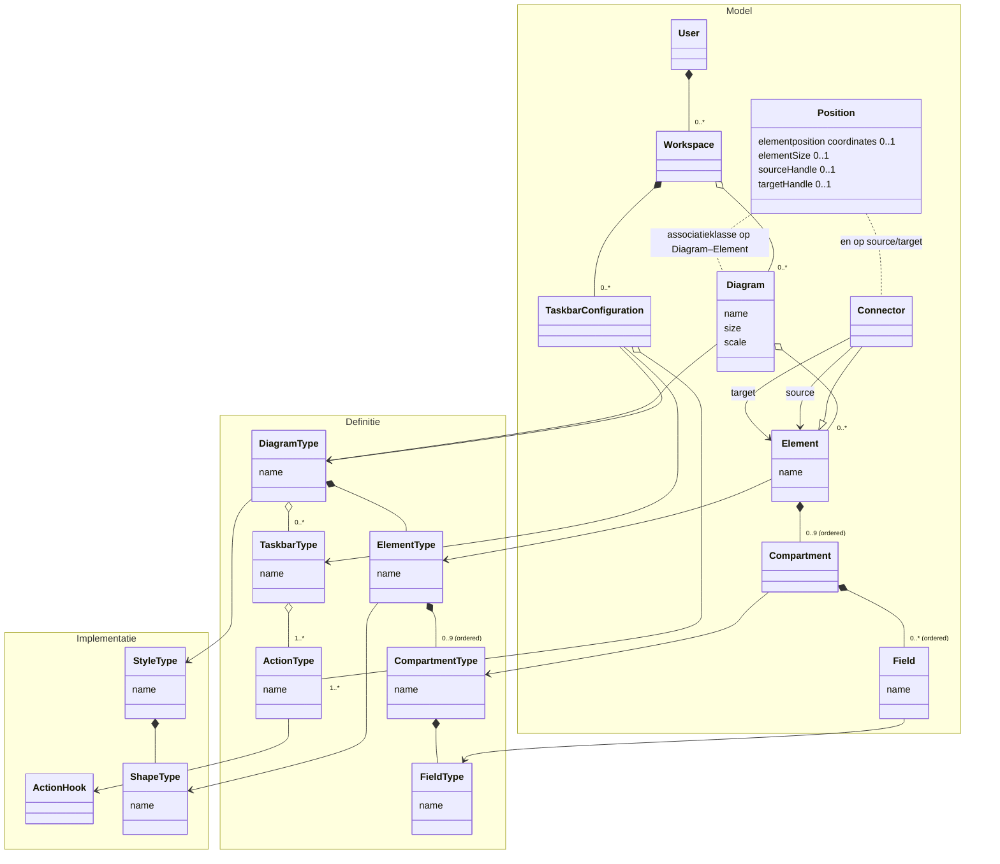

# Plan — Studio 0.5: generieke diagram-kern (diagramcore)

- **Datum:** 2026-07-02
- **Auteur:** Claude (Claude Code, Fable 5), op verzoek van Mark
- **Status:** fase 0 gestart (2026-07-02): besluiten §8.1/6/6b vastgelegd,
  `apiBase` gecentraliseerd, `diagramcore/`-typecontract opgezet
- **Context:** [`STUDIO.md`](STUDIO.md), [`STUDIO-code-review-2026-06-30.md`](STUDIO-code-review-2026-06-30.md)

## 1. Doel

De UML-editor in de Studio is nu een **concrete** editor voor het canonieke datamodel
(Entiteit, GE, REL, enumeraties, …). De onderliggende principes — een diagram is een
verzameling elementen, elementen leven in één model en kunnen op meerdere diagrammen
staan, connectoren verbinden elementen, elementen hebben compartimenten met velden —
zijn echter **algemeen**. Dit plan trekt die principes naar een abstractielaag
(**diagramcore**) die per *diagramtype* configureerbaar is, zodat dezelfde motor ook
andere representaties kan dragen:

- een **puur UML**-klassediagram (zonder Entiteit/GE/REL-semantiek),
- een **OAS 3.1**-specificatie (schemas, paths, components),
- een **GraphQL**-schema (types, fields, relaties),
- een **DRD** (DMN Decision Requirements Diagram),
- op termijn wellicht een **sequence diagram** (zie kanttekening §8).

De huidige, werkende versie blijft **parallel en onaangetast** bestaan als backup
(§6 beantwoordt "kan dat?" — ja).

## 2. Het metamodel

Het doel-metamodel (derde iteratie, 2026-07-02). De drie `namespace`-blokken
groeperen de klassen in domeinen zodat mermaid ze bij elkaar rendert — dit zijn
tegelijk de architectuurlagen: **Model** (instantie-data van de gebruiker),
**Definitie** (declaratieve configuratie, JSON-serialiseerbaar) en
**Implementatie** (code: hooks, shapes, stijlen):



*(Mermaid kent geen echte associatieklasse-notatie; de gestippelde lijnen bij
`Position` benaderen die. Ook de taakbalk-plek op het scherm is zo'n
associatie-attribuut, op Workspace–TaskbarConfiguration.)*

Lezing:

- **Model-domein**: de *data* die de gebruiker maakt — `Diagram`, `Element`,
  `Connector`, `Compartment`, `Field` — plus de gebruikerscontext: `User`,
  `Workspace` en `TaskbarConfiguration`.
- **Definitie-domein**: `DiagramType` t/m `FieldType`, `TaskbarType`, `ActionType`
  — de declaratieve *configuratie* die beschrijft wat er mogelijk is. Eén
  DiagramType = één "profiel" (canoniek-UML, OAS 3.1, GraphQL, …). Dit domein is
  per constructie JSON-serialiseerbaar — en daarmee de kandidaat voor het
  configuratie-register (§8.5).
- **Implementatie-domein**: `ActionHook`, `StyleType`, `ShapeType` — de *code*
  waar de definities naar verwijzen. `ActionType → ActionHook` formaliseert de
  splitsing declaratief/code die het plan al maakte: het *wat* (naam, plek in
  menu/balk) staat in de definitie, het *hoe* is een frontend-hook, gekoppeld op
  id. Hetzelfde geldt voor `ElementType → ShapeType`: betekenis in de definitie,
  vorm (class-box, note, diamant, pill) in code.
- **`Position` is een associatieklasse** op Diagram–Element (elementpositie en
  -grootte per *diagram-lidmaatschap*, niet op het element zelf — zodat één
  element op meerdere diagrammen kan staan) en op de `source`/`target`-uiteinden
  van een connector (`sourceHandle`/`targetHandle`). Dit is exact hoe de
  implementatie het nu al doet: `DiagramDef.nodes[].position` en de handles op de
  React Flow-edges. Metamodel en praktijk zijn hier dus al in lijn.
- Een `Connector` is een **speciaal element** (met `source`/`target`) — geen apart
  concept. Dat is precies wat het bestaande ASOC-patroon al impliceert: een relatie
  mét velden materialiseert als node (anker + klasse-box), een relatie zonder
  velden als kale edge.
- **Taakbalken**: een `DiagramType` levert 0..* `TaskbarType`s met elk 1..*
  `ActionType`s (de *definitie*: welke balken kunnen er zijn); een
  `TaskbarConfiguration` in de `Workspace` legt vast hoe een gebruiker ze
  daadwerkelijk gebruikt — welke balken aan staan, waar ze staan, eventueel met
  een eigen actie-selectie (§4.6).
- **`Workspace`** is een dun maar handig tussenlaagje: de plek waar
  gebruikersvoorkeuren (taakbalk-configuratie, open diagrammen, paneel-standen)
  wonen, gescheiden van het model zelf. In de implementatie is dit aanvankelijk
  gewoon het localStorage-profiel van de browser (één impliciete workspace);
  het concept geeft een natuurlijk groeipad naar benoemde workspaces en
  server-side voorkeuren per `User`.
- `size`/`scale` op `Diagram` ≈ de bestaande `viewport {x, y, zoom}`; de
  `{ordered}`-annotaties op compartimenten en velden nemen we over als
  volgorde-behoudende arrays (dat zijn ze nu al).
- **Tags** (meta-informatie op alles) worden bewust **uitgesteld**; het model krijgt
  wel alvast een `data`-vrijveld per instantie zodat tags later niet-breaking passen.

## 3. Mapping op de huidige code

De verrassend goede boodschap: de **instantie-kant bestaat al bijna generiek**.
De type-kant is wat nu hardgecodeerd is.

| Metamodel | Huidige code | Oordeel |
|---|---|---|
| `Diagram` | `DiagramDef` in `useModelStore` (`{id, naam, nodes, edges, viewport}`) | ✅ al generiek; posities per diagram, element op meerdere diagrammen |
| `Element` | `ModelElement` (`{id, naam, type, domein, data}`) flat record | ✅ al generiek; `type` is nu een vrije string |
| `Connector` | `structuralEdges` + het REL/ASOC-patroon (`verversAsocVoorRelaties`) | ⚠️ verspreid: edge-vorm in de store, node-vorm (anker) als speciaal geval |
| `Position` (associatieklasse) | `DiagramDef.nodes[].position` + `sourceHandle`/`targetHandle` op diagram-edges | ✅ bestaat al precies zo |
| `User`/`Workspace` | impliciet: het localStorage-profiel van de browser (`useStudioStore`, `ide-model-store`) | ⚠️ bestaat als opslag, niet als concept |
| `TaskbarConfiguration` | — (balkjes altijd zichtbaar, stand niet instelbaar) | ❌ ontbreekt |
| `Compartment` | hardgecodeerde secties in de node-componenten (velden / afgeleide velden / overerving in `EntiteitNode` e.a.) | ❌ niet gemodelleerd; per component uitgeschreven JSX |
| `Field` | `velden[]` / `afgeleideVelden[]` / `waarden[]` in `element.data` | ⚠️ bestaat als data, maar vorm per elementtype verschillend |
| `DiagramType` | impliciet: er is er precies één (het canonieke model) | ❌ ontbreekt |
| `ElementType` | de `nodeTypes`-map in `DiagramCanvas.jsx` + 9 node-componenten + `METATYPES`/factories in `metamodel/types.js` | ❌ hardgecodeerd, code i.p.v. configuratie |
| `CompartmentType`/`FieldType` | JSX in de node-componenten + `VELDTYPEN` + `NodeEditPanel`/`DetailsPanel` per type | ❌ hardgecodeerd |
| `StyleType`/`ShapeType` | `editor.css` + inline kleuren (`defaultKleur`) + per-component markup | ❌ vermengd met de elementtypen; kleuren deels hardgecodeerd (zie code review §4) |
| `TaskbarType`/`ActionType` | de zwevende "Layout"/"Verbinding"/"Maken"-balkjes, hardgecodeerd in de IDE-canvas | ❌ niet configureerbaar, niet via het menu aan/uit te zetten |

UML-specifieke logica die nu door de generieke lagen heen geweven zit (en dus naar
een **profiel** moet verhuizen):

- het ASOC/anker-patroon (`useModelStore.verversAsocVoorRelaties`, delen van
  `materialiseerDiagramEdges` in `DiagramCanvas.jsx`),
- edge-materialisatie-regels (ENT→GE-compositie, dependencies «use», generalisatie),
- transformaties (`ide/transformations.js`), rep-creatie (`ide/repCreation.js`),
- validatie (`umleditor/validatie/`), overerving (`useOvergeerfdeVelden`),
- import/export (V3-model, XMI, Mermaid, PlantUML) en publiceren/rebuild.

Generiek herbruikbaar (blijft **core**): store-vorm + undo (zundo) + persist,
multi-diagram, clipboard/kopiëren-plakken, selectie, uitlijnen/verdelen/auto-layout,
snap-grid, pan/zoom/viewport, drag & drop vanaf een tree, node-resize, thema.

## 4. Architectuurvoorstel

### 4.1 Pakketstructuur

```
src/diagramcore/                 ← de generieke motor (géén domeinkennis)
  model/
    createDiagramStore.js        ← store-factory (generalisatie van useModelStore)
    schema.js                    ← @typedef's: Diagram, Element, Connector, Compartment, Field
  types/
    typeRegistry.js              ← registreer/resolve DiagramType-descriptors
    schema.js                    ← @typedef's: DiagramType, ElementType, CompartmentType,
                                    FieldType, StyleType, ShapeType
  canvas/
    DiagramCanvas.jsx            ← generieke React Flow-wrapper (dun; leest store + types)
    ElementNode.jsx              ← één generieke node: header + 0..9 compartimenten
    ConnectorEdge.jsx            ← generieke edge (labels, kardinaliteit, pijlstijlen)
    materialiseerConnectoren.js  ← generiek: connector-met-compartimenten → node + link-edges
  shapes/
    shapeRegistry.js             ← ShapeType-id → React-component
    ClassBoxShape.jsx, NoteShape.jsx, DiamondShape.jsx, PillShape.jsx, …
  inspector/
    ElementInspector.jsx         ← gegenereerd eigenschappen-paneel o.b.v. Field/CompartmentTypes
  layout/                        ← uitlijnen/verdelen/snap-grid (pure geometrie) +
                                    infrastructuur voor plaatsingsstrategieën (zie §4.5)

src/diagramprofielen/            ← één map per DiagramType ("profiel")
  canoniek-uml/                  ← het bestaande domein, als configuratie + hooks
    index.js                     ← DiagramType-descriptor
    elementTypes.js              ← entiteit, gegevenselement, relatie, enumeratie, …
    connectorRegels.js           ← wie mag met wie verbinden, ASOC-materialisatie
    serialisatie.js              ← V3-import/-export (hergebruikt bestaande functies)
    validatie.js                 ← hergebruikt umleditor/validatie
  puur-uml/                      ← fase 5: klasse/attribuut/operatie/associatie
  oas31/                         ← later
  …

src/studio/activities/
  diagramActivity.jsx            ← nieuwe activiteit "Diagrammen (0.5)" — naast umlActivity
```

De core kent **geen enkel** profiel; profielen kennen de core. Studio-activiteiten
binden een profiel + store + canvas aan de shell.

### 4.2 De descriptors (types-als-data, hooks-als-code)

Kern-ontwerpkeuze: descriptors zijn **plain objects** met een JSON-serialiseerbare
kern (id's, labels, compartimenten, shapes, verbindingsregels) plus optionele
**functie-hooks** voor wat niet declaratief kan (validatie, afgeleide weergave,
custom inspector-secties). Zo blijft de weg open om descriptors ooit in het
register zelf op te slaan (§8), terwijl we nu volle expressiekracht houden.

```js
/** ElementType (schets) */
{
  id: "entiteit",
  label: "Entiteit",
  stereotype: "«entiteit»",          // header-regel; mag functie zijn: (el) => string
  shape: "class-box",                // ShapeType-id binnen de StyleType
  kleur: "#bfdbfe",                  // default; instantie kan overriden
  isConnector: false,
  compartments: [                    // max 9, volgorde = tekenvolgorde
    { id: "velden",   label: null, fieldType: "attribuut" },
    { id: "afgeleid", label: null, fieldType: "afgeleidVeld" },
  ],
  hooks: { valideer, extraSecties }  // optioneel, niet-serialiseerbaar
}

/** ElementType van een connector */
{
  id: "relatie",
  isConnector: true,
  bron: { elementTypes: ["entiteit"], kardinaliteiten: ["0..1","1","0..*","1..*"] },
  doel: { elementTypes: ["entiteit"], kardinaliteiten: [...] },
  compartments: [ { id: "velden", fieldType: "attribuut" } ],
  // materialisatie: zonder velden → edge; met velden → node + ankerpatroon
  materialiseerAlsNode: (el) => (el.data.velden?.length ?? 0) > 0,
}

/** FieldType */
{
  id: "attribuut",
  render: "naam-type",               // ingebouwde regel-renderers: "naam-type" | "tekst" | "waarde"
  editor: [                          // genereert de inspector
    { key: "naam",      widget: "text",   verplicht: true },
    { key: "type",      widget: "select", opties: (ctx) => ctx.veldtypen },
    { key: "verplicht", widget: "checkbox" },
  ],
}

/** DiagramType */
{
  id: "canoniek-uml",
  label: "Canoniek datamodel",
  style: "uml-klassiek",             // StyleType
  elementTypes: [entiteit, gegevenselement, relatie, enumeratie, …],
  taakbalken: [                      // TaskbarTypes (§4.6); acties afgeleid of expliciet
    { id: "maken",       acties: "elementTypes" },   // één Action per niet-connector-elementtype
    { id: "verbinding",  acties: "connectorTypes" }, // kiest de edge-mode (vgl. Compositie/Generalisatie)
    { id: "auto-layout", acties: "layouts" },        // de plaatsingsstrategieën als knoppen
  ],
  layouts: [                         // plaatsingsstrategieën (DiagramType-afhankelijk, §4.5)
    { id: "gelaagd", label: "Auto-layout (heel diagram)", run: (model, diagram, selectie) => posities },
  ],
  serialisatie: { exporteer, importeer },   // profiel-eigen formaten
  menus: (ctx) => [...],             // optioneel: extra menubalk-items (zelfde vorm als nu)
}
```

### 4.3 De generieke node

Eén `ElementNode` vervangt de negen huidige node-componenten. Hij rendert:

1. de **shape** (via `shapeRegistry`, met thema-bewuste `--s-*`-kleuren — dit lost
   meteen code-review-punt §4 op voor de nieuwe motor),
2. de **header** (stereotype + naam + badges, uit de ElementType),
3. de **compartimenten** (0..9) met per compartiment de velden via de
   `FieldType.render`-regelrenderer,
4. de standaard acht handles + `NodeResizer` (identiek aan nu).

Bestaande specials worden hooks: overgeërfde velden (canoniek-uml-hook die een
extra compartiment aanlevert), de domein-overlay, notitie/constraint als eigen
ShapeTypes (`note`, `rounded`).

### 4.4 Store en connectoren

`createDiagramStore({ persistKey, diagramTypeId })` levert per activiteit/profiel
een eigen Zustand-store met exact de bewezen vorm van `useModelStore`
(elements / diagrams / undo / persist / isDirty), maar:

- **zonder** `verversAsocVoorRelaties` — connector-materialisatie wordt een
  core-algoritme (`materialiseerConnectoren.js`) dat per connector-ElementType
  beslist: kale edge, of node + bron-edge + doel-edge + link-edge (het huidige
  ASOC-patroon, veralgemeniseerd);
- connectoren zijn elementen met `source`/`target` (conform het metamodel) i.p.v.
  een aparte `structuralEdges`-lijst; de diagram-edges blijven puur visueel
  (handles, routing) en worden uit de connectoren afgeleid;
- eigen `persistKey` (bv. `"studio05-<profiel>"`) zodat localStorage nooit botst
  met de bestaande `ide-model-store`.

### 4.5 Layout: uitlijnen is core, plaatsen is profiel

Twee wezenlijk verschillende soorten "layout", met een verschillende plek:

- **Uitlijn-/schikfuncties zijn pure geometrie** en dus **core**: links/rechts/
  boven/onder uitlijnen, horizontaal/verticaal centreren en verdelen, snap-grid.
  Ze werken uitsluitend op posities en bounding-boxes van de selectie en weten
  niets van elementtypen. Deze verhuizen ongewijzigd van gedrag uit
  `umleditor/metamodel/autoLayout.js` / `DiagramCanvas` naar `diagramcore/layout/`.
- **Element-plaatsing (auto-layout) is semantiek** en dus **profiel**: het huidige
  auto-layout weet dat entiteiten bovenaan horen, GE's eronder, ankers op het
  middelpunt — dat is canoniek-uml-kennis. Een OAS-profiel wil een boom, een DRD
  een gelaagde requirements-flow, een sequence-diagram een strikte verticale
  ordening. Daarom levert de **DiagramType** één of meer `layouts`-strategieën
  aan (zie descriptor in §4.2): een functie `(model, diagram, selectie) → posities`.
  De core levert de omliggende infrastructuur (toepassen, undo-integratie,
  `layoutLocked` respecteren, animatie) en eventueel herbruikbare bouwstenen
  (gelaagde/boom-layout als bibliotheekfunctie waar profielen hun regels in
  prikken).

**Doorwerking in de menubalk.** De nieuwe `diagramActivity` bouwt zijn
Beeld-menu samen uit twee bronnen, via het bestaande `buildMenus`/`menuBus`-
mechanisme van de shell:

1. **core-items, altijd aanwezig**: *Uitlijnen ▸* (links/rechts/boven/onder,
   centreren, verdelen) en *Uitlijnen op raster* — voor élk diagramtype identiek,
   dus één keer gedefinieerd in de core en niet meer per activiteit gekopieerd
   (nu staat dit hardgecodeerd in `umlActivity.jsx`);
2. **profiel-items, uit de descriptor**: de `layouts`-strategieën verschijnen
   automatisch als menu-items (bv. *Auto-layout (heel diagram)* / *(selectie)*),
   en `menus` laat een profiel daarnaast vrije extra items toevoegen (zoals nu
   *Relaties normaliseren*, dat ASOC-kennis heeft en dus bij canoniek-uml hoort).

Zo blijft de menustructuur consistent over diagramtypen heen, terwijl de inhoud
per DiagramType meebeweegt.

### 4.6 Taakbalken (TaskbarType/Action)

De huidige zwevende balkjes op het canvas ("Layout", "Verbinding", "Maken") worden
een first-class concept, conform het metamodel (`DiagramType ◇— 0..* TaskbarType`,
`TaskbarType ◇— 1..* ActionType`, met `ActionType → ActionHook` voor de
implementatie):

- **Het raamwerk is core**: een generiek `Taskbar`-component (zwevend/versleepbaar,
  zoals nu), plus **aan/uit zetten via het menu** — `Beeld → Taakbalken ▸` met
  afvinkbare items, automatisch gegenereerd uit de taakbalk-lijst van het actieve
  DiagramType. Dat kon eerder niet goed omdat er geen menubalk was; nu die er is,
  hoort dit standaard in de core. Welke balken aan staan en waar ze staan is
  **gebruikersvoorkeur**, in het metamodel geformaliseerd als
  `TaskbarConfiguration` binnen de `Workspace`: per diagramtype onthouden in de
  studio-store (localStorage = de impliciete workspace van de lokale gebruiker) —
  net als de paneel-standen nu, met een groeipad naar server-side voorkeuren per
  `User`.
- **De samenstelling is DiagramType-configuratie**: welke balken er zijn en welke
  acties erop staan, komt uit de descriptor (`taakbalken` in §4.2). De acties
  kunnen **afgeleid** zijn uit de rest van de descriptor of expliciet opgesomd:
  - **"Maken"** — één actie per niet-connector-ElementType (klik-om-te-plaatsen
    of slepen), vergelijkbaar met de huidige ENT/GE/REL/ENUM/…-knoppen;
  - **"Verbinding"** — één actie per connector-ElementType; zet de edge-mode voor
    de volgende handle-drag (zoals nu Compositie/Generalisatie);
  - **"Auto-layout"** — een eigen balkje met de `layouts`-strategieën van het
    profiel (dezelfde acties als de menu-items uit §4.5, maar één klik dichterbij);
  - eventueel meer, met expliciete `Action`-lijsten (bv. een validatie- of
    publiceer-balkje) — het raamwerk is er niet aan gebonden.
- **Uitzondering**: het **uitlijn-balkje** (pure geometrie, §4.5) is core en bij
  elk diagramtype beschikbaar; het staat buiten de DiagramType-configuratie, maar
  is via hetzelfde menu aan/uit te zetten.

Menu-acties en taakbalk-acties delen dezelfde onderliggende `ActionType`-definitie
(id, label, icoon) met een `ActionHook` als implementatie, zodat een actie maar
één keer gedefinieerd wordt en zowel in het menu als op een balk kan verschijnen.

## 5. Wat is core, wat is profiel

| Core (diagramcore) | Profiel (bv. canoniek-uml) |
|---|---|
| store-factory, undo, persist, isDirty | element- en connector-typen, compartimenten, veldtypen |
| multi-diagram, element-op-meerdere-diagrammen | verbindingsregels + ASOC-materialisatiebeslissing |
| generieke node/edge, shapes, stijlen, thema | stereotype-teksten, kleuren, badges |
| selectie, clipboard, drag & drop, resize | validatieregels, overervings-weergave |
| uitlijnen, verdelen, snap-grid (pure geometrie) + menu-items daarvoor | plaatsings-/auto-layout-strategieën (`layouts`) + eigen menu-items (§4.5) |
| layout-infrastructuur (toepassen, undo, `layoutLocked`) | import/export (V3, XMI, Mermaid, PlantUML), publiceren |
| taakbalk-raamwerk: zweven/verslepen, aan/uit via `Beeld → Taakbalken ▸`, `TaskbarConfiguration` in de workspace + het uitlijn-balkje | taakbalk-samenstelling (`TaskbarType`s + `ActionType`s): Maken, Verbinding, Auto-layout, … (§4.6) |
| gegenereerde inspector (uit FieldTypes) | custom inspector-secties (bv. afleidingsregels/CEL) |
| tree-browser-koppeling (generiek itemmodel) | tree-inhoud (domeinen → entiteiten → GE's) |

## 6. Parallel naast de huidige versie — kan dat? Ja.

De Studio is hier al op gebouwd; er hoeft **niets** aan bestaande modules te
veranderen:

1. **Nieuwe activiteit** `diagramActivity` ("Diagrammen (0.5)", eigen icoon,
   groep "modelleren") wordt geregistreerd in `activities/index.jsx` naast de
   bestaande `umlActivity`. De oude UML-IDE blijft ongewijzigd bereikbaar — als
   activiteit én via `ide.html`.
2. **Eigen store-namespace** (`studio05-*` persist-keys) — geen botsing met
   `ide-model-store`; beide kunnen tegelijk open staan.
3. **Lazy loading** (zoals `umlActivity` al doet) — de nieuwe motor kost de
   bestaande bundle niets.
4. **Lezen zonder schrijven**: fase 1 gebruikt een adapter die het bestaande
   model uit `useModelStore` (of de API) *importeert* naar de nieuwe store;
   het schrijft nooit terug totdat we daar expliciet voor kiezen.
5. **Geen dubbele waarheid** in git: de oude code wordt niet geforkt of
   gekopieerd; de nieuwe motor is nieuwe code ernaast. Pas bij de omschakeling
   (fase 6) verhuist/verdwijnt oud spul, en dat is een aparte beslissing.

Risico van parallel draaien: tijdelijke duplicatie van *functionaliteit* (twee
UML-editors). Dat is bewust en tijdelijk; de fasering hieronder houdt de
pariteitslijst expliciet bij zodat de overstap toetsbaar is.

## 7. Fasering

Elke fase is afzonderlijk te bouwen op een eigen feature-branch, te verifiëren
met `npm run build` + visuele check, en levert iets werkends op.

- **Fase 0 — fundering (klein).** Besluiten over de open keuzes (§8). Optioneel
  vooraf: de opschoning uit de code review (gedeelde `apiBase`/`download*`-utils),
  zodat de nieuwe code schoon start. `// @ts-check` + JSDoc-typedefs aanzetten
  voor alles onder `diagramcore/` zodat het type-contract afdwingbaar is.
- **Fase 1 — read-only bewijs.** `diagramcore` model + typeRegistry + generieke
  `ElementNode` met `class-box`-shape; profiel `canoniek-uml` met alleen
  elementTypes/compartments; adapter die het bestaande model inleest; activiteit
  "Diagrammen (0.5)". **Klaar als:** een bestaand diagram er in de nieuwe motor
  (vrijwel) hetzelfde uitziet als in de oude.
- **Fase 2 — bewerken.** Elementen maken/hernoemen/verwijderen via de
  "Maken"-taakbalk, connectoren tekenen via de "Verbinding"-taakbalk (met
  verbindingsregels), het taakbalk-raamwerk zelf incl. `Beeld → Taakbalken ▸`
  (§4.6), velden bewerken via de gegenereerde inspector, undo/clipboard/
  multi-diagram. **Klaar als:** een klein model volledig in 0.5 te bouwen is.
- **Fase 3 — connector-materialisatie & layout.** Het generieke ASOC-patroon
  (connector-met-velden → node + 3 edges), generalisatie- en dependency-connectoren,
  uitlijnen/verdelen/snap-grid naar core (incl. de core-menu-items en het
  uitlijn-balkje), auto-layout als eerste `layouts`-strategie van het
  canoniek-uml-profiel met eigen taakbalkje (§4.5/§4.6), **boundary-element**
  (eigen ElementType + `boundary`-shape, achter de elementen — §8.6b),
  validatie-hook. **Klaar als:**
  de canoniek-uml-weergave pariteit heeft met de oude editor op een referentiemodel.
- **Fase 4 — serialisatie & persist.** Profiel-eigen import/export met hergebruik
  van `editorNaarV3Model`/import-functies; opslaan/laden via de bestaande API.
  **Klaar als:** een V3-round-trip door de nieuwe motor byte-vergelijkbaar is
  (m.u.v. bekende volgorde-verschillen).
- **Fase 5 — tweede profiel als lakmoesproef.** Voorstel: **puur UML** eerst
  (kleinste afstand: klasse, attribuut, operatie, associatie, generalisatie),
  daarna **OAS 3.1** (schemas als elementen, `$ref`s als connectoren). Pas hier
  blijkt of de abstractie klopt; verwacht: bijstellen van Field/CompartmentType.
- **Fase 6 — omschakeling (aparte beslissing).** Pariteitschecklist aflopen,
  oude `umlActivity` markeren als "klassiek", en pas na een gewenningsperiode
  opruimen. DRD en sequence-diagrammen: eerst een kort onderzoek (§8).
- **Fase 7 (optioneel) — configuratie in het register.** De declaratieve kern van
  de descriptors verhuist naar een gegenereerd bitemporeel configuratie-register
  met API; de Studio laadt profielen daarvandaan, met frontend-caching en
  gebundelde fallback (uitwerking in §8.5). Pas zinvol na fase 5.

## 8. Open keuzes & kanttekeningen

1. **Sequence-diagrammen passen niet vanzelf.** ✅ *Besloten (2026-07-02):
   uitgesteld.* Behalve de layout-semantiek (lifelines, activaties, verticale
   berichtvolgorde) zijn het ook **instantie-/objectdiagrammen**: de elementen
   zijn objecten/deelnemers met bericht-flow ertussen, geen typen — een andere
   verhouding tot het model dan de structuurdiagrammen waar de core op mikt.
   DRD past wél direct (beslissingen/inputs als elementen, requirements als
   connectoren) en blijft kandidaat-profiel.
2. **Compartimenten-maximum 0..9** uit het metamodel nemen we als harde grens in
   de core-validatie over.
3. **Tags** komen later; het `data`-vrijveld per instantie reserveert de plek.
4. **Taal & typing:** core-API in het Nederlands (consistent met de codebase),
   `// @ts-check` + JSDoc in heel `diagramcore/` (licht alternatief voor TS,
   conform de aanbeveling uit de code review §1).
5. **Descriptors in het bitemporele register (dogfooding).** Het hele
   **Definitie-domein** uit §2 — DiagramType t/m FieldType, TaskbarType/ActionType
   — is zelf een canoniek datamodel en past daarmee in de eigen pijplijn: het metamodel van §2 **inlezen in de Studio als model**,
   publiceren, en met de bestaande codegen een **register + API genereren**
   waaruit de Studio vervolgens zijn DiagramType-configuraties laadt. Profielen
   worden dan versioneerbaar en tijdreisbaar. Randvoorwaarden:
   - **Splitsing declaratief/code**: de JSON-serialiseerbare kern van de
     descriptors (§4.2) leeft in het register; de functie-hooks (validatie,
     custom renderers, `layouts.run`) blijven frontend-code en worden op
     descriptor-id gekoppeld. Het metamodel formaliseert dit nu zelf als de
     domeinen **Definitie** (register) en **Implementatie** (frontend):
     `ActionType → ActionHook` en `ElementType → ShapeType` zijn precies die
     koppelvlakken. Deze splitsing is de reden om de serialiseerbare kern vanaf
     fase 1 strikt te bewaken.
   - **Frontend-caching**: configuratie laden bij het openen van de activiteit,
     cachen in localStorage met versie-/ETag-check, en **gebundelde
     fallback-descriptors** in de frontend — zowel voor offline gebruik als voor
     het bootstrap-probleem (de editor moet werken vóórdat het configuratie-
     register bestaat).
   - **Volgorde**: pas ná fase 5, als de descriptor-vorm door een tweede profiel
     is gevalideerd — anders migreren we een nog bewegend schema het register in.
     Opgenomen als optionele fase 7 in §7.
6. **Waar de grens "shape vs. elementtype" ligt.** ✅ *Besloten (2026-07-02):*
   **notities en constraints zijn eigen ElementTypes** met dientengevolge hun
   eigen ShapeType (`note`, `rounded`); ShapeType is uitsluitend vorm, alles met
   betekenis is een ElementType.
6b. **Boundaries komen wél vroeg mee.** ✅ *Besloten (2026-07-02):* kaders zoals
   de Definition/Implementation-boundaries in Sparx EA worden een **eigen
   ElementType** met een eigen `boundary`-ShapeType: een resizebaar kader dat
   *achter* de andere elementen rendert. Meestal puur vormgeving (groepering
   verduidelijken), maar een profiel kan er modelmatige betekenis aan hangen via
   een hook (vgl. de huidige `DomeinBoundaryOverlay`, die domein-scope toont).
   Omdat het een gewoon element met een shape is, kan het vanaf **fase 2/3** mee
   (z-order en resize zijn de enige extra's die de core ervoor nodig heeft).
7. **Naam en zichtbaarheid**: "Diagrammen (0.5)" als aparte activiteit met status
   "preview" in de activity bar, of verborgen achter een instelling? Voorstel:
   gewoon zichtbaar met preview-badge, dat dwingt tot echt gebruik.

## 9. Relatie met de code review van 2026-06-30

De nieuwe core neemt de review-aanbevelingen als ontwerpeisen mee in plaats van ze
achteraf te repareren: thema-kleuren uitsluitend via `--s-*`-variabelen en classes
(geen inline hardcoded kleuren), gedeelde utils i.p.v. gekopieerde helpers,
`@ts-check`-contracten, en toetsenbord-toegankelijkheid vanaf het begin in de
generieke inspector en het palet. De a11y-fixes voor de **menubalk** staan hier los
van en kunnen onafhankelijk (eerder) opgepakt worden.
