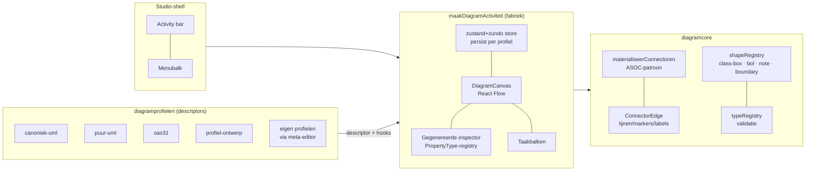
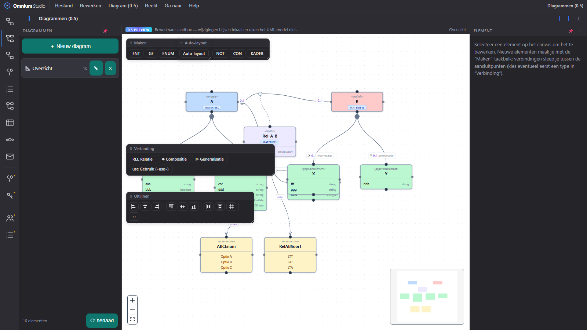
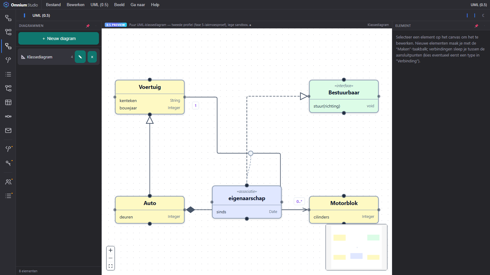
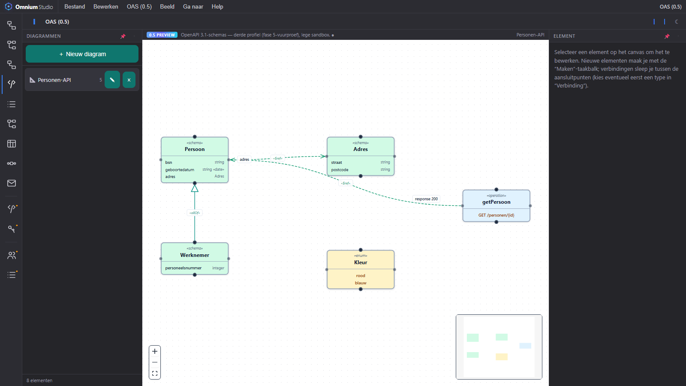
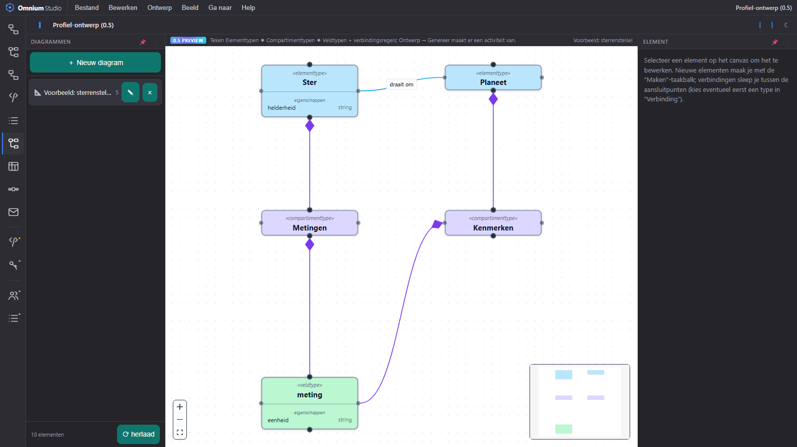
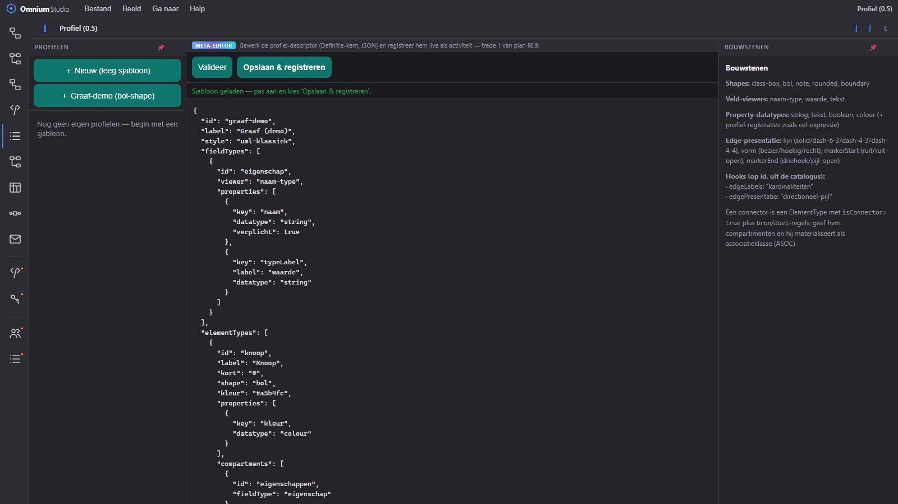
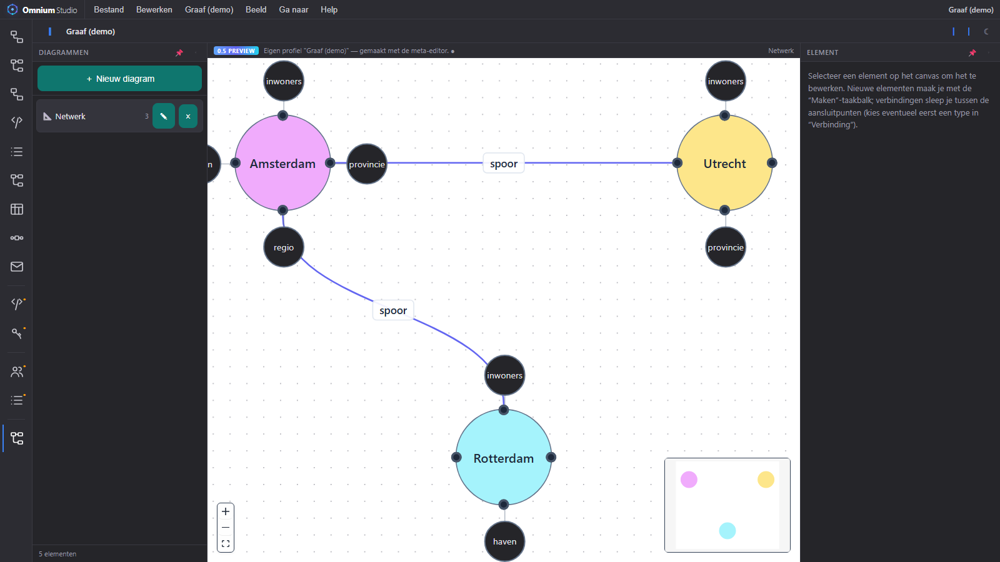
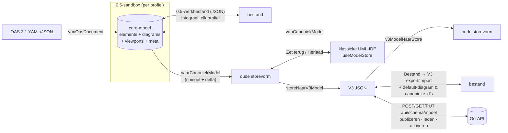
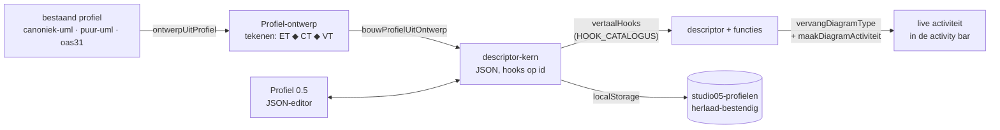

# Studio 0.5 — verslag: van plan tot werkende diagram-motor

> Opgesteld: 2026-07-04, na afronding van fase 0 t/m 5 plus de meta-editor
> (treden 1 en 2). Dit verslag documenteert wát er gebouwd is en waarom;
> het levende plan met alle besluiten en de gedetailleerde statuslog is
> [`STUDIO-05-diagramcore-plan.md`](STUDIO-05-diagramcore-plan.md), de
> gebruikersdocumentatie staat in [`STUDIO.md`](STUDIO.md).

## 1. Wat is Studio 0.5?

Studio 0.5 is de **generieke, configureerbare diagram-motor** van Omnium
Studio: één canvas-, inspector- en taakbalk-machinerie (`diagramcore`) die
zijn kennis volledig uit **profielen** haalt (`diagramprofielen`). Een
profiel is een declaratieve descriptor volgens het metamodel: welke
elementtypen bestaan er, welke compartimenten en veldtypen hebben ze, welke
verbindingen mogen er, en hoe zien ze eruit. De belofte van het plan — *een
nieuw diagramtype is een descriptor, geen nieuwe editor* — is ingelost: er
draaien vijf profielen op exact dezelfde motor, en sinds de meta-editor
maak je er zelf een **zonder één regel code**.

De architectuur volgt het metamodel strikt in twee domeinen:

- **Definitie-domein** (JSON-serialiseerbaar): DiagramType, ElementType,
  CompartmentType, FieldType, PropertyType, ReferenceType, verbindings-
  regels, taakbalken. Dit is de kern die straks in het bitemporele
  configuratie-register kan (fase 7) — de meta-editor bewijst dat hij
  al puur serialiseerbaar is.
- **Implementatie-domein** (code, gekoppeld op id): ShapeTypes,
  PropertyTypeViewers/-Editors, ReferenceResolvers, hooks (edgeLabels,
  edgePresentatie, extraCompartimenten) en de hook-catalogus van de
  meta-editor.

## 2. De fasen in vogelvlucht

| Fase | Inhoud | Kern-opbrengst |
|---|---|---|
| **0 — fundering** | typeRegistry + schema (JSDoc-contracten), validatie | descriptor-contract met harde validatie (max 9 compartimenten, verbindingsregels) |
| **1 — spiegel** | adapter oud UML-model → core; read-only pariteit | `vanCanoniekModel`; activiteit "Diagrammen (0.5)" naast de klassieke IDE |
| **2 — bewerken** | eigen persistente store (undo via zundo), taakbalken, gegenereerde inspector, multi-diagram | bewerkbare sandbox; PropertyType/ReferenceType-patroon met datatype-registry, VerwijzingsKiezer + minibrowser, CEL-editor-hergebruik |
| **3A — layout** | uitlijnen/verdelen/snap als pure core-geometrie; auto-layout als profiel-strategie; kader-element | Uitlijnen-taakbalk, contextmenu, boundary-shape |
| **3B — ASOC** | connector = element met source/target; materialisatie kaal ↔ anker+box+3 edges | het veralgemeniseerde associatieklasse-patroon; "normaliseer = kortste weg" ingebouwd |
| **4A — serialisatie** | verliesvrije heen- én terugadapter (spiegel + delta), V3-export/-import, 0.5-werkbestand | `naarCanoniekModel`, `exporteerV3`/`importeerV3` incl. default-diagram-fix en canonieke id's |
| **4B — API** | laden/publiceren/activeren via de Go-API; terugschrijven naar de UML-store | dialogen op dezelfde endpoints als de oude IDE; versie → "proposed" → activeren |
| **5 — meer profielen** | fabriek-refactor; puur-uml (lakmoesproef) en OAS 3.1 (vuurproef, incl. YAML-import) | drie profielen, nul core-wijzigingen; lijnvormen, aggregatie, richting |
| **meta-editor (§8.9)** | trede 1: descriptor-JSON bewerken + live registreren; trede 2: profiel tékenen (ET ◆ CT ◆ VT) | profielen maken ín de Studio; hook-catalogus op id = het fase 7-koppelvlak |

Daarnaast losten we onderweg structurele bugs op, waaronder de
multi-drag-persistentie en de "transient leeg canvas"-heisenbug (React
Flow #015: nodes werden bij elke store-wijziging her-geïnitialiseerd; de
rebuild reconcilieert nu per id).

## 3. De activiteiten

### Diagrammen (0.5) — canoniek-uml

De volledige spiegel/sandbox van het canonieke datamodel: entiteiten,
gegevenselementen, relaties (ASOC), enums, gegevenstypen (mét bewerkbare
validatie/normalisatie/weergave), referentielijsten, kaders. Bestand-menu:
API laden/publiceren/activeren, V3-import/-export, 0.5-werkbestand;
Diagram-menu: herladen uit en terugschrijven naar het klassieke UML-model.

### UML (0.5) — puur-uml

Klassiek klassediagram met hoekige (orthogonale) lijnen: klasse, «interface»,
«enumeration», «dataType»; attributen/operaties met typen uit primitieven +
datatypes + enumeraties; associatie (mét attributen → associatieklasse,
gratis via de ASOC-materialisatie), aggregatie ◇, compositie ◆,
generalisatie ▷, realisatie ⊳┄ en «use».

### OAS (0.5) — OpenAPI 3.1

De vuurproef op een niet-UML-domein: «schema»-elementen (properties met
JSON-typen/formats, required), «enum», «operation» met live signatuurregel,
en de connectoren $ref (met property-naam als rolnaam), allOf en items.
**Bestand → Importeer OAS 3.1 (YAML/JSON)…** tekent een echt
OpenAPI-document uit.

### Profiel (0.5) en Profiel-ontwerp (0.5) — de meta-editor

Trede 1 (JSON): bewerk de descriptor-kern met validatie en registreer hem
live als activiteit. Trede 2 (tekenen): het metamodel-als-model — je tekent
`Elementtype ◆ Compartimenttype ◆ Veldtype` (elk met eigen properties) plus
verbindingsregels, en genereert daaruit hetzelfde soort descriptor. Beide
treden delen één kanaal (hook-catalogus op id, localStorage-opslag,
her-registratie bij het laden), en *Bekijk bestaand profiel als ontwerp…*
leest elk geregistreerd profiel terug als diagram.

Het bewijs dat de keten rond is: de Graaf-demo (gemaakt in de meta-editor)
draait als activiteit, met de bol-ShapeType — kern + satelliet-bolletjes,
handles en hit-box op de kern, cirkel in de minimap.

## 4. De serialisatie-routes

De canoniek-uml-route is round-trip-getest op meerdere niveaus (V3-,
store- en diagram-niveau, inclusief het hernoemde default-diagram en
`entiteitSubtype`-behoud).

## 5. Het meta-editor-kanaal

Dit kanaal is bewust de generale repetitie voor **fase 7**: vervang
`localStorage` door het bitemporele configuratie-register en de
meta-editor is de beheer-UI, met versies en tijdreizen.

## 6. Stand van zaken

### Afgerond

- Fasen 0 t/m 5 en meta-editor treden 1+2 (zie §2), inclusief alle
  feedbackrondes: kortste-weg-normalisatie, pad-volgende ruiten,
  sleepbare labels, hoekige lijnen, multi-drag, minimap per ShapeType,
  gegevenstype-validatie-editor, dubbel-naam-labelfix, bol-hitbox.
- 243 node-tests groen; e2e-scenario's per feature (Playwright).

### Open — afronden vóór het register (voorstel "stabiel & compleet")

| Onderwerp | Wat |
|---|---|
| **Elementen-browser** (plan §8.8) | boom van álle elementen in de sidebar; nu zijn elementen zonder diagram onvindbaar (zeker na OAS-import) |
| **OAS ontpluizen** | grote documenten: import per tag/padgroep in aparte diagrammen, auto-layout-strategie; YAML-**export**; oneOf/anyOf; parameters/headers |
| **Keuzelijst-datatype** | "select"-PropertyTypeEditor in de registry; dan worden shape/lijn/marker in de profiel-ontwerper échte keuzelijsten i.p.v. vrije tekst |
| **Vormgeving** | StyleType-tokens licht/donker (§8.5b), integrale iconenset (§8.6a — ontwerp-sessie), lijntype per connector via contextmenu (rest van §8.5c) |
| **Puur-uml rest** | zichtbaarheid (+/−/#), auto-layout-strategie |
| **Fase 4B rest** | rebuild vanuit 0.5 (admin-endpoint) |
| **Kleinere eindjes** | validatie-hook, clipboard, domein-overlay, CEL-familie over spiegel-generalisaties, overerving-weergave bij gespiegelde generalisaties, bevestiging dat het lege canvas weg is |
| **Meta-editor verfijning** | bestaand eigen profiel opnieuw openen in de ontwerper (nu: bekijken + variant), hook-catalogus uitbreiden, verwijderen zonder herlaad |

### Verder weg (bewuste besluiten in het plan)

- **Fase 6** — omschakeling: pariteitschecklist, oude IDE "klassiek".
- **Fase 7** — descriptors in het bitemporele register (dogfooding §8.5);
  het koppelvlak (serialiseerbare kern + hooks op id) is klaar.
- **Andere diagramtypen** (§8.1): **DRD** is directe kandidaat
  (beslissingen/inputs als elementen, requirements als connectoren — past
  op de motor zoals hij nu is). **Sequence** blijft bewust uitgesteld:
  het zijn instantie-diagrammen met een eigen layout-semantiek (lifelines,
  volgorde). **Use case** zou als licht profiel kunnen (actor-shape +
  systeemkader); **activity** overlapt functioneel met **BPMN**, dat als
  eigen activiteit (bpmn-js) al in de Studio zit — daar is een profiel op
  de 0.5-motor niet vanzelfsprekend de betere weg.

## 7. Kerncijfers

- 5 profielen op één motor (canoniek-uml, puur-uml, oas31,
  profiel-ontwerp, + onbeperkt eigen profielen)
- ~15 bestanden `diagramcore` (canvas, shapes, inspector, layout, taskbar,
  model, types), 4 profiel-mappen, 1 fabriek
- 243 node-tests; alle features e2e-geverifieerd
- 0 core-wijzigingen nodig voor puur-uml; 2 kleine generieke uitbreidingen
  voor oas31/meta-editor (importBestand-koppelpunt, hoofdmenuExtra) — de
  abstractie houdt.
