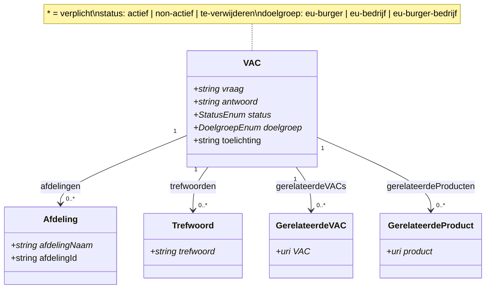
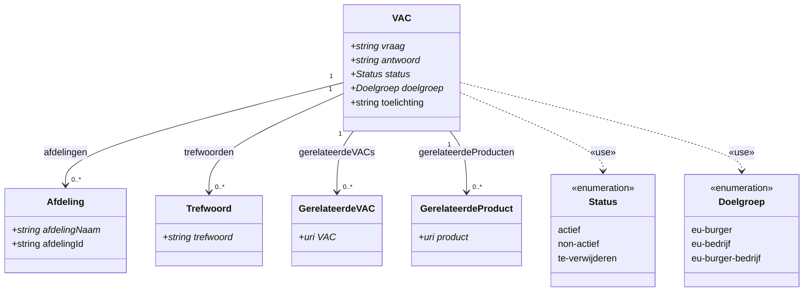

# Chat: UML diagram in Mermaid maken

- **Datum**: 2026-04-23 23:51
- **Sessie-ID**: `eedc9eb6-ff0a-42bd-9349-91131b7af6cd`
- **Berichten**: 4

---

## 🧑 User

Zou je van dit schema een UML representatie in mermaid kunnen maken?

---

## 🤖 Assistant



De `*` geeft verplichte velden aan (conform het `required` array in het schema). De enum-waarden zijn weergegeven in de note op `VAC`.

---

## 🧑 User

kun je van de enums ook enumerations maken in mermaid, zodat ze zichtbaar zijn? Tussen de gebruikende klassen en de enumeratie teken ik dan meestal een dependency.

bijv.:
```
class Richting {
        <<enumeration>>
        NOORD
        OOST
        ZUID
        WEST
    }
    ```

---

## 🤖 Assistant



De `..>` pijl geeft de dependency weer (`«use»`), conform UML-conventie voor het gebruik van een enumeratie door een klasse.

---
