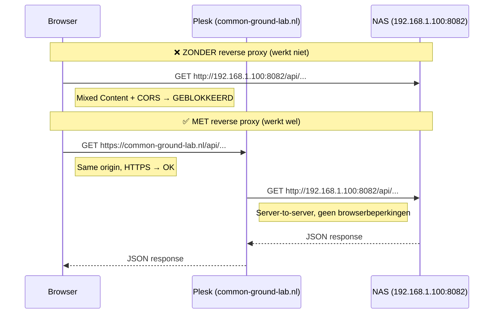

# Chat: Deploy React app on Plesk

- **Datum**: 2026-06-30 15:20
- **Sessie-ID**: `18b07237-9ed6-4103-940b-f3e6fc5cbbea`
- **Berichten**: 4

---

## 🧑 User

als ik de react pagina's bij mijnhosting provider (plesk, nodejs werkt er) zou willen draaien, kan ik dan alles gewoon daarheen kopieren? DUs de files vite, shared en react?

De backend zou ik op mijn NAS draaien. Moet er nog wel iets met CORS gedaan worden (common-ground-lab.nl), maar dat zou op zich moeten werken, toch?

Doe nog niets, ik wil alleen advies.

Staat het adres van de backend voor de ide en studio ergens geconfigureerd? Kan dat ook een IP adres + poort enz. zijn?

---

## 🤖 Assistant

## Advies: frontend op Plesk, backend op NAS

Hier is een analyse op basis van wat ik in de codebase heb gevonden.

### 1. Kun je de React-pagina's gewoon naar Plesk kopiëren?

**Ja**, het is een statische SPA (Single Page Application). De  produceert puur HTML/JS/CSS in . Die bestanden kun je op Plesk serveren met elke webserver (Apache, Nginx, of een simpele Node.js static file server). Er is geen server-side rendering of Node.js runtime nodig.

Je moet wel **multi-page routing** regelen: de build produceert meerdere HTML-entry's (, , , , etc.). In de huidige NGINX-config () zie je dat  via `try_files` naar  valt. Voor de andere pagina's moet je vergelijkbare routes instellen, of je gebruikt een SPA-fallback per entrypoint.

### 2. Het adres van de backend — waar is dat geconfigureerd?

Hier zit **het grootste probleem**. De API-basis-URL wordt op **drie verschillende, inconsistente manieren** bepaald:

| Pagina/component | Mechanisme | Productiegedrag |
|---|---|---|
|  (Studio, DMN, BPMN, Berichten) |  | ❌ `""` → same-origin |
| ,  | idem: port-check | ❌ `""` → same-origin |
| , ,  | idem: port-check | ❌ `""` → same-origin |
| ,  |  | ✅ ondersteunt env var |

Het patroon  is bedoeld voor lokale dev (Vite op `:5174`, Go API op `:8082`). In productie is de port *niet* 5174, dus valt alles terug op `""` — een **relatieve URL** die ervan uitgaat dat de API op dezelfde origin draait. Dat werkt in Docker (waar NGINX `/` proxyt naar de API-container) maar **niet** als de backend op een aparte NAS draait.

**Conclusie**: op dit moment kun je niet zomaar  zetten en klaar zijn. De IDE, Studio, Editor, Upload/Import dialogs, en BestandenPanel **negeren** die env var allemaal. Die moeten aangepast worden.

### 3. Kan het backend-adres een IP + poort zijn?

**Ja**, technisch wel. In de huidige code wordt `http://localhost:8082` gebruikt — dat kan net zo goed `http://192.168.1.100:8082` of `https://api.common-ground-lab.nl:8082` zijn. Maar let op:

- **Mixed content**: als Plesk op HTTPS draait (`https://common-ground-lab.nl`) en de NAS op HTTP (`http://192.168.x.x:8082`), blokkeren browsers de requests. De NAS moet dan óf HTTPS hebben óf je moet een reverse proxy op Plesk-zijde gebruiken.
- **CORS**: de Go-backend heeft een hardcoded whitelist van toegestane origins in `routes/addroutes.go:22-32`. Momenteel alleen `localhost:5173-5175`, `127.0.0.1:5173-5175`, `localhost:8082/8182`, en `test1.pleio.local:8000`. `common-ground-lab.nl` staat er **niet** in. Je moet daar je productie-origin(s) aan toevoegen.

### 4. Wat moet er gebeuren om dit werkend te krijgen?

Samengevat:

1. **API-URL centraliseren**: alle losse  checks moet je vervangen door één centrale configuratie die in productie  leest (of  als fallback). Dat raakt ~8 bestanden in .

2. **CORS-whitelist uitbreiden**: in `routes/addroutes.go` moet `https://common-ground-lab.nl` (en eventueel het IP van de NAS) aan de  map worden toegevoegd. Of herbouwen naar een configureerbare lijst (environment variable).

3. **HTTPS-regeling**: als Plesk HTTPS is, moet óf de NAS ook HTTPS draaien (via bijv. een Let's Encrypt reverse proxy), óf je routeert het API-verkeer via Plesk zelf (reverse proxy), zodat de browser alles als same-origin ziet. Die laatste optie is het makkelijkst en elimineert CORS helemaal.

4. **NGINX op NAS**: de NAS moet de Go API bereikbaar maken. De bestaande  laat zien hoe dat in Docker werkt (`proxy_pass http://api:8080`). Voor de NAS variant wordt dat `proxy_pass http://localhost:8082` of direct exposed poort.

Wil je dat ik een van deze stappen concreet uitwerk, of heb je eerst nog andere vragen?

---

## 🧑 User

hoe werkt 3?

---

## 🤖 Assistant

## Optie 3 uitgelegd: Plesk als reverse proxy → NAS

De kern van het probleem is dat een browser **twee verschillende origins** ziet:

```
Pagina:  https://common-ground-lab.nl          (Plesk, HTTPS)
API:     http://192.168.1.100:8082              (NAS, HTTP)
```

Dit geeft twee problemen tegelijk: **Mixed Content** (HTTPS-pagina doet HTTP-request → geblokkeerd) én **CORS** (cross-origin request → geblokkeerd).

### De oplossing: Plesk proxyt alle API-requests door naar de NAS

In plaats van dat de browser rechtstreeks naar de NAS praat, laat je **Plesk** als doorgeefluik fungeren. Voor de browser is ALLES dan `https://common-ground-lab.nl` — same origin, geen CORS, geen mixed content.



### Wat je op Plesk moet instellen

Plesk ondersteunt Apache én Nginx. Je voegt een **reverse proxy regel** toe die alle `/api/`-verzoeken doorstuurt naar het IP van je NAS. Dit kan op twee manieren:

**Via de Plesk GUI** (Apache + Nginx):
1. Ga naar **Websites & Domains** → jouw domein → **Apache & Nginx Settings**
2. Onder **Additional Nginx directives** voeg je toe:

```nginx
location /api/ {
    proxy_pass http://192.168.1.100:8082;
    proxy_http_version 1.1;
    proxy_set_header Host $host;
    proxy_set_header X-Real-IP $remote_addr;
    proxy_set_header X-Forwarded-For $proxy_add_x_forwarded_for;
    proxy_set_header X-Forwarded-Proto $scheme;
    proxy_set_header Upgrade $http_upgrade;
    proxy_set_header Connection "upgrade";
    proxy_read_timeout 120s;
}
```

Of **als `.htaccess` / Apache config** (als je alleen Apache hebt):

```apache
ProxyPass /api/ http://192.168.1.100:8082/
ProxyPassReverse /api/ http://192.168.1.100:8082/
```

Let op: op shared Plesk-hosting moet `mod_proxy` / `mod_proxy_http` soms door de hoster worden ingeschakeld. Bij sommige Plesk-abonnementen is dat standaard uit.

### Wat dit betekent voor de frontend-code

Het mooie: **je hoeft NIETS aan de frontend te veranderen**. De huidige code valt in productie terug op `""` (lege string = relatieve URL), dus:

```javascript
// In productie wordt dit:
apiBase()  // → ""
fetch(`${apiBase()}/api/schema/model/code`)
// effectief:
fetch("/api/schema/model/code")
// → https://common-ground-lab.nl/api/schema/model/code
// → Plesk proxyt naar http://NAS:8082/api/schema/model/code
```

Alles is same-origin, dus:
- ❌ Geen CORS-headers nodig op de Go-backend
- ❌ Geen  env var nodig
- ❌ Geen HTTPS op de NAS nodig (het verkeer tussen Plesk↔NAS is server-to-server via je lokale netwerk/VPN)
- ✅ Alle paginas (IDE, Studio, Editor, Index, Tijdlijn) werken zonder code-aanpassingen

### Netwerkvereiste

Plesk moet je NAS wél kunnen bereiken op `192.168.1.100:8082`. Als de Plesk-server extern gehost is (niet in je eigen netwerk), moet je:
- Een **VPN-tunnel** opzetten tussen Plesk en je thuisnetwerk (bijv. WireGuard/Tailscale), óf
- Een poort forwarden op je router én je NAS een publiek IP/DDNS geven, óf
- De Go API in een **Docker-container op de NAS** draaien met een Cloudflare Tunnel / ngrok-achtige oplossing

Voor een thuis-NAS is een VPN-tunnel (Tailscale is gratis voor kleine setups) meestal de eenvoudigste veilige oplossing.

---
