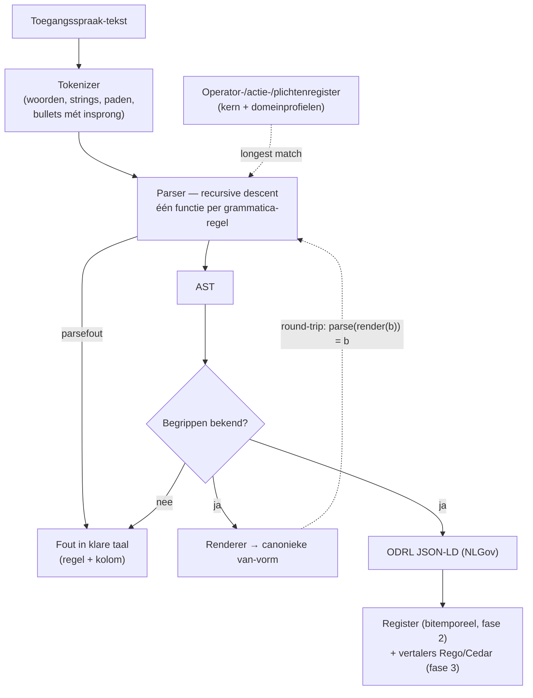

# Claude Code-sessie-export

> **Let op:** export van een **Claude Code**-sessie. Gebruiker- en assistentteksten zijn letterlijk overgenomen; tool-aanroepen staan als compacte `🔧`-annotaties (hun output niet); interne redeneerblokken weggelaten.
>
> - **Datum:** 2026-07-22
> - **Sessie-id:** `7826109e-ab4a-4e69-bece-03b5845659b3`
> - **Branch:** `main`

---

## 👤 Gebruiker (1)

@/d:/Git/Bitemporal_2026/bitemp_register_v06/docs/plans/ODRL-Register-Toegangsbeleid.md @/d:/Git/Bitemporal_2026/bitemp_register_v06/docs/plans/2026-04-12 ODRL based Autorisatie Register (Claude).rtf

Ik ben al een tijd aan het denken, samen met de werkgroep FTV / Register Toegangsbeleid, aan een menselijk leesbare policy taal, die de dekking van XACML/OPA/Cedar en ODRL heeft, maar dus wel te snappen is door leken.

Dat vergt een definitie en een soort interpreter. Je maakt in feite een klein policy-programmeertaaltje, zonder moeilijke woorden. Hoogstens de dingen als subject, object, activiteit of actie (bekijken, veranderen, registreren, opvoeren, afvoeren, corrigeren), gegevenstype, gegevens, en werkwoorden als mogen en ontkenning daarvan ('mag niet').

Over subjecten en objecten (= gegevens / -typen) kun je praten met behulp van hun eigenschappen (attributen, of dieper: natuurlijk-persoon.naam.achternaam).

Er moeten wat functies en operatoren beschikbaar zijn, als = <>, bevat, begint met. (In het geo-domein kunnen dat geo-functies zijn: valt deels of geheel binnen e.d.; in andere domeinen andere, dus uitbreidbaar).

Zou je daar over na willen denken een iets voorstellen dat aan deze requirements voldoet?

**🤖 Claude:**

Ik lees eerst de twee aangehaalde documenten om aan te sluiten bij wat er al ligt.
> 🔧 `Read` — d:\Git\Bitemporal_2026\bitemp_register_v06\docs\plans\ODRL-Register-Toegangsbeleid.md
> 🔧 `Bash` — List plans directory with file sizes
> 🔧 `Bash` — Scan RTF chat export for passages about human readability / policy language
> 🔧 `Grep` — leesbaar|leken|begrijpel|klare taal|natuurlijke taal
> 🔧 `Read` — d:\Git\Bitemporal_2026\bitemp_register_v06\docs\plans\Whitepaper-Register-Toegangsbeleid.md
> 🔧 `Write` — d:\Git\Bitemporal_2026\bitemp_register_v06\docs\plans\2026-07-22 Klare-taal Toegangsbeleid — Toegangsspraak...

**🤖 Claude:**

Ik heb er goed over nagedacht en een concreet voorstel uitgewerkt: **Toegangsspraak** (werktitel), een Nederlandstalige *gecontroleerde* beleidstaal die als leesbare laag bovenop jullie bestaande ODRL-ontwerp ligt. Het volledige ontwerp staat in [2026-07-22 Klare-taal Toegangsbeleid — Toegangsspraak (ontwerp).md](bitemp_register_v06/docs/plans/2026-07-22%20Klare-taal%20Toegangsbeleid%20—%20Toegangsspraak%20(ontwerp).md).

De kern van het voorstel:

**Geen vrije taal, maar een gecontroleerde taal (CNL).** Vrij Nederlands is ambigu ("en/of", zwevend "niet"). De oplossing: een klein aantal vaste zinspatronen waarbij elke zin precies één betekenis heeft en 1-op-1 afbeeldt op de ODRL-subset die je al hebt ontworpen. Eén kernzin draagt de hele taal:

> *\<wie\> **mag** \<gegevens\> \<actie\> — of **mag niet** — [ **als** \<voorwaarden\> ] [ **waarbij:** \<verplichtingen\> ]*

Bijvoorbeeld:

```
Een schuldhulpverlener mag de inkomensgegevens bekijken
als aan alle volgende voorwaarden is voldaan:
  - het doel van de aanvraag is "schuldhulpverlening";
  - er is een lopend dossier voor de betrokkene;
waarbij: elke raadpleging wordt vastgelegd in het logboek.
```

De belangrijkste ontwerpkeuzes:

- **En/of-ambiguïteit opgelost via het RegelSpraak-patroon**: bij meerdere voorwaarden is de opsommingsvorm verplicht ("aan alle / aan ten minste één van / aan precies één van de volgende voorwaarden is voldaan"), nestbaar voor elke boolese combinatie. Dit leen ik bewust van RegelSpraak/ALEF (Belastingdienst) — bewezen prior art voor Nederlandstalige CNL, samen met SBVR Structured Dutch en Catala.
- **Attribuutpaden met vaste ankerwoorden**: voorwaarden zijn `<pad of waarde> <vergelijking> <pad of waarde>`, met leesbare ankers *de aanvrager*, *de gegevens*, *de betrokkene*, *de aanvraag* (die netjes op de AuthZEN/XACML-categorieën mappen). Ook pad-tegen-pad kan: "de locatie van de gegevens valt binnen het werkgebied van de aanvrager".
- **Uitbreidbaar operator-register**: kernset (`is`, `is niet`, `bevat`, `begint met`, `ligt tussen`, …) plus domeinprofielen (geo: `valt geheel binnen`, `overlapt`, `ligt binnen … meter van`) — de grammatica kent alleen het slot "vergelijking", de invulling komt uit het register. Dit is jullie ODRL-Profile-mechanisme doorgetrokken naar de taal.
- **De MetaRegistry doet de typebewaking**: paden en veldtypen komen uit de schema-API, dus de interpreter weigert onzin als `geboortedatum begint met "A"` — met een foutmelding die zelf ook in klare taal is.
- **Round-trip als harde garantie**: de tekst is de bron, ODRL de canonieke schaduw (beide bitemporeel geregistreerd). Er komt ook een renderer ODRL → tekst, zodat *alles* in het register leesbaar is, ongeacht hoe het binnenkwam. De bestaande fase-3-vertalers (ODRL → Rego/Cedar) blijven ongewijzigd — de taal lift daar gratis op mee.
- **Schrijven gebeurt begeleid**: de bekende CNL-zwakte is dat schrijven moeilijker is dan lezen. Daarom een gestructureerde editor als Omnium Studio-activiteit — zinsjablonen met slots, autocomplete uit de schema-API. Leken lezen volzinnen; auteurs klikken en vullen in.
- **Conflictregel vast en zelf leesbaar**: "Wat niet uitdrukkelijk is toegestaan, mag niet; een verbod gaat altijd vóór een toestemming." Dat ene besluit schrapt de hele combinatie-algoritme-complexiteit die XACML onleesbaar maakt.

Het document bevat verder een compacte EBNF-grammatica (LL(1)-parseerbaar, dus goed te bouwen met bv. chevrotain in de v06-stack), een dekkingsmatrix tegen ODRL/XACML/OPA/Cedar, toetsvoorbeelden (geo, verbod-met-uitzondering, correctie-met-verantwoording), en wat bewust búiten v1 blijft (vrije rekenkunde, recursie, delegatie) met een gemarkeerd CEL-`expressie`-blok als expert-ontsnappingsluik.

Grootste openstaande punt om vroeg af te bakenen: existentie-voorwaarden zoals "er is een lopend dossier" — die vergen een PIP-bevraging en zijn de moeilijkste categorie voor v1. Als je wilt, werk ik als vervolgstap de parser + renderer met round-trip-tests uit als klein TS-pakket, of eerst de plicht-subgrammatica.

---

## 👤 Gebruiker (2)

Ja, mooi!

Wat betreft "De MetaRegistry doet de typebewaking": autocomplete en drag en drop behoren tot toekomstige mogelijkheden, denk ik. We hebben al een soort autocomplete in de CEL editor en drag en drop in de DMN editor gemaakt. Dus vanuit het metamodel (de projectboom) gegeventypen droppen. 

Is de ietwat formele NatuurlijkPersoon.naam.achternaam of shorthand NP.achternaam toegestaan, of maken we daar "de achternaam van een natuurlijk persoon" van? Dat laatste is eigenlijk mooier. Dan is het woord `van` een grammatica element geworden, dat aggregatie / compositie in het model omgekeerd volgt.

Wil je een begin maken? Dat mag in de (nu inactieve) Toegangsverlening activiteit in Omnium.

**🤖 Claude:**

Mooi! Eens met je "van"-intuïtie — daar kom ik zo op terug. Eerst verken ik de codebase: de Toegangverlening-activiteit, de Studio-activiteitenstructuur, en de CEL-editor (voor de autocomplete-patronen).
> 🔧 `Agent` — Verken Studio Toegangverlening activiteit
> 🔧 `ToolSearch`
> 🔧 `Read` — d:\Git\Bitemporal_2026\bitemp_register_v06\web\vite\src\studio\activities\dmnActivity.jsx
> 🔧 `TodoWrite` — takenlijst bijgewerkt
> 🔧 `Read` — d:\Git\Bitemporal_2026\bitemp_register_v06\web\vite\src\studio\activities\index.jsx
> 🔧 `PowerShell` — Create feature branch feat/toegangsspraak
> 🔧 `Read` — d:\Git\Bitemporal_2026\bitemp_register_v06\web\vite\src\shared\celEvaluator.test.js
> 🔧 `Write` — d:\Git\Bitemporal_2026\bitemp_register_v06\web\vite\src\toegangsspraak\operatoren.js
> 🔧 `Write` — d:\Git\Bitemporal_2026\bitemp_register_v06\web\vite\src\toegangsspraak\woorden.js
> 🔧 `Write` — d:\Git\Bitemporal_2026\bitemp_register_v06\web\vite\src\toegangsspraak\parser.js
> 🔧 `Edit` — d:\Git\Bitemporal_2026\bitemp_register_v06\web\vite\src\toegangsspraak\parser.js
> 🔧 `Edit` — d:\Git\Bitemporal_2026\bitemp_register_v06\web\vite\src\toegangsspraak\parser.js
> 🔧 `Edit` — d:\Git\Bitemporal_2026\bitemp_register_v06\web\vite\src\toegangsspraak\parser.js
> 🔧 `Write` — d:\Git\Bitemporal_2026\bitemp_register_v06\web\vite\src\toegangsspraak\renderer.js
> 🔧 `TodoWrite` — takenlijst bijgewerkt
> 🔧 `Write` — d:\Git\Bitemporal_2026\bitemp_register_v06\web\vite\src\toegangsspraak\odrl.js
> 🔧 `Write` — d:\Git\Bitemporal_2026\bitemp_register_v06\web\vite\src\toegangsspraak\index.js
> 🔧 `Write` — d:\Git\Bitemporal_2026\bitemp_register_v06\web\vite\src\toegangsspraak\voorbeeld.js
> 🔧 `Write` — d:\Git\Bitemporal_2026\bitemp_register_v06\web\vite\src\toegangsspraak\toegangsspraak.test.js

**🤖 Claude:**

Tests draaien:
> 🔧 `PowerShell` — Run toegangsspraak unit tests
> 🔧 `TodoWrite` — takenlijst bijgewerkt
> 🔧 `Grep` — export|FIELDREF_MIME
> 🔧 `Grep` — import.*prism|from "react-simple-code-editor"|highlight
> 🔧 `Read` — d:\Git\Bitemporal_2026\bitemp_register_v06\web\vite\src\umleditor\components\panels\ExpressieEditor.jsx
> 🔧 `Read` — d:\Git\Bitemporal_2026\bitemp_register_v06\web\vite\src\modelpicker\ModelPicker.jsx

**🤖 Claude:**

Alles duidelijk. Nu de activiteit zelf:
> 🔧 `Write` — d:\Git\Bitemporal_2026\bitemp_register_v06\web\vite\src\studio\activities\toegangActivity.jsx
> 🔧 `Edit` — d:\Git\Bitemporal_2026\bitemp_register_v06\web\vite\src\studio\activities\index.jsx
> 🔧 `Edit` — d:\Git\Bitemporal_2026\bitemp_register_v06\web\vite\src\studio\activities\index.jsx
> 🔧 `Edit` — d:\Git\Bitemporal_2026\bitemp_register_v06\web\vite\src\studio\activities\index.jsx

**🤖 Claude:**

Nu de volledige testsuite en een productie-build om te controleren dat alles integreert:
> 🔧 `PowerShell` — Run full unit test suite
> 🔧 `Bash` — Run full unit test suite via bash
> 🔧 `Bash` — Run all unit tests with expanded glob
> 🔧 `Bash` — Vite production build to verify integration
> 🔧 `Bash` — Check build output for errors
> 🔧 `Grep` — Toegang|toegang
> 🔧 `Edit` — d:\Git\Bitemporal_2026\bitemp_register_v06\docs\STUDIO.md
> 🔧 `Edit` — d:\Git\Bitemporal_2026\bitemp_register_v06\docs\plans\2026-07-22 Klare-taal Toegangsbeleid — Toegangsspraak...
> 🔧 `Edit` — d:\Git\Bitemporal_2026\bitemp_register_v06\docs\plans\2026-07-22 Klare-taal Toegangsbeleid — Toegangsspraak...
> 🔧 `Bash` — Check for soft hyphen in doc
> 🔧 `Grep` — searchParams|activiteit=|URLSearchParams
> 🔧 `Bash` — Check for soft hyphen in doc
> 🔧 `Grep` — persist|localStorage|activeId
> 🔧 `Bash` — Locate AssetCollection line and count soft hyphens in doc
> 🔧 `Edit` — d:\Git\Bitemporal_2026\bitemp_register_v06\docs\plans\2026-07-22 Klare-taal Toegangsbeleid — Toegangsspraak...
> 🔧 `Read` — d:\Git\Bitemporal_2026\bitemp_register_v06\web\vite\src\studio\useStudioStore.js
> 🔧 `Bash` — Start Vite dev server on port 5175 in background
> 🔧 `Write` — C:\Users\User\AppData\Local\Temp\claude\d--Git-Bitemporal-2026\7826109e-ab4a-4e69-bece-03b5845659b3\scratch...
> 🔧 `Bash` — Run Playwright smoke test of Toegangverlening activity
> 🔧 `Bash` — Run smoke test from web/vite with local Playwright
> 🔧 `Read` — C:\Users\User\AppData\Local\Temp\claude\d--Git-Bitemporal-2026\7826109e-ab4a-4e69-bece-03b5845659b3\scratch...
> 🔧 `Edit` — C:\Users\User\AppData\Local\Temp\claude\d--Git-Bitemporal-2026\7826109e-ab4a-4e69-bece-03b5845659b3\scratch...
> 🔧 `Bash` — Re-run smoke test with correct base URL
> 🔧 `Read` — C:\Users\User\AppData\Local\Temp\claude\d--Git-Bitemporal-2026\7826109e-ab4a-4e69-bece-03b5845659b3\scratch...
> 🔧 `PowerShell` — Stop own Vite dev server on port 5175 (process tree)
> 🔧 `TodoWrite` — takenlijst bijgewerkt
> 🔧 `PowerShell` — Show working tree changes

**🤖 Claude:**

Klaar — het begin staat, en het werkt. Alle 344 unit tests slagen (waarvan 11 nieuwe), de build is groen, en ik heb de activiteit in de browser gecontroleerd: de Toegangsspraak-editor draait in de Toegangverlening-activiteit (nog steeds CONCEPT, alleen via *Ga naar*), op branch `feat/toegangsspraak` (niet gecommit, zoals afgesproken).

**Het "van"-besluit** — ik heb je voorstel overgenomen, met één nuance:

- **De van-vorm is de canonieke leesvorm**: *"de achternaam van de naam van een natuurlijk persoon"*. Het woord "van" is een grammatica-element dat de compositie in het metamodel omgekeerd volgt (blad → wortel), en werkt ook op de ankers: *het doel **van** de aanvraag*, *het werkgebied **van** de aanvrager*.
- **Het pad blijft de canonieke interne vorm** (AST, ODRL `nlgov:registerpad`). De parser accepteert `NatuurlijkPersoon.Naam.achternaam` als technische shorthand — precies wat drag & drop uit de projectboom oplevert — maar de renderer schrijft **altijd** de van-vorm terug. Zo is alles in het register gegarandeerd leesbaar, hoe het ook binnenkwam.
- Voor later (met metamodel-resolutie): de keten mag verkort worden zolang die eenduidig is — *"de achternaam van een natuurlijk persoon"* mag "de naam" overslaan als er maar één `achternaam` onder `NatuurlijkPersoon` bestaat. Vastgelegd in §4.7 van het [ontwerpdocument](bitemp_register_v06/docs/plans/2026-07-22%20Klare-taal%20Toegangsbeleid%20—%20Toegangsspraak%20(ontwerp).md).

**Wat er gebouwd is:**

- [Taalkern `toegangsspraak/`](bitemp_register_v06/web/vite/src/toegangsspraak/) — tokenizer + handgeschreven recursive-descent parser (zelfde idioom als de CEL-evaluator, geen nieuwe dependency), renderer naar de canonieke van-vorm, en de ODRL JSON-LD-mapping op de NLGov-subset. Dekt: kop (geldigheid/grondslag/doel), Begrippen (rolgroepen en gegevensverzamelingen), regels met `mag`/`mag niet`, geneste opsommingen (en/of/precies één), plichten, en het uitbreidbare operator-register — het geo-profiel zit erin als registreerbaar voorbeeld.
- [Studio-activiteit `toegangActivity.jsx`](bitemp_register_v06/web/vite/src/studio/activities/toegangActivity.jsx) — naar het DMN-patroon: sidebar met de **ModelPicker** (klik of sleep een veld en de van-vorm wordt op de cursor ingevoegd), editor met syntax-highlighting en een foutenpaneel in klare taal, tab "Canonieke vorm" als leesweergave, ODRL live in de inspector, en een Beleid-menu (voorbeeld laden, herformatteren, ODRL-export).
- [Tests](bitemp_register_v06/web/vite/src/toegangsspraak/toegangsspraak.test.js) — inclusief de harde round-trip-eis uit het ontwerp: `render(parse(t))` is exact het canonieke voorbeeld, en `parse(render(b))` is structureel gelijk aan `b`, ook voor geneste blokken.
- Docs: §4.7 (van-besluit) en §12 (implementatiestatus) in het ontwerpdoc, en de activiteitentabel in [STUDIO.md](bitemp_register_v06/docs/STUDIO.md).

Autocomplete en de begeleide slot-editor heb ik conform je opmerking als vervolgstap gemarkeerd (§12) — de drop uit de projectboom werkt al wel. Logische volgende stap is de metamodel-typebewaking via de schema-API (operator × veldtype, plus de keten-verkorting), dan wordt de 404 in de sidebar bij een draaiende backend meteen zinvol. Ik zag trouwens dat je chat-backupscript intussen een export van dit gesprek heeft klaargezet in `docs/ai-chats/exports/` — die kan gewoon mee als je commit.

---

## 👤 Gebruiker (3)

Mooi!

Ik probeer een beetje.

Ik type "   Mail is de email van de persoonscontactgegevens van een persoon."
-> fout: Regel 9: Een begrip begint met Een, De of Het. (gevonden: "Mail")

Snap ik. Ik heb dan net een term gevonden die onbepaald is. "Mail" is mail in het algemeen. Net als water of lucht.

In begrippen spreek je wel vaker over iets onbepaalds als term. Schuldhulpverlening is het ....
Inkomensgegevens zijn (zonder de eigenlijk) (die definitie is overigens incongruent: "De inkomensgegevens *zijn*: *het inkomen* van een natuurlijk persoon.")

Wat denk je?

- Hoe is het nu eigenlijk gemaakt? (Taal)
- Kun je uitleggen hoe de interpreter werkt? (In taal of met een schema. Activity Diagram? :-) )

**🤖 Claude:**

Goeie vangst, twee keer zelfs. Mijn beoordeling: je hebt gelijk — en ik pas het meteen aan, want het raakt de grammatica op een fundamenteel punt:

1. **Onbepaalde termen in definities zijn gangbaar Nederlands** ("Mail is …", "Inkomensgegevens zijn …", net als water of lucht). Het verplichte lidwoord was een te strenge keuze van mij; in het *definiendum* (het te definiëren begrip) hoort het optioneel te zijn. In *verwijzingen mét van-keten* blijft het lidwoord verplicht, want daar is het een grammaticaal anker.
2. **De incongruentie in mijn voorbeeld klopt**: "De inkomensgegevens *zijn*: *het inkomen* van …" — meervoud gelijkgesteld aan enkelvoud. Dat los ik op door "alle gegevens van" ook een volledige van-keten te laten nemen: *"Inkomensgegevens zijn: alle gegevens van het inkomen van een natuurlijk persoon."* — congruent én het levert meteen het nettere groepspad `NatuurlijkPersoon.Inkomen` op.

Ik maak daarbij ook de dubbele punt na "is/zijn" optioneel bij het parsen (jouw zin had er geen); de canonieke vorm houdt hem wel — dat is precies waar de herformatteer-functie voor is. Eerst de parser:
> 🔧 `Edit` — d:\Git\Bitemporal_2026\bitemp_register_v06\web\vite\src\toegangsspraak\parser.js
> 🔧 `Edit` — d:\Git\Bitemporal_2026\bitemp_register_v06\web\vite\src\toegangsspraak\parser.js
> 🔧 `Edit` — d:\Git\Bitemporal_2026\bitemp_register_v06\web\vite\src\toegangsspraak\parser.js
> 🔧 `Edit` — d:\Git\Bitemporal_2026\bitemp_register_v06\web\vite\src\toegangsspraak\parser.js

**🤖 Claude:**

Nu renderer, ODRL-mapping en het congruente voorbeeld:
> 🔧 `Edit` — d:\Git\Bitemporal_2026\bitemp_register_v06\web\vite\src\toegangsspraak\renderer.js
> 🔧 `Edit` — d:\Git\Bitemporal_2026\bitemp_register_v06\web\vite\src\toegangsspraak\renderer.js
> 🔧 `Edit` — d:\Git\Bitemporal_2026\bitemp_register_v06\web\vite\src\toegangsspraak\odrl.js
> 🔧 `Edit` — d:\Git\Bitemporal_2026\bitemp_register_v06\web\vite\src\toegangsspraak\odrl.js
> 🔧 `Edit` — d:\Git\Bitemporal_2026\bitemp_register_v06\web\vite\src\toegangsspraak\voorbeeld.js
> 🔧 `Edit` — d:\Git\Bitemporal_2026\bitemp_register_v06\web\vite\src\toegangsspraak\index.js

**🤖 Claude:**

Nu de tests uitbreiden met precies jouw zin en de congruentie-check:
> 🔧 `Edit` — d:\Git\Bitemporal_2026\bitemp_register_v06\web\vite\src\toegangsspraak\toegangsspraak.test.js
> 🔧 `Edit` — d:\Git\Bitemporal_2026\bitemp_register_v06\web\vite\src\toegangsspraak\toegangsspraak.test.js
> 🔧 `Bash` — Run toegangsspraak tests after grammar change

**🤖 Claude:**

Alle 13 tests groen. Volledige suite ter controle:
> 🔧 `Bash` — Run full unit test suite
> 🔧 `Edit` — d:\Git\Bitemporal_2026\bitemp_register_v06\docs\plans\2026-07-22 Klare-taal Toegangsbeleid — Toegangsspraak...
> 🔧 `Edit` — d:\Git\Bitemporal_2026\bitemp_register_v06\docs\plans\2026-07-22 Klare-taal Toegangsbeleid — Toegangsspraak...
> 🔧 `Edit` — d:\Git\Bitemporal_2026\bitemp_register_v06\docs\plans\2026-07-22 Klare-taal Toegangsbeleid — Toegangsspraak...

**🤖 Claude:**

Klaar — jouw zin parset nu, en het voorbeeldbeleid is congruent gemaakt. Alle 346 tests slagen (13 in de taalmodule, waaronder letterlijk jouw Mail-zin). Wat er veranderd is, en dan je twee vragen.

## Wat ik ervan denk (en gedaan heb)

Je hebt gelijk, op beide punten:

- **Onbepaalde termen in definities** — het lidwoord in het definiendum is nu optioneel: *"Mail is de email van de persoonscontactgegevens van een persoon."* parset, en ook de verwijzing mag kaal: *"… mag mail bekijken"*. In **van-ketens blijft het lidwoord verplicht** — daar is het een grammaticaal anker dat de groepen scheidt. Eén prijs: een begripsnaam kan zelf de woorden "is" of "zijn" niet bevatten (de naam eindigt bij het eerste "is"/"zijn"). De dubbele punt na is/zijn is bij het parsen nu ook optioneel; de canonieke vorm zet hem er wél — dat is precies waar *Herformatteer* voor is.
- **De incongruentie** — opgelost door "alle gegevens van" een volledige van-keten te laten nemen: *"Inkomensgegevens zijn: alle gegevens van het inkomen van een natuurlijk persoon."* Meervoud = meervoud, en het levert een netter groepspad op: `NatuurlijkPersoon.Inkomen` (alle segmenten hoofdletter, want er is geen veld-blad). Vastgelegd in §4.2 van het [ontwerpdoc](bitemp_register_v06/docs/plans/2026-07-22%20Klare-taal%20Toegangsbeleid%20—%20Toegangsspraak%20(ontwerp).md).

## Hoe is het gemaakt?

Plain **JavaScript (ESM), nul dependencies** — bewust hetzelfde idioom als jullie `celEvaluator.js`: een handgeschreven tokenizer plus recursive-descent parser, geen parser-generator. Vijf kleine modules in [web/vite/src/toegangsspraak/](bitemp_register_v06/web/vite/src/toegangsspraak/):

| Module | Rol |
|---|---|
| [woorden.js](bitemp_register_v06/web/vite/src/toegangsspraak/woorden.js) | taalhulpjes: CamelCase ↔ woorden, lidwoorden, NL-datums |
| [operatoren.js](bitemp_register_v06/web/vite/src/toegangsspraak/operatoren.js) | de registers: vergelijkingen, handelingen, plichten (uitbreidbaar) |
| [parser.js](bitemp_register_v06/web/vite/src/toegangsspraak/parser.js) | tokenizer + parser → AST, + validatie |
| [renderer.js](bitemp_register_v06/web/vite/src/toegangsspraak/renderer.js) | AST → canonieke tekst (van-vorm) |
| [odrl.js](bitemp_register_v06/web/vite/src/toegangsspraak/odrl.js) | AST → ODRL JSON-LD |

## Hoe werkt de interpreter?

Strikt genomen is het een **vertaler**, geen interpreter: hij voert geen beleid uit (dat doet straks de PDP), hij vertaalt tekst ↔ AST ↔ ODRL. In stappen:

1. **Tokenizer** knipt de tekst in woorden, strings, getallen, paden en leestekens. Bijzonder: opsommings-streepjes krijgen hun **insprong** mee als data — daar hangt later de nesting aan.
2. **Parser** — recursive descent: elke grammatica-regel is één gewone functie die tokens consumeert en een AST-knoop teruggeeft (`parseBeleid → parseRegel → parseVoorwaardeblok → parseVoorwaarde → parseVerwijzing`, enz.). De grammatica is zo ontworpen dat een paar woorden vooruitkijken altijd volstaat om te weten welke regel geldt. Operatoren zitten **niet in de grammatica maar in het register**: op elk voorwaarde-punt vraagt de parser "begint hier een operator-zin?" met langste-eerst-matching (*is kleiner dan* wint van *is*) — daarom kan het geo-profiel operatoren toevoegen zonder één regel grammatica te wijzigen. Een van-keten wordt geparst als groepen gescheiden door "van"; de laatste groep is de basis (anker of type), en het pad ontstaat door de keten om te draaien — "van" volgt de compositie omgekeerd, zoals je zei.
3. **Fout of AST**: elke misser geeft één fout in klare taal met regel en kolom; daarna checkt de validatie nog of gebruikte begrippen gedefinieerd zijn.
4. Uit de AST komen twee gelijkwaardige weergaven: de **renderer** (canonieke van-vorm — met als geteste wet: `parse(render(b)) = b`) en de **ODRL-mapping** (NLGov-subset, voor het register en straks de Rego/Cedar-vertalers).



Dit schema staat ook in het ontwerpdoc (§12.1), samen met de drie ontwerpkeuzes die het simpel houden: LL(1)-achtige grammatica, operatoren-als-data, en nesting via insprong. Als je verder experimenteert: het volgende dat gaat knellen is vermoedelijk de vaste woordvolgorde in voorwaarden (bijzinsvolgorde "…als de locatie binnen het werkgebied *valt*" wordt nog niet geaccepteerd) — dat staat al als open punt genoteerd.

---

## 👤 Gebruiker (4)

ik zie de flowchart niet. Staat ie ook in het doc?

**🤖 Claude:**

Ja — de flowchart staat in het doc, in **§12.1 "Hoe de interpreter werkt"** van [2026-07-22 Klare-taal Toegangsbeleid — Toegangsspraak (ontwerp).md](bitemp_register_v06/docs/plans/2026-07-22%20Klare-taal%20Toegangsbeleid%20—%20Toegangsspraak%20(ontwerp).md), als mermaid-blok (net als de diagrammen in het ODRL-plan). De ingebouwde VS Code markdown-preview rendert mermaid alleen met een extensie ("Markdown Preview Mermaid Support"); op GitHub rendert hij vanzelf zodra de branch gepusht is.

Zodat je hem nu meteen kunt zien, zet ik hem ook even op een artifact-pagina:
> 🔧 `Skill` — artifact-design
> 🔧 `Write` — C:\Users\User\AppData\Local\Temp\claude\d--Git-Bitemporal-2026\7826109e-ab4a-4e69-bece-03b5845659b3\scratch...
> 🔧 `Read` — d:\Git\Bitemporal_2026\bitemp_register_v06\web\vite\src\modelpicker\modelTree.js
> 🔧 `Edit` — d:\Git\Bitemporal_2026\bitemp_register_v06\web\vite\src\toegangsspraak\operatoren.js
> 🔧 `Write` — d:\Git\Bitemporal_2026\bitemp_register_v06\web\vite\src\toegangsspraak\metamodel.js

**🤖 Claude:**

ODRL laten meeliften op de geresolvede paden:
> 🔧 `Edit` — d:\Git\Bitemporal_2026\bitemp_register_v06\web\vite\src\toegangsspraak\odrl.js
> 🔧 `Edit` — d:\Git\Bitemporal_2026\bitemp_register_v06\web\vite\src\toegangsspraak\odrl.js
> 🔧 `Edit` — d:\Git\Bitemporal_2026\bitemp_register_v06\web\vite\src\toegangsspraak\index.js
> 🔧 `TodoWrite` — takenlijst bijgewerkt

**🤖 Claude:**

Tests voor de metamodel-laag:
> 🔧 `Write` — d:\Git\Bitemporal_2026\bitemp_register_v06\web\vite\src\toegangsspraak\metamodel.test.js
> 🔧 `Edit` — d:\Git\Bitemporal_2026\bitemp_register_v06\web\vite\src\toegangsspraak\metamodel.js
> 🔧 `Edit` — d:\Git\Bitemporal_2026\bitemp_register_v06\web\vite\src\toegangsspraak\metamodel.js

**🤖 Claude:**

Ook exporteren en testen:
> 🔧 `Edit` — d:\Git\Bitemporal_2026\bitemp_register_v06\web\vite\src\toegangsspraak\index.js
> 🔧 `Edit` — d:\Git\Bitemporal_2026\bitemp_register_v06\web\vite\src\toegangsspraak\metamodel.test.js
> 🔧 `Edit` — d:\Git\Bitemporal_2026\bitemp_register_v06\web\vite\src\toegangsspraak\metamodel.test.js
> 🔧 `Bash` — Run toegangsspraak + metamodel tests
> 🔧 `Bash` — Run toegangsspraak + metamodel tests with explicit paths
> 🔧 `Edit` — d:\Git\Bitemporal_2026\bitemp_register_v06\web\vite\src\toegangsspraak\metamodel.test.js
> 🔧 `Bash` — Re-run toegangsspraak + metamodel tests
> 🔧 `Write` — d:\Git\Bitemporal_2026\bitemp_register_v06\web\vite\src\studio\activities\toegangActivity.jsx
> 🔧 `Read` — d:\Git\Bitemporal_2026\bitemp_register_v06\web\vite\src\modelpicker\useSchemaModel.js
> 🔧 `Bash` — Run full tests and production build
> 🔧 `Write` — C:\Users\User\AppData\Local\Temp\claude\d--Git-Bitemporal-2026\7826109e-ab4a-4e69-bece-03b5845659b3\scratch...
> 🔧 `Bash` — Start dev server and run autocomplete smoke test
> 🔧 `Edit` — d:\Git\Bitemporal_2026\bitemp_register_v06\web\vite\src\studio\activities\toegangActivity.jsx
> 🔧 `Edit` — d:\Git\Bitemporal_2026\bitemp_register_v06\web\vite\src\studio\activities\toegangActivity.jsx
> 🔧 `Bash` — Re-run autocomplete smoke test

**🤖 Claude:**

Tab-aanvullen werkt nu. Even het screenshot bekijken en daarna opruimen en docs bijwerken:
> 🔧 `Read` — C:\Users\User\AppData\Local\Temp\claude\d--Git-Bitemporal-2026\7826109e-ab4a-4e69-bece-03b5845659b3\scratch...
> 🔧 `TodoWrite` — takenlijst bijgewerkt
> 🔧 `PowerShell` — Stop own Vite dev server on port 5175
> 🔧 `Edit` — d:\Git\Bitemporal_2026\bitemp_register_v06\docs\plans\2026-07-22 Klare-taal Toegangsbeleid — Toegangsspraak...
> 🔧 `Edit` — d:\Git\Bitemporal_2026\bitemp_register_v06\docs\plans\2026-07-22 Klare-taal Toegangsbeleid — Toegangsspraak...
> 🔧 `Edit` — d:\Git\Bitemporal_2026\bitemp_register_v06\docs\plans\2026-07-22 Klare-taal Toegangsbeleid — Toegangsspraak...

**🤖 Claude:**

Klaar — punten 1 en 2 zijn af, inclusief je "achterstevoren"-idee van tussendoor. Alle 355 tests slagen (22 in de taalmodule + 9 nieuwe metamodel-tests), de build is groen, en in de browser gecontroleerd: suggestie-chips verschijnen tijdens het typen en Tab vult aan.

**Punt 1 — metamodel-typebewaking + keten-verkorting** ([metamodel.js](bitemp_register_v06/web/vite/src/toegangsspraak/metamodel.js)):

- **Keten-resolutie met verkorting**: "de achternaam van een natuurlijk persoon" vindt `NatuurlijkPersoon.naam.achternaam` zolang dat eenduidig is; bij dubbelzinnigheid ("de datum van een natuurlijk persoon" — geboorte én overlijden hebben er een) eist hij de volledige keten en somt de kandidaten op. De resolutie levert meteen de échte schrijfwijze van het pad (de casing van het metamodel wint — de eerdere `Inkomen`/`inkomen`-wart is daarmee weg), en de ODRL-uitvoer gebruikt die geresolvede paden.
- **Typebewaking in klare taal**: operator × veldtype (*"begint met" kan alleen met tekst; "de datum van de geboorte…" is een datum. Gebruik bijvoorbeeld "is kleiner dan"*), literal × veldtype (datum vergeleken met een getal), en enum-bewaking (foute waarde → de toegestane waarden in de melding). In de editor verschijnen deze als amber "Controle"-regels, niet-blokkerend naast de rode parsefouten; de statusregel telt ze mee.

**Punt 2 — autocomplete, twee kanten op**:

- *Vooruit*: een woord typen ("achterna…") stelt van-vormen voor — kort ("de achternaam van een natuurlijk persoon") waar eenduidig, anders de volledige keten. Ook begrippen, handelingen, operator-zinnen en plichten vullen aan.
- *Achterstevoren*, jouw aanvulling: typ "de naam van " en je krijgt alle bases die zo'n veld of gegevensgroep hebben. Het mooie is dat dit exact dezelfde zoekvraag bleek als de keten-verkorting, andersom gesteld — bij een dubbelzinnig blad krijg je per kandidaat de onderscheidende rest ("de geboorte van een natuurlijk persoon" / "de overlijden van…").
- UI: suggestie-chips onder de tekst, **Tab** vult de eerste aan (en blijft gewoon inspringen als er geen suggesties zijn), klikken kan ook, Esc sluit.

Over je opmerking bij het canoniek model: `metamodel.js` is bewust puur — je stopt er een veldenlijst in en autocomplete + controle beperken zich vanzelf tot die doorsnede. Het domein-filter, of straks een andere doorsnede van de universele projectboom (of een heel ander model), is dus alleen een kwestie van een andere lijst in `maakVeldIndex` stoppen; genoteerd als vervolgpunt in §12. Alles staat gedocumenteerd in §12.0 van het ontwerpdoc, op branch `feat/toegangsspraak` (niet gecommit).

Wat er van de lijst overblijft: existentie-voorwaarden ("er is een lopend dossier…", het lastigste ontwerppunt — vergt een PIP-bevraging), de nette plicht-subgrammatica, en de bitemporele opslag + vertalers (whitepaper fase 2/3). Eén kleinigheid om te weten: lidwoorden van GE-rollen komen uit een woordenlijstje, dus de suggestie zegt nu "de overlijden" — het metamodel kent geen lidwoorden; dat zou een metadata-veldje kunnen worden.

---

## 👤 Gebruiker (5)

# keten verkorting
hier (img) " de achternaam van de namen van een natuurlijk persoon" zou de AC al (van de namen) tussen haakjes kunnen zetten om aan te geven dat die niet hoeven. Hoe zou je kunnen kiezen tussen de lange of de korte versie?

# groeperings/ soortindicatie in de tekst
zie img2
`Een schuldhulpverlener` mag `de achternaam van de namen van een natuurlijk persoon` niet `exporteren`
    als `de taal van een trefwoord` is niet "nl".

Een soort zinsontleding, of wat elke taal heeft: kleurtjes voor de verschillende soorten elementen (gegevenstype, operatie, operator, operand, werkwoord / activiteit - zo ongeveer) [ achter een switch misschien ] zouden de tekst duidelijker maken.

Hover over een gegevenstype ( `de achternaam van de namen van een natuurlijk persoon` ) en ze groeperen duidelijk (boxje eromheen ofzo). Rechtsklik of dubbelklik op ze en ze tonen waar in de modelboom ze staan.

Kan dat?

# volgorde
Nederlands is daarin een beetje raar. Delen van werkwoorden kunnen los of vast zitten (stof-zuigen kan niet los (ik zuig stof), vast-pakken wel (ik pak vast)). En meer van dat. Met name in condities (als...) draait het om.

Hier is er al een: 
als `de taal van een trefwoord` is niet "nl".
Moet zijn:
Als de taal van een trefwoord niet "nl" is.

Het is echter wel: 
de taal van een trefwoord` is niet "nl".
Als het een stelling is.

# AC toetsen
img 3
ik zou verwachten dat je met tab door de opties heen tabt en dan met control-spatie kiest. Dat is in IDE's vaak zo, toch?

# lidwoorden
Ja! Interessante aanvulling op de metamodel :-)
Moeten we zeker doen! Ik had al meervoud, maar het geslacht maakt het helemaal af. Is dat op te zoeken in een online woordenboek API?

**🤖 Claude:**

Rijke feedback — en leuk om te zien dat hij al tegen jullie echte model aan draait. Ik ga alle vijf punten langs; vier ervan bouw ik meteen in, en over de lidwoorden-API geef ik advies plus een betere fallback. Eerst even kijken of de ModelPicker een gestuurde zoekterm kan krijgen (voor "toon waar hij in de modelboom staat"):
> 🔧 `Read` — d:\Git\Bitemporal_2026\bitemp_register_v06\web\vite\src\modelpicker\ModelPicker.jsx
> 🔧 `Write` — d:\Git\Bitemporal_2026\bitemp_register_v06\web\vite\src\toegangsspraak\parser.js
> 🔧 `Edit` — d:\Git\Bitemporal_2026\bitemp_register_v06\web\vite\src\toegangsspraak\parser.js
> 🔧 `Edit` — d:\Git\Bitemporal_2026\bitemp_register_v06\web\vite\src\toegangsspraak\parser.js
> 🔧 `TodoWrite` — takenlijst bijgewerkt
> 🔧 `Edit` — d:\Git\Bitemporal_2026\bitemp_register_v06\web\vite\src\toegangsspraak\renderer.js
> 🔧 `Edit` — d:\Git\Bitemporal_2026\bitemp_register_v06\web\vite\src\toegangsspraak\renderer.js
> 🔧 `Edit` — d:\Git\Bitemporal_2026\bitemp_register_v06\web\vite\src\toegangsspraak\renderer.js

**🤖 Claude:**

Nu de lidwoord-heuristiek en de kort/lang-suggesties:
> 🔧 `Edit` — d:\Git\Bitemporal_2026\bitemp_register_v06\web\vite\src\toegangsspraak\woorden.js
> 🔧 `Edit` — d:\Git\Bitemporal_2026\bitemp_register_v06\web\vite\src\toegangsspraak\metamodel.js

**🤖 Claude:**

Tests bijwerken op de nieuwe suggestie-vorm en de bijzinsvolgorde + spans testen:
> 🔧 `Edit` — d:\Git\Bitemporal_2026\bitemp_register_v06\web\vite\src\toegangsspraak\metamodel.test.js
> 🔧 `Edit` — d:\Git\Bitemporal_2026\bitemp_register_v06\web\vite\src\toegangsspraak\toegangsspraak.test.js
> 🔧 `Bash` — Run taalkern tests after bijzin/spans/suggestion changes
> 🔧 `Bash` — Run taalkern tests from web/vite
> 🔧 `Edit` — d:\Git\Bitemporal_2026\bitemp_register_v06\web\vite\src\toegangsspraak\metamodel.test.js
> 🔧 `Edit` — d:\Git\Bitemporal_2026\bitemp_register_v06\web\vite\src\toegangsspraak\metamodel.test.js
> 🔧 `Bash` — Re-run taalkern tests
> 🔧 `Bash` — Show failing test details
> 🔧 `Edit` — d:\Git\Bitemporal_2026\bitemp_register_v06\web\vite\src\toegangsspraak\woorden.js
> 🔧 `Bash` — Re-run taalkern tests
> 🔧 `Edit` — d:\Git\Bitemporal_2026\bitemp_register_v06\web\vite\src\modelpicker\ModelPicker.jsx
> 🔧 `Bash` — Check ModelPicker imports for useEffect
> 🔧 `Edit` — d:\Git\Bitemporal_2026\bitemp_register_v06\web\vite\src\modelpicker\ModelPicker.jsx
> 🔧 `Write` — d:\Git\Bitemporal_2026\bitemp_register_v06\web\vite\src\studio\activities\toegangActivity.css
> 🔧 `Write` — d:\Git\Bitemporal_2026\bitemp_register_v06\web\vite\src\studio\activities\toegangActivity.jsx
> 🔧 `Bash` — Full test suite and build
> 🔧 `Write` — C:\Users\User\AppData\Local\Temp\claude\d--Git-Bitemporal-2026\7826109e-ab4a-4e69-bece-03b5845659b3\scratch...
> 🔧 `Bash` — Start dev server and run UI smoke test
> 🔧 `Edit` — C:\Users\User\AppData\Local\Temp\claude\d--Git-Bitemporal-2026\7826109e-ab4a-4e69-bece-03b5845659b3\scratch...
> 🔧 `Bash` — Re-run UI smoke test
> 🔧 `Read` — C:\Users\User\AppData\Local\Temp\claude\d--Git-Bitemporal-2026\7826109e-ab4a-4e69-bece-03b5845659b3\scratch...
> 🔧 `PowerShell` — Stop own Vite dev server on port 5175
> 🔧 `Edit` — d:\Git\Bitemporal_2026\bitemp_register_v06\docs\plans\2026-07-22 Klare-taal Toegangsbeleid — Toegangsspraak...
> 🔧 `TodoWrite` — takenlijst bijgewerkt
> 🔧 `Edit` — d:\Git\Bitemporal_2026\bitemp_register_v06\docs\plans\2026-07-22 Klare-taal Toegangsbeleid — Toegangsspraak...
> 🔧 `Edit` — d:\Git\Bitemporal_2026\bitemp_register_v06\docs\plans\2026-07-22 Klare-taal Toegangsbeleid — Toegangsspraak...
> 🔧 `TodoWrite` — takenlijst bijgewerkt

**🤖 Claude:**

Alle vijf punten zijn verwerkt — vier gebouwd, één beantwoord met advies. Alle 358 tests slagen, de build is groen, en in de browser gecontroleerd: ontleding kleurt, Tab bladert, Ctrl+Space voegt in, en dubbelklik op een gegevens-keten kadert hem, toont het registerpad en filtert de modelboom. Per punt:

**Keten-verkorting in AC — haakjes + kort/lang-keuze.** De chip toont nu het overslabare deel tussen haakjes: *"de achternaam van (de namen van) een natuurlijk persoon"*. Elke suggestie heeft twee invoegvarianten: **Ctrl+Space voegt de korte vorm in, Shift+Ctrl+Space de volledige keten** (klik/shift-klik idem; de tooltip van de chip toont beide). Bij een dubbelzinnig blad is er geen korte vorm — dan is de volledige keten de enige suggestie.

**Zinsontleding — kan, en staat erin.** De parser levert naast de AST nu een platte lijst *spans*: bronposities per element-soort (subject, gegevens, vergelijking, waarde, handeling, plicht, modaliteit). Achter de schakelaar **"Ontleding"** in de tabbalk kleurt de editor de zinsdelen — in jouw kleurschema: subject groen, gegevens geel, waarde blauw, vergelijking paars, handeling oranje, en `mag`/`niet` vet. **Dubbelklik op een gegevens-keten** groepeert hem met een kader, toont het geresolvede registerpad in een infobalk én filtert de modelboom links (de `ModelPicker` kreeg daarvoor een kleine optionele `externeZoekterm`-prop). Hover heb ik bewust overgeslagen: de textarea ligt bovenop de gekleurde laag, dus muispositie→element vergt een spiegeltruc — dubbelklik dekt je use-case zonder die complexiteit.

**Volgorde — je hebt gelijk, en het zit erin.** Besluit (vastgelegd in §4.4): na **"als" en "waarvan" is de bijzinsvolgorde canoniek** (*"als de taal van een trefwoord niet "nl" **is**"*, *"als de achternaam met "A" **begint**"*), in opsommings-bullets de **stellingsvorm** — een bullet ís een stelling, precies zoals je zei. De parser accepteert beide volgordes overal (ze parsen naar exact dezelfde AST); herformatteren normaliseert per context. Technisch aardig: het werkwoord aan het zinseinde wordt naar voren gehaald en als stellingsvorm opnieuw geparst, en de grens tussen linksterm en operator-rest ("niet", "kleiner", "geheel"…) wordt uit het operator-register afgeleid — domeinprofielen doen dus automatisch mee.

**AC-toetsen — IDE-conventie zoals je verwachtte.** **Tab bladert** door de chips (de highlight schuift op), **Ctrl+Space kiest** de actieve. Zonder open suggesties opent Ctrl+Space ze, en blijft Tab gewoon inspringen. Esc sluit.

**Lidwoorden — ja, metamodel-metadata, maar geen runtime-API.** Mijn advies: het genus (de/het) als veldje naast je bestaande meervoud, **design-time gevuld** vanuit een lokale dataset — de OpenTaal-woordenlijst en nl.wiktionary-dumps bevatten het genus en zijn vrij bruikbaar; Woordenlijst.org (Taalunie) heeft helaas geen publieke API. Een online woordenboek-API at runtime zou het register afhankelijk maken van een externe bron voor iets dat statisch is — één keer opzoeken bij het modelleren (eventueel met een Wiktionary-lookup als suggestie in de modeleditor) is genoeg. Intussen heb ik de heuristiek verbeterd: woordenlijst + het-achtervoegsels (-je/-isme/-ment/-sel/-um, met "datum" als uitzondering), dus het is nu netjes "het overlijden van een natuurlijk persoon".

Alles staat gedocumenteerd in §4.4 en §12.0 van het ontwerpdoc, op `feat/toegangsspraak` (niet gecommit). Openstaand blijven: existentie-voorwaarden, de plicht-subgrammatica, de doorsnede-keuze (domein-filter/universele projectboom) en de bitemporele opslag + vertalers.

---

## 👤 Gebruiker (6)

als je dubbelklikt op een span en dan op een woord gaat staan, komen er suggesties.
nu klikken gooit hem er midden doorheen 

Je zou verwachten dat ie de span vervangt door de nieuwe keuze.

Ik zou nu control-Z willen hebben, want nu heb ik mijn tekst verknoeid :-)

# dubbele de
als ik de achternaam typ en AC vult aan staat er nu 2x de:
Een schuldhulpverlener mag de de achternaam van de namen van een natuurlijk persoon

# ontleding en kiezen in de boom
Bij het dubbelklikken op een gegevenstype en de span wordt omrand, dan werkt het nu via zoeken.
Maar: we weten exact welke het is. We hebben hem net met AC toegevoegd...
Dus het zou mogelijk moeten zijn het precieze element te selecteren. De rest van de boom mag er blijven (dus niet zoeken), slechts de focus op het element. Dan zie je namelijk nog de context.

# geslacht
Ja, ik bedoelde ook design time: eenmalig aanvullen en zo laten staan in het metamodel. Nieuwe ENT/GEs in laten vullen. Probleem: Nederlanders weten vaak het geslacht niet... Wel de / het. Moeten we ook vastleggen of een woord wel met "een" kan, of onbepaald is (heet dat grammaticaal zo?)?

kiezen in de boom

**🤖 Claude:**

Drie rake bugs en twee goeie ontwerpvragen. Aanpak: (1) suggestie binnen een bestaande keten vervangt straks de **hele span**, (2) Ctrl+Z ga ik oplossen door invoegingen via het native edit-mechanisme te doen (dan werkt de browser-undo gewoon), (3) het dubbele "de" vervang ik mee bij het aanvullen, (4) de boom krijgt **focus op het exacte element** in plaats van zoeken — we kennen het veldpad immers precies. Eerst de rest van de ModelPicker bekijken voor dat focus-mechanisme:
> 🔧 `Read` — d:\Git\Bitemporal_2026\bitemp_register_v06\web\vite\src\modelpicker\ModelPicker.jsx
> 🔧 `Edit` — d:\Git\Bitemporal_2026\bitemp_register_v06\web\vite\src\modelpicker\ModelPicker.jsx
> 🔧 `Edit` — d:\Git\Bitemporal_2026\bitemp_register_v06\web\vite\src\modelpicker\ModelPicker.jsx
> 🔧 `Edit` — d:\Git\Bitemporal_2026\bitemp_register_v06\web\vite\src\modelpicker\ModelPicker.jsx
> 🔧 `Edit` — d:\Git\Bitemporal_2026\bitemp_register_v06\web\vite\src\modelpicker\ModelPicker.jsx
> 🔧 `Read` — d:\Git\Bitemporal_2026\bitemp_register_v06\web\vite\src\modelpicker\ModelPicker.jsx
> 🔧 `Edit` — d:\Git\Bitemporal_2026\bitemp_register_v06\web\vite\src\modelpicker\ModelPicker.jsx
> 🔧 `Edit` — d:\Git\Bitemporal_2026\bitemp_register_v06\web\vite\src\modelpicker\ModelPicker.jsx
> 🔧 `Edit` — d:\Git\Bitemporal_2026\bitemp_register_v06\web\vite\src\modelpicker\ModelPicker.jsx
> 🔧 `TodoWrite` — takenlijst bijgewerkt
> 🔧 `Bash` — Append mp-focus style to modelpicker.css
> 🔧 `Bash` — Append mp-focus style to modelpicker.css
> 🔧 `Write` — d:\Git\Bitemporal_2026\bitemp_register_v06\web\vite\src\toegangsspraak\editorSuggesties.js
> 🔧 `Edit` — d:\Git\Bitemporal_2026\bitemp_register_v06\web\vite\src\toegangsspraak\index.js
> 🔧 `Edit` — d:\Git\Bitemporal_2026\bitemp_register_v06\web\vite\src\studio\activities\toegangActivity.jsx
> 🔧 `Edit` — d:\Git\Bitemporal_2026\bitemp_register_v06\web\vite\src\studio\activities\toegangActivity.jsx
> 🔧 `Edit` — d:\Git\Bitemporal_2026\bitemp_register_v06\web\vite\src\studio\activities\toegangActivity.jsx
> 🔧 `Edit` — d:\Git\Bitemporal_2026\bitemp_register_v06\web\vite\src\studio\activities\toegangActivity.jsx
> 🔧 `Edit` — d:\Git\Bitemporal_2026\bitemp_register_v06\web\vite\src\studio\activities\toegangActivity.jsx
> 🔧 `Edit` — d:\Git\Bitemporal_2026\bitemp_register_v06\web\vite\src\studio\activities\toegangActivity.jsx
> 🔧 `Edit` — d:\Git\Bitemporal_2026\bitemp_register_v06\web\vite\src\studio\activities\toegangActivity.jsx
> 🔧 `Edit` — d:\Git\Bitemporal_2026\bitemp_register_v06\web\vite\src\studio\activities\toegangActivity.jsx

**🤖 Claude:**

Nu tests voor de nieuwe suggestie-contexten:
> 🔧 `Write` — d:\Git\Bitemporal_2026\bitemp_register_v06\web\vite\src\toegangsspraak\editorSuggesties.test.js
> 🔧 `Bash` — Full tests and build
> 🔧 `Write` — C:\Users\User\AppData\Local\Temp\claude\d--Git-Bitemporal-2026\7826109e-ab4a-4e69-bece-03b5845659b3\scratch...
> 🔧 `Bash` — Run undo/span smoke test
> 🔧 `Edit` — C:\Users\User\AppData\Local\Temp\claude\d--Git-Bitemporal-2026\7826109e-ab4a-4e69-bece-03b5845659b3\scratch...
> 🔧 `Bash` — Re-run undo smoke test

**🤖 Claude:**

Alles groen. Server opruimen en de docs bijwerken:
> 🔧 `PowerShell` — Stop own Vite dev server on port 5175
> 🔧 `Edit` — d:\Git\Bitemporal_2026\bitemp_register_v06\docs\plans\2026-07-22 Klare-taal Toegangsbeleid — Toegangsspraak...
> 🔧 `Edit` — d:\Git\Bitemporal_2026\bitemp_register_v06\docs\plans\2026-07-22 Klare-taal Toegangsbeleid — Toegangsspraak...
> 🔧 `TodoWrite` — takenlijst bijgewerkt

**🤖 Claude:**

Alle punten verwerkt — 362 tests groen, build groen, en in de browser bevestigd: Ctrl+Space voegt in, **Ctrl+Z draait het terug**, en midden in een keten klikken kan de zin niet meer verknoeien. Per punt:

**Span vervangen i.p.v. er middenin gooien.** De suggestie-logica is nu context-bewust (en verhuisd naar een testbare module, [editorSuggesties.js](bitemp_register_v06/web/vite/src/toegangsspraak/editorSuggesties.js)): staat de caret **binnen een bestaande gegevens-keten**, dan vervangen suggesties de **hele span** — het parser-span-bereik gaat mee met de suggestie. En als er binnen een keten geen metamodel-treffers zijn, verschijnen er helemaal geen suggesties; midden-in-invoegen kan dus niet meer. Je geval uit de screenshot ("…persoonam van de naam van de betrokkene") is precies wat de nieuwe test afdekt: keten aanklikken → suggestie kiezen → nette hele vervanging die weer parset.

**Ctrl+Z werkt nu.** Alle programmatische invoegingen (autocomplete, klik/sleep uit de boom, en zelfs *Herformatteer* en *Voorbeeld laden*) lopen nu via het native edit-mechanisme van de browser in plaats van een state-overschrijving. Daardoor zit alles gewoon in de undo-historie van de editor — in de rooktest is de Ctrl+Space-invoeging met één Ctrl+Z terug.

**Dubbele "de" opgelost.** Bij vooruit-aanvullen kijkt de context nu of er al een lidwoord vóór het woord staat; van-vorm-suggesties (die zelf met een lidwoord beginnen) vervangen dat mee. "mag de achterna" → "mag de achternaam van een natuurlijk persoon", getest inclusief de niet-meer-voorkomende "de de".

**Focus in de boom i.p.v. zoeken.** Helemaal terecht — we kénnen het element exact. De `ModelPicker` heeft nu een `focusVeldpad`-prop: de boom blijft volledig staan (context zichtbaar, zoekterm onaangetast), alleen de bevattende takken klappen open, het exacte veld — of de GE-rij, bij "alle gegevens van …" — krijgt een markering en scrollt in beeld. Dubbelklik gebruikt het via het metamodel geresolvede pad; de infobalk zegt nu "gemarkeerd in de modelboom links". (De zoekterm-variant blijft als aparte prop bestaan voor flows die wél willen filteren.)

**Geslacht/onbepaaldheid — mijn voorstel voor het metamodel:**
- Leg niet het *geslacht* (m/v/o) vast maar het **lidwoord** ("de"/"het") — precies om de reden die je noemt: Nederlanders weten het genus niet, maar de/het feilloos. De taal heeft ook alleen het lidwoord nodig.
- Ja, óók vastleggen of een woord met "een" kan: dat heet **telbaarheid** — massanamen / niet-telbare naamwoorden ("mail", "post", "informatie", zoals jouw water en lucht) krijgen geen onbepaald lidwoord ("een"). In de van-vorm rendert zo'n term dan kaal: *"de afzender van mail"* i.p.v. *"van een mail"*. Drie veldjes dus, naast je bestaande meervoud: `lidwoord`, `telbaar`, `meervoud`. Nieuwe ENT/GE's vullen het in; het bestaande model eenmalig design-time aanvullen vanuit de OpenTaal-woordenlijst of een nl.wiktionary-dump (die bevatten genus én telbaarheid). Vastgelegd als vervolgpunt in §12.

Alles staat weer in §12.0 van het ontwerpdoc, op `feat/toegangsspraak` (niet gecommit). Eén ding om te weten bij het spelen: de span-vervanging werkt alleen zolang de tekst parset (de spans komen uit de parser) — zodra je midden in een zin aan het typen bent en de parse breekt, val je terug op gewone woord-aanvulling.

---

## 👤 Gebruiker (7)

wil je je werk committen met een zinvolle beschrijving?
Is er van dit werk een:
- functionele beschrijving
- technische beschrijving
?

**🤖 Claude:**

Ja — ik commit het in logische delen. En over de beschrijvingen: het ontwerpdocument ís de functionele én ontwerp-beschrijving, maar een compacte, losse functionele + technische beschrijving ontbreekt nog als naslagdocument. Die maak ik eerst (`docs/TOEGANGSSPRAAK.md`, in lijn met `STUDIO.md` e.d.), dan commit ik alles:
> 🔧 `Write` — d:\Git\Bitemporal_2026\bitemp_register_v06\docs\TOEGANGSSPRAAK.md
> 🔧 `Edit` — d:\Git\Bitemporal_2026\bitemp_register_v06\docs\plans\2026-07-22 Klare-taal Toegangsbeleid — Toegangsspraak...
> 🔧 `PowerShell` — Show working tree before committing
> 🔧 `PowerShell` — Show recent commits and HEAD contents
> 🔧 `Bash` — Check gitignore and tracked Office lock files
> 🔧 `Bash` — Check root gitignore
> 🔧 `Bash` — Create gitignore, untrack lock file, commit taalkern
> 🔧 `Bash` — Commit editor work and docs

**🤖 Claude:**

Gecommit — drie commits bovenop jouw eerdere "Toegangsspraak"-commit, werkboom is schoon. Niet gepusht (zeg het als je dat wilt).

```
e294a81 docs(toegangsspraak): functionele en technische beschrijving + besluiten
86bd0c0 feat(studio): Toegangsspraak-editor — ontleding, autocomplete en element-focus
6823b71 feat(toegangsspraak): bijzinsvolgorde, spans, metamodel-koppeling en editor-suggesties
02c60d3 Toegangsspraak   ← jouw commit van gisteravond
```

En op je vraag: **ja, allebei, nu ook expliciet.** Ik heb [docs/TOEGANGSSPRAAK.md](bitemp_register_v06/docs/TOEGANGSSPRAAK.md) toegevoegd als compact naslagdocument (in lijn met `STUDIO.md`):

- **§1 Functionele beschrijving** — wat de taal is en kan (kernzin, van-vorm, begrippen, opsommingen, woordvolgorde, conflictregel, domein-uitbreidbaarheid) en wat de editor doet (zinsontleding, autocomplete met de toetsen, modelboom-koppeling, metamodel-controle, Ctrl+Z), plus expliciet wat het *niet* is (geen runtime-engine, geen opslag — dat zijn de fase 2/3-sporen).
- **§2 Technische beschrijving** — de pipeline (tekst ↔ AST+spans ↔ ODRL), de moduletabel van `toegangsspraak/`, de ontwerpkeuzes (LL(1), operatoren-als-data, insprong-nesting, spans los van de AST), de Studio-activiteit en ModelPicker-props, en hoe je de tests draait en de editor start.

De diepere laag blijft waar hij was: het [ontwerpdocument](bitemp_register_v06/docs/plans/2026-07-22%20Klare-taal%20Toegangsbeleid%20—%20Toegangsspraak%20(ontwerp).md) houdt de **besluiten** bij (van-vorm §4.7, woordvolgorde §4.4, onbepaalde termen §4.2, grammatica §6, dekking §7, interpreter-diagram §12.1, status + vervolgpunten §12) — TOEGANGSSPRAAK.md verwijst ernaar en andersom.

Nog twee dingen uit de commit-ronde: je eerdere commit bevatte per ongeluk het Office-lockbestand `~$26-04-12 ODRL….docx` (ontstaat zolang het Word-document openstaat) — dat heb ik uit versiebeheer gehaald en er staat nu een `.gitignore` voor `~$*`-bestanden. En je chat-export van dit gesprek is in de docs-commit meegegaan, conform de werkafspraak.

---

## 👤 Gebruiker (8)

# ontleding
Het werkt netjes!
1 vraag: kan de canonieke vorm niet ook op dezelfde manier ontleed worden?
2 is de ontleding al compleet? Werkwoorden als mag/mogen zijn ook syntax. Die misschien gekleurd onderstrepen of zelf een kleur maken?

# backlog
 Zijn er nog dingen op de backlog / in het ontwerp niet gedaan?

Anders heb ik nog wel iets"
# profiel
- De elementen van een Access Policy (Toegangsregel, eerder dan "Beleid") zouden kunnen worden beschreven in een metamodel of profiel, lijkt mij.
- zou je de elementen kunnen onderscheiden die nu gebruikt worden -> de canonieke vorm lijkt mij de beste vorm om om te zetten in een profiel
- als we een profiel hebben, en een Toegangsregel kan worden uitgedrukt in die elementtypen, dan is een visuele vorm van de regel ook mogelijk! Moeten we alleen bedenken wat voor vorm de elementen krijgen.
- Wil je hier ook over nadenken?

- een interessant ding hier is, vergelijkbaar met DMN's, dat we in feite elementtypen uit een ander profiel gebruiken. Dat is: we wijzen er naar. Daar ligt dus een cross-profiel relatie!
*bijv: `de naam van een organisatie` -> `organisatie.organisatienamen.naam` in het canoniek model.

Begrippen leven wellicht ook in een apart model. Bedenk dat bij het opstellen van het profiel. Er is een begrippenlijst - met een bepaald profiel - denkbaar. Iets hoger niveau dan het logisch model dat het canoniek model is. Eventueel kan daar ook het Archimate business object voor gebruikt worden. Misschien beter dan iets separaats.

Wetten zouden ook in een lijst gevangen kunnen worden. Dat zou een simpel 'Resource' profiel kunnen zijn. Of een Archimate elementtype. Misschien is dat laatste beter. 


Het gebruikt elementen

**🤖 Claude:**

Mooi! Alle drie pak ik op: (1) ontleding ook op de canonieke vorm, (2) ontleding completer — structuurwoorden krijgen een eigen kleur en `mag`/`mag niet` een gekleurde onderstreping (groen bij toestemming, rood bij verbod), (3) het profiel-idee werk ik uit als ontwerpdocument. Eerst de parser-uitbreiding (structuur-spans + verbod-markering):
> 🔧 `Edit` — d:\Git\Bitemporal_2026\bitemp_register_v06\web\vite\src\toegangsspraak\parser.js
> 🔧 `Edit` — d:\Git\Bitemporal_2026\bitemp_register_v06\web\vite\src\toegangsspraak\parser.js
> 🔧 `Edit` — d:\Git\Bitemporal_2026\bitemp_register_v06\web\vite\src\toegangsspraak\parser.js
> 🔧 `Edit` — d:\Git\Bitemporal_2026\bitemp_register_v06\web\vite\src\toegangsspraak\parser.js
> 🔧 `Edit` — d:\Git\Bitemporal_2026\bitemp_register_v06\web\vite\src\toegangsspraak\parser.js
> 🔧 `Edit` — d:\Git\Bitemporal_2026\bitemp_register_v06\web\vite\src\toegangsspraak\parser.js
> 🔧 `Edit` — d:\Git\Bitemporal_2026\bitemp_register_v06\web\vite\src\toegangsspraak\parser.js
> 🔧 `Edit` — d:\Git\Bitemporal_2026\bitemp_register_v06\web\vite\src\toegangsspraak\parser.js
> 🔧 `Edit` — d:\Git\Bitemporal_2026\bitemp_register_v06\web\vite\src\toegangsspraak\parser.js
> 🔧 `Edit` — d:\Git\Bitemporal_2026\bitemp_register_v06\web\vite\src\toegangsspraak\parser.js

**🤖 Claude:**

Nu de weergave: ontkenning-klasse, canonieke tab met ontleding, en de CSS:
> 🔧 `Edit` — d:\Git\Bitemporal_2026\bitemp_register_v06\web\vite\src\studio\activities\toegangActivity.jsx
> 🔧 `Edit` — d:\Git\Bitemporal_2026\bitemp_register_v06\web\vite\src\studio\activities\toegangActivity.jsx
> 🔧 `Edit` — d:\Git\Bitemporal_2026\bitemp_register_v06\web\vite\src\studio\activities\toegangActivity.jsx
> 🔧 `Edit` — d:\Git\Bitemporal_2026\bitemp_register_v06\web\vite\src\studio\activities\toegangActivity.css
> 🔧 `Edit` — d:\Git\Bitemporal_2026\bitemp_register_v06\web\vite\src\toegangsspraak\toegangsspraak.test.js
> 🔧 `Bash` — Run full test suite
> 🔧 `Bash` — Run tests and build from web/vite

**🤖 Claude:**

362 tests groen, build groen. Even visueel controleren, inclusief de Canonieke vorm-tab:
> 🔧 `Write` — C:\Users\User\AppData\Local\Temp\claude\d--Git-Bitemporal-2026\7826109e-ab4a-4e69-bece-03b5845659b3\scratch...
> 🔧 `TodoWrite` — takenlijst bijgewerkt
> 🔧 `Bash` — Run ontleding smoke test
> 🔧 `PowerShell` — Stop own Vite dev server
> 🔧 `Read` — C:\Users\User\AppData\Local\Temp\claude\d--Git-Bitemporal-2026\7826109e-ab4a-4e69-bece-03b5845659b3\scratch...
> 🔧 `Write` — d:\Git\Bitemporal_2026\bitemp_register_v06\docs\plans\2026-07-24 Toegangsregel-profiel (ontwerp).md
> 🔧 `Edit` — d:\Git\Bitemporal_2026\bitemp_register_v06\docs\plans\2026-07-22 Klare-taal Toegangsbeleid — Toegangsspraak...
> 🔧 `Edit` — d:\Git\Bitemporal_2026\bitemp_register_v06\docs\plans\2026-07-22 Klare-taal Toegangsbeleid — Toegangsspraak...
> 🔧 `TodoWrite` — takenlijst bijgewerkt

**🤖 Claude:**

Alles gedaan — 362 tests groen, build groen, visueel gecontroleerd. Per onderwerp:

## Ontleding

1. **Canonieke vorm — ja, en het zit erin.** De canonieke tekst parset per definitie, dus een verse parse levert de spans en de tab wordt met exact dezelfde ontleding gerenderd (zie ook de rooktest-screenshot: de Canonieke vorm-tab is nu volledig gekleurd).
2. **Completer — ja, twee aanvullingen.** *Structuurwoorden* (Beleid, Regel, Begrippen, Geldig vanaf/tot, Grondslag, Doel, als, waarbij, waarvan, is:/zijn: en de opsommingskoppen) krijgen nu een eigen stijl (donker slate, halfvet). En de *modaliteit* is precies wat je vroeg: `mag` **groen onderstreept** bij een toestemming; bij een verbod kleuren `mag` én `niet` samen **rood onderstreept** — de parser markeert het mag-span met terugwerkende kracht als ontkenning zodra hij het "niet" ziet. Daarmee is elke betekenisdragende token nu gedekt; alleen interpunctie en lidwoorden buiten ketens blijven neutraal.

## Backlog — wat staat er nog open?

Uit het ontwerp (§12) en het ODRL-plan, in volgorde:

1. **Existentie-voorwaarden** ("er is een lopend dossier voor de betrokkene") — lastigste taalpunt, vergt een PIP-bevraging.
2. **Plicht-subgrammatica** (nu sjabloonzinnen uit het register).
3. **Doorsnede-keuze** voor autocomplete/controle (domein-filter / universele projectboom).
4. **Bitemporele opslag** van beleid als registerentiteit (whitepaper fase 2) en de **vertalers naar Rego/Cedar** (fase 3).
5. **Lidwoord + telbaarheid** als metamodel-metadata.
6. Uit het ODRL-plan zelf: NLGov-profiel formaliseren (RDF/OWL), AuthZEN-koppeling, cross-register policies, delegatie/mandaat.

## Profiel — uitgewerkt als ontwerp

Ik heb erover nagedacht en het staat in [2026-07-24 Toegangsregel-profiel (ontwerp).md](bitemp_register_v06/docs/plans/2026-07-24%20Toegangsregel-profiel%20(ontwerp).md). De kern:

- **De AST is het profiel al bijna.** De canonieke vorm heeft ±tien knoopsoorten; het diagram wordt de *derde projectie* van dezelfde AST (naast tekst en ODRL), met dezelfde round-trip-garantie. Terminologie zoals jij zei: element = **Toegangsregel**, document = Toegangsbeleid.
- **De ontleding-kleuren worden de profielstijl**: wat in de tekst geel is (gegevens), is in het diagram geel. Eén visuele taal, twee weergaven. Voorstel-notatie: een regelkaart met modaliteitsband (groen/rood + ⃠ bij verbod), subject → handeling → gegevensselectie als keten, de voorwaarden als **poortenboom** (alle / ten minste één / precies één — je geneste opsommingen, maar dan tweedimensionaal), plichten als vlag. Er staat een schets in het doc.
- **Cross-profiel is inderdaad de essentie**: het profiel *definieert* weinig en *verwijst* veel — jouw voorbeeld `de naam van een organisatie` → `Organisatie.organisatienamen.naam` is exact de DMN-FieldRef-analogie, en de metamodel-resolutie die er al ligt ís die binding. De koppelingen-matrix (kruisverbanden tussen profieltypen) wordt hiermee zijn eerste grote afnemer.
- **Begrippen → ArchiMate Business Object**: eens, en beter dan iets aparts — het archimate-profiel bestaat al op de motor, de businesslaag is precies het niveau boven het logisch model, en *Business Object —realisatie→ entiteit* legt de brug.
- **Wetten → ook ArchiMate**, motivatielaag: wet als **Constraint** (met de wetten.overheid.nl-IRI als eigenschap), en — mooie bijvangst — doelbinding als **Goal**. Dan is de keten wet → beleid → regel → afdwinging letterlijk modelleerbaar, wat auditors willen zien. Een kaal Resource-lijstje kan als tussenstap, maar de motivatielaag is het doel-plaatje.
- **Stappenplan**: profieldefinitie → AST→diagram read-only als derde tab → bindingen in de koppelingen-matrix → diagram-bewerken → ArchiMate-koppeling.

Het werk staat klaar op de branch (niet gecommit — zeg het als ik het weer in nette commits mag zetten). Logische vervolgstap als je het profiel-spoor in wilt: stap 1+2 uit het stappenplan, de read-only "Diagram"-tab op de bestaande AST.

---

## 👤 Gebruiker (9)

Super!

Een paar opmerkingen:
1. gegevens verwijzen naar "canoniek model: veld/GE/entiteit". Dat klopt, en is nu helemaal zo. Maar wellicht niet te hard coderen en inbouwen dat je zowel het profiel kiest als het element. Dan is het flexibel. Nu default canoniek model.

2. Formulier-profiel als precedent / dogfood: kun je dit uitleggen? Ik zie hem nog niet.

>>Open vragen
- Layout van voorwaardebomen	auto-layout (boom onder de kaart) vs. vrij slepen; start met auto -> mee eens, maar alles op een diagram is vanzelf sleepbaar, schaalbaar enz.

- Bewerken: tekst-first of gelijkwaardig?	v1 tekst-first (diagram read-only), daarna gelijkwaardig -> eens: de roundtrip gedachte.

- Waar wonen begrippen definitief?	ArchiMate Business Object (§4); besluit met werkgroep -> zal ik overleggen, maar dit lijkt mij het gezondst. Zeker gezien onze band met GEMMA, dat grotendeels archimate is.

- Eén regel per kaart of hele policy per diagram?	beide: beleid = diagram, regel = kaart erin -> eens, denk ik, een policy beeld je af op een diagram. Elementen kunnen over diagrammen hergebruikt worden (!).

- Verbod-notatie	rode band + ⃠; toetsen op leesbaarheid met de werkgroep -> ja, moet checken op kleurenblindheid.... Anders optioneel een tekstje erbij.

Wil je dit even committen?

Wil je stap 1 en 2 doen? Ik ben heel benieuwd!

**🤖 Claude:**

Dank voor de scherpe punten — alle drie verwerk ik: de cross-profiel-verwijzing wordt `{profiel, element}` met canoniek model als default (niet hardcoded), de open-vragen-besluiten zet ik in het ontwerpdoc, en het formulier-precedent leg ik onderaan uit. Eerst committen zoals gevraagd, dan stap 1 en 2. 

Commit van het ontleding-werk en het profiel-ontwerp:
> 🔧 `Bash` — Check working tree
> 🔧 `Edit` — d:\Git\Bitemporal_2026\bitemp_register_v06\docs\plans\2026-07-24 Toegangsregel-profiel (ontwerp).md
> 🔧 `Edit` — d:\Git\Bitemporal_2026\bitemp_register_v06\docs\plans\2026-07-24 Toegangsregel-profiel (ontwerp).md
> 🔧 `Bash` — Commit ontleding work and profile design doc
> 🔧 `Bash` — List diagram profiles structure
> 🔧 `Bash` — List diagram profiles structure
> 🔧 `Bash` — Inspect profile definition shape

**🤖 Claude:**

Het formulier-profiel is precies het precedent dat ik bedoelde — ik zie ook de adapter. Even de rest van de profieldefinitie en het typeRegistry bekijken:
> 🔧 `Read` — d:\Git\Bitemporal_2026\bitemp_register_v06\web\vite\src\diagramprofielen\formulier\index.js
> 🔧 `Bash` — Inspect type registry and connector schema
> 🔧 `Write` — d:\Git\Bitemporal_2026\bitemp_register_v06\web\vite\src\diagramprofielen\toegangsregel\index.js
> 🔧 `Write` — d:\Git\Bitemporal_2026\bitemp_register_v06\web\vite\src\diagramprofielen\toegangsregel\adapter.js
> 🔧 `Write` — d:\Git\Bitemporal_2026\bitemp_register_v06\web\vite\src\diagramprofielen\toegangsregel\adapter.test.js
> 🔧 `Bash` — Run adapter tests
> 🔧 `Bash` — Show adapter test failure detail

**🤖 Claude:**

Node ESM kent geen directory-imports (Vite wel) — expliciet naar `index.js` verwijzen in de adapter en de test:
> 🔧 `Edit` — d:\Git\Bitemporal_2026\bitemp_register_v06\web\vite\src\diagramprofielen\toegangsregel\adapter.js
> 🔧 `Edit` — d:\Git\Bitemporal_2026\bitemp_register_v06\web\vite\src\diagramprofielen\toegangsregel\adapter.test.js
> 🔧 `Bash` — Re-run adapter tests
> 🔧 `Write` — d:\Git\Bitemporal_2026\bitemp_register_v06\web\vite\src\studio\activities\ToegangDiagram.jsx
> 🔧 `TodoWrite` — takenlijst bijgewerkt
> 🔧 `Bash` — Append diagram styles to toegangActivity.css

**🤖 Claude:**

Nu de tab-integratie in de activiteit:
> 🔧 `Edit` — d:\Git\Bitemporal_2026\bitemp_register_v06\web\vite\src\studio\activities\toegangActivity.jsx
> 🔧 `Edit` — d:\Git\Bitemporal_2026\bitemp_register_v06\web\vite\src\studio\activities\toegangActivity.jsx
> 🔧 `Edit` — d:\Git\Bitemporal_2026\bitemp_register_v06\web\vite\src\studio\activities\toegangActivity.jsx
> 🔧 `Edit` — d:\Git\Bitemporal_2026\bitemp_register_v06\web\vite\src\studio\activities\toegangActivity.jsx
> 🔧 `Edit` — d:\Git\Bitemporal_2026\bitemp_register_v06\web\vite\src\studio\activities\toegangActivity.jsx
> 🔧 `Edit` — d:\Git\Bitemporal_2026\bitemp_register_v06\web\vite\src\studio\activities\toegangActivity.jsx
> 🔧 `Bash` — Full tests and build
> 🔧 `Write` — C:\Users\User\AppData\Local\Temp\claude\d--Git-Bitemporal-2026\7826109e-ab4a-4e69-bece-03b5845659b3\scratch...
> 🔧 `Bash` — Run diagram tab smoke test
> 🔧 `PowerShell` — Stop own Vite dev server
> 🔧 `Read` — C:\Users\User\AppData\Local\Temp\claude\d--Git-Bitemporal-2026\7826109e-ab4a-4e69-bece-03b5845659b3\scratch...
> 🔧 `Edit` — d:\Git\Bitemporal_2026\bitemp_register_v06\docs\plans\2026-07-24 Toegangsregel-profiel (ontwerp).md
> 🔧 `Edit` — d:\Git\Bitemporal_2026\bitemp_register_v06\docs\plans\2026-07-24 Toegangsregel-profiel (ontwerp).md
> 🔧 `Edit` — d:\Git\Bitemporal_2026\bitemp_register_v06\docs\TOEGANGSSPRAAK.md
> 🔧 `Edit` — d:\Git\Bitemporal_2026\bitemp_register_v06\docs\TOEGANGSSPRAAK.md
> 🔧 `Bash` — Commit profile + diagram tab and docs

**🤖 Claude:**

De cwd staat in `web/vite` — paden relatief maken:
> 🔧 `Bash` — Commit profile + diagram tab and docs
> 🔧 `TodoWrite` — takenlijst bijgewerkt

**🤖 Claude:**

Alles gecommit én stap 1 en 2 zijn gebouwd — de **Diagram-tab werkt**. Alle 366 tests groen, build groen, en de rooktest-screenshot toont precies de schets uit het ontwerp: twee regelkaarten met groene band + "mag" en rode band + "mag niet ⃠", de kernzin-keten *subject —mag→ handeling —op→ gegevens* in de ontleding-kleuren, de poortenboom "◇ alle" met takken, de plicht-vlag en de gestippelde begrippen bovenaan.

**Wat er staat (4 nieuwe commits):**

- `feat(toegangsspraak)` + `docs` — de ontleding-afronding en het profiel-ontwerp met jouw besluiten verwerkt.
- `feat(toegangsregel)` — **stap 1**: [diagramprofielen/toegangsregel/](bitemp_register_v06/web/vite/src/diagramprofielen/toegangsregel/index.js) registreert als volwaardig profiel op de motor (typecontract-gevalideerd): acht elementtypen, zeven connectoren (`wie`/`doet`/`op`/`als`/`tak`/`waarbij`/`verwijst-naar`), en het ontleding-palet als `KLEUREN`-export — één bron voor tekst én diagram. **Jouw punt 1 zit erin**: de verwijzing is een paar `{verwijzingsprofiel, verwijzingselement}` met `"canoniek-model"` als default — getest, niet hardgecodeerd. **Stap 2**: de [adapter](bitemp_register_v06/web/vite/src/diagramprofielen/toegangsregel/adapter.js) beeldt de AST deterministisch af op het profielmodel (stabiele ids, dus testbaar en straks direct laadbaar in de motor), en de Diagram-tab rendert dat read-only. Verbod-notatie alvast kleurenblind-veilig conform je opmerking: de band draagt altijd het **tekstlabel** "mag" / "mag niet ⃠" — betekenis zit nooit alleen in kleur.
- `docs(toegangsregel)` — stappenplan bijgewerkt: 1–2 ✅, open: 3 (koppelingen-matrix), 4 (bewerken + echte motor-canvas met slepen/schalen), 5 (ArchiMate).

**Het formulier-precedent uitgelegd** — dit bedoelde ik: de formulier-editor bestond al met een eigen structuur (`layout_json` van een FormulierDefinitie: containers met velden). In het dogfood-traject (plan van 2026-07-16, F48) is die bestaande structuur *herbeschreven als profiel op de generieke diagram-motor*: [diagramprofielen/formulier/](bitemp_register_v06/web/vite/src/diagramprofielen/formulier/index.js) definieert de elementtypen (formulier/groep/rij/lijst/conditioneel) en een `adapter.js` vertaalt tussen de bestaande structuur en het diagram-model — terwijl de oorspronkelijke editor en het register de bron van waarheid blijven. Dat is exact de mal die ik nu voor Toegangsspraak heb gevolgd: bestaande structuur (de AST) → profieldefinitie + adapter → diagram als extra projectie, zonder de tekst-editor te raken. Zelfs de bestandsindeling is parallel (`index.js` + `adapter.js` + `adapter.test.js`).

En je diagram-hergebruik-observatie (elementen herbruikbaar over diagrammen) is genoteerd als besluit in §7 — de adapter maakt begrippen nu al als gedeelde elementen waar meerdere regels met `verwijst-naar` op wijzen, dus dat principe zit in het model ingebakken.

Logische vervolgstap wanneer je zover bent: **stap 3** — de `(profiel, element)`-verwijzingen registreren in de koppelingen-matrix, zodat de kruisverbanden tussen toegangsregels en het canoniek model ook daar zichtbaar worden.

---

## 👤 Gebruiker (10)

Ik heb het profiel een beetje uitgelijnd. Is dat zo wat je bedoeld hebt?   @bitemp_register_v06/docs/diagrammen/Toegangsregel.svg 
Wil je opnemen in het document?

Van mij mag toegangsverlening terug in het menu.

Stap 3 is goed.

Nog iets: waar slaan we de verzameling Policies op? (Qua naam: `beleiden` kan niet, beleid heeft geen meervoud. Misschien even policy gebruiken?)
Mijn idee: het moet misschien een top-level elementtype worden in het profiel, waar dan ook de naam van de policy in staat, en waarvandaan de cross-links naar andere elementen kan gaan (immers de wet linkt aan het toplevel element, aan policy zelf. Kan ook aan een regel, misschien.).
Het geheel landt dan gewoon in de projectboom, zoals alles waarvan een profiel bestaat.

Vraag: is er een hierarchie ingesteld? Dus heeft (compositie) Policy regels of zijn regels onafhankelijk en kunnen ze hergebruikt worden?

In dat laatste geval (ik weet het niet zeker, maar denk dat dit wel zo kan zijn), zou een map (folder, package) ook welkom zijn in dit profiel, om dingen te kunnen ordenen.

Wil je deze gedachten beoordelen en meenemen?

**🤖 Claude:**

Mooi om te zien dat je ermee aan het vormgeven bent! Ik pak alles op: SVG bekijken en opnemen in het doc, Toegangverlening terug in het menu, je Policy/map-gedachten beoordelen én inbouwen, en stap 3. Eerst kijken wat de SVG is en hoe de koppelingen-matrix registreert:
> 🔧 `Bash` — Inspect Toegangsregel.svg
> 🔧 `Grep` — registreerKruisverband|kruisverband|export function registreer
> 🔧 `Glob` — **/Toegangsregel.svg
> 🔧 `Read` — d:\Git\Bitemporal_2026\bitemp_register_v06\web\vite\src\studio\activities\koppelingenActivity.jsx
> 🔧 `Read` — d:\Git\Bitemporal_2026\bitemp_register_v06\web\vite\src\studio\activities\koppelingenActivity.jsx
> 🔧 `Bash` — Inspect user's Toegangsregel.svg
> 🔧 `Bash` — Render user's SVG to PNG via Playwright
> 🔧 `Bash` — Render user's SVG to PNG
> 🔧 `TodoWrite` — takenlijst bijgewerkt
> 🔧 `Read` — C:\Users\User\AppData\Local\Temp\claude\d--Git-Bitemporal-2026\7826109e-ab4a-4e69-bece-03b5845659b3\scratch...
> 🔧 `Bash` — Discover marker vocabulary
> 🔧 `Bash` — Discover marker vocabulary
> 🔧 `Edit` — d:\Git\Bitemporal_2026\bitemp_register_v06\web\vite\src\diagramprofielen\toegangsregel\index.js
> 🔧 `Edit` — d:\Git\Bitemporal_2026\bitemp_register_v06\web\vite\src\diagramprofielen\toegangsregel\index.js
> 🔧 `Edit` — d:\Git\Bitemporal_2026\bitemp_register_v06\web\vite\src\diagramprofielen\toegangsregel\index.js
> 🔧 `Edit` — d:\Git\Bitemporal_2026\bitemp_register_v06\web\vite\src\diagramprofielen\toegangsregel\adapter.js
> 🔧 `Edit` — d:\Git\Bitemporal_2026\bitemp_register_v06\web\vite\src\diagramprofielen\toegangsregel\adapter.js
> 🔧 `Edit` — d:\Git\Bitemporal_2026\bitemp_register_v06\web\vite\src\diagramprofielen\toegangsregel\adapter.js
> 🔧 `Edit` — d:\Git\Bitemporal_2026\bitemp_register_v06\web\vite\src\studio\activities\toegangActivity.jsx
> 🔧 `Edit` — d:\Git\Bitemporal_2026\bitemp_register_v06\web\vite\src\studio\activities\toegangActivity.jsx
> 🔧 `Edit` — d:\Git\Bitemporal_2026\bitemp_register_v06\web\vite\src\studio\activities\toegangActivity.jsx
> 🔧 `Edit` — d:\Git\Bitemporal_2026\bitemp_register_v06\web\vite\src\studio\activities\toegangActivity.jsx
> 🔧 `Edit` — d:\Git\Bitemporal_2026\bitemp_register_v06\web\vite\src\studio\activities\toegangActivity.jsx
> 🔧 `Edit` — d:\Git\Bitemporal_2026\bitemp_register_v06\web\vite\src\diagramprofielen\toegangsregel\adapter.test.js
> 🔧 `Edit` — d:\Git\Bitemporal_2026\bitemp_register_v06\web\vite\src\diagramprofielen\toegangsregel\adapter.test.js
> 🔧 `Edit` — d:\Git\Bitemporal_2026\bitemp_register_v06\web\vite\src\diagramprofielen\toegangsregel\adapter.test.js
> 🔧 `Edit` — d:\Git\Bitemporal_2026\bitemp_register_v06\web\vite\src\diagramprofielen\toegangsregel\adapter.test.js
> 🔧 `Bash` — Full tests and build

**🤖 Claude:**

367 tests groen. Docs bijwerken — SVG opnemen, Policy/Map-besluit, stap 3-status:
> 🔧 `Edit` — d:\Git\Bitemporal_2026\bitemp_register_v06\docs\plans\2026-07-24 Toegangsregel-profiel (ontwerp).md
> 🔧 `Edit` — d:\Git\Bitemporal_2026\bitemp_register_v06\docs\plans\2026-07-24 Toegangsregel-profiel (ontwerp).md
> 🔧 `Edit` — d:\Git\Bitemporal_2026\bitemp_register_v06\docs\plans\2026-07-24 Toegangsregel-profiel (ontwerp).md
> 🔧 `Edit` — d:\Git\Bitemporal_2026\bitemp_register_v06\docs\STUDIO.md
> 🔧 `Write` — C:\Users\User\AppData\Local\Temp\claude\d--Git-Bitemporal-2026\7826109e-ab4a-4e69-bece-03b5845659b3\scratch...
> 🔧 `Bash` — Run bar + kruisverbanden smoke test

**🤖 Claude:**

Beide groen — de activiteit staat in de balk en de kruisverbanden landen in de Koppelingen-store. Opruimen en committen:
> 🔧 `PowerShell` — Stop own Vite dev server
> 🔧 `Bash` — Commit policy/map/kruisverbanden work

**🤖 Claude:**

Alles staat erin — 367 tests groen, build groen, rooktest bevestigt de activiteit in de balk én de kruisverbanden in de Koppelingen-store. Per punt:

**De SVG — ja, precies wat ik bedoelde, en meer.** Jij hebt de *definitie-kant* gevisualiseerd: het metamodel van het profiel («elementtype»-klassen met eigenschappen en de connectoren wie/doet/op/als/tak/waarbij/verwijst naar), complementair aan mijn *instantie-kant* (de regelkaarten in de Diagram-tab). Opgenomen in §2 van het [profiel-ontwerp](bitemp_register_v06/docs/plans/2026-07-24%20Toegangsregel-profiel%20(ontwerp).md) en meegecommit. Eén aanvulling voor je tekening: `policy`, `map` en de connectoren `omvat`/`bevat` bestaan sinds vandaag ook (zie hieronder) — die kun je erbij tekenen.

**Toegangverlening staat terug in de balk** — status `preview` (met badge), niet meer alleen via *Ga naar*.

**Je Policy/map-gedachten — beoordeling: allemaal raak, en gebouwd:**

- **Antwoord op je hiërarchie-vraag: er wás géén hiërarchie ingesteld** — de regels stonden los. Dat heb ik nu tot expliciet besluit gemaakt, precies langs jouw lijn: `policy —omvat→ toegangsregel` is **aggregatie** (open ruit, `ruit-open`-marker), bewust géén compositie — één regel kan door meerdere policies worden omvat, net zoals elementen over diagrammen herbruikbaar zijn. Getest.
- **`policy` is het top-level elementtype** met naam, geldigheid, grondslag en doel — en inderdaad: de wet linkt aan de policy zelf (en kan desgewenst óók aan een individuele regel; de matrix maakt dat mogelijk). De adapter maakt het policy-element nu bovenaan het model, met `omvat` naar de regelkaarten.
- **`map`** (folder/package) is erbij, met `bevat` als de hiërarchie-connector van het profiel — puur voor ordening in de projectboom, waar regels herbruikbaar los van staan.
- **Naamgeving**: eens — werknaam **policy**, verzameling **policies** ("beleiden" bestaat inderdaad niet). Grappig detail: in het bitemporele opslagmodel uit het ODRL-plan heet de tabel gewoon `beleid` (enkelvoud), dus daar wringt niets.
- **Waar opslaan**: v1 leeft alles in de projectboom via het profiel (project-werkbestand, zoals alles waarvan een profiel bestaat — jouw exports `profielen/toegangsregel.json` en de Studio-exports zijn daar al het bewijs van; die heb ik als jouw werkbestanden onaangeroerd gelaten). De duurzame vorm is fase 2 van de whitepaper: policy als bitemporele registerentiteit, regels als GE's — dat model ligt al klaar in het ODRL-plan §5.

**Stap 3 (v0) is gedaan**: `kruisverbandenUit()` in de adapter zet elke `(profiel, element)`-verwijzing om naar een koppelingen-link (*"komt voort uit"*, rij = toegangsregel-element, kolom = doelelement), en menu **Beleid → Kruisverbanden registreren** schrijft ze gededupliceerd in de Koppelingen-store — in de rooktest verschijnt `Inkomensgegevens → canoniek-model · NatuurlijkPersoon.Inkomen` netjes in de opslag. Eerlijke kanttekening: de elementIds zijn nog naam-/pad-gebaseerd; de resolutie naar échte projectboom-elementen hoort bij stap 4, wanneer het profiel in de boom landt.

Alles zit in commit `6628be9` (plus de vier van eerder vandaag). Volgende logische stap is dus **stap 4**: het profiel echt in de projectboom laten landen (`registreerActiviteitAlsProfieltype`, documenten in de Modelleren-host) zodat de kruisverbanden op echte elementen wijzen en jouw canvas-werk en de tekst-editor hetzelfde model delen — zeg het als ik daaraan mag beginnen.

---

## 👤 Gebruiker (11)

map heeft twee 'oortjes'. Klopt dat of is dat een foutje?

**🤖 Claude:**

Dat klopt — het is geen foutje in je tekening maar de **zelf-lus**: `map —bevat→ map`. In de profieldefinitie heeft de `bevat`-connector als doel `["map", "policy", "toegangsregel", "begrip"]` — een map kan dus ook mappen bevatten (geneste mappen/packages, zoals je in elke projectboom wilt). Vanuit het Map-element vertrekken daardoor vier `bevat`-relaties: drie zie je netjes naar Policy, Toegangsregel en Begrip lopen, en de vierde gaat naar Map *zelf*. Zo'n zelf-verwijzing wordt door de router als lus om het element heen getekend, en met orthogonale routing ziet dat eruit als die twee "oortjes" — de uitgang en de ingang van dezelfde lus.

Inhoudelijk zou ik hem dus laten staan: zonder `map —bevat→ map` kun je maar één niveau diep ordenen. Wel twee kanttekeningen:

- De **weergave** van de zelf-lus is niet fraai (dat halve driehoekje linksboven is routing-slordigheid van de motor, geen semantiek). Als dat vaker gaat opvallen is "nettere zelf-lus-rendering" een kandidaat-verbetering voor de diagram-motor zelf — die komt elke recursieve relatie ten goede (compositie op ENT, ArchiMate-nesting, …).
- Als je hem in déze metamodel-tekening visueel storend vindt, kun je de lus ook weglaten en de recursie alleen in de profieldefinitie laten bestaan — de tekening is documentatie, de definitie is de waarheid. Maar strikt genomen is de tekening mét lus de complete weergave.

---

## 👤 Gebruiker (12)

er zijn twee oortjes, een `bevat` en een naamloze, zie img

ik denk dat de naamloze niet klopts

**🤖 Claude:**

Even in je profiel-werkbestand kijken wat die naamloze verbindingsregel is:
> 🔧 `Bash` — Inspect profile working file structure
> 🔧 `Bash` — Find verbindingsregels in profile working file

**🤖 Claude:**

Het werkbestand bevat alleen layout — het model leeft in de store. Even kijken hoe de profiel-ontwerp-editor verbindingsregels representeert:
> 🔧 `Grep` — naamloos|Verbindingsregel
> 🔧 `Read` — d:\Git\Bitemporal_2026\bitemp_register_v06\web\vite\src\studio\activities\profielOntwerp.js
> 🔧 `Bash` — List verbindingsregels in the profile export
> 🔧 `Bash` — Discover export structure
> 🔧 `Bash` — List all verbindingsregels with bron/doel
> 🔧 `Bash` — List verbindingsregels (robust against object map)

**🤖 Claude:**

Je hebt gelijk — het is een foutje. Ik heb je export nagelopen: er zitten 19 verbindingsregels in, en **Map → Map komt twee keer voor**:

| naam | bron → doel | oordeel |
|---|---|---|
| `"bevat"` | Map → Map | ✔ correct — de zelf-lus voor geneste mappen |
| `""` (naamloos) | Map → Map | ✘ **foutje** — dubbele, lege regel |

Alle overige 17 kloppen precies met de profieldefinitie (omvat, bevat ×3, wie, doet ×2, op ×2, als ×2, tak ×2, waarbij, verwijst naar ×3).

De naamloze is vermoedelijk per ongeluk ontstaan met het "→ Verbindingsregel"-gereedschap tijdens het tekenen van de lus. Hij is niet onschuldig om te laten staan: bij **Ontwerp → Activeer profiel** vormen regels met dezelfde náám samen één connectortype, maar een naamloze regel wordt een *eigen* connectortype (`regel-19`) — je krijgt dan een spookverbinding in het geactiveerde profiel.

Oplossing is precies de knop die je al in beeld hebt: selecteer de paarse lus en klik **"Verwijder uit model"** in het Element-paneel rechts. Daarna zou er nog één "oortje" moeten overblijven: de legitieme `bevat`-lus.

---

## 👤 Gebruiker (13)

okee, gefixt  

Wil je verder met het plan?

**🤖 Claude:**

Mooi, opgeruimd! Ja — door met **stap 4**: het profiel echt in de projectboom en op de motor-canvas laten landen, zodat je regels sleepbaar worden en de kruisverbanden op echte elementen kunnen wijzen. Eerst verkennen hoe geregistreerde diagramtypes een activiteit met eigen model-store krijgen:
> 🔧 `Agent` — Verken motor-activiteit en element-stores
> 🔧 `TodoWrite` — takenlijst bijgewerkt
> 🔧 `Edit` — d:\Git\Bitemporal_2026\bitemp_register_v06\web\vite\src\diagramprofielen\toegangsregel\index.js
> 🔧 `Edit` — d:\Git\Bitemporal_2026\bitemp_register_v06\web\vite\src\diagramprofielen\toegangsregel\adapter.js
> 🔧 `Read` — d:\Git\Bitemporal_2026\bitemp_register_v06\web\vite\src\studio\activities\maakDiagramActiviteit.jsx
> 🔧 `Write` — d:\Git\Bitemporal_2026\bitemp_register_v06\web\vite\src\studio\activities\toegangsregelsActivity.jsx
> 🔧 `Edit` — d:\Git\Bitemporal_2026\bitemp_register_v06\web\vite\src\toegangsspraak\..\diagramprofielen\toegangsregel\ad...
> 🔧 `Edit` — d:\Git\Bitemporal_2026\bitemp_register_v06\web\vite\src\diagramprofielen\toegangsregel\adapter.js

**🤖 Claude:**

Nu registreren in de activiteitenlijst en de publiceer-actie in Toegangverlening:
> 🔧 `Edit` — d:\Git\Bitemporal_2026\bitemp_register_v06\web\vite\src\studio\activities\index.jsx
> 🔧 `Edit` — d:\Git\Bitemporal_2026\bitemp_register_v06\web\vite\src\studio\activities\index.jsx
> 🔧 `Edit` — d:\Git\Bitemporal_2026\bitemp_register_v06\web\vite\src\studio\activities\toegangActivity.jsx
> 🔧 `Edit` — d:\Git\Bitemporal_2026\bitemp_register_v06\web\vite\src\studio\activities\toegangActivity.jsx
> 🔧 `Edit` — d:\Git\Bitemporal_2026\bitemp_register_v06\web\vite\src\studio\activities\toegangActivity.jsx
> 🔧 `Edit` — d:\Git\Bitemporal_2026\bitemp_register_v06\web\vite\src\diagramprofielen\toegangsregel\adapter.test.js
> 🔧 `Edit` — d:\Git\Bitemporal_2026\bitemp_register_v06\web\vite\src\diagramprofielen\toegangsregel\adapter.test.js
> 🔧 `Bash` — Full tests and build
> 🔧 `Bash` — Full tests and build from web/vite

**🤖 Claude:**

368 groen. Rooktest: publiceren en de motor-canvas bekijken:
> 🔧 `Write` — C:\Users\User\AppData\Local\Temp\claude\d--Git-Bitemporal-2026\7826109e-ab4a-4e69-bece-03b5845659b3\scratch...
> 🔧 `Bash` — Run publish + canvas smoke test
> 🔧 `Edit` — d:\Git\Bitemporal_2026\bitemp_register_v06\web\vite\src\diagramprofielen\toegangsregel\adapter.js
> 🔧 `Bash` — Re-run publish + canvas smoke test

**🤖 Claude:**

Nog steeds 0 — even kijken wat er werkelijk gerenderd wordt en wat er in de store staat:
> 🔧 `Bash` — Debug published store contents
> 🔧 `Bash` — Screenshot toegangsregels activity
> 🔧 `Read` — C:\Users\User\AppData\Local\Temp\claude\d--Git-Bitemporal-2026\7826109e-ab4a-4e69-bece-03b5845659b3\scratch...
> 🔧 `Bash` — Publish, reload, open diagram, count nodes
> 🔧 `Bash` — Publish, switch activity via Ga naar, open diagram
> 🔧 `Read` — C:\Users\User\AppData\Local\Temp\claude\d--Git-Bitemporal-2026\7826109e-ab4a-4e69-bece-03b5845659b3\scratch...
> 🔧 `PowerShell` — Stop own Vite dev server
> 🔧 `Edit` — d:\Git\Bitemporal_2026\bitemp_register_v06\docs\plans\2026-07-24 Toegangsregel-profiel (ontwerp).md
> 🔧 `Edit` — d:\Git\Bitemporal_2026\bitemp_register_v06\docs\TOEGANGSSPRAAK.md
> 🔧 `Bash` — Commit stap 4 work

**🤖 Claude:**

Klaar en gecommit (`9f75263`) — **stap 4 (v1) werkt end-to-end**: 368 tests groen, build groen, en in de browser bevestigd met de volledige flow: *Publiceer naar Modelleren* → wisselen naar de nieuwe activiteit → diagram openen → **15 sleepbare nodes op de echte motor-canvas**, met beide taakbalken gevuld vanuit de profieldefinitie (Maken: POL/MAP/REG/WIE/DOE/GEG/◇/ALS/⚑/DEF; Verbinding: ◇ omvat, ◆ bevat, wie, doet, op, als, tak, waarbij, ▦ verwijst naar).

Wat er nu staat:

- **`toegangsregelsActivity`** — het profiel als volwaardige diagram-activiteit via dezelfde fabriek als sequence/ArchiMate/formulier: eigen persistente model-store, canvas met slepen/schalen/uitlijnen, en omdat de groep "modelleren" is, verschijnt het **automatisch in de Modelleren-projectboom** — inclusief jouw `map —bevat→ …`-hiërarchie voor het ordenen, precies zoals je wilde ("het geheel landt gewoon in de projectboom").
- **`naarCoreModel`** in de adapter — de derde vertaalslag: profielmodel → store-vorm (connectoren als elementen met source/target, één diagram met een deterministische beginlayout: per regel de kernzin-keten op één rij, de voorwaardeboom eronder, plichten links). Daarná is alles vrij sleepbaar, conform je opmerking bij de open vragen.
- **Publiceer-actie** in Toegangverlening: menu *Beleid → Publiceer naar Modelleren (vervangt diagram-model)* — tekst-first, dus publiceren vervangt het diagram-model bewust; dat staat ook zo in het menu-label.
- **Kruisverbanden zijn nu "echt"**: omdat de adapter deterministisch is, wijzen de geregistreerde koppelingen-links naar exact dezelfde element-ids als het gepubliceerde model — de rij-kant van de matrix resolvet dus naar bestaande projectboom-elementen. De kolom-kant (canoniek model) blijft pad-gebaseerd tot dat model per element aanspreekbaar is.

Wat er van stap 4 overblijft, is de **terugweg**: diagram → AST (bewerken op de canvas dat terugvloeit naar de tekst — element droppen = van-vorm invoegen, poort omzetten = kwantor wisselen). Dat is het spannendste stuk round-trip en een mooie volgende sessie; stap 5 (ArchiMate: begrippen als Business Objects, wetten als Constraints, doelen als Goals) staat daarna. Je eigen werkbestanden (`profielen/toegangsregel.json`, de Studio-exports) heb ik onaangeroerd gelaten.

Leuk detail om mee af te sluiten: je kunt nu in de Modelleren-host je eigen metamodel-tekening van het profiel *naast* het gepubliceerde beleid zien staan — definitie en instantie in dezelfde boom.

---

## 👤 Gebruiker (14)

Als ik het een beetje uitlijn ziet het er zo uit.

Wat mij opvalt:
- er staan geen namen op de lijnen
- ik zie geen grafisch verschil tussen de lijntypes
- als je kleuren nog niet uit je hoofd kent, zouden ofwel symbolen per type ofwel aparte vormen (mijn voorkeur) helpen, naast de kleur. Zouden we daar een designsessie voor kunnen doen? Ik kan een aparte design-agent vragen, die de eerder ontwerpen heeft gedaan. Wil jij een duidelijke vraag stellen aan deze agent? (Ook een instantie van jou, maar met een design context.)

# zorg
als ik nu iets wijzig in de tekstuele vorm van de policy, en dan publiceer, is dan alle layout weg? Stel ik voeg maar 1 gegevenstype toe, kan de rest dan blijven, qua positie, afmeting enz., zoals het is?

Als ik iets weggooi, dan is het weg: geen probleem met layout.

Wil je dat nagaan en als nodig aanpassen? De layout is heilig. :-) (Het is veel werk om een net diagram te maken.)

**🤖 Claude:**

Drie rake punten. Mijn plan: (1) lijnlabels en lijnstijlen nakijken in de motor-rendering en fixen, (2) de zorg is terecht — publiceren vervangt nu álles, dus ik bouw een **merge-publicatie** met stabiele, inhouds-gebaseerde ids zodat layout heilig blijft, (3) een designbrief schrijven voor de design-agent. Eerst de renderkant bekijken:
> 🔧 `Bash` — Inspect edge materialisation and laadModel
> 🔧 `Bash` — Locate materialisation and dash handling
> 🔧 `Bash` — How edge labels derive from connector naam
> 🔧 `Read` — d:\Git\Bitemporal_2026\bitemp_register_v06\web\vite\src\diagramcore\canvas\materialiseerConnectoren.js
> 🔧 `Read` — d:\Git\Bitemporal_2026\bitemp_register_v06\web\vite\src\diagramcore\model\createDiagramStore.js
> 🔧 `Bash` — Check splitsViewports shape

**🤖 Claude:**

Nu de adapter: stabiele inhouds-ids, connector-labels en de merge die de layout heilig houdt:
> 🔧 `Edit` — d:\Git\Bitemporal_2026\bitemp_register_v06\web\vite\src\diagramprofielen\toegangsregel\adapter.js
> 🔧 `Edit` — d:\Git\Bitemporal_2026\bitemp_register_v06\web\vite\src\diagramprofielen\toegangsregel\adapter.js
> 🔧 `TodoWrite` — takenlijst bijgewerkt
> 🔧 `Edit` — d:\Git\Bitemporal_2026\bitemp_register_v06\web\vite\src\diagramprofielen\toegangsregel\adapter.js
> 🔧 `Edit` — d:\Git\Bitemporal_2026\bitemp_register_v06\web\vite\src\diagramprofielen\toegangsregel\adapter.js
> 🔧 `Edit` — d:\Git\Bitemporal_2026\bitemp_register_v06\web\vite\src\diagramprofielen\toegangsregel\adapter.js
> 🔧 `Edit` — d:\Git\Bitemporal_2026\bitemp_register_v06\web\vite\src\diagramprofielen\toegangsregel\adapter.js
> 🔧 `Edit` — d:\Git\Bitemporal_2026\bitemp_register_v06\web\vite\src\diagramprofielen\toegangsregel\index.js
> 🔧 `Edit` — d:\Git\Bitemporal_2026\bitemp_register_v06\web\vite\src\diagramprofielen\toegangsregel\index.js
> 🔧 `Edit` — d:\Git\Bitemporal_2026\bitemp_register_v06\web\vite\src\diagramprofielen\toegangsregel\index.js
> 🔧 `Edit` — d:\Git\Bitemporal_2026\bitemp_register_v06\web\vite\src\diagramprofielen\toegangsregel\index.js
> 🔧 `Edit` — d:\Git\Bitemporal_2026\bitemp_register_v06\web\vite\src\diagramprofielen\toegangsregel\index.js
> 🔧 `Edit` — d:\Git\Bitemporal_2026\bitemp_register_v06\web\vite\src\studio\activities\toegangActivity.jsx
> 🔧 `Edit` — d:\Git\Bitemporal_2026\bitemp_register_v06\web\vite\src\studio\activities\toegangActivity.jsx
> 🔧 `Edit` — d:\Git\Bitemporal_2026\bitemp_register_v06\web\vite\src\studio\activities\toegangActivity.jsx
> 🔧 `Bash` — Check for remaining invalid marker names
> 🔧 `Edit` — d:\Git\Bitemporal_2026\bitemp_register_v06\web\vite\src\diagramprofielen\toegangsregel\adapter.test.js
> 🔧 `Edit` — d:\Git\Bitemporal_2026\bitemp_register_v06\web\vite\src\diagramprofielen\toegangsregel\adapter.test.js
> 🔧 `Bash` — Full tests and build
> 🔧 `Edit` — d:\Git\Bitemporal_2026\bitemp_register_v06\web\vite\src\diagramprofielen\toegangsregel\adapter.js

**🤖 Claude:**

Nu de designbrief voor je design-agent:
> 🔧 `Write` — d:\Git\Bitemporal_2026\bitemp_register_v06\docs\plans\2026-07-25 Toegangsregel-profiel — designbrief vormen...
> 🔧 `Bash` — Run tests and commit layout-merge work
> 🔧 `TodoWrite` — takenlijst bijgewerkt

**🤖 Claude:**

Alles opgelost en gecommit (`f156a1d`) — 371 tests groen, build groen. Mooi uitgelijnd diagram trouwens! Per punt:

**Geen namen op de lijnen — gefixt.** De canvas toont de `naam` van een connector als lijnlabel, en de adapter maakte connectoren met een lege naam. Nu dragen alle lijnen hun type-label: *wie, doet, op, als, tak, waarbij, omvat, bevat, verwijst naar*. Eén keer opnieuw publiceren en ze verschijnen.

**Geen grafisch verschil tussen lijntypes — mijn fout, gefixt.** Ik had `dashed`/`dotted` als lijnstijl opgegeven, maar de motor kent alleen `solid`/`dash-6-3`/`dash-4-3`/`dash-4-4` — ongeldige waarden vielen stil terug op solid. Nu: `als`/`waarbij` gestreept (dash-6-3), `verwijst naar` fijn gestippeld (dash-4-4) met open pijl, `doet`/`op` met dichte pijl, en de ruiten op `omvat` (open) en `bevat` (dicht) stonden al goed.

**De zorg — terecht, en de layout is nu heilig.** Er zaten twéé problemen onder:

1. De ids waren volgnummers (`trg_1`, `trg_2`…) — één gegevenstype toevoegen verschoof álle nummers erna, dus zelfs een slimme merge kon posities niet terugvinden. De adapter gebruikt nu **inhouds-stabiele ids**: `trg:policy`, `trg:def:inkomensgegevens`, `trg:reg:geen-export:wie`, enz. Iets toevoegen of weghalen raakt de ids van de rest niet (getest).
2. Publiceren deed `laadModel` (alles vervangen). Nu doet het een **merge**: bestaande nodes behouden positie, afmeting en ankers; jouw eigen notities en handgetekende lijnen blijven staan; extra diagrammen en pan/zoom blijven; wat uit de tekst verdween, verdwijnt — precies zoals je zei: "weggooien is weg, geen layoutprobleem". Nieuwe elementen krijgen een berekende standaardplek en sleep je daarna waar je wilt. Ook het randgeval is afgedekt: een model dat je met de óude ids al gepubliceerd had, verdubbelt niet bij de eerstvolgende publicatie, terwijl elementen die je zelf via de taakbalk maakte juist als jouw werk worden herkend. Het menu-label zegt het nu ook: *"Publiceer naar Modelleren (layout blijft behouden)"*.

**Designsessie — de brief ligt klaar**: [2026-07-25 Toegangsregel-profiel — designbrief vormentaal.md](bitemp_register_v06/docs/plans/2026-07-25%20Toegangsregel-profiel%20—%20designbrief%20vormentaal.md). Zelfstandig leesbaar voor de design-agent, met: de vraag (vormen per elementtype als eerste onderscheiding — jouw voorkeur — met kleur als tweede laag), één alinea domeincontext, de tabel van 10 elementtypen en 9 lijntypen met semantiek en huidige kleuren, de randvoorwaarden (betekenis nooit alleen in kleur; consistentie met de tekst-ontleding; het technische kader van de motor — custom SVG-shapes kunnen, à la het ArchiMate-profiel; 16px boom-iconen; Omnium-huisstijl), en vijf concrete deliverables inclusief een kleurenblind-check van het bestaande palet. Die kun je zo aan de design-agent geven; de uitkomst landt daarna in `shapes.jsx` van het profiel.

---

## 👤 Gebruiker (15)

er is een ontwerpantwoord ; doet doe sessie het veranderen of jij?

**🤖 Claude:**

Laat mij dat doen — dat is de natuurlijke taakverdeling: de design-agent levert het *ontwerp* (vormen, lijnstijlen, iconen, rationale), en ik zet het om in code. Ik heb hier de hele context die daarvoor nodig is: de profieldefinitie, de shapes-conventie van de motor (custom SVG-shapes per profiel, zoals ArchiMate die heeft), de adapter, de tests en de commit-historie. De design-sessie heeft die technische context niet, en twee sessies die in dezelfde bestanden schrijven wil je sowieso niet.

Praktisch: deel het ontwerpantwoord met mij — plak het hier, of als de design-agent het als bestand heeft opgeslagen (bijvoorbeeld in `docs/plans/` of `docs/ai-chats/`), geef me het pad. Ik doe dan:

1. **Toetsen tegen het technische kader** — kan elke voorgestelde vorm als custom SVG-shape op de motor, blijft hij klein leesbaar, en past het binnen de bestaande marker-/lijnvocabulaire? Als iets niet kan, meld ik dat met een alternatief in plaats van het stilletjes anders te bouwen.
2. **Implementeren**: een `shapes.jsx` voor het toegangsregel-profiel (vormen + 16px boom-iconen), de `edgePresentatie`-aanpassingen voor de lijnen, en waar nodig de Diagram-tab en `ToegangDiagram`-weergave meetrekken zodat tekst-ontleding en canvas dezelfde vormentaal spreken.
3. **Vastleggen**: het ontwerpantwoord zelf archiveren bij de designbrief in `docs/plans/`, en de keuzes kort in het profiel-ontwerpdoc.

Als het antwoord ergens afwijkt van de brief (bijvoorbeeld toch iconen in plaats van vormen voor sommige typen), neem ik dat gewoon over — het ontwerp is leidend, tenzij het technisch niet kan; dan kom ik erop terug met wat wél kan.

---

## 👤 Gebruiker (16)

die sessie

**🤖 Claude:**

Prima — dan bouwt die sessie het. Zodat ze niet hoeft te zoeken (en niets sloopt wat er al ligt), zet ik een korte implementatiehandreiking naast de designbrief:
> 🔧 `Write` — d:\Git\Bitemporal_2026\bitemp_register_v06\docs\plans\2026-07-25 Toegangsregel-profiel — handreiking implem...
> 🔧 `Bash` — Commit handover doc
> 🔧 `Bash` — Commit handover doc from repo root

**🤖 Claude:**

Prima, dan bouwt die sessie het. Ik heb een [handreiking](bitemp_register_v06/docs/plans/2026-07-25%20Toegangsregel-profiel%20—%20handreiking%20implementatie%20vormentaal.md) klaargezet en gecommit (`f3b2906`) die je aan die sessie kunt meegeven — daarin staat:

- **Waar te bouwen**: `shapes.jsx` volgens de ArchiMate-conventie, de `shape`/`kleur`-koppeling in de profieldefinitie, de geldige lijn- en markerwaarden van de motor, en dat `KLEUREN` de éne kleurenbron is (gedeeld met de tekst-ontleding — bij paletwijzigingen moet de CSS van de editor mee).
- **Wat niet aan te raken**: de stabiele `trg:`-ids en `mergeCoreModel` (daar hangt jouw heilige layout aan), en de connector-semantiek — alleen vormgeving.
- **Hoe te verifiëren**: testcommando's (let op de Windows-glob-eigenaardigheid), de relevante testbestanden (het typecontract valideert nieuwe shapes bij registratie), en de visuele controleroute via Publiceer → Toegangsregels.
- **Afronding**: ontwerpantwoord archiveren naast de brief, de vorm-kolom in het ontwerpdoc actualiseren, committen op de branch, niet pushen.

Twee praktische afspraken om gedoe te voorkomen: laat ons niet **tegelijk** in de repo werken (we delen dezelfde working tree), en als die sessie klaar is en gecommit heeft, kijk ik er graag even naar — vers paar ogen over de shapes-code plus een draai van de testsuite en de rooktest, dan weet je zeker dat tekst-ontleding en canvas dezelfde taal spreken.

---

## 👤 Gebruiker (17)

gebouwd. Alleen het centreren wil nog niet. Dat komt een beetje scheef uit vaak. Daar is de sessie nog aan bezig.

Wil je toch al kijken?

Wat was er hierna nog te doen?

**🤖 Claude:**

Ziet er prachtig uit — de vormentaal doet precies wat de brief vroeg (kaft, regelkaart met band+label, badge, pijlblok, cilinder, BPMN-ruit, vergelijkingsstrook, vaandel, tag). Ik kijk ernaar als reviewer, zonder aan het centreerwerk te komen waar die sessie mee bezig is. Eerst de stand:
> 🔧 `Bash` — Check commits and new profile files
> 🔧 `Bash` — Scope of design session changes
> 🔧 `TodoWrite` — takenlijst bijgewerkt
> 🔧 `Bash` — Review changes to shared core files
> 🔧 `Bash` — Sample shapes.jsx quality
> 🔧 `Bash` — Run full tests and build over design session's work

**🤖 Claude:**

Review gedaan — **het ziet er goed uit, en alles blijft groen**: 371 tests, build in orde. Wat ik zag:

**Reviewbevindingen (niets blokkerends):**

- [shapes.jsx](bitemp_register_v06/web/vite/src/diagramprofielen/toegangsregel/shapes.jsx) is netjes gebouwd: idempotente registratie, gedeelde helpers, thema-bewuste kleuren met fallbacks, en — belangrijk — de handles worden altijd meegerenderd. Het verbod is precies volgens het besluit: gearceerde band + ⃠ + tekst, nooit alleen kleur.
- De ingrepen in **gedeelde core-code zijn minimaal en netjes**: `ConnectorEdge` kreeg een optionele, gedocumenteerde `dikte` (backwards-compatible, selectie-dikte blijft), verder alleen een tooltip-tekst. De adapter (stabiele ids, merge) is onaangeroerd — de layoutgarantie staat dus nog.
- Docs conform de handreiking: ontwerp-antwoord gearchiveerd, §2-tabel van het ontwerpdoc geactualiseerd met de gebouwde vormen.
- Twee kleine observaties, geen actie nodig van jou: (1) op je screenshot zie ik geen lijnlabels op de kernzin-keten — als dat een bewuste designkeuze is (de chevron vertelt het verhaal al) prima; zo niet: één verse *Publiceer* zet ze erop. (2) De **Diagram-tab in Toegangverlening** (mijn chips-weergave) spreekt de nieuwe vormentaal nog niet — klein vervolgpunt: die tab de shapes laten hergebruiken, of hem simpelweg laten doorverwijzen naar de motor-view nu die er is.
- Het centreren laat ik met rust — daar is die sessie mee bezig (de poort-fix `7070be7` was daar al een stap in).

**Wat er hierna nog te doen was** — drie sporen, in volgorde van de plannen:

*Profiel-spoor* (ontwerpdoc §6):
1. Centreren afmaken (loopt, andere sessie).
2. **Stap 3, restant**: de kolom-kant van de kruisverbanden is nog pad-gebaseerd — echte verwijzing naar canoniek-model-elementen zodra die per element aanspreekbaar zijn.
3. **Stap 4, restant — de terugweg**: diagram → AST (bewerken op de canvas dat terugvloeit naar de tekst; element droppen = van-vorm invoegen, poort omzetten = kwantor wisselen). Dit maakt de round-trip-belofte compleet.
4. **Stap 5**: ArchiMate-koppeling — begrippen als Business Objects (GEMMA!), wetten als Constraints, doelbinding als Goals, geregistreerd in de koppelingen-matrix.

*Taal-spoor* (Toegangsspraak-ontwerpdoc §12): existentie-voorwaarden ("er is een lopend dossier…" — het lastigste ontwerppunt), de nette plicht-subgrammatica, de doorsnede-keuze voor autocomplete (domein-filter/universele projectboom), en lidwoord + telbaarheid als metamodel-metadata.

*Register-spoor* (whitepaper fase 2/3): policies bitemporeel opslaan als registerentiteit, de vertalers ODRL → Rego/Cedar, en werkgroep-werk: NLGov-profiel formaliseren (RDF/OWL) en de AuthZEN-koppeling.

Mijn advies voor de volgende stap zodra het centreren af is: **stap 5 (ArchiMate)** als je snel iets zichtbaars voor de werkgroep wilt — relatief goedkoop en het maakt de keten wet → beleid → regel modelleerbaar; **de terugweg van stap 4** als je de round-trip-belofte wilt inlossen — inhoudelijk het spannendst, maar ook het meeste werk. Zeg maar welke ik oppak.

---

## 👤 Gebruiker (18)

ad "(1) op je screenshot zie ik geen lijnlabels op de kernzin-keten" > wat zou je daar nog op zetten? 
Ad (2) hergebruik de vormen nu maar. We kijken later wel of het deze kan gebruiken. De autolayout moet dan nog beter.

Wil je verder met de andere stappen? Ik moet slapen, maar ga gerust verder en commit tussen de stappen door.

**🤖 Claude:**

Op de kernzin-keten zou ik **niets** meer zetten — dat is nu het eerlijke antwoord: de vormen vertellen al wie-doet-op (badge → chevron → cilinder), dus labels zijn daar dubbelop. Ik houd de labels alleen op de *structuur*-lijnen (omvat, bevat, als, waarbij, verwijst naar), waar de betekenis níet uit de vormen volgt. Dat pas ik aan, dan de vormen hergebruiken in de Diagram-tab, en daarna ga ik door met stap 5 (ArchiMate) — committend tussen de stappen. Slaap lekker!

Eerst shapes.jsx volledig lezen voor het hergebruik:
> 🔧 `Read` — d:\Git\Bitemporal_2026\bitemp_register_v06\web\vite\src\diagramprofielen\toegangsregel\shapes.jsx
> 🔧 `Bash` — Shape registry API + remaining shapes
> 🔧 `Read` — d:\Git\Bitemporal_2026\bitemp_register_v06\web\vite\src\diagramprofielen\toegangsregel\shapes.jsx

**🤖 Claude:**

Alle vormen helder. **Stap A** — labels alleen op de structuur-lijnen:
> 🔧 `Edit` — d:\Git\Bitemporal_2026\bitemp_register_v06\web\vite\src\diagramprofielen\toegangsregel\adapter.js
> 🔧 `Edit` — d:\Git\Bitemporal_2026\bitemp_register_v06\web\vite\src\diagramprofielen\toegangsregel\adapter.test.js
> 🔧 `TodoWrite` — takenlijst bijgewerkt
> 🔧 `Write` — d:\Git\Bitemporal_2026\bitemp_register_v06\web\vite\src\studio\activities\ToegangDiagram.jsx
> 🔧 `Edit` — d:\Git\Bitemporal_2026\bitemp_register_v06\web\vite\src\studio\activities\ToegangDiagram.jsx
> 🔧 `Edit` — d:\Git\Bitemporal_2026\bitemp_register_v06\web\vite\src\studio\activities\ToegangDiagram.jsx
> 🔧 `Bash` — Tests and build after A+B
> 🔧 `Bash` — Tests and build after A+B (from web/vite)
> 🔧 `Bash` — Smoke test Diagram tab with shapes
> 🔧 `Bash` — Debug page load errors
> 🔧 `PowerShell` — Stop stale dev server
> 🔧 `Bash` — Restart vite with force and re-run smoke test
> 🔧 `Read` — C:\Users\User\AppData\Local\Temp\claude\d--Git-Bitemporal-2026\7826109e-ab4a-4e69-bece-03b5845659b3\scratch...

**🤖 Claude:**

De tab spreekt nu de vormentaal. Eén nit: de keten wrapt door de kaart-maxbreedte — even oprekken, dan committen:
> 🔧 `Bash` — Widen trd-kaart max-width
> 🔧 `Bash` — Commit A+B
> 🔧 `Bash` — Discover archimate element type ids and activity id
> 🔧 `Bash` — See how archimate element types are built
> 🔧 `Bash` — List archimate element declarations
> 🔧 `Edit` — d:\Git\Bitemporal_2026\bitemp_register_v06\web\vite\src\diagramprofielen\archimate\index.js
> 🔧 `Write` — d:\Git\Bitemporal_2026\bitemp_register_v06\web\vite\src\diagramprofielen\toegangsregel\archimateKoppeling.js

**🤖 Claude:**

Nu de menu-actie en de tests:
> 🔧 `Edit` — d:\Git\Bitemporal_2026\bitemp_register_v06\web\vite\src\studio\activities\toegangActivity.jsx
> 🔧 `Edit` — d:\Git\Bitemporal_2026\bitemp_register_v06\web\vite\src\studio\activities\toegangActivity.jsx
> 🔧 `Edit` — d:\Git\Bitemporal_2026\bitemp_register_v06\web\vite\src\studio\activities\toegangActivity.jsx
> 🔧 `Edit` — d:\Git\Bitemporal_2026\bitemp_register_v06\web\vite\src\studio\activities\toegangActivity.jsx
> 🔧 `TodoWrite` — takenlijst bijgewerkt
> 🔧 `Write` — d:\Git\Bitemporal_2026\bitemp_register_v06\web\vite\src\diagramprofielen\toegangsregel\archimateKoppeling.t...
> 🔧 `Bash` — Check archimate exports
> 🔧 `Bash` — Full tests and build after ArchiMate koppeling
> 🔧 `Bash` — Show archimate test failure
> 🔧 `Edit` — d:\Git\Bitemporal_2026\bitemp_register_v06\web\vite\src\diagramprofielen\toegangsregel\archimateKoppeling.t...
> 🔧 `Bash` — Full tests and build

**🤖 Claude:**

Rooktest voor de ArchiMate-flow (menu-actie → elementen in de ArchiMate-store + kruisverbanden):
> 🔧 `Bash` — Smoke test ArchiMate koppeling

**🤖 Claude:**

Alles werkt. Server opruimen, docs bijwerken en committen:
> 🔧 `PowerShell` — Stop own Vite dev server
> 🔧 `Edit` — d:\Git\Bitemporal_2026\bitemp_register_v06\docs\plans\2026-07-24 Toegangsregel-profiel (ontwerp).md
> 🔧 `Bash` — Commit ArchiMate koppeling
> 🔧 `TodoWrite` — takenlijst bijgewerkt

**🤖 Claude:**

Klaar — drie stappen gedaan, twee commits erbij (`ece1e63`, `b65e176`), 374 tests groen, build groen, en beide flows in de browser bevestigd. Voor als je wakker wordt, het overzicht:

**Lijnlabels — antwoord op je vraag: niets meer op de kernzin-keten.** De vormen vertellen wie-doet-op al (badge → chevron → cilinder), dus labels zijn daar ruis. Labels blijven alleen waar de betekenis níet uit de vorm volgt: *omvat, bevat, als, waarbij, verwijst naar*. Ook de boomtakken (`tak`) zijn stil — de poort-ruit zegt het al. Vastgelegd in een test, verschijnt bij de eerstvolgende publicatie.

**Diagram-tab hergebruikt de vormen.** `ToegangDiagram` rendert nu het adapter-profielmodel met de geregistreerde profiel-shapes via de shape-registry — kaft, regelkaart (met de gearceerde verbod-band), badge, pijlblok, cilinder, poort-ruit met "+ alle", vergelijkingsstroken en het vaandel. Eén vormenbron, twee plekken; visueel gecontroleerd met een screenshot. Zoals afgesproken kijken we later of deze tab de canvas zelf kan worden zodra de autolayout beter is.

**Stap 5 (v0): ArchiMate-koppeling.** Menu *Beleid → Koppel aan ArchiMate (begrippen, grondslag, doel)*:

- wat-begrip → **Business object**, wie-begrip → **Business rol**, grondslag → **Constraint**, doel → **Goal**. Het archimate-profiel miste Constraint; die heb ik toegevoegd (ArchiMate 3-motivatielaag, specialisatie van Requirement — precies de drager voor wet- en regelgeving).
- **Additief en idempotent**: bestaande ArchiMate-elementen met dezelfde naam/soort worden hergebruikt (hoofdletter-ongevoelig), er wordt nooit iets verwijderd of hernoemd — jouw ArchiMate-model blijft van jou. Twee keer koppelen voegt niets dubbel toe (getest).
- De kruisverbanden landen in de Koppelingen-matrix: begrip *komt voort uit* BO/rol, policy *komt voort uit* de Constraint en *realiseert* het Goal — daarmee is de auditor-keten **wet → beleid → regel** letterlijk zichtbaar in de matrix. De rooktest bevestigt: Business object en Constraint staan in de ArchiMate-store, de realiseert- en wet-links in de kruisverbanden.

Onderweg zag ik dat de centreer-fix van de design-sessie (`1ca639f`) intussen geland was — mijn werk staat er netjes bovenop, geen conflicten.

**Wat er nu nog open staat**: van stap 5 de verdieping (relaties ín het ArchiMate-diagram zelf en de GEMMA-afstemming met de werkgroep), van stap 4 de terugweg (diagram → AST, de volledige round-trip), stap 3's kolom-resolutie naar echte canoniek-elementen, en het taal-spoor (existentie-voorwaarden, plicht-subgrammatica, lidwoord/telbaarheid-metadata). De logische volgende sessie is wat mij betreft de terugweg — dat is de laatste grote belofte uit het ontwerp.

---

## 👤 Gebruiker (19)

ja, wil je doorgaan?

**🤖 Claude:**

Ja — door met **de terugweg** (stap 4, het sluitstuk): canvas-bewerkingen terug laten vloeien naar de tekst. De sleutel: de element-namen in het model *zijn* al canonieke taalfragmenten, dus ik reconstrueer de Toegangsspraak-tekst uit het diagram-model en laat de bestaande parser de rest doen — één waarheid, drie projecties, echte round-trip. Eerst het adapter-dataveld dat nog mist (werkwoord/lidwoord van begrippen), dan de terugweg zelf:
> 🔧 `TodoWrite` — takenlijst bijgewerkt
> 🔧 `Edit` — d:\Git\Bitemporal_2026\bitemp_register_v06\web\vite\src\diagramprofielen\toegangsregel\adapter.js
> 🔧 `Write` — d:\Git\Bitemporal_2026\bitemp_register_v06\web\vite\src\diagramprofielen\toegangsregel\terugweg.js
> 🔧 `Write` — d:\Git\Bitemporal_2026\bitemp_register_v06\web\vite\src\diagramprofielen\toegangsregel\terugweg.test.js
> 🔧 `Bash` — Run terugweg tests
> 🔧 `Bash` — Run terugweg tests from web/vite
> 🔧 `Edit` — d:\Git\Bitemporal_2026\bitemp_register_v06\web\vite\src\studio\activities\toegangActivity.jsx
> 🔧 `Edit` — d:\Git\Bitemporal_2026\bitemp_register_v06\web\vite\src\studio\activities\toegangActivity.jsx
> 🔧 `Edit` — d:\Git\Bitemporal_2026\bitemp_register_v06\web\vite\src\studio\activities\toegangActivity.jsx
> 🔧 `Edit` — d:\Git\Bitemporal_2026\bitemp_register_v06\web\vite\src\studio\activities\toegangActivity.jsx
> 🔧 `Edit` — d:\Git\Bitemporal_2026\bitemp_register_v06\web\vite\src\studio\activities\toegangActivity.jsx
> 🔧 `Edit` — d:\Git\Bitemporal_2026\bitemp_register_v06\web\vite\src\studio\activities\toegangActivity.jsx
> 🔧 `Edit` — d:\Git\Bitemporal_2026\bitemp_register_v06\web\vite\src\studio\activities\toegangActivity.jsx
> 🔧 `Edit` — d:\Git\Bitemporal_2026\bitemp_register_v06\web\vite\src\studio\activities\toegangActivity.jsx
> 🔧 `Edit` — d:\Git\Bitemporal_2026\bitemp_register_v06\web\vite\src\studio\activities\toegangActivity.jsx
> 🔧 `TodoWrite` — takenlijst bijgewerkt
> 🔧 `Bash` — Full tests and build
> 🔧 `Bash` — Smoke test full round-trip publish→edit→teruglezen
> 🔧 `Bash` — Re-run round-trip smoke test with longer waits

**🤖 Claude:**

Er is iets stuk op de pagina — debuggen:
> 🔧 `Bash` — Debug page load failure
> 🔧 `PowerShell` — Free port 5175 and clear vite dep cache
> 🔧 `Bash` — Run round-trip smoke test on fresh server

**🤖 Claude:**

De volledige round-trip werkt end-to-end. Opruimen, docs bijwerken, committen:
> 🔧 `PowerShell` — Stop own Vite dev server
> 🔧 `Edit` — d:\Git\Bitemporal_2026\bitemp_register_v06\docs\plans\2026-07-24 Toegangsregel-profiel (ontwerp).md
> 🔧 `Edit` — d:\Git\Bitemporal_2026\bitemp_register_v06\docs\TOEGANGSSPRAAK.md
> 🔧 `Bash` — Commit terugweg
> 🔧 `TodoWrite` — takenlijst bijgewerkt

**🤖 Claude:**

**De terugweg is af — de round-trip-belofte uit het ontwerp is ingelost.** Commit `6634cdb`, 378 tests groen, build groen, en de rooktest bewijst de hele cirkel in de browser: publiceren → subject hernoemd op de canvas (via de store, zoals de inspector doet) → *Lees terug uit Modelleren* → *"Een bewindvoerder mag de inkomensgegevens bekijken"* staat genormaliseerd in de tekst en parset.

Hoe het werkt:

- **De truc**: de element-namen in het diagram-model zíjn al canonieke taalfragmenten ("een schuldhulpverlener", "het doel van de aanvraag is …"). [terugweg.js](bitemp_register_v06/web/vite/src/diagramprofielen/toegangsregel/terugweg.js) reconstrueert daaruit de beleidstekst en laat de **bestaande parser** de betekenis bewaken — geen tweede waarheid, geen aparte validator. Wat je op de canvas bijtekent wordt taal; wat niet klopt (onbekende handeling, kapotte voorwaarde) wordt een gewone parsefout in de teksteditor, precies waar je hem repareert.
- **Gouden test**: tekst → diagram-model → tekst levert na normalisatie *exact* het canonieke voorbeeld terug — verliesvrij. Plus tests voor canvas-bewerkingen (hernoemen, een voorwaarde bijtekenen met taakbalk + tak-lijn), onvolledige regels en een leeg model.
- **Best-effort met meldingen**: een kaart zonder complete wie-doet-op-keten wordt overgeslagen en gemeld in het foutenpaneel ("Teruglezen: Regel … is onvolledig, mist: subject (wie)"); notities en losse elementen doen bewust niet mee. De tekstvervanging loopt via het edit-mechanisme, dus **Ctrl+Z** draait een teruglees-actie gewoon terug.
- Kleinigheid onderweg: de adapter geeft begrippen nu hun werkwoord/lidwoord mee in de data, zodat "Inkomensgegevens **zijn**: …" exact terugkomt.

Een beleid leeft nu dus in **drie bewerk-/kijkvormen** — klare taal, motor-canvas en de Diagram-tab — met de tekst als canonieke bron, plus de ODRL-projectie ernaast. Het stappenplan in het ontwerpdoc staat op: 1 ✅ 2 ✅ 3 🔶 4 ✅ 5 🔶.

Nog twee dingen: ik zie dat de design-sessie op dit moment in `DiagramCanvas.jsx` aan het werk is (het centreren) — die wijziging heb ik uiteraard niet aangeraakt of meegecommit. En wat er nu nog open staat is overzichtelijk: de kolom-resolutie van kruisverbanden naar echte canoniek-elementen (rest van stap 3), de ArchiMate-verdieping/GEMMA-afstemming (rest van stap 5), en het taal-spoor (existentie-voorwaarden, plicht-subgrammatica, lidwoord/telbaarheid-metadata). Welterusten — het staat er allemaal op als je wakker wordt.

---

## 👤 Gebruiker (20)

wil je de rest doen?

**🤖 Claude:**

Ja — ik pak de rest op, in volgorde van waarde: eerst **existentie-voorwaarden** ("er is een lopend dossier voor de betrokkene" — het laatste grote taalgat, nota bene de whitepaper-voorbeeldzin), dan de **kolom-resolutie van kruisverbanden** naar echte canoniek-elementen (rest stap 3), en voor de plicht-subgrammatica schrijf ik een voorstel (dat is een werkgroep-besluit, geen solo-implementatie). Ik blijf uit `diagramcore/canvas/` waar de design-sessie werkt, en commit per stap.

**Existentie-voorwaarden** — parser eerst:
> 🔧 `TodoWrite` — takenlijst bijgewerkt
> 🔧 `Edit` — d:\Git\Bitemporal_2026\bitemp_register_v06\web\vite\src\toegangsspraak\parser.js
> 🔧 `Edit` — d:\Git\Bitemporal_2026\bitemp_register_v06\web\vite\src\toegangsspraak\parser.js
> 🔧 `Edit` — d:\Git\Bitemporal_2026\bitemp_register_v06\web\vite\src\toegangsspraak\parser.js
> 🔧 `Edit` — d:\Git\Bitemporal_2026\bitemp_register_v06\web\vite\src\toegangsspraak\renderer.js
> 🔧 `Edit` — d:\Git\Bitemporal_2026\bitemp_register_v06\web\vite\src\toegangsspraak\odrl.js
> 🔧 `Edit` — d:\Git\Bitemporal_2026\bitemp_register_v06\web\vite\src\toegangsspraak\metamodel.js
> 🔧 `Edit` — d:\Git\Bitemporal_2026\bitemp_register_v06\web\vite\src\toegangsspraak\toegangsspraak.test.js
> 🔧 `Bash` — Run existentie tests
> 🔧 `Bash` — Run existentie tests from web/vite
> 🔧 `Bash` — Full tests, build, commit existentie
> 🔧 `TodoWrite` — takenlijst bijgewerkt
> 🔧 `Bash` — Canoniek-uml profile ids and element structure
> 🔧 `Write` — d:\Git\Bitemporal_2026\bitemp_register_v06\web\vite\src\diagramprofielen\toegangsregel\canoniekResolutie.js
> 🔧 `Write` — d:\Git\Bitemporal_2026\bitemp_register_v06\web\vite\src\diagramprofielen\toegangsregel\canoniekResolutie.te...

**🤖 Claude:**

Aankoppelen in de kruisverbanden-actie:
> 🔧 `Edit` — d:\Git\Bitemporal_2026\bitemp_register_v06\web\vite\src\studio\activities\toegangActivity.jsx
> 🔧 `Edit` — d:\Git\Bitemporal_2026\bitemp_register_v06\web\vite\src\studio\activities\toegangActivity.jsx
> 🔧 `Edit` — d:\Git\Bitemporal_2026\bitemp_register_v06\docs\plans\2026-07-22 Klare-taal Toegangsbeleid — Toegangsspraak...
> 🔧 `Edit` — d:\Git\Bitemporal_2026\bitemp_register_v06\docs\plans\2026-07-24 Toegangsregel-profiel (ontwerp).md
> 🔧 `Edit` — d:\Git\Bitemporal_2026\bitemp_register_v06\docs\TOEGANGSSPRAAK.md
> 🔧 `Bash` — Tests, build, commit stap 3 + docs
> 🔧 `TodoWrite` — takenlijst bijgewerkt

**🤖 Claude:**

De rest is gedaan — twee commits (`053e6e8`, `0f3b29c`), 383 tests groen, build groen. Wat er nog openstond en nu dicht is:

**Existentie-voorwaarden — het laatste grote taalgat.** De whitepaper-zin kan nu letterlijk: *"als er een lopend dossier voor de betrokkene **is**"* (bijzin, canoniek na "als") en *"- er is een lopend dossier voor de betrokkene;"* (stelling, in opsommingen) — beide volgordes parsen naar dezelfde AST, mét ontkenning: *"er is **geen** bewindvoering voor de betrokkene"*. In ODRL wordt het een PIP-vraag: `leftOperand nlgov:bestaat:lopendDossier, operator eq/neq, rightOperand true` met `nlgov:voor` naar wie het betreft — het register beschrijft *wat* er moet bestaan, de runtime beantwoordt het (dat PIP-stuk is en blijft fase 2/3-werk). Ontleding, diagram en terugweg liften automatisch mee.

**Stap 3 compleet — kolom-resolutie.** Kruisverband-kolommen resolven nu naar échte elementen van het canoniek profiel op de motor (`diagram05`): de GE als die aantoonbaar met de entiteit verbonden is (belangrijk — GE-namen als "Naam" komen bij meerdere entiteiten voor), anders de entiteit. Velden zijn compartiment-regels en dus geen koppelbare elementen; die granulariteit blijft netjes bewaard in de data van het toegangsregel-element. Niet-resolvebaar blijft pad-gebaseerd staan — er gaat niets verloren. Getest met een nep-model inclusief het dubbelzinnige-GE-geval.

**Plicht-subgrammatica — voorstel, geen solo-besluit.** In §12.2 van het taalontwerp staat nu een concreet voorstel voor de werkgroep: één patroon in de lijdende vorm (*"\<onderwerp\> wordt \<deelwoord\> [\<bepaling\>] [binnen n dagen]"*), met het register op **deelwoord**-niveau (vastgelegd → `nlgov:log`), onderwerp/bepaling als duty-verfijningen en termijnen als duty-constraint. Plus de vraag die jullie moeten beslechten: alleen lijdend als canoniek, of ook gebiedend.

Daarmee staat het stappenplan van het profiel op **1–5 alle vijf gedaan** (5 op v0-niveau: de GEMMA-afstemming is werkgroepwerk), en resteert op de taalkant alleen nog: de plicht-implementatie ná het werkgroep-besluit, de doorsnede-keuze voor autocomplete, en lidwoord/telbaarheid als metamodel-metadata (design-time vullen, ook iets om samen te doen). De grote sporen die overblijven zijn de whitepaper-fases: bitemporele opslag van policies en de vertalers naar Rego/Cedar.

Kanttekening: de design-sessie heeft intussen `db26f04` (kaderselectie-fix) gecommit — alles staat er netjes tussen, geen conflicten. En de werkboom is schoon op jouw eigen export-bestanden na.

