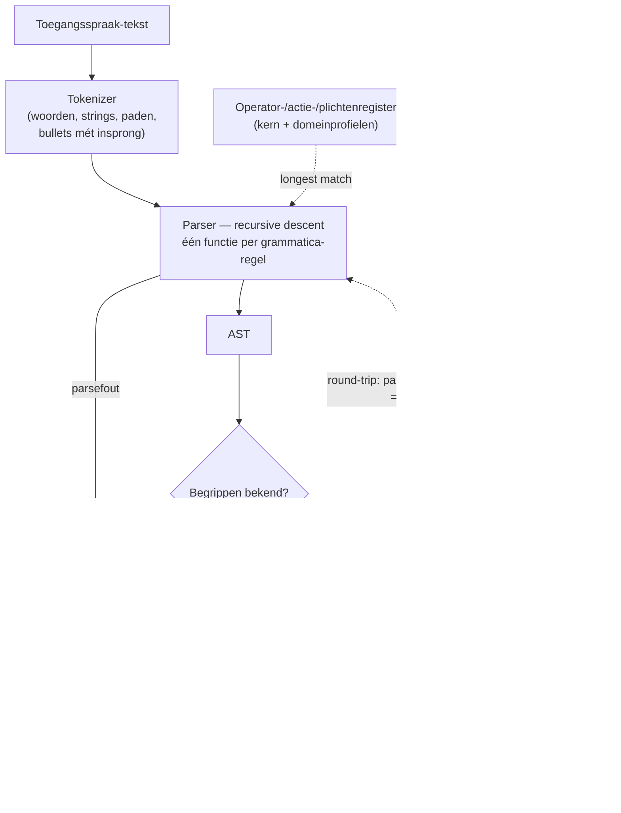

# Claude Code-sessie-export

> **Let op:** export van een **Claude Code**-sessie. Gebruiker- en assistentteksten zijn letterlijk overgenomen; tool-aanroepen staan als compacte `🔧`-annotaties (hun output niet); interne redeneerblokken weggelaten.
>
> - **Datum:** 2026-07-22
> - **Sessie-id:** `7826109e-ab4a-4e69-bece-03b5845659b3`
> - **Branch:** `main`

---

## 👤 Gebruiker (1)

@/d:/Git/Bitemporal_2026/bitemp_register_v06/docs/plans/ODRL-Register-Toegangsbeleid.md @/d:/Git/Bitemporal_2026/bitemp_register_v06/docs/plans/2026-04-12 ODRL based Autorisatie Register (Claude).rtf

Ik ben al een tijd aan het denken, samen met de werkgroep FTV / Register Toegangsbeleid, aan een menselijk leesbare policy taal, die de dekking van XACML/OPA/Cedar en ODRL heeft, maar dus wel te snappen is door leken.

Dat vergt een definitie en een soort interpreter. Je maakt in feite een klein policy-programmeertaaltje, zonder moeilijke woorden. Hoogstens de dingen als subject, object, activiteit of actie (bekijken, veranderen, registreren, opvoeren, afvoeren, corrigeren), gegevenstype, gegevens, en werkwoorden als mogen en ontkenning daarvan ('mag niet').

Over subjecten en objecten (= gegevens / -typen) kun je praten met behulp van hun eigenschappen (attributen, of dieper: natuurlijk-persoon.naam.achternaam).

Er moeten wat functies en operatoren beschikbaar zijn, als = <>, bevat, begint met. (In het geo-domein kunnen dat geo-functies zijn: valt deels of geheel binnen e.d.; in andere domeinen andere, dus uitbreidbaar).

Zou je daar over na willen denken een iets voorstellen dat aan deze requirements voldoet?

**🤖 Claude:**

Ik lees eerst de twee aangehaalde documenten om aan te sluiten bij wat er al ligt.
> 🔧 `Read` — d:\Git\Bitemporal_2026\bitemp_register_v06\docs\plans\ODRL-Register-Toegangsbeleid.md
> 🔧 `Bash` — List plans directory with file sizes
> 🔧 `Bash` — Scan RTF chat export for passages about human readability / policy language
> 🔧 `Grep` — leesbaar|leken|begrijpel|klare taal|natuurlijke taal
> 🔧 `Read` — d:\Git\Bitemporal_2026\bitemp_register_v06\docs\plans\Whitepaper-Register-Toegangsbeleid.md
> 🔧 `Write` — d:\Git\Bitemporal_2026\bitemp_register_v06\docs\plans\2026-07-22 Klare-taal Toegangsbeleid — Toegangsspraak...

**🤖 Claude:**

Ik heb er goed over nagedacht en een concreet voorstel uitgewerkt: **Toegangsspraak** (werktitel), een Nederlandstalige *gecontroleerde* beleidstaal die als leesbare laag bovenop jullie bestaande ODRL-ontwerp ligt. Het volledige ontwerp staat in [2026-07-22 Klare-taal Toegangsbeleid — Toegangsspraak (ontwerp).md](bitemp_register_v06/docs/plans/2026-07-22%20Klare-taal%20Toegangsbeleid%20—%20Toegangsspraak%20(ontwerp).md).

De kern van het voorstel:

**Geen vrije taal, maar een gecontroleerde taal (CNL).** Vrij Nederlands is ambigu ("en/of", zwevend "niet"). De oplossing: een klein aantal vaste zinspatronen waarbij elke zin precies één betekenis heeft en 1-op-1 afbeeldt op de ODRL-subset die je al hebt ontworpen. Eén kernzin draagt de hele taal:

> *\<wie\> **mag** \<gegevens\> \<actie\> — of **mag niet** — [ **als** \<voorwaarden\> ] [ **waarbij:** \<verplichtingen\> ]*

Bijvoorbeeld:

```
Een schuldhulpverlener mag de inkomensgegevens bekijken
als aan alle volgende voorwaarden is voldaan:
  - het doel van de aanvraag is "schuldhulpverlening";
  - er is een lopend dossier voor de betrokkene;
waarbij: elke raadpleging wordt vastgelegd in het logboek.
```

De belangrijkste ontwerpkeuzes:

- **En/of-ambiguïteit opgelost via het RegelSpraak-patroon**: bij meerdere voorwaarden is de opsommingsvorm verplicht ("aan alle / aan ten minste één van / aan precies één van de volgende voorwaarden is voldaan"), nestbaar voor elke boolese combinatie. Dit leen ik bewust van RegelSpraak/ALEF (Belastingdienst) — bewezen prior art voor Nederlandstalige CNL, samen met SBVR Structured Dutch en Catala.
- **Attribuutpaden met vaste ankerwoorden**: voorwaarden zijn `<pad of waarde> <vergelijking> <pad of waarde>`, met leesbare ankers *de aanvrager*, *de gegevens*, *de betrokkene*, *de aanvraag* (die netjes op de AuthZEN/XACML-categorieën mappen). Ook pad-tegen-pad kan: "de locatie van de gegevens valt binnen het werkgebied van de aanvrager".
- **Uitbreidbaar operator-register**: kernset (`is`, `is niet`, `bevat`, `begint met`, `ligt tussen`, …) plus domeinprofielen (geo: `valt geheel binnen`, `overlapt`, `ligt binnen … meter van`) — de grammatica kent alleen het slot "vergelijking", de invulling komt uit het register. Dit is jullie ODRL-Profile-mechanisme doorgetrokken naar de taal.
- **De MetaRegistry doet de typebewaking**: paden en veldtypen komen uit de schema-API, dus de interpreter weigert onzin als `geboortedatum begint met "A"` — met een foutmelding die zelf ook in klare taal is.
- **Round-trip als harde garantie**: de tekst is de bron, ODRL de canonieke schaduw (beide bitemporeel geregistreerd). Er komt ook een renderer ODRL → tekst, zodat *alles* in het register leesbaar is, ongeacht hoe het binnenkwam. De bestaande fase-3-vertalers (ODRL → Rego/Cedar) blijven ongewijzigd — de taal lift daar gratis op mee.
- **Schrijven gebeurt begeleid**: de bekende CNL-zwakte is dat schrijven moeilijker is dan lezen. Daarom een gestructureerde editor als Omnium Studio-activiteit — zinsjablonen met slots, autocomplete uit de schema-API. Leken lezen volzinnen; auteurs klikken en vullen in.
- **Conflictregel vast en zelf leesbaar**: "Wat niet uitdrukkelijk is toegestaan, mag niet; een verbod gaat altijd vóór een toestemming." Dat ene besluit schrapt de hele combinatie-algoritme-complexiteit die XACML onleesbaar maakt.

Het document bevat verder een compacte EBNF-grammatica (LL(1)-parseerbaar, dus goed te bouwen met bv. chevrotain in de v06-stack), een dekkingsmatrix tegen ODRL/XACML/OPA/Cedar, toetsvoorbeelden (geo, verbod-met-uitzondering, correctie-met-verantwoording), en wat bewust búiten v1 blijft (vrije rekenkunde, recursie, delegatie) met een gemarkeerd CEL-`expressie`-blok als expert-ontsnappingsluik.

Grootste openstaande punt om vroeg af te bakenen: existentie-voorwaarden zoals "er is een lopend dossier" — die vergen een PIP-bevraging en zijn de moeilijkste categorie voor v1. Als je wilt, werk ik als vervolgstap de parser + renderer met round-trip-tests uit als klein TS-pakket, of eerst de plicht-subgrammatica.

---

## 👤 Gebruiker (2)

Ja, mooi!

Wat betreft "De MetaRegistry doet de typebewaking": autocomplete en drag en drop behoren tot toekomstige mogelijkheden, denk ik. We hebben al een soort autocomplete in de CEL editor en drag en drop in de DMN editor gemaakt. Dus vanuit het metamodel (de projectboom) gegeventypen droppen. 

Is de ietwat formele NatuurlijkPersoon.naam.achternaam of shorthand NP.achternaam toegestaan, of maken we daar "de achternaam van een natuurlijk persoon" van? Dat laatste is eigenlijk mooier. Dan is het woord `van` een grammatica element geworden, dat aggregatie / compositie in het model omgekeerd volgt.

Wil je een begin maken? Dat mag in de (nu inactieve) Toegangsverlening activiteit in Omnium.

**🤖 Claude:**

Mooi! Eens met je "van"-intuïtie — daar kom ik zo op terug. Eerst verken ik de codebase: de Toegangverlening-activiteit, de Studio-activiteitenstructuur, en de CEL-editor (voor de autocomplete-patronen).
> 🔧 `Agent` — Verken Studio Toegangverlening activiteit
> 🔧 `ToolSearch`
> 🔧 `Read` — d:\Git\Bitemporal_2026\bitemp_register_v06\web\vite\src\studio\activities\dmnActivity.jsx
> 🔧 `TodoWrite` — takenlijst bijgewerkt
> 🔧 `Read` — d:\Git\Bitemporal_2026\bitemp_register_v06\web\vite\src\studio\activities\index.jsx
> 🔧 `PowerShell` — Create feature branch feat/toegangsspraak
> 🔧 `Read` — d:\Git\Bitemporal_2026\bitemp_register_v06\web\vite\src\shared\celEvaluator.test.js
> 🔧 `Write` — d:\Git\Bitemporal_2026\bitemp_register_v06\web\vite\src\toegangsspraak\operatoren.js
> 🔧 `Write` — d:\Git\Bitemporal_2026\bitemp_register_v06\web\vite\src\toegangsspraak\woorden.js
> 🔧 `Write` — d:\Git\Bitemporal_2026\bitemp_register_v06\web\vite\src\toegangsspraak\parser.js
> 🔧 `Edit` — d:\Git\Bitemporal_2026\bitemp_register_v06\web\vite\src\toegangsspraak\parser.js
> 🔧 `Edit` — d:\Git\Bitemporal_2026\bitemp_register_v06\web\vite\src\toegangsspraak\parser.js
> 🔧 `Edit` — d:\Git\Bitemporal_2026\bitemp_register_v06\web\vite\src\toegangsspraak\parser.js
> 🔧 `Write` — d:\Git\Bitemporal_2026\bitemp_register_v06\web\vite\src\toegangsspraak\renderer.js
> 🔧 `TodoWrite` — takenlijst bijgewerkt
> 🔧 `Write` — d:\Git\Bitemporal_2026\bitemp_register_v06\web\vite\src\toegangsspraak\odrl.js
> 🔧 `Write` — d:\Git\Bitemporal_2026\bitemp_register_v06\web\vite\src\toegangsspraak\index.js
> 🔧 `Write` — d:\Git\Bitemporal_2026\bitemp_register_v06\web\vite\src\toegangsspraak\voorbeeld.js
> 🔧 `Write` — d:\Git\Bitemporal_2026\bitemp_register_v06\web\vite\src\toegangsspraak\toegangsspraak.test.js

**🤖 Claude:**

Tests draaien:
> 🔧 `PowerShell` — Run toegangsspraak unit tests
> 🔧 `TodoWrite` — takenlijst bijgewerkt
> 🔧 `Grep` — export|FIELDREF_MIME
> 🔧 `Grep` — import.*prism|from "react-simple-code-editor"|highlight
> 🔧 `Read` — d:\Git\Bitemporal_2026\bitemp_register_v06\web\vite\src\umleditor\components\panels\ExpressieEditor.jsx
> 🔧 `Read` — d:\Git\Bitemporal_2026\bitemp_register_v06\web\vite\src\modelpicker\ModelPicker.jsx

**🤖 Claude:**

Alles duidelijk. Nu de activiteit zelf:
> 🔧 `Write` — d:\Git\Bitemporal_2026\bitemp_register_v06\web\vite\src\studio\activities\toegangActivity.jsx
> 🔧 `Edit` — d:\Git\Bitemporal_2026\bitemp_register_v06\web\vite\src\studio\activities\index.jsx
> 🔧 `Edit` — d:\Git\Bitemporal_2026\bitemp_register_v06\web\vite\src\studio\activities\index.jsx
> 🔧 `Edit` — d:\Git\Bitemporal_2026\bitemp_register_v06\web\vite\src\studio\activities\index.jsx

**🤖 Claude:**

Nu de volledige testsuite en een productie-build om te controleren dat alles integreert:
> 🔧 `PowerShell` — Run full unit test suite
> 🔧 `Bash` — Run full unit test suite via bash
> 🔧 `Bash` — Run all unit tests with expanded glob
> 🔧 `Bash` — Vite production build to verify integration
> 🔧 `Bash` — Check build output for errors
> 🔧 `Grep` — Toegang|toegang
> 🔧 `Edit` — d:\Git\Bitemporal_2026\bitemp_register_v06\docs\STUDIO.md
> 🔧 `Edit` — d:\Git\Bitemporal_2026\bitemp_register_v06\docs\plans\2026-07-22 Klare-taal Toegangsbeleid — Toegangsspraak...
> 🔧 `Edit` — d:\Git\Bitemporal_2026\bitemp_register_v06\docs\plans\2026-07-22 Klare-taal Toegangsbeleid — Toegangsspraak...
> 🔧 `Bash` — Check for soft hyphen in doc
> 🔧 `Grep` — searchParams|activiteit=|URLSearchParams
> 🔧 `Bash` — Check for soft hyphen in doc
> 🔧 `Grep` — persist|localStorage|activeId
> 🔧 `Bash` — Locate AssetCollection line and count soft hyphens in doc
> 🔧 `Edit` — d:\Git\Bitemporal_2026\bitemp_register_v06\docs\plans\2026-07-22 Klare-taal Toegangsbeleid — Toegangsspraak...
> 🔧 `Read` — d:\Git\Bitemporal_2026\bitemp_register_v06\web\vite\src\studio\useStudioStore.js
> 🔧 `Bash` — Start Vite dev server on port 5175 in background
> 🔧 `Write` — C:\Users\User\AppData\Local\Temp\claude\d--Git-Bitemporal-2026\7826109e-ab4a-4e69-bece-03b5845659b3\scratch...
> 🔧 `Bash` — Run Playwright smoke test of Toegangverlening activity
> 🔧 `Bash` — Run smoke test from web/vite with local Playwright
> 🔧 `Read` — C:\Users\User\AppData\Local\Temp\claude\d--Git-Bitemporal-2026\7826109e-ab4a-4e69-bece-03b5845659b3\scratch...
> 🔧 `Edit` — C:\Users\User\AppData\Local\Temp\claude\d--Git-Bitemporal-2026\7826109e-ab4a-4e69-bece-03b5845659b3\scratch...
> 🔧 `Bash` — Re-run smoke test with correct base URL
> 🔧 `Read` — C:\Users\User\AppData\Local\Temp\claude\d--Git-Bitemporal-2026\7826109e-ab4a-4e69-bece-03b5845659b3\scratch...
> 🔧 `PowerShell` — Stop own Vite dev server on port 5175 (process tree)
> 🔧 `TodoWrite` — takenlijst bijgewerkt
> 🔧 `PowerShell` — Show working tree changes

**🤖 Claude:**

Klaar — het begin staat, en het werkt. Alle 344 unit tests slagen (waarvan 11 nieuwe), de build is groen, en ik heb de activiteit in de browser gecontroleerd: de Toegangsspraak-editor draait in de Toegangverlening-activiteit (nog steeds CONCEPT, alleen via *Ga naar*), op branch `feat/toegangsspraak` (niet gecommit, zoals afgesproken).

**Het "van"-besluit** — ik heb je voorstel overgenomen, met één nuance:

- **De van-vorm is de canonieke leesvorm**: *"de achternaam van de naam van een natuurlijk persoon"*. Het woord "van" is een grammatica-element dat de compositie in het metamodel omgekeerd volgt (blad → wortel), en werkt ook op de ankers: *het doel **van** de aanvraag*, *het werkgebied **van** de aanvrager*.
- **Het pad blijft de canonieke interne vorm** (AST, ODRL `nlgov:registerpad`). De parser accepteert `NatuurlijkPersoon.Naam.achternaam` als technische shorthand — precies wat drag & drop uit de projectboom oplevert — maar de renderer schrijft **altijd** de van-vorm terug. Zo is alles in het register gegarandeerd leesbaar, hoe het ook binnenkwam.
- Voor later (met metamodel-resolutie): de keten mag verkort worden zolang die eenduidig is — *"de achternaam van een natuurlijk persoon"* mag "de naam" overslaan als er maar één `achternaam` onder `NatuurlijkPersoon` bestaat. Vastgelegd in §4.7 van het [ontwerpdocument](bitemp_register_v06/docs/plans/2026-07-22%20Klare-taal%20Toegangsbeleid%20—%20Toegangsspraak%20(ontwerp).md).

**Wat er gebouwd is:**

- [Taalkern `toegangsspraak/`](bitemp_register_v06/web/vite/src/toegangsspraak/) — tokenizer + handgeschreven recursive-descent parser (zelfde idioom als de CEL-evaluator, geen nieuwe dependency), renderer naar de canonieke van-vorm, en de ODRL JSON-LD-mapping op de NLGov-subset. Dekt: kop (geldigheid/grondslag/doel), Begrippen (rolgroepen en gegevensverzamelingen), regels met `mag`/`mag niet`, geneste opsommingen (en/of/precies één), plichten, en het uitbreidbare operator-register — het geo-profiel zit erin als registreerbaar voorbeeld.
- [Studio-activiteit `toegangActivity.jsx`](bitemp_register_v06/web/vite/src/studio/activities/toegangActivity.jsx) — naar het DMN-patroon: sidebar met de **ModelPicker** (klik of sleep een veld en de van-vorm wordt op de cursor ingevoegd), editor met syntax-highlighting en een foutenpaneel in klare taal, tab "Canonieke vorm" als leesweergave, ODRL live in de inspector, en een Beleid-menu (voorbeeld laden, herformatteren, ODRL-export).
- [Tests](bitemp_register_v06/web/vite/src/toegangsspraak/toegangsspraak.test.js) — inclusief de harde round-trip-eis uit het ontwerp: `render(parse(t))` is exact het canonieke voorbeeld, en `parse(render(b))` is structureel gelijk aan `b`, ook voor geneste blokken.
- Docs: §4.7 (van-besluit) en §12 (implementatiestatus) in het ontwerpdoc, en de activiteitentabel in [STUDIO.md](bitemp_register_v06/docs/STUDIO.md).

Autocomplete en de begeleide slot-editor heb ik conform je opmerking als vervolgstap gemarkeerd (§12) — de drop uit de projectboom werkt al wel. Logische volgende stap is de metamodel-typebewaking via de schema-API (operator × veldtype, plus de keten-verkorting), dan wordt de 404 in de sidebar bij een draaiende backend meteen zinvol. Ik zag trouwens dat je chat-backupscript intussen een export van dit gesprek heeft klaargezet in `docs/ai-chats/exports/` — die kan gewoon mee als je commit.

---

## 👤 Gebruiker (3)

Mooi!

Ik probeer een beetje.

Ik type "   Mail is de email van de persoonscontactgegevens van een persoon."
-> fout: Regel 9: Een begrip begint met Een, De of Het. (gevonden: "Mail")

Snap ik. Ik heb dan net een term gevonden die onbepaald is. "Mail" is mail in het algemeen. Net als water of lucht.

In begrippen spreek je wel vaker over iets onbepaalds als term. Schuldhulpverlening is het ....
Inkomensgegevens zijn (zonder de eigenlijk) (die definitie is overigens incongruent: "De inkomensgegevens *zijn*: *het inkomen* van een natuurlijk persoon.")

Wat denk je?

- Hoe is het nu eigenlijk gemaakt? (Taal)
- Kun je uitleggen hoe de interpreter werkt? (In taal of met een schema. Activity Diagram? :-) )

**🤖 Claude:**

Goeie vangst, twee keer zelfs. Mijn beoordeling: je hebt gelijk — en ik pas het meteen aan, want het raakt de grammatica op een fundamenteel punt:

1. **Onbepaalde termen in definities zijn gangbaar Nederlands** ("Mail is …", "Inkomensgegevens zijn …", net als water of lucht). Het verplichte lidwoord was een te strenge keuze van mij; in het *definiendum* (het te definiëren begrip) hoort het optioneel te zijn. In *verwijzingen mét van-keten* blijft het lidwoord verplicht, want daar is het een grammaticaal anker.
2. **De incongruentie in mijn voorbeeld klopt**: "De inkomensgegevens *zijn*: *het inkomen* van …" — meervoud gelijkgesteld aan enkelvoud. Dat los ik op door "alle gegevens van" ook een volledige van-keten te laten nemen: *"Inkomensgegevens zijn: alle gegevens van het inkomen van een natuurlijk persoon."* — congruent én het levert meteen het nettere groepspad `NatuurlijkPersoon.Inkomen` op.

Ik maak daarbij ook de dubbele punt na "is/zijn" optioneel bij het parsen (jouw zin had er geen); de canonieke vorm houdt hem wel — dat is precies waar de herformatteer-functie voor is. Eerst de parser:
> 🔧 `Edit` — d:\Git\Bitemporal_2026\bitemp_register_v06\web\vite\src\toegangsspraak\parser.js
> 🔧 `Edit` — d:\Git\Bitemporal_2026\bitemp_register_v06\web\vite\src\toegangsspraak\parser.js
> 🔧 `Edit` — d:\Git\Bitemporal_2026\bitemp_register_v06\web\vite\src\toegangsspraak\parser.js
> 🔧 `Edit` — d:\Git\Bitemporal_2026\bitemp_register_v06\web\vite\src\toegangsspraak\parser.js

**🤖 Claude:**

Nu renderer, ODRL-mapping en het congruente voorbeeld:
> 🔧 `Edit` — d:\Git\Bitemporal_2026\bitemp_register_v06\web\vite\src\toegangsspraak\renderer.js
> 🔧 `Edit` — d:\Git\Bitemporal_2026\bitemp_register_v06\web\vite\src\toegangsspraak\renderer.js
> 🔧 `Edit` — d:\Git\Bitemporal_2026\bitemp_register_v06\web\vite\src\toegangsspraak\odrl.js
> 🔧 `Edit` — d:\Git\Bitemporal_2026\bitemp_register_v06\web\vite\src\toegangsspraak\odrl.js
> 🔧 `Edit` — d:\Git\Bitemporal_2026\bitemp_register_v06\web\vite\src\toegangsspraak\voorbeeld.js
> 🔧 `Edit` — d:\Git\Bitemporal_2026\bitemp_register_v06\web\vite\src\toegangsspraak\index.js

**🤖 Claude:**

Nu de tests uitbreiden met precies jouw zin en de congruentie-check:
> 🔧 `Edit` — d:\Git\Bitemporal_2026\bitemp_register_v06\web\vite\src\toegangsspraak\toegangsspraak.test.js
> 🔧 `Edit` — d:\Git\Bitemporal_2026\bitemp_register_v06\web\vite\src\toegangsspraak\toegangsspraak.test.js
> 🔧 `Bash` — Run toegangsspraak tests after grammar change

**🤖 Claude:**

Alle 13 tests groen. Volledige suite ter controle:
> 🔧 `Bash` — Run full unit test suite
> 🔧 `Edit` — d:\Git\Bitemporal_2026\bitemp_register_v06\docs\plans\2026-07-22 Klare-taal Toegangsbeleid — Toegangsspraak...
> 🔧 `Edit` — d:\Git\Bitemporal_2026\bitemp_register_v06\docs\plans\2026-07-22 Klare-taal Toegangsbeleid — Toegangsspraak...
> 🔧 `Edit` — d:\Git\Bitemporal_2026\bitemp_register_v06\docs\plans\2026-07-22 Klare-taal Toegangsbeleid — Toegangsspraak...

**🤖 Claude:**

Klaar — jouw zin parset nu, en het voorbeeldbeleid is congruent gemaakt. Alle 346 tests slagen (13 in de taalmodule, waaronder letterlijk jouw Mail-zin). Wat er veranderd is, en dan je twee vragen.

## Wat ik ervan denk (en gedaan heb)

Je hebt gelijk, op beide punten:

- **Onbepaalde termen in definities** — het lidwoord in het definiendum is nu optioneel: *"Mail is de email van de persoonscontactgegevens van een persoon."* parset, en ook de verwijzing mag kaal: *"… mag mail bekijken"*. In **van-ketens blijft het lidwoord verplicht** — daar is het een grammaticaal anker dat de groepen scheidt. Eén prijs: een begripsnaam kan zelf de woorden "is" of "zijn" niet bevatten (de naam eindigt bij het eerste "is"/"zijn"). De dubbele punt na is/zijn is bij het parsen nu ook optioneel; de canonieke vorm zet hem er wél — dat is precies waar *Herformatteer* voor is.
- **De incongruentie** — opgelost door "alle gegevens van" een volledige van-keten te laten nemen: *"Inkomensgegevens zijn: alle gegevens van het inkomen van een natuurlijk persoon."* Meervoud = meervoud, en het levert een netter groepspad op: `NatuurlijkPersoon.Inkomen` (alle segmenten hoofdletter, want er is geen veld-blad). Vastgelegd in §4.2 van het [ontwerpdoc](bitemp_register_v06/docs/plans/2026-07-22%20Klare-taal%20Toegangsbeleid%20—%20Toegangsspraak%20(ontwerp).md).

## Hoe is het gemaakt?

Plain **JavaScript (ESM), nul dependencies** — bewust hetzelfde idioom als jullie `celEvaluator.js`: een handgeschreven tokenizer plus recursive-descent parser, geen parser-generator. Vijf kleine modules in [web/vite/src/toegangsspraak/](bitemp_register_v06/web/vite/src/toegangsspraak/):

| Module | Rol |
|---|---|
| [woorden.js](bitemp_register_v06/web/vite/src/toegangsspraak/woorden.js) | taalhulpjes: CamelCase ↔ woorden, lidwoorden, NL-datums |
| [operatoren.js](bitemp_register_v06/web/vite/src/toegangsspraak/operatoren.js) | de registers: vergelijkingen, handelingen, plichten (uitbreidbaar) |
| [parser.js](bitemp_register_v06/web/vite/src/toegangsspraak/parser.js) | tokenizer + parser → AST, + validatie |
| [renderer.js](bitemp_register_v06/web/vite/src/toegangsspraak/renderer.js) | AST → canonieke tekst (van-vorm) |
| [odrl.js](bitemp_register_v06/web/vite/src/toegangsspraak/odrl.js) | AST → ODRL JSON-LD |

## Hoe werkt de interpreter?

Strikt genomen is het een **vertaler**, geen interpreter: hij voert geen beleid uit (dat doet straks de PDP), hij vertaalt tekst ↔ AST ↔ ODRL. In stappen:

1. **Tokenizer** knipt de tekst in woorden, strings, getallen, paden en leestekens. Bijzonder: opsommings-streepjes krijgen hun **insprong** mee als data — daar hangt later de nesting aan.
2. **Parser** — recursive descent: elke grammatica-regel is één gewone functie die tokens consumeert en een AST-knoop teruggeeft (`parseBeleid → parseRegel → parseVoorwaardeblok → parseVoorwaarde → parseVerwijzing`, enz.). De grammatica is zo ontworpen dat een paar woorden vooruitkijken altijd volstaat om te weten welke regel geldt. Operatoren zitten **niet in de grammatica maar in het register**: op elk voorwaarde-punt vraagt de parser "begint hier een operator-zin?" met langste-eerst-matching (*is kleiner dan* wint van *is*) — daarom kan het geo-profiel operatoren toevoegen zonder één regel grammatica te wijzigen. Een van-keten wordt geparst als groepen gescheiden door "van"; de laatste groep is de basis (anker of type), en het pad ontstaat door de keten om te draaien — "van" volgt de compositie omgekeerd, zoals je zei.
3. **Fout of AST**: elke misser geeft één fout in klare taal met regel en kolom; daarna checkt de validatie nog of gebruikte begrippen gedefinieerd zijn.
4. Uit de AST komen twee gelijkwaardige weergaven: de **renderer** (canonieke van-vorm — met als geteste wet: `parse(render(b)) = b`) en de **ODRL-mapping** (NLGov-subset, voor het register en straks de Rego/Cedar-vertalers).



Dit schema staat ook in het ontwerpdoc (§12.1), samen met de drie ontwerpkeuzes die het simpel houden: LL(1)-achtige grammatica, operatoren-als-data, en nesting via insprong. Als je verder experimenteert: het volgende dat gaat knellen is vermoedelijk de vaste woordvolgorde in voorwaarden (bijzinsvolgorde "…als de locatie binnen het werkgebied *valt*" wordt nog niet geaccepteerd) — dat staat al als open punt genoteerd.

---

## 👤 Gebruiker (4)

ik zie de flowchart niet. Staat ie ook in het doc?

**🤖 Claude:**

Ja — de flowchart staat in het doc, in **§12.1 "Hoe de interpreter werkt"** van [2026-07-22 Klare-taal Toegangsbeleid — Toegangsspraak (ontwerp).md](bitemp_register_v06/docs/plans/2026-07-22%20Klare-taal%20Toegangsbeleid%20—%20Toegangsspraak%20(ontwerp).md), als mermaid-blok (net als de diagrammen in het ODRL-plan). De ingebouwde VS Code markdown-preview rendert mermaid alleen met een extensie ("Markdown Preview Mermaid Support"); op GitHub rendert hij vanzelf zodra de branch gepusht is.

Zodat je hem nu meteen kunt zien, zet ik hem ook even op een artifact-pagina:
> 🔧 `Skill` — artifact-design
> 🔧 `Write` — C:\Users\User\AppData\Local\Temp\claude\d--Git-Bitemporal-2026\7826109e-ab4a-4e69-bece-03b5845659b3\scratch...
> 🔧 `Read` — d:\Git\Bitemporal_2026\bitemp_register_v06\web\vite\src\modelpicker\modelTree.js
> 🔧 `Edit` — d:\Git\Bitemporal_2026\bitemp_register_v06\web\vite\src\toegangsspraak\operatoren.js
> 🔧 `Write` — d:\Git\Bitemporal_2026\bitemp_register_v06\web\vite\src\toegangsspraak\metamodel.js

**🤖 Claude:**

ODRL laten meeliften op de geresolvede paden:
> 🔧 `Edit` — d:\Git\Bitemporal_2026\bitemp_register_v06\web\vite\src\toegangsspraak\odrl.js
> 🔧 `Edit` — d:\Git\Bitemporal_2026\bitemp_register_v06\web\vite\src\toegangsspraak\odrl.js
> 🔧 `Edit` — d:\Git\Bitemporal_2026\bitemp_register_v06\web\vite\src\toegangsspraak\index.js
> 🔧 `TodoWrite` — takenlijst bijgewerkt

**🤖 Claude:**

Tests voor de metamodel-laag:
> 🔧 `Write` — d:\Git\Bitemporal_2026\bitemp_register_v06\web\vite\src\toegangsspraak\metamodel.test.js
> 🔧 `Edit` — d:\Git\Bitemporal_2026\bitemp_register_v06\web\vite\src\toegangsspraak\metamodel.js
> 🔧 `Edit` — d:\Git\Bitemporal_2026\bitemp_register_v06\web\vite\src\toegangsspraak\metamodel.js

**🤖 Claude:**

Ook exporteren en testen:
> 🔧 `Edit` — d:\Git\Bitemporal_2026\bitemp_register_v06\web\vite\src\toegangsspraak\index.js
> 🔧 `Edit` — d:\Git\Bitemporal_2026\bitemp_register_v06\web\vite\src\toegangsspraak\metamodel.test.js
> 🔧 `Edit` — d:\Git\Bitemporal_2026\bitemp_register_v06\web\vite\src\toegangsspraak\metamodel.test.js
> 🔧 `Bash` — Run toegangsspraak + metamodel tests
> 🔧 `Bash` — Run toegangsspraak + metamodel tests with explicit paths
> 🔧 `Edit` — d:\Git\Bitemporal_2026\bitemp_register_v06\web\vite\src\toegangsspraak\metamodel.test.js
> 🔧 `Bash` — Re-run toegangsspraak + metamodel tests
> 🔧 `Write` — d:\Git\Bitemporal_2026\bitemp_register_v06\web\vite\src\studio\activities\toegangActivity.jsx
> 🔧 `Read` — d:\Git\Bitemporal_2026\bitemp_register_v06\web\vite\src\modelpicker\useSchemaModel.js
> 🔧 `Bash` — Run full tests and production build
> 🔧 `Write` — C:\Users\User\AppData\Local\Temp\claude\d--Git-Bitemporal-2026\7826109e-ab4a-4e69-bece-03b5845659b3\scratch...
> 🔧 `Bash` — Start dev server and run autocomplete smoke test
> 🔧 `Edit` — d:\Git\Bitemporal_2026\bitemp_register_v06\web\vite\src\studio\activities\toegangActivity.jsx
> 🔧 `Edit` — d:\Git\Bitemporal_2026\bitemp_register_v06\web\vite\src\studio\activities\toegangActivity.jsx
> 🔧 `Bash` — Re-run autocomplete smoke test

**🤖 Claude:**

Tab-aanvullen werkt nu. Even het screenshot bekijken en daarna opruimen en docs bijwerken:
> 🔧 `Read` — C:\Users\User\AppData\Local\Temp\claude\d--Git-Bitemporal-2026\7826109e-ab4a-4e69-bece-03b5845659b3\scratch...
> 🔧 `TodoWrite` — takenlijst bijgewerkt
> 🔧 `PowerShell` — Stop own Vite dev server on port 5175
> 🔧 `Edit` — d:\Git\Bitemporal_2026\bitemp_register_v06\docs\plans\2026-07-22 Klare-taal Toegangsbeleid — Toegangsspraak...
> 🔧 `Edit` — d:\Git\Bitemporal_2026\bitemp_register_v06\docs\plans\2026-07-22 Klare-taal Toegangsbeleid — Toegangsspraak...
> 🔧 `Edit` — d:\Git\Bitemporal_2026\bitemp_register_v06\docs\plans\2026-07-22 Klare-taal Toegangsbeleid — Toegangsspraak...

**🤖 Claude:**

Klaar — punten 1 en 2 zijn af, inclusief je "achterstevoren"-idee van tussendoor. Alle 355 tests slagen (22 in de taalmodule + 9 nieuwe metamodel-tests), de build is groen, en in de browser gecontroleerd: suggestie-chips verschijnen tijdens het typen en Tab vult aan.

**Punt 1 — metamodel-typebewaking + keten-verkorting** ([metamodel.js](bitemp_register_v06/web/vite/src/toegangsspraak/metamodel.js)):

- **Keten-resolutie met verkorting**: "de achternaam van een natuurlijk persoon" vindt `NatuurlijkPersoon.naam.achternaam` zolang dat eenduidig is; bij dubbelzinnigheid ("de datum van een natuurlijk persoon" — geboorte én overlijden hebben er een) eist hij de volledige keten en somt de kandidaten op. De resolutie levert meteen de échte schrijfwijze van het pad (de casing van het metamodel wint — de eerdere `Inkomen`/`inkomen`-wart is daarmee weg), en de ODRL-uitvoer gebruikt die geresolvede paden.
- **Typebewaking in klare taal**: operator × veldtype (*"begint met" kan alleen met tekst; "de datum van de geboorte…" is een datum. Gebruik bijvoorbeeld "is kleiner dan"*), literal × veldtype (datum vergeleken met een getal), en enum-bewaking (foute waarde → de toegestane waarden in de melding). In de editor verschijnen deze als amber "Controle"-regels, niet-blokkerend naast de rode parsefouten; de statusregel telt ze mee.

**Punt 2 — autocomplete, twee kanten op**:

- *Vooruit*: een woord typen ("achterna…") stelt van-vormen voor — kort ("de achternaam van een natuurlijk persoon") waar eenduidig, anders de volledige keten. Ook begrippen, handelingen, operator-zinnen en plichten vullen aan.
- *Achterstevoren*, jouw aanvulling: typ "de naam van " en je krijgt alle bases die zo'n veld of gegevensgroep hebben. Het mooie is dat dit exact dezelfde zoekvraag bleek als de keten-verkorting, andersom gesteld — bij een dubbelzinnig blad krijg je per kandidaat de onderscheidende rest ("de geboorte van een natuurlijk persoon" / "de overlijden van…").
- UI: suggestie-chips onder de tekst, **Tab** vult de eerste aan (en blijft gewoon inspringen als er geen suggesties zijn), klikken kan ook, Esc sluit.

Over je opmerking bij het canoniek model: `metamodel.js` is bewust puur — je stopt er een veldenlijst in en autocomplete + controle beperken zich vanzelf tot die doorsnede. Het domein-filter, of straks een andere doorsnede van de universele projectboom (of een heel ander model), is dus alleen een kwestie van een andere lijst in `maakVeldIndex` stoppen; genoteerd als vervolgpunt in §12. Alles staat gedocumenteerd in §12.0 van het ontwerpdoc, op branch `feat/toegangsspraak` (niet gecommit).

Wat er van de lijst overblijft: existentie-voorwaarden ("er is een lopend dossier…", het lastigste ontwerppunt — vergt een PIP-bevraging), de nette plicht-subgrammatica, en de bitemporele opslag + vertalers (whitepaper fase 2/3). Eén kleinigheid om te weten: lidwoorden van GE-rollen komen uit een woordenlijstje, dus de suggestie zegt nu "de overlijden" — het metamodel kent geen lidwoorden; dat zou een metadata-veldje kunnen worden.

---

## 👤 Gebruiker (5)

# keten verkorting
hier (img) " de achternaam van de namen van een natuurlijk persoon" zou de AC al (van de namen) tussen haakjes kunnen zetten om aan te geven dat die niet hoeven. Hoe zou je kunnen kiezen tussen de lange of de korte versie?

# groeperings/ soortindicatie in de tekst
zie img2
`Een schuldhulpverlener` mag `de achternaam van de namen van een natuurlijk persoon` niet `exporteren`
    als `de taal van een trefwoord` is niet "nl".

Een soort zinsontleding, of wat elke taal heeft: kleurtjes voor de verschillende soorten elementen (gegevenstype, operatie, operator, operand, werkwoord / activiteit - zo ongeveer) [ achter een switch misschien ] zouden de tekst duidelijker maken.

Hover over een gegevenstype ( `de achternaam van de namen van een natuurlijk persoon` ) en ze groeperen duidelijk (boxje eromheen ofzo). Rechtsklik of dubbelklik op ze en ze tonen waar in de modelboom ze staan.

Kan dat?

# volgorde
Nederlands is daarin een beetje raar. Delen van werkwoorden kunnen los of vast zitten (stof-zuigen kan niet los (ik zuig stof), vast-pakken wel (ik pak vast)). En meer van dat. Met name in condities (als...) draait het om.

Hier is er al een: 
als `de taal van een trefwoord` is niet "nl".
Moet zijn:
Als de taal van een trefwoord niet "nl" is.

Het is echter wel: 
de taal van een trefwoord` is niet "nl".
Als het een stelling is.

# AC toetsen
img 3
ik zou verwachten dat je met tab door de opties heen tabt en dan met control-spatie kiest. Dat is in IDE's vaak zo, toch?

# lidwoorden
Ja! Interessante aanvulling op de metamodel :-)
Moeten we zeker doen! Ik had al meervoud, maar het geslacht maakt het helemaal af. Is dat op te zoeken in een online woordenboek API?

**🤖 Claude:**

Rijke feedback — en leuk om te zien dat hij al tegen jullie echte model aan draait. Ik ga alle vijf punten langs; vier ervan bouw ik meteen in, en over de lidwoorden-API geef ik advies plus een betere fallback. Eerst even kijken of de ModelPicker een gestuurde zoekterm kan krijgen (voor "toon waar hij in de modelboom staat"):
> 🔧 `Read` — d:\Git\Bitemporal_2026\bitemp_register_v06\web\vite\src\modelpicker\ModelPicker.jsx
> 🔧 `Write` — d:\Git\Bitemporal_2026\bitemp_register_v06\web\vite\src\toegangsspraak\parser.js
> 🔧 `Edit` — d:\Git\Bitemporal_2026\bitemp_register_v06\web\vite\src\toegangsspraak\parser.js
> 🔧 `Edit` — d:\Git\Bitemporal_2026\bitemp_register_v06\web\vite\src\toegangsspraak\parser.js
> 🔧 `TodoWrite` — takenlijst bijgewerkt
> 🔧 `Edit` — d:\Git\Bitemporal_2026\bitemp_register_v06\web\vite\src\toegangsspraak\renderer.js
> 🔧 `Edit` — d:\Git\Bitemporal_2026\bitemp_register_v06\web\vite\src\toegangsspraak\renderer.js
> 🔧 `Edit` — d:\Git\Bitemporal_2026\bitemp_register_v06\web\vite\src\toegangsspraak\renderer.js

**🤖 Claude:**

Nu de lidwoord-heuristiek en de kort/lang-suggesties:
> 🔧 `Edit` — d:\Git\Bitemporal_2026\bitemp_register_v06\web\vite\src\toegangsspraak\woorden.js
> 🔧 `Edit` — d:\Git\Bitemporal_2026\bitemp_register_v06\web\vite\src\toegangsspraak\metamodel.js

**🤖 Claude:**

Tests bijwerken op de nieuwe suggestie-vorm en de bijzinsvolgorde + spans testen:
> 🔧 `Edit` — d:\Git\Bitemporal_2026\bitemp_register_v06\web\vite\src\toegangsspraak\metamodel.test.js
> 🔧 `Edit` — d:\Git\Bitemporal_2026\bitemp_register_v06\web\vite\src\toegangsspraak\toegangsspraak.test.js
> 🔧 `Bash` — Run taalkern tests after bijzin/spans/suggestion changes
> 🔧 `Bash` — Run taalkern tests from web/vite
> 🔧 `Edit` — d:\Git\Bitemporal_2026\bitemp_register_v06\web\vite\src\toegangsspraak\metamodel.test.js
> 🔧 `Edit` — d:\Git\Bitemporal_2026\bitemp_register_v06\web\vite\src\toegangsspraak\metamodel.test.js
> 🔧 `Bash` — Re-run taalkern tests
> 🔧 `Bash` — Show failing test details
> 🔧 `Edit` — d:\Git\Bitemporal_2026\bitemp_register_v06\web\vite\src\toegangsspraak\woorden.js
> 🔧 `Bash` — Re-run taalkern tests
> 🔧 `Edit` — d:\Git\Bitemporal_2026\bitemp_register_v06\web\vite\src\modelpicker\ModelPicker.jsx
> 🔧 `Bash` — Check ModelPicker imports for useEffect
> 🔧 `Edit` — d:\Git\Bitemporal_2026\bitemp_register_v06\web\vite\src\modelpicker\ModelPicker.jsx
> 🔧 `Write` — d:\Git\Bitemporal_2026\bitemp_register_v06\web\vite\src\studio\activities\toegangActivity.css
> 🔧 `Write` — d:\Git\Bitemporal_2026\bitemp_register_v06\web\vite\src\studio\activities\toegangActivity.jsx
> 🔧 `Bash` — Full test suite and build
> 🔧 `Write` — C:\Users\User\AppData\Local\Temp\claude\d--Git-Bitemporal-2026\7826109e-ab4a-4e69-bece-03b5845659b3\scratch...
> 🔧 `Bash` — Start dev server and run UI smoke test
> 🔧 `Edit` — C:\Users\User\AppData\Local\Temp\claude\d--Git-Bitemporal-2026\7826109e-ab4a-4e69-bece-03b5845659b3\scratch...
> 🔧 `Bash` — Re-run UI smoke test
> 🔧 `Read` — C:\Users\User\AppData\Local\Temp\claude\d--Git-Bitemporal-2026\7826109e-ab4a-4e69-bece-03b5845659b3\scratch...
> 🔧 `PowerShell` — Stop own Vite dev server on port 5175
> 🔧 `Edit` — d:\Git\Bitemporal_2026\bitemp_register_v06\docs\plans\2026-07-22 Klare-taal Toegangsbeleid — Toegangsspraak...
> 🔧 `TodoWrite` — takenlijst bijgewerkt
> 🔧 `Edit` — d:\Git\Bitemporal_2026\bitemp_register_v06\docs\plans\2026-07-22 Klare-taal Toegangsbeleid — Toegangsspraak...
> 🔧 `Edit` — d:\Git\Bitemporal_2026\bitemp_register_v06\docs\plans\2026-07-22 Klare-taal Toegangsbeleid — Toegangsspraak...
> 🔧 `TodoWrite` — takenlijst bijgewerkt

**🤖 Claude:**

Alle vijf punten zijn verwerkt — vier gebouwd, één beantwoord met advies. Alle 358 tests slagen, de build is groen, en in de browser gecontroleerd: ontleding kleurt, Tab bladert, Ctrl+Space voegt in, en dubbelklik op een gegevens-keten kadert hem, toont het registerpad en filtert de modelboom. Per punt:

**Keten-verkorting in AC — haakjes + kort/lang-keuze.** De chip toont nu het overslabare deel tussen haakjes: *"de achternaam van (de namen van) een natuurlijk persoon"*. Elke suggestie heeft twee invoegvarianten: **Ctrl+Space voegt de korte vorm in, Shift+Ctrl+Space de volledige keten** (klik/shift-klik idem; de tooltip van de chip toont beide). Bij een dubbelzinnig blad is er geen korte vorm — dan is de volledige keten de enige suggestie.

**Zinsontleding — kan, en staat erin.** De parser levert naast de AST nu een platte lijst *spans*: bronposities per element-soort (subject, gegevens, vergelijking, waarde, handeling, plicht, modaliteit). Achter de schakelaar **"Ontleding"** in de tabbalk kleurt de editor de zinsdelen — in jouw kleurschema: subject groen, gegevens geel, waarde blauw, vergelijking paars, handeling oranje, en `mag`/`niet` vet. **Dubbelklik op een gegevens-keten** groepeert hem met een kader, toont het geresolvede registerpad in een infobalk én filtert de modelboom links (de `ModelPicker` kreeg daarvoor een kleine optionele `externeZoekterm`-prop). Hover heb ik bewust overgeslagen: de textarea ligt bovenop de gekleurde laag, dus muispositie→element vergt een spiegeltruc — dubbelklik dekt je use-case zonder die complexiteit.

**Volgorde — je hebt gelijk, en het zit erin.** Besluit (vastgelegd in §4.4): na **"als" en "waarvan" is de bijzinsvolgorde canoniek** (*"als de taal van een trefwoord niet "nl" **is**"*, *"als de achternaam met "A" **begint**"*), in opsommings-bullets de **stellingsvorm** — een bullet ís een stelling, precies zoals je zei. De parser accepteert beide volgordes overal (ze parsen naar exact dezelfde AST); herformatteren normaliseert per context. Technisch aardig: het werkwoord aan het zinseinde wordt naar voren gehaald en als stellingsvorm opnieuw geparst, en de grens tussen linksterm en operator-rest ("niet", "kleiner", "geheel"…) wordt uit het operator-register afgeleid — domeinprofielen doen dus automatisch mee.

**AC-toetsen — IDE-conventie zoals je verwachtte.** **Tab bladert** door de chips (de highlight schuift op), **Ctrl+Space kiest** de actieve. Zonder open suggesties opent Ctrl+Space ze, en blijft Tab gewoon inspringen. Esc sluit.

**Lidwoorden — ja, metamodel-metadata, maar geen runtime-API.** Mijn advies: het genus (de/het) als veldje naast je bestaande meervoud, **design-time gevuld** vanuit een lokale dataset — de OpenTaal-woordenlijst en nl.wiktionary-dumps bevatten het genus en zijn vrij bruikbaar; Woordenlijst.org (Taalunie) heeft helaas geen publieke API. Een online woordenboek-API at runtime zou het register afhankelijk maken van een externe bron voor iets dat statisch is — één keer opzoeken bij het modelleren (eventueel met een Wiktionary-lookup als suggestie in de modeleditor) is genoeg. Intussen heb ik de heuristiek verbeterd: woordenlijst + het-achtervoegsels (-je/-isme/-ment/-sel/-um, met "datum" als uitzondering), dus het is nu netjes "het overlijden van een natuurlijk persoon".

Alles staat gedocumenteerd in §4.4 en §12.0 van het ontwerpdoc, op `feat/toegangsspraak` (niet gecommit). Openstaand blijven: existentie-voorwaarden, de plicht-subgrammatica, de doorsnede-keuze (domein-filter/universele projectboom) en de bitemporele opslag + vertalers.

---

## 👤 Gebruiker (6)

als je dubbelklikt op een span en dan op een woord gaat staan, komen er suggesties.
nu klikken gooit hem er midden doorheen 

Je zou verwachten dat ie de span vervangt door de nieuwe keuze.

Ik zou nu control-Z willen hebben, want nu heb ik mijn tekst verknoeid :-)

# dubbele de
als ik de achternaam typ en AC vult aan staat er nu 2x de:
Een schuldhulpverlener mag de de achternaam van de namen van een natuurlijk persoon

# ontleding en kiezen in de boom
Bij het dubbelklikken op een gegevenstype en de span wordt omrand, dan werkt het nu via zoeken.
Maar: we weten exact welke het is. We hebben hem net met AC toegevoegd...
Dus het zou mogelijk moeten zijn het precieze element te selecteren. De rest van de boom mag er blijven (dus niet zoeken), slechts de focus op het element. Dan zie je namelijk nog de context.

# geslacht
Ja, ik bedoelde ook design time: eenmalig aanvullen en zo laten staan in het metamodel. Nieuwe ENT/GEs in laten vullen. Probleem: Nederlanders weten vaak het geslacht niet... Wel de / het. Moeten we ook vastleggen of een woord wel met "een" kan, of onbepaald is (heet dat grammaticaal zo?)?

kiezen in de boom

**🤖 Claude:**

Drie rake bugs en twee goeie ontwerpvragen. Aanpak: (1) suggestie binnen een bestaande keten vervangt straks de **hele span**, (2) Ctrl+Z ga ik oplossen door invoegingen via het native edit-mechanisme te doen (dan werkt de browser-undo gewoon), (3) het dubbele "de" vervang ik mee bij het aanvullen, (4) de boom krijgt **focus op het exacte element** in plaats van zoeken — we kennen het veldpad immers precies. Eerst de rest van de ModelPicker bekijken voor dat focus-mechanisme:
> 🔧 `Read` — d:\Git\Bitemporal_2026\bitemp_register_v06\web\vite\src\modelpicker\ModelPicker.jsx
> 🔧 `Edit` — d:\Git\Bitemporal_2026\bitemp_register_v06\web\vite\src\modelpicker\ModelPicker.jsx
> 🔧 `Edit` — d:\Git\Bitemporal_2026\bitemp_register_v06\web\vite\src\modelpicker\ModelPicker.jsx
> 🔧 `Edit` — d:\Git\Bitemporal_2026\bitemp_register_v06\web\vite\src\modelpicker\ModelPicker.jsx
> 🔧 `Edit` — d:\Git\Bitemporal_2026\bitemp_register_v06\web\vite\src\modelpicker\ModelPicker.jsx
> 🔧 `Read` — d:\Git\Bitemporal_2026\bitemp_register_v06\web\vite\src\modelpicker\ModelPicker.jsx
> 🔧 `Edit` — d:\Git\Bitemporal_2026\bitemp_register_v06\web\vite\src\modelpicker\ModelPicker.jsx
> 🔧 `Edit` — d:\Git\Bitemporal_2026\bitemp_register_v06\web\vite\src\modelpicker\ModelPicker.jsx
> 🔧 `Edit` — d:\Git\Bitemporal_2026\bitemp_register_v06\web\vite\src\modelpicker\ModelPicker.jsx
> 🔧 `TodoWrite` — takenlijst bijgewerkt
> 🔧 `Bash` — Append mp-focus style to modelpicker.css
> 🔧 `Bash` — Append mp-focus style to modelpicker.css
> 🔧 `Write` — d:\Git\Bitemporal_2026\bitemp_register_v06\web\vite\src\toegangsspraak\editorSuggesties.js
> 🔧 `Edit` — d:\Git\Bitemporal_2026\bitemp_register_v06\web\vite\src\toegangsspraak\index.js
> 🔧 `Edit` — d:\Git\Bitemporal_2026\bitemp_register_v06\web\vite\src\studio\activities\toegangActivity.jsx
> 🔧 `Edit` — d:\Git\Bitemporal_2026\bitemp_register_v06\web\vite\src\studio\activities\toegangActivity.jsx
> 🔧 `Edit` — d:\Git\Bitemporal_2026\bitemp_register_v06\web\vite\src\studio\activities\toegangActivity.jsx
> 🔧 `Edit` — d:\Git\Bitemporal_2026\bitemp_register_v06\web\vite\src\studio\activities\toegangActivity.jsx
> 🔧 `Edit` — d:\Git\Bitemporal_2026\bitemp_register_v06\web\vite\src\studio\activities\toegangActivity.jsx
> 🔧 `Edit` — d:\Git\Bitemporal_2026\bitemp_register_v06\web\vite\src\studio\activities\toegangActivity.jsx
> 🔧 `Edit` — d:\Git\Bitemporal_2026\bitemp_register_v06\web\vite\src\studio\activities\toegangActivity.jsx
> 🔧 `Edit` — d:\Git\Bitemporal_2026\bitemp_register_v06\web\vite\src\studio\activities\toegangActivity.jsx

**🤖 Claude:**

Nu tests voor de nieuwe suggestie-contexten:
> 🔧 `Write` — d:\Git\Bitemporal_2026\bitemp_register_v06\web\vite\src\toegangsspraak\editorSuggesties.test.js
> 🔧 `Bash` — Full tests and build
> 🔧 `Write` — C:\Users\User\AppData\Local\Temp\claude\d--Git-Bitemporal-2026\7826109e-ab4a-4e69-bece-03b5845659b3\scratch...
> 🔧 `Bash` — Run undo/span smoke test
> 🔧 `Edit` — C:\Users\User\AppData\Local\Temp\claude\d--Git-Bitemporal-2026\7826109e-ab4a-4e69-bece-03b5845659b3\scratch...
> 🔧 `Bash` — Re-run undo smoke test

**🤖 Claude:**

Alles groen. Server opruimen en de docs bijwerken:
> 🔧 `PowerShell` — Stop own Vite dev server on port 5175
> 🔧 `Edit` — d:\Git\Bitemporal_2026\bitemp_register_v06\docs\plans\2026-07-22 Klare-taal Toegangsbeleid — Toegangsspraak...
> 🔧 `Edit` — d:\Git\Bitemporal_2026\bitemp_register_v06\docs\plans\2026-07-22 Klare-taal Toegangsbeleid — Toegangsspraak...
> 🔧 `TodoWrite` — takenlijst bijgewerkt

**🤖 Claude:**

Alle punten verwerkt — 362 tests groen, build groen, en in de browser bevestigd: Ctrl+Space voegt in, **Ctrl+Z draait het terug**, en midden in een keten klikken kan de zin niet meer verknoeien. Per punt:

**Span vervangen i.p.v. er middenin gooien.** De suggestie-logica is nu context-bewust (en verhuisd naar een testbare module, [editorSuggesties.js](bitemp_register_v06/web/vite/src/toegangsspraak/editorSuggesties.js)): staat de caret **binnen een bestaande gegevens-keten**, dan vervangen suggesties de **hele span** — het parser-span-bereik gaat mee met de suggestie. En als er binnen een keten geen metamodel-treffers zijn, verschijnen er helemaal geen suggesties; midden-in-invoegen kan dus niet meer. Je geval uit de screenshot ("…persoonam van de naam van de betrokkene") is precies wat de nieuwe test afdekt: keten aanklikken → suggestie kiezen → nette hele vervanging die weer parset.

**Ctrl+Z werkt nu.** Alle programmatische invoegingen (autocomplete, klik/sleep uit de boom, en zelfs *Herformatteer* en *Voorbeeld laden*) lopen nu via het native edit-mechanisme van de browser in plaats van een state-overschrijving. Daardoor zit alles gewoon in de undo-historie van de editor — in de rooktest is de Ctrl+Space-invoeging met één Ctrl+Z terug.

**Dubbele "de" opgelost.** Bij vooruit-aanvullen kijkt de context nu of er al een lidwoord vóór het woord staat; van-vorm-suggesties (die zelf met een lidwoord beginnen) vervangen dat mee. "mag de achterna" → "mag de achternaam van een natuurlijk persoon", getest inclusief de niet-meer-voorkomende "de de".

**Focus in de boom i.p.v. zoeken.** Helemaal terecht — we kénnen het element exact. De `ModelPicker` heeft nu een `focusVeldpad`-prop: de boom blijft volledig staan (context zichtbaar, zoekterm onaangetast), alleen de bevattende takken klappen open, het exacte veld — of de GE-rij, bij "alle gegevens van …" — krijgt een markering en scrollt in beeld. Dubbelklik gebruikt het via het metamodel geresolvede pad; de infobalk zegt nu "gemarkeerd in de modelboom links". (De zoekterm-variant blijft als aparte prop bestaan voor flows die wél willen filteren.)

**Geslacht/onbepaaldheid — mijn voorstel voor het metamodel:**
- Leg niet het *geslacht* (m/v/o) vast maar het **lidwoord** ("de"/"het") — precies om de reden die je noemt: Nederlanders weten het genus niet, maar de/het feilloos. De taal heeft ook alleen het lidwoord nodig.
- Ja, óók vastleggen of een woord met "een" kan: dat heet **telbaarheid** — massanamen / niet-telbare naamwoorden ("mail", "post", "informatie", zoals jouw water en lucht) krijgen geen onbepaald lidwoord ("een"). In de van-vorm rendert zo'n term dan kaal: *"de afzender van mail"* i.p.v. *"van een mail"*. Drie veldjes dus, naast je bestaande meervoud: `lidwoord`, `telbaar`, `meervoud`. Nieuwe ENT/GE's vullen het in; het bestaande model eenmalig design-time aanvullen vanuit de OpenTaal-woordenlijst of een nl.wiktionary-dump (die bevatten genus én telbaarheid). Vastgelegd als vervolgpunt in §12.

Alles staat weer in §12.0 van het ontwerpdoc, op `feat/toegangsspraak` (niet gecommit). Eén ding om te weten bij het spelen: de span-vervanging werkt alleen zolang de tekst parset (de spans komen uit de parser) — zodra je midden in een zin aan het typen bent en de parse breekt, val je terug op gewone woord-aanvulling.

---

## 👤 Gebruiker (7)

wil je je werk committen met een zinvolle beschrijving?
Is er van dit werk een:
- functionele beschrijving
- technische beschrijving
?

**🤖 Claude:**

Ja — ik commit het in logische delen. En over de beschrijvingen: het ontwerpdocument ís de functionele én ontwerp-beschrijving, maar een compacte, losse functionele + technische beschrijving ontbreekt nog als naslagdocument. Die maak ik eerst (`docs/TOEGANGSSPRAAK.md`, in lijn met `STUDIO.md` e.d.), dan commit ik alles:
> 🔧 `Write` — d:\Git\Bitemporal_2026\bitemp_register_v06\docs\TOEGANGSSPRAAK.md
> 🔧 `Edit` — d:\Git\Bitemporal_2026\bitemp_register_v06\docs\plans\2026-07-22 Klare-taal Toegangsbeleid — Toegangsspraak...
> 🔧 `PowerShell` — Show working tree before committing
> 🔧 `PowerShell` — Show recent commits and HEAD contents
> 🔧 `Bash` — Check gitignore and tracked Office lock files
> 🔧 `Bash` — Check root gitignore
> 🔧 `Bash` — Create gitignore, untrack lock file, commit taalkern
> 🔧 `Bash` — Commit editor work and docs

**🤖 Claude:**

Gecommit — drie commits bovenop jouw eerdere "Toegangsspraak"-commit, werkboom is schoon. Niet gepusht (zeg het als je dat wilt).

```
e294a81 docs(toegangsspraak): functionele en technische beschrijving + besluiten
86bd0c0 feat(studio): Toegangsspraak-editor — ontleding, autocomplete en element-focus
6823b71 feat(toegangsspraak): bijzinsvolgorde, spans, metamodel-koppeling en editor-suggesties
02c60d3 Toegangsspraak   ← jouw commit van gisteravond
```

En op je vraag: **ja, allebei, nu ook expliciet.** Ik heb [docs/TOEGANGSSPRAAK.md](bitemp_register_v06/docs/TOEGANGSSPRAAK.md) toegevoegd als compact naslagdocument (in lijn met `STUDIO.md`):

- **§1 Functionele beschrijving** — wat de taal is en kan (kernzin, van-vorm, begrippen, opsommingen, woordvolgorde, conflictregel, domein-uitbreidbaarheid) en wat de editor doet (zinsontleding, autocomplete met de toetsen, modelboom-koppeling, metamodel-controle, Ctrl+Z), plus expliciet wat het *niet* is (geen runtime-engine, geen opslag — dat zijn de fase 2/3-sporen).
- **§2 Technische beschrijving** — de pipeline (tekst ↔ AST+spans ↔ ODRL), de moduletabel van `toegangsspraak/`, de ontwerpkeuzes (LL(1), operatoren-als-data, insprong-nesting, spans los van de AST), de Studio-activiteit en ModelPicker-props, en hoe je de tests draait en de editor start.

De diepere laag blijft waar hij was: het [ontwerpdocument](bitemp_register_v06/docs/plans/2026-07-22%20Klare-taal%20Toegangsbeleid%20—%20Toegangsspraak%20(ontwerp).md) houdt de **besluiten** bij (van-vorm §4.7, woordvolgorde §4.4, onbepaalde termen §4.2, grammatica §6, dekking §7, interpreter-diagram §12.1, status + vervolgpunten §12) — TOEGANGSSPRAAK.md verwijst ernaar en andersom.

Nog twee dingen uit de commit-ronde: je eerdere commit bevatte per ongeluk het Office-lockbestand `~$26-04-12 ODRL….docx` (ontstaat zolang het Word-document openstaat) — dat heb ik uit versiebeheer gehaald en er staat nu een `.gitignore` voor `~$*`-bestanden. En je chat-export van dit gesprek is in de docs-commit meegegaan, conform de werkafspraak.

