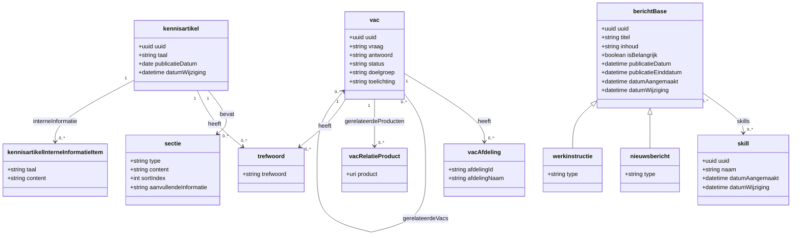

# Kennis API — UML Klassendiagram

```mermaid
classDiagram
    class kennisartikel {
        +uuid uuid
        +string taal
        +date publicatieDatum
        +datetime datumWijziging
    }
    class kennisartikelInterneInformatieItem {
        +string taal
        +string content
    }
    class sectie {
        +string type
        +string content
        +int sortIndex
        +string aanvullendeInformatie
    }
    class trefwoord {
        +string trefwoord
    }
    class vac {
        +uuid uuid
        +string vraag
        +string antwoord
        +string status
        +string doelgroep
        +string toelichting
    }
    class vacAfdeling {
        +string afdelingId
        +string afdelingNaam
    }
    class vacRelatieProduct {
        +uri product
    }
    class berichtBase {
        +uuid uuid
        +string titel
        +string inhoud
        +boolean isBelangrijk
        +datetime publicatieDatum
        +datetime publicatieEinddatum
        +datetime datumAangemaakt
        +datetime datumWijziging
    }
    class nieuwsbericht {
        +string type
    }
    class werkinstructie {
        +string type
    }
    class skill {
        +uuid uuid
        +string naam
        +datetime datumAangemaakt
        +datetime datumWijziging
    }

    kennisartikel "1" --> "0..*" sectie : bevat
    kennisartikel "1" --> "0..*" trefwoord : heeft
    kennisartikel "1" --> "0..*" kennisartikelInterneInformatieItem : interneInformatie

    vac "1" --> "0..*" vacAfdeling : heeft
    vac "0..*" --> "0..*" vac : gerelateerdeVacs
    vac "1" --> "0..*" vacRelatieProduct : gerelateerdeProducten
    vac "1" --> "0..*" trefwoord : heeft

    berichtBase "0..*" --> "0..*" skill : skills

    berichtBase <|-- nieuwsbericht
    berichtBase <|-- werkinstructie
```
