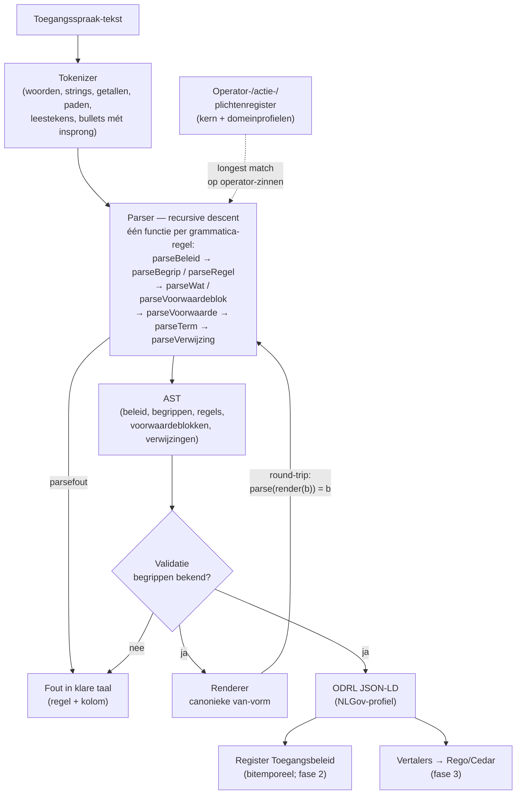

# Toegangsspraak — een klare-taal beleidstaal voor het Register Toegangsbeleid

**Datum:** 2026-07-22
**Status:** ontwerpvoorstel (werktitel: *Toegangsspraak*)
**Context:** Werkgroep FTV / Register Toegangsbeleid. Vervolg op
`ODRL-Register-Toegangsbeleid.md` en `Whitepaper-Register-Toegangsbeleid.md`.

---

## 1. Probleemstelling

Het ODRL-ontwerp geeft ons een *machine-leesbare, semantische* beschrijvingslaag.
Maar JSON-LD is voor beleidsmakers, juristen en burgers niet leesbaar. De whitepaper
noemt "mens-leesbaar: redelijk" — dat is te weinig voor de doelgroep die het beleid
moet *opstellen, reviewen en vaststellen*.

Gevraagd: een taal die

1. **leesbaar is voor leken** — geen moeilijker woorden dan *subject*, *gegevens(type)*,
   acties als *bekijken, veranderen, registreren, opvoeren, afvoeren, corrigeren*, en
   de werkwoorden *mogen* / *mag niet*;
2. **dezelfde dekking heeft** als de ODRL-subset (en dus vertaalbaar is naar
   XACML/OPA/Cedar);
3. **over subjecten en objecten praat via hun eigenschappen** (attribuutpaden, bv.
   `natuurlijk-persoon.naam.achternaam`);
4. **operatoren en functies** kent (`is`, `is niet`, `bevat`, `begint met`, …) en per
   domein **uitbreidbaar** is (geo: *valt binnen*, *overlapt*, …);
5. een **definitie** (grammatica) en een **interpreter** heeft.

## 2. Kerninzicht: geen vrije taal, maar een *gecontroleerde* taal

De valkuil van "beleid in gewone taal" is ambiguïteit ("en/of", zwevende ontkenning,
bereik van bijzinnen). De oplossing is een **Controlled Natural Language (CNL)**:

- Elke zin volgt één van een **klein aantal vaste zinspatronen**.
- Elke zin heeft **precies één betekenis**: er is een 1-op-1-afbeelding van zin naar
  een knoop in het ODRL-model (de canonieke vorm).
- De taal wordt **niet vrij getypt maar begeleid geschreven**: een gestructureerde
  editor (Studio-activiteit) laat de auteur zinsdelen invullen, met autocomplete uit
  de MetaRegistry. Leken *lezen* volzinnen; bij het *schrijven* vullen ze slots.
- Alles wat in het register staat (ook beleid dat als ODRL binnenkomt) kan
  **teruggerenderd** worden naar dezelfde klare taal. Leesbaarheid is daarmee een
  gegarandeerde eigenschap van het register, niet van de auteur.

Dit is precies het model dat bewezen werkt bij bestaande CNL's:

| Prior art | Wat we ervan lenen |
|---|---|
| **RegelSpraak / ALEF** (Belastingdienst) | Nederlandstalige CNL voor wetsuitvoering; opsommingsstructuur ("aan alle volgende voorwaarden is voldaan") die en/of-ambiguïteit elimineert |
| **SBVR Structured Dutch** (OMG) | vaste zinspatronen + begrippenkader (vocabulaire eerst, regels erna) |
| **Catala** | juridische brontekst en formele semantiek zij aan zij; de tekst ís de bron |
| **Cedar** | bewijs dat een klein, analyseerbaar taaltje (permit/forbid + when/unless) vrijwel alle autorisatiepraktijk dekt |

## 3. De taal in één oogopslag

```
Beleid "Inzage inkomen bij schuldhulp".
  Geldig vanaf 1 mei 2026.
  Grondslag: de Wet gemeentelijke schuldhulpverlening.

  Begrippen.
    Een schuldhulpverlener is: iemand met rol "schuldhulpverlener".
    Inkomensgegevens zijn: alle gegevens van het inkomen van een natuurlijk persoon.

  Regel "inzage bij lopend dossier".
    Een schuldhulpverlener mag de inkomensgegevens bekijken
    als aan alle volgende voorwaarden is voldaan:
      - het doel van de aanvraag is "schuldhulpverlening";
      - er is een lopend dossier voor de betrokkene;
    waarbij: elke raadpleging wordt vastgelegd in het logboek.

  Regel "geen export".
    Een schuldhulpverlener mag de inkomensgegevens niet exporteren.
```

Eén kernzinpatroon draagt de hele taal:

> **\<wie\> mag \<gegevens\> \<actie\>** — of: **mag … niet \<actie\>** —
> **[ als \<voorwaarden\> ] [ waarbij \<verplichtingen\> ]**

Alle verdere rijkdom zit in de invulling van de vier slots. Dat houdt het aantal te
leren constructies op één hand telbaar.

## 4. Opbouw van een beleidsdocument

Een **Beleid** (→ ODRL `Policy`/Set) bevat, in vaste volgorde:

1. **Kop**: naam, geldigheid, grondslag, doelbinding (documentbreed).
2. **Begrippen** (optioneel): herbruikbare definities van wie- en wat-omschrijvingen.
3. **Regels**: elk één kernzin (toestemming of verbod), met voorwaarden en plichten.

### 4.1 Kop

```
Beleid "<naam>".
  Geldig vanaf <datum> [tot <datum>].          → materiële tijd van het register
  Grondslag: <wet of besluit>.                 → nlgov:grondslag (IRI wetten.overheid.nl)
  Doel: "<verwerkingsdoel>".                   → nlgov:doelbinding (documentbreed default)
```

`Geldig vanaf/tot` wordt níet als constraint gemodelleerd maar als **materiële tijd**
van het bitemporele register (`Beleid_Aanvang`/`Beleid_Einde`). Tijdreizen over beleid
is daarmee gratis en de zin blijft leesbaar.

### 4.2 Begrippen (het "wie" en "wat" benoemen)

```
Een <naam> is: iemand met <eigenschap> [en <eigenschap>]...
De <naam> zijn: de gegevens <registerpad> [waarvan <voorwaarde>]...
```

Voorbeelden:

```
Een jeugdmedewerker is: iemand met rol "jeugdzorg" en organisatie "gemeente Utrecht".
De jeugddossiers zijn: de gegevens dossier waarvan betrokkene.leeftijd kleiner is dan 18.
```

→ ODRL `PartyCollection` resp. `AssetCollection`, elk met `refinement`-constraints.
Begrippen zijn de leesbare naam voor een verzameling; regels verwijzen ernaar met
lidwoord + naam. Dit spiegelt SBVR: eerst vocabulaire, dan regels.

Aanvullingen (2026-07-23, n.a.v. werkgroep-gebruik):

- **Het lidwoord in het definiendum is optioneel.** Onbepaalde termen zijn in
  definities gangbaar Nederlands — "*Mail* is: …", "*Inkomensgegevens* zijn: …",
  zoals bij massanamen (water, lucht). Ook de verwijzing in een regel mag dan
  kaal: "… mag *mail* bekijken". In van-ketens blíjft het lidwoord verplicht;
  daar is het een grammaticaal anker.
- **De dubbele punt na "is"/"zijn" is bij het parsen optioneel**; de canonieke
  vorm heeft hem wél (herformatteren vult hem aan). Consequentie: een
  begripsnaam kan zelf de woorden "is" of "zijn" niet bevatten.
- **Congruentie**: "alle gegevens van" accepteert een volledige van-keten,
  zodat een meervoudig begrip een meervoudige definitie krijgt —
  "Inkomensgegevens **zijn**: **alle gegevens** van het inkomen van een
  natuurlijk persoon" (i.p.v. het incongruente "… zijn: het inkomen van …").
  Het pad van zo'n gegevensgroep krijgt alle segmenten met hoofdletter
  (`NatuurlijkPersoon.Inkomen`), er is immers geen veld-blad.

### 4.3 Regels

```
Regel "<naam>".
  <wie> mag <wat> <actie> | mag <wat> niet <actie>
  [ als <voorwaardeblok> ]
  [ waarbij: <plicht> [; <plicht>]... ]
```

- `mag` → `Permission`; `mag niet` → `Prohibition`. Ontkenning bestaat **alleen** in
  deze twee vormen en in `is niet` — nergens anders. Geen zwevend "niet".
- `<actie>` komt uit de **actielijst** van het NLGov-profiel: *bekijken, opvoeren,
  veranderen, corrigeren, afvoeren, registreren, exporteren* (uitbreidbaar per
  domeinprofiel). Elke actie mapt op een `nlgov:`-Action.
- `<wat>` is een begrip, een van-keten ("de achternaam van een natuurlijk
  persoon") of "alle gegevens van een \<type\>". Zie §4.7 voor de van-vorm.

### 4.7 Verwijzen met "van" — besluit (2026-07-22)

Naar gegevens wordt verwezen in de **van-vorm**, niet met technische paden:

> *de achternaam van de naam van een natuurlijk persoon*

Het woord **"van" is een grammatica-element dat de compositie/aggregatie in het
metamodel omgekeerd volgt** (van blad naar wortel). De afspraken:

- De van-vorm is de **canonieke leesvorm**; het registerpad
  (`NatuurlijkPersoon.Naam.achternaam`) blijft de **canonieke interne vorm**
  (AST, ODRL `nlgov:registerpad`). Beide zijn deterministisch in elkaar te
  vertalen.
- De parser **accepteert het technische pad als shorthand** — handig bij
  drag & drop uit de projectboom en bij machinaal gegenereerd beleid — maar de
  renderer schrijft **altijd** de van-vorm terug. Wat in het register staat, is
  dus altijd in de leesvorm te tonen.
- Dezelfde van-keten werkt op de ankers: *het doel **van** de aanvraag*,
  *het werkgebied **van** de aanvrager*, *de leeftijd **van** de betrokkene*.
- Met metamodel-resolutie (schema-API) kan een keten **verkort** worden zolang
  die eenduidig is: "de achternaam van een natuurlijk persoon" mag het
  tussenliggende "de naam" overslaan als er maar één veld `achternaam` onder
  `NatuurlijkPersoon` bestaat; bij dubbelzinnigheid eist de editor de volledige
  keten en somt hij de kandidaten op. Geïmplementeerd in `metamodel.js`
  (2026-07-23): de resolutie levert bovendien de juiste schrijfwijze van het
  registerpad (de casing van het metamodel wint) en de ODRL-uitvoer gebruikt
  die geresolvede paden.

### 4.4 Voorwaarden — zonder en/of-ambiguïteit

Eén voorwaarde mag inline: `als het doel van de aanvraag "schuldhulpverlening" is`.

Bij meerdere voorwaarden is de **opsommingsvorm verplicht** (het RegelSpraak-patroon);
"en" en "of" mogen nooit vlak naast elkaar in één zin:

```
als aan alle volgende voorwaarden is voldaan:        → AND   (LogicalConstraint and)
als aan ten minste één van de volgende voorwaarden is voldaan:   → OR (or)
als aan precies één van de volgende voorwaarden is voldaan:      → XOR (xone)
```

Opsommingen mogen genest worden (een voorwaarde kan zelf weer een opsomming zijn),
waarmee elke boolese combinatie uitdrukbaar is — maar altijd visueel ondubbelzinnig.

**Woordvolgorde (besluit 2026-07-23).** Nederlands zet het werkwoord in een
bijzin achteraan. De taal volgt dat: na "als" en "waarvan" is de
**bijzinsvolgorde** canoniek ("als de taal van een trefwoord niet "nl" **is**",
"als de achternaam met "A" **begint**"), in opsommings-bullets de
**stellingsvorm** ("de taal van een trefwoord **is niet** "nl"" — een bullet is
een stelling). De parser accepteert beide volgordes overal en normaliseert per
context; beide parsen naar exact dezelfde AST. Technisch: in de bijzinsvorm
wordt het werkwoord aan het einde naar voren gehaald en de stellingsvorm
opnieuw geparst; de grens tussen linksterm en operator-rest ("niet", "kleiner",
"geheel", …) wordt uit het operator-register afgeleid, zodat domeinprofielen
automatisch meedoen.

Een **voorwaarde** is: `<pad of waarde> <vergelijking> <pad of waarde>`.
Beide kanten mogen een pad zijn, met vaste, leesbare **ankerwoorden** voor de context:

| Anker | Betekenis | AuthZEN/XACML-categorie |
|---|---|---|
| `de aanvrager` | het subject dat toegang vraagt | subject |
| `de gegevens` | het object waarop de regel slaat | resource |
| `de betrokkene` | de persoon over wie de gegevens gaan | resource (nlgov:betrokkene) |
| `de aanvraag` | context: doel, grondslag, tijdstip, kanaal | action/environment |

Voorbeeld met pad-tegen-pad (dekt het XACML "attribute vs attribute"-geval):

```
- de locatie van de gegevens valt binnen het werkgebied van de aanvrager;
```

### 4.5 Verplichtingen (plichten)

```
waarbij: elke raadpleging wordt vastgelegd in het logboek;
         de gegevens worden gepseudonimiseerd geleverd.
```

→ ODRL `Duty` (obligation dan wel duty-bij-permission). Plichten zijn benoemde
acties uit hetzelfde profiel (`nlgov:log`, `nlgov:pseudonimiseer`, …), eventueel met
eigen voorwaarden.

### 4.6 Conflictregel

Vast en niet-configureerbaar in v1, en als leesbare zin in elke beleidstekst
impliciet aanwezig:

> **Wat niet uitdrukkelijk is toegestaan, mag niet. Een verbod gaat altijd vóór een
> toestemming.**

→ default-deny + `odrl:conflict = prohibit`, deny-overrides in XACML/OPA-termen.
Dit ene besluit voorkomt de hele klasse van combinatie-algoritme-complexiteit die
XACML onleesbaar maakt.

## 5. Vergelijkingen en functies — uitbreidbaar per domein

### 5.1 Kernset (elke implementatie)

| Klare taal | Canoniek | Typen |
|---|---|---|
| `is` | `eq` | alle |
| `is niet` | `neq` | alle |
| `is groter dan` / `is kleiner dan` | `gt` / `lt` | getal, datum |
| `is ten minste` / `is ten hoogste` | `gteq` / `lteq` | getal, datum |
| `bevat` | `contains` | tekst, verzameling |
| `begint met` / `eindigt op` | `startsWith` / `endsWith` | tekst |
| `is een van (…)` | `isAnyOf` | alle |
| `is bekend` / `is onbekend` | `exists` / `notExists` | alle |
| `ligt tussen … en …` | `between` | getal, datum |
| `is onderdeel van` | `isPartOf` | registerpad, organisatie-hiërarchie |

### 5.2 Domeinprofielen (voorbeeld: geo)

Een **domeinprofiel** registreert extra vergelijkingen met: klare-taalvorm, canonieke
naam, toegestane typen, en een vertaling per runtime-doel. Geo:

| Klare taal | Canoniek | Typen |
|---|---|---|
| `valt geheel binnen` | `geo:within` | geometrie |
| `valt deels binnen` / `overlapt` | `geo:intersects` | geometrie |
| `raakt` | `geo:touches` | geometrie |
| `ligt binnen … meter van` | `geo:dwithin` | geometrie + afstand |

Dit is exact het ODRL-Profile-mechanisme, doorgetrokken naar de taal: het
NLGov-kernprofiel levert de kernset, een geo-/zorg-/jeugd-profiel voegt operatoren
(en acties) toe zonder de grammatica te wijzigen. De grammatica kent alleen het
*slot* "vergelijking"; de invulling komt uit een **operator-register**.

### 5.3 Typebewaking uit de MetaRegistry

De schema-API levert per registerpad het veldtype. De interpreter weigert daardoor
zinnen die wel parsen maar niets betekenen (`geboortedatum begint met "A"`), met een
foutmelding in klare taal:

> *"'begint met' kan alleen met tekst. 'geboortedatum' is een datum. Bedoelde je
> 'is eerder dan'?"*

## 6. Grammatica (definitie)

Compacte EBNF van de kern (leesvorm; de begeleide editor produceert altijd de
canonieke schrijfwijze):

```ebnf
beleid        = kop , [ begrippen ] , { regel } ;
kop           = "Beleid" , naam , "." , { kopregel } ;
kopregel      = geldigheid | grondslag | doel ;
geldigheid    = "Geldig vanaf" , datum , [ "tot" , datum ] , "." ;

begrippen     = "Begrippen." , { begripsdef } ;
begripsdef    = wie-def | wat-def ;
wie-def       = lidwoord , naam , "is:" , "iemand" , eigenschappen , "." ;
wat-def       = lidwoord , naam , ("is:" | "zijn:") , "de gegevens" , pad ,
                { "waarvan" , voorwaarde } , "." ;
eigenschappen = "met" , eigenschap , { "en" , eigenschap } ;
eigenschap    = kenmerknaam , waarde ;

regel         = "Regel" , naam , "." , kernzin ;
kernzin       = wie , ( "mag" , wat , actie
                      | "mag" , wat , "niet" , actie ) ,
                [ "als" , voorwaardeblok ] ,
                [ "waarbij:" , plicht , { ";" , plicht } ] , "." ;

wie           = lidwoord , ( begripsnaam | "iemand" , eigenschappen ) ;
wat           = lidwoord , begripsnaam
              | "de gegevens" , pad
              | "alle gegevens van" , pad ;
actie         = "bekijken" | "opvoeren" | "veranderen" | "corrigeren"
              | "afvoeren" | "registreren" | "exporteren" | domeinactie ;

voorwaardeblok = voorwaarde
              | kwantor , "de volgende voorwaarden is voldaan:" ,
                { "-" , ( voorwaarde | voorwaardeblok ) , ";" } ;
kwantor       = "aan alle" | "aan ten minste één van" | "aan precies één van" ;
voorwaarde    = term , vergelijking , term ;
term          = waarde | verwijzing ;
verwijzing    = [ kenmerkpad , "van" ] , anker | pad ;
anker         = "de aanvrager" | "de gegevens" | "de betrokkene" | "de aanvraag" ;
vergelijking  = (* uit het operator-register: kernset + domeinprofielen *) ;

plicht        = plichtzin (* benoemde actie uit het profiel, evt. met voorwaarde *) ;
pad           = ident , { "." , ident } ;   (* MetaRegistry-registerpad *)
```

Eigenschappen van deze grammatica:

- **LL(1)-parseerbaar**: elk alternatief is op het eerste woord te onderscheiden.
- **Geen vrije woordvolgorde**; synoniemen (bv. `inzien` voor `bekijken`) mogen in
  het lexicon worden opgenomen, maar de formatter normaliseert altijd naar de
  canonieke vorm.
- **Interpunctie is betekenisdragend** (opsomming = boolese structuur), zoals in
  RegelSpraak.

## 7. Dekking t.o.v. ODRL / XACML / OPA / Cedar

| Vermogen | Toegangsspraak | ODRL | XACML | Cedar/OPA |
|---|---|---|---|---|
| permit / deny | `mag` / `mag niet` | Permission/Prohibition | Permit/Deny | permit/forbid |
| verplichtingen | `waarbij:` | Duty | Obligation/Advice | (buiten Cedar-kern) |
| subject via attributen | `iemand met …` / begrip | PartyCollection+refinement | subject-match | principal-clausule |
| resource tot veldniveau | registerpaden | Asset (nlgov:registerpad) | resource-match | resource-clausule |
| acties, hiërarchisch | actielijst per profiel | Action (+includedIn v2) | action-match | action-groepen |
| condities ABAC | voorwaardeblokken | Constraint/LogicalConstraint | Condition | when/unless |
| attribuut-vs-attribuut | pad-tegen-pad met ankers | Constraint | ja | ja |
| AND/OR/XOR genest | geneste opsommingen | and/or/xone | allOf/anyOf | &&/|| |
| combinatie-algoritme | vast: verbod wint, default deny | conflict:prohibit | deny-overrides | forbid wint |
| tijdgeldigheid | `Geldig vanaf/tot` | (materiële tijd register) | Condition | context |
| grondslag/doelbinding | kopregels + voorwaarden | nlgov:-LeftOperands | attributen | context |
| domeinuitbreiding | operator-/actieregister | Profile | functies | extensies |

**Bewust niet in v1** (met ontsnappingsluik):

- vrije rekenkunde en aggregaties ("gemiddelde van …") — zelden nodig in
  toegangsbeleid; zo nodig als **benoemde functie** in een domeinprofiel
  (`de leeftijd van de betrokkene` is zo'n benoemde afleiding, geen formule);
- recursie/loops (Rego kan dit; toegangsbeleid hoort het niet nodig te hebben);
- delegatie/mandaat — volgt het ODRL-spoor (v2, Policy Inheritance).

Voor het zeldzame expert-geval: een `expressie`-blok met een CEL-expressie, dat in
de leesweergave als gemarkeerd "technisch blok" verschijnt. Zo blijft 100% dekking
haalbaar zonder de klare taal op te rekken.

## 8. Interpreter en architectuur

De tekst is de **bron**; de ODRL-vorm is de **canonieke schaduw**. Beide worden
bitemporeel geregistreerd (tekst als document-GE bij `Beleid`, ODRL zoals al
ontworpen). Pijplijn:

```
klare tekst ──lexer/parser──▶ AST ──validatie──▶ canoniek model ──▶ ODRL JSON-LD
   ▲                              (MetaRegistry:                        │
   │                               paden, typen,                        ▼
   └────────── renderer ◀──────── operatoren)              vertalers → Rego / Cedar / XACML
```

1. **Parser** — chevrotain (TypeScript, past in de v06-stack); grammatica hierboven.
2. **Validatie** — tegen schema-API: bestaat het pad, klopt het type bij de
   operator, bestaat de enum-waarde, bestaat de rol/organisatie. Foutmeldingen zelf
   ook in klare taal.
3. **Normalisatie → ODRL** — deterministische afbeelding op de NLGov-subset uit
   `ODRL-Register-Toegangsbeleid.md`; niets nieuws nodig in het ODRL-ontwerp.
4. **Renderer (ODRL → tekst)** — de omgekeerde afbeelding. Round-trip-eis:
   `render(parse(t))` is de canonieke schrijfwijze van `t`, en
   `parse(render(p)) = p` voor elke profiel-conforme policy. Dit is de harde
   garantie dat *alles* in het register leesbaar is.
5. **Vertalers naar runtime** — ongewijzigd het fase-3-spoor uit de whitepaper
   (ODRL → Rego/Cedar); Toegangsspraak lift daar gratis op mee.

### Begeleide editor (Omnium Studio)

De taal wordt geschreven in een **gestructureerde editor** als Studio-activiteit:

- zinsjablonen: de auteur kiest "toestemming" of "verbod" en vult slots;
- autocomplete uit de schema-API (registerpaden, rollen, acties, enum-waarden);
- live weergave van de volzin zoals die gelezen wordt, plus (inklapbaar) de
  ODRL-vorm en de gevolgen ("deze regel geeft 3 rolgroepen toegang tot 12 velden");
- validatie bij het typen, met de klare-taal foutmeldingen uit §5.3.

Hiermee is de bekende CNL-zwakte (schrijven is moeilijker dan lezen) afgedekt:
leken lezen volzinnen; auteurs klikken en vullen in.

## 9. Toetsvoorbeelden (dekkingsproef)

**Geo (domeinprofiel):**
```
Regel "toezicht binnen werkgebied".
  Een toezichthouder mag de gegevens pand bekijken
  als de locatie van de gegevens geheel binnen het werkgebied van de aanvrager valt.
```

**Verbod met uitzondering (geneste opsomming):**
```
Regel "medische gegevens afgeschermd".
  Iemand met rol "P&O" mag de gegevens medewerker.medisch niet bekijken.

Regel "bedrijfsarts wel".
  Een bedrijfsarts mag de gegevens medewerker.medisch bekijken
  als aan alle volgende voorwaarden is voldaan:
    - het doel van de aanvraag is "verzuimbegeleiding";
    - aan ten minste één van de volgende voorwaarden is voldaan:
      - er is een lopende verzuimmelding voor de betrokkene;
      - de betrokkene heeft toestemming gegeven;
  waarbij: elke raadpleging wordt vastgelegd in het logboek.
```

**Registreren met plicht (bitemporele actie):**
```
Regel "corrigeren met verantwoording".
  Een registerbeheerder mag de gegevens natuurlijk-persoon corrigeren
  waarbij: de reden van de correctie wordt vastgelegd bij de registratie.
```

## 10. Openstaande punten

| Punt | Toelichting | Prio |
|---|---|---|
| Naamgeving | *Toegangsspraak* is werktitel; afstemmen met werkgroep (associatie met RegelSpraak is bewust) | Laag |
| Lexicon-beheer | wie beheert synoniemen en de klare-taalvormen van operatoren (governance zoals NLGov-profiel) | Midden |
| Plicht-grammatica | plichtzinnen zijn nu sjabloonzinnen per profiel-actie; nette subgrammatica uitwerken | Midden |
| "er is een …"-voorwaarden | existentie over relaties ("er is een lopend dossier") vergt een PIP-bevraging; afbakenen wat v1 aankan | Hoog |
| Round-trip-test | property-based tests parse↔render als eerste implementatiestap | Hoog |
| Meertaligheid | zelfde AST, tweede lexicon (bv. Engels) is rendering-kwestie, geen taalkwestie | Laag |

## 11. Voorgestelde eerste stappen

1. Grammatica + kernoperatoren vaststellen in de werkgroep (dit document als input).
2. Parser + renderer als klein TS-pakket (`toegangsspraak/`), met round-trip-tests
   over de drie whitepaper-scenario's.
3. ODRL-mapping aansluiten op de bestaande NLGov-subset; geen wijziging daar nodig.
4. Begeleide editor als Omnium Studio-activiteit prototypen (hergebruik
   formuliereditor-patronen).

## 12. Implementatiestatus (v0 — 2026-07-22, branch `feat/toegangsspraak`)

> Compacte functionele + technische beschrijving van het gebouwde:
> `docs/TOEGANGSSPRAAK.md`. Dit hoofdstuk houdt de besluiten en de status bij.

Eerste werkende versie, in de Studio-activiteit **Toegangverlening** (status
concept, alleen via *Ga naar*):

| Onderdeel | Waar | Status |
|---|---|---|
| Taalkern: tokenizer + recursive-descent parser | `web/vite/src/toegangsspraak/parser.js` | ✅ kop, begrippen, regels, geneste opsommingen, plichten, van-vorm + pad-shorthand |
| Operator-/actie-/plichtenregister (uitbreidbaar) | `web/vite/src/toegangsspraak/operatoren.js` | ✅ kernset + geo-profiel als voorbeeld |
| Renderer (AST → canonieke van-vorm) | `web/vite/src/toegangsspraak/renderer.js` | ✅ round-trip getest (render ∘ parse = identiteit) |
| ODRL JSON-LD-mapping (NLGov-subset) | `web/vite/src/toegangsspraak/odrl.js` | ✅ Permission/Prohibition, LogicalConstraint, Duty, Party-/AssetCollection |
| Unit tests (node --test) | `web/vite/src/toegangsspraak/toegangsspraak.test.js` | ✅ 11 tests |
| Studio-activiteit (editor + ModelPicker-drop + ODRL-inspector) | `web/vite/src/studio/activities/toegangActivity.jsx` | ✅ v0: highlighting, foutenpaneel, canonieke leesweergave, ODRL-export, autocomplete |
| Metamodel-koppeling: keten-resolutie (met verkorting), typebewaking, autocomplete-suggesties | `web/vite/src/toegangsspraak/metamodel.js` | ✅ v0 (2026-07-23) — zie hieronder |

### 12.0 Metamodel-koppeling (2026-07-23)

`metamodel.js` is puur (geen fetch): de aanroeper stopt er een veldenlijst in
(bv. FieldRefs uit `modelpicker/bouwModelTree`, of straks een andere doorsnede
van de **universele projectboom** — gefilterd op domein of zelfs een ander
model). Autocomplete en controle beperken zich vanzelf tot die doorsnede.

- **Keten-resolutie met verkorting** (§4.7): van-ketens worden opgezocht in de
  echte veldpaden; eenduidig verkort mag, dubbelzinnig eist de volledige keten
  met de kandidaten in de foutmelding. De metamodel-casing wint; de
  ODRL-uitvoer gebruikt de geresolvede paden.
- **Typebewaking** (§5.3): operator × veldtype ("begint met" alleen op tekst,
  met hint "gebruik 'is kleiner dan'"), literal × veldtype (datum vs getal) en
  enum-bewaking (toegestane waarden in de melding). Meldingen verschijnen in
  de editor als niet-blokkerende "Controle"-regels.
- **Autocomplete, twee kanten op**: vooruit (partieel woord → van-vormen) en
  **achterstevoren** — typ "de naam van " en alle bases (typen/ketens) die
  zo'n veld of gegevensgroep hebben worden voorgesteld; bij een dubbelzinnig
  blad per kandidaat de onderscheidende rest. Labels tonen het **overslabare
  deel van de keten tussen haakjes**: "de achternaam van (de naam van) een
  natuurlijk persoon". Elke suggestie heeft een korte en een volledige variant.
  Toetsen (IDE-conventie, 2026-07-23): **Tab bladert** door de chips,
  **Ctrl+Space voegt de korte vorm in**, **Shift+Ctrl+Space de volledige
  keten** (klik / shift-klik idem); zonder suggesties opent Ctrl+Space ze en
  blijft Tab gewoon inspringen. Bronnen naast het metamodel: begrippen,
  handelingen, operator-zinnen en plichten.
- **Zinsontleding in de editor** (2026-07-23): de parser levert naast de AST
  een platte lijst *spans* — bronposities per element-soort (subject,
  gegevens, vergelijking, waarde, handeling, plicht, modaliteit). Achter de
  schakelaar "Ontleding" kleurt de editor de zinsdelen (subject groen,
  gegevens geel, waarde blauw, …). **Dubbelklik op een gegevens-keten**
  groepeert hem met een kader, toont het geresolvede registerpad in een
  infobalk en **focust het exacte element in de modelboom** — de boom blijft
  staan (context zichtbaar), alleen de bevattende takken klappen open, het
  element wordt gemarkeerd en in beeld gescrold (`ModelPicker` kreeg daarvoor
  een optionele `focusVeldpad`-prop; er is ook een `externeZoekterm`-prop
  voor flows die wél willen filteren).
- **Editor-gedrag** (2026-07-23, n.a.v. gebruik): staat de caret **binnen een
  bestaande gegevens-keten**, dan vervangen suggesties de **hele keten**
  (nooit invoegen middenin); zonder metamodel-treffers verschijnen er daar
  geen suggesties. Bij vooruit-aanvullen wordt een al getypt lidwoord
  meevervangen (geen "de de achternaam …"). Invoegingen (autocomplete, drop,
  herformatteren, voorbeeld laden) lopen via het native edit-mechanisme,
  zodat **Ctrl+Z** gewoon werkt.
- **Woordvolgorde**: bijzinsvolgorde na "als"/"waarvan", stellingsvorm in
  opsommingen — zie het besluit in §4.4.

### 12.1 Hoe de interpreter werkt

De "interpreter" is strikt genomen een **vertaler**: hij voert geen beleid uit
(dat doet de PDP), maar vertaalt tekst ↔ AST ↔ ODRL. Vier kleine modules in
`web/vite/src/toegangsspraak/`, plain JavaScript zonder dependencies, in het
idioom van `shared/celEvaluator.js` (handgeschreven, geen parser-generator):

| Module | Rol |
|---|---|
| `woorden.js` | taalhulpjes: CamelCase ↔ woorden, lidwoorden, NL-datums, slugs |
| `operatoren.js` | de registers: vergelijkingen, handelingen, plichten (uitbreidbaar per domeinprofiel) |
| `parser.js` | tokenizer + recursive-descent parser → AST, + semantische validatie |
| `renderer.js` | AST → canonieke tekst (van-vorm) |
| `odrl.js` | AST → ODRL JSON-LD (NLGov-subset) |



Drie ontwerpkeuzes die het simpel houden:

1. **De grammatica is LL(1)-achtig**: op elk punt bepaalt (hooguit een paar
   woorden) vooruitkijken welke regel geldt — vandaar dat elke grammatica-regel
   één gewone functie is die tokens consumeert en een AST-knoop teruggeeft.
2. **Operatoren zijn data, geen grammatica**: de parser vraagt op elk
   voorwaarde-punt aan het register "begint hier een operator-zin?"
   (langste eerst, zodat *is kleiner dan* wint van *is*). Domeinprofielen
   (geo) registreren alleen data.
3. **Nesting via insprong**: opsommings-bullets dragen hun insprong mee uit de
   tokenizer; geneste blokken zijn gewoon recursie met een dieper-insprong-eis.

Nog niet gedaan (volgorde van oppakken):

1. **Existentie-voorwaarden** ("er is een lopend dossier voor de betrokkene").
2. **Nette plicht-subgrammatica** (nu: sjabloonzinnen uit het plichtenregister).
3. **Doorsnede-keuze voor autocomplete/controle** — het canoniek model links
   filteren op domein (of een andere doorsnede uit de universele projectboom)
   en die doorsnede als veldenlijst in `maakVeldIndex` stoppen.
4. **Bitemporele opslag** van beleidsteksten als registerentiteit (whitepaper
   fase 2) en de vertalers naar Rego/Cedar (fase 3).
5. **Lidwoord + telbaarheid als metamodel-metadata** (naast het bestaande
   meervoud). Leg het **lidwoord** vast ("de"/"het" — dat weten
   Nederlandstaligen wél; het grammaticale geslacht m/v/o niet, en de taal
   heeft alleen het lidwoord nodig), plus **telbaarheid**: kan het woord met
   "een" (telbaar), of is het een massanaam/niet-telbaar ("mail", "post",
   "informatie") die in de van-vorm kaal blijft ("van mail" i.p.v. "van een
   mail")? Invullen bij nieuwe ENT/GE's; bestaand model eenmalig design-time
   aanvullen met een woordenlijst-dataset (OpenTaal-woordenlijst of een
   nl.wiktionary-dump bevatten genus/telbaarheid; Woordenlijst.org/Taalunie
   heeft geen publieke API) — géén runtime-woordenboek-API in het register.
   De heuristiek in `lidwoordVoor` (woordenlijst + het-achtervoegsels
   -je/-isme/-ment/-sel/-um, met uitzonderingen als "datum") blijft de
   terugval.
