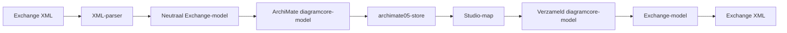

# Ontwerp — ArchiMate Model Exchange import en export

> **Datum:** 2026-08-31
>
> **Status:** fase A, B en C0 plus de verticale view-slice van fase C gebouwd
> op `feat/archimate-exchange`; fase D/E en resterend fase-C-detail nog niet
> geïmplementeerd
>
> **Scope:** Open Group ArchiMate Model Exchange File Format (XML) als externe
> bron en bestemming voor het ArchiMate-profiel in Omnium Studio
>
> **Bouwt voort op:**
> [`2026-07-17 ArchiMate en verdere notaties (plan).md`](2026-07-17%20ArchiMate%20en%20verdere%20notaties%20%28plan%29.md),
> [`2026-07-11 STUDIO consolidatie.md`](2026-07-11%20STUDIO%20consolidatie.md)
> en de bestaande transformatielaag in `web/vite/src/studio/activities/`
>
> **Review 2026-08-31 (Claude, met Mark):** §9.1 is opgewaardeerd van
> roundtrip-randgeval naar **motor-primitief** (het voorkomen), er is een
> **fase C0** tussengevoegd, en §9.6/§9.7 en besluiten 11–13 zijn toegevoegd
> voor twee concepten die nog ontbraken: view-eigen inhoud (Label/Container)
> en per-view zichtbaarheid van relaties.

---

## 1. Aanleiding en doel

Omnium Studio kan ArchiMate-modellen tekenen met het profiel
`diagramprofielen/archimate/`. Het profiel bevat op dit moment 22
elementtypen over Business, Application, Technology en Motivation, een
junction en de elf ArchiMate-relaties. De modelleerfunctie is een preview:
de relaties zijn nog permissief en standaarduitwisseling ontbreekt.

Het doel van dit ontwerp is import en later export van het **Open Group
ArchiMate Model Exchange File Format** mogelijk te maken, zodat modellen met
onder meer Archi en BiZZdesign kunnen worden uitgewisseld.

De implementatie moet aansluiten op een fundamenteel Studio-besluit:

> Documenten bestaan alleen aan de rand. Binnen Omnium Studio bestaan
> modellen, elementen, relaties en diagrammen. Import, interne transformatie
> en export zijn drie richtingen van hetzelfde transformatieconcept.

Daaruit volgt deze hoofdroute:



De XML-parser kent het standaardformaat, maar niet de Studio-store. De
profieladapter kent ArchiMate en diagramcore, maar niet de bestandsdialoog.
De generieke transformatielaag kiest bron, doelmap en transformatie en past
het resultaat toe.

## 2. Terminologie

### 2.1 Model Exchange, niet XMI

Het ArchiMate Model Exchange File Format is XML, maar **geen XMI**. De
bestaande UML-XMI-importers kunnen daarom niet inhoudelijk worden hergebruikt.
Wel herbruikbaar is hun architectuurpatroon:

```text
bronsyntax → neutraal bronmodel → profiel-/editoradapter → intern model
```

In code, documentatie en UI heet het formaat daarom consequent:

- `ArchiMate Model Exchange`;
- `Exchange XML` waar een korte naam nodig is;
- niet `ArchiMate XMI` of alleen `XMI`.

### 2.2 Drie transformatierichtingen

| Richting | Bron | Doel | Voorbeeld |
|---|---|---|---|
| `import` | buiten Omnium Studio | Studio-model | Exchange XML → ArchiMate-model |
| `transform` | Studio-model | Studio-model | Toegangsregel → ArchiMate-elementen |
| `export` | Studio-model | buiten Omnium Studio | ArchiMate-map → Exchange XML |

Import en export zijn daarmee geen eigenschappen van een bestandstype of
editorpagina. Het zijn transformaties met een externe bron of bestemming.

## 3. Huidige architectuur

### 3.1 Generieke transformatielaag

De huidige implementatie bestaat uit:

- `transformatieRegistry.js`: registratie met `id`, `label`, `richting`,
  `profielTypes`, `toelichting` en `run(context)`;
- `TransformatiePaneel.jsx`: generieke keuze van actie, bestand, bronmap,
  doelmap en transformatie;
- `transformaties.js`: maphelpers en ingebouwde map-JSON-, Markdown- en
  kopieertransformaties;
- `profieltypeRegistry.js`: runtimekoppeling naar descriptor, store en UI van
  ieder profieltype;
- `modellerenActivity.jsx`: vrije projectmappen en plaatsing van diagrammen en
  losse elementen.

Het bestaande contract is:

```js
registreerTransformatie({
  id,
  label,
  richting: "import" | "export" | "transform",
  profielTypes: string[] | "*",
  toelichting,
  run: async (context) => void,
});
```

Voor import bevat `context` nu:

```js
{
  richting: "import",
  bron: {
    type: "file",
    tekst: string,
    naam: string,
  },
  doelMap: string,
}
```

Dit contract is voldoende voor een eerste ArchiMate-import. Voor goede
bronherkenning, opties en diagnostiek is een kleine uitbreiding wenselijk;
zie hoofdstuk 8.

### 3.2 Profiel-eigen bestandsimport

`maakDiagramActiviteit` ondersteunt daarnaast een ouder, profiel-lokaal
contract:

```js
koppeling: {
  importBestand: {
    label,
    accept,
    verwerk: (tekst, bestandsnaam) => coreModel,
  },
  exportBestand: {
    label,
    bestandsnaam: (staat) => string,
    maak: (staat) => string,
  },
}
```

OAS en MIM gebruiken dit al. Het is technisch bruikbaar voor ArchiMate, maar
niet de primaire ingang: een Exchange-model bevat één gedeeld elementmodel,
meerdere views en organisatiestructuren en hoort daarom bij een gekozen
Studio-map. Een profielmenu mag later als snelkoppeling hetzelfde
transformatiepad openen, maar krijgt geen tweede parser of adapter.

### 3.3 ArchiMate-profiel

Het profieltype in Studio heet `archimate05`; de diagramtypedescriptor heet
`archimate`. Dit zijn verschillende identifiers:

| Begrip | ID | Functie |
|---|---|---|
| Studio-profieltype | `archimate05` | store, tabs, projectboom en transformatiefilter |
| Diagramtype | `archimate` | elementtypen, connectoren, shapes en regels |

Een transformatie zoekt de store op met `getProfieltype("archimate05")` en
zet `diagramTypeId`/`diagramType` op `archimate`.

## 4. Het externe Exchange-formaat

Een standaard Exchange-model kan onder andere bevatten:

- één model met identifier, naam, documentatie, metadata en versie;
- model-elementen met `identifier`, `xsi:type`, namen, documentatie en
  properties;
- relaties met `identifier`, `xsi:type`, `source`, `target` en
  relatiespecifieke attributen;
- property definitions met getypeerde waarden;
- één of meer organizations: strikt geneste bomen die naar concepten of views
  verwijzen;
- views/diagrammen met nodes, geneste nodes, connections, bounds, styles,
  bendpoints en optionele drill-downverwijzingen.

De importer mag niet aannemen dat de namespace exact gelijk is aan de
ArchiMate-taalversie. Ondersteuning wordt bepaald op basis van:

1. een geldige XML-root met lokale naam `model`;
2. een bekende Open Group ArchiMate Exchange-namespacefamilie;
3. parsing op `localName`, zodat prefixkeuze (`xsi`, standaardnamespace of
   een andere prefix) geen verschil maakt;
4. een expliciete fout bij een onbekende hoofdnamespace, tenzij de gebruiker
   later een tolerante modus kiest.

Schema-validatie tegen een meegeleverde XSD is waardevol, maar geen vereiste
voor de eerste browserimplementatie. De parser voert zelf structurele en
referentiële controles uit.

## 5. Voorgestelde lagen

### 5.1 Bestandsstructuur

```text
web/vite/src/diagramprofielen/archimate/
  exchange/
    exchangeModel.js
    parseExchange.js
    naarCoreModel.js
    vanCoreModel.js          # exportfase
    schrijfExchange.js       # exportfase
    typeMapping.js
    diagnostics.js
    fixtures/
      minimaal-model.xml
      meerdere-views.xml
      properties-en-stijl.xml
      onbekende-typen.xml
    parseExchange.test.js
    naarCoreModel.test.js
    roundtrip.test.js        # exportfase
  index.js

web/vite/src/studio/activities/
  archimateTransformaties.js
```

De bestaande `archimate/index.js` blijft de profieldefinitie. De
Exchange-code importeert de descriptor of een gedeelde type-mapping, maar
registreert zelf geen shapes of activiteiten.

### 5.2 Laag A — pure XML-parser

`parseExchange(xmlTekst, opties)` gebruikt `DOMParser` en retourneert een
neutraal bronmodel. De parser:

- controleert XML-syntax en root/namespace;
- leest identifiers zonder ze te wijzigen;
- resolveert nog geen Studio- of profieltypen;
- bewaart alle taalvarianten van namen, labels, documentatie en waarden;
- bouwt indexes voor elementen, relaties, views en property definitions;
- controleert dubbele identifiers en ontbrekende referenties;
- verzamelt waarschuwingen in plaats van `window.alert` te gebruiken;
- muteert geen store en gebruikt geen browser-UI buiten `DOMParser`.

Voorgesteld resultaat:

```js
{
  formaat: "archimate-model-exchange",
  namespace: "http://www.opengroup.org/xsd/archimate/.../",
  model: {
    identifier: string,
    version: string | null,
    namen: LangString[],
    documentatie: LangString[],
    metadata: object | null,
    properties: PropertyValue[],
  },
  propertyDefinitions: Record<string, PropertyDefinition>,
  elements: Record<string, ExchangeElement>,
  relationships: Record<string, ExchangeRelationship>,
  views: Record<string, ExchangeView>,
  organizations: ExchangeOrganization[],
  diagnostics: Diagnostic[],
}
```

Een diagnostic heeft minimaal:

```js
{
  severity: "error" | "warning" | "info",
  code: "AMX-001",
  message: string,
  sourceId: string | null,
  path: string | null,
}
```

Bij een `error` levert de parser geen toepasbaar model. `warning` en `info`
worden aan de gebruiker getoond en blijven desgewenst in importmetadata
bewaard.

### 5.3 Laag B — profieladapter

`naarCoreModel(exchangeModel, opties)` vertaalt de neutrale bron naar het
diagramcore-contract:

```js
{
  diagramTypeId: "archimate",
  elements: Record<string, Element>,
  diagrams: Record<string, Diagram>,
  meta: {
    bronFormaat: "archimate-model-exchange",
    exchange: { ... },
    diagnostics: Diagnostic[],
  },
}
```

Deze laag:

- mapt `xsi:type` naar de bestaande ArchiMate-element- en connectortypen;
- kiest de zichtbare naam volgens een configureerbare taalvoorkeur;
- zet relaties om in connector-elementen met `source` en `target`;
- zet views om in diagrammen met posities en afmetingen;
- bewaart bronmetadata voor verliesarme latere export;
- rapporteert niet-ondersteunde typen en presentatiedetails;
- kent geen Studio-mappen of download-UI.

### 5.4 Laag C — transformatietoepassing

`archimateTransformaties.js` registreert de externe import:

```js
registreerTransformatie({
  id: "import-archimate-model-exchange",
  label: "ArchiMate Model Exchange → ArchiMate-model",
  richting: "import",
  profielTypes: ["archimate05"],
  toelichting: "Importeert elementen, relaties en views uit standaard Exchange XML.",
  accept: [".xml", ".archimate"],
  run: async ({ bron, doelMap, opties }) => {
    // parse → adapter → atomisch toepassen → plaatsing → resultaat
  },
});
```

De uitvoeringslaag:

1. leest `bron.tekst`;
2. parseert naar het neutrale Exchange-model;
3. vertaalt naar diagramcore;
4. maakt een unieke importnamespace voor interne IDs;
5. past het model atomisch toe op de `archimate05`-store;
6. plaatst alle geïmporteerde diagrammen in `doelMap`;
7. plaatst elementen die in geen enkele view voorkomen als losse elementen in
   dezelfde map;
8. retourneert aantallen en diagnostics aan het transformatiepaneel.

De parser en adapter gooien fouten; alleen het generieke paneel presenteert
ze. Profielcode gebruikt geen `window.alert`.

## 6. Mapping naar het huidige ArchiMate-profiel

### 6.1 Elementtypen

De volgende standaardtypen hebben al een directe tegenhanger:

| Exchange `xsi:type` | Diagramcore `elementType` |
|---|---|
| `BusinessActor` | `business-actor` |
| `BusinessRole` | `business-rol` |
| `BusinessProcess` | `business-proces` |
| `BusinessFunction` | `business-functie` |
| `BusinessService` | `business-service` |
| `BusinessEvent` | `business-event` |
| `BusinessObject` | `business-object` |
| `ApplicationComponent` | `app-component` |
| `ApplicationService` | `app-service` |
| `ApplicationFunction` | `app-functie` |
| `DataObject` | `data-object` |
| `Node` | `node` |
| `Device` | `device` |
| `SystemSoftware` | `systeemsoftware` |
| `TechnologyService` | `tech-service` |
| `Artifact` | `artifact` |
| `Stakeholder` | `stakeholder` |
| `Driver` | `driver` |
| `Goal` | `goal` |
| `Principle` | `principle` |
| `Requirement` | `requirement` |
| `Constraint` | `constraint` |
| `AndJunction` | `junction`, `data.soort = ""` |
| `OrJunction` | `junction`, `data.soort = "of"` |

Het standaardformaat kent meer typen dan het huidige profiel. Een onbekend of
nog niet ondersteund type wordt **niet** stilzwijgend naar een nabijgelegen
type vertaald. De adapter geeft `AMX-UNSUPPORTED-ELEMENT-TYPE`, slaat het
element over en slaat relaties naar dat element eveneens gecontroleerd over.
Het neutrale bronmodel behoudt het wel.

Een vervolgbesluit is of de importer de voltooiing van het profiel naar alle
standaardtypen moet afdwingen. Voor een bruikbare interoperabiliteitsfunctie
is dat uiteindelijk wenselijk, maar geen voorwaarde om de keten en bestaande
subset eerst goed te bouwen.

### 6.2 Relatietypen

| Exchange `xsi:type` | Diagramcore `elementType` |
|---|---|
| `Composition` of `CompositionRelationship` | `compositie` |
| `Aggregation` of `AggregationRelationship` | `aggregatie` |
| `Assignment` of `AssignmentRelationship` | `toewijzing` |
| `Realization` of `RealizationRelationship` | `realisatie` |
| `Serving` of `ServingRelationship` | `bediening` |
| `Access` of `AccessRelationship` | `toegang` |
| `Influence` of `InfluenceRelationship` | `beinvloeding` |
| `Triggering` of `TriggeringRelationship` | `trigger` |
| `Flow` of `FlowRelationship` | `stroom` |
| `Specialization` of `SpecializationRelationship` | `specialisatie` |
| `Association` of `AssociationRelationship` | `associatie` |

De mapping accepteert expliciet bekende naamvarianten per ondersteunde
Exchange-versie; zij verwijdert niet generiek het achtervoegsel
`Relationship`, omdat daarmee onbekende dialecten onbedoeld geldig kunnen
lijken.

Relatiespecifieke attributen:

- `Access.accessType` wordt `data.toegang`:
  - `Read` → `r`;
  - `Write` → `w`;
  - `ReadWrite` → `rw`;
  - `Access` of ontbrekend → leeg;
- `Influence.modifier` wordt `data.invloed`;
- een relatienaam wordt `naam`, in het bijzonder relevant voor `stroom`;
- overige bronattributen blijven in `data.exchange` bewaard.

### 6.3 Namen, documentatie en taal

Exchange ondersteunt meerdere `name`, `label`, `documentation` en `value`
elementen met `xml:lang`. Diagramcore toont één `naam`.

Selectieregel voor de zichtbare naam:

1. exact de gekozen importtaal;
2. dezelfde primaire taal zonder regio (`nl-NL` → `nl`);
3. Engels;
4. waarde zonder taal;
5. eerste beschikbare waarde;
6. `(naamloos)` alleen wanneer het profieltype een zichtbare naam vereist.

Alle varianten blijven onder `data.exchange.names` en
`data.exchange.documentation` staan. Export kan daardoor de oorspronkelijke
meertaligheid herstellen, ook wanneer de gebruiker alleen de zichtbare naam
niet wijzigt.

### 6.4 Properties

Property definitions worden eerst geïndexeerd. Een propertyvalue wordt als
getypeerde waarde in `data.exchange.properties` bewaard:

```js
{
  definitionId: "propdef-owner",
  naam: "owner",
  type: "string",
  waarden: [
    { lang: "nl", value: "Team Architectuur" },
  ],
}
```

De eerste versie projecteert properties niet automatisch naar nieuwe
profielproperties. Daarmee blijft de profieldefinitie schoon en worden
vendorproperties niet tot kernsemantiek verheven. Een later profiel- of
projectspecifiek mappingmechanisme kan dit declaratief doen.

### 6.5 Views en posities

Iedere Exchange-view wordt één diagram:

```js
{
  id: internDiagramId,
  naam: gekozenNaam,
  diagramType: "archimate",
  nodes: [
    {
      elementId: internElementId,
      position: { x, y },
      size: { width: w, height: h },
    },
  ],
  edges: [],
}
```

Modelrelaties blijven connector-elementen, conform diagramcore. Een
Exchange-connection bepaalt alleen of en hoe die relatie in een view wordt
getoond. Bij de eerste import:

- een connection met geldige `relationshipRef` zorgt dat het bijbehorende
  connector-element op het diagram kan worden gematerialiseerd;
- let op de **omgekeerde** richting: diagramcore tekent op dit moment élke
  relatie waarvan beide uiteinden op de view staan, óók als de view er géén
  connection voor declareert — zie §9.7 voor het zichtbaarheidsmechanisme;
- source/target nodeverwijzingen worden gecontroleerd tegen de view;
- eenvoudige bounds en nodegroottes worden behouden;
- geneste nodecoördinaten worden naar absolute diagramcoördinaten vertaald;
- bendpoints, attachments, fontdetails en labeloverrides worden als
  bronmetadata bewaard en als diagnostic gemeld wanneer diagramcore ze nog
  niet kan weergeven;
- viewstijlkleuren kunnen optioneel naar `element.data.kleur` worden
  geprojecteerd, maar de oorspronkelijke stijl blijft apart bewaard.

## 7. Identiteit en mergegedrag

### 7.1 Externe en interne identifiers

Exchange-identifiers kunnen botsen met bestaande elementen of met een tweede
import. Daarom worden ze niet rechtstreeks als globale interne ID gebruikt.

Voorgesteld patroon:

```text
amx:<importId>:<exchangeIdentifier>
```

Het oorspronkelijke identifier blijft staan in:

```js
data.exchange.identifier
```

`importId` is stabiel binnen één geïmporteerd model en wordt in `meta.exchange`
bewaard. Export gebruikt bij voorkeur het oorspronkelijke identifier, mits
uniek en geldig; nieuwe Studio-elementen krijgen een gegenereerd Exchange-ID.

### 7.2 Eerste importmodus

De eerste versie ondersteunt **toevoegen als nieuw model** in een gekozen
doelmap. Zij overschrijft geen bestaande ArchiMate-elementen.

Niet in de eerste versie:

- synchroniseren met een eerder geïmporteerd model;
- matchen op naam;
- vervangen op Exchange-ID;
- interactieve conflictresolutie.

Die functies vereisen expliciet bronidentiteit, wijzigingsdetectie en een
mergecontract. Naamgebaseerd samenvoegen is te riskant voor architectuurmodellen.

### 7.3 Atomisch toepassen

De huidige store biedt losse `addElement`- en `addDiagram`-acties. Een import
via honderden losse acties:

- maakt honderden undo-stappen;
- kan half voltooid achterblijven bij een fout;
- schrijft herhaaldelijk naar persistente opslag;
- maakt testen van rollback moeilijk.

Voeg daarom eerst een bulkactie toe aan `createDiagramStore`, bijvoorbeeld:

```js
importeerModel({ elements, diagrams, meta }, { modus: "toevoegen" })
```

Deze voert één Zustand-mutatie uit en vormt één undo-stap. De
transformatietoepassing valideert het volledige resultaat vóór deze mutatie.

## 8. Uitbreiding van het transformatiecontract

De huidige registry werkt, maar laat bronmetadata en resultaatdiagnostiek aan
iedere `run`-functie over. Voor ArchiMate en volgende standaardformaten wordt
de volgende compatibele uitbreiding voorgesteld:

```js
registreerTransformatie({
  id: "import-archimate-model-exchange",
  label: "ArchiMate Model Exchange → ArchiMate-model",
  richting: "import",
  profielTypes: ["archimate05"],
  toelichting: "...",

  bron: {
    types: ["file"],
    accept: [".xml", ".archimate"],
    mediaTypes: ["application/xml", "text/xml"],
    detecteer: ({ naam, tekst }) => number,
  },

  opties: [
    {
      key: "taal",
      label: "Voorkeurstaal",
      datatype: "string",
      default: "nl",
    },
    {
      key: "stijlen",
      label: "Kleuren uit views overnemen",
      datatype: "boolean",
      default: true,
    },
  ],

  run: async (context) => ({
    status: "success" | "warning",
    summary: "3 views, 42 elementen en 51 relaties geïmporteerd",
    diagnostics: [],
    created: {
      profielId: "archimate05",
      diagramIds: [],
      elementIds: [],
    },
  }),
});
```

De bestaande descriptors blijven geldig. `TransformatiePaneel` kan nieuwe
velden alleen tonen wanneer ze aanwezig zijn.

Aanbevolen generieke verbeteringen:

1. filter de bestandskiezer met `bron.accept` van de gekozen transformatie;
2. laat een transformatie een confidence-score voor automatische herkenning
   geven;
3. render declaratieve opties generiek;
4. toon `summary` en diagnostics in plaats van alleen `Gelukt.`;
5. definieer een uniforme `TransformationError` met code en diagnostics;
6. laat `run` het resultaat teruggeven en UI-effecten niet zelf uitvoeren.

Dit maakt dezelfde infrastructuur bruikbaar voor OAS, MIM, V3, BPMN, DMN en
toekomstige formaten. De bestaande profiel-eigen adapters kunnen stapsgewijs
achter registrydescriptors worden gehangen.

## 9. Het viewmodel: roundtripgrenzen en benodigde motor-concepten

### 9.1 Meerdere voorkomens van hetzelfde element — het voorkomen-primitief

Exchange maakt onderscheid tussen:

- een modelelement met een eigen identifier;
- ieder visueel **voorkomen** (node) met een eigen identifier en `elementRef`.

Hetzelfde modelelement kan daardoor meermaals in dezelfde view staan — en dat
is geen exotisch randgeval maar gewone modelleerpraktijk: dezelfde
applicatiecomponent links én rechts in een stroomplaat, dezelfde actor in twee
hoeken van een groot landschap. Zonder dit concept is de fase C-belofte
("gangbare Archi-views komen herkenbaar binnen") niet waar te maken.

Diagramcore vereenzelvigt de twee identiteiten op drie plaatsen:
`diagram.nodes` is op `elementId` gesleuteld, de React Flow-node-ID ís het
`elementId`, en `addElementToDiagram` weigert een tweede voorkomen. Dat is
"UML-tool-denken" — met de kanttekening dat ook UML zélf (UML Diagram
Interchange) shape en element scheidt; het zijn tools als EA die één
voorkomen per diagram afdwingen. Het primitief hieronder is dus ook voor de
UML-profielen standaard-zuiver; het wordt daar alleen niet áángezet.

**Ontwerp (bewust klein):**

```js
// DiagramNode
{
  nodeId: string | undefined, // identiteit van het voorkomen, uniek per diagram
  elementId: string,          // verwijzing naar het modelelement
  position: { x, y },
  size: { width, height } | undefined,
}
```

- `nodeId` is optioneel; afwezig ⇒ het voorkomen heet `elementId`. Bestaande
  diagrammen en werkbestanden blijven daardoor byte-voor-byte geldig — geen
  migratie.
- De React Flow-node-ID wordt `nodeId ?? elementId`; het element zelf reist
  al mee in `data`, dus shapes en inspector merken niets.
- `ElementType.meerdereVoorkomens` (of een DiagramType-default) bepaalt of de
  **UI** een tweede plaatsing aanbiedt; de **importer** mag het altijd.
  Besluit: aan in ArchiMate én de UML-profielen (zie besluit 11); alleen
  profielen waar een tweede voorkomen betekenisloos is (bv. het
  formulier-profiel, sequence-levenslijnen) houden het uit.

Raakvlakken — het echte werk zit hier:

1. de weigering in `addElementToDiagram` wordt een `addVoorkomen`-pad dat een
   `nodeId` genereert;
2. `materialiseerConnectoren` bouwt `Map<elementId, node>`; dat wordt een
   lijst per element, en een kale edge kiest per view een **voorkomen-paar** —
   default het dichtstbijzijnde, expliciet overschrijfbaar per diagram (de
   landingsplek voor Exchange-connections, die naar node-identifiers
   verwijzen — zie §9.2);
3. positie, maat en verwijderen (`updateNodePosition` e.d.) gaan op `nodeId`;
4. selectie en inspector blijven element-gericht: twee voorkomens selecteren
   hetzelfde element — dat is precies de bedoeling;
5. rand-elementen (`data.randVan`) verwijzen naar een gastheer-*voorkomen*
   zodra gastheren meervoudig kunnen; in de eerste stap zijn rand-elementen
   zelf niet meervoudig;
6. zwevende aanhechting werkt ongewijzigd — die rekent op de React
   Flow-nodemaat, niet op het element-ID.

Import/export: het Exchange-node-identifier wordt (via de amx-namespace) het
`nodeId`, waardoor connections zonder kunstgrepen kunnen landen en de export
de oorspronkelijke node-identiteiten terug kan schrijven.

**Advies: naar voren halen als fase C0** (motorwerk, parallel aan fase A/B)
in plaats van fase E. Zolang het er niet is geldt de MVP-regel: maximaal één
voorkomen per view; extra voorkomens leveren `AMX-DUPLICATE-OCCURRENCE` op en
blijven in bronmetadata bewaard.

### 9.2 Viewconnections en routing

Exchange-connections verwijzen naar visuele node-identifiers en kunnen
bendpoints en attachmentpunten bevatten. Diagramcore leidt relaties af uit
connector-elementen en bewaart alleen beperkte presentatierouting.

De MVP behoudt semantiek en aanwezigheid van relaties, maar niet gegarandeerd
de exacte route. Een latere uitbreiding kan Exchange-bendpoints mappen op een
algemene polyline-/waypointrepresentatie.

### 9.3 Geneste nodes

Exchange gebruikt nesting zowel voor visuele containers als voor ArchiMate-
nestingnotatie. Diagramcore kent containers via semantische connectoren en
parentrelaties, maar het ArchiMate-profiel heeft nesting nog niet gedeclareerd.

De MVP zet geneste posities om naar absolute coördinaten en bewaart de
nestingboom in bronmetadata. Zij maakt niet automatisch een compositie-,
aggregatie- of toewijzingsrelatie, omdat visuele nesting zonder aanvullende
informatie niet eenduidig één van die semantieken betekent.

### 9.4 Organizations en Studio-mappen

Een Exchange-organization is een boom waarin dezelfde conceptreferentie in
meerdere bomen of takken kan voorkomen. Studio heeft per diagram of los
element momenteel één plaatsing in één vrije projectmap.

Daarom worden organizations in de MVP wel geïmporteerd en bewaard, maar niet
automatisch tot Studio-mappen gemaakt. Een latere wizard kan één organization
laten kiezen en expliciet aangeven dat dit een projectstructuurprojectie is,
niet het model zelf.

### 9.5 Vendoruitbreidingen

Onbekende XML uit andere namespaces wordt als geserialiseerd fragment of
gestructureerde bronmetadata bewaard waar dat praktisch is. De importer voert
vendorsemantiek niet uit. Export mag extensies alleen ongewijzigd teruggeven
wanneer hun context nog bestaat en de gebruiker ze niet door een
incompatibele modelwijziging ongeldig heeft gemaakt.

### 9.6 View-eigen inhoud: Label, Container en kale connections

Een Exchange-view bevat naast element-voorkomens ook nodes **zonder**
`elementRef`:

- **`Label`** — vrije tekst op de view;
- **`Container`** — een visueel groepeerkader (dit is iets anders dan de
  nesting-notatie van §9.3: een Container groepeert zonder semantiek);
- en **connections zonder `relationshipRef`** — kale lijnen, typisch van een
  Label naar het element waar hij bij hoort.

Het profiel dekt dit maar half:

| Exchange | Profiel nu | Nodig |
|---|---|---|
| `Label` | `notitie` bestaat ✅ | export moet hem als view-`Label` uitschrijven, niet als ArchiMate-element (een notitie is in diagramcore een modelelement) |
| `Container` | ontbreekt | nieuw `kader`-elementtype (boundary-shape, puur visueel) |
| kale connection | ontbreekt — `notitie` zit niet in `ALLE_IDS` en is dus onverbindbaar | view-only `toelichting`-connector (gestippeld, zonder marker): notitie ↔ elk element |

Zolang deze drie er niet zijn, meldt de importer ze als `AMX-LOSS-*` en
bewaart hij ze in bronmetadata. De profieluitbreiding zelf is klein
(declaratie + één shape) en kan met fase C mee.

### 9.7 Per-view zichtbaarheid van relaties

Het spiegelbeeld van §9.1, en net zo fundamenteel. Diagramcore **leidt af**:
`materialiseerConnectoren` tekent elke relatie waarvan beide uiteinden op de
view staan — een view kán een relatie dus niet weglaten. ArchiMate werkt
andersom: een view toont alléén de connections die hij declareert. Importeer
je een view waarin twee elementen bewust zonder hun relatie naast elkaar
staan, dan tekent Studio die relatie er nu tóch bij.

Voorstel — de kleine delta, niet de grote:

- `diagram.verborgenConnectoren: string[]` — een **hide-list per diagram**.
  Het afgeleide gedrag blijft de default (bestaande diagrammen veranderen
  niet), maar een view kan een relatie expliciet verbergen. Ook los van
  ArchiMate nuttig: een druk diagram opschonen via rechtsklik → "Verberg op
  dit diagram".
- De importer vult hem: een relatie met beide uiteinden in de view maar
  zonder connection → in de hide-list, met een `info`-diagnostic
  (`AMX-VIEW-RELATIE-VERBORGEN`).
- Het alternatief — een whitelist per view, zuiver het ArchiMate-model —
  breekt het "edges zijn afgeleid"-uitgangspunt van diagramcore en raakt
  álle profielen. Niet doen zolang de hide-list volstaat.

## 10. Exportontwerp

Export is de inverse transformatie, maar wordt pas gebouwd nadat import en het
interne behoudmodel stabiel zijn.

### 10.1 Bereik

De bron is één Studio-map. `collectMapModel(mapId)` levert de ArchiMate-
elementen en diagrammen in die map. De exporttransformatie:

1. weigert of waarschuwt wanneer de map geen `archimate05`-inhoud bevat;
2. selecteert alleen ArchiMate-profielinhoud;
3. bouwt één Exchange-model met één gedeeld element- en relatieregister;
4. schrijft alle geselecteerde diagrammen als views;
5. bewaart oorspronkelijke identifiers waar mogelijk;
6. genereert identifiers voor nieuwe Studio-objecten;
7. schrijft namen, documentatie, properties en ondersteunde stijlen;
8. retourneert XML en diagnostics aan de generieke downloadlaag.

### 10.2 Verliesarm versus canoniek

Er zijn twee mogelijke exportmodi:

- **verliesarm:** behoud oorspronkelijke volgorde, taalvarianten, properties
  en vendorfragmenten waar mogelijk;
- **canoniek:** schrijf een schoon Open Group Exchange-model uit de huidige
  interne semantiek.

Aanbeveling: begin met canonieke export en voeg verliesarm behoud toe voor
velden waarvoor de importmetadata aantoonbaar nog bij het actuele object hoort.
Anders kan oude bron-XML een latere gebruikerswijziging overschrijven.

### 10.3 XML schrijven

Gebruik `XMLSerializer` of een kleine gestructureerde writer op DOM-nodes;
geen stringconcatenatie voor XML. De exporter:

- declareert één ondersteunde Exchange-namespace;
- schrijft stabiel en deterministisch voor zinvolle Git-diffs;
- sorteert niet wanneer volgorde semantisch of visueel relevant is;
- escape't tekst via XML-API's;
- gebruikt `xml:lang` voor taalvarianten;
- genereert eerst alle IDs en valideert daarna alle referenties;
- kan optioneel tegen een meegeleverde XSD in CI worden gevalideerd.

## 11. Foutafhandeling en gebruikerservaring

### 11.1 Importfasen in de UI

Voorgestelde ervaring in `TransformatiePaneel`:

1. gebruiker kiest `Importeren` en een doelmap;
2. gebruiker kiest een Exchange-bestand;
3. het paneel detecteert het formaat en selecteert de ArchiMate-transformatie;
4. gebruiker kiest importopties, waaronder voorkeurstaal;
5. Studio voert parse en dry-runtransformatie uit;
6. het paneel toont een samenvatting en waarschuwingen;
7. bij blokkerende fouten blijft de store onaangeraakt;
8. na bevestiging wordt het model in één bulkactie toegepast;
9. de geïmporteerde diagrammen verschijnen in de doelmap.

Een dry-run vóór mutatie is belangrijk bij grote modellen. Voor de eerste
implementatie mogen stappen 5 en 6 direct doorlopen wanneer er geen
waarschuwingen zijn.

### 11.2 Diagnostiekcategorieën

Minimaal te onderscheiden:

| Codefamilie | Betekenis |
|---|---|
| `AMX-XML-*` | ongeldige XML, root of namespace |
| `AMX-ID-*` | dubbele of ontbrekende identifiers/referenties |
| `AMX-TYPE-*` | onbekend of nog niet ondersteund ArchiMate-type |
| `AMX-VIEW-*` | node-, connection-, nesting- of routingprobleem |
| `AMX-PROPERTY-*` | ontbrekende property definition of typeprobleem |
| `AMX-LOSS-*` | informatie die wordt bewaard maar nog niet weergegeven |

Diagnostics moeten aantallen en bronidentifiers noemen, maar geen volledig
XML-fragment in een toast plaatsen. Een uitklapbaar rapport of downloadbaar
JSON-rapport is geschikter voor grote imports.

## 12. Teststrategie

### 12.1 Pure unittests

`parseExchange.test.js`:

- minimale geldige XML;
- standaardnamespace en expliciete prefix;
- syntaxfout en verkeerde root;
- meertalige namen/documentatie;
- property definitions en waarden;
- dubbele IDs en ontbrekende refs;
- geneste organizations;
- views, geneste nodes, bounds, styles en connections;
- onbekende standaard- en vendortypen.

`naarCoreModel.test.js`:

- alle ondersteunde elementtypen;
- alle elf relaties;
- junctionvarianten;
- Access- en Influence-attributen;
- taalkeuze;
- meerdere views met gedeeld model;
- absolute posities uit geneste nodes;
- onbekende typen en relaties zonder halve connectoren;
- ongebruikte elementen als los plaatsbare elementen.

### 12.2 Integratietests

- transformatie registreren en via `getTransformaties("import")` vinden;
- import naar een lege doelmap;
- bestaande store-inhoud blijft behouden;
- alle diagrammen worden in de gekozen map geplaatst;
- elementen zonder view worden als losse elementen geplaatst;
- import is één undo-stap;
- fout vóór bulkmutatie laat store en mapstructuur volledig gelijk.

### 12.3 Interoperabiliteitstests

Gebruik naast kleine handgeschreven fixtures ten minste:

- officiële Open Group interoperability examples;
- een echte Archi-export;
- waar beschikbaar een BiZZdesign-export;
- het in deze repository gemaakte Omnium Studio-architectuurmodel van
  `main`, zodra dit ontwerp met die branch is samengebracht.

Voor export:

1. Studio → Exchange XML;
2. XSD-validatie in CI;
3. import in Archi;
4. opnieuw exporteren uit Archi;
5. semantische vergelijking op elementen, relaties en views;
6. opnieuw importeren in Studio.

Vergelijk semantisch, niet byte-voor-byte: tools mogen volgorde, gegenereerde
IDs en stijlmetadata normaliseren.

## 13. Implementatiefasen

### Fase A — fundament van de transformatielaag

- registry uitbreiden met optionele `bron`, `opties` en een resultaatcontract;
- generieke acceptfilter en diagnosticsweergave in het paneel;
- atomische bulkimport aan `createDiagramStore` toevoegen;
- tests voor achterwaartse compatibiliteit van bestaande transformaties.

**Resultaat:** de transformatielaag is geschikt voor serieuze
standaardformaten, zonder ArchiMate-specials in de UI.

**Status 2026-08-31: ✅ gebouwd.** De registry accepteert `bron`, `opties` en
het resultaatcontract achterwaarts compatibel. Het paneel gebruikt het
bestandsfilter van de gekozen transformatie, kan een bron via confidence-score
herkennen, rendert string-, number- en booleanopties en toont samenvatting en
uitklapbare diagnostics. `createDiagramStore.importeerModel` valideert
element-, diagram- en referentie-IDs vóór één Zustand-mutatie; een mislukte
preflight laat store en undo-history onaangeraakt.

Anders dan in de breedste ontwerpvariant:

- er is nog geen aparte `TransformationError`-klasse; gewone fouten mogen een
  `diagnostics`-array dragen en worden door het paneel genormaliseerd;
- de optiesrenderer ondersteunt nu de drie benodigde basistypen, nog geen
  keuzevelden of profiel-eigen widgets;
- automatische detectie selecteert de beste transformatie alleen wanneer de
  gebruiker nog geen generator heeft gekozen;
- dry-run plus afzonderlijke bevestigingsstap is nog niet toegevoegd. De
  preflight en atomische mutatie voorkomen wel gedeeltelijke import.

### Fase B — semantische ArchiMate-import

- neutraal Exchange-model en XML-parser;
- element- en relatiemapping;
- naam-/taalkeuze, documentatie en properties;
- importnamespace en bronmetadata;
- elementen en relaties atomisch in `archimate05` laden;
- niet-gevisualiseerde elementen los in de doelmap plaatsen.

**Resultaat:** de modelinhoud is bruikbaar, ook zonder views.

**Status 2026-09-01: ✅ gebouwd.** De pure Exchange-laag staat in
`diagramprofielen/archimate/exchange/`: een neutraal bronmodel, parser op
`localName` met namespace-/ID-/referentiecontrole, expliciete mappingtabellen,
diagnostics en de adapter naar diagramcore. De parser gebruikt in de browser
de native `DOMParser`; Node-tests injecteren `@xmldom/xmldom` als
devDependency.

Ondersteund:

- 24 Exchange-elementvarianten: de 22 huidige profieltypen plus And/Or
  Junction;
- alle elf relaties, met zowel de korte naam als de expliciete
  `*Relationship`-variant (22 invoernamen);
- taalkeuze, meertalige bronwaarden, documentatie, property definitions en
  getypeerde propertywaarden;
- Access `Read`/`Write`/`ReadWrite`, Influence `modifier` en relatienamen;
- namespaced interne IDs, oorspronkelijke identifiers en overgeslagen
  concepten in `meta.exchange`;
- organizations als bronmetadata, zonder projectmapprojectie;
- atomische import in `archimate05`, diagramplaatsing en losse plaatsing van
  niet-gevisualiseerde elementen in de gekozen Studio-map.

De implementatie kent 15 diagnosticcodes in de families XML, ID, type, view,
property en informatieverlies. Blokkerende parserdiagnostics voorkomen iedere
store- of mapmutatie; onbekende typen worden gemeld, overgeslagen én als
bronmetadata behouden.

Afwijkingen en grenzen:

- er vindt geen volledige XSD-validatie plaats; de parser valideert de voor de
  import relevante structuur en referenties;
- onbekende vendor-XML wordt nog niet als verliesvrij XML-fragment bewaard;
  onbekende concepten en hun attributen blijven wel in de neutrale bron en
  `meta.exchange.overgeslagen`;
- een import krijgt een unieke ID op basis van modelidentifier, tijdstip en
  teller. Merge/synchronisatie op eerder geïmporteerde IDs hoort niet bij deze
  fase;
- de testparser is geïnjecteerd omdat Node geen native `DOMParser` heeft; dit
  voegt geen XML-parser toe aan de browserproductiebundle.

### Fase C0 — het voorkomen-primitief (motorwerk, vóór fase C)

Kan parallel aan fase A/B; zie §9.1, §9.6 en §9.7 voor het ontwerp.

- `nodeId` naast `elementId` in `DiagramNode` (default = `elementId`; geen
  migratie van bestaande diagrammen of werkbestanden);
- `addVoorkomen`-pad + positie/maat/verwijderen op `nodeId`;
- `materialiseerConnectoren`: voorkomen-keuze per uiteinde
  (dichtstbijzijnde als default, expliciet overschrijfbaar per diagram);
- `verborgenConnectoren` per diagram + contextmenu "Verberg op dit diagram";
- profiel-aanvulling: `kader`-elementtype en de view-only
  `toelichting`-connector (notitie wordt verbindbaar);
- tests: bestaand werkbestand ongewijzigd laden; twee voorkomens met
  edge-keuze; hide-list aan/uit.

**Resultaat:** diagramcore kent het verschil tussen element en voorkomen —
precies de aanname waarop fase C leunt.

**Status 2026-08-31: ✅ gebouwd.** `DiagramNode.nodeId` is optioneel en oude
diagrammen blijven zonder migratie geldig. React Flow en layoutmutaties werken
op voorkomen-ID; selectie en inspector blijven elementgericht. De UI-vlag
`meerdereVoorkomens` staat aan voor ArchiMate, puur UML en canoniek UML en kan
per elementtype worden overschreven. Connectoren kiezen het kortste
voorkomenpaar, met `diagram.connectorVoorkomens` als expliciete per-view
override. `verborgenConnectoren`, contextmenu verbergen en herstel via Beeld
zijn aanwezig. ArchiMate heeft daarnaast `kader` en de view-only
`toelichting`-connector.

Anders of smaller dan aanvankelijk beschreven:

- er is geen nieuwe publieke methode `addVoorkomen`; de bestaande
  `addElementToDiagram` kreeg een compatibele vierde optieparameter. Zonder
  `meerdereVoorkomens: true` blijft de oude duplicaatweigering gelden;
- herstel van de hide-list toont in één actie alle verborgen relaties van het
  actieve diagram, in plaats van een keuzelijst per relatie;
- rand-elementen blijven enkelvoudig en hechten bij een meervoudige gastheer
  voorlopig aan het eerste voorkomen. De bestaande `data.randVan` blijft dus
  een element-ID totdat een concreet profiel voorkomenkeuze nodig heeft;
- Label/Container-import zelf hoort bij fase C; C0 levert nu de interne
  `notitie`, `kader` en `toelichting` waarop die mapping kan landen.

### Fase C — views en presentatie

- iedere Exchange-view als diagram;
- bounds en nodegroottes;
- **meerdere voorkomens per view** en **Label/Container-nodes** via fase C0;
- relaties zonder connection in de view → hide-list (§9.7);
- geneste nodes naar absolute coördinaten;
- connections en eenvoudige styles;
- diagnostics voor nog niet ondersteunde routing.

**Resultaat:** gangbare Archi-views komen herkenbaar binnen — inclusief
views waarin een element meermaals voorkomt of een relatie bewust ontbreekt.

**Status verticale slice 2026-09-01: ✅ gebouwd.** Iedere Exchange-view wordt
een diagram. View-node-identifiers worden `nodeId`; bounds worden positie en
maat; geneste coördinaten worden absoluut zonder modelsemantiek af te leiden.
Connections vullen `connectorVoorkomens`, terwijl relaties zonder connection
in `verborgenConnectoren` komen. Label, Container en kale Label-connections
worden respectievelijk `notitie`, `kader` en `toelichting`.

Stijlen, fonts, bendpoints en attachments blijven in view-/connectormetadata.
Met de optie **Kleuren uit views overnemen** wordt een fillkleur waar mogelijk
naar `data.kleur` geprojecteerd; diagnostics melden presentatiedetails die de
canvas nog niet exact weergeeft. Exacte bendpointrouting, attachmentplaatsing,
fontpariteit, vendorstyles en verdere geneste-containersemantiek blijven
openstaand fase-C-/E-werk.

De verplichte browserproef gebruikte `meerdere-views.xml` via **Modelleren →
Project → Transformeren → Importeren**. Resultaat: twee views, drie elementen,
één relatie, dubbele voorkomens met gerichte connection, projectmapplaatsing en
zero pageerrors. `Ctrl+Z` verwijderde de volledige modelimport in één stap. De
proef vond en repareerde daarbij dat de eerste profielmount de import-history
onvoorwaardelijk wiste.

Bewijs:

- [`01-import-resultaat.png`](../img/archimate-exchange-fase-b/01-import-resultaat.png)
- [`02-landschap-dubbel-voorkomen.png`](../img/archimate-exchange-fase-b/02-landschap-dubbel-voorkomen.png)
- [`03-projectboom.png`](../img/archimate-exchange-fase-b/03-projectboom.png)
- [`04-undo-een-stap.png`](../img/archimate-exchange-fase-b/04-undo-een-stap.png)

### Fase D — canonieke export

- diagramcore → Exchange-model;
- gestructureerde XML-writer;
- deterministische IDs en referentievalidatie;
- exporttransformatie op Studio-map;
- XSD- en Archi-interoperabiliteitstest.

**Resultaat:** modellen kunnen terug naar de buitenwereld.

### Fase E — volledige roundtrip

- bendpoints en attachments;
- nestingsemantiek en/of containers;
- organization-projectie;
- gecontroleerde vendor-extension passthrough;
- synchronisatie/merge met eerder geïmporteerde modellen.

**Resultaat:** verliesarme roundtrip voor complexe praktijkmodellen.

Deze fasering staat los van maar raakt de eerder geplande ArchiMate v1:
volledige elementset, geldigheidsmatrix en nesting. Voor brede import is de
volledige elementset belangrijk; voor het technisch bewijzen van de keten kan
de bestaande subset eerst worden gebruikt. De geldigheidsmatrix mag import
waarschuwen, maar historische/externe modellen niet zonder expliciete keuze
weigeren.

## 14. Niet in scope van de eerste implementatie

- uitvoering of simulatie van ArchiMate-gedrag;
- afleiding van relaties volgens ArchiMate-afleidingsregels;
- automatische omzetting van organizations naar Studio-mappen;
- automatische omzetting van visuele nesting naar semantische relaties;
- naamgebaseerde merge met bestaande modellen;
- vendor-specifieke semantiek;
- volledige stylesheet- of fontpariteit;
- server-side XML-parsing of databaseopslag van het bronbestand;
- volledige uitbreiding van het ArchiMate-profiel naar alle lagen en typen,
  tenzij hiervoor in de implementatiefase expliciet wordt gekozen.

## 14b. Bevindingen eerste echte imports (04-09)

Marks testexport en de GEMMA-doelarchitectuur (3 MB, 1108 elementen, 1327
relaties, 98 views — parse + adapter in ~550 ms) brachten twee dingen aan het
licht, allebei verholpen:

1. **De v0-elementsubset was de echte grens**, niet de importer: Capability,
   ApplicationInterface, Grouping, Resource enz. werden gemeld en overgeslagen.
   De volledige 3.2-elemententabel (60 typen, `archimate/elementen.js`) lost
   dit structureel op; GEMMA importeert nu met 0 overgeslagen concepten.
2. **Lijn-op-lijn**: een view-connection mag op een ándere connection eindigen
   (GEMMA doet dat 3×). De parser behandelde dat als blokkerende
   volgorde-afhankelijke AMX-ID-REFERENTIE (connection-ids werden pas tijdens
   het valideren geregistreerd — nu twee passen). De adapter slaat zo'n
   connection over met een eigen warning en laat de onderliggende relatie
   node-op-node tekenen (dus níet in de hide-list). Edge→edge als weergave is
   motor-gat #4 en blijft bewust open.

## 15. Besluiten ter review

De volgende besluiten zijn richtinggevend en vragen expliciete review:

1. **Primaire ingang:** ArchiMate Exchange wordt geregistreerd in het
   transformatie-aspect op mapniveau; het profielmenu is hoogstens een
   snelkoppeling naar dezelfde route.
2. **Tussenmodel:** XML wordt eerst een neutraal Exchange-bronmodel en pas
   daarna diagramcore. Geen directe DOM → Zustand-mutatie.
3. **MVP-merge:** iedere import wordt als nieuw model toegevoegd; geen
   naamgebaseerde samenvoeging.
4. **Bronbehoud:** oorspronkelijke IDs, taalvarianten, properties, styles en
   niet-ondersteunde details blijven in `meta`/`data.exchange` beschikbaar.
5. **Subset:** onbekende typen worden gemeld en overgeslagen, niet geforceerd
   naar een bestaand type gemapt.
6. **Organizations:** wel bewaren, nog niet naar Studio-mappen projecteren.
7. **Nesting:** geometrisch behouden, niet automatisch als modelrelatie
   interpreteren.
8. **Roundtripclaim:** vóór fase C0 (`nodeId`) af is ondersteunt de importer
   maximaal één voorkomen van een element per view en claimt hij geen
   verliesvrije visuele roundtrip.
9. **Exportvolgorde:** eerst canonieke export; vendor-/bronpassthrough alleen
   wanneer aantoonbaar veilig.
10. **Validatiematrix:** externe modellen mogen met waarschuwingen worden
    geïmporteerd, ook wanneer zij een lokale ArchiMate-regel overtreden;
    blokkeren wordt een expliciete strikte modus.
11. **Voorkomen-primitief (review 31-08):** `nodeId` naast `elementId` is
    motor-werk en wordt naar voren gehaald als **fase C0**, niet fase E. Het
    is breder dan ArchiMate (C4, vrije schetsen); de UI biedt meerdere
    voorkomens alleen waar het profiel het toestaat, de importer altijd.
    **Besluit Mark (31-08):** ook de UML-profielen zetten het aan — de
    één-voorkomen-beperking van tools als EA is een tool-keuze, geen
    UML-regel, en wordt daar in de praktijk juist gemist.
12. **View-zichtbaarheid (review 31-08):** diagrammen krijgen een hide-list
    (`verborgenConnectoren`); de importer verbergt relaties waarvoor de view
    geen connection declareert. Géén whitelist — het afgeleide gedrag blijft
    de default.
13. **View-eigen inhoud (review 31-08):** `Label` → notitie (maar export
    schrijft hem als view-Label), `Container` → nieuw `kader`-elementtype,
    kale connections → view-only `toelichting`-connector.

## 16. Acceptatiecriteria voor de eerste release

De eerste bruikbare release is gereed wanneer:

- een gebruiker in `Modelleren` een doelmap kiest en een geldig ArchiMate
  Exchange-bestand kan selecteren;
- het formaat automatisch of expliciet als ArchiMate Exchange wordt herkend;
- alle door het huidige profiel ondersteunde elementen en relaties correct in
  `archimate05` landen;
- iedere eenvoudige view als apart diagram met herkenbare posities verschijnt;
- diagrammen en ongebruikte elementen in de gekozen Studio-map staan;
- fouten geen gedeeltelijke import achterlaten;
- niet-ondersteunde typen, dubbele voorkomens en presentatieverlies zichtbaar
  worden gerapporteerd;
- de import één undo-stap vormt;
- parser en adapter pure, browseronafhankelijk testbare functies zijn, met
  uitzondering van de geïnjecteerde XML-parser;
- bestaande map-, OAS-, MIM- en profielwerkbestandimports blijven werken;
- `npm test` en `npm run build` slagen;
- de gebruikers- en architectuurdocumentatie de ondersteunde subset en
  roundtripgrenzen eerlijk beschrijft.

## 17. Voorgestelde eerstvolgende stap

Na goedkeuring van dit ontwerp eerst **fase A plus een minimale verticale
slice van fase B/C** bouwen:

1. resultaat-/diagnostiekcontract en bulkimport;
2. parser voor model, elementen, relaties en één eenvoudige view;
3. mapping van enkele representatieve typen en relaties;
4. import van een klein officieel of handgeschreven fixture naar een doelmap;
5. daarna de mappingtabellen compleet maken voor de bestaande profielsubset.

Zo wordt vroeg bewezen dat de volledige keten klopt, voordat veel
standaardtypen en presentatiedetails worden uitgewerkt.