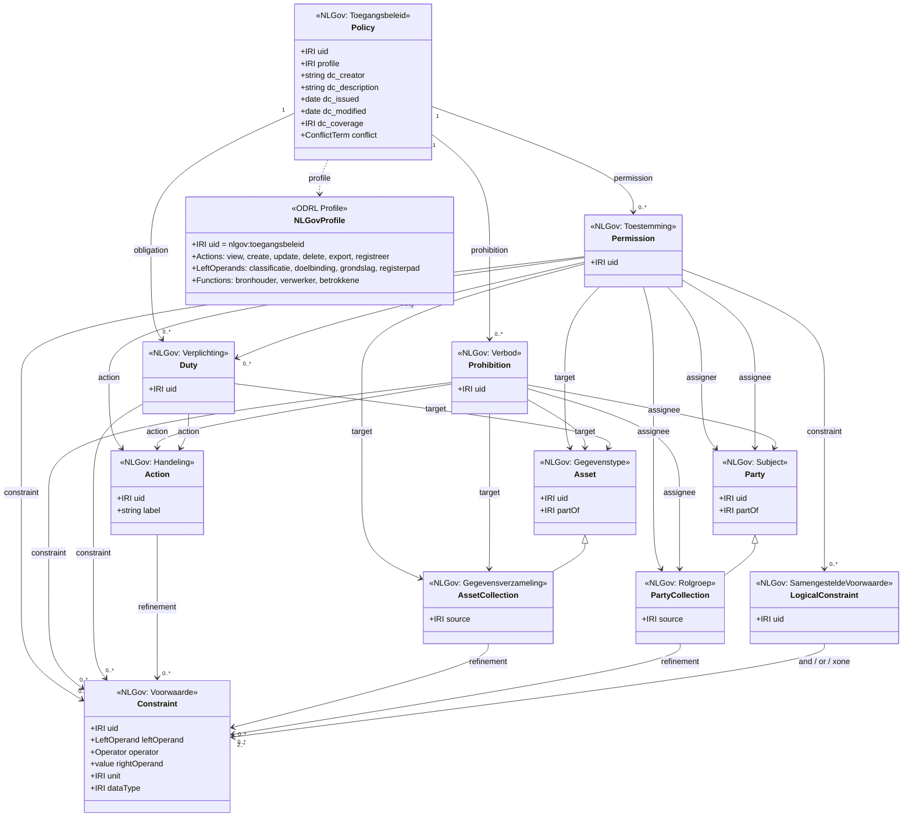

# ODRL-gebaseerd Register Toegangsbeleid — Ontwerp

**Datum:** 2026-04-12  
**Context:** FTV werkgroep, NLGov AuthZEN, aansluiting metamodel bitemporeel register  
**Bronnen:** W3C ODRL Information Model 2.2, Claude/Gemini-analyse, bestaande `autoriseren.md`  
**Vervolg:** `2026-08-18 ODRL 3.0 — W3C-workshop en gevolgen voor Toegangsspraak.md` (voorstellen voor ODRL 3.0 en de gevolgen voor deze subset)

---

## 1. Positionering

```
┌──────────────────────────────────────────────────────────┐
│                  Register Toegangsbeleid                  │
│              (ODRL — beschrijvend, semantisch)            │
│  "Wat zijn de afspraken? Wie mag wat, onder welke        │
│   voorwaarden, op basis van welke grondslag?"            │
└──────────────┬───────────────────────────────────────────┘
               │ vertaling naar
               ▼
┌──────────────────────────────────────────────────────────┐
│          Runtime Policy Engine (OPA/Cedar/XACML/…)       │
│              (uitvoerend, milliseconden)                  │
└──────────────┬───────────────────────────────────────────┘
               │ via
               ▼
┌──────────────────────────────────────────────────────────┐
│              NLGov AuthZEN interface                      │
│           (PEP ↔ PDP gestandaardiseerd)                  │
└──────────────────────────────────────────────────────────┘
```

Het Register Toegangsbeleid is **niet** de runtime-engine. Het is de **administratieve, auditeerbare bron** die beschrijft:
- Welke rechten en verboden er zijn
- Voor wie (rollen, organisaties, personen)
- Op welke gegevens (tot op veld-niveau)
- Onder welke voorwaarden (tijd, context, classificatie)
- Op basis van welke grondslag (wet, besluit, overeenkomst)

---

## 2. Benodigde ODRL-subset (NLGov Profiel)

### Wat we WEL nodig hebben (MVP)

| ODRL Klasse | Waarom | NLGov-mapping |
|---|---|---|
| **Policy** (Set) | Container voor beleid. Eén policy per domein/register/dienst | Toegangsbeleidsdocument |
| **Permission** | Wat mag: lezen, muteren, exporteren | Toestemming |
| **Prohibition** | Wat niet mag: verwijderen, inzien zonder grondslag | Verbod |
| **Duty** (via `obligation`) | Verplichtingen: logging, pseudonimisering, doel-binding | Verplichting |
| **Asset** | De gegevens waarop het beleid betrekking heeft | Representatietype, veld, register |
| **AssetCollection** + `refinement` | Subset van gegevens (bijv. "alle personen met BSN in bereik X") | Gegevensverzameling |
| **Party** | Wie: rol, organisatie, medewerker, systeem | Subject |
| **PartyCollection** + `refinement` | Subset van partijen (bijv. "medewerkers afdeling Schuldhulp") | Rolgroep |
| **Action** | CRUD + domeinspecifiek: `view`, `create`, `update`, `delete`, `export`, `registreer` | Handeling |
| **Constraint** | Voorwaarden: temporeel, attribuut-gebaseerd, classificatie | Voorwaarde |
| **LogicalConstraint** | Combinaties van voorwaarden (`and`, `or`) | Samengestelde voorwaarde |
| **Profile** | Identificatie van het NLGov-profiel | `nlgov:toegangsbeleid` |

### Wat we NIET nodig hebben (v1)

| ODRL Klasse/Feature | Reden om uit te stellen |
|---|---|
| **Offer** / **Agreement** subclasses | In v1 beschrijven we beleid als feit (Set), niet als aanbod/overeenkomst |
| **Consequence** / **Remedy** | Complexe duty-chains; in v1 volstaat eenvoudige obligation |
| **Policy Inheritance** (`inheritFrom`) | Nice-to-have, maar niet nodig voor MVP |
| **Compact Policy** | Serialisatie-optimalisatie, niet relevant voor het register zelf |
| **`implies`** / **`includedIn`** op Actions | Actie-hiërarchie is waardevol maar kan in v2 |
| **`status`** op Constraint | Runtime-tellerwaarden; het register is beschrijvend, niet uitvoerend |

---

## 3. UML Class Diagram — ODRL subset voor Register Toegangsbeleid



---

## 4. Aansluiting op het Metamodel (MetaRegistry)

Dit is waar de kracht zit: het metamodel van het bitemporeel register kan **direct** dienen als vocabulaire voor de ODRL Assets.

### Asset-mapping via MetaRegistry-paden

Het metamodel kent al een padstructuur voor representatietypes en velden:

```
NatuurlijkPersoon                          → entiteit (Asset)
NatuurlijkPersoon.Naam                     → gegevenselement (Asset)  
NatuurlijkPersoon.Naam.roepnaam            → veld (Asset, diepste niveau)
NatuurlijkPersoon.Bereikbaarheid           → relatie (Asset)
NatuurlijkPersoon.Bereikbaarheid.Locatie   → genest GE (Asset)
```

In het ODRL-register wordt het Asset dan:

```json
{
  "@type": "Asset",
  "uid": "nlgov:register:brp/NatuurlijkPersoon.Naam.roepnaam",
  "partOf": "nlgov:register:brp/NatuurlijkPersoon.Naam"
}
```

### Constraint-expressies met veldtypen

Het schema-API levert al veldtypen (string, integer, date, enum). Hiermee kunnen Constraints correct worden opgesteld:

```json
{
  "leftOperand": "nlgov:registerpad",
  "operator": "eq",
  "rightOperand": "NatuurlijkPersoon.Naam.achternaam"
}
```

Of dataset-expressies:
```json
{
  "leftOperand": { "@id": "nlgov:veldwaarde:NatuurlijkPersoon.Naam.achternaam" },
  "operator": "gteq",
  "rightOperand": "A",
  "dataType": "xsd:string"
}
```

### NLGov-profiel: custom vocabulaire

| Type | Term | Definitie |
|---|---|---|
| **Action** | `nlgov:view` | Inzien van gegevens (includedIn: `odrl:use`) |
| **Action** | `nlgov:create` | Aanmaken van gegevens (includedIn: `odrl:use`) |
| **Action** | `nlgov:update` | Wijzigen van gegevens (includedIn: `odrl:use`) |
| **Action** | `nlgov:delete` | Verwijderen van gegevens (includedIn: `odrl:use`) |
| **Action** | `nlgov:export` | Exporteren van gegevens (includedIn: `odrl:use`) |
| **Action** | `nlgov:registreer` | Formele registratie met audit trail (includedIn: `odrl:use`) |
| **LeftOperand** | `nlgov:classificatie` | Vertrouwelijkheidsniveau (bijv. BBN1/2/3) |
| **LeftOperand** | `nlgov:doelbinding` | Doel waarvoor gegevens worden verwerkt |
| **LeftOperand** | `nlgov:grondslag` | Wettelijke grondslag (IRI naar wet/artikel) |
| **LeftOperand** | `nlgov:registerpad` | Pad in het metamodel (bijv. `NP.Naam.roepnaam`) |
| **Function** | `nlgov:bronhouder` | Partij die het register beheert (subPropertyOf: `odrl:assigner`) |
| **Function** | `nlgov:verwerker` | Partij die gegevens verwerkt (subPropertyOf: `odrl:assignee`) |
| **Function** | `nlgov:betrokkene` | Persoon waarover de gegevens gaan |

---

## 5. Het register zelf bitemporeel opzetten

Het autorisatieregister kan zelf als bitemporeel register worden ingericht met dezelfde v06-architectuur:

### Entiteiten
- **Beleid** (Policy) — de entiteit
- **BeleidPermission** — GE bij Beleid (de individuele toestemmings-records)
- **BeleidProhibition** — GE bij Beleid
- **BeleidObligation** — GE bij Beleid

### Voordelen
- Formeel tijdreizen: "welke policies waren actief op moment t?" → audit trail
- Materieel tijdreizen: "welke policies gelden per toekomstige datum?" → bv. wet die per 1-1-2027 ingaat
- Registratie-mechanisme: policies worden geregistreerd via dezelfde `registreer`-handler
- Wijzigingen op policies worden als wijzigingen op representaties opgeslagen → volledige audit

### Mapping op MetaRegistry

| Representatietype | Metatype | Tabel | Kenmerken |
|---|---|---|---|
| `Beleid` | entiteit | `beleid` | uid, profile, description, conflict |
| `BeleidPermission` | gegevenselement | `beleid_permission` | FK: beleid_id, target_asset, action, assigner, assignee |
| `BeleidProhibition` | gegevenselement | `beleid_prohibition` | FK: beleid_id, target_asset, action |
| `BeleidObligation` | gegevenselement | `beleid_obligation` | FK: beleid_id, action |
| `BeleidConstraint` | gegevenselement | `beleid_constraint` | FK: beleid_id, leftOperand, operator, rightOperand |
| `Beleid_Aanvang` | materieel GE | `beleid_aanvang` | inwerkingtreding van het beleid |
| `Beleid_Einde` | materieel GE | `beleid_einde` | einde geldigheid van het beleid |

---

## 6. Concrete voorbeeld-policy

Een schuldhulpverlener mag inkomensgegevens inzien van een burger, mits er een lopend dossier is:

```json
{
  "@context": [
    "http://www.w3.org/ns/odrl.jsonld",
    { "nlgov": "https://standaarden.overheid.nl/odrl/terms/" }
  ],
  "@type": "Set",
  "uid": "https://register.overheid.nl/beleid:schuldhulp-inkomen-inzage",
  "profile": "https://standaarden.overheid.nl/odrl/profile/toegangsbeleid",
  "dc:description": "Schuldhulpverleners mogen inkomensgegevens inzien bij lopend dossier",
  "dc:issued": "2026-04-12",
  "dc:coverage": { "@id": "https://www.iso.org/obp/ui/#iso:code:3166:NL" },
  "permission": [{
    "target": {
      "@type": "Asset",
      "uid": "nlgov:register:brp/NatuurlijkPersoon.Inkomen"
    },
    "nlgov:bronhouder": "https://organisaties.overheid.nl/brp",
    "assignee": {
      "@type": "PartyCollection",
      "source": "https://organisaties.overheid.nl/rol/schuldhulpverlener"
    },
    "action": { "@id": "nlgov:view" },
    "constraint": [{
      "leftOperand": { "@id": "nlgov:doelbinding" },
      "operator": "eq",
      "rightOperand": "schuldhulpverlening"
    },
    {
      "leftOperand": { "@id": "nlgov:grondslag" },
      "operator": "eq",
      "rightOperand": { "@id": "https://wetten.overheid.nl/BWBR0024733" }
    }],
    "duty": [{
      "action": { "@id": "nlgov:log" },
      "constraint": [{
        "leftOperand": "event",
        "operator": "lt",
        "rightOperand": { "@id": "odrl:policyUsage" }
      }]
    }]
  }]
}
```

---

## 7. Gaps & aandachtspunten

### Opgelost door metamodel-integratie
- ✅ Asset-granulariteit tot veld-niveau via MetaRegistry-paden
- ✅ Correcte dataset-expressies via schema-API veldtypen
- ✅ Audit trail via bitemporeel register
- ✅ Formeel en materieel tijdreizen over policies

### Nog open / te onderzoeken

| Gap | Toelichting | Prio |
|---|---|---|
| **NLGov ODRL Profiel formaliseren** | RDF/OWL definitie van nlgov: termen; dit is het werkgroep-deliverable | Hoog |
| **Vertaallaag naar runtime** | Hoe wordt een ODRL-policy vertaald naar OPA Rego / Cedar / XACML? Handmatig? Geautomatiseerd? | Hoog |
| **Cross-register policies** | Policies die over meerdere registers gaan (bijv. BRP + Kadaster) — hoe verwijzen Assets cross-register? | Midden |
| **AuthZEN-koppeling** | Hoe leest de PDP het ODRL-register? Als JSON-LD API? Als PIP? | Midden |
| **Consent/betrokkene** | AVG-consent als ODRL Duty of als apart mechanisme? | Midden |
| **Delegatie** | Mandaatverlening (organisatie A delegeert recht aan organisatie B) — mogelijk via Policy Inheritance in v2 | Laag |
| **Temporal constraints** | ODRL heeft `dateTime` leftOperand; maar hoe koppel je dat aan de materiële tijd van het register? Opgewaardeerd na de W3C-workshop van juli 2026: ODRL 2.2 kent maar één evaluatiemoment, en 3.0-voorstellen (o.a. JP Morgan) vragen om een expliciete temporele laag. | Midden |

### Relatie met bestaande `autoriseren.md`
Het bestaande document in `autoriseren/autoriseren.md` is XACML-gebaseerd en beschrijft de runtime-kant (PxP, PDP evaluatie). Het ODRL-register is de **beschrijvende/administratieve laag erboven**. Beide vullen elkaar aan:

```
ODRL Register (beschrijvend)  →  vertaling  →  XACML/OPA/Cedar Policy (uitvoerend)
                                                       ↕
                                              NLGov AuthZEN (interface)
                                                       ↕
                                              Applicatie (PEP)
```

---

## 8. Antwoord op je vragen

### "Is het volledige ODRL model nodig?"
**Nee.** De subset hierboven dekt de MVP. Met name Offer/Agreement, Consequence/Remedy, Policy Inheritance en Compact Policy zijn niet nodig voor v1. Het ODRL Profile-mechanisme is wél cruciaal: dat is hoe je het NLGov-vocabulaire formaliseert.

### "Past het metamodel hier goed bij?"
**Ja, uitstekend.** De MetaRegistry-paden geven precies de Asset-granulariteit die je nodig hebt. De CEL-expressies die je al gebruikt voor afgeleide velden kunnen dezelfde rol vervullen als ODRL Constraint-expressies. Het schema-API levert de veldtypen die nodig zijn voor correcte `dataType`-annotaties.

### "Kan het autorisatieregister zelf bitemporeel?"
**Ja.** Het past naadloos in de v06-architectuur. Policies worden entiteiten, rules worden GE's, en je krijgt gratis formeel en materieel tijdreizen over je autorisatiebeleid.

### "Gaat context verloren bij omschakelen van Agent naar Plan?"
In VS Code Copilot Chat: **ja, als je een nieuw gesprek start is de context weg.** Maar als je binnen hetzelfde gesprek wisselt van modus, blijft de context behouden. Dit document dient als persistente context ongeacht welke modus je gebruikt.
