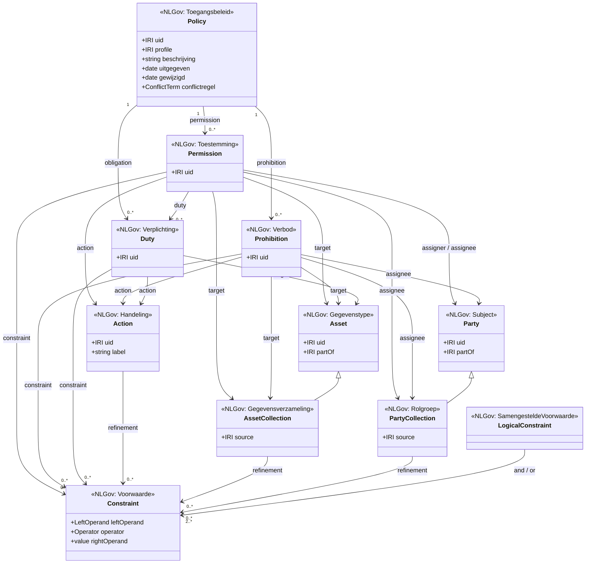
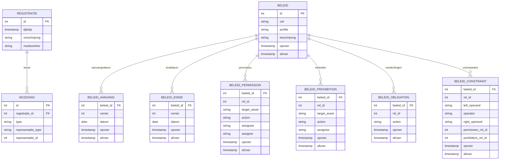

# Whitepaper: Een Bitemporeel Register Toegangsbeleid op basis van ODRL

**Versie:** 0.9 (concept)
**Datum:** 12 april 2026
**Context:** Werkgroep FTV (Federatieve Toegang & Verantwoording), NLGov AuthZEN, Common Ground
**Doelgroep:** Beleidsmakers, informatiearchitecten, softwareleveranciers in het Common Ground-ecosysteem

---

## Managementsamenvatting

De Nederlandse overheid wisselt steeds meer gegevens uit tussen organisaties. Tegelijk nemen de eisen toe: de AVG vereist transparantie, auditors willen herleidbaarheid, en burgers verwachten dat hun gegevens alleen worden ingezien met een geldige grondslag.

Dit whitepaper beschrijft een architectuurvoorstel voor een **Register Toegangsbeleid** — een gestandaardiseerde, auditeerbare bron waarin wordt vastgelegd *wie*, *wat*, *waarom* en *onder welke voorwaarden* mag doen met gegevens in overheidsregisters. Het combineert drie ingrediënten:

1. **ODRL** (Open Digital Rights Language) — een W3C-standaard om rechten, verboden en verplichtingen machine-leesbaar vast te leggen.
2. **Bitemporaliteit** — een registratiepatroon dat zowel de *formele* (wanneer is iets geregistreerd?) als de *materiële* (wanneer geldt iets?) tijdsdimensie bijhoudt, zodat er een volledige, onvervalsbare audit trail ontstaat.
3. **NLGov AuthZEN** — de reeds vastgestelde interfacestandaard tussen de applicatie die toegang vraagt (PEP) en de beslismodule (PDP).

De kern van het voorstel: **scheid het beschrijven van beleid van het afdwingen ervan.** Het register is de administratieve, semantische bron van waarheid. De runtime-engine (OPA, Cedar, XACML, of een ander product) is de afdwinger. Beide zijn via een standaardinterface verbonden. Leveranciers behouden keuzevrijheid in hun technische stack; de standaard zit in het *beschrijvingsformaat* en de *interface*.

---

## 1. Het probleem

### 1.1 Fragmentatie in Access Management

Binnen het Common Ground-ecosysteem en de bredere overheid is autorisatie vandaag een **lokale aangelegenheid**. Elke applicatie, elk register en elke leverancier implementeert toegangsregels op een eigen manier:

- De ene applicatie gebruikt RBAC (Role Based Access Control) met rollen in een LDAP-directory.
- De andere gebruikt hardcoded checks in de broncode.
- Weer een andere heeft een eigen beleidsengine met een propriëtaire DSL.

Dit leidt tot drie concrete problemen:

| Probleem | Gevolg |
|----------|--------|
| **Geen uniform beleidsbeschrijvingsformaat** | Vergelijking, audit en overdracht van toegangsbeleid tussen organisaties is niet mogelijk |
| **Geen scheiding tussen beleid en afdwinging** | Leverancierswissels betekenen dat alle autorisatieregels opnieuw moeten worden opgesteld |
| **Geen tijdsreizen over beleid** | De vraag "welk beleid gold op 1 januari 2025?" is niet beantwoordbaar; correcties overschrijven het verleden |

### 1.2 Toenemende wettelijke en normatieve druk

De AVG (Algemene Verordening Gegevensbescherming) eist dat organisaties kunnen aantonen:
- Op welke **grondslag** gegevens worden verwerkt.
- Voor welk **doel** ze worden verwerkt (doelbinding).
- Wie er **feitelijk toegang** had (en had mogen hebben) op enig moment in het verleden.

De BIO (Baseline Informatiebeveiliging Overheid) vereist dat autorisaties aantoonbaar zijn vastgelegd en periodiek worden gereviewed. Auditors van de Rekenkamer en interne controle-afdelingen verwachten een herleidbare "keten van waarheid" van wet → beleid → technische regel → feitelijke toegang.

### 1.3 De wens: keuzevrijheid in de stack, uniformiteit in de afspraken

De werkgroep FTV heeft in het voorafgaande jaar de **NLGov AuthZEN**-standaard vastgesteld: een gestandaardiseerde interface tussen de applicatie (PEP — Policy Enforcement Point) en de beslismodule (PDP — Policy Decision Point). Daarmee is de *afdwingingskant* gestandaardiseerd.

Wat ontbreekt, is de **beschrijvingskant**: een standaardformaat voor het vastleggen van beleid, zodat:
- Leveranciers het beleid kunnen lezen, ongeacht de runtime-engine die ze aanbieden.
- Gemeenten hun beleid kunnen overdragen naar een andere leverancier.
- Auditors het beleid kunnen inzien zonder door technische implementatiedetails te hoeven bladeren.
- Beleidsmakers het beleid kunnen opstellen en reviewen in een begrijpelijk formaat.

---

## 2. De voorgestelde architectuur

### 2.1 Drie lagen

Het voorstel kent drie architectuurlagen die elk een eigen verantwoordelijkheid hebben:

```
┌──────────────────────────────────────────────────────────────┐
│   Laag 1: Register Toegangsbeleid                            │
│   ─────────────────────────────────────                      │
│   Beschrijvend, semantisch. ODRL + NLGov Profiel.            │
│   "Wie mag wat, onder welke voorwaarden, op welke grondslag?"│
│   Bitemporeel: volledige audit trail met formeel en          │
│   materieel tijdreizen.                                      │
└──────────────────┬───────────────────────────────────────────┘
                   │  vertaling (geautomatiseerd of handmatig)
                   ▼
┌──────────────────────────────────────────────────────────────┐
│   Laag 2: Runtime Policy Engine                              │
│   ─────────────────────────────                              │
│   OPA/Rego, Cedar, XACML, of ander product.                 │
│   Vrije keuze van de leverancier.                            │
│   Milisecondenrespons.                                       │
└──────────────────┬───────────────────────────────────────────┘
                   │  via gestandaardiseerde interface
                   ▼
┌──────────────────────────────────────────────────────────────┐
│   Laag 3: NLGov AuthZEN Interface                            │
│   ─────────────────────────────                              │
│   PEP ↔ PDP gestandaardiseerd.                              │
│   Applicatie vraagt: "mag dit subject deze actie op deze     │
│   resource?" en krijgt Permit / Deny terug.                  │
└──────────────────────────────────────────────────────────────┘
```

**De standaard zit in laag 1 en laag 3. Laag 2 is vrij.** Dit geeft leveranciers volledige keuzevrijheid in hun technische stack, terwijl het beleid overdraagbaar en auditeerbaar is.

### 2.2 De PxP-architectuur

Het toegangsbeheer volgt het PxP-patroon (Policy x Point), dat al jaren de standaard is in enterprise access management:

| Component | Rol | In deze architectuur |
|-----------|-----|---------------------|
| **PAP** (Policy Administration Point) | Het beheren van beleid: aanmaken, wijzigen, reviewen, publiceren | Het Register Toegangsbeleid zelf |
| **PIP** (Policy Information Point) | Het leveren van contextuele informatie aan de beslisser | Metadata uit de schema-API, identiteitsgegevens |
| **PDP** (Policy Decision Point) | Het nemen van de beslissing (Permit/Deny) | De runtime-engine (OPA, Cedar, etc.) |
| **PEP** (Policy Enforcement Point) | Het afdwingen van de beslissing in de applicatie | De applicatie / API-gateway |

Het Register Toegangsbeleid is dus primair de **PAP**: de plek waar beleid wordt vastgelegd en beheerd. Het fungeert daarnaast als **PIP** voor de PDP, die er de geldende policies uit ophaalt.

---

## 3. Waarom ODRL?

### 3.1 Wat is ODRL?

ODRL (Open Digital Rights Language) is een W3C Recommendation (versie 2.2, februari 2018) voor het beschrijven van rechten, verboden en verplichtingen op digitale bronnen. Oorspronkelijk ontwikkeld voor Digital Rights Management, maar bewust zo generiek ontworpen dat het geschikt is voor elk domein waarin je wilt vastleggen wie wat mag.

De kernstructuur is eenvoudig:

> Een **Policy** bevat **Regels** (Permissions, Prohibitions, Duties). Elke regel betreft een **Actie** op een **Asset** door een **Partij**, eventueel onder **Constraints** (voorwaarden).

### 3.2 Waarom ODRL en niet XACML, OPA of Cedar?

Dit is een cruciale keuze die het voorstel onderscheidt van eerdere initiatieven:

| Criterium | ODRL | XACML | OPA/Rego | Cedar |
|-----------|------|-------|----------|-------|
| **Doel** | Beleid *beschrijven* (semantisch) | Beleid *evalueren* (runtime) | Beleid *evalueren* (runtime) | Beleid *evalueren* (runtime) |
| **Formaat** | JSON-LD / RDF (linked data) | XML | Rego (eigen taal) | Cedar (eigen taal) |
| **Standaard** | W3C Recommendation | OASIS Standard | Open source (CNCF) | Open source (AWS) |
| **Uitbreidbaarheid** | Via **Profiles**: eigen vocabulaire toevoegen | Via functies en attributen | Via functies en data | Via entity types |
| **Machine-leesbaar** | Ja (linked data) | Ja (XML schema) | Ja (AST) | Ja (AST) |
| **Mens-leesbaar** | Redelijk (JSON-LD met labels) | Slecht (verbose XML) | Matig | Goed |
| **Geschikt als register** | **Ja** — beschrijvend, declaratief | Nee — evaluatie-gericht | Nee — evaluatie-gericht | Nee — evaluatie-gericht |

**ODRL is geen concurrent van OPA, Cedar of XACML; het is de beschrijvende laag die erboven zit.** Een ODRL-policy beschrijft *wat* het beleid is. De runtime-engine *voert het uit*. Dit is hetzelfde verschil als tussen een wet en de rechterlijke uitspraak die de wet toepast: de wet is de beschrijving, de uitspraak is de evaluatie.

### 3.3 Het ODRL Profile-mechanisme

Een van de sterkste eigenschappen van ODRL is het **Profile-mechanisme**. Een profiel breidt de standaard uit met domeinspecifieke termen zonder de kern te wijzigen. Het is exact de manier waarop de Nederlandse overheid haar eigen vocabulaire kan definiëren:

```
W3C ODRL 2.2 (kern)
    │
    └── NLGov ODRL Profiel (uitbreiding)
            │
            ├── nlgov:view, nlgov:create, nlgov:update, nlgov:delete  (acties)
            ├── nlgov:grondslag, nlgov:doelbinding, nlgov:classificatie (voorwaarden)
            ├── nlgov:bronhouder, nlgov:verwerker (rollen)
            └── nlgov:registerpad (verwijzing naar velden in registers)
```

Dit profiel wordt als formele RDF/OWL-specificatie gepubliceerd. Alle leveranciers en systemen die ODRL kunnen lezen, kunnen daarmee automatisch ook het NLGov-profiel interpreteren.

### 3.4 Voorbeeld: een concreet beleid in ODRL

Om de abstractie tastbaar te maken, hier een voorbeeld dat zowel beleidsmakers als architecten herkennen:

**Beleidsbesluit:** *"Schuldhulpverleners mogen inkomensgegevens van een natuurlijk persoon inzien, mits er een lopend dossier is en de verwerking plaatsvindt op grondslag van de Wet gemeentelijke schuldhulpverlening. Elke raadpleging moet worden gelogd."*

In ODRL (JSON-LD):
```json
{
  "@context": [
    "http://www.w3.org/ns/odrl.jsonld",
    { "nlgov": "https://standaarden.overheid.nl/odrl/terms/" }
  ],
  "@type": "Set",
  "uid": "urn:nlgov:beleid:schuldhulp-inkomen-inzage",
  "profile": "https://standaarden.overheid.nl/odrl/profile/toegangsbeleid",
  "dc:description": "Schuldhulpverleners mogen inkomensgegevens inzien bij lopend dossier",
  "dc:issued": "2026-04-12",
  "permission": [{
    "target": "nlgov:register:brp/NatuurlijkPersoon.Inkomen",
    "assignee": "nlgov:rol:schuldhulpverlener",
    "action": "nlgov:view",
    "constraint": [
      {
        "leftOperand": "nlgov:doelbinding",
        "operator": "eq",
        "rightOperand": "schuldhulpverlening"
      },
      {
        "leftOperand": "nlgov:grondslag",
        "operator": "eq",
        "rightOperand": "https://wetten.overheid.nl/BWBR0024733"
      }
    ],
    "duty": [{
      "action": "nlgov:log"
    }]
  }]
}
```

Lees dit als: *Er is een toestemming (permission) voor de rol schuldhulpverlener (assignee) om inkomensgegevens (target) in te zien (action: view), onder de voorwaarden (constraints) dat het doel schuldhulpverlening is en de wettelijke grondslag de Wgs is, met de verplichting (duty) om elke raadpleging te loggen.*

Een beleidsmaker kan dit lezen en verifiëren. Een machine kan het interpreteren en vertalen naar de runtime-engine.

---

## 4. Waarom bitemporeel?

### 4.1 Het fundamentele probleem: beleid verandert óók

Toegangsbeleid is niet statisch. Wetten veranderen, organisatiestructuren wijzigen, en soms worden fouten in beleid gecorrigeerd. De meeste systemen kennen maar twee toestanden: het *huidige* beleid en het *vorige* beleid (als dat al wordt bewaard). 

Maar een auditor vraagt: *"Welk beleid gold op 15 maart 2025 om 14:00?"* En een privacy officer vraagt: *"Wie had er op dat moment toegang tot de inkomensgegevens van burger X, en op welke grondslag?"*

Om deze vragen te beantwoorden heb je twee onafhankelijke tijdsdimensies nodig:

| Dimensie | Vraag | Voorbeeld |
|----------|-------|-----------|
| **Formele tijd** (registratietijd) | Wanneer is dit beleid *vastgelegd* in het register? | "Dit beleid is op 1 april 2026 om 09:00 geregistreerd" |
| **Materiële tijd** (geldigheidstijd) | Vanaf wanneer *geldt* dit beleid in de werkelijkheid? | "Dit beleid geldt vanaf 1 mei 2026" |

### 4.2 Vier scenario's die bitemporaliteit vereisen

**Scenario 1: Reguliere beleidswijziging**
> Per 1 januari 2027 treedt een wetswijziging in werking. Het nieuwe beleid wordt op 1 oktober 2026 geregistreerd met materiële aanvang 1 januari 2027. Tot die datum geldt het oude beleid. Na die datum het nieuwe. Beide staan in het register — met hun respectieve tijdvensters.

**Scenario 2: Correctie van een fout**
> Op 15 maart ontdekt men dat een beleid ten onrechte de rol "medewerker P&O" toegang gaf tot medische gegevens. Het beleid wordt gecorrigeerd (afgevoerd en vervangen). Dankzij formele tijdregistratie is zichtbaar *wanneer* de correctie plaatsvond, en *welk* beleid daarvoor gold. De audit trail is volledig intact.

**Scenario 3: Audit achteraf**
> De Rekenkamer onderzoekt in 2027 of het toegangsbeleid in 2025 correct was. Door formeel tijdreizen naar de registratie-toestand van 31 december 2025 kan exact worden gereconstrueerd welk beleid op dat moment gold — inclusief eventuele correcties die later zijn aangebracht.

**Scenario 4: Cross-register beleid**
> Een gemeente heeft beleid dat zowel BRP-gegevens als Kadaster-gegevens betreft. Beide registers hebben hun eigen beleidslijnen met eigen tijdsvensters. Dankzij de bitemporele architectuur kunnen deze onafhankelijk worden beheerd én gecombineerd bevraagd.

### 4.3 Hoe werkt dit concreet?

In een bitemporeel register worden wijzigingen **niet** verwerkt door overschrijven. In plaats daarvan wordt bij elke wijziging een **registratie** aangemaakt met één of meer **wijzigingen**, die elk het op- of afvoeren van gegevensrecords beschrijven.

```
Registratie (formeel tijdstip: 2026-04-12 09:00)
  └── Wijziging 1: opvoer beleid "schuldhulp-inkomen-inzage"
  └── Wijziging 2: opvoer aanvang "schuldhulp-inkomen-inzage" (datum: 2026-05-01)

Registratie (formeel tijdstip: 2026-10-01 10:00)
  └── Wijziging 1: afvoer beleid "schuldhulp-inkomen-inzage" (oude versie)
  └── Wijziging 2: opvoer beleid "schuldhulp-inkomen-inzage" (bijgewerkte versie)
  └── Wijziging 3: opvoer aanvang bijgewerkte versie (datum: 2027-01-01)
```

**Het resultaat:** op elk formeel tijdstip — verleden, heden of toekomst — kan exact worden bepaald welk beleid materieel gold. Er gaat nooit informatie verloren.

---

## 5. Aansluiting op het Common Ground-ecosysteem

### 5.1 Positionering ten opzichte van de Referentie Architectuur

De Referentie Architectuur Common Ground Registers (RA-CG) beschrijft een generiek patroon voor registers in het Common Ground-landschap. Dit voorstel past als volgt in dat patroon:

| RA-CG concept | Invulling Register Toegangsbeleid |
|---------------|----------------------------------|
| Register | Het Register Toegangsbeleid zelf |
| Data-object | ODRL Policy (beleidsdocument) |
| Stable ID | Uniek beleid-ID (IRI) |
| State | De inhoud van het beleid (rules, assets, parties) |
| Wijzigingshistorie | Bitemporeel: variant 3 (formeel + materieel) — consequent |
| API | REST API conform NL API Strategie (ADR 2.1.0) |
| Metadata-API | Schema-API die het metamodel exporteert |
| PBAC/RBAC | Het register **is** de bron voor PBAC — het beschrijft het beleid dat elders wordt afgedwongen |

### 5.2 Metadata-gedreven architectuur

Een belangrijk kenmerk van het voorstel is dat het register **metadata-gedreven** is. Een centrale MetaRegistry beschrijft alle typen in het model: hun structuur, relaties, database-mapping, URL-paden en onderliggende gegevenselementen. Dit heeft drie concrete voordelen:

1. **Geen hardcoded structuren.** Routes, handlers, formulieren en schema-exports worden dynamisch gegenereerd uit de MetaRegistry. Het toevoegen van een nieuw beleidstype vereist geen code-aanpassingen in routes of handlers.

2. **Schema-API als contract.** De MetaRegistry wordt via een schema-API (`/schema/model`) geëxporteerd. Zowel de eigen frontend als externe systemen kunnen deze API gebruiken om dynamisch formulieren, validaties of vertalingen te genereren.

3. **Asset-granulariteit tot veldniveau.** De MetaRegistry kent al een padstructuur die representatietypes en velden beschrijft. Deze paden fungeren direct als ODRL Asset-identifiers:

```
NatuurlijkPersoon                           → entiteit (heel register-object)
NatuurlijkPersoon.Naam                      → gegevenselement (groep velden)
NatuurlijkPersoon.Naam.roepnaam             → specifiek veld
NatuurlijkPersoon.Bereikbaarheid.Locatie    → genest gegevenselement
```

Hierdoor kan beleid worden opgesteld op precies het juiste granulariteitsniveau — van "toegang tot het hele register" tot "alleen het veld roepnaam".

### 5.3 Integratie met bestaande Common Ground-componenten

| Component | Integratiepunt |
|-----------|---------------|
| **NLGov AuthZEN** | Het register levert de beleidsgegevens die de PDP nodig heeft om een beslissing te nemen |
| **FSC** (Federated Service Connectivity) | Beleid over federatieve gegevensuitwisseling kan in hetzelfde register worden vastgelegd |
| **Haven+** | Het register kan als container worden gedeployed conform de Haven-specificatie |
| **Open Notificaties** | Beleidswijzigingen kunnen als notificaties worden gepubliceerd, zodat afnemende systemen hun lokale policy caches kunnen herladen |
| **Haal Centraal API's** | De Asset-paden in het beleid verwijzen naar de gegevens die via Haal Centraal BRP (en vergelijkbare API's) worden ontsloten |

### 5.4 NL API Strategie conformiteit

Het register volgt de NL API Design Rules (ADR 2.1.0, Logius-standaard). Dit betekent onder meer:
- RESTful API met JSON als standaard formaat
- Versionering conform de strategie
- Correcte gebruik van HTTP-methodes en statuscodes
- Gestandaardiseerde foutafhandeling
- Paginering en filtering conform de richtlijnen

---

## 6. Het NLGov ODRL Profiel

### 6.1 Wat is een ODRL Profiel?

Een ODRL Profile is een formele uitbreiding van de ODRL-vocabulaire voor een specifiek toepassingsdomein. Het voegt nieuwe termen toe (acties, voorwaarden, rollen) als subklassen of sub-properties van de bestaande ODRL-termen, zonder de kern te wijzigen. Het profiel wordt gepubliceerd als RDF/OWL-specificatie.

### 6.2 Voorgestelde NLGov-termen

#### Acties

| NLGov-term | ODRL-parent | Betekenis |
|------------|------------|-----------|
| `nlgov:view` | `odrl:use` | Inzien van gegevens |
| `nlgov:create` | `odrl:use` | Aanmaken van gegevens |
| `nlgov:update` | `odrl:use` | Wijzigen van gegevens |
| `nlgov:delete` | `odrl:use` | Verwijderen van gegevens |
| `nlgov:export` | `odrl:use` | Exporteren van gegevens |
| `nlgov:registreer` | `odrl:use` | Formele registratie met audit trail |

#### Voorwaarden (LeftOperands)

| NLGov-term | Betekenis | Voorbeeld |
|------------|-----------|-----------|
| `nlgov:classificatie` | Vertrouwelijkheidsniveau (BBN) | `BBN2` |
| `nlgov:doelbinding` | Verwerkingsdoel conform AVG | `schuldhulpverlening` |
| `nlgov:grondslag` | Wettelijke grondslag (als IRI naar wetten.overheid.nl) | `https://wetten.overheid.nl/BWBR0024733` |
| `nlgov:registerpad` | Pad in het metamodel van het bronregister | `NP.Naam.roepnaam` |

#### Functies (rollen)

| NLGov-term | ODRL-parent | Betekenis |
|------------|------------|-----------|
| `nlgov:bronhouder` | `odrl:assigner` | Organisatie die het bronregister beheert |
| `nlgov:verwerker` | `odrl:assignee` | Partij die gegevens verwerkt |
| `nlgov:betrokkene` | — | De persoon waarover de gegevens gaan |

### 6.3 Formalisering

Het NLGov ODRL Profiel wordt gepubliceerd als:
1. **RDF/OWL-specificatie** op `standaarden.overheid.nl` — de formele, machine-leesbare definitie.
2. **JSON-LD Context** — een context-bestand dat systemen kunnen importeren om de NLGov-termen te interpreteren.
3. **Menselijke documentatie** — een leesbare specificatie met voorbeelden en richtlijnen.

---

## 7. Voordelen

### 7.1 Voor beleidsmakers en bestuurders

| Voordeel | Toelichting |
|----------|------------|
| **Eenduidigheid** | Er is één gestandaardiseerd format voor toegangsbeleid, onafhankelijk van de leverancier |
| **AVG-verantwoording** | Grondslag en doelbinding zijn als verplichte constraints in het beleid opgenomen. Auditors kunnen direct zien op welke basis toegang is verleend |
| **Transparantie** | Beleidsmakers kunnen het beleid lezen en verifiëren — het is geen ontoegankelijke technische configuratie meer |
| **Overdraagbaarheid** | Bij een leverancierswisseling gaat het beleid mee — het is vastgelegd in een open standaard |
| **Tijdreizen** | De vraag "welk beleid gold op een bepaald moment?" is altijd beantwoordbaar, ook na correcties |
| **Toekomstbestendig** | Nieuwe wet- en regelgeving kan als beleid met een toekomstige aanvangsdatum worden geregistreerd — het systeem is er al klaar voor |

### 7.2 Voor architecten en leveranciers

| Voordeel | Toelichting |
|----------|------------|
| **Keuzevrijheid in de runtime-engine** | Het register schrijft niet voor welke engine je gebruikt. OPA, Cedar, XACML, of een eigen oplossing — zolang de NLGov AuthZEN interface wordt ondersteund |
| **Standaard interfacing** | Eén manier om beleid uit te wisselen (ODRL JSON-LD) en één manier om het af te dwingen (NLGov AuthZEN). Geen bilaterale koppelingen meer |
| **Metadata-gedreven** | Het register exporteert zijn eigen structuur via een schema-API. Frontends, validatietools en vertaallagen kunnen dynamisch aansluiten |
| **Linked Data / semantic web** | ODRL is gebaseerd op RDF/JSON-LD. Dit maakt het register inherent koppelbaar met andere semantische bronnen (wetten.overheid.nl, organisaties.overheid.nl, MIM-modellen) |
| **Granulaire Assetsturing** | Beleid kan worden opgesteld per register, per objecttype, per gegevensgroep, of per individueel veld. De MetaRegistry-paden geven de bodem |
| **Profielmechanisme** | Het NLGov Profiel is uitbreidbaar. Een domein (bijv. Zorg, Jeugd, Schuldhulpverlening) kan eigen termen toevoegen als sub-profiel, zonder de kern te wijzigen |
| **Audit trail zonder compromis** | Bitemporaliteit garandeert dat er nooit informatie verloren gaat. Elke wijziging, correctie of intrekking is herleidbaar naar een registratie met een formeel tijdstip |

### 7.3 Specifiek voor het Common Ground-ecosysteem

| Voordeel | Toelichting |
|----------|------------|
| **Hergebruik van registerpatronen** | Het Register Toegangsbeleid kan op dezelfde architectuur draaien als andere Common Ground-registers (RA-CG variant 3), waardoor het tooling, monitoringspatronen en deploymentprocedures deelt |
| **Federatief beleidsbeheer** | Via ODRL kunnen meerdere organisaties hun beleid in eigen registers beheren, terwijl een gezamenlijke vertaallaag de runtime-engines voedt. Dit past bij het "data bij de bron"-principe van Common Ground |
| **Aansluiting op bestaande standaarden** | Het voorstel bouwt voort op bestaande NLGov-standaarden (AuthZEN, ADR, FSC) en W3C-standaarden (ODRL, JSON-LD). Er hoeft geen volledig nieuwe standaard te worden ontworpen |

---

## 8. Risico's en aandachtspunten

### 8.1 Uitdagingen

| Uitdaging | Toelichting | Mitigatie |
|-----------|------------|-----------|
| **Vertaallaag ODRL → runtime** | Het vertalen van een ODRL-policy naar OPA Rego, Cedar of XACML is niet triviaal. De semantische nuances van de brontaal moeten correct worden vertaald | Start met een beperkte, goed gedefinieerde subset (het NLGov Profiel). Automatiseer de vertaling voor de meestgebruikte engines. Valideer via round-trip tests |
| **Complexiteit van linked data** | JSON-LD en RDF zijn krachtig maar niet eenvoudig. Niet elke ontwikkelaar is ermee vertrouwd | Bied een **simplified JSON-weergave** naast de volledige JSON-LD. De schema-API kan beide formaten leveren |
| **Adoptie** | Een standaard is alleen waardevol als hij wordt gebruikt. De leercurve en de benodigde tooling-investering moeten laag zijn | Lever referentie-implementaties, voorbeeldbeleid, en tooling (validator, editor, vertaler). Integreer in bestaande Common Ground-tooling |
| **Performance** | Bitemporaliteit voegt complexiteit toe aan queries. Het ophalen van het geldende beleid op een bepaald moment vereist tijdfiltering | Gebruik materialized views of caching voor de actuele toestand. De bitemporele laag is voor audit, niet voor elke real-time beslissing |
| **Governance** | Wie beheert het NLGov ODRL Profiel? Wie beslist over nieuwe termen? | Het profiel wordt beheerd door de FTV werkgroep (of een opvolgende governance-structuur), conform het standaardisatieproces van Forum Standaardisatie |

### 8.2 Wat dit voorstel NIET is

Het is belangrijk expliciet te zijn over de grenzen:

- **Geen runtime-engine.** Het register evalueert geen toegangsverzoeken. Dat doet de PDP.
- **Geen identiteitsprovider.** Het register verwijst naar partijen (rollen, organisaties) maar beheert geen identiteiten. Dat doen IAM-systemen (Keycloak, Azure AD, etc.).
- **Geen consent-management tool.** AVG-consent kan worden gemodelleerd als ODRL Duty, maar het register vervangt geen dedicated consent-management systeem.
- **Geen vervanging van bestaande autorisatiepatronen.** RBAC, ABAC en andere patronen blijven bruikbaar. Het register biedt een *beschrijving* van die patronen in een uitwisselbaar formaat.

---

## 9. Roadmap

### Fase 1: Fundament (NLGov ODRL Profiel)

| Stap | Deliverable |
|------|------------|
| Formaliseer het NLGov ODRL Profiel | RDF/OWL-specificatie + JSON-LD context |
| Definieer de MVP-subset van ODRL | Policy (Set), Permission, Prohibition, Duty, Asset, Party, Action, Constraint |
| Publiceer voorbeeld-policies | Minimaal 3 representatieve beleidscenario's (schuldhulpverlening, BRP-inzage, cross-register) |
| Validatietooling | SHACL-shapes of JSON Schema om te valideren dat policies conform het profiel zijn |

### Fase 2: Proof of concept (Bitemporeel Register)

| Stap | Deliverable |
|------|------------|
| Implementeer Policy als bitemporele entiteit | MetaRegistry-entry, schema, tabel |
| Implementeer Permission/Prohibition/Obligation als gegevenselementen | Onderliggende GE's met FK-relatie |
| Formeel en materieel tijdreizen over policies | GET-API met `?t=` parameter |
| Schema-API voor het autorisatiedomein | `/schema/model` exporteert het beleidsmodel |

### Fase 3: Vertaallaag en integratie

| Stap | Deliverable |
|------|------------|
| Vertaler ODRL → OPA/Rego | Geautomatiseerde conversie van NLGov ODRL naar Rego-bestanden |
| Vertaler ODRL → Cedar (optioneel) | Idem voor Cedar |
| Koppeling met NLGov AuthZEN | PDP leest beleid uit het register; PEP bevraagt PDP via AuthZEN |
| Open Notificaties bij beleidswijzigingen | Publicatie van mutatie-events bij opvoer/afvoer van beleid |

### Fase 4: Productie en adoptie

| Stap | Deliverable |
|------|------------|
| Haven+-deployment | Container-ready versie voor Common Ground-infrastructuur |
| Beheerinterface | Webapplicatie voor beheerders om beleid te bekijken, reviewen en registreren |
| Pilotproject | Implementatie bij minimaal één gemeente in samenwerking met een leverancier |
| Governance | Overdracht beheerprofiel naar Forum Standaardisatie of VNG-beheerorganisatie |

---

## 10. Conclusie

De Nederlandse overheid heeft behoefte aan een gestandaardiseerde, transparante en auditeerbare manier om toegangsbeleid vast te leggen. Het huidige landschap is gefragmenteerd: elke leverancier implementeert autorisatie op een eigen manier, en er is geen gemeenschappelijke taal om beleid over organisaties heen uit te wisselen.

Dit whitepaper stelt een architectuur voor die drie bestaande bouwstenen combineert:

- **ODRL** als beschrijvingstaal voor beleid — een bewezen W3C-standaard, uitbreidbaar via het NLGov Profiel.
- **Bitemporaliteit** als registratiepatroon — zodat er nooit informatie verloren gaat en elke beleidssituatie op elk moment kan worden gereconstrueerd.
- **NLGov AuthZEN** als interfacestandaard — zodat de afdwinging gestandaardiseerd is, ongeacht de gekozen runtime-engine.

Het resultaat is een register waarin beleid machineleesbaar, mensleesbaar en volledig auditeerbaar is vastgelegd. Leveranciers behouden keuzevrijheid in hun technische stack. Gemeenten behouden eigenaarschap over hun beleid. En auditors kunnen op elk moment vaststellen welk beleid gold — en of dat beleid correct was.

De vraag is niet langer *of* we een gestandaardiseerd register voor toegangsbeleid nodig hebben. De vraag is hoe snel we het realiseren.

---

## Referenties

| Bron | URL |
|------|-----|
| W3C ODRL Information Model 2.2 | https://www.w3.org/TR/odrl-model/ |
| W3C ODRL Vocabulary & Expression 2.2 | https://www.w3.org/TR/odrl-vocab/ |
| NLGov AuthZEN | Werkgroep FTV documentatie |
| Referentie Architectuur Common Ground Registers | VNG werkdocument, concept 9 februari 2026 |
| NL API Design Rules (ADR 2.1.0) | https://logius-standaarden.github.io/API-Design-Rules/ |
| XACML 3.0 | http://docs.oasis-open.org/xacml/3.0/ |
| OPA (Open Policy Agent) | https://www.openpolicyagent.org/ |
| Cedar | https://www.cedarpolicy.com/ |
| AVG (GDPR) | https://eur-lex.europa.eu/eli/reg/2016/679/oj |
| BIO (Baseline Informatiebeveiliging Overheid) | https://bio-overheid.nl/ |

---

## Bijlage A: Mermaid UML — ODRL-subset voor Register Toegangsbeleid



## Bijlage B: Bitemporeel datamodel voor het Register Toegangsbeleid



## Bijlage C: Positionering in de Common Ground-stack

```
┌─────────────────────────────────────────────────────────────────┐
│                          Gemeente                               │
│                                                                 │
│  ┌─────────────┐    ┌──────────────┐    ┌────────────────────┐ │
│  │ Taak-       │    │ Register     │    │ Register           │ │
│  │ applicatie  │◄──►│ (BRP, etc.)  │    │ Toegangsbeleid     │ │
│  │ (PEP)       │    │              │    │ (ODRL, bitemporeel)│ │
│  └──────┬──────┘    └──────────────┘    └────────┬───────────┘ │
│         │                                         │             │
│         │ NLGov AuthZEN                           │ ODRL JSON-LD│
│         ▼                                         ▼             │
│  ┌──────────────┐                        ┌────────────────────┐ │
│  │ PDP          │◄───────────────────────│ Vertaallaag        │ │
│  │ (OPA/Cedar/  │    runtime policies    │ ODRL → runtime     │ │
│  │  XACML/...)  │                        └────────────────────┘ │
│  └──────────────┘                                               │
│                                                                 │
│  ┌──────────────────────────────────────────────────────────┐   │
│  │                 Common Ground Infra                       │   │
│  │          Haven+ │ FSC │ Open Notificaties                │   │
│  └──────────────────────────────────────────────────────────┘   │
└─────────────────────────────────────────────────────────────────┘
```
