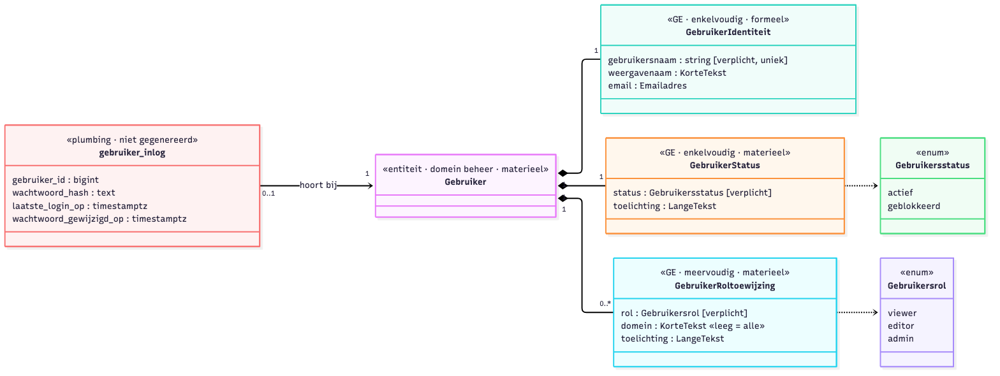
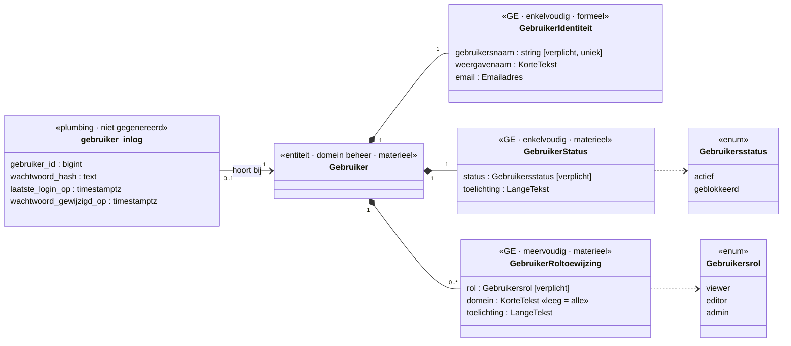

# Gebruikersbeheer als bitemporeel model (voorstel)

> **Stand:** 6 oktober 2026. Model als V3-JSON uitgewerkt en met codegen geproefd; nog niets
> in de repo gegenereerd of gemigreerd.
> **Aanleiding:** er is geen gebruikersbeheer-UI. Accounts gaan nu met de hand in de tabel
> `gebruiker` ([`AUTH_DEVELOPER_GUIDE.md`](../../AUTH_DEVELOPER_GUIDE.md) §11,
> [`VPS_DEPLOYMENT.md`](../../VPS_DEPLOYMENT.md) §7). Backlog: [§38](../../BACKLOG.md).

## Aanpak: eat your own dogfood

Gebruikers worden op dezelfde manier vastgelegd als alle nieuwe gegevens: als stukje bitemporeel
**M1-model in V3**, waaruit codegen de backend maakt. Lijst, aanmaken, rol toewijzen, blokkeren
en tijdreizen komen dan uit de gegenereerde API. Met de hand blijven alleen de inlog-endpoints
en de admin-gate over. Het scherm wordt een Studio-activiteit, naar het voorbeeld van
*AI-toegang* (`studio/activities/aiToegangActivity.jsx`). Functioneel is het beheer van
Imprint de blauwdruk (`imprint-engine/packages/runtime-admin/src/admin-server/users.ts`):
aanmaken met een gegenereerd wachtwoord, resetten, rol zetten (een admin kan zichzelf de
admin-rol niet afnemen) en het eigen wachtwoord wijzigen met controle van het oude.

## Het model

Bron: [`gebruikersbeheer-model.mmd`](gebruikersbeheer-model.mmd). Het model zelf:
[`gebruiker — v3-model.json`](gebruiker%20—%20v3-model.json).

## Keuzes

**Het wachtwoord blijft buiten het bitemporele deel.** Er zijn drie redenen:

- Registraties worden nooit gewist. Elke wachtwoordwijziging zou de oude hash voor altijd
  bewaren, ook in backups en replays.
- Codegen maakt voor elk veld GET-endpoints en GraphQL. Een hash mag je nooit kunnen opvragen,
  ook een admin niet.
- De laatste login bijhouden zou bij elke login een registratie opleveren. Dat is ruis.

Daarom staan de hash, `laatste_login_op` en `wachtwoord_gewijzigd_op` in de plumbing-tabel
`gebruiker_inlog`, met eigen handgeschreven endpoints (inloggen, wachtwoord zetten of resetten).

**Roltoewijzing is meervoudig en materieel.** De geldigheidsperiode op de rol levert proefaccounts
op die vanzelf verlopen ("editor tot 15-10"), zonder SQL-opruiming achteraf. Je kunt ook
terugvragen wie op een bepaalde datum admin was.

**`domein` op de rol** is optioneel; leeg betekent alle domeinen. Het bereidt rollen per omgeving
of domein voor (studio, pf, configuratie). Later kan Toegangsspraak of OpenFTV dit als PIP-gegevens
gebruiken, in plaats van de vaste `authz/manager/data/entities/roles.json`.

**Blokkeren gebeurt via Status, beëindigen via afvoer.** *Geblokkeerd* is tijdelijk en omkeerbaar.
Afvoer van de entiteit betekent dat het account echt beëindigd is. Hard verwijderen is niet nodig.
Voor de AVG staat er bewust weinig persoonsgegeven in: gebruikersnaam, weergavenaam en e-mail.

## Naamgeving in V3

De GE's heten `GebruikerIdentiteit`, `GebruikerStatus` en `GebruikerRoltoewijzing`, met de
entiteit als voorvoegsel zoals bij `QuerydefinitieStatus`; zo blijven GE-namen globaal uniek. De
enums heten `Gebruikersstatus` en `Gebruikersrol`, zodat ze niet met de GE-namen botsen. Een
proefrun van codegen (`--domein beheer --prefix beheer --mode additive`, naar een tijdelijke map)
slaagt en geeft de tabellen `gebruiker`, `gebruiker_aanvang`, `gebruiker_einde` en per GE
`gebruiker_gebruiker<ge>` met `_data` (en `_aanvang`/`_einde` voor de materiële GE's).

## Besluiten (6 oktober 2026)

1. **Naamconflict — besloten: migreren.** De proefrun bevestigt het: de hub-tabel heet
   `gebruiker`, net als de huidige plumbing-tabel. De typenaam blijft `Gebruiker`; de huidige
   tabel gaat op in `gebruiker_inlog` (hash, laatste login) plus een hub met registraties. De
   naam `gebruiker_inlog` botst niet met de gegenereerde tabellen (die heten
   `gebruiker_gebruiker…`). Volgorde: eerst de bestaande rijen overzetten (per rij een hub en
   GE's via de registratie-engine, hash naar `gebruiker_inlog`), dan pas de oude tabel weg.
2. **Login en middleware lezen uit het register — besloten: optie B (per request).** Nu staan rol
   en `actief` in één platte rij en zet de login ze in de JWT. Daarna kijkt niemand meer naar de
   database tot het token verloopt (24 uur). Met het nieuwe model staan rol en status in
   bitemporele tabellen, met geldigheid. Dat geeft twee vragen:
   - *Waar leest de login de rol?* Uit de actuele, geldige `GebruikerRoltoewijzing` en
     `GebruikerStatus` ("nu"), niet meer uit een kolom. Dat is een tijdreisquery op peilmoment
     nu, dezelfde die de API al gebruikt.
   - *Wanneer leest de middleware opnieuw?* Optie A: alleen bij de login (zoals nu). Een
     blokkade of een verlopen proefrol werkt dan pas na maximaal 24 uur. Optie B: bij elk
     request de status en rol "nu" nalezen (één query, eventueel een korte cache). Een
     blokkade werkt dan direct, en een rol die om 00:00 afloopt ook. Gekozen: **B**; anders
     levert de materiële geldigheid van de rol in de praktijk weinig op.
   - *Kip-en-ei:* de eerste admin (`SeedAdminGebruiker` uit `.env`) moet dan een hub, GE's en
     een registratie aanmaken via de engine, geen losse INSERT. Zonder die admin kan niemand
     inloggen om de rest aan te maken.
3. **Rechten op de gegenereerde routes — besloten: apart spoor (autorisatie, geen codegen).**
   Codegen levert de routes; wie ze mag aanroepen regelt de autorisatielaag. Voor domein
   `beheer` moeten lezen en schrijven `admin` vragen, ook als `LEESTOEGANG` open staat. Dat
   komt in de middleware of het FTV-beleid, niet in het V3-model. Tot dat er is: de
   gegenereerde routes van `beheer` niet aanzetten op een publieke omgeving.

## Vervolg

- Stap 1: ✅ model als V3-JSON, codegen-proefrun geslaagd, besluiten genomen.
- Stap 2: model laden in het register en codegen draaien, `gebruiker_inlog` en de migratie
  van de bestaande accounts, login, seed en middleware omzetten.
- Stap 2b (autorisatie): `beheer` alleen voor `admin`, ook lezen.
- Stap 3: Studio-activiteit *Gebruikers*.
- Later: uitnodiging en wachtwoordherstel per e-mail (SMTP draait al voor de pf-notificaties).
