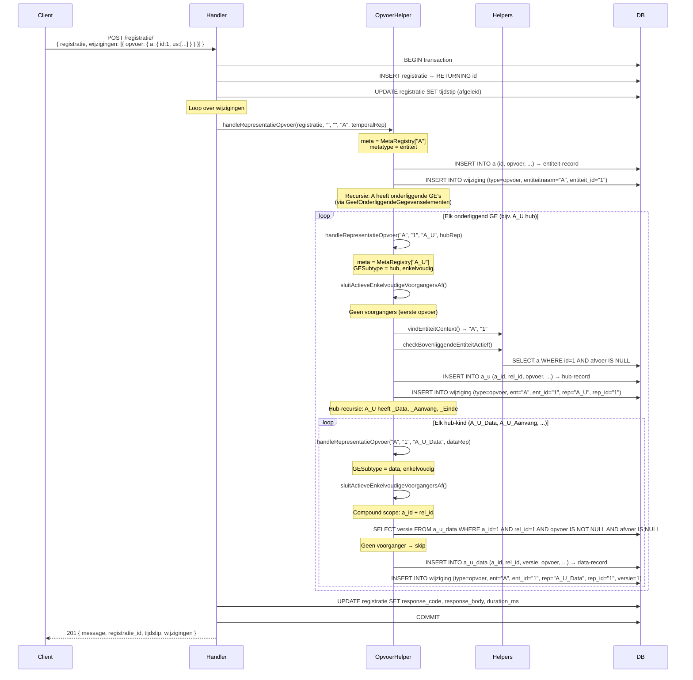
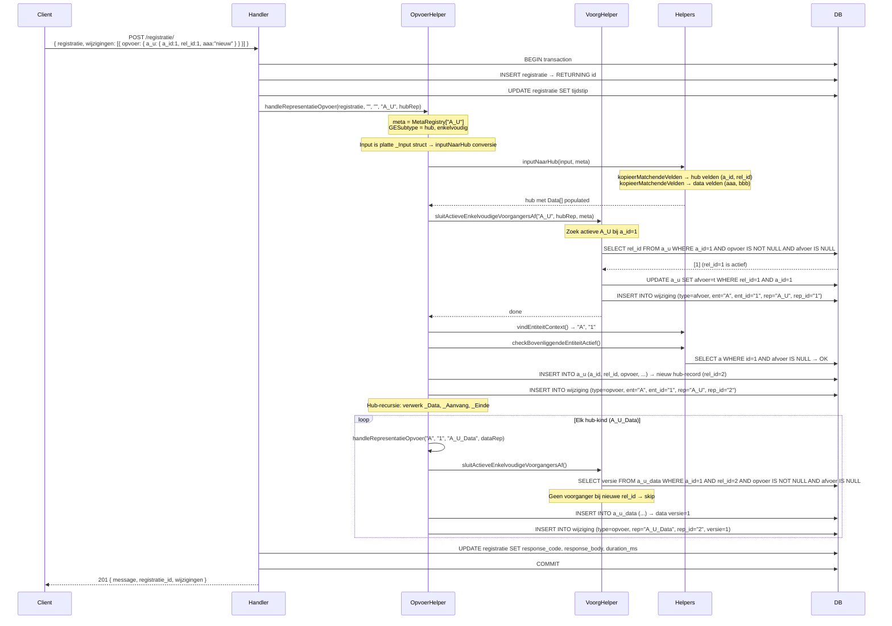
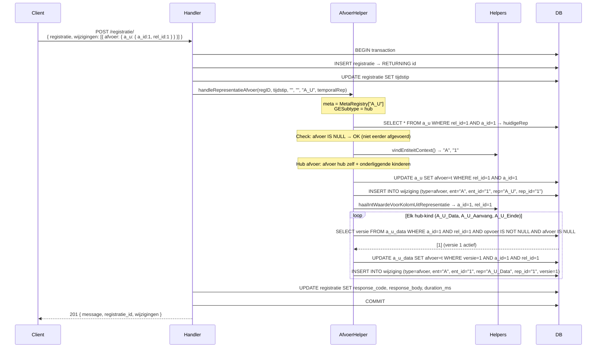
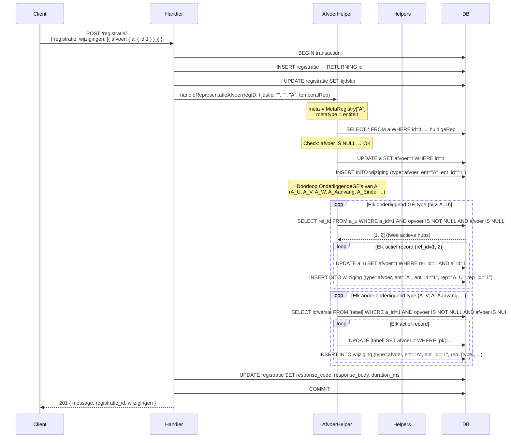
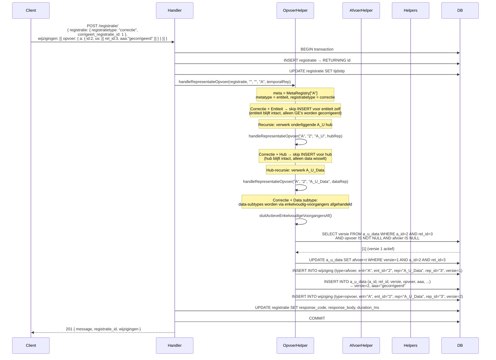
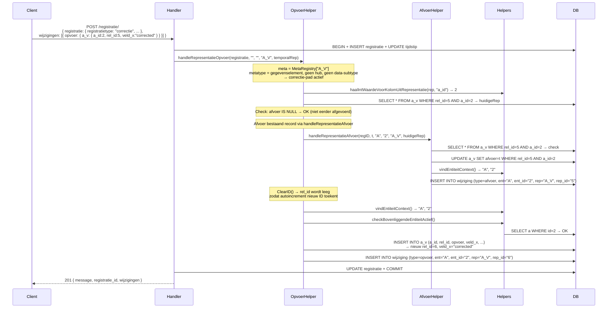
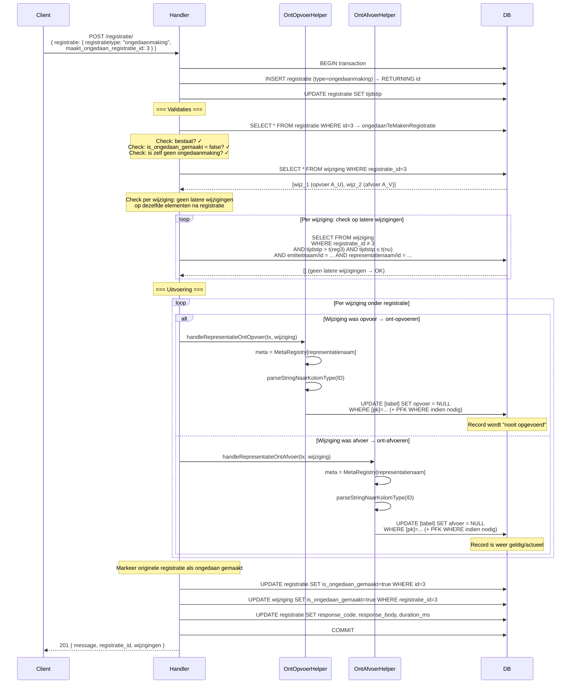
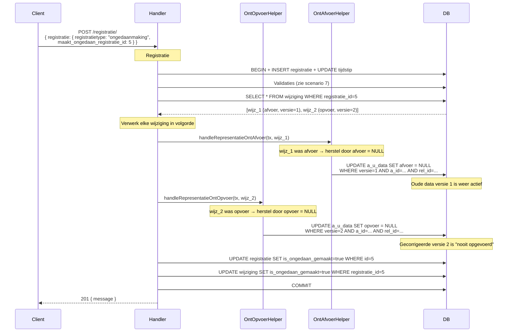

# Registratie-patronen — Sequence Diagrams

Dit document beschrijft de kernmechanica van de registratie-API (`POST /registratie/`) aan de hand van Mermaid sequence diagrams voor de belangrijkste scenario's.

Elk diagram toont de aanroepketen van de main handler (`RegistreerMetNieuweAanpak`) door de helpers heen tot aan DB-niveau (logische bun-operaties).

---

## Legenda

| Participant        | Betekenis                                                    |
| ------------------ | ------------------------------------------------------------ |
| **Client**         | De API-aanroeper (frontend, Postman, test)                   |
| **Handler**        | `RegistreerMetNieuweAanpak()` in `registration_handlers.go` |
| **OpvoerHelper**   | `handleRepresentatieOpvoer()` in `registration_helpers_generiek.go` |
| **AfvoerHelper**   | `handleRepresentatieAfvoer()` in `registration_helpers_generiek.go` |
| **VoorgHelper**    | `sluitActieveEnkelvoudigeVoorgangersAf()` — alleen bij enkelvoudige GE's |
| **OntOpvoerHelper**| `handleRepresentatieOntOpvoer()` — ongedaanmaking opvoer     |
| **OntAfvoerHelper**| `handleRepresentatieOntAfvoer()` — ongedaanmaking afvoer     |
| **Helpers**        | Diverse hulpfuncties (`vindEntiteitContext`, `bepaalRepIDenVersie`, etc.) |
| **DB**             | PostgreSQL via bun ORM                                       |

---

## 1. Opvoer van een nieuwe entiteit (met onderliggende GE's)

Typisch scenario: opvoer van entiteit A met onderliggende hub A_U (die _Data, _Aanvang, _Einde bevat).



---

## 2. Opvoer van een enkelvoudig GE (vorige wordt automatisch afgevoerd)

Scenario: er bestaat al A_U rel_id=1 met _Data versie=1. We voeren een nieuwe versie op. De vorige versie wordt automatisch afgevoerd.



---

## 3. Afvoer van een individueel GE (zonder vervanging)

Scenario: afvoer van A_U rel_id=1 bij entiteit A id=1. Geen nieuw record wordt opgevoerd.



---

## 4. Afvoer van een entiteit (cascading naar alle onderliggende GE's)

Scenario: afvoer van entiteit A id=1, met actieve onderliggende GE's (A_U, A_V, etc.).



---

## 5. Correctie van een GE (afvoer oud + opvoer nieuw)

Scenario: correctie van A_U rel_id=3 (niet-hub GE) bij entiteit A id=2. Het oude record wordt afgevoerd en een nieuw record met gecorrigeerde data wordt opgevoerd.



---

## 6a. Correctie van een niet-hub GE (legacy pad)

Scenario: correctie van een niet-hub GE (bijv. legacy `A_V` met directe velden). Het oude record wordt afgevoerd en een nieuw record opgevoerd.



---

## 7. Ongedaanmaking van een registratie

Scenario: ongedaanmaking van registratie #3, die twee wijzigingen bevatte: een opvoer en een afvoer. Alle mutaties worden teruggedraaid.



---

## 8. Ongedaanmaking van een correctie

Conceptueel identiek aan scenario 7: de correctie-registratie bevatte afvoer-wijzigingen (voor de oude records) en opvoer-wijzigingen (voor de gecorrigeerde records). De ongedaanmaking draait beide soorten terug.



---

## Samenvatting operaties per scenario

| Scenario                                | Aantal wijzigingen | DB INSERTs representatie | DB UPDATEs representatie | DB INSERTs wijziging |
| --------------------------------------- | ------------------ | ------------------------ | ------------------------ | -------------------- |
| 1. Opvoer nieuwe entiteit + GE's        | N (1 per rep)      | N                        | 0                        | N                    |
| 2. Opvoer enkelvoudig GE (vervanging)   | 2 (afvoer oud + opvoer nieuw) | 1 (nieuw)     | 1 (afvoer oud)           | 2                    |
| 3. Afvoer individueel GE (hub)          | 1 + kinderen       | 0                        | 1 + kinderen             | 1 + kinderen         |
| 4. Afvoer entiteit (cascading)          | 1 + alle GE's      | 0                        | 1 + alle GE's            | 1 + alle GE's        |
| 5. Correctie (hub/data)                 | 2 (afvoer data + opvoer data) | 1 (nieuw data) | 1 (afvoer data)         | 2                    |
| 6a. Correctie (legacy GE)              | 2 (afvoer oud + opvoer nieuw) | 1 (nieuw)     | 1 (afvoer oud)           | 2                    |
| 7. Ongedaanmaking registratie          | 0 (geen nieuwe)    | 0                        | N (opvoer→NULL, afvoer→NULL) | 0                |
| 8. Ongedaanmaking correctie            | 0 (geen nieuwe)    | 0                        | 2 (afvoer→NULL, opvoer→NULL) | 0                |

---

## Referenties broncode

| Bestand                                       | Functies                                                                   |
| --------------------------------------------- | -------------------------------------------------------------------------- |
| `handlers/registration_handlers.go`           | `RegistreerMetNieuweAanpak()` — main handler + ongedaanmaking-logica      |
| `handlers/registration_helpers_generiek.go`   | `handleRepresentatieOpvoer()`, `handleRepresentatieAfvoer()`, `handleRepresentatieOntOpvoer()`, `handleRepresentatieOntAfvoer()`, `sluitActieveEnkelvoudigeVoorgangersAf()`, `persisteerWijziging()`, `updateAfvoerByID()`, `haalRepresentatieUitDB()`, `vindEntiteitContext()`, `inputNaarHub()`, `bepaalRepIDenVersie()`, `haalActieveIDsMetScope()`, `updateAfvoerMetScope()` |
| `model/REST request models.go`                | `RepresentatiePlusNaam.UnmarshalJSON()` — parse van opvoer/afvoer JSON-sleutels naar representatie-types |

---

## Veldnaam-disambiguatie bij het parsen van opvoer/afvoer

Binnen de `wijzigingen[]`-array wordt elke `opvoer` en `afvoer` geparseerd door `RepresentatiePlusNaam.UnmarshalJSON()` in `model/REST request models.go`. De JSON-sleutel (bijv. `"naam"`) wordt via de MetaRegistry opgezocht naar een concreet representatietype.

### Probleem: gedeelde veldnamen

Meerdere types kunnen dezelfde `Veldnaam` hebben. Bijvoorbeeld:

| Veldnaam | Types met die veldnaam          |
| -------- | ------------------------------- |
| `naam`   | `ApiStandaard_Naam`, `NatuurlijkPersoon_Naam`, `Land_Naam`, ... |

Een simpele `GetByVeldnaam("naam")` retourneert de eerste match (niet-deterministisch op basis van map-iteratievolgorde), wat leidt tot fouten.

### Oplossing: `GetByVeldnaamMetPayload()`

De parser extraheert de JSON-sleutels uit de inner payload (bijv. `{ "apistandaard_id": 8, "naam": "Zaken API" }`) en roept `MetaRegistry.GetByVeldnaamMetPayload(veldnaam, payloadKeys)` aan. Die functie disambigueert op `EntiteitIDKolom`:

```
veldnaam = "naam", payloadKeys = {"apistandaard_id", "naam"}
→ candidate ApiStandaard_Naam heeft EntiteitIDKolom = "apistandaard_id" → match ✓
→ candidate NatuurlijkPersoon_Naam heeft EntiteitIDKolom = "natuurlijk_persoon_id" → geen match
→ retourneert ApiStandaard_Naam
```

Als geen enkele kandidaat disambigueerbaar is, wordt de eerste kandidaat als fallback geretourneerd en een `WARN`-melding naar stderr geschreven.

### Vereiste payload-conventies

Zorg dat elke GE-opvoer het `EntiteitIDKolom` van de bovenliggende entiteit bevat, ook als het ID al bekend is uit de context. Voorbeeld:

```json
{
  "opvoer": {
    "naam": {
      "apistandaard_id": 8,
      "naam": "Zaken API"
    }
  }
}
```

Zonder `apistandaard_id` in de payload kan de parser niet disambigueren en valt terug op de eerste match.

---

## Foutresponse-formaat

Bij fouten geeft de handler een JSON-response terug met een `error`-veld:

```json
{ "error": "<beschrijving>" }
```

Bij fouten die optreden tijdens de verwerking van een specifieke wijziging bevat de melding:
- **Het 0-gebaseerde index** van de wijziging in de `wijzigingen[]`-array
- **De representatienaam** zoals opgelost door de MetaRegistry
- **De veldnaam** zoals opgegeven in de JSON

Voorbeeld:
```
wijziging[3]: opvoer van ApiStandaard_Naam (veldnaam=naam) mislukt: HANDLER: failed to insert ApiStandaard_Naam: ...
```

Dit maakt het mogelijk om direct in de replay-file of Postman-body te zien welke entry de fout veroorzaakte.
