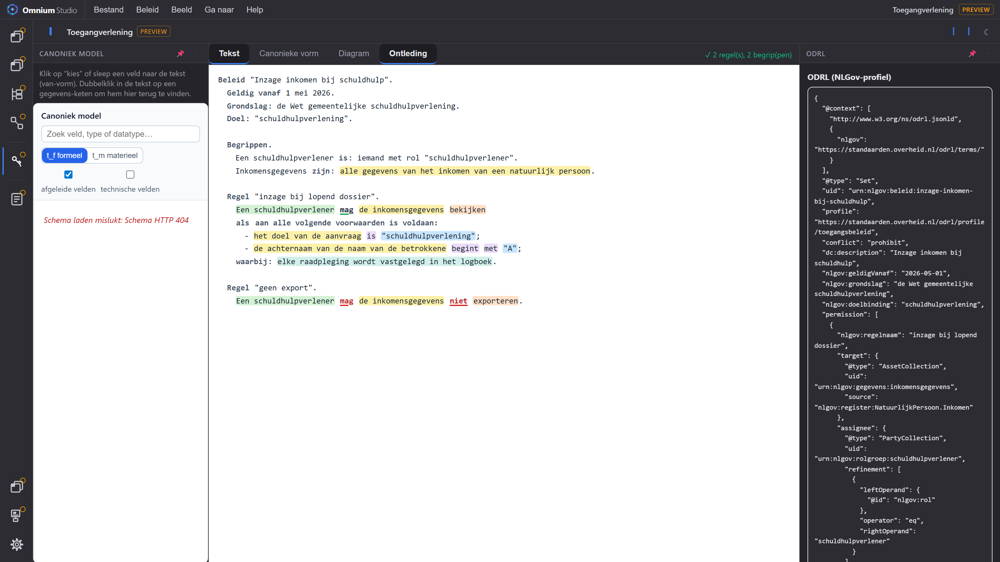
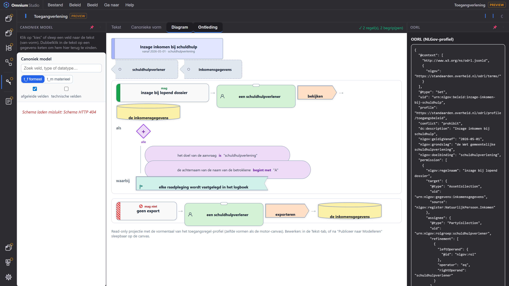
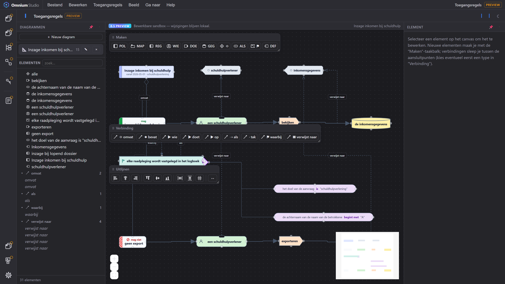

# Toegangsbeleid dat iedereen kan lezen — én een machine kan uitvoeren

**Teaser voor de werkgroep FTV / Register Toegangsbeleid · 24 juli 2026**

Twee dagen geleden was het een idee: een beleidstaal voor toegangsregels die
leken kunnen lezen, met de dekking van ODRL/XACML/OPA/Cedar. Vandaag staat er
een werkende omgeving in **Omnium Studio**. Dit is wat er nu kan.

---

## Eén beleidsregel, vier gezichten

Je schrijft beleid als gewone Nederlandse zinnen:

```
Beleid "Inzage inkomen bij schuldhulp".
  Geldig vanaf 1 mei 2026.
  Grondslag: de Wet gemeentelijke schuldhulpverlening.
  Doel: "schuldhulpverlening".

  Begrippen.
    Een schuldhulpverlener is: iemand met rol "schuldhulpverlener".
    Inkomensgegevens zijn: alle gegevens van het inkomen van een natuurlijk persoon.

  Regel "inzage bij lopend dossier".
    Een schuldhulpverlener mag de inkomensgegevens bekijken
    als aan alle volgende voorwaarden is voldaan:
      - het doel van de aanvraag is "schuldhulpverlening";
      - er is een lopend dossier voor de betrokkene;
    waarbij: elke raadpleging wordt vastgelegd in het logboek.

  Regel "geen export".
    Een schuldhulpverlener mag de inkomensgegevens niet exporteren.
```

Dezelfde regel bestaat automatisch in vier vormen — bewerk de één, en de rest
volgt: **klare taal** (de bron), een **diagram**, **ODRL JSON-LD** (het
NLGov-profiel, klaar voor de vertaling naar OPA/Cedar/XACML) en de
**canonieke leesvorm** waarmee álles in het register altijd terugleesbaar is.

## De editor leest mee



De editor **ontleedt de zin terwijl je typt**: subject groen, gegevens geel,
vergelijking paars, waarde blauw, handeling oranje — en `mag` groen
onderstreept tegenover `mag niet` rood met verbodsteken. Verder:

- **Autocomplete, twee kanten op.** Typ "achterna…" en krijg *"de achternaam
  van (de naam van) een natuurlijk persoon"* — het deel tussen haakjes mag je
  weglaten. Of andersom: typ *"de naam van "* en zie álle typen die een naam
  hebben.
- **Het metamodel bewaakt de betekenis.** Paden worden tegen het canoniek
  model gecontroleerd; *"begint met" kan alleen met tekst; 'geboortedatum'
  is een datum* — foutmeldingen zijn zelf ook klare taal.
- **Correct Nederlands.** Na "als" geldt de bijzinsvolgorde (*"…niet 'nl'
  **is**"*), in opsommingen de stellingsvorm; beide worden begrepen. En sinds
  vandaag ook: *"als **er een lopend dossier voor de betrokkene is**"*.

## De regel als diagram — zelfde kleuren, eigen vormen



Elk zinsdeel kreeg een eigen **vorm** (ontworpen in een aparte designsessie):
de policy als kaft, de regel als kaart met modaliteitsband, het subject als
naambadge, de handeling als pijlblok, gegevens als cilinder, voorwaarden als
poort-ruit met takken, plichten als vaandel. Betekenis zit **nooit alleen in
kleur** — een verbod is gearceerd, doorgestreept én benoemd.

## Slepen, ordenen, en wéér terug naar tekst



Het beleid publiceert met één klik naar de **modelleeromgeving**: sleepbaar
op de canvas, geordend in de projectboom (met mappen), naast alle andere
modellen. Twee garanties daarbij:

- **De layout is heilig.** Opnieuw publiceren na een tekstwijziging laat je
  zorgvuldig geschoven diagram intact — alleen de inhoud beweegt mee.
- **De weg terug bestaat.** Hernoem een element op de canvas, teken een
  voorwaarde bij, kies *Lees terug uit Modelleren* — en de wijziging staat
  als correcte zin in de tekst. De **round-trip is verliesvrij** (getest:
  tekst → diagram → tekst geeft letter voor letter dezelfde tekst terug).

Het profiel zelf is óók gewoon een model — hier het metamodel, gemodelleerd
en uitgelijnd op dezelfde motor:


## De keten die auditors willen zien: wet → beleid → regel

Eén menu-actie koppelt het beleid aan de **architectuur**: begrippen worden
ArchiMate *Business objecten* en *rollen* (aansluitend op GEMMA), de
grondslag een *Constraint*, de doelbinding een *Goal* — met kruisverbanden
in de koppelingen-matrix, tot op de elementen van het canoniek datamodel.
En onder water is elke regel al ODRL:

```json
{ "leftOperand": { "@id": "nlgov:bestaat:lopendDossier" },
  "operator": "eq", "rightOperand": true,
  "nlgov:voor": { "@id": "nlgov:betrokkene" } }
```

## Waarom dit telt

- **Beleidsmakers** schrijven en reviewen beleid in hun eigen taal.
- **Auditors** zien de keten wet → beleid → regel → gegevens, en straks met
  bitemporeel tijdreizen: "welk beleid gold op 1 maart?".
- **Leveranciers** houden keuzevrijheid: het register beschrijft (ODRL/
  NLGov), de runtime-engine voert uit (OPA/Cedar/XACML via AuthZEN).

Alles is drie keer bewaakt: ~380 geautomatiseerde tests, een harde
round-trip-garantie, en de bestaande standaarden blijven onaangetast.

## Wat we van de werkgroep vragen

1. **De naam**: werktitel is *Toegangsspraak* (knipoog naar RegelSpraak).
2. **Plichten**: voorstel voor een echte plicht-grammatica (lijdende vorm:
   *"de betrokkene wordt geïnformeerd binnen 30 dagen"*) ligt klaar —
   besluit gevraagd.
3. **Begrippen** definitief als ArchiMate Business object (GEMMA-lijn)?
4. **Lidwoord + telbaarheid** als metadata in het metamodel (de/het, en of
   iets "een" kan hebben) — eenmalig aanvullen.
5. Een **kleurenblind-toets** van de vormentaal met echte gebruikers.

*Meer lezen: `docs/TOEGANGSSPRAAK.md` (functioneel + technisch),
`docs/plans/2026-07-22 Klare-taal Toegangsbeleid — Toegangsspraak
(ontwerp).md` (taal en besluiten) en `docs/plans/2026-07-24
Toegangsregel-profiel (ontwerp).md` (het diagramprofiel).*
