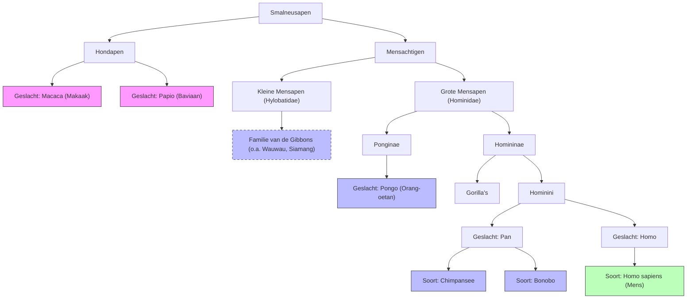

```mermaid
graph TD
    %% De splitsing tussen apen en mensapen
    Smalneusapen --> Hondapen
    Smalneusapen --> Mensachtigen

    %% De Hondapen (met staart)
    Hondapen --> Genus_Macaca["Geslacht: Macaca (Makaak)"]
    Hondapen --> Genus_Papio["Geslacht: Papio (Baviaan)"]

    %% De Mensachtigen (zonder staart)
    Mensachtigen --> KleineMensapen["Kleine Mensapen (Hylobatidae)"]
    Mensachtigen --> GroteMensapen["Grote Mensapen (Hominidae)"]
    
    %% De Gibbon tak
    KleineMensapen --> Genus_Hylobates["Familie van de Gibbons (o.a. Wauwau, Siamang)"]

    %% Splitsing Orang-oetan
    GroteMensapen --> Ponginae
    Ponginae --> Genus_Pongo["Geslacht: Pongo (Orang-oetan)"]

    %% Splitsing Afrikaanse tak
    GroteMensapen --> Homininae
    Homininae --> Gorillini["Gorilla's"]
    Homininae --> Hominini
    
    %% De absolute eindtakken
    Hominini --> Genus_Pan["Geslacht: Pan"]
    Genus_Pan --> Soort_Chimp["Soort: Chimpansee"]
    Genus_Pan --> Soort_Bonobo["Soort: Bonobo"]

    Hominini --> Genus_Homo["Geslacht: Homo"]
    Genus_Homo --> Soort_Mens["Soort: Homo sapiens (Mens)"]

    style Genus_Macaca fill:#f9f,stroke:#333
    style Genus_Papio fill:#f9f,stroke:#333
    style Genus_Hylobates fill:#bbf,stroke:#333,stroke-dasharray: 5 5
    style Genus_Pongo fill:#bbf,stroke:#333
    style Soort_Chimp fill:#bbf,stroke:#333
    style Soort_Bonobo fill:#bbf,stroke:#333
    style Soort_Mens fill:#bfb,stroke:#333
```