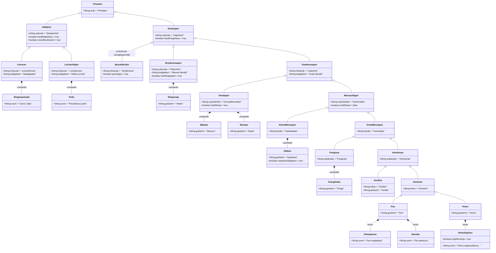

```mermaid
classDiagram
    direction TB

    %% Hoofdklasse
    class Primaten {
        +String orde = "Primates"
    }

    %% ==========================================
    %% LINKERTAK: HALFAPEN & TUSSENVORMEN
    %% ==========================================
    class Halfapen {
        +String suborde = "Strepsirrhini"
        +boolean heeftNatteNeus = true
        +boolean vooralNachtactief = true
    }
    Primaten <|-- Halfapen

    class Lemuren {
        +String infraorde = "Lemuriformes"
        +String leefgebied = "Madagaskar"
    }
    Halfapen <|-- Lemuren

    class Ringstaartmaki {
        +String soort = "Lemur catta"
    }
    Lemuren *-- Ringstaartmaki : voorbeeld

    class Lorisachtigen {
        +String infraorde = "Lorisiformes"
        +String leefgebied = "Afrika en Azië"
    }
    Halfapen <|-- Lorisachtigen

    class Potto {
        +String soort = "Perodicticus potto"
    }
    Lorisachtigen *-- Potto : voorbeeld

    %% Opmerking: Spookdiertjes horen strikt cladistisch bij de droogneuzaapjes, 
    %% maar worden traditioneel/ecologisch vaak nog tot de halfapen gerekend.
    class Spookdiertjes {
        +String infraorde = "Tarsiiformes"
        +boolean groteOgen = true
    }

    %% ==========================================
    %% RECHTERTAK: ECHTE APEN EN MENSEN
    %% ==========================================
    class EchteApen {
        +String suborde = "Haplorhini"
        +boolean heeftDrogeNeus = true
    }
    Primaten <|-- EchteApen
    EchteApen <|-- Spookdiertjes : evolutionair overgangsmodel

    class Breedneusapen {
        +String infraorde = "Platyrrhini"
        +String leefgebied = "Nieuwe Wereld"
        +boolean heeftGrijpstaart = true
    }
    class Smalneusapen {
        +String infraorde = "Catarrhini"
        +String leefgebied = "Oude Wereld"
    }
    EchteApen <|-- Breedneusapen
    EchteApen <|-- Smalneusapen

    class Slingeraap {
        +String geslacht = "Ateles"
    }
    Breedneusapen *-- Slingeraap : voorbeeld

    %% Smalneusapen splitsing
    class Hondapen {
        +String superfamilie = "Cercopithecoidea"
        +boolean heeftStaart = true
    }
    class Mensachtigen {
        +String superfamilie = "Hominoidea"
        +boolean heeftStaart = false
    }
    Smalneusapen <|-- Hondapen
    Smalneusapen <|-- Mensachtigen

    class Makaak {
        +String geslacht = "Macaca"
    }
    class Baviaan {
        +String geslacht = "Papio"
    }
    Hondapen *-- Makaak : voorbeeld
    Hondapen *-- Baviaan : voorbeeld

    %% Mensachtigen splitsing
    class KleineMensapen {
        +String familie = "Hylobatidae"
    }
    class GroteMensapen {
        +String familie = "Hominidae"
    }
    Mensachtigen <|-- KleineMensapen
    Mensachtigen <|-- GroteMensapen

    class Gibbon {
        +String geslacht = "Hylobates"
        +boolean meesterInSlingeren = true
    }
    KleineMensapen *-- Gibbon : voorbeeld

    %% Grote Mensapen splitsing
    class Ponginae {
        +String subfamilie = "Ponginae"
    }
    class Homininae {
        +String subfamilie = "Homininae"
    }
    GroteMensapen <|-- Ponginae
    GroteMensapen <|-- Homininae

    class OrangOetan {
        +String geslacht = "Pongo"
    }
    Ponginae *-- OrangOetan : voorbeeld

    %% Homininae splitsing
    class Gorillini {
        +String tribus = "Gorillini"
        +String geslacht = "Gorilla"
    }
    class Hominini {
        +String tribus = "Hominini"
    }
    Homininae <|-- Gorillini
    Homininae <|-- Hominini

    %% Eindtakken van de mensachtigen
    class Pan {
        +String geslacht = "Pan"
    }
    class Homo {
        +String geslacht = "Homo"
    }
    Hominini <|-- Pan
    Hominini <|-- Homo

    class Chimpansee {
        +String soort = "Pan troglodytes"
    }
    class Bonobo {
        +String soort = "Pan paniscus"
    }
    Pan *-- Chimpansee : bevat
    Pan *-- Bonobo : bevat

    class HomoSapiens {
        +String soort = "Homo sapiens (Mens)"
        +boolean looptRechtop = true
    }
    Homo *-- HomoSapiens : bevat

```