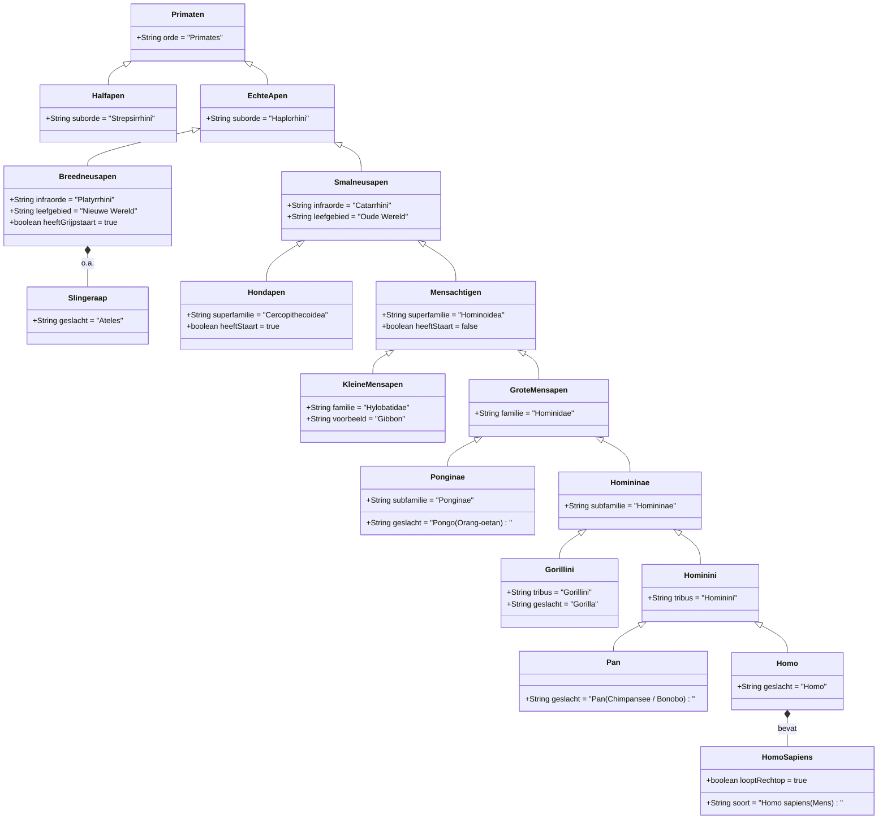

```mermaid
classDiagram
    direction TB

    %% Hoofdklasse
    class Primaten {
        +String orde = "Primates"
    }

    %% Subordes
    class Halfapen {
        +String suborde = "Strepsirrhini"
    }
    class EchteApen {
        +String suborde = "Haplorhini"
    }
    Primaten <|-- Halfapen
    Primaten <|-- EchteApen

    %% Infraordes van de Echte Apen
    class Breedneusapen {
        +String infraorde = "Platyrrhini"
        +String leefgebied = "Nieuwe Wereld"
        +boolean heeftGrijpstaart = true
    }
    class Smalneusapen {
        +String infraorde = "Catarrhini"
        +String leefgebied = "Oude Wereld"
    }
    EchteApen <|-- Breedneusapen
    EchteApen <|-- Smalneusapen

    %% Voorbeeld binnen Breedneusapen
    class Slingeraap {
        +String geslacht = "Ateles"
    }
    Breedneusapen *-- Slingeraap : o.a.

    %% Superfamilies binnen Smalneusapen
    class Hondapen {
        +String superfamilie = "Cercopithecoidea"
        +boolean heeftStaart = true
    }
    class Mensachtigen {
        +String superfamilie = "Hominoidea"
        +boolean heeftStaart = false
    }
    Smalneusapen <|-- Hondapen
    Smalneusapen <|-- Mensachtigen

    %% Families binnen Mensachtigen
    class KleineMensapen {
        +String familie = "Hylobatidae"
        +String voorbeeld = "Gibbon"
    }
    class GroteMensapen {
        +String familie = "Hominidae"
    }
    Mensachtigen <|-- KleineMensapen
    Mensachtigen <|-- GroteMensapen

    %% Subfamilies van de Grote Mensapen
    class Ponginae {
        +String subfamilie = "Ponginae"
        +String geslacht = "Pongo (Orang-oetan)"
    }
    class Homininae {
        +String subfamilie = "Homininae"
    }
    GroteMensapen <|-- Ponginae
    GroteMensapen <|-- Homininae

    %% Tribussen binnen Homininae
    class Gorillini {
        +String tribus = "Gorillini"
        +String geslacht = "Gorilla"
    }
    class Hominini {
        +String tribus = "Hominini"
    }
    Homininae <|-- Gorillini
    Homininae <|-- Hominini

    %% Geslachten binnen Hominini
    class Pan {
        +String geslacht = "Pan (Chimpansee / Bonobo)"
    }
    class Homo {
        +String geslacht = "Homo"
    }
    Hominini <|-- Pan
    Hominini <|-- Homo

    %% Soort binnen Homo
    class HomoSapiens {
        +String soort = "Homo sapiens (Mens)"
        +boolean looptRechtop = true
    }
    Homo *-- HomoSapiens : bevat
```