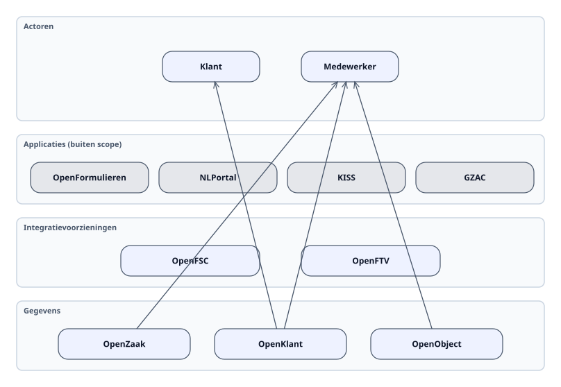
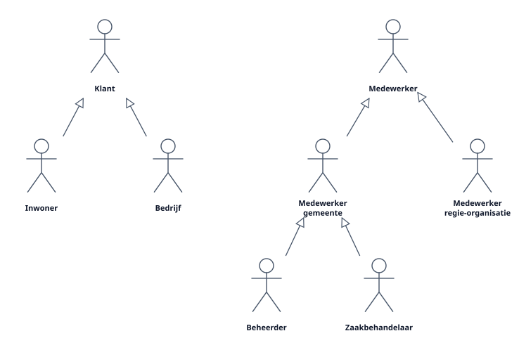
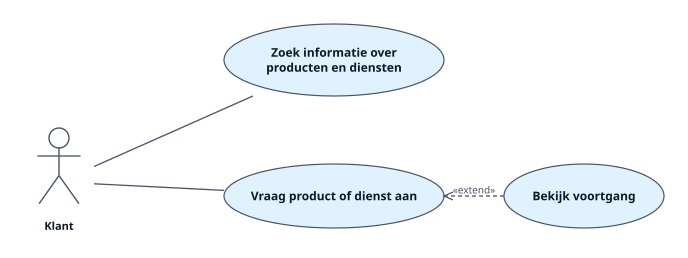
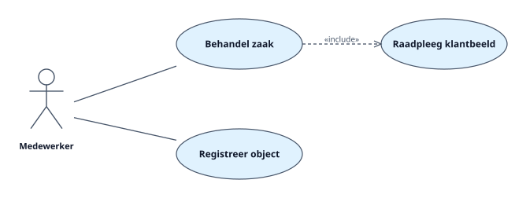

<!-- Gegenereerd met scripts/genereer-cgv-voorbeeld.mjs (sjabloon: Projectdocument). Niet met de hand bewerken; vergelijk met CGV_Use_case_model.md (handgeschreven). -->

# CGV Use case model

De Collectieve Gegevensvoorziening (CGV) is een systeem dat functionaliteiten biedt voor het opslaan, beheren en ontsluiten van gegevens. In dit document beschrijven we de functionaliteiten van de CGV met een use case model. Een use case model beschrijft actoren en de use cases waar de actoren gebruik van kunnen maken.

Het bijzondere aan de CGV is dat deze zich beperkt tot componenten (en dus functionaliteiten) op de lagen één t/m drie, d.w.z. gegevens, services en integratie. Daardoor is het niet triviaal om functionaliteiten voor eindgebruikers te beschrijven. Toch willen we eindgebruikers als actoren beschouwen, om zo de verbinding met dienstverlening te behouden.

Belangrijke actoren zijn klanten en medewerkers. Deze maken gebruik van applicaties. Die applicaties leven op lagen vier en vijf en vallen buiten de scope van de CGV; die tonen we grijs. De applicaties sluiten aan op de integratielaag om gebruik te maken van API's en componenten die gegevens ontsluiten. De genoemde componenten zijn slechts voorbeelden.

*Lagen van de CGV*

## Actoren

De belangrijkste actoren van het use case model zijn Klant en Medewerker. We onderscheiden ook meer specifieke klanten en medewerkers. Klanten kunnen bijvoorbeeld inwoners of bedrijven zijn, en medewerkers kunnen bij de gemeente werken of bij de regie-organisatie. Medewerkers kunnen nog specifieker worden uitgesplitst naar bijvoorbeeld beheerders en zaakbehandelaars. Bij iedere actor kunnen verschillende use cases worden gedefinieerd.

*Actormodel*

## Use cases

Per actor de use cases waarvoor de CGV gegevens, services of integratie levert.

### Use cases Klant

*Use cases Klant*

#### Bekijk voortgang

Status van de eigen zaken, uit OpenZaak via het portaal.

| | |
|---|---|
| Actoren |  |
| Bevat (include) |  |
| Uitgebreid door (extend) |  |

#### Vraag product of dienst aan

Een formulier legt de aanvraag vast als zaak met klantgegevens.

| | |
|---|---|
| Actoren | Klant |
| Bevat (include) |  |
| Uitgebreid door (extend) | Bekijk voortgang |

#### Zoek informatie over producten en diensten

De klant zoekt zelf; de CGV levert de productgegevens via een API.

| | |
|---|---|
| Actoren | Klant |
| Bevat (include) |  |
| Uitgebreid door (extend) |  |

### Use cases Medewerker

*Use cases Medewerker*

#### Behandel zaak

De zaakbehandelaar werkt de zaak af; de zaakgegevens staan in OpenZaak.

| | |
|---|---|
| Actoren | Medewerker |
| Bevat (include) | Raadpleeg klantbeeld |
| Uitgebreid door (extend) |  |

#### Raadpleeg klantbeeld

Contacten en gegevens van de klant uit OpenKlant.

| | |
|---|---|
| Actoren |  |
| Bevat (include) |  |
| Uitgebreid door (extend) |  |

#### Registreer object

| | |
|---|---|
| Actoren | Medewerker |
| Bevat (include) |  |
| Uitgebreid door (extend) |  |

