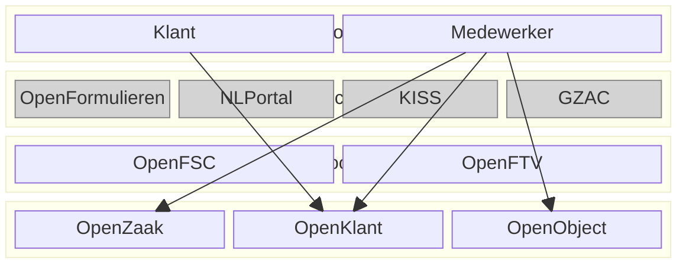

# Inleiding
De Collectieve Gegevensvoorziening (CGV) is een systeem dat functionaliteiten biedt voor het opslaan, beheren en ontsluiten van gegevens. In dit document beschrijven we de functionaliteiten van de CGV met een use case model. Een use case model beschrijft actoren en de use cases waar de actoren gebruik van kunnen maken.

De bijzonder aan de CGV is dat deze zich beperkt tot componenten (en dus functionaliteiten) op de lagen één t/m drie, d.w.z. gegevens, services en integratie. Daardoor is het niet triviaal om functionaliteiten voor eindgebruikers te beschrijven. Toch willen we eindgebruikers als actoren beschouwen, om zo de verbinding met dienstverlening te behouden.

We kunnen dit op de volgende manier visualiseren. Belangrijke actoren zijn klanten en medewerkers. Deze maken gebruik van applicaties. Deze applicaties "leven" op lagen vier en vijf en zijn derhalve buiten de scope van de VCG. Deze visualiseren we _greyed out_. De applicaties sluiten aan op de integratielaag om gebruik te maken van API's en componenten die gegevens ontsluiten. In het onderstaande diagram zijn de genoemde componenenten slechts bedoeld als voorbeelden.

# Actoren
De belangrijkste actoren van het use case model zijn Klant en Medewerker. Echter we onderscheiden meer specifieke klanten en medewerkers. Klanten kunnen bijv. inwoners of bedrijven zijn, en medewerkers kunnen bij de gemeente werken of bij de regie-organisatie. Medewerkers kunnen ook nog specifieker worden uitgesplitst naar bijv. beheerders en zaakbehandels. Bij iedere actor kunnen verschillende use cases worden gedefinieerd.

# Use cases

## Use cases Klant

## Use cases Medewerker

# Uitwerking use cases

