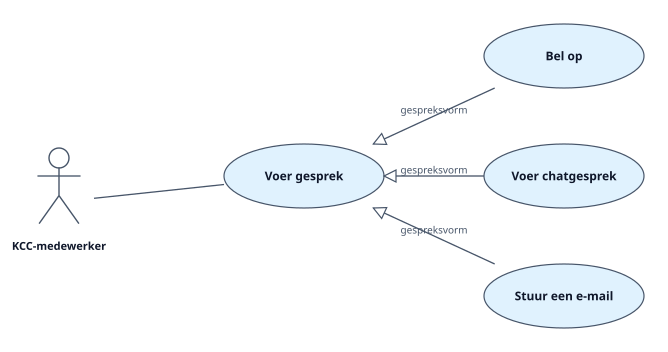
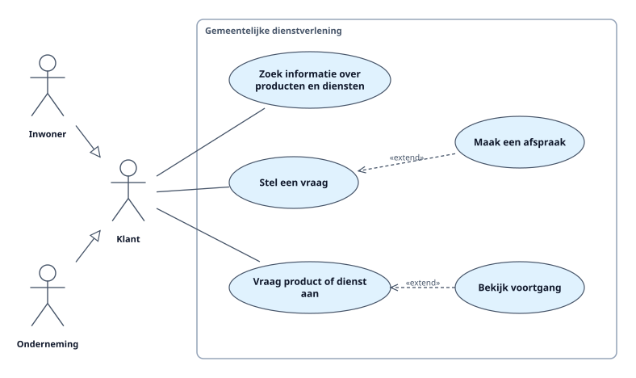

<!-- Gegenereerd met scripts/genereer-voorbeelddocument.mjs (sjabloon: Use case-overzicht). Niet met de hand bewerken. -->

# Use case-overzicht — Klantcontact

## Diagram: Gespreksvormen

Op dit diagram: KCC-medewerker, Voer gesprek, Bel op, Voer chatgesprek, Stuur een e-mail.

## Diagram: Klantcontact

Op dit diagram: Gemeentelijke dienstverlening, Inwoner, Onderneming, Klant, Zoek informatie over producten en diensten, Stel een vraag, Vraag product of dienst aan, Maak een afspraak, Bekijk voortgang.

# Actoren

## Inwoner

Is een Klant.

## KCC-medewerker

Medewerker van het klantcontactcentrum.

- Voer gesprek

## Klant

Inwoner of onderneming die contact zoekt met de gemeente.

- Zoek informatie over producten en diensten
- Stel een vraag
- Vraag product of dienst aan

## Onderneming

Is een Klant.

# Use cases

## Bekijk voortgang

| | |
|---|---|
| Actoren |  |
| Bevat (include) |  |
| Uitgebreid door (extend) |  |
| Specialiseert |  |
| Op diagram | Klantcontact |

## Bel op

| | |
|---|---|
| Actoren |  |
| Bevat (include) |  |
| Uitgebreid door (extend) |  |
| Specialiseert | Voer gesprek |
| Op diagram | Gespreksvormen |

## Maak een afspraak

Een afspraak aan de balie of per video.

| | |
|---|---|
| Actoren |  |
| Bevat (include) |  |
| Uitgebreid door (extend) |  |
| Specialiseert |  |
| Op diagram | Klantcontact |

## Stel een vraag

| | |
|---|---|
| Actoren | Klant |
| Bevat (include) | Voer gesprek |
| Uitgebreid door (extend) | Maak een afspraak |
| Specialiseert |  |
| Op diagram | Klantcontact |

## Stuur een e-mail

| | |
|---|---|
| Actoren |  |
| Bevat (include) |  |
| Uitgebreid door (extend) |  |
| Specialiseert | Voer gesprek |
| Op diagram | Gespreksvormen |

## Voer chatgesprek

| | |
|---|---|
| Actoren |  |
| Bevat (include) |  |
| Uitgebreid door (extend) |  |
| Specialiseert | Voer gesprek |
| Op diagram | Gespreksvormen |

## Voer gesprek

Een gesprek tussen klant en medewerker, via een van de kanalen.

| | |
|---|---|
| Actoren | KCC-medewerker |
| Bevat (include) |  |
| Uitgebreid door (extend) |  |
| Specialiseert |  |
| Op diagram | Gespreksvormen |

## Vraag product of dienst aan

| | |
|---|---|
| Actoren | Klant |
| Bevat (include) |  |
| Uitgebreid door (extend) | Bekijk voortgang |
| Specialiseert |  |
| Op diagram | Klantcontact |

## Zoek informatie over producten en diensten

De klant zoekt zelf op de website.

| | |
|---|---|
| Actoren | Klant |
| Bevat (include) |  |
| Uitgebreid door (extend) |  |
| Specialiseert |  |
| Op diagram | Klantcontact |

