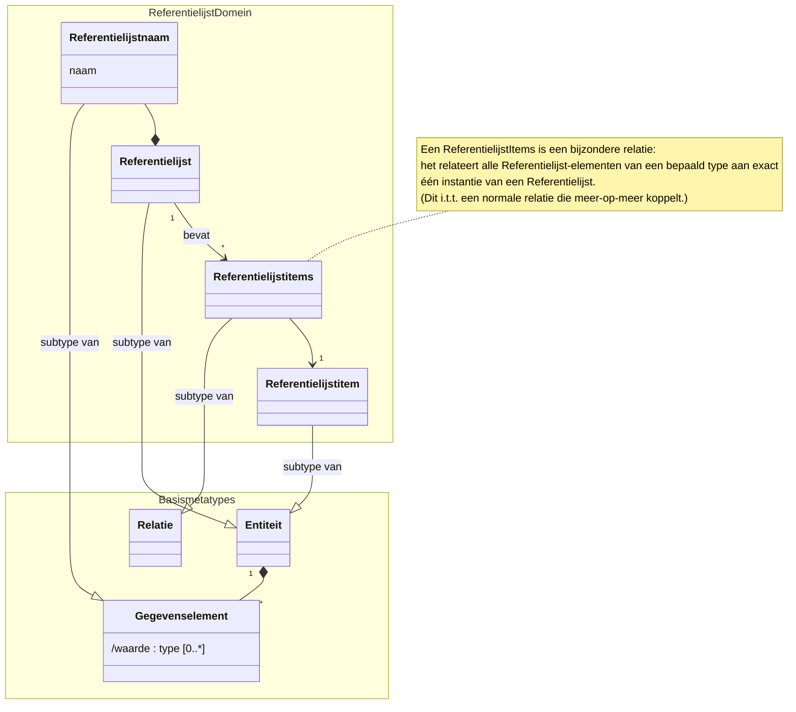
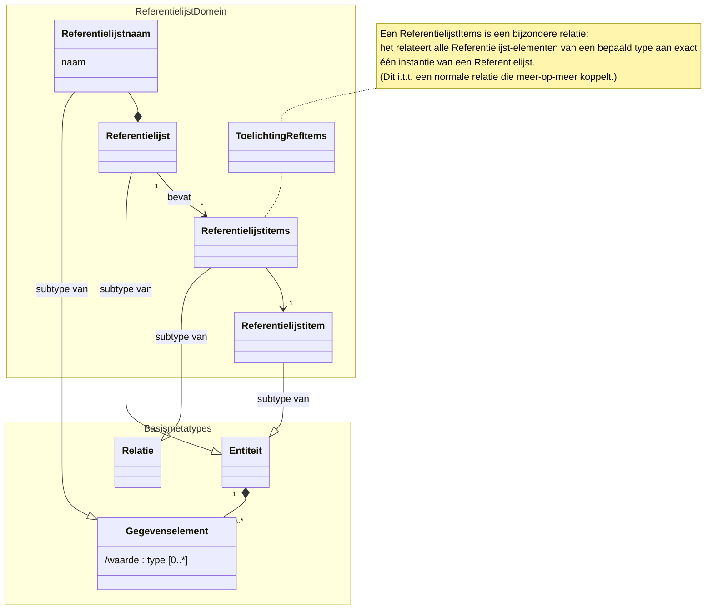
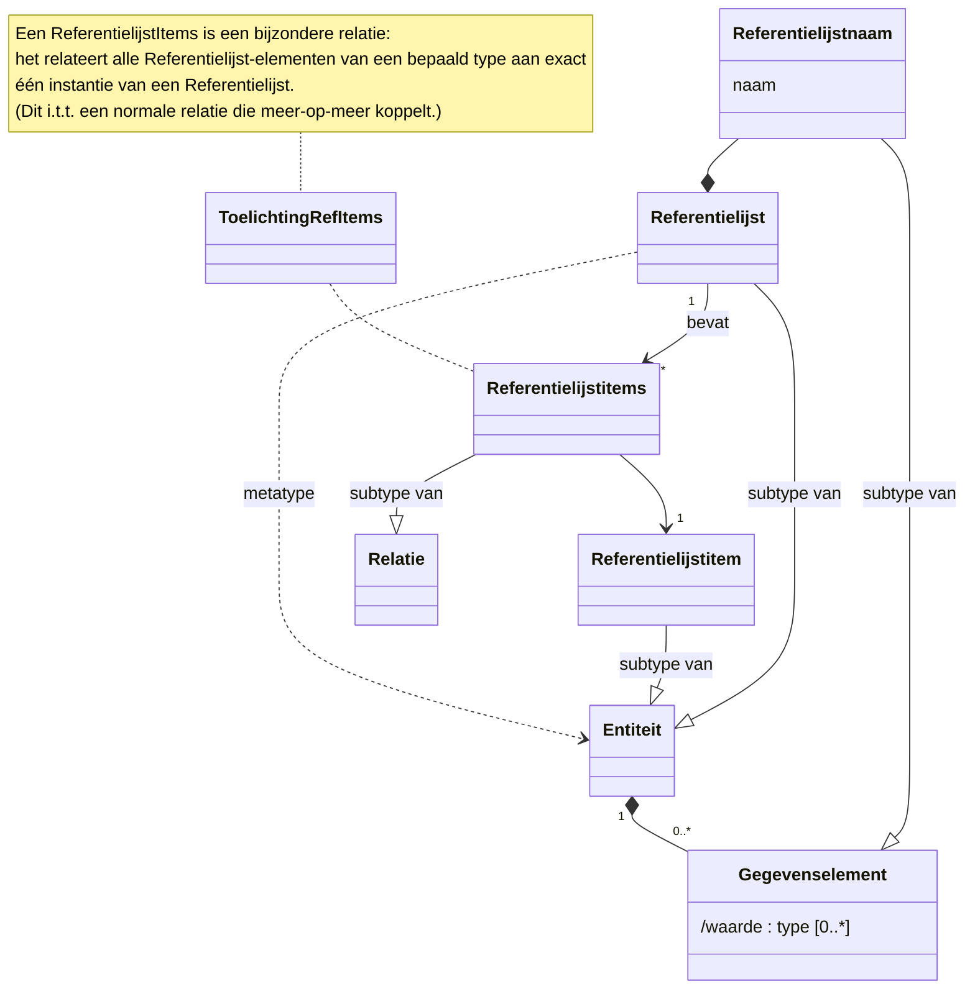

# Mermaid Class Diagram Layout Strategieën

Dit document beschrijft drie strategieën voor het optimaliseren van layout in Mermaid class diagrams, met praktische voorbeelden en uitleg.

---

## Strategie 1: Namespace-gegroepering met dolgende relaties

**Waarom dit werkt:**
- Namespaces (subtitles) in Mermaid sturen de layout door conceptueel gerelateerde klassen te groeperen
- Klassen in hetzelfde namespace blijven meestal visueel samen
- De volgorde van class-declaratie in de code beïnvloedt de initiële rendervolgorde
- Cross-namespace relaties (subtype-relaties, compositie) kunnen voorzichtig worden gebruikt om de positie extra te beïnvloeden

**Voordelen:**
- Duidelijke conceptuele scheiding (ReferentielijstDomein vs Basismetatypes)
- Stabiel in zowel light als dark theme
- Ook op GitHub goed zichtbaar
- Namespace-labels helpen bij begrijpen van de structuur

**Nadelen:**
- Note-objecten raken soms buiten het namespace
- Renderers kunnen de layout per theme anders interpreteren

---

## Strategie 2: Toelichting als Class binnen het Namespace

**Waarom dit werkt:**
- Class-objecten worden altijd binnen hun namespace gerenderd (geen renderer-inconsistentie)
- Door de toelichting als class te modelleren en met `..` (dotted dependency) aan het doelelement te koppelen, blijft alles samen
- De dotted line voegt geen semantische betekenis toe, maar stuurt layout
- Dit werkt consistent in alle renderers en themes

**Voordelen:**
- Toelichting blijft altijd binnen het domein zichtbaar
- Consistent in GitHub, VS Code, dark/light theme
- Geen renderer-specifieke note-rendering problemen
- Leesbaar en intuitief

**Nadelen:**
- De toelichting ziet er technisch uit als class, niet als opmerking (maar dit kan met CSS worden aangepast)
- Voegt een extra element toe aan het diagram

---

## Strategie 3: Vereenvoudigde Hiërarchie zonder Namespaces

**Waarom dit werkt:**
- Minder rendering-overhead (minder containers)
- Declaratievolgorde en expliciete layout-hints via dummy-knoppen
- Hulprelaties (dotted) kunnen voorzichtig gebruikt worden om layout te sturen
- Test-optimaal voor minimale aan dependencies

**Voordelen:**
- Eenvoudiger diagram
- Sneller te renderen
- Minimale renderer-afhankelijkheid

**Nadelen:**
- Minder conceptuele duidelijkheid
- Layout-hints zijn meer afhankelijk van de volgorde
- Minder stabiel bij minder gesofistikeerde renderers

---

## Aanbeveling

**Gebruik Strategie 2** (class als toelichting binnen namespace) voor het project:
- Je krijgt de visuele duidelijkheid van namespaces (ReferentielijstDomein/Basismetatypes)
- De toelichting blijft altijd binnen het domein zichtbaar (belangrijk voor dark theme op GitHub)
- Volledig consistent over alle renderers en themes

Voor toekomstige diagrammen: als je notities wilt toevoegen, maak ze als class/interface aan in plaats van `note for ...`.

