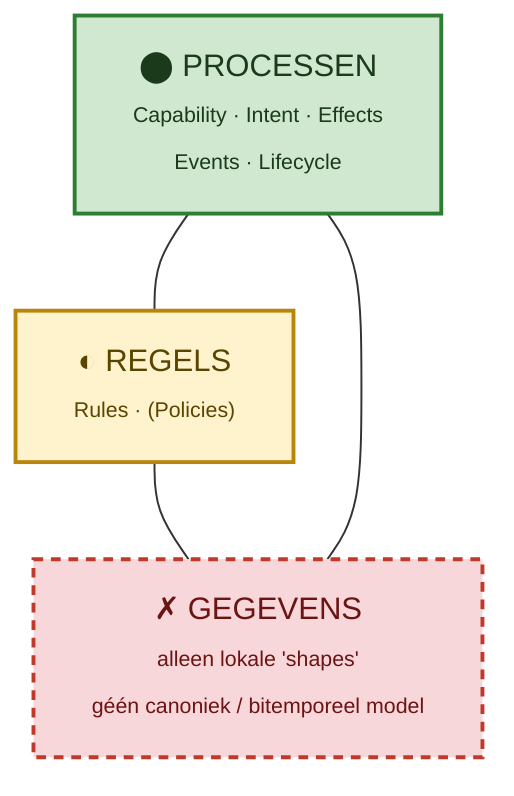
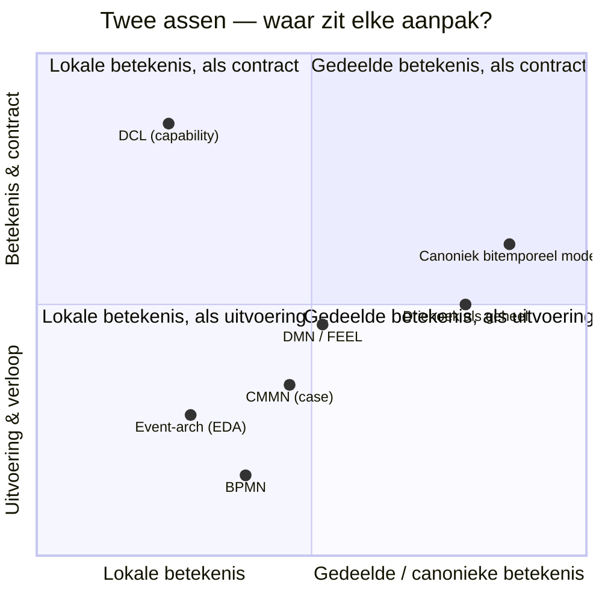

# Beschouwing — Russel East's *Declarative Capability Language* tegenover de driehoek Processen · Regels · Gegevens

*Datum: 2026-06-22 · auteur-context: Paratmos (www.paratmos.nl), Bitemporal_2026*

> Een denkstuk, geen voorgenomen ontwerp. Doel: de aanpak van Russel East
> ([Declarative Capability Language](https://russelleast.github.io/Capability-Language))
> naast de klassieke EA-driehoek **Processen – Regels – Gegevens** leggen en drie
> vragen beantwoorden: *(1)* mist DCL gegevens-met-betekenis? *(2)* kan het BPMN/DMN
> vervangen? *(3)* is het een event-architectuur of een soort CMMN?

---

## 1. De twee aanpakken in één alinea

**Declarative Capability Language (DCL)** wil de *vertaalkloof* tussen strategie en
runtime dichten door een **capability** tot first-class taalartefact te maken. Je
beschrijft software "by what it means". Acht primitieven: **Capability, Intent,
Outcomes, Rules, Effects, Events, Policies, Lifecycles**. Eén capability-blok is
inspecteerbaar én *compiler-verifieerbaar* (er is een compiler + VS Code-extensie,
status v0.9, experimenteel).

```dcl
capability RegisterCustomer {
  intent RegistrationInput from Customer
  outcomes { RegistrationAccepted; TermsRejected; VerificationDeferred }
  rule TermsAccepted: input.acceptedTerms is true
  effects {
    PersistRegistration
    SendVerificationMessage after PersistRegistration
  }
  events { emits VerificationMessageSent }
  when {
    TermsAccepted violated     then TermsRejected
    SendVerificationMessage unresolved then VerificationDeferred
    otherwise                  then RegistrationAccepted
  }
}
```

**De driehoek Processen – Regels – Gegevens** is klassieker en *separation-of-concerns*
in optima forma: het *gedrag* (procesvolgorde, BPMN), de *beslissingen/invarianten*
(regels, DMN/FEEL, CEL-expressies) en de *betekenis* (een canoniek, getypeerd,
hier zelfs **bitemporeel** datamodel — de MetaRegistry met REPs, velden, afgeleide
velden, enums en reflist-items). De drie hoeken zijn aparte disciplines die elkaar
via *lineage* raken.

Kern van het contrast: **DCL bundelt drie van de hoeken in één declaratie; de driehoek
houdt ze bewust apart en verbindt ze.**

---

## 2. Mapping: hoe vallen de primitieven op de hoeken?

| DCL-primitief | Processen | Regels | Gegevens |
|---|:---:|:---:|:---:|
| **Capability** | ⬤ (de "wat") | – | – |
| **Intent** (input/trigger) | ⬤ | – | ◐ (vorm van input) |
| **Outcomes** (named results) | ⬤ | ◐ | – |
| **Rules** (invarianten/decisions) | – | ⬤ | – |
| **Effects** (persistence, publish, notify) | ⬤ (volgorde) | – | ◐ (raakt data) |
| **Events** (emit/await) | ⬤ | – | – |
| **Policies** (security, reliability, governance) | – | ◐ | – |
| **Lifecycles** (state-progressie) | ⬤ | – | ◐ (toestand) |

⬤ = sterk aanwezig · ◐ = impliciet/zwak · – = afwezig

**Wat opvalt:** DCL dekt de hoeken **Processen** en **Regels** ruim, maar **Gegevens**
verschijnt alleen als *vorm* (de "shapes": `RegistrationInput`, `input.acceptedTerms`).
Dat is precies jouw observatie.

Visueel — DCL's acht primitieven geprojecteerd op de driehoek (de gegevenshoek
blijft grotendeels leeg):



---

## 3. De gegevenskloof — "data die automagisch betekenis en samenhang heeft"

Dit is het scherpste verschil, en je intuïtie klopt.

In DCL is data een **lokale shape**: een structuur die *binnen* een capability betekenis
krijgt door hoe de rules en effects haar gebruiken. De betekenis is **gebruiks­gebonden
en lokaal**. Er is geen aanwijzing dat twee capabilities die "Customer" noemen
*dezelfde* Customer bedoelen; geen canoniek model, geen referentielijsten, geen
afleidings­regels die overal hetzelfde betekenen, geen tijd-semantiek.

In jouw driehoek is **Gegevens een first-class hoek met eigen ontologie**:

- één **canoniek model** (MetaRegistry) waar `Customer` *overal* hetzelfde type is;
- **afgeleide velden** met CEL die betekenis dragen onafhankelijk van welk proces ze leest;
- **enums / reflist-items** als gedeelde vocabulaire;
- en — uniek — **bitemporaliteit**: elk feit heeft formele én materiële tijd, dus
  "wat wisten we wanneer" en "wat gold wanneer" zijn ingebouwd, niet nagebouwd.

Dat is de "samenhang die er automagisch is": betekenis zit in het *gedeelde model*,
niet in de *consument*. DCL's "describe software by what it means" stopt bij de
**capability**-betekenis; jouw aanpak trekt diezelfde ambitie door naar de
**gegevens**-betekenis. Dat is geen detail — het is de hoek waarop federatie,
herbruikbaarheid en datakwaliteit draaien (zie ook je *Reference Architecture for
Data Quality in Federated Data Sharing*).

> **Conclusie vraag 1:** Ja, DCL mist de datahoek. Het heeft *intent-shapes*, geen
> *canoniek, getypeerd, bitemporeel betekenismodel*. Het is sterk in "wat doet het
> systeem en wat betekent dat gedrag", zwak in "wat betekenen de gegevens, los van
> dit gedrag, en hoe hangen ze samen".

---

## 4. Kan DCL BPMN en DMN vervangen?

Genuanceerd: **DMN deels ja, BPMN deels — maar niet de zware kant.**

### 4a. DMN (beslissingen)
- DCL's `rule …: <expr>` + `when { … }` doen feitelijk wat een **DMN-beslissing**
  doet: condities evalueren en een uitkomst kiezen. Voor *eenvoudige* beslissingen
  is dit een prima, leesbaar alternatief — en het zit meteen in het gedragsmodel.
- Maar DMN levert méér: **decision tables** met hit-policies, **FEEL** als rijke
  expressietaal, en — cruciaal in jouw wereld — beslissingen die **input én output
  in canonieke datatypes/enums/reflist-items** uitdrukken. DCL's rules zijn boolean
  invarianten over een lokale shape; geen tabel-semantiek, geen gedeelde I/O-typen.
- Interessant: je hebt zelf **DMN net uit het metamodel gehaald** (`DMN drop from
  metamodel!`). Dat suggereert dat je de *beslis-as* liever via CEL/afgeleide velden
  en regels in het datamodel verankert dan als losstaande DMN-artefacten. Dat is
  filosofisch dichter bij DCL dan het lijkt: beslissing als *eigenschap van het model*,
  niet als apart diagram. Het verschil blijft: jij verankert in **Gegevens**, DCL in
  de **Capability**.

### 4b. BPMN (proces/orkestratie)
- DCL dekt **korte, declaratieve orkestratie**: effect-volgorde (`after`), outcome-
  progressie, lifecycles. Voor een capability met een handvol stappen vervangt dat
  een klein BPMN-diagram prima en leesbaarder.
- Wat DCL **niet** levert is de volwassen BPMN-machinerie die je expliciet als eis
  noemde: **sub-process, call-activity, boundary events, compensation, multi-instance,
  escalation, message-correlatie, timers**. Dat is geen toevallige omissie maar een
  *andere abstractielaag*: DCL beschrijft *betekenis van een capability*, niet de
  *executie­topologie van een langlopend, mens-in-de-loop proces*.

> **Conclusie vraag 2:** DCL is een **semantische bovenlaag**, geen
> proces-executie-engine. Het kan *het modelleren van eenvoudige beslissingen en
> korte orkestraties* vervangen, en dwingt expliciete uitkomsten af (winst). Maar het
> vervangt geen volwassen BPMN-engine en geen rijke DMN-tabellen. Eerder
> **complementair**: DCL als intentie-/contractlaag bóven een proces- en
> beslissingsmodel dat in jouw geval canoniek en bitemporeel is.

---

## 5. Is het een event-architectuur of een soort CMMN?

Het is **geen van beide zuiver** — en dat is verhelderend.

### Tegenover event-architectuur
DCL *kent* events (`emits`, await), maar de **besturing is niet event-driven**. De
flow wordt bepaald door de `when`-blokken: synchrone, declaratieve evaluatie van
rules en effect-resolutie binnen één capability. Events zijn **uitkomst-signalen naar
buiten**, geen *choreografie-mechanisme* dat capabilities aan elkaar rijgt. Een echte
event-architectuur (EDA/choreografie) heeft losgekoppelde reactoren op een bus; DCL
is intern eerder een **kleine, declaratieve orkestrator per capability**. Je *zou*
capabilities via hun emitted events kunnen koppelen, maar de taal modelleert die
choreografie (nog) niet.

### Tegenover CMMN / case management
Hier zit een echte verwantschap — en meteen het verschil. CMMN bestaat omdat veel
werk **niet aan het proces-axioma gehoorzaamt**: contexttaken die op elk moment
mogen (vraag aan collega, review aanvragen, klantfeedback toevoegen), gestuurd door
**toestand en gebeurtenissen** in plaats van een vaste volgorde — precies de taken
die je zelf noemde toen je een process-engine ontwierp.

- **Overeenkomst:** DCL's `when`-logica is *conditie-gedreven* ("als deze rule
  geschonden / dit effect onopgelost → deze uitkomst"), niet *volgorde-gedreven*.
  Dat is geestverwant aan CMMN's **sentries** (criteria die taken beschikbaar maken).
- **Verschil:** CMMN modelleert een **open case** met discretionaire taken, stages,
  milestones en menselijke beoordeling over tijd. DCL modelleert de **gesloten
  betekenis van één capability**: bekende intent, eindige uitkomsten, compiler-
  verifieerbaar. CMMN omarmt onbepaaldheid; DCL elimineert haar.

> **Conclusie vraag 3:** DCL is het beste te lezen als een **declaratief capability-
> contract** met een vleugje *rule-/sentry-denken* (CMMN-geest) en *uitkomst-events*
> (EDA-randje), maar het is noch een case-managementtaal noch een event-bus-
> architectuur. Het zit op een **andere as**: niet "hoe verloopt het werk over tijd"
> (BPMN/CMMN) en niet "wie reageert waarop" (EDA), maar **"wat betekent deze
> capability en welke uitkomsten zijn legitiem"**.

---

## 6. Synthese — twee assen, niet twee concurrenten

De diepste observatie: **jullie meten op verschillende assen.**

- DCL's as is **semantische volledigheid vóór implementatie**: capability als
  betekenis-eenheid, compiler-bewijsbaar, uitkomsten expliciet.
- De driehoek-as is **separation of concerns met gedeelde betekenis**: proces, regel
  en gegeven elk in hun eigen, volwassen formalisme, verbonden via een canoniek
  (bitemporeel) model en lineage.

Ze botsen niet; ze raken elkaar op interessante punten. Positioneer je de
benaderingen op twee assen — *lokale vs. gedeelde betekenis* (horizontaal) en
*uitvoering/verloop vs. betekenis/contract* (verticaal) — dan zie je dat ze
nauwelijks overlappen:



De diagonaal van **DCL** (links-boven) naar het **canonieke model** (rechts-onder­midden)
is precies de afstand die dit stuk beschrijft: DCL maximaliseert *contract & verifieerbaarheid*
maar laat betekenis *lokaal*; jouw datahoek maximaliseert *gedeelde betekenis*. Ze vullen
elkaar aan in plaats van te overlappen.

Raakvlakken in tabelvorm:

| Thema | Wat DCL eraan toevoegt | Wat de driehoek eraan toevoegt |
|---|---|---|
| **Uitkomsten** | Dwingt *named outcomes* af (succes/weigering/uitstel expliciet) — onderbelicht in pure BPMN | – |
| **Verifieerbaarheid** | Compiler/LSP over de capability | – |
| **Beslissingen** | Regels ín het gedragscontract | DMN-tabellen / CEL / afgeleide velden, in canonieke I/O |
| **Gegevens** | – (lokale shapes) | Canoniek, getypeerd, **bitemporeel** betekenismodel |
| **Lang lopend / case** | Lifecycles (licht) | BPMN-engine + CMMN-achtige contexttaken (zwaar) |
| **Federatie/datakwaliteit** | – | Gedeeld model als grondslag |

### Waar dit jou helpt
1. **Leen het *outcome-denken*.** DCL's beste idee is dat élke capability haar
   legitieme uitkomsten *expliciet en eindig* maakt (accepted/rejected/deferred).
   Dat is in jouw proces-engine een gratis kwaliteitsslag bovenop BPMN-end-events.
2. **Leen de *verifieerbaarheid als ambitie*, niet de taal.** Jouw equivalent van
   "compiler-verifieerbaar" is: regels en afgeleide velden valideren tégen het
   canonieke model — iets wat DCL niet kan omdat het dat model mist.
3. **Houd je datahoek vast als onderscheidend kapitaal.** Dat is exact wat DCL niet
   heeft. In een federatieve, datakwaliteit-gedreven context (jouw referentie-
   architectuur) is "data met automagische betekenis en samenhang" géén bijzaak maar
   de hele inzet. Een capability-taal zonder canoniek bitemporeel model lost het
   moeilijkste deel niet op — het verplaatst het naar "shapes" die per capability
   opnieuw betekenis krijgen.

### Eerlijk tegenargument
DCL's *kracht* is juist die soberheid: voor teams die verzuipen in losgekoppelde
BPMN/DMN/service-definities zónder gedeeld vocabulaire, geeft één inspecteerbaar
capability-blok onmiddellijke grip. Jouw driehoek is rijker maar duurder: hij vraagt
een onderhouden canoniek model, een bitemporele store en lineage. DCL is een *snelkookpan
voor betekenis*; de driehoek is een *fundament*. Wie het fundament al heeft (jij),
kan DCL's beste ideeën als *laagje* adopteren zonder de prijs te betalen.

---

## 7. Kort antwoord op je drie vragen

1. **Mis je gegevens in Russel's aanpak?** Ja, terecht. DCL heeft intent-*shapes*,
   geen canoniek, getypeerd, bitemporeel betekenismodel. Betekenis is daar lokaal en
   gebruiksgebonden; bij jou globaal en gedeeld.
2. **Vervangt het BPMN en DMN?** Deels en alleen aan de lichte kant: eenvoudige
   beslissingen en korte orkestraties ja, met als bonus expliciete uitkomsten. Maar
   geen volwassen BPMN-engine en geen rijke DMN-tabellen met canonieke I/O. Complementair,
   geen vervanger.
3. **Event-architectuur of CMMN?** Geen van beide zuiver. Het is een **declaratief
   capability-contract** met een CMMN-achtig conditie-/sentry-randje en EDA-achtige
   uitkomst-events — op een andere as dan "verloop over tijd" of "wie reageert waarop".

---

*Bronnen:*
- *Declarative Capability Language* — Russel East, <https://russelleast.github.io/Capability-Language>
- Paratmos EA-driehoek Processen · Regels · Gegevens — <https://www.paratmos.nl>
- Eigen context: MetaRegistry / canoniek bitemporeel model (Bitemporal_2026), process-engine-analyse (2026-05-19), `DMN drop from metamodel`, *Reference Architecture for Data Quality in Federated Data Sharing*.
