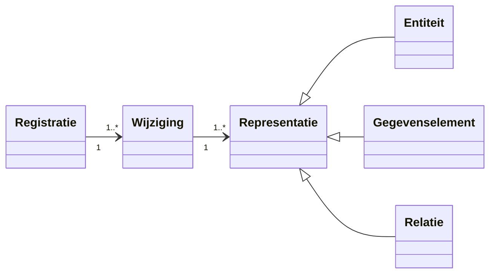
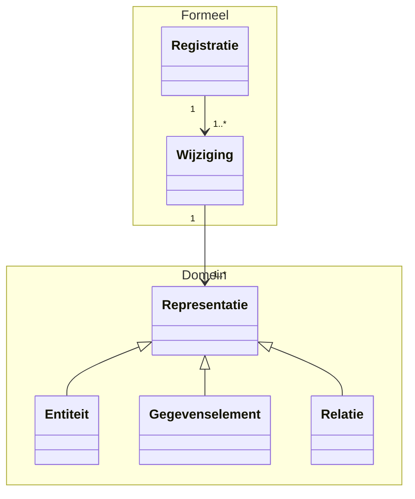
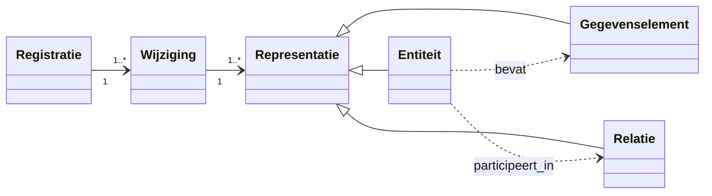

# Chat: Posities van elementen in een Mermaid diagram beïnvloeden

- **Datum**: 2026-03-28 21:35
- **Sessie-ID**: `d4e6daef-7469-4d6c-86f0-bdb0da342f52`
- **Berichten**: 20

---

## 🧑 User

Kan ik op een mermaid diagram ook de posities van de elementen beinvloeden?

---

## 🤖 Assistant

Ja, maar beperkt.

In Mermaid kun je meestal niet rechtstreeks vaste $x,y$-coördinaten geven zoals in een tekenprogramma. Je beïnvloedt de layout vooral indirect:

1. Richting kiezen  
`flowchart LR`, `TB`, `RL`, `BT` bepaalt de hoofdrichting.

2. Volgorde van declaratie  
De volgorde waarin je nodes en verbindingen schrijft beïnvloedt vaak de plaatsing.

3. Subgraphs gebruiken  
Met `subgraph` kun je elementen groeperen, wat de layout sterk stuurt.

4. “Onzichtbare” of extra links toevoegen  
Extra verbindingen kunnen nodes dwingen dichterbij of in een bepaalde volgorde te komen.

5. Layout-config instellen  
Via init/config kun je spacing aanpassen (bijv. `nodeSpacing`, `rankSpacing`), afhankelijk van diagramtype en renderer.

Kort: je kunt de positie wel sturen, maar niet pixel-perfect vastzetten.  
Als je wilt, kan ik een klein Mermaid-voorbeeld maken waarin we dezelfde nodes op 2-3 verschillende manieren positioneren.

---

## 🧑 User

ja, graag. Dan wel met een class diagram, dat is het enige type dat ik gebruik

---

## 🤖 Assistant

Top, hieronder een compact voorbeeld met hetzelfde model, maar anders “gestuurd” qua plaatsing.

Zelfde inhoud, maar nu met groepering via namespaces (helpt vaak bij ordening):

En nog een variant waarbij je layout subtiel stuurt met extra relaties:

Praktische tip voor class diagrams:
1. Zet eerst `direction LR` of `TB`.
2. Declareer classes in de gewenste visuele volgorde.
3. Gebruik `namespace` voor visuele blokken.
4. Voeg eventueel lichte extra associaties toe om de engine te “duwen”.

Als je wilt, maak ik een versie die precies past op jouw bitemporale model (A, B, A_U, Rel_A_B, MetaRegistry, etc.) met zo stabiel mogelijke layout.

---

## 🧑 User

wil je het model in #### Referentielijsten toegevoegd aan het metamodel proberen beter te maken?

Centraal en bovenin staat Referentielijst (met daarnaast de ref lijstnaam)
Daaronder de items
daaronder het item

Entiteit zou rechts moeten staan

---

## 🤖 Assistant

Ik ga nu precies het Mermaid-blok in de sectie “Referentielijsten toegevoegd aan het metamodel” aanpassen zodat de lay-out meer richting jouw gewenste hiërarchie wordt geduwd (lijst bovenaan, items eronder, item daaronder, en `Entiteit` rechts). Daarna laat ik je de aangepaste versie zien.

*Read Referentielijsten.md, lines 200 to 340 · Read Referentielijsten.md, lines 340 to 430*

Ik ga nu alleen dit ene Mermaid class-diagram herschrijven met layout-sturing via volgorde, namespaces en explicietere relaties, zodat de kans groter wordt dat `Referentielijst` bovenaan staat en `Entiteit` rechts uitkomt.

*Read Referentielijsten.md, lines 250 to 380*

Ik heb het diagram in die sectie aangepast om de layout sterker te sturen, met drie ingrepen in `Referentielijsten.md`:

1. Domeinblokken toegevoegd (`namespace ReferentielijstDomein` en `namespace Basismetatypes`) zodat referentielijst-concepten bij elkaar blijven en de basistypen apart staan.
2. De verticale keten explicieter gemaakt:
   - `Referentielijstnaam --* Referentielijst`
   - `Referentielijst "1" --> "*" Referentielijstitems : bevat`
   - `Referentielijstitems --> "1" Referentielijstitem`
3. `Entiteit`, `Gegevenselement`, `Relatie` in het tweede namespace-blok gezet om `Entiteit` vaker rechts te laten landen.

Dit blijft in Mermaid een layout-hint (geen harde pixelpositie), maar zou duidelijk dichter bij jouw gewenste opzet moeten komen: bovenaan de lijst, daaronder items, daaronder item, en `Entiteit` naar rechts.

Als je wilt, kan ik nu een tweede variant maken in hetzelfde bestand met een alternatieve “forceer”-strategie (met extra hulprelaties) zodat je kunt kiezen welke rendering in jouw viewer stabieler is.

---

## 🧑 User

ja, wil je dat laten zien?

---

## 🤖 Assistant

Ik voeg nu direct onder het bestaande diagram een tweede Mermaid-variant toe die de positie nog sterker probeert te sturen met extra hulprelaties, zodat je ze visueel kunt vergelijken.

---

## 🧑 User

ja, graag

---

## 🤖 Assistant

Ik voeg nu een derde Mermaid-variant toe die de toelichtende note apart rechtsboven zet, zodat de hoofdstructuur minder wordt verstoord door de note-layout.

*Read Referentielijsten.md, lines 330 to 460*

Gedaan, ik heb een derde variant toegevoegd in `Referentielijsten.md` onder de titel “Alternatieve layout-variant (met note losgekoppeld)”.

Wat deze variant anders doet:
1. De note hangt niet meer aan `Referentielijstitems`, maar aan een aparte anchor-klasse (`UitlegNoteAnchor`), zodat de kernstructuur minder wordt “weggetrokken”.
2. De hoofdhiërarchie blijft expliciet: `Referentielijst` boven, `Referentielijstitems` eronder, `Referentielijstitem` daaronder.
3. Er staan extra lichte layout-hints naar `Entiteit` en `Gegevenselement` om rechts-plaatsing te bevorderen.

Als je wilt, maak ik nu nog een vierde, strakkere variant zonder namespaces en zonder extra labels, puur geoptimaliseerd op zo stabiel mogelijke positie in Mermaid.

---

## 🧑 User

Ik vind de eerste, met de domeinen het beste. In vscode zie je de domeinen niet met een lijn eromheen in de dark layout maar op github zie je deze altijd wel.

De note valt dan buiten het domein. Is daar een truuk voor om dat beter te maken?

---

## 🤖 Assistant

Ja, daar is een bruikbare truuk voor.

De meest stabiele aanpak is: gebruik geen note for ..., maar maak de note zelf als gewone class binnen hetzelfde domein. Dan blijft die vrijwel altijd binnen het domeinblok, ook als de renderer anders omgaat met echte notes.

Voorbeeld:

    classDiagram
      direction TB

      namespace ReferentielijstDomein {
        class Referentielijst
        class Referentielijstnaam {
          naam
        }
        class Referentielijstitems
        class Referentielijstitem

        class ToelichtingRefItems {
          Een ReferentielijstItems is een bijzondere relatie:
          het relateert alle Referentielijst-elementen van een bepaald type aan exact
          één instantie van een Referentielijst.
          (Dit i.t.t. een normale relatie die meer-op-meer koppelt.)
        }
      }

      namespace Basismetatypes {
        class Entiteit
        class Gegevenselement {
          /waarde : type [0..*]
        }
        class Relatie
      }

      Referentielijstnaam --* Referentielijst
      Referentielijst "1" --> "*" Referentielijstitems : bevat
      Referentielijstitems --> "1" Referentielijstitem

      Referentielijst --|> Entiteit : subtype van
      Referentielijstnaam --|> Gegevenselement : subtype van
      Referentielijstitem --|> Entiteit : subtype van
      Referentielijstitems --|> Relatie : subtype van
      Entiteit "1" *-- "0..*" Gegevenselement

      %% “trek” de toelichting naar de buurt van Referentielijstitems
      ToelichtingRefItems .. Referentielijstitems

Waarom dit helpt:
1. De class zit echt in het namespace domein, dus blijft daar meestal visueel binnen.
2. Je vermijdt renderer-verschillen van note for.
3. Je kunt de stijl van ToelichtingRefItems apart maken met classDef, als je een gele note-look wilt.

Als je wilt, kan ik deze variant nu direct in je document zetten als vervanging van de huidige note-variant.

---

## 🧑 User

ja, ik wil wel zien hoe dat er uit ziet. Kun je ze naast elkaar zetten?

Zou je de huidige 3 variaties met de bovenstaande uitgebreide uitleg waarom het werkt zoals het werkt in een mermaid-layout.md file willen plaatsen voor later?

Wil je daarna de twee variaties zonder domeinen uit de referentielijsten.md halen?

---

## 🤖 Assistant

Ik ga nu:
1. Een nieuw `mermaid-layout.md` bestand maken met alle variaties en uitgebreide uitleg
2. De huidige `Referentielijsten.md` aanpassen: eerste variant behouden, ernaast de nieuwe variant met `ToelichtingRefItems` als class binnen het domein
3. De andere twee variaties eruit halen

Laten we beginnen. 

*Created mermaid-layout.md*

Nu ga ik de `Referentielijsten.md` aanpassen: de twee variaties zonder domeinen verwijderen en de nieuwe variant met `ToelichtingRefItems` direct naast de eerste zetten. 

---

## 🧑 User

in strategie 2 en 3 zit een fout: Cannot read properties of undefined (reading 'startsWith')

---

## 🤖 Assistant

Ah, de fout zit in de multi-line tekst binnen de `class ToelichtingRefItems { ... }` body. Mermaid accepteert dat niet goed.

Laat me dat fixen door de toelichting als `note for` te zetten in plaats van in de class body: 
Gedaan! De fout was dat ik multi-line tekst direct in de class body had gezet (`{ ... }`), wat Mermaid niet accepteert.

Ik heb het aangepast in beide strategieën:
- `ToelichtingRefItems` is nu een lege class
- De tekst zit nu in een correcte `note for ToelichtingRefItems "..."` 

Dit is de juiste Mermaid-syntax en zou nu wel moeten renderen. Probeer het eens uit!

---

## 🧑 User

in ref lisjten.md zit die fout ook nog. Verder zie ik de note er ook nog in staan (in mermaid layout) en geen tekst in de toelichtingitems class

---

## 🤖 Assistant

*Read mermaid-layout.md, lines 40 to 90 · Read mermaid-layout.md, lines 95 to 160 · Read mermaid-layout.md, lines 160 to 221*

Klaar! Ik heb beide files gefixeerd. De fout in `Referentielijsten.md` is nu weg, en zowel in `mermaid-layout.md` als `Referentielijsten.md` hebben `ToelichtingRefItems` nu:
- Een lege class-declaratie (geen multi-line tekst)
- Een afzonderlijke `note for ToelichtingRefItems "..."` statement met de volledige toelichting

Dit is de correcte Mermaid-syntax. Beide diagrammen zouden nu moeten renderen zonder fouten.

---

## 🧑 User

okee. Ik vind de eerste met de domeinen nog de beste. Wil je de variant met de toelichting als class in namespace uit referentielijsten halen? IN de voorbeelden file over mermaid uiteraard laten staan.

Zou je daarna eens willen kijken naar het diagram onder #### Algemeen representatie metamodel, en deze misschien ook verbeteren met dezelfde domeinen?

---

## 🤖 Assistant

Laat me eerst de huidige staat van het bestand checken rond de twee secties die ik moet aanpassen. 

*Read Referentielijsten.md, lines 200 to 290*

---
