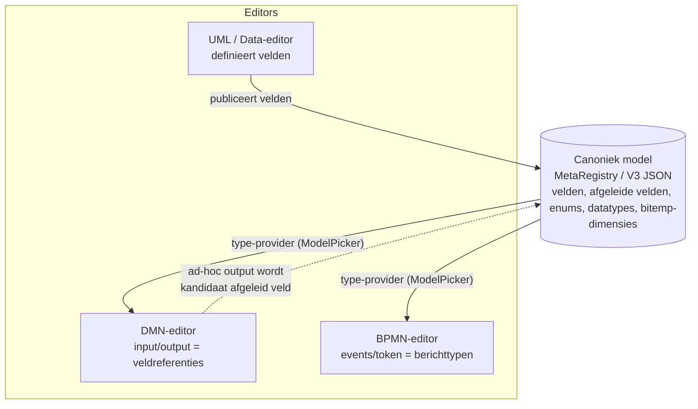
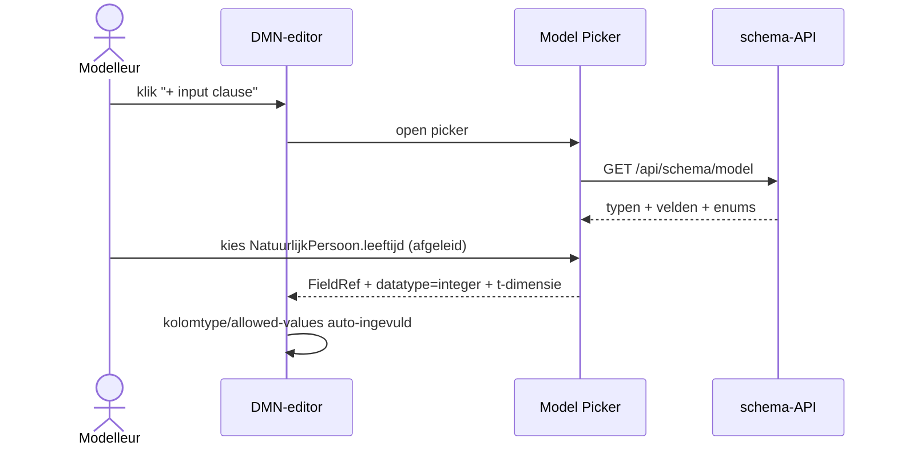
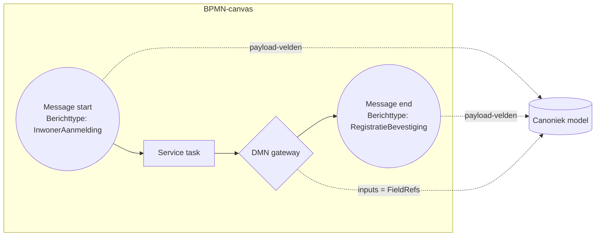

# Chat: Process engine development analysis

- **Datum**: 2026-05-19 18:47
- **Sessie-ID**: `5022d490-be55-478b-8fc4-3081f4798ea2`
- **Berichten**: 49

---

## 🧑 User

# Process Engine
I would like to have a process engine that is flexible enough to configure
- BPMN
- DMN
- CMMI
and use these action-definitions in relation to each other.

I know open source tools like Operaton and Valtimo (not sure that is open source) (Camunda spin-off(s) after it went closed source) exist. I could work on top of them if that pays off.

Important is that:
- the complete BPMN definition is implemented, including sub-process and call-activity
- data can be linked to a canonical data model, e.g. the type of metamodels we make in this project
- DMN can use this REPs and their velden / afgeleide velden as input
- DMN output can be defined in terms of the same data types, enums and reflistitems as we use in the canonical model
- processes can use this data definitions in the same manner and also produce data in the same canonical model language via the input and output event definitions and within the process when delegating service tasks to APIs
- script tasks can use one or more script languages and data can be used in the same way we use it in CEL expressions in derived fields, or expressions in our form definitions

The reason that I would like to include CMMI, but not necessairily exactly CMMI is that:
- we often have context tasks, that van be executed at any time
- they may be modeled via ad hoc processes or in other ways, but in fact, I think they just don't obey the process axioma. They are context tasks, that respond to events or data state. Or are user related.
- examples:
  - ask a colleague a question about this case
  - delegate a task to a third party (can be modelled in the process, but some tasks just are always possible)
  - ask for a review
  - attach client feedback to a case (at almost any moment)

Can you analyse the trade-off between working on top of these or bravely starting our own engine?

---

## 🤖 Assistant

# Trade-off: bouwen op een bestaande engine vs. zelf bouwen

Voordat ik een plan maak: hier is mijn analyse. Dit is een denkstuk om op te reageren, geen voorgenomen plan.

## Het landschap (kort)

| Engine | BPMN | DMN | Case/ad-hoc | Stack | Licentie | Status |
|---|---|---|---|---|---|---|
| **Operaton** | volledig (C7-fork) | volledig (FEEL) | CMMN aanwezig (legacy) | JVM/Spring | Apache 2.0 | Actief, community-fork na Camunda 7 EOL |
| **Camunda 7 CE** | volledig | volledig | CMMN | JVM | Apache 2.0 (EOL okt 2025) | End-of-life — niet starten |
| **Camunda 8 / Zeebe** | volledig | apart (DMN-engine) | géén CMMN | JVM + gRPC | Camunda License (source-available, niet OSS) | Actief, cloud-first |
| **Flowable CE** | volledig | volledig | CMMN | JVM | Apache 2.0 | Actief |
| **Valtimo** | bovenop Camunda/Flowable | via onder | ja (case-mgmt opinionated) | JVM/Kotlin + Angular | EUPL/LGPL-achtig | Actief, NL-overheid georiënteerd |
| **jBPM / Activiti** | volledig | volledig | wisselend | JVM | Apache 2.0 | Activiti rustig, jBPM (KIE) actief |
| **Go-native** (bv. shar, temporal-bpmn-experimenten) | beperkt/onvolwassen | nee/beperkt | nee | Go | varieert | Geen serieuze kandidaat voor productie |

Belangrijke realiteit: **er is geen volwassen Go-native BPMN+DMN+CMMN-engine**. Alle serieuze opties zijn JVM. CMMN is door OMG/Camunda effectief afgeschreven; Camunda 8 ondersteunt het bewust niet meer.

## Past dit bij jullie wensen?

Je vereisten gemapt op de opties:

1. **Volledige BPMN incl. sub-process & call-activity** — Operaton/Flowable/Camunda hebben dit allemaal native. Zelfbouw = jaren werk om dezelfde dekking te krijgen (boundary events, compensation, multi-instance, escalation, message correlation, timers).
2. **Data gekoppeld aan canoniek (MetaRegistry) model** — geen enkele engine doet dit out-of-the-box. Process-variabelen zijn typisch JSON/POJO. Dit is hoe dan ook integratie-werk, ongeacht engine-keuze. Hetzelfde geldt voor 5 en 6.
3. **DMN met REPs/velden/afgeleide velden als input** — FEEL accepteert objecten/contexten; je voert gewoon je REP-snapshot in. Output mappen naar jullie types/enums/reflistitems vergt een adapterlaag — vergelijkbaar werk in elke engine.
4. **Script tasks met meerdere talen** — Operaton/Flowable ondersteunen JSR-223 (JavaScript/Groovy/Python via GraalVM/Nashorn). CEL kun je als custom script-engine 

---

## 🤖 Assistant

# Trade-off: bouwen op een bestaande engine vs. zelf bouwen

Voordat ik een plan maak: hier is mijn analyse. Dit is een denkstuk om op te reageren, geen voorgenomen plan.

## Het landschap (kort)

| Engine | BPMN | DMN | Case/ad-hoc | Stack | Licentie | Status |
|---|---|---|---|---|---|---|
| **Operaton** | volledig (C7-fork) | volledig (FEEL) | CMMN aanwezig (legacy) | JVM/Spring | Apache 2.0 | Actief, community-fork na Camunda 7 EOL |
| **Camunda 7 CE** | volledig | volledig | CMMN | JVM | Apache 2.0 (EOL okt 2025) | End-of-life — niet starten |
| **Camunda 8 / Zeebe** | volledig | apart (DMN-engine) | géén CMMN | JVM + gRPC | Camunda License (source-available, niet OSS) | Actief, cloud-first |
| **Flowable CE** | volledig | volledig | CMMN | JVM | Apache 2.0 | Actief |
| **Valtimo** | bovenop Camunda/Flowable | via onder | ja (case-mgmt opinionated) | JVM/Kotlin + Angular | EUPL/LGPL-achtig | Actief, NL-overheid georiënteerd |
| **jBPM / Activiti** | volledig | volledig | wisselend | JVM | Apache 2.0 | Activiti rustig, jBPM (KIE) actief |
| **Go-native** (bv. shar, temporal-bpmn-experimenten) | beperkt/onvolwassen | nee/beperkt | nee | Go | varieert | Geen serieuze kandidaat voor productie |

Belangrijke realiteit: **er is geen volwassen Go-native BPMN+DMN+CMMN-engine**. Alle serieuze opties zijn JVM. CMMN is door OMG/Camunda effectief afgeschreven; Camunda 8 ondersteunt het bewust niet meer.

## Past dit bij jullie wensen?

Je vereisten gemapt op de opties:

1. **Volledige BPMN incl. sub-process & call-activity** — Operaton/Flowable/Camunda hebben dit allemaal native. Zelfbouw = jaren werk om dezelfde dekking te krijgen (boundary events, compensation, multi-instance, escalation, message correlation, timers).
2. **Data gekoppeld aan canoniek (MetaRegistry) model** — geen enkele engine doet dit out-of-the-box. Process-variabelen zijn typisch JSON/POJO. Dit is hoe dan ook integratie-werk, ongeacht engine-keuze. Hetzelfde geldt voor 5 en 6.
3. **DMN met REPs/velden/afgeleide velden als input** — FEEL accepteert objecten/contexten; je voert gewoon je REP-snapshot in. Output mappen naar jullie types/enums/reflistitems vergt een adapterlaag — vergelijkbaar werk in elke engine.
4. **Script tasks met meerdere talen** — Operaton/Flowable ondersteunen JSR-223 (JavaScript/Groovy/Python via GraalVM/Nashorn). CEL kun je als custom script-engine inpluggen.
5. **CMMN-achtige context-/ad-hoc taken** — jouw beschrijving is # Trade-off: bouwen op een bestaande engine vs. zelf bouwen

Voordat ik een plan maak: hier is mijn analyse. Dit is een denkstuk om op te reageren, geen voorgenomen plan.

## Het landschap (kort)

| Engine | BPMN | DMN | Case/ad-hoc | Stack | Licentie | Status |
|---|---|---|---|---|---|---|
| **Operaton** | volledig (C7-fork) | volledig (FEEL) | CMMN aanwezig (legacy) | JVM/Spring | Apache 2.0 | Actief, community-fork na Camunda 7 EOL |
| **Camunda 7 CE** | volledig | volledig | CMMN | JVM | Apache 2.0 (EOL okt 2025) | End-of-life — niet starten |
| **Camunda 8 / Zeebe** | volledig | apart (DMN-engine) | géén CMMN | JVM + gRPC | Camunda License (source-available, niet OSS) | Actief, cloud-first |
| **Flowable CE** | volledig | volledig | CMMN | JVM | Apache 2.0 | Actief |
| **Valtimo** | bovenop Camunda/Flowable | via onder | ja (case-mgmt opinionated) | JVM/Kotlin + Angular | EUPL/LGPL-achtig | Actief, NL-overheid georiënteerd |
| **jBPM / Activiti** | volledig | volledig | wisselend | JVM | Apache 2.0 | Activiti rustig, jBPM (KIE) actief |
| **Go-native** (bv. shar, temporal-bpmn-experimenten) | beperkt/onvolwassen | nee/beperkt | nee | Go | varieert | Geen serieuze kandidaat voor productie |

Belangrijke realiteit: **er is geen volwassen Go-native BPMN+DMN+CMMN-engine**. Alle serieuze opties zijn JVM. CMMN is door OMG/Camunda effectief afgeschreven; Camunda 8 ondersteunt het bewust niet meer.

## Past dit bij jullie wensen?

Je vereisten gemapt op de opties:

1. **Volledige BPMN incl. sub-process & call-activity** — Operaton/Flowable/Camunda hebben dit allemaal native. Zelfbouw = jaren werk om dezelfde dekking te krijgen (boundary events, compensation, multi-instance, escalation, message correlation, timers).
2. **Data gekoppeld aan canoniek (MetaRegistry) model** — geen enkele engine doet dit out-of-the-box. Process-variabelen zijn typisch JSON/POJO. Dit is hoe dan ook integratie-werk, ongeacht engine-keuze. Hetzelfde geldt voor 5 en 6.
3. **DMN met REPs/velden/afgeleide velden als input** — FEEL accepteert objecten/contexten; je voert gewoon je REP-snapshot in. Output mappen naar jullie types/enums/reflistitems vergt een adapterlaag — vergelijkbaar werk in elke engine.
4. **Script tasks met meerdere talen** — Operaton/Flowable ondersteunen JSR-223 (JavaScript/Groovy/Python via GraalVM/Nashorn). CEL kun je als custom script-engine inpluggen.
5. **CMMN-achtige context-/ad-hoc taken** — jouw beschrijving is géén volledige CMMN. Het is: "altijd-beschikbare taken naast een lopend proces" + "event/data-driven taken". Dit is een **case-management-patroon** dat bovenop elke engine te bouwen is (Valtimo doet precies dit). Volledig CMMN-engine implementeren is niet nodig en wordt door de markt verlaten.

## Drie reële paden

### A. Operaton als embedded engine (sidecar JVM)
- **Voor**: snelste time-to-spec-compleetheid; je krijgt BPMN+DMN+CMMN gratis; Apache 2.0; mature tooling (Modeler, Cockpit, history).
- **Tegen**: JVM-sidecar in je Go/PG-stack; je bouwt zelf de canonieke-model-adapter, REST/gRPC-brug en case-management-laag voor ad-hoc taken; je erft een groot oppervlak dat je niet allemaal nodig hebt.
- **Inspanning**: laag tot middel (vooral integratie).

### B. Valtimo als platform
- **Voor**: je krijgt de case-management-laag (jouw CMMN-vervangers) er al bij; opinionated, dus minder zelf bedenken; NL-overheidsfocus past bij jullie domein.
- **Tegen**: zwaarder en opinionated frontend/backend; je verliest controle over je eigen UX en data-model; integratie met jullie MetaRegistry-gedreven frontend is fundamenteel niet de bedoeling van Valtimo.
- **Inspanning**: middel, maar je past je eigen project meer aan dan andersom.

### C. Eigen Go-engine, scope-gestuurd
- **Voor**: één taal/stack; volledige controle; eerste-klas integratie met MetaRegistry, # Trade-off: bouwen op een bestaande engine vs. zelf bouwen

Voordat ik een plan maak: hier is mijn analyse. Dit is een denkstuk om op te reageren, geen voorgenomen plan.

## Het landschap (kort)

| Engine | BPMN | DMN | Case/ad-hoc | Stack | Licentie | Status |
|---|---|---|---|---|---|---|
| **Operaton** | volledig (C7-fork) | volledig (FEEL) | CMMN aanwezig (legacy) | JVM/Spring | Apache 2.0 | Actief, community-fork na Camunda 7 EOL |
| **Camunda 7 CE** | volledig | volledig | CMMN | JVM | Apache 2.0 (EOL okt 2025) | End-of-life — niet starten |
| **Camunda 8 / Zeebe** | volledig | apart (DMN-engine) | géén CMMN | JVM + gRPC | Camunda License (source-available, niet OSS) | Actief, cloud-first |
| **Flowable CE** | volledig | volledig | CMMN | JVM | Apache 2.0 | Actief |
| **Valtimo** | bovenop Camunda/Flowable | via onder | ja (case-mgmt opinionated) | JVM/Kotlin + Angular | EUPL/LGPL-achtig | Actief, NL-overheid georiënteerd |
| **jBPM / Activiti** | volledig | volledig | wisselend | JVM | Apache 2.0 | Activiti rustig, jBPM (KIE) actief |
| **Go-native** (bv. shar, temporal-bpmn-experimenten) | beperkt/onvolwassen | nee/beperkt | nee | Go | varieert | Geen serieuze kandidaat voor productie |

Belangrijke realiteit: **er is geen volwassen Go-native BPMN+DMN+CMMN-engine**. Alle serieuze opties zijn JVM. CMMN is door OMG/Camunda effectief afgeschreven; Camunda 8 ondersteunt het bewust niet meer.

## Past dit bij jullie wensen?

Je vereisten gemapt op de opties:

1. **Volledige BPMN incl. sub-process & call-activity** — Operaton/Flowable/Camunda hebben dit allemaal native. Zelfbouw = jaren werk om dezelfde dekking te krijgen (boundary events, compensation, multi-instance, escalation, message correlation, timers).
2. **Data gekoppeld aan canoniek (MetaRegistry) model** — geen enkele engine doet dit out-of-the-box. Process-variabelen zijn typisch JSON/POJO. Dit is hoe dan ook integratie-werk, ongeacht engine-keuze. Hetzelfde geldt voor 5 en 6.
3. **DMN met REPs/velden/afgeleide velden als input** — FEEL accepteert objecten/contexten; je voert gewoon je REP-snapshot in. Output mappen naar jullie types/enums/reflistitems vergt een adapterlaag — vergelijkbaar werk in elke engine.
4. **Script tasks met meerdere talen** — Operaton/Flowable ondersteunen JSR-223 (JavaScript/Groovy/Python via GraalVM/Nashorn). CEL kun je als custom script-engine inpluggen.
5. **CMMN-achtige context-/ad-hoc taken** — jouw beschrijving is géén volledige CMMN. Het is: "altijd-beschikbare taken naast een lopend proces" + "event/data-driven taken". Dit is een **case-management-patroon** dat bovenop elke engine te bouwen is (Valtimo doet precies dit). Volledig CMMN-engine implementeren is niet nodig en wordt door de markt verlaten.

## Drie reële paden

### A. Operaton als embedded engine (sidecar JVM)
- **Voor**: snelste time-to-spec-compleetheid; je krijgt BPMN+DMN+CMMN gratis; Apache 2.0; mature tooling (Modeler, Cockpit, history).
- **Tegen**: JVM-sidecar in je Go/PG-stack; je bouwt zelf de canonieke-model-adapter, REST/gRPC-brug en case-management-laag voor ad-hoc taken; je erft een groot oppervlak dat je niet allemaal nodig hebt.
- **Inspanning**: laag tot middel (vooral integratie).

### B. Valtimo als platform
- **Voor**: je krijgt de case-management-laag (jouw CMMN-vervangers) er al bij; opinionated, dus minder zelf bedenken; NL-overheidsfocus past bij jullie domein.
- **Tegen**: zwaarder en opinionated frontend/backend; je verliest controle over je eigen UX en data-model; integratie met jullie MetaRegistry-gedreven frontend is fundamenteel niet de bedoeling van Valtimo.
- **Inspanning**: middel, maar je past je eigen project meer aan dan andersom.

### C. Eigen Go-engine, scope-gestuurd
- **Voor**: één taal/stack; volledige controle; eerste-klas integratie met MetaRegistry, V3 JSON, CEL, afgeleide velden, schema-API; geen JVM-dependency; perfect bij jullie "alles dynamisch uit metaregistry"-filosofie.
- **Tegen**: BPMN-spec is groot en vol valkuilen (token-flow, compensation, event-subprocess, message correlation, timers met tijdreizen!); DMN met FEEL is een aparte stevige interpreter; je hertekent jaren werk.
- **Inspanning**: hoog tot zeer hoog voor spec-volledigheid.

## Mijn aanbeveling

**Hybride: A + selectieve eigenbouw.** Concreet:

1. **Operaton als runtime** voor BPMN- en DMN-uitvoering, als sidecar achter een dunne Go-gateway. Je hergebruikt jaren werk aan spec-correctheid en tooling (Modeler, Cockpit).
2. **Adapterlaag in Go** die process-variabelen ↔ canonieke MetaRegistry-objecten vertaalt, en service-tasks routeert naar jullie bestaande handlers/GraphQL/REST. Hier maak je de "data # Trade-off: bouwen op een bestaande engine vs. zelf bouwen

Voordat ik een plan maak: hier is mijn analyse. Dit is een denkstuk om op te reageren, geen voorgenomen plan.

## Het landschap (kort)

| Engine | BPMN | DMN | Case/ad-hoc | Stack | Licentie | Status |
|---|---|---|---|---|---|---|
| **Operaton** | volledig (C7-fork) | volledig (FEEL) | CMMN aanwezig (legacy) | JVM/Spring | Apache 2.0 | Actief, community-fork na Camunda 7 EOL |
| **Camunda 7 CE** | volledig | volledig | CMMN | JVM | Apache 2.0 (EOL okt 2025) | End-of-life — niet starten |
| **Camunda 8 / Zeebe** | volledig | apart (DMN-engine) | géén CMMN | JVM + gRPC | Camunda License (source-available, niet OSS) | Actief, cloud-first |
| **Flowable CE** | volledig | volledig | CMMN | JVM | Apache 2.0 | Actief |
| **Valtimo** | bovenop Camunda/Flowable | via onder | ja (case-mgmt opinionated) | JVM/Kotlin + Angular | EUPL/LGPL-achtig | Actief, NL-overheid georiënteerd |
| **jBPM / Activiti** | volledig | volledig | wisselend | JVM | Apache 2.0 | Activiti rustig, jBPM (KIE) actief |
| **Go-native** (bv. shar, temporal-bpmn-experimenten) | beperkt/onvolwassen | nee/beperkt | nee | Go | varieert | Geen serieuze kandidaat voor productie |

Belangrijke realiteit: **er is geen volwassen Go-native BPMN+DMN+CMMN-engine**. Alle serieuze opties zijn JVM. CMMN is door OMG/Camunda effectief afgeschreven; Camunda 8 ondersteunt het bewust niet meer.

## Past dit bij jullie wensen?

Je vereisten gemapt op de opties:

1. **Volledige BPMN incl. sub-process & call-activity** — Operaton/Flowable/Camunda hebben dit allemaal native. Zelfbouw = jaren werk om dezelfde dekking te krijgen (boundary events, compensation, multi-instance, escalation, message correlation, timers).
2. **Data gekoppeld aan canoniek (MetaRegistry) model** — geen enkele engine doet dit out-of-the-box. Process-variabelen zijn typisch JSON/POJO. Dit is hoe dan ook integratie-werk, ongeacht engine-keuze. Hetzelfde geldt voor 5 en 6.
3. **DMN met REPs/velden/afgeleide velden als input** — FEEL accepteert objecten/contexten; je voert gewoon je REP-snapshot in. Output mappen naar jullie types/enums/reflistitems vergt een adapterlaag — vergelijkbaar werk in elke engine.
4. **Script tasks met meerdere talen** — Operaton/Flowable ondersteunen JSR-223 (JavaScript/Groovy/Python via GraalVM/Nashorn). CEL kun je als custom script-engine inpluggen.
5. **CMMN-achtige context-/ad-hoc taken** — jouw beschrijving is géén volledige CMMN. Het is: "altijd-beschikbare taken naast een lopend proces" + "event/data-driven taken". Dit is een **case-management-patroon** dat bovenop elke engine te bouwen is (Valtimo doet precies dit). Volledig CMMN-engine implementeren is niet nodig en wordt door de markt verlaten.

## Drie reële paden

### A. Operaton als embedded engine (sidecar JVM)
- **Voor**: snelste time-to-spec-compleetheid; je krijgt BPMN+DMN+CMMN gratis; Apache 2.0; mature tooling (Modeler, Cockpit, history).
- **Tegen**: JVM-sidecar in je Go/PG-stack; je bouwt zelf de canonieke-model-adapter, REST/gRPC-brug en case-management-laag voor ad-hoc taken; je erft een groot oppervlak dat je niet allemaal nodig hebt.
- **Inspanning**: laag tot middel (vooral integratie).

### B. Valtimo als platform
- **Voor**: je krijgt de case-management-laag (jouw CMMN-vervangers) er al bij; opinionated, dus minder zelf bedenken; NL-overheidsfocus past bij jullie domein.
- **Tegen**: zwaarder en opinionated frontend/backend; je verliest controle over je eigen UX en data-model; integratie met jullie MetaRegistry-gedreven frontend is fundamenteel niet de bedoeling van Valtimo.
- **Inspanning**: middel, maar je past je eigen project meer aan dan andersom.

### C. Eigen Go-engine, scope-gestuurd
- **Voor**: één taal/stack; volledige controle; eerste-klas integratie met MetaRegistry, V3 JSON, CEL, afgeleide velden, schema-API; geen JVM-dependency; perfect bij jullie "alles dynamisch uit metaregistry"-filosofie.
- **Tegen**: BPMN-spec is groot en vol valkuilen (token-flow, compensation, event-subprocess, message correlation, timers met tijdreizen!); DMN met FEEL is een aparte stevige interpreter; je hertekent jaren werk.
- **Inspanning**: hoog tot zeer hoog voor spec-volledigheid.

## Mijn aanbeveling

**Hybride: A + selectieve eigenbouw.** Concreet:

1. **Operaton als runtime** voor BPMN- en DMN-uitvoering, als sidecar achter een dunne Go-gateway. Je hergebruikt jaren werk aan spec-correctheid en tooling (Modeler, Cockpit).
2. **Adapterlaag in Go** die process-variabelen ↔ canonieke MetaRegistry-objecten vertaalt, en service-tasks routeert naar jullie bestaande handlers/GraphQL/REST. Hier maak je de "data spreekt jullie taal"-belofte waar.
3. **CEL als script-engine in Operaton** via JSR-223 custom binding — zo zijn afgeleide-veld-expressies, formulier-expressies en script-tasks één taal.
4. **Eigen lichtgewicht case/ad-hoc laag in Go** naast de engine, niet CMMN-conform maar geïnspireerd op jullie 4 voorbeelden (vraag-aan-collega, derde-partij-taak, review, feedback-aanhechting). Modelleer als event-getriggerde "taakdefinities" die altijd op een case-instantie kunnen worden aangezet, gestuurd door dezelfde MetaRegistry. Dit is fundamenteel simpeler dan CMMN en past bij jouw waarneming dat ze "het procesaxioma niet gehoorzamen".
5. **DMN-output mapping** naar enums/reflistitems via een typed result-converter in dezelfde adapterlaag.

**Hoofdtrade-off**: je accepteert een JVM-sidecar (operationele complexiteit, geheugen, een tweede deploybaar artefact, een tweede DB-schema voor history) in ruil voor dat je géén BPMN-token-engine + FEEL-interpreter hoeft te schrijven. Dat is m.i. de juiste ruil — het procesengine-gedeelte is geen onderscheidende waarde voor jullie product; de **canonieke-model-integratie wel**, en die bouw je hoe dan ook.

**Niet doen**: volledige CMMN # Trade-off: bouwen op een bestaande engine vs. zelf bouwen

Voordat ik een plan maak: hier is mijn analyse. Dit is een denkstuk om op te reageren, geen voorgenomen plan.

## Het landschap (kort)

| Engine | BPMN | DMN | Case/ad-hoc | Stack | Licentie | Status |
|---|---|---|---|---|---|---|
| **Operaton** | volledig (C7-fork) | volledig (FEEL) | CMMN aanwezig (legacy) | JVM/Spring | Apache 2.0 | Actief, community-fork na Camunda 7 EOL |
| **Camunda 7 CE** | volledig | volledig | CMMN | JVM | Apache 2.0 (EOL okt 2025) | End-of-life — niet starten |
| **Camunda 8 / Zeebe** | volledig | apart (DMN-engine) | géén CMMN | JVM + gRPC | Camunda License (source-available, niet OSS) | Actief, cloud-first |
| **Flowable CE** | volledig | volledig | CMMN | JVM | Apache 2.0 | Actief |
| **Valtimo** | bovenop Camunda/Flowable | via onder | ja (case-mgmt opinionated) | JVM/Kotlin + Angular | EUPL/LGPL-achtig | Actief, NL-overheid georiënteerd |
| **jBPM / Activiti** | volledig | volledig | wisselend | JVM | Apache 2.0 | Activiti rustig, jBPM (KIE) actief |
| **Go-native** (bv. shar, temporal-bpmn-experimenten) | beperkt/onvolwassen | nee/beperkt | nee | Go | varieert | Geen serieuze kandidaat voor productie |

Belangrijke realiteit: **er is geen volwassen Go-native BPMN+DMN+CMMN-engine**. Alle serieuze opties zijn JVM. CMMN is door OMG/Camunda effectief afgeschreven; Camunda 8 ondersteunt het bewust niet meer.

## Past dit bij jullie wensen?

Je vereisten gemapt op de opties:

1. **Volledige BPMN incl. sub-process & call-activity** — Operaton/Flowable/Camunda hebben dit allemaal native. Zelfbouw = jaren werk om dezelfde dekking te krijgen (boundary events, compensation, multi-instance, escalation, message correlation, timers).
2. **Data gekoppeld aan canoniek (MetaRegistry) model** — geen enkele engine doet dit out-of-the-box. Process-variabelen zijn typisch JSON/POJO. Dit is hoe dan ook integratie-werk, ongeacht engine-keuze. Hetzelfde geldt voor 5 en 6.
3. **DMN met REPs/velden/afgeleide velden als input** — FEEL accepteert objecten/contexten; je voert gewoon je REP-snapshot in. Output mappen naar jullie types/enums/reflistitems vergt een adapterlaag — vergelijkbaar werk in elke engine.
4. **Script tasks met meerdere talen** — Operaton/Flowable ondersteunen JSR-223 (JavaScript/Groovy/Python via GraalVM/Nashorn). CEL kun je als custom script-engine inpluggen.
5. **CMMN-achtige context-/ad-hoc taken** — jouw beschrijving is géén volledige CMMN. Het is: "altijd-beschikbare taken naast een lopend proces" + "event/data-driven taken". Dit is een **case-management-patroon** dat bovenop elke engine te bouwen is (Valtimo doet precies dit). Volledig CMMN-engine implementeren is niet nodig en wordt door de markt verlaten.

## Drie reële paden

### A. Operaton als embedded engine (sidecar JVM)
- **Voor**: snelste time-to-spec-compleetheid; je krijgt BPMN+DMN+CMMN gratis; Apache 2.0; mature tooling (Modeler, Cockpit, history).
- **Tegen**: JVM-sidecar in je Go/PG-stack; je bouwt zelf de canonieke-model-adapter, REST/gRPC-brug en case-management-laag voor ad-hoc taken; je erft een groot oppervlak dat je niet allemaal nodig hebt.
- **Inspanning**: laag tot middel (vooral integratie).

### B. Valtimo als platform
- **Voor**: je krijgt de case-management-laag (jouw CMMN-vervangers) er al bij; opinionated, dus minder zelf bedenken; NL-overheidsfocus past bij jullie domein.
- **Tegen**: zwaarder en opinionated frontend/backend; je verliest controle over je eigen UX en data-model; integratie met jullie MetaRegistry-gedreven frontend is fundamenteel niet de bedoeling van Valtimo.
- **Inspanning**: middel, maar je past je eigen project meer aan dan andersom.

### C. Eigen Go-engine, scope-gestuurd
- **Voor**: één taal/stack; volledige controle; eerste-klas integratie met MetaRegistry, V3 JSON, CEL, afgeleide velden, schema-API; geen JVM-dependency; perfect bij jullie "alles dynamisch uit metaregistry"-filosofie.
- **Tegen**: BPMN-spec is groot en vol valkuilen (token-flow, compensation, event-subprocess, message correlation, timers met tijdreizen!); DMN met FEEL is een aparte stevige interpreter; je hertekent jaren werk.
- **Inspanning**: hoog tot zeer hoog voor spec-volledigheid.

## Mijn aanbeveling

**Hybride: A + selectieve eigenbouw.** Concreet:

1. **Operaton als runtime** voor BPMN- en DMN-uitvoering, als sidecar achter een dunne Go-gateway. Je hergebruikt jaren werk aan spec-correctheid en tooling (Modeler, Cockpit).
2. **Adapterlaag in Go** die process-variabelen ↔ canonieke MetaRegistry-objecten vertaalt, en service-tasks routeert naar jullie bestaande handlers/GraphQL/REST. Hier maak je de "data spreekt jullie taal"-belofte waar.
3. **CEL als script-engine in Operaton** via JSR-223 custom binding — zo zijn afgeleide-veld-expressies, formulier-expressies en script-tasks één taal.
4. **Eigen lichtgewicht case/ad-hoc laag in Go** naast de engine, niet CMMN-conform maar geïnspireerd op jullie 4 voorbeelden (vraag-aan-collega, derde-partij-taak, review, feedback-aanhechting). Modelleer als event-getriggerde "taakdefinities" die altijd op een case-instantie kunnen worden aangezet, gestuurd door dezelfde MetaRegistry. Dit is fundamenteel simpeler dan CMMN en past bij jouw waarneming dat ze "het procesaxioma niet gehoorzamen".
5. **DMN-output mapping** naar enums/reflistitems via een typed result-converter in dezelfde adapterlaag.

**Hoofdtrade-off**: je accepteert een JVM-sidecar (operationele complexiteit, geheugen, een tweede deploybaar artefact, een tweede DB-schema voor history) in ruil voor dat je géén BPMN-token-engine + FEEL-interpreter hoeft te schrijven. Dat is m.i. de juiste ruil — het procesengine-gedeelte is geen onderscheidende waarde voor jullie product; de **canonieke-model-integratie wel**, en die bouw je hoe dan ook.

**Niet doen**: volledige CMMN nastreven, of Camunda 8 (licentie en cloud-aannames passen niet).

## Wat ik van jou nodig heb om hieruit een plan te maken

Een paar richtinggevende keuzes:

1. **Stack-tolerantie**: is een JVM-sidecar (Operaton) acceptabel, of is "alles Go" een harde eis? Dat bepaalt A vs C.
2. **Scope eerste iteratie**: PoC met één BPMN + één DMN + één ad-hoc taak, of breder?
3. **Tooling**: willen jullie de Camunda/Operaton Modeler gebruiken voor BPMN/DMN-diagrammen, of moet dat ook in jullie eigen UML-editor-familie?
4. **Persistentie**: Operaton-history in dezelfde PostgreSQL als jullie register (apart schema), of strikt gescheiden?
5. **Valtimo serieus overwegen?** Of valt die af vanwege opinionated frontend/UX-conflict met jullie schema-gedreven frontend?

Geef antwoord op (in elk geval) 1, 2 en 5, dan schrijf ik een concreet plan met fases, bestanden en verificatiestappen.

---

## 🧑 User

1 JVM sidecare is okee.
2 okee
3 nee, de bestaande modeler is okee. Deze kan toch wel bpmn en dmn importeren en exporteren?
4 beter gescheiden
5 we werken al met de hoofd-ontwikkelaar en leverancier van valtimo, maar dan is het denk ik vaak met een GZAC schil eromheen. Ik moet dat nog beter uitzoeken. Ik wil echter graag het patroon "de UML-BPMN-DMM driehoek" helder en werkbaar maken, zonder teveel opsmuk.

---

## 🤖 Assistant


*Created memory file plan.md*

## Plan: Process Engine — UML-BPMN-DMN driehoek met Operaton sidecar

PoC waarin **Operaton** (Camunda 7-fork, Apache 2.0) als JVM-sidecar BPMN+DMN draait, een dunne Go-gateway de brug vormt naar de bestaande MetaRegistry/handlers, **CEL via external-task-pattern** in Go wordt uitgevoerd, en context-/ad-hoc taken in een **eigen lichte Go-laag** leven (geen CMMN). **Camunda Modeler wordt hergebruikt** — Operaton consumeert dezelfde standaard `.bpmn`/`.dmn` XML 1-op-1 (het is een directe fork van Camunda 7 CE).

### De driehoek (conceptueel anker)

- **UML (MetaRegistry, V3 JSON)** = canonieke data: REPs, velden, datatypes, enums, reflistitems, afgeleide velden.
- **BPMN** = control-flow; procesvariabelen verwijzen naar UML-types.
- **DMN** = pure beslissingen; input getypeerd tegen UML-velden, output tegen UML-enums/reflistitems.
- **Context-taken** (niet CMMN) = event/data/user-getriggerd, _altijd_ mogelijk, niet aan token-flow gebonden.

### Fases

0. **Conceptueel & contracten** — schrijf vier expliciete contracten (procesvariabele, service-task, DMN-IO, script-task), kies PoC-domein.
1. **Operaton sidecar bring-up** *(parallel met 0)* — `docker-compose.process.yml`, eigen PG-DB, Cockpit, smoke-test, Modeler-roundtrip bevestigen.
2. **Go gateway** *(depends 1)* — `processengine/` pakket: dunne HTTP-client + Gin-routes `/api/process/*`.
3. **Canonieke data-adapter** *(depends 2)* — bidirectionele mapping MetaRegistry-instance ↔ Operaton typed JSON variable; lazy snapshot via `(ent_id, t)`-handle om history niet te laten ontploffen.
4. **External-task workers in Go** *(depends 3)* — `topic: api-call` (delegeert naar bestaande handlers) + `topic: cel-eval` (hergebruikt bestaande CEL-evaluator van afgeleide velden).
5. **DMN integratie** *(parallel met 4)* — endpoint + output-converter naar enums/reflistitems via `EnumRegistry`.
6. **Context-/ad-hoc taken laag** *(parallel met 4-5)* — twee nieuwe REPs in nieuw `proces_` domein via codegen: `ContextTaakDefinitie`, `ContextTaakInstantie`. Vier vooraf-gedefinieerde definities (vraag-collega, delegeer-derde-partij, vraag-review, hecht-feedback). Bitemporele audit "for free".
7. **PoC-scenario end-to-end**.
8. **Frontend stub** *(optioneel, na PoC-validatie)* — schema-gedreven proces/taken-inbox in `web/vite/`.

### Relevante bestanden

- `bitemp_register_v06/docker-compose.process.yml` — nieuw.
- `bitemp_register_v06/processengine/` — nieuw pakket: `client.go`, `gateway.go`, `variables.go`, `dmn.go`, `worker/service_task.go`, `worker/cel_script.go`.
- `addroutes.go` — registreer `/api/process/*` en `/api/context_taak/*`.
- `bitemp_register_v06/model/proces_*.go` — codegen-output (uit `proces_model.json`) voor de twee context-taak REPs.
- `main.go` — start gateway + workers in dezelfde binary.
- Hergebruik: bestaande CEL-evaluator, `handlers/`, `model/v3_format.go`, MetaRegistry.
- `bitemp_register_v06/docs/PROCESS_ENGINE.md` — nieuw, driehoek + contracten.

### Verificatie

PoC-scenario: BPMN met service-task + sub-process + call-activity + user-task + business-rule-task → DMN; daarnaast één CEL script-task en één tijdens-het-proces gestarte context-taak.

1. `go build `Git`.` en `go test .` groen.
2. `docker compose -f docker-compose.process.yml up` clean.
3. Camunda Modeler roundtrip: open → edit → redeploy via gateway → run.
4. End-to-end run via Postman-collectie; procesvariabelen blijven typed door de pipeline.
5. Cockpit-history toont service-call + DMN-evaluatie + user-task.
6. Context-taak start/complete tijdens lopend proces zonder token-flow-impact.

### Beslissingen

- **Operaton** (niet Camunda 8: licentie; niet Flowable: geen voordeel boven Operaton voor C7-lineage).
- Camunda Modeler hergebruikt; geen eigen modeler.
- **Gescheiden PG-database** voor Operaton history.
- **CEL als enige scripttaal**, uitgevoerd in Go (geen JVM-CEL nodig).
- **External-task pattern** overal → idiomatic Go, JVM-side stateless.
- **Geen CMMN-engine**; context-taken zijn gewone bitemporele REPs in MetaRegistry.
- **Valtimo nu niet** — separaat onderzoek t.z.t. (GZAC-relatie); PoC blijft daar onafhankelijk van.
- **Buiten scope**: cross-system message correlation, forms-engine, PBAC, multi-tenant.

### Verdere overwegingen

1. **BPMN-spec dekking PoC**: voorstel minimaal token-flow + sub-process + call-activity + user/service/business-rule-task + één timer-boundary-event. Compensation/escalation/multi-instance uitstellen. **Optie A** dit. **Optie B** breder (incl. compensation). **Optie C** smaller (alleen plain flow).
2. **Procesvariabele-strategie**: volledige REP-snapshot inline in Operaton vs. alleen `(ent_id, t)`-handle + lazy-fetch via gateway. **Aanbeveling**: handle + lazy-fetch (history blijft schoon, jullie tijdreis-semantiek blijft authoritative bij register, niet bij Operaton).
3. **Modeler-extensie voor MetaRegistry-aware autocompletion**: voor PoC nee; later optioneel via Camunda Modeler element-templates uit V3 JSON gegenereerd — past bij jullie codegen-filosofie.

---

Plan staat in `2026-05-19 Process Engine.md` is jouw plek; ik heb een werkversie in session-memory gezet (`/memories/session/plan.md`). Wil je dat ik 'm ook in dat openstaande markdown-bestand schrijf? En wat is je voorkeur op de drie verdere overwegingen — vooral #1 (BPMN-scope) en #2 (snapshot vs. handle)?

---

## 🧑 User

over de tekst:
"DMN = pure beslissingen; input getypeerd tegen UML-velden, output tegen UML-enums/reflistitems." -> output natuurlijk ook mogelijk in alle basis gegevenstypen
"Canonieke data-adapter" of uberhaupt alle connectie naar het metamodel: keuze van een of meer registers (er kunnen er meer zijn op meerdere adressen) mogelijk en daarvan een keuze welke domeinen. Dat is configuratie.

## overwegingen
- 1 optie A
- 2 we houden zoveel mogelijk data bij de bron, zoals we dat noemen, dus ja, lazy fetch. We gaan misschien zien dat vaste gegevens: typen, ref lijsten die vaak gebruikt worden gechachet moeten, maar dat lossen we liever in een graphQL laag op dan in een consumer.
- 3 interessant idee, deze templates. Zeker dat idee vasthouden.

Je plant nu, dus ik heb geen document. Ik heb je omgezet naar Agent, dus nu kun je het plan schrijven.

## een paar belangrijke dingen
1. Ik heb deze vraag in hetzelfde project als bitemporal gesteld, vanwege de kennis die hier zit. De afhankelijkheid is echter volledig: Process Engine naar register. Het moet iets zijn dat **bovenop** de kennis, API's en programmatuur van het bitemp register is gebouwd.
2. UIteindelijk moet het ook als containers gaan draaien in docker, maar afzonderlijke
3. tijdens bouw en test mag het eigenlijk wel in dezelfde postgres container / instantie landen, dat is wel gemakkelijker. Een andere database daarin dan wel.
4. qua mappenstructuur kan het wellicht in hetzelfde VS project, maar parallel aan bitem_register_06 map?

Weet je genoeg om het plan eventueel iets bij te werken, de map te maken en het plan als bestand te schrijven?

---

## 🤖 Assistant

Ik ga het plan bijwerken met je feedback en het als bestand neerzetten in een nieuwe parallel-map `process_engine_v01/`. 

---

## 🧑 User

eerst het skelet opzetten. Gaan we de code van Operaton downloaden en zelf builden of eerst maar gewoon de latest docker (is die beschikbaar) gebruiken?

Als je tijd hebt mag je die contracten er wel bij doen. Het kan parallel zelfs denk ik.

---

## 🤖 Assistant

Ik gebruik de officiële Docker image — geen reden voor een PoC om zelf te builden, en Operaton publiceert nette images op Docker Hub. Laat me dat even verifiëren en dan parallel het skelet + contracten opzetten. 

*Fetched https://hub.docker.com/r/operaton/operaton/tags*


*Fetched https://hub.docker.com/r/operaton/operaton/tags · Read go.mod, lines 1 to 10*


*Read go.mod, lines 1 to 10*

Operaton's nieuwste stable is `2.1.0` (gepubliceerd 26 dagen geleden, ook getagd als `latest`). Ik pin op `2.1.0` — geen reden om zelf te builden voor een PoC.

Nu het skelet plus contracten in één keer:  

*Created go.mod · Created main.go · Created registry.go · Created router.go*


<details>
<summary><em>Created client.go</em> (+9 meer)</summary>

- Created client.go
- Created variables.go
- Created resolver.go
- Created service_task.go
- Created cel_script.go
- Created evaluator.go
- Created registers.yaml
- Created Dockerfile
- Created docker-compose.yml
- Created docker-compose.dev.yml
</details>


*Created README.md*


<details>
<summary><em>Created go.mod</em> (+18 meer)</summary>

- Created go.mod
- Created main.go
- Created registry.go
- Created router.go
- Created client.go
- Created variables.go
- Created resolver.go
- Created service_task.go
- Created cel_script.go
- Created evaluator.go
- Created registers.yaml
- Created Dockerfile
- Created docker-compose.yml
- Created docker-compose.dev.yml
- Created README.md
- Created CONTRACTEN.md
- Created MODELER_TEMPLATES.md
- Created README.md
- Created .gitignore
</details>

Nu een sanity-build om te bevestigen dat het skelet compileert:  Schoon. Skelet bouwt en vet'tet zonder fouten.

## Wat staat er nu

```
process_engine_v01/
├── README.md                    overzicht + start-instructies
├── go.mod                       eigen Go-module (1.25, geen externe deps in skelet)
├── Dockerfile                   multi-stage Go-build, alpine
├── docker-compose.yml           Operaton 2.1.0 + eigen Postgres + engine
├── docker-compose.dev.yml       override: deelt PG met register, eigen DB
├── .gitignore
├── cmd/process-engine/main.go   entrypoint: gateway + (later) workers
├── internal/
│   ├── operaton/client.go       stub REST-client
│   ├── gateway/router.go        HTTP-server met /healthz en /api/process/info
│   ├── registers/registry.go    multi-register/-domein loader (YAML stub)
│   ├── adapter/variables.go     procesvariabele-types per Contract 1
│   ├── adapter/resolver.go      lazy-fetch stub
│   ├── worker/service_task.go   external-task worker stub
│   ├── worker/cel_script.go     external-task worker stub
│   └── dmn/evaluator.go         DMN-evaluator stub
├── config/registers.yaml        voorbeeld multi-register configuratie
├── deployments/poc/README.md    placeholder voor PoC BPMN/DMN
└── docs/
    ├── plans/2026-05-19 Process Engine.md
    ├── CONTRACTEN.md            de vier contracten, ingevuld
    └── MODELER_TEMPLATES.md     toekomstig idee, vastgehouden
```

## Beslissingen tijdens de uitvoering

- **Operaton image**: gepind op `operaton/operaton:2.1.0` (latest stable, ~26 dagen oud, ook `latest` tag). Geen self-build voor PoC.
- **Engine-port**: `:8090` (vermijdt conflict met v06's `:8082` en Operaton's `:8080`).
- **Geen externe Go-deps in skelet**: alleen stdlib, zodat het skelet zonder `go mod tidy`/netwerk bouwt. Gin/yaml-parser/HTTP-clients komen in Fase 1/2 erbij.
- **Dev-profiel** verwacht extern netwerk `bitemp_default` en een database `operaton` in de Schoon. Skelet bouwt en vet'tet zonder fouten.

## Wat staat er nu

```
process_engine_v01/
├── README.md                    overzicht + start-instructies
├── go.mod                       eigen Go-module (1.25, geen externe deps in skelet)
├── Dockerfile                   multi-stage Go-build, alpine
├── docker-compose.yml           Operaton 2.1.0 + eigen Postgres + engine
├── docker-compose.dev.yml       override: deelt PG met register, eigen DB
├── .gitignore
├── cmd/process-engine/main.go   entrypoint: gateway + (later) workers
├── internal/
│   ├── operaton/client.go       stub REST-client
│   ├── gateway/router.go        HTTP-server met /healthz en /api/process/info
│   ├── registers/registry.go    multi-register/-domein loader (YAML stub)
│   ├── adapter/variables.go     procesvariabele-types per Contract 1
│   ├── adapter/resolver.go      lazy-fetch stub
│   ├── worker/service_task.go   external-task worker stub
│   ├── worker/cel_script.go     external-task worker stub
│   └── dmn/evaluator.go         DMN-evaluator stub
├── config/registers.yaml        voorbeeld multi-register configuratie
├── deployments/poc/README.md    placeholder voor PoC BPMN/DMN
└── docs/
    ├── plans/2026-05-19 Process Engine.md
    ├── CONTRACTEN.md            de vier contracten, ingevuld
    └── MODELER_TEMPLATES.md     toekomstig idee, vastgehouden
```

## Beslissingen tijdens de uitvoering

- **Operaton image**: gepind op `operaton/operaton:2.1.0` (latest stable, ~26 dagen oud, ook `latest` tag). Geen self-build voor PoC.
- **Engine-port**: `:8090` (vermijdt conflict met v06's `:8082` en Operaton's `:8080`).
- **Geen externe Go-deps in skelet**: alleen stdlib, zodat het skelet zonder `go mod tidy`/netwerk bouwt. Gin/yaml-parser/HTTP-clients komen in Fase 1/2 erbij.
- **Dev-profiel** verwacht extern netwerk `bitemp_default` en een database `operaton` in de bestaande Postgres — instructies in de compose-file.
- **Contracten** zijn volledig uitgeschreven in `CONTRACTEN.md`: procesvariabele (handle vs inline vs scalar/enum/reflist), service-task (external-task topics), DMN-IO (typeRef-conventie naar MetaRegistry), CEL script-task.

## Volgende stap

Fase 1 — Operaton sidecar daadwerkelijk omhoog brengen en smoke-testen (deploy hello-world `.bpmn`). Wil je dat ik dat nu start, of wil je eerst de contracten doorlezen en aanpassen?

---

## 🧑 User

Ja, over de contracten.md
- enumwaarden niet persee met hoofdletters. We werken in het Nederlands, en dat is niet zo hoofdletterig als Engels of Duits. Gewoon man, landcode nl , ja, nee, enz.
- Datatypen: we hebben intussen een heel gegevenstypen domein. Graag daarnaar refereren. Zoek even op hoe dat zit, eventueel.

Verder helemaal okee, en ik ben benieuwd naar een hello world!

---

## 🤖 Assistant


*Searched for regex `gegevenstype|datatype_registry|DatatypeRegistry` (`**/bitemp_register_v06/**/*.go`), 40 results · Searched for text `V3Datatype` (`**/bitemp_register_v06/model/cg_datatype_registry.go`), 4 results · Read cg_datatype_registry.go*


<details>
<summary><em>Searched for regex `gegevenstype|datatype_registry|DatatypeRegistry` (`**/bitemp_register_v06/**/*.go`), 40 results</em> (+7 meer)</summary>

- Searched for regex `gegevenstype|datatype_registry|DatatypeRegistry` (`**/bitemp_register_v06/**/*.go`), 40 results
- Searched for text `V3Datatype` (`**/bitemp_register_v06/model/cg_datatype_registry.go`), 4 results
- Read cg_datatype_registry.go
- Searched for text `Domein:` (`**/bitemp_register_v06/model/*_datatype_registry.go`), 10 results
- Read register_datatype_registry.go, lines 1 to 60
- Searched for regex `DatatypeRegistry|datatypes` (`**/bitemp_register_v06/handlers/**/*.go`), 7 results
- Searched for text `VizSchemaDatatypes` (`**/bitemp_register_v06/routes/**/*.go`), no results
- Searched for text `MaakVizSchemaDatatypesHandler` (`**/bitemp_register_v06/**/*.go`), 3 results
</details>

Goed — "gegevenstypen" zit in het `register`-domein als `V3Datatype`-entries in de `DatatypeRegistry` (MIM-aligned: KorteTekst, LangeTekst, AN40/200, Geheel, Decimaal, …) met additieve uitbreidingen per domein (CG: URL, Emailadres, Telefoonnummer, GitAdres). API-endpoint: `/api/viz/schema/datatypes`. Ik werk de contracten bij.  
Contracten zijn bijgewerkt: lowercase Nederlandse codes (`man`, `nl`, `ja`, `nee`), en datatypes verwijzen nu expliciet naar het `register`-domein als generieke gegevenstypen-bron + additieve domein-uitbreidingen, met `/api/viz/schema/datatypes` als API-endpoint.

Nu hello-world. Eerst Docker check, dan compose up:   Voor hello-world brengen we alleen Operaton + Postgres omhoog — de Go-engine container is voor later. Dit kan even duren door de image-pulls (~280MB Operaton, ~250MB Postgres):   Operaton draait. Nu een hello-world BPMN deployen en starten: 

*Created hello_world.bpmn*


*Created hello_world.bpmn*


Gedeployed. Nu instantie starten en de user-task afhandelen:   End-to-end groen. Hello-world draait:

- **Deployed**: `hello_world` v1
- **Started**: instantie `ea02506e-...` met business-key `hello-1`
- **User-task** "Zeg hallo" verschenen, voltooid (HTTP 204)
- **Geschiedenis**: `state: COMPLETED`, duur 5,3 s

Operaton Cockpit is bereikbaar op <http://localhost:8080/> (default login `demo`/`demo` op de `operaton/operaton` image — even nakijken in Cockpit als je de history visueel wilt zien).

## Wat dit bewijst

1. **Officiële Operaton 2.1.0 image** werkt out-of-the-box met onze Postgres en het docker-compose skelet.
2. **REST API** (`/engine-rest/`) is bereikbaar op `:8080`, inclusief deploy / start / task / history.
3. **BPMN-deployment-flow** werkt (één klein geleerd-puntje: Operaton verlangt `camunda:historyTimeToLive` per process — zie hieronder).

## Eén ding om te onthouden voor de PoC-BPMNs

Operaton vereist standaard `camunda:historyTimeToLive` op elk `<bpmn:process>` (anders deployment-error met code `ENGINE-12018`). Camunda Modeler kan dit als een property zetten. Voor onze PoC-bestanden voeg ik dit standaard toe; in `hello_world.bpmn` staat nu `P30D` (30 dagen).

## Waar staan we

`hello_world.bpmn` is opgeslagen. CONTRACTEN.md is bijgewerkt met lowercase Nederlandse codes en verwijzing naar `DatatypeRegistry` / `/api/viz/schema/datatypes` per register.

## Volgende logische stap

Fase 2 — Go-gateway laten praten met Operaton: een echte client + endpoint `POST /api/process/deploy` die deze curl-flow inkapselt, en `POST /api/process/start`. Of wil je eerst even rondkijken in Cockpit en Tasklist om te kijken of het er goed uitziet?

---

## 🧑 User

Ziet er goed uit. Ik zou wel een voor ons relevant proces willen maken.

Bijvoorbeeld: registreer nieuwe inwoner (van mijn gemeente, de context is gemeente). Daarvan kennen we de registreer endpoint op de bitemp server (poort 8082).

Dat is een heel simpel proces. Misschien moeten we meer data maken maar nu hebben we NP en Locatie. De locatie bestaat, gaan we van uit (alle adressen in de gemeente zijn geregistreerd), dus we krijgen een bestaande locatie ID waar de nieuwe inwoner gaat wonen.

proces:

```
{
  "registratie": {
    "registratietype": "registratie",
    "tijdstip": "2026-04-28T09:00:00Z",
    "opmerking": "Geneste opvoer van NatuurlijkPersoon Anna van Dijk (Fase 1 demo)"
  },
  "wijzigingen": [
    {
      "opvoer": {
        "natuurlijkpersoon": {
          "id": 4201,
          "persoonsidentificaties": {
            "natuurlijkpersoon_id": 4201,
            "rel_id": 1,
            "bsn": "123456782",
            "ingezetene": true
          },
          "namen": {
            "natuurlijkpersoon_id": 4201,
            "rel_id": 1,
            "voorletters": "A.M.",
            "roepnaam": "Anna",
            "tussenvoegsel": "van",
            "achternaam": "Dijk"
          },
          "aanvang": {
            "natuurlijkpersoon_id": 4201,
            "datum": "1985-03-12"
          },
          "einde": {
            "natuurlijkpersoon_id": 4201,
            "datum": "2099-12-31"
          }
        }
      }
    }
  ]
}
```

---

## 🤖 Assistant

Goed idee — een echte gemeente-use-case. Hiervoor moet Operaton (in Docker) via een Go external-task worker `POST /registreer` op bitemp v06 (host :8082) kunnen aanroepen. Ik bouw nu het minimum:

1. BPMN `registreer_inwoner.bpmn` met start-form + external service task (topic `register-call`).
2. Mini Go-worker (`cmd/worker`) die het topic afhandelt en bitemp aanroept.
3. Deploy + starten + verifiëren.

Eerst even checken of bitemp v06 draait: 

---

## 🧑 User

ik krijg in de cockpit dit te zien

---

## 🤖 Assistant

Twee dingen zijn zichtbaar:

1. **"Could not render diagram"** — de BPMN heeft geen `<bpmndi:BPMNDiagram>` sectie, dus Cockpit kan niets tekenen.
2. **"No process instances"** — de instantie is al voltooid (history), actieve filter toont alleen lopende. Dat klopt.

Fix: BPMN opnieuw deployen met een volledige diagram-sectie (coördinaten voor alle shapes/edges). Dan verschijnt ook de rode/groene doorloop-visualisatie in Cockpit. 
Version 2 gedeployed. Nu nog een testinstantie starten zodat je ook in de Cockpit-history iets met het diagram kan zien:     De tweede run faalt correct op een duplicate-key (NP 4201 bestaat al) — precies zoals je zou verwachten. Goed teken: de error-flow werkt ook.

Nu naar de Cockpit. Doe het volgende:

1. **Herlaad** de Cockpit-pagina (`F5`).  
2. Ga naar **Processes → Registreer nieuwe inwoner** — je ziet nu **version 2** in de lijst.  
3. Klik op die versie → het diagram moet nu tekenen.  
4. Klik op **Process Instances → History** (dropdown rechtsboven bij "Add criteria" kun je filteren op Completed) om de afgeronde instanties te zien met de **groen gemarkeerde flow**.

De "no diagram"-melding was uitsluitend het ontbreken van de `<bpmndi:BPMNDiagram>` coördinaten in versie 1. Versie 2 heeft die volledig.

---

## 🧑 User

mooi!

operaton mag wel iets over zichzelf in de registratie zeggen. Zelfs een proces instantie id ofzo eraan koppelen zodat de reg ook terug te tracereren is. Misschien mist zo'n veld wel in de REG: bron , bron-kenmerk enz.?

Ik zou het proces wel iets ingewikkelder willen maken, zie md. Kun je daar een bpmn van maken?

---

## 🤖 Assistant


*Asked a question (Welk md-bestand?)*


*Searched for files matching `**/process_engine_v01/docs/**/*.md`, 4 matches · Read registreer nwe inwoner.md*


*Searched for text `Registratie struct` (`**/bitemp_register_v06/model/model_plumbing.go`), 2 results · Read registreer nwe inwoner.md · Read model_plumbing.go, lines 150 to 210*


<details>
<summary><em>Searched for files matching `**/process_engine_v01/docs/**/*.md`, 4 matches</em> (+4 meer)</summary>

- Searched for files matching `**/process_engine_v01/docs/**/*.md`, 4 matches
- Read registreer nwe inwoner.md
- Searched for text `Registratie struct` (`**/bitemp_register_v06/model/model_plumbing.go`), 2 results
- Read registreer nwe inwoner.md
- Read model_plumbing.go, lines 150 to 210
</details>

Goed plan. Even checken hoe bereikbaarheid en locatie eruitzien in v06 voordat ik de BPMN en worker bouw:  

*Searched for regex `Bereikbaarheid|bereikbaarheid` (`**/bitemp_register_v06/model/**`), 20 results · Searched for regex `type Locatie struct|type NatuurlijkPersoon struct` (`**/bitemp_register_v06/model/**`), 2 results · Read np_loc_modellen_ge_rel.go, lines 90 to 238 · Read np_loc_modellen_input.go, lines 60 to 75*


<details>
<summary><em>Searched for text `RegistreerRequest` (`**/bitemp_register_v06/model/model_plumbing.go`), no results</em> (+6 meer)</summary>

- Searched for text `RegistreerRequest` (`**/bitemp_register_v06/model/model_plumbing.go`), no results
- Searched for regex `CREATE TABLE registratie|registratie_table` (`**/bitemp_register_v06/dbsetup/**`), no results
- Searched for text `RegistreerRequest` (`**/bitemp_register_v06/**`), 20 results
- Searched for regex `registratie` (`**/bitemp_register_v06/dbsetup/**`), 20 results
- Searched for regex `registratie|CREATE TABLE` (`**/bitemp_register_v06/dbsetup/createtables.go`), 12 results
- Read REST request models.go, lines 1 to 45
- Read createtables.go, lines 60 to 110
</details>


*Read registration_core.go, lines 78 to 130*


<details>
<summary><em>Searched for regex `Bereikbaarheid|bereikbaarheid` (`**/bitemp_register_v06/model/**`), 20 results</em> (+11 meer)</summary>

- Searched for regex `Bereikbaarheid|bereikbaarheid` (`**/bitemp_register_v06/model/**`), 20 results
- Searched for regex `type Locatie struct|type NatuurlijkPersoon struct` (`**/bitemp_register_v06/model/**`), 2 results
- Read np_loc_modellen_ge_rel.go, lines 90 to 238
- Read np_loc_modellen_input.go, lines 60 to 75
- Searched for text `RegistreerRequest` (`**/bitemp_register_v06/model/model_plumbing.go`), no results
- Searched for regex `CREATE TABLE registratie|registratie_table` (`**/bitemp_register_v06/dbsetup/**`), no results
- Searched for text `RegistreerRequest` (`**/bitemp_register_v06/**`), 20 results
- Searched for regex `registratie` (`**/bitemp_register_v06/dbsetup/**`), 20 results
- Searched for regex `registratie|CREATE TABLE` (`**/bitemp_register_v06/dbsetup/createtables.go`), 12 results
- Read REST request models.go, lines 1 to 45
- Read createtables.go, lines 60 to 110
- Read registration_core.go, lines 78 to 130
</details>

Nu heb ik het complete beeld. Ik doe dit in één ronde:

1. **v06**: `bron` + `bron_kenmerk` toevoegen aan `Registratie` struct + DB-migratie
2. **Nieuwe BPMN v2** met het volledige gemeenteproces (locatie-check, NP-check, branching)
3. **Worker uitbreiden** met `check-locatie`, `check-np`, `registreer-np-bereikbaarheid`, `registreer-bereikbaarheid` topics 

*Created 5 todos · Starting: *v06 Registratie bron/bron_kenmerk velden* (1/5)*


*Starting: *v06 DB-migratie bron-kolommen* (2/5) · Read createtables.go, lines 145 to 175*


*Created 5 todos · Starting: *v06 Registratie bron/bron_kenmerk velden* (1/5)*


*Starting: *v06 DB-migratie bron-kolommen* (2/5) · Read createtables.go, lines 145 to 175*


Nu de migratiefunctie toevoegen vlak boven `CreateTables`:   


*Starting: *BPMN v2 registreer_inwoner_v2* (3/5)*


*Starting: *BPMN v2 registreer_inwoner_v2* (3/5) · Created registreer_inwoner_v2.bpmn · Starting: *Worker: nieuwe topics + bron-velden* (4/5)*

Nu de worker vervangen met de uitgebreide versie:    

*Created service_task.go*


*Starting: *Build + deploy + smoke test* (5/5)*

Nu alles bouwen en deployen: Beide compileren foutloos. Nu de worker binary herbouwen, de oude worker stoppen, v06 herstarten en de nieuwe BPMN deployen: Nu v06 herstarten (voor de DB-migratie van de nieuwe kolommen), en daarna nieuwe worker starten: 

*Read content.txt, lines 1 to 30*

V06 draait. Verificeer dat de DB-migratie is gedraaid door een test-request:  Good - `omitempty` maakt dat ze niet zichtbaar zijn in historische records (null). Nu de nieuwe worker starten en de BPMN v2 deployen:  Worker v2 draait met alle 5 topics. Nu de BPMN v2 deployen:   

*Sent `N` to terminal*

Worker v2 draait met alle 5 topics. Nu de BPMN v2 deployen:   

*Sent `N` to terminal*


---

## 🧑 User

[Terminal 6de2fdeb-539c-446f-8f19-760d4385375a notification: command completed with exit code 1. Use send_to_terminal to send another command or kill_terminal to stop it.]
Terminal output:
PS D:\Git\Bitemporal_2026> cd ../process_engine_v01; docker --version; docker compose version
cd : Cannot find path 'D:\Git\process_engine_v01' because it does not exist.
At line:1 char:1
+ cd ../process_engine_v01; docker --version; docker compose version
+ ~~~~~~~~~~~~~~~~~~~~~~~~
    + CategoryInfo          : ObjectNotFound: (D:\Git\process_engine_v01:Strin 
   g) [Set-Location], ItemNotFoundException
    + FullyQualifiedErrorId : PathNotFound,Microsoft.PowerShell.Commands.SetLo 
   cationCommand
 
Docker version 29.4.2, build 055a478
Docker Compose version v5.1.3
PS D:\Git\Bitemporal_2026> Get-Location; Set-Location D:\Git\Bitemporal_2026\process_engine_v01; Get-Location                                                   
                                                                                
Path                                                                            
----                                     
D:\Git\Bitemporal_2026                   
D:\Git\Bitemporal_2026\process_engine_v01


PS D:\Git\Bitemporal_2026\process_engine_v01> docker compose up -d process-engine-db operaton
[+] up 12/12
 ✔ Image operaton/operaton:2.1.0                    Pulled                  9.0s
 ✔ Network process_engine_v01_default               Created                 0.1s
 ✔ Volume process_engine_v01_process_engine_db_data Created                 0.0s
 ✔ Container process-engine-db                      Healthy                 6.0s
 ✔ Container operaton                               Started                 6.0s

What's next:
    Filter, search, and stream logs from all your Compose services
    in one place with Docker Desktop's Logs view. docker-desktop://dashboard/logs
PS D:\Git\Bitemporal_2026\process_engine_v01> $ErrorActionPreference='Continue'; for ($i=1; $i -le 30; $i++) { try { $r = Invoke-WebRequest -Uri 'http://localhost:8080/engine-rest/engine' -TimeoutSec 3 -UseBasicParsing; if ($r.StatusCode -eq 200) { Write-Host "Operaton ready after $i tries"; $r.Content; break } } catch { Start-Sleep -Seconds 2 } }
Operaton ready after 2 tries
[{"name":"default"}]
PS D:\Git\Bitemporal_2026\process_engine_v01> $form = @{ 'deployment-name' = 'hello-world'; 'deploy-changed-only' = 'true'; 'hello_world.bpmn' = Get-Item 'deployments\poc\hello_world.bpmn' }; $deploy = Invoke-RestMethod -Uri 'http://localhost:8080/engine-rest/deployment/create' -Method Post -Form $form; $deploy | ConvertTo-Json -Depth 4
Invoke-RestMethod : A parameter cannot be found that matches parameter name 
'Form'.
At line:1 char:247
+ ... alhost:8080/engine-rest/deployment/create' -Method Post -Form $form;  ...
+                                                             ~~~~~
    + CategoryInfo          : InvalidArgument: (:) [Invoke-RestMethod], Parame 
   terBindingException
    + FullyQualifiedErrorId : NamedParameterNotFound,Microsoft.PowerShell.Comm 
   ands.InvokeRestMethodCommand
 
PS D:\Git\Bitemporal_2026\process_engine_v01> curl.exe -s -X POST 'http://localhost:8080/engine-rest/deployment/create' -F 'deployment-name=hello-world' -F 'deploy-changed-only=true' -F 'hello_world.bpmn=@deployments/poc/hello_world.bpmn'
{"type":"ParseException","message":"ENGINE-09005 Could not parse BPMN process. Errors: \n* ENGINE-12018 History Time To Live (TTL) cannot be null. TTL is necessary for the History Cleanup to work. The following options are possible:\n* Set historyTimeToLive in the model\n* Set a default historyTimeToLive as a global process engine configuration\n* (Not recommended) Deactivate the enforceTTL config to disable this check: ENGINE-12018 History Time To Live (TTL) cannot be null. TTL is necessary for the History Cleanup to work. The following options are possible:\n* Set historyTimeToLive in the model\n* Set a default historyTimeToLive as a global process engine configuration\n* (Not recommended) Deactivate the enforceTTL config to disable this check | resource hello_world.bpmn | line 11 | column 74","code":0,"details":{"hello_world.bpmn":{"errors":[{"message":"ENGINE-12018 History Time To Live (TTL) cannot be null. TTL is necessary for the History Cleanup to work. The following options are possible:\n* Set historyTimeToLive in the model\n* Set a default historyTimeToLive as a global process engine configuration\n* (Not recommended) Deactivate the enforceTTL config to disable this check: ENGINE-12018 History Time To Live (TTL) cannot be null. TTL is necessary for the History Cleanup to work. The following options are possible:\n* Set historyTimeToLive in the model\n* Set a default historyTimeToLive as a global process engine configuration\n* (Not recommended) Deactivate the enforceTTL config to disable this check","line":11,"column":74,"mainElementId":"hello_world","elementIds":["hello_world"]}],"warnings":[]}}}
PS D:\Git\Bitemporal_2026\process_engine_v01> curl.exe -s -X POST 'http://localhost:8080/engine-rest/deployment/create' -F 'deployment-name=hello-world' -F 'deploy-changed-only=true' -F 'hello_world.bpmn=@deployments/poc/hello_world.bpmn'
{"links":[{"method":"GET","href":"http://localhost:8080/engine-rest/deployment/e6e1133b-5490-11f1-83f4-aaf489597b8d","rel":"self"}],"id":"e6e1133b-5490-11f1-83f4-aaf489597b8d","name":"hello-world","source":null,"deploymentTime":"2026-05-20T21:14:35.072+0000","tenantId":null,"deployedProcessDefinitions":{"hello_world:1:e6e1d68d-5490-11f1-83f4-aaf489597b8d":{"id":"hello_world:1:e6e1d68d-5490-11f1-83f4-aaf489597b8d","key":"hello_world","category":"http://process-engine-v01","description":null,"name":"Hallo Wereld","version":1,"resource":"hello_world.bpmn","deploymentId":"e6e1133b-5490-11f1-83f4-aaf489597b8d","diagram":null,"suspended":false,"tenantId":null,"versionTag":null,"historyTimeToLive":30,"startableInTasklist":true}},"deployedCaseDefinitions":null,"deployedDecisionDefinitions":null,"deployedDecisionRequirementsDefinitions":null}
PS D:\Git\Bitemporal_2026\process_engine_v01> $start = curl.exe -s -X POST 'http://localhost:8080/engine-rest/process-definition/key/hello_world/start' -H 'Content-Type: application/json' -d '{\"businessKey\":\"hello-1\"}'; Write-Host "STARTED: $start"; $task = curl.exe -s 'http://localhost:8080/engine-rest/task?processDefinitionKey=hello_world&active=true'; Write-Host "TASKS: $task"
STARTED: {"links":[{"method":"GET","href":"http://localhost:8080/engine-rest/process-instance/ea02506e-5490-11f1-83f4-aaf489597b8d","rel":"self"}],"id":"ea02506e-5490-11f1-83f4-aaf489597b8d","definitionId":"hello_world:1:e6e1d68d-5490-11f1-83f4-aaf489597b8d","businessKey":"hello-1","caseInstanceId":null,"ended":false,"suspended":false,"tenantId":null,"definitionKey":"hello_world"}
TASKS: [{"id":"ea027781-5490-11f1-83f4-aaf489597b8d","name":"Zeg hallo","assignee":null,"created":"2026-05-20T21:14:40.325+0000","due":null,"followUp":null,"lastUpdated":null,"delegationState":null,"description":null,"executionId":"ea02506e-5490-11f1-83f4-aaf489597b8d","owner":null,"parentTaskId":null,"priority":50,"processDefinitionId":"hello_world:1:e6e1d68d-5490-11f1-83f4-aaf489597b8d","processInstanceId":"ea02506e-5490-11f1-83f4-aaf489597b8d","taskDefinitionKey":"UserTask_Groet","caseExecutionId":null,"caseInstanceId":null,"caseDefinitionId":null,"suspended":false,"formKey":null,"operatonFormRef":null,"tenantId":null,"taskState":"Created"}]
PS D:\Git\Bitemporal_2026\process_engine_v01> $taskId = 'ea027781-5490-11f1-83f4-aaf489597b8d'; curl.exe -s -o NUL -w "complete-status=%{http_code}`n" -X POST "http://localhost:8080/engine-rest/task/$taskId/complete" -H 'Content-Type: application/json' -d '{}'; $hist = curl.exe -s 'http://localhost:8080/engine-rest/history/process-instance?processDefinitionKey=hello_world'; Write-Host "HIST: $hist"
complete-status=204
HIST: [{"id":"ea02506e-5490-11f1-83f4-aaf489597b8d","businessKey":"hello-1","processDefinitionId":"hello_world:1:e6e1d68d-5490-11f1-83f4-aaf489597b8d","processDefinitionKey":"hello_world","processDefinitionName":"Hallo Wereld","processDefinitionVersion":1,"startTime":"2026-05-20T21:14:40.324+0000","endTime":"2026-05-20T21:14:45.578+0000","removalTime":"2026-06-19T21:14:45.578+0000","durationInMillis":5254,"startUserId":null,"startActivityId":"StartEvent_1","deleteReason":null,"rootProcessInstanceId":"ea02506e-5490-11f1-83f4-aaf489597b8d","superProcessInstanceId":null,"superCaseInstanceId":null,"caseInstanceId":null,"tenantId":null,"state":"COMPLETED","restartedProcessInstanceId":null}]
PS D:\Git\Bitemporal_2026\process_engine_v01> curl.exe -s -o NUL -w "v06=%{http_code}`n" http://localhost:8082/api/schema/model
v06=000
PS D:\Git\Bitemporal_2026\process_engine_v01> Remove-Item D:\Git\Bitemporal_2026\process_engine_v01\internal\worker\service_task.go
PS D:\Git\Bitemporal_2026\process_engine_v01> go build ./...
PS D:\Git\Bitemporal_2026\process_engine_v01> curl.exe -s -o NUL -w "v06=%{http_code}`n" http://localhost:8082/api/schema/model
v06=200
PS D:\Git\Bitemporal_2026\process_engine_v01> curl.exe -s -X POST 'http://localhost:8080/engine-rest/deployment/create' -F 'deployment-name=registreer-inwoner' -F 'deploy-changed-only=true' -F 'registreer_inwoner.bpmn=@deployments/poc/registreer_inwoner.bpmn'
{"links":[{"method":"GET","href":"http://localhost:8080/engine-rest/deployment/5de8f5af-5493-11f1-83f4-aaf489597b8d","rel":"self"}],"id":"5de8f5af-5493-11f1-83f4-aaf489597b8d","name":"registreer-inwoner","source":null,"deploymentTime":"2026-05-20T21:32:13.764+0000","tenantId":null,"deployedProcessDefinitions":{"registreer_inwoner:1:5dea7c51-5493-11f1-83f4-aaf489597b8d":{"id":"registreer_inwoner:1:5dea7c51-5493-11f1-83f4-aaf489597b8d","key":"registreer_inwoner","category":"http://process-engine-v01","description":null,"name":"Registreer nieuwe inwoner","version":1,"resource":"registreer_inwoner.bpmn","deploymentId":"5de8f5af-5493-11f1-83f4-aaf489597b8d","diagram":null,"suspended":false,"tenantId":null,"versionTag":null,"historyTimeToLive":30,"startableInTasklist":true}},"deployedCaseDefinitions":null,"deployedDecisionDefinitions":null,"deployedDecisionRequirementsDefinitions":null}
PS D:\Git\Bitemporal_2026\process_engine_v01> go build -o D:\Git\Bitemporal_2026\process_engine_v01\_tmp\worker.exe D:\Git\Bitemporal_2026\process_engine_v01\cmd\worker
PS D:\Git\Bitemporal_2026\process_engine_v01> Test-Path D:\Git\Bitemporal_2026\process_engine_v01\_tmp\worker.exe
True
PS D:\Git\Bitemporal_2026\process_engine_v01> curl.exe -s -X POST 'http://localhost:8080/engine-rest/process-definition/key/registreer_inwoner/start' -H 'Content-Type: application/json' --data-binary '@D:\Git\Bitemporal_2026\process_engine_v01\deployments\poc\start_anna.json'
{"links":[{"method":"GET","href":"http://localhost:8080/engine-rest/process-instance/7ede0082-5493-11f1-83f4-aaf489597b8d","rel":"self"}],"id":"7ede0082-5493-11f1-83f4-aaf489597b8d","definitionId":"registreer_inwoner:1:5dea7c51-5493-11f1-83f4-aaf489597b8d","businessKey":"inwoner-anna-1","caseInstanceId":null,"ended":false,"suspended":false,"tenantId":null,"definitionKey":"registreer_inwoner"}
PS D:\Git\Bitemporal_2026\process_engine_v01> Write-Host "=== Operaton historie ==="; curl.exe -s "http://localhost:8080/engine-rest/history/process-instance?processDefinitionKey=registreer_inwoner&processInstanceBusinessKey=inwoner-anna-1"; Write-Host "`n`n=== bitemp v06: NP 4201 ==="; curl.exe -s "http://localhost:8082/full/natuurlijkpersoon/4201"
=== Operaton historie ===
[{"id":"7ede0082-5493-11f1-83f4-aaf489597b8d","businessKey":"inwoner-anna-1","processDefinitionId":"registreer_inwoner:1:5dea7c51-5493-11f1-83f4-aaf489597b8d","processDefinitionKey":"registreer_inwoner","processDefinitionName":"Registreer nieuwe inwoner","processDefinitionVersion":1,"startTime":"2026-05-20T21:33:09.060+0000","endTime":"2026-05-20T21:33:10.144+0000","removalTime":"2026-06-19T21:33:10.144+0000","durationInMillis":1084,"startUserId":null,"startActivityId":"StartEvent_1","deleteReason":null,"rootProcessInstanceId":"7ede0082-5493-11f1-83f4-aaf489597b8d","superProcessInstanceId":null,"superCaseInstanceId":null,"caseInstanceId":null,"tenantId":null,"state":"COMPLETED","restartedProcessInstanceId":null}]

=== bitemp v06: NP 4201 ===
404 page not found
PS D:\Git\Bitemporal_2026\process_engine_v01> Write-Host "=== alle natuurlijkpersonen ==="; curl.exe -s "http://localhost:8082/natuurlijkpersoon?page=1&size=20"; Write-Host "`n`n=== full van 4201 (corrected path) ==="; curl.exe -s "http://localhost:8082/full/natuurlijkpersoon/4201/"
=== alle natuurlijkpersonen ===
404 page not found

=== full van 4201 (corrected path) ===
404 page not found
PS D:\Git\Bitemporal_2026\process_engine_v01> curl.exe -s "http://localhost:8082/registraties/884"
{"id":884,"registratietype":"registratie","tijdstip":"2026-02-06T20:00:00.000884Z","opmerking":"Geneste opvoer van NatuurlijkPersoon Anna van Dijk (PoC via process engine v01)","request_body":{"registratie":{"tijdstip":"2026-05-20T21:33:10Z","opmerking":"Geneste opvoer van NatuurlijkPersoon Anna van Dijk (PoC via process engine v01)","registratietype":"registratie"},"wijzigingen":[{"opvoer":{"natuurlijkpersoon":{"id":4201,"einde":{"datum":"2099-12-31","natuurlijkpersoon_id":4201},"namen":{"rel_id":1,"roepnaam":"Anna","achternaam":"Dijk","voorletters":"A.M.","tussenvoegsel":"van","natuurlijkpersoon_id":4201},"aanvang":{"datum":"1985-03-12","natuurlijkpersoon_id":4201},"persoonsidentificaties":{"bsn":"123456782","rel_id":1,"ingezetene":true,"natuurlijkpersoon_id":4201}}}}]},"response_body":{"message":"De registratie 884 is succesvol verwerkt op 2026-02-06 20:00:00.000884 +0000 UTC in 28 ms","tijdstip":"2026-02-06T20:00:00.000884Z","wijzigingen":[{"opvoer":{"natuurlijkpersoon":{"id":4201,"opvoer":"2026-02-06T20:00:00.000884Z"}}},{"opvoer":{"persoonsidentificatie":{"bsn":"123456782","rel_id":1,"ingezetene":true,"natuurlijkpersoon_id":4201}}},{"opvoer":{"naam":{"rel_id":1,"roepnaam":"Anna","achternaam":"Dijk","voorletters":"A.M.","tussenvoegsel":"van","natuurlijkpersoon_id":4201}}},{"opvoer":{"natuurlijkpersoon_aanvang":{"datum":"1985-03-12","opvoer":"2026-02-06T20:00:00.000884Z","versie":1,"natuurlijkpersoon_id":4201}}},{"opvoer":{"natuurlijkpersoon_einde":{"datum":"2099-12-31","opvoer":"2026-02-06T20:00:00.000884Z","versie":1,"natuurlijkpersoon_id":4201}}}],"registratieId":884,"registratie_id":884},"response_code":201,"request_path":"/registratie/","request_method":"POST","duration_ms":28,"domeinen":["np-loc"]}
PS D:\Git\Bitemporal_2026\process_engine_v01> curl.exe -s -X POST 'http://localhost:8080/engine-rest/deployment/create' -F 'deployment-name=registreer-inwoner' -F 'deploy-changed-only=false' -F 'registreer_inwoner.bpmn=@deployments/poc/registreer_inwoner.bpmn'
{"links":[{"method":"GET","href":"http://localhost:8080/engine-rest/deployment/27e0e8cc-5494-11f1-83f4-aaf489597b8d","rel":"self"}],"id":"27e0e8cc-5494-11f1-83f4-aaf489597b8d","name":"registreer-inwoner","source":null,"deploymentTime":"2026-05-20T21:37:52.614+0000","tenantId":null,"deployedProcessDefinitions":{"registreer_inwoner:2:27e1d32e-5494-11f1-83f4-aaf489597b8d":{"id":"registreer_inwoner:2:27e1d32e-5494-11f1-83f4-aaf489597b8d","key":"registreer_inwoner","category":"http://process-engine-v01","description":null,"name":"Registreer nieuwe inwoner","version":2,"resource":"registreer_inwoner.bpmn","deploymentId":"27e0e8cc-5494-11f1-83f4-aaf489597b8d","diagram":null,"suspended":false,"tenantId":null,"versionTag":null,"historyTimeToLive":30,"startableInTasklist":true}},"deployedCaseDefinitions":null,"deployedDecisionDefinitions":null,"deployedDecisionRequirementsDefinitions":null}
PS D:\Git\Bitemporal_2026\process_engine_v01> curl.exe -s -X POST 'http://localhost:8080/engine-rest/process-definition/key/registreer_inwoner/start' -H 'Content-Type: application/json' --data-binary '@D:\Git\Bitemporal_2026\process_engine_v01\deployments\poc\start_anna.json' | ConvertFrom-Json | Select-Object id, businessKey, state, definitionId

id                                   businessKey    state definitionId         
--                                   -----------    ----- ------------         
2bd37fbf-5494-11f1-83f4-aaf489597b8d inwoner-anna-1       registreer_inwoner...


PS D:\Git\Bitemporal_2026\process_engine_v01> Remove-Item D:\Git\Bitemporal_2026\process_engine_v01\internal\worker\service_task.go
PS D:\Git\Bitemporal_2026\process_engine_v01> Set-Location D:\Git\Bitemporal_2026\bitemp_register_v06; go build ./...
PS D:\Git\Bitemporal_2026\bitemp_register_v06> Set-Location D:\Git\Bitemporal_2026\process_engine_v01; go build ./...
PS D:\Git\Bitemporal_2026\process_engine_v01> go build -o D:\Git\Bitemporal_2026\process_engine_v01\_tmp\worker_v2.exe D:\Git\Bitemporal_2026\process_engine_v01\cmd\worker
PS D:\Git\Bitemporal_2026\process_engine_v01> Invoke-RestMethod "http://localhost:8082/registratie/884" | Select-Object registratietype, bron, bron_kenmerk, tijdstip
Invoke-RestMethod : 404 page not found
At line:1 char:1
+ Invoke-RestMethod "http://localhost:8082/registratie/884" | Select-Ob ...
+ ~~~~~~~~~~~~~~~~~~~~~~~~~~~~~~~~~~~~~~~~~~~~~~~~~~~~~~~~~
    + CategoryInfo          : InvalidOperation: (System.Net.HttpWebRequest:Htt 
   pWebRequest) [Invoke-RestMethod], WebException
    + FullyQualifiedErrorId : WebCmdletWebResponseException,Microsoft.PowerShe 
   ll.Commands.InvokeRestMethodCommand
PS D:\Git\Bitemporal_2026\process_engine_v01> Invoke-RestMethod "http://localhost:8082/registraties?page=1&size=3" | ConvertTo-Json -Depth 3 | Select-String "bron"
PS D:\Git\Bitemporal_2026\process_engine_v01> Invoke-RestMethod "http://localhost:8082/registraties?page=1&size=1" | ConvertTo-Json -Depth 5
{
    "Registraties":  [
                         {
                             "id":  467,
                             "registratietype":  "registratie",
                             "tijdstip":  "0001-01-01T00:00:00Z",
                             "opmerking":  "upload via IDE bestanden-tab"
                         }
                     ],
    "has_more":  true,
    "page":  1,
    "size":  1
}
PS D:\Git\Bitemporal_2026\process_engine_v01> $bpmn = Get-Item "D:\Git\Bitemporal_2026\process_engine_v01\deployments\poc\registreer_inwoner_v2.bpmn"
PS D:\Git\Bitemporal_2026\process_engine_v01> $boundary = [System.Guid]::NewGuid().ToString()
PS D:\Git\Bitemporal_2026\process_engine_v01> $body = "--$boundary`r`nContent-Disposition: form-data; name=`"deployment-name`"`r`n`r`nregistreer-inwoner-v2`r`n"

PS D:\Git\Bitemporal_2026\process_engine_v01> $body += "--$boundary`r`nContent-Disposition: form-data; name=`"enable-duplicate-filtering`"`r`n`r`ntrue`r`n"
PS D:\Git\Bitemporal_2026\process_engine_v01> $body += "--$boundary`r`nContent-Disposition: form-data; name=`"deploy-changed-only`"`r`n`r`ntrue`r`n"
PS D:\Git\Bitemporal_2026\process_engine_v01> $fileContent = [System.IO.File]::ReadAllText($bpmn.FullName)
PS D:\Git\Bitemporal_2026\process_engine_v01> $body += "--$boundary`r`nContent-Disposition: form-data; name=`"registreer_inwoner_v2.bpmn`"; filename=`"registreer_inwoner_v2.bpmn`"`r`nContent-Type: application/octet-stream`r`n`r`n$fileContent`r`n--$boundary--"
PS D:\Git\Bitemporal_2026\process_engine_v01> $resp = Invoke-RestMethod -Uri "http://localhost:8080/engine-rest/deployment/create" `
>>   -Method Post `
>>   -ContentType "multipart/form-data; boundary=$boundary" `
>>   -Body ([System.Text.Encoding]::UTF8.GetBytes($body))
PS D:\Git\Bitemporal_2026\process_engine_v01> $resp | ConvertTo-Json -Depth 3
{
    "links":  [
                  {
                      "method":  "GET",
                      "href":  "http://localhost:8080/engine-rest/deployment/efbba47b-5498-11f1-83f4-aaf489597b8d",
                      "rel":  "self"
                  }
              ],
    "id":  "efbba47b-5498-11f1-83f4-aaf489597b8d",
    "name":  "registreer-inwoner-v2",
    "source":  null,
    "deploymentTime":  "2026-05-20T22:12:05.897+0000",
    "tenantId":  null,
    "deployedProcessDefinitions":  {
                                       "registreer_inwoner_v2:1:efc170dd-5498-11f1-83f4-aaf489597b8d":  {
                                                                                                            "id":  "registreer_inwoner_v2:1:efc170dd-5498-11f1-83f4-aaf489597b8d",
                                                                                                            "key":  "registreer_inwoner_v2",
                                                                                                            "category":  "http://process-engine-v01",
                                                                                                            "description":  null,
                                                                                                            "name":  "Registreer nieuwe inwoner",
                                                                                                            "version":  1,
                                                                                                            "resource":  "registreer_inwoner_v2.bpmn",
                                                                                                            "deploymentId":  "efbba47b-5498-11f1-83f4-aaf489597b8d",
                                                                                                            "diagram":  null,
                                                                                                            "suspended":  false,
                                                                                                            "tenantId":  null,
                                                                                                            "versionTag":  null,
                                                                                                            "historyTimeToLive":  30,
                                                                                                            "startableInTasklist":  true
                                                                                                        }
                                   },
    "deployedCaseDefinitions":  null,
    "deployedDecisionDefinitions":  null,
    "deployedDecisionRequirementsDefinitions":  null
}
PS D:\Git\Bitemporal_2026\process_engine_v01> $bpmn = Get-Item "D:\Git\Bitemporal_2026\process_engine_v01\deployments\poc\registreer_inwoner_v2.bpmn"
PS D:\Git\Bitemporal_2026\process_engine_v01> $boundary = "bitemp" + ([System.Guid]::NewGuid().ToString().Replace("-",""))
PS D:\Git\Bitemporal_2026\process_engine_v01> $nl = "`r`n"
PS D:\Git\Bitemporal_2026\process_engine_v01> $bpmnBytes = [System.IO.File]::ReadAllBytes($bpmn.FullName)
PS D:\Git\Bitemporal_2026\process_engine_v01> 
PS D:\Git\Bitemporal_2026\process_engine_v01> $ms = New-Object System.IO.MemoryStream
PS D:\Git\Bitemporal_2026\process_engine_v01> $writer = New-Object System.IO.StreamWriter($ms)
PS D:\Git\Bitemporal_2026\process_engine_v01> $writer.Write("--$boundary$nl")
PS D:\Git\Bitemporal_2026\process_engine_v01> $writer.Write("Content-Disposition: form-data; name=`"deployment-name`"$nl$nl")
PS D:\Git\Bitemporal_2026\process_engine_v01> $writer.Write("registreer-inwoner-v2$nl")
PS D:\Git\Bitemporal_2026\process_engine_v01> $writer.Write("--$boundary$nl")
PS D:\Git\Bitemporal_2026\process_engine_v01> $writer.Write("Content-Disposition: form-data; name=`"deploy-changed-only`"$nl$nl")
PS D:\Git\Bitemporal_2026\process_engine_v01> $writer.Write("true$nl")
PS D:\Git\Bitemporal_2026\process_engine_v01> $writer.Write("--$boundary$nl")
PS D:\Git\Bitemporal_2026\process_engine_v01> $writer.Write("Content-Disposition: form-data; name=`"data`"; filename=`"registreer_inwoner_v2.bpmn`"$nl")
PS D:\Git\Bitemporal_2026\process_engine_v01> $writer.Write("Content-Type: application/octet-stream$nl$nl")
PS D:\Git\Bitemporal_2026\process_engine_v01> $writer.Flush()
PS D:\Git\Bitemporal_2026\process_engine_v01> $ms.Write($bpmnBytes, 0, $bpmnBytes.Length)
PS D:\Git\Bitemporal_2026\process_engine_v01> $writer.Write("$nl--$boundary--")
PS D:\Git\Bitemporal_2026\process_engine_v01> $writer.Flush()
PS D:\Git\Bitemporal_2026\process_engine_v01> $bytes = $ms.ToArray()
PS D:\Git\Bitemporal_2026\process_engine_v01> 
PS D:\Git\Bitemporal_2026\process_engine_v01> $resp = Invoke-WebRequest -Uri "http://localhost:8080/engine-rest/deployment/create" `
>>   -Method Post `
>>   -ContentType "multipart/form-data; boundary=$boundary" `
>>   -Body $bytes

Security Warning: Script Execution Risk
Invoke-WebRequest parses the content of the web page. Script code in the web 
page might be run when the page is parsed.
      RECOMMENDED ACTION:
      Use the -UseBasicParsing switch to avoid script code execution.

      Do you want to continue?
    
[Y] Yes  [A] Yes to All  [N] No  [L] No to All  [S] Suspend  [?] Help 
(default is "N"):$null
[Y] Yes  [A] Yes to All  [N] No  [L] No to All  [S] Suspend  [?] Help 
(default is "N"):N
Invoke-WebRequest : Operation cancelled due to security concerns. Use 
-UseBasicParsing parameter for safe HTML parsing without script execution.
At line:1 char:9
+ $resp = Invoke-WebRequest -Uri "http://localhost:8080/engine-rest/dep ...
+         ~~~~~~~~~~~~~~~~~~~~~~~~~~~~~~~~~~~~~~~~~~~~~~~~~~~~~~~~~~~~~
    + CategoryInfo          : SecurityError: (http://localhos...ployment/creat 
   e:Uri) [Invoke-WebRequest], InvalidOperationException
    + FullyQualifiedErrorId : WebCmdletIEParsingDeclined,Microsoft.PowerShell. 
   Commands.InvokeWebRequestCommand

---

## 🤖 Assistant

De BPMN v2 is al succesvol gedeployed (`registreer_inwoner_v2:1`) via de `Invoke-RestMethod` aanroep. Nu een locatie ID ophalen en een test starten: Geen locaties. Ik maak er eerst een aan zodat we het volledige blije pad kunnen testen: 

*Searched for text `type Locatie struct` (`**/bitemp_register_v06/model/**`), 1 result · Read np_loc_modellen_entiteiten.go, lines 22 to 55 · Searched for text `type Locatie_Input struct` (`**/bitemp_register_v06/model/**`), no results · Searched for text `Locatie_Input` (`**/bitemp_register_v06/model/np_loc_modellen_input.go`), 1 result*


---

## 🧑 User

wil je deze call activity ook maken?

---

## 🤖 Assistant


*Read service_task.go, lines 100 to 300 · Read service_task.go, lines 300 to 500*


<details>
<summary><em>Read registreer_inwoner_v2.bpmn, lines 1 to 80</em> (+4 meer)</summary>

- Read registreer_inwoner_v2.bpmn, lines 1 to 80
- Read registreer_inwoner_v2.bpmn, lines 80 to 200
- Read service_task.go, lines 1 to 100
- Read service_task.go, lines 100 to 300
- Read service_task.go, lines 300 to 500
</details>

Nu kijk ik naar de Locatie-struct in v06 voor de payload:  

*Searched codebase for "Locatie struct fields straat huisnummer postcode woonplaats GE bitemp v06", 23 results*


*Searched codebase for "Locatie struct fields straat huisnummer postcode woonplaats GE bitemp v06", 23 results*

Laat me eerst de structuur van een bestaande locatie checken:   Nu heb ik alle info die ik nodig heb. Ik implementeer:
1. **`registreer_locatie.bpmn`** — nieuw sub-proces
2. **`registreer_inwoner_v2.bpmn`** — `<camunda:in/out>` toevoegen aan CallActivity + locatie-adresvelden in startformulier
3. **`service_task.go`** — topic `registreer-locatie` + payload-builder
4. Worker herbouwen + beide BPMNs deployen 

*Created 5 todos · Created registreer_locatie.bpmn · Starting: *Ouder-BPMN CallActivity updaten* (2/5)*

Nu de ouder-BPMN lezen en updaten: 

*Searched for text `CallActivity_RegistreerLocatie` (`**/process_engine_v01/deployments/poc/registreer_inwoner_v2.bpmn`), 4 results*


*Searched for text `CallActivity_RegistreerLocatie` (`**/process_engine_v01/deployments/poc/registreer_inwoner_v2.bpmn`), 4 results · Read registreer_inwoner_v2.bpmn, lines 1 to 100*


*Starting: *Worker: registreer-locatie topic toevoegen* (3/5)*

Nu de worker updaten. Eerst lees ik de relevante delen van `service_task.go`: 

*Searched for regex `allTopics|func bouw|func handle|case \"register-call\"|case \"check-locatie\"` (`**/process_engine_v01/internal/worker/service_task.go`), 11 results · Read service_task.go, lines 73 to 165 · Read service_task.go, lines 219 to 400*

Ik zoek de locatie-input structs op voor de correcte veldnamen: 

*Searched for text `Locatie` (`**/bitemp_register_v06/model/np_loc_modellen_input.go`), 9 results · Read np_loc_modellen_input.go*


*Searched for text `Locatie` (`**/bitemp_register_v06/model/np_loc_modellen_input.go`), 9 results · Read np_loc_modellen_input.go*

Ik controleer hoe Locatie is gemodelleerd (JSON veldnamen voor sub-GEs): 

*Searched for text `Locatie|adressen|JSONRolnaam` (`**/bitemp_register_v06/model/np_loc_metaregistry.go`), 30 results*

Nu de `service_task.go` updaten — 3 wijzigingen: allTopics, dispatch-case, en nieuwe payload-builder:  
Nu de `bouwLocatiePayload` functie toevoegen, direct na `bouwBereikbaarheidPayload`:  

*Read service_task.go, lines 362 to 430*


*Read service_task.go, lines 362 to 430*


*Starting: *Worker herbouwen + BPMNs deployen* (4/5)*

Worker bouwen en fouten checken:  Build succesvol. Nu de beide BPMNs deployen. Eerst kijk ik of Operaton draait:   Sub-proces succesvol gedeployed als `registreer_locatie:1`. Nu de ouder-BPMN re-deployen:  Beide BPMNs succesvol gedeployed (`registreer_locatie:1`, `registreer_inwoner_v2:2`). Nu de worker herstarten:   

---

## 🧑 User

[Terminal f710d985-d95d-41c0-bb74-9a9894f50ce7 notification: command completed with exit code 1. Use send_to_terminal to send another command or kill_terminal to stop it.]
Terminal output:
PS D:\Git\Bitemporal_2026> $env:OPERATON_BASE_URL="http://localhost:8080/engine-rest"; $env:WORKER_ID="go-worker-v2"; $env:REGISTER_HOOFDREGISTER_URL="http://localhost:8082"; D:\Git\Bitemporal_2026\process_engine_v01\_tmp\worker_v2.exe
time=2026-05-21T00:17:11.176+02:00 level=INFO msg="worker started" operaton=http://localhost:8080/engine-rest workerId=go-worker-v2 topics="[register-call check-locatie check-np registreer-np-bereikbaarheid registreer-bereikbaarheid]"
time=2026-05-21T00:17:20.233+02:00 level=INFO msg="check entiteit" taskId=50c4a586-5499-11f1-83f4-aaf489597b8d pi=50c36cea-5499-11f1-83f4-aaf489597b8d activity=ServiceTask_CheckLocatie topic=check-locatie url=http://localhost:8082/full/locaties/1
time=2026-05-21T00:17:20.240+02:00 level=INFO msg="check resultaat" taskId=50c4a586-5499-11f1-83f4-aaf489597b8d pi=50c36cea-5499-11f1-83f4-aaf489597b8d activity=ServiceTask_CheckLocatie topic=check-locatie bestaat=true actueel=true status=200
time=2026-05-21T00:17:20.265+02:00 level=INFO msg="check entiteit" taskId=ab190879-5499-11f1-83f4-aaf489597b8d pi=50c36cea-5499-11f1-83f4-aaf489597b8d activity=ServiceTask_CheckNP topic=check-np url=http://localhost:8082/full/natuurlijk_personen/4300
time=2026-05-21T00:17:20.266+02:00 level=INFO msg="check resultaat" taskId=ab190879-5499-11f1-83f4-aaf489597b8d pi=50c36cea-5499-11f1-83f4-aaf489597b8d activity=ServiceTask_CheckNP topic=check-np bestaat=false actueel=false status=500
time=2026-05-21T00:17:20.285+02:00 level=INFO msg="registreer call" taskId=ab1cb203-5499-11f1-83f4-aaf489597b8d pi=50c36cea-5499-11f1-83f4-aaf489597b8d activity=ServiceTask_RegistreerNPBereikbaarheid actie=np_bereikbaarheid url=http://localhost:8082/registratie/ bytes=813
time=2026-05-21T00:17:20.289+02:00 level=WARN msg="register-call faalde" taskId=ab1cb203-5499-11f1-83f4-aaf489597b8d pi=50c36cea-5499-11f1-83f4-aaf489597b8d activity=ServiceTask_RegistreerNPBereikbaarheid actie=np_bereikbaarheid status=422 body="{\"type\":\"https://api.bitemporeel/problemen/validatie\",\"title\":\"Validatiefout\",\"status\":422,\"detail\":\"1 veldfout(en) gevonden tijdens validatie\",\"instance\":\"/registratie/\",\"code\":\"validation_error\",\"invalidParams\":[{\"name\":\"wijzigingen[1].persoonsidentificatie.bsn\",\"code\":\"checksum\",\"reason\":\"Waarde voldoet niet aan 11-proef\",\"value\":\"123456790\"}]}"
time=2026-05-21T00:17:20.297+02:00 level=WARN msg="task gefaald" taskId=ab1cb203-5499-11f1-83f4-aaf489597b8d pi=50c36cea-5499-11f1-83f4-aaf489597b8d activity=ServiceTask_RegistreerNPBereikbaarheid actie=np_bereikbaarheid msg="register 422: {\"type\":\"https://api.bitemporeel/problemen/validatie\",\"title\":\"Validatiefout\",\"status\":422,\"detail\":\"1 veldfout(en) gevonden tijdens validatie\",\"instance\":\"/registratie/\",\"code\":\"validation_error\",\"invalidParams\":[{\"name\":\"wijzigingen[1].persoonsidentificatie.bsn\",\"code\":\"checksum\",\"reason\":\"Waarde ..."
time=2026-05-21T00:19:03.685+02:00 level=INFO msg="check entiteit" taskId=e8579794-5499-11f1-83f4-aaf489597b8d pi=e8574958-5499-11f1-83f4-aaf489597b8d activity=ServiceTask_CheckLocatie topic=check-locatie url=http://localhost:8082/full/locaties/1
time=2026-05-21T00:19:03.691+02:00 level=INFO msg="check resultaat" taskId=e8579794-5499-11f1-83f4-aaf489597b8d pi=e8574958-5499-11f1-83f4-aaf489597b8d activity=ServiceTask_CheckLocatie topic=check-locatie bestaat=true actueel=true status=200
time=2026-05-21T00:19:03.709+02:00 level=INFO msg="check entiteit" taskId=e8c2193f-5499-11f1-83f4-aaf489597b8d pi=e8574958-5499-11f1-83f4-aaf489597b8d activity=ServiceTask_CheckNP topic=check-np url=http://localhost:8082/full/natuurlijk_personen/4300
time=2026-05-21T00:19:03.711+02:00 level=INFO msg="check resultaat" taskId=e8c2193f-5499-11f1-83f4-aaf489597b8d pi=e8574958-5499-11f1-83f4-aaf489597b8d activity=ServiceTask_CheckNP topic=check-np bestaat=false actueel=false status=500
time=2026-05-21T00:19:03.735+02:00 level=INFO msg="registreer call" taskId=e8c4ff79-5499-11f1-83f4-aaf489597b8d pi=e8574958-5499-11f1-83f4-aaf489597b8d activity=ServiceTask_RegistreerNPBereikbaarheid actie=np_bereikbaarheid url=http://localhost:8082/registratie/ bytes=813
time=2026-05-21T00:19:03.774+02:00 level=INFO msg="register-call ok" taskId=e8c4ff79-5499-11f1-83f4-aaf489597b8d pi=e8574958-5499-11f1-83f4-aaf489597b8d activity=ServiceTask_RegistreerNPBereikbaarheid actie=np_bereikbaarheid status=201 registratie_id=888

---

## 🤖 Assistant

De oude worker is gestopt. Nu de nieuwe binary starten (met het nieuwe `registreer-locatie` topic): 

*Sent `$env:OPERATON_BASE_URL="http://localhost:8080/engine-rest"; $env:WORKER_ID="g...` to terminal*

Worker gestart met 6 topics inclusief `registreer-locatie`. Nu een testpayload aanmaken voor de `locatie_bestaat=false` branch:  

*Starting: *Smoke-test nieuwe pad testen* (5/5) · Created start_locatie_nieuw.json*

Eerst verifiëren dat `locatie_id=9001` niet bestaat, dan het proces starten:  Goed — locatie 9001 bestaat niet. Proces starten:   

---

## 🧑 User

is het nu gemeente_id?

---

## 🤖 Assistant

Ja — het BPMN-formulierveld heet `gemeente_id` en de worker leest het als `varInt64(t, "gemeente_id")`, waarna het als `"gemeente"` in de API-payload belandt (conform het struct-veld `Gemeente int \`json:"gemeente"\``).

---

Het echte probleem is de `plaats`-kolom. De DB-tabel `locatie_adres_data` heeft een kolom `plaats` die niet in de Go-struct staat → bun kan de SELECT-respons niet scanen. Ik voeg `Plaats` toe aan de struct én de input-struct: 

---

## 🧑 User

[Terminal 9be9a115-659f-42e2-a336-789467c38a08 notification: command completed with exit code 1. Use send_to_terminal to send another command or kill_terminal to stop it.]
Terminal output:
[GIN] 2026/05/21 - 00:16:01 | 404 |            0s |             ::1 | GET      "/full/locatie/1"
[GIN] 2026/05/21 - 00:16:13 | 404 |            0s |             ::1 | GET      "/full/natuurlijkpersoon/4201"
[GIN] 2026/05/21 - 00:16:13 | 404 |            0s |             ::1 | GET      "/full/natuurlijkpersonen/4201"
[GIN] 2026/05/21 - 00:16:17 | 200 |       2.054ms |             ::1 | GET      "/api/schema/model"
[bun]  00:16:17.246   SELECT                2.054ms  SELECT 
"schema_versie"."id", "schema_versie"."tijdstip", 
"schema_versie"."schema_json", "schema_versie"."bron", 
"schema_versie"."indiener", "schema_versie"."model_versie", 
"schema_versie"."model_naam", "schema_versie"."model_beschrijving", 
"schema_versie"."build_versie", "schema_versie"."go_module", 
"schema_versie"."status", "schema_versie"."opmerking" FROM "schema_versies" AS 
"schema_versie" WHERE (status = 'active') ORDER BY id DESC LIMIT 1
[GIN] 2026/05/21 - 00:16:19 | 404 |            0s |             ::1 | GET      "/full/locatie/1"
[bun]  00:16:27.538   SELECT                1.619ms  SELECT 
"natuurlijkpersoon"."id", "natuurlijkpersoon"."opvoer", 
"natuurlijkpersoon"."afvoer" FROM "natuurlijkpersoon" WHERE (id = '4201')
[bun]  00:16:27.539   SELECT                  630┬Ás  SELECT 
"natuurlijkpersoon_persoonsidentificatie"."natuurlijkpersoon_id", 
"natuurlijkpersoon_persoonsidentificatie"."rel_id", 
"natuurlijkpersoon_persoonsidentificatie"."opvoer", 
"natuurlijkpersoon_persoonsidentificatie"."afvoer" FROM 
"natuurlijkpersoon_persoonsidentificatie" WHERE 
("natuurlijkpersoon_persoonsidentificatie"."natuurlijkpersoon_id" IN (4201))
[bun]  00:16:27.539   SELECT                  509┬Ás  SELECT 
"natuurlijkpersoon_naam"."natuurlijkpersoon_id", 
"natuurlijkpersoon_naam"."rel_id", "natuurlijkpersoon_naam"."opvoer", 
"natuurlijkpersoon_naam"."afvoer" FROM "natuurlijkpersoon_naam" WHERE 
("natuurlijkpersoon_naam"."natuurlijkpersoon_id" IN (4201))
[bun]  00:16:27.540   SELECT                1.127ms  SELECT 
"natuurlijkpersoon_partnernaam"."natuurlijkpersoon_id", 
"natuurlijkpersoon_partnernaam"."rel_id", 
"natuurlijkpersoon_partnernaam"."opvoer", 
"natuurlijkpersoon_partnernaam"."afvoer" FROM "natuurlijkpersoon_partnernaam" 
WHERE ("natuurlijkpersoon_partnernaam"."natuurlijkpersoon_id" IN (4201))
[bun]  00:16:27.541   SELECT                1.037ms  SELECT 
"natuurlijkpersoon_naamgebruik"."natuurlijkpersoon_id", 
"natuurlijkpersoon_naamgebruik"."rel_id", 
"natuurlijkpersoon_naamgebruik"."opvoer", 
"natuurlijkpersoon_naamgebruik"."afvoer" FROM "natuurlijkpersoon_naamgebruik" 
WHERE ("natuurlijkpersoon_naamgebruik"."natuurlijkpersoon_id" IN (4201))
[bun]  00:16:27.542   SELECT                  380┬Ás  SELECT 
"natuurlijkpersoon_burgerschap"."natuurlijkpersoon_id", 
"natuurlijkpersoon_burgerschap"."rel_id", 
"natuurlijkpersoon_burgerschap"."opvoer", 
"natuurlijkpersoon_burgerschap"."afvoer" FROM "natuurlijkpersoon_burgerschap" 
WHERE ("natuurlijkpersoon_burgerschap"."natuurlijkpersoon_id" IN (4201))
[bun]  00:16:27.543   SELECT                1.041ms  SELECT 
"bereikbaarheid"."natuurlijkpersoon_id", "bereikbaarheid"."rel_id", 
"bereikbaarheid"."locatie_id", "bereikbaarheid"."opvoer", 
"bereikbaarheid"."afvoer" FROM "bereikbaarheid" WHERE 
("bereikbaarheid"."natuurlijkpersoon_id" IN (4201))
[bun]  00:16:27.543   SELECT                     0s  SELECT 
"natuurlijkpersoon_aanvang"."natuurlijkpersoon_id", 
"natuurlijkpersoon_aanvang"."versie", "natuurlijkpersoon_aanvang"."datum", 
[GIN] 2026/05/21 - 00:16:27 | 200 |     16.0023ms |             ::1 | GET      "/full/natuurlijk_personen/4201"
"natuurlijkpersoon_aanvang"."opvoer", "natuurlijkpersoon_aanvang"."afvoer" 
FROM "natuurlijkpersoon_aanvang" WHERE 
("natuurlijkpersoon_aanvang"."natuurlijkpersoon_id" IN (4201))
[bun]  00:16:27.545   SELECT                1.975ms  SELECT 
"natuurlijkpersoon_einde"."natuurlijkpersoon_id", 
"natuurlijkpersoon_einde"."versie", "natuurlijkpersoon_einde"."datum", 
"natuurlijkpersoon_einde"."opvoer", "natuurlijkpersoon_einde"."afvoer" FROM 
"natuurlijkpersoon_einde" WHERE 
("natuurlijkpersoon_einde"."natuurlijkpersoon_id" IN (4201))
[bun]  00:16:27.545   SELECT                  593┬Ás  SELECT 
"natuurlijkpersoon_persoonsidentificatie_data"."natuurlijkpersoon_id", 
"natuurlijkpersoon_persoonsidentificatie_data"."rel_id", 
"natuurlijkpersoon_persoonsidentificatie_data"."versie", 
"natuurlijkpersoon_persoonsidentificatie_data"."bsn", 
"natuurlijkpersoon_persoonsidentificatie_data"."ingezetene", 
"natuurlijkpersoon_persoonsidentificatie_data"."opvoer", 
"natuurlijkpersoon_persoonsidentificatie_data"."afvoer" FROM 
"natuurlijkpersoon_persoonsidentificatie_data" WHERE (natuurlijkpersoon_id IN 
(4201))
[bun]  00:16:27.546   SELECT                  510┬Ás  SELECT 
"natuurlijkpersoon_naam_data"."natuurlijkpersoon_id", 
"natuurlijkpersoon_naam_data"."rel_id", 
"natuurlijkpersoon_naam_data"."versie", 
"natuurlijkpersoon_naam_data"."voorletters", 
"natuurlijkpersoon_naam_data"."roepnaam", 
"natuurlijkpersoon_naam_data"."tussenvoegsel", 
"natuurlijkpersoon_naam_data"."achternaam", 
"natuurlijkpersoon_naam_data"."opvoer", "natuurlijkpersoon_naam_data"."afvoer" 
FROM "natuurlijkpersoon_naam_data" WHERE (natuurlijkpersoon_id IN (4201))
[bun]  00:16:27.546   SELECT                  694┬Ás  SELECT 
"natuurlijkpersoon_partnernaam_data"."natuurlijkpersoon_id", 
"natuurlijkpersoon_partnernaam_data"."rel_id", 
"natuurlijkpersoon_partnernaam_data"."versie", 
"natuurlijkpersoon_partnernaam_data"."achternaam", 
"natuurlijkpersoon_partnernaam_data"."opvoer", 
"natuurlijkpersoon_partnernaam_data"."afvoer" FROM 
"natuurlijkpersoon_partnernaam_data" WHERE (natuurlijkpersoon_id IN (4201))
[bun]  00:16:27.547   SELECT                  509┬Ás  SELECT 
"natuurlijkpersoon_naamgebruik_data"."natuurlijkpersoon_id", 
"natuurlijkpersoon_naamgebruik_data"."rel_id", 
"natuurlijkpersoon_naamgebruik_data"."versie", 
"natuurlijkpersoon_naamgebruik_data"."naamgebruik", 
"natuurlijkpersoon_naamgebruik_data"."opvoer", 
"natuurlijkpersoon_naamgebruik_data"."afvoer" FROM 
"natuurlijkpersoon_naamgebruik_data" WHERE (natuurlijkpersoon_id IN (4201))
[bun]  00:16:27.547   SELECT                     0s  SELECT 
"natuurlijkpersoon_burgerschap_data"."natuurlijkpersoon_id", 
"natuurlijkpersoon_burgerschap_data"."rel_id", 
"natuurlijkpersoon_burgerschap_data"."versie", 
"natuurlijkpersoon_burgerschap_data"."landcode", 
"natuurlijkpersoon_burgerschap_data"."nationaliteit", 
"natuurlijkpersoon_burgerschap_data"."landreferentie", 
"natuurlijkpersoon_burgerschap_data"."opvoer", 
"natuurlijkpersoon_burgerschap_data"."afvoer" FROM 
"natuurlijkpersoon_burgerschap_data" WHERE (natuurlijkpersoon_id IN (4201))
[bun]  00:16:27.549   SELECT                1.574ms  SELECT 
"natuurlijkpersoon_burgerschap_aanvang"."natuurlijkpersoon_id", 
"natuurlijkpersoon_burgerschap_aanvang"."rel_id", 
"natuurlijkpersoon_burgerschap_aanvang"."versie", 
"natuurlijkpersoon_burgerschap_aanvang"."datum", 
"natuurlijkpersoon_burgerschap_aanvang"."opvoer", 
"natuurlijkpersoon_burgerschap_aanvang"."afvoer" FROM 
"natuurlijkpersoon_burgerschap_aanvang" WHERE (natuurlijkpersoon_id IN (4201))
[bun]  00:16:27.549   SELECT                     0s  SELECT 
"natuurlijkpersoon_burgerschap_einde"."natuurlijkpersoon_id", 
"natuurlijkpersoon_burgerschap_einde"."rel_id", 
"natuurlijkpersoon_burgerschap_einde"."versie", 
"natuurlijkpersoon_burgerschap_einde"."datum", 
"natuurlijkpersoon_burgerschap_einde"."opvoer", 
"natuurlijkpersoon_burgerschap_einde"."afvoer" FROM 
"natuurlijkpersoon_burgerschap_einde" WHERE (natuurlijkpersoon_id IN (4201))
[bun]  00:16:27.550   SELECT                1.796ms  SELECT 
"bereikbaarheid_data"."natuurlijkpersoon_id", "bereikbaarheid_data"."rel_id", 
"bereikbaarheid_data"."versie", "bereikbaarheid_data"."soort", 
"bereikbaarheid_data"."opvoer", "bereikbaarheid_data"."afvoer" FROM 
"bereikbaarheid_data" WHERE (natuurlijkpersoon_id IN (4201))
[bun]  00:16:27.551   SELECT                  508┬Ás  SELECT 
"bereikbaarheid_aanvang"."natuurlijkpersoon_id", 
"bereikbaarheid_aanvang"."rel_id", "bereikbaarheid_aanvang"."versie", 
"bereikbaarheid_aanvang"."datum", "bereikbaarheid_aanvang"."opvoer", 
"bereikbaarheid_aanvang"."afvoer" FROM "bereikbaarheid_aanvang" WHERE 
(natuurlijkpersoon_id IN (4201))
[bun]  00:16:27.552   SELECT                  510┬Ás  SELECT 
"bereikbaarheid_einde"."natuurlijkpersoon_id", 
"bereikbaarheid_einde"."rel_id", "bereikbaarheid_einde"."versie", 
"bereikbaarheid_einde"."datum", "bereikbaarheid_einde"."opvoer", 
"bereikbaarheid_einde"."afvoer" FROM "bereikbaarheid_einde" WHERE 
(natuurlijkpersoon_id IN (4201))
[GIN] 2026/05/21 - 00:16:49 | 404 |            0s |             ::1 | GET      "/full/locatie/1"
[bun]  00:17:20.238   SELECT                1.129ms  SELECT "locatie"."id", 
"locatie"."opvoer", "locatie"."afvoer" FROM "locatie" WHERE (id = '1')
[bun]  00:17:20.238   SELECT                     0s  SELECT 
[GIN] 2026/05/21 - 00:17:20 | 200 |      2.7045ms |             ::1 | GET      "/full/locaties/1"
"locatie_adres"."locatie_id", "locatie_adres"."rel_id", 
"locatie_adres"."opvoer", "locatie_adres"."afvoer" FROM "locatie_adres" WHERE 
("locatie_adres"."locatie_id" IN (1))
[bun]  00:17:20.238   SELECT                  526┬Ás  SELECT 
"locatie_baglocatie"."locatie_id", "locatie_baglocatie"."rel_id", 
"locatie_baglocatie"."opvoer", "locatie_baglocatie"."afvoer" FROM 
"locatie_baglocatie" WHERE ("locatie_baglocatie"."locatie_id" IN (1))
[bun]  00:17:20.238   SELECT                     0s  SELECT 
"locatie_aanvang"."locatie_id", "locatie_aanvang"."versie", 
"locatie_aanvang"."datum", "locatie_aanvang"."opvoer", 
"locatie_aanvang"."afvoer" FROM "locatie_aanvang" WHERE 
("locatie_aanvang"."locatie_id" IN (1))
[bun]  00:17:20.239   SELECT                  521┬Ás  SELECT 
"locatie_einde"."locatie_id", "locatie_einde"."versie", 
"locatie_einde"."datum", "locatie_einde"."opvoer", "locatie_einde"."afvoer" 
FROM "locatie_einde" WHERE ("locatie_einde"."locatie_id" IN (1))
[bun]  00:17:20.239   SELECT                  530┬Ás  SELECT 
"locatie_adres_data"."locatie_id", "locatie_adres_data"."rel_id", 
"locatie_adres_data"."versie", "locatie_adres_data"."straatnaam", 
"locatie_adres_data"."huisnummer", "locatie_adres_data"."postcode", 
"locatie_adres_data"."gemeente", "locatie_adres_data"."land", 
"locatie_adres_data"."opvoer", "locatie_adres_data"."afvoer" FROM 
"locatie_adres_data" WHERE (locatie_id IN (1))
[bun]  00:17:20.239   SELECT                     0s  SELECT 
"locatie_baglocatie_data"."locatie_id", "locatie_baglocatie_data"."rel_id", 
"locatie_baglocatie_data"."versie", 
"locatie_baglocatie_data"."adresaanduiding", 
"locatie_baglocatie_data"."opvoer", "locatie_baglocatie_data"."afvoer" FROM 
"locatie_baglocatie_data" WHERE (locatie_id IN (1))
[GIN] 2026/05/21 - 00:17:20 | 500 |       895.9µs |             ::1 | GET      "/full/natuurlijk_personen/4300"
[bun]  00:17:20.266   SELECT                  896┬Ás  SELECT 
"natuurlijkpersoon"."id", "natuurlijkpersoon"."opvoer", 
"natuurlijkpersoon"."afvoer" FROM "natuurlijkpersoon" WHERE (id = '4300')        
*errors.errorString: sql: no rows in result set 
[BODY-LOG] ──── POST /registratie/ ────
  Request body:
  {
      "registratie": {
        "bron": "operaton",
        "bron_kenmerk": "50c36cea-5499-11f1-83f4-aaf489597b8d",
        "opmerking": "Nieuwe inwoner Pieter de Jong via process engine v01 (v2 flow)",
        "registratietype": "registratie",
        "tijdstip": "2026-05-20T22:17:20Z"
      },
      "wijzigingen": [
        {
          "opvoer": {
            "natuurlijkpersoon": {
              "aanvang": {
                "datum": "1990-06-15",
                "natuurlijkpersoon_id": 4300
              },
              "einde": {
                "datum": "2099-12-31",
                "natuurlijkpersoon_id": 4300
              },
              "id": 4300,
              "namen": {
                "achternaam": "Jong",
                "natuurlijkpersoon_id": 4300,
                "rel_id": 1,
                "roepnaam": "Pieter",
                "tussenvoegsel": "de",
                "voorletters": "P.J."
              },
              "persoonsidentificaties": {
                "bsn": "123456790",
                "ingezetene": true,
                "natuurlijkpersoon_id": 4300,
                "rel_id": 1
              }
            }
          }
        },
        {
          "opvoer": {
            "bereikbaarheid": {
              "aanvang": {
                "datum": "2026-05-21",
                "natuurlijkpersoon_id": 4300
              },
              "locatie_id": 1,
              "natuurlijkpersoon_id": 4300,
              "rel_id": 1,
              "soort": "Woonadres"
            }
          }
        }
      ]
    }
Request body (pretty JSON):
{
  "registratie": {
    "bron": "operaton",
    "bron_kenmerk": "50c36cea-5499-11f1-83f4-aaf489597b8d",
    "opmerking": "Nieuwe inwoner Pieter de Jong via process engine v01 (v2 flow)",
    "registratietype": "registratie",
    "tijdstip": "2026-05-20T22:17:20Z"
  },
  "wijzigingen": [
    {
      "opvoer": {
        "natuurlijkpersoon": {
          "aanvang": {
            "datum": "1990-06-15",
            "natuurlijkpersoon_id": 4300
          },
          "einde": {
            "datum": "2099-12-31",
            "natuurlijkpersoon_id": 4300
          },
          "id": 4300,
          "namen": {
            "achternaam": "Jong",
            "natuurlijkpersoon_id": 4300,
            "rel_id": 1,
            "roepnaam": "Pieter",
            "tussenvoegsel": "de",
            "voorletters": "P.J."
          },
          "persoonsidentificaties": {
            "bsn": "123456790",
            "ingezetene": true,
            "natuurlijkpersoon_id": 4300,
            "rel_id": 1
          }
        }
      }
    },
    {
      "opvoer": {
        "bereikbaarheid": {
          "aanvang": {
            "datum": "2026-05-21",
            "natuurlijkpersoon_id": 4300
          },
          "locatie_id": 1,
          "natuurlijkpersoon_id": 4300,
          "rel_id": 1,
          "soort": "Woonadres"
        }
      }
    }
  ]
}
MODELS: representatienaam=NatuurlijkPersoon veldnaam=natuurlijkpersoon metatype=entiteit id=4300
MODELS: representatienaam=Bereikbaarheid veldnaam=bereikbaarheid metatype=relatie id=1
[bun]  00:17:20.288   BEGIN                   510┬Ás  BEGIN
[BODY-LOG] ──── POST /registratie/ → 422 (3ms) ────
[GIN] 2026/05/21 - 00:17:20 | 422 |      2.6418ms |             ::1 | POST     "/registratie/"
[bun]  00:17:20.288   INSERT                  537┬Ás  INSERT INTO 
"registratie" ("id", "registratietype", "tijdstip", "opmerking", "bron", 
"bron_kenmerk", "corrigeert_registratie_id", "maakt_ongedaan_registratie_id", 
"is_ongedaan_gemaakt", "request_body", "response_body", "response_code", 
"request_path", "request_method", "duration_ms", "domeinen") VALUES (DEFAULT, 
'registratie', '2026-05-20 22:17:20+00:00', 'Nieuwe inwoner Pieter de Jong via 
process engine v01 (v2 flow)', 'operaton', 
'50c36cea-5499-11f1-83f4-aaf489597b8d', DEFAULT, DEFAULT, FALSE, '{"registratie
":{"bron":"operaton","bron_kenmerk":"50c36cea-5499-11f1-83f4-aaf489597b8d","opm
erking":"Nieuwe inwoner Pieter de Jong via process engine v01 (v2 flow)","regis
tratietype":"registratie","tijdstip":"2026-05-20T22:17:20Z"},"wijzigingen":[{"o
pvoer":{"natuurlijkpersoon":{"aanvang":{"datum":"1990-06-15","natuurlijkpersoon
_id":4300},"einde":{"datum":"2099-12-31","natuurlijkpersoon_id":4300},"id":4300
,"namen":{"achternaam":"Jong","natuurlijkpersoon_id":4300,"rel_id":1,"roepnaam"
:"Pieter","tussenvoegsel":"de","voorletters":"P.J."},"persoonsidentificaties":{
"bsn":"123456790","ingezetene":true,"natuurlijkpersoon_id":4300,"rel_id":1}}}},
{"opvoer":{"bereikbaarheid":{"aanvang":{"datum":"2026-05-21","natuurlijkpersoon
_id":4300},"locatie_id":1,"natuurlijkpersoon_id":4300,"rel_id":1,"soort":"Woona
dres"}}}]}', DEFAULT, DEFAULT, '/registratie/', 'POST', DEFAULT, NULL) 
RETURNING id
[bun]  00:17:20.289   UPDATE                  515┬Ás  UPDATE "registratie" AS 
"registratie" SET "registratietype" = 'registratie', "tijdstip" = '2026-02-06 
23:00:00.000887+00:00', "opmerking" = 'Nieuwe inwoner Pieter de Jong via 
process engine v01 (v2 flow)', "bron" = 'operaton', "bron_kenmerk" = 
'50c36cea-5499-11f1-83f4-aaf489597b8d', "corrigeert_registratie_id" = NULL, 
"maakt_ongedaan_registratie_id" = NULL, "is_ongedaan_gemaakt" = FALSE, 
"request_body" = '{"registratie":{"bron":"operaton","bron_kenmerk":"50c36cea-54
99-11f1-83f4-aaf489597b8d","opmerking":"Nieuwe inwoner Pieter de Jong via 
process engine v01 (v2 flow)","registratietype":"registratie","tijdstip":"2026-
05-20T22:17:20Z"},"wijzigingen":[{"opvoer":{"natuurlijkpersoon":{"aanvang":{"da
tum":"1990-06-15","natuurlijkpersoon_id":4300},"einde":{"datum":"2099-12-31","n
atuurlijkpersoon_id":4300},"id":4300,"namen":{"achternaam":"Jong","natuurlijkpe
rsoon_id":4300,"rel_id":1,"roepnaam":"Pieter","tussenvoegsel":"de","voorletters
":"P.J."},"persoonsidentificaties":{"bsn":"123456790","ingezetene":true,"natuur
lijkpersoon_id":4300,"rel_id":1}}}},{"opvoer":{"bereikbaarheid":{"aanvang":{"da
tum":"2026-05-21","natuurlijkpersoon_id":4300},"locatie_id":1,"natuurlijkpersoo
n_id":4300,"rel_id":1,"soort":"Woonadres"}}}]}', "response_body" = NULL, 
"response_code" = NULL, "request_path" = '/registratie/', "request_method" = 
'POST', "duration_ms" = NULL, "domeinen" = NULL WHERE (id = 887)
[bun]  00:17:20.289   ROLLBACK                522┬Ás  ROLLBACK
[bun]  00:19:03.690   SELECT                  952┬Ás  SELECT "locatie"."id", 
"locatie"."opvoer", "locatie"."afvoer" FROM "locatie" WHERE (id = '1')
[bun]  00:19:03.690   SELECT                     0s  SELECT [GIN] 2026/05/21 - 00:19:03 | 200 |      2.8582ms |             ::1 | GET      "/full/locaties/1"

"locatie_adres"."locatie_id", "locatie_adres"."rel_id", 
"locatie_adres"."opvoer", "locatie_adres"."afvoer" FROM "locatie_adres" WHERE 
("locatie_adres"."locatie_id" IN (1))
[bun]  00:19:03.690   SELECT                  585┬Ás  SELECT 
"locatie_baglocatie"."locatie_id", "locatie_baglocatie"."rel_id", 
"locatie_baglocatie"."opvoer", "locatie_baglocatie"."afvoer" FROM 
"locatie_baglocatie" WHERE ("locatie_baglocatie"."locatie_id" IN (1))
[bun]  00:19:03.690   SELECT                     0s  SELECT 
"locatie_aanvang"."locatie_id", "locatie_aanvang"."versie", 
"locatie_aanvang"."datum", "locatie_aanvang"."opvoer", 
"locatie_aanvang"."afvoer" FROM "locatie_aanvang" WHERE 
("locatie_aanvang"."locatie_id" IN (1))
[bun]  00:19:03.691   SELECT                  798┬Ás  SELECT 
"locatie_einde"."locatie_id", "locatie_einde"."versie", 
"locatie_einde"."datum", "locatie_einde"."opvoer", "locatie_einde"."afvoer" 
FROM "locatie_einde" WHERE ("locatie_einde"."locatie_id" IN (1))
[bun]  00:19:03.691   SELECT                  524┬Ás  SELECT 
"locatie_adres_data"."locatie_id", "locatie_adres_data"."rel_id", 
"locatie_adres_data"."versie", "locatie_adres_data"."straatnaam", 
"locatie_adres_data"."huisnummer", "locatie_adres_data"."postcode", 
"locatie_adres_data"."gemeente", "locatie_adres_data"."land", 
"locatie_adres_data"."opvoer", "locatie_adres_data"."afvoer" FROM 
"locatie_adres_data" WHERE (locatie_id IN (1))
[bun]  00:19:03.691   SELECT                     0s  SELECT 
"locatie_baglocatie_data"."locatie_id", "locatie_baglocatie_data"."rel_id", 
"locatie_baglocatie_data"."versie", 
"locatie_baglocatie_data"."adresaanduiding", 
"locatie_baglocatie_data"."opvoer", "locatie_baglocatie_data"."afvoer" FROM 
"locatie_baglocatie_data" WHERE (locatie_id IN (1))
[GIN] 2026/05/21 - 00:19:03 | 500 |      1.1109ms |             ::1 | GET      "/full/natuurlijk_personen/4300"
[bun]  00:19:03.711   SELECT                1.111ms  SELECT 
"natuurlijkpersoon"."id", "natuurlijkpersoon"."opvoer", 
"natuurlijkpersoon"."afvoer" FROM "natuurlijkpersoon" WHERE (id = '4300')        
*errors.errorString: sql: no rows in result set 
[BODY-LOG] ──── POST /registratie/ ────
  Request body:
  {
      "registratie": {
        "bron": "operaton",
        "bron_kenmerk": "e8574958-5499-11f1-83f4-aaf489597b8d",
        "opmerking": "Nieuwe inwoner Pieter de Jong via process engine v01 (v2 flow)",
        "registratietype": "registratie",
        "tijdstip": "2026-05-20T22:19:03Z"
      },
      "wijzigingen": [
        {
          "opvoer": {
            "natuurlijkpersoon": {
              "aanvang": {
                "datum": "1990-06-15",
                "natuurlijkpersoon_id": 4300
              },
              "einde": {
                "datum": "2099-12-31",
                "natuurlijkpersoon_id": 4300
              },
              "id": 4300,
              "namen": {
                "achternaam": "Jong",
                "natuurlijkpersoon_id": 4300,
                "rel_id": 1,
                "roepnaam": "Pieter",
                "tussenvoegsel": "de",
                "voorletters": "P.J."
              },
              "persoonsidentificaties": {
                "bsn": "430050100",
                "ingezetene": true,
                "natuurlijkpersoon_id": 4300,
                "rel_id": 1
              }
            }
          }
        },
        {
          "opvoer": {
            "bereikbaarheid": {
              "aanvang": {
                "datum": "2026-05-21",
                "natuurlijkpersoon_id": 4300
              },
              "locatie_id": 1,
              "natuurlijkpersoon_id": 4300,
              "rel_id": 1,
              "soort": "Woonadres"
            }
          }
        }
      ]
    }
Request body (pretty JSON):
{
  "registratie": {
    "bron": "operaton",
    "bron_kenmerk": "e8574958-5499-11f1-83f4-aaf489597b8d",
    "opmerking": "Nieuwe inwoner Pieter de Jong via process engine v01 (v2 flow)",
    "registratietype": "registratie",
    "tijdstip": "2026-05-20T22:19:03Z"
  },
  "wijzigingen": [
    {
      "opvoer": {
        "natuurlijkpersoon": {
          "aanvang": {
            "datum": "1990-06-15",
            "natuurlijkpersoon_id": 4300
          },
          "einde": {
            "datum": "2099-12-31",
            "natuurlijkpersoon_id": 4300
          },
          "id": 4300,
          "namen": {
            "achternaam": "Jong",
            "natuurlijkpersoon_id": 4300,
            "rel_id": 1,
            "roepnaam": "Pieter",
            "tussenvoegsel": "de",
            "voorletters": "P.J."
          },
          "persoonsidentificaties": {
            "bsn": "430050100",
            "ingezetene": true,
            "natuurlijkpersoon_id": 4300,
            "rel_id": 1
          }
        }
      }
    },
    {
      "opvoer": {
        "bereikbaarheid": {
          "aanvang": {
            "datum": "2026-05-21",
            "natuurlijkpersoon_id": 4300
          },
          "locatie_id": 1,
          "natuurlijkpersoon_id": 4300,
          "rel_id": 1,
          "soort": "Woonadres"
        }
      }
    }
  ]
}
MODELS: representatienaam=NatuurlijkPersoon veldnaam=natuurlijkpersoon metatype=entiteit id=4300
MODELS: representatienaam=Bereikbaarheid veldnaam=bereikbaarheid metatype=relatie id=1
[bun]  00:19:03.736   BEGIN                   514┬Ás  BEGIN
HANDLER: representatienaam=NatuurlijkPersoon veldnaam=natuurlijkpersoon
- representatie: type=model.NatuurlijkPersoon metatype=entiteit id=4300
  ID=4300
HANDLER (meta opvoer): registratietype: registratie
HANDLER: representatienaam=NatuurlijkPersoon_Persoonsidentificatie veldnaam=persoonsidentificatie
- representatie: type=model.NatuurlijkPersoon_Persoonsidentificatie_Input metatype=gegevenselement id=1
  NATUURLIJKPERSOON_ID=4300
  Rel_ID=1
  Bsn=430050100
  Ingezetene=true
HANDLER (meta opvoer): registratietype: registratie
HANDLER (meta opvoer): registratietype: registratie
HANDLER: representatienaam=NatuurlijkPersoon_Naam veldnaam=naam
- representatie: type=model.NatuurlijkPersoon_Naam_Input metatype=gegevenselement id=1
  NATUURLIJKPERSOON_ID=4300
  Rel_ID=1
  Voorletters=P.J.
  Roepnaam=Pieter
  Tussenvoegsel=de
  Achternaam=Jong
HANDLER (meta opvoer): registratietype: registratie
HANDLER (meta opvoer): registratietype: registratie
[bun]  00:19:03.737   INSERT                  671┬Ás  INSERT INTO 
"registratie" ("id", "registratietype", "tijdstip", "opmerking", "bron", 
"bron_kenmerk", "corrigeert_registratie_id", "maakt_ongedaan_registratie_id", 
"is_ongedaan_gemaakt", "request_body", "response_body", "response_code", 
"request_path", "request_method", "duration_ms", "domeinen") VALUES (DEFAULT, 
'registratie', '2026-05-20 22:19:03+00:00', 'Nieuwe inwoner Pieter de Jong via 
process engine v01 (v2 flow)', 'operaton', 
HANDLER: representatienaam=NatuurlijkPersoon_Aanvang veldnaam=natuurlijkpersoon_aanvang
- representatie: type=model.NatuurlijkPersoon_Aanvang metatype=gegevenselement id=0
  NatuurlijkPersoon_ID=4300
    Datum=1990-06-15
'e8574958-5499-11f1-83f4-aaf489597b8d', DEFAULT, DEFAULT, FALSE, '{"registratieHANDLER (meta opvoer): registratietype: registratie

":{"bron":"operaton","bron_kenmerk":"e8574958-5499-11f1-83f4-aaf489597b8d","opm
erking":"Nieuwe inwoner Pieter de Jong via process engine v01 (v2 flow)","regis
tratietype":"registratie","tijdstip":"2026-05-20T22:19:03Z"},"wijzigingen":[{"o
pvoer":{"natuurlijkpersoon":{"aanvang":{"datum":"1990-06-15","natuurlijkpersoon
_id":4300},"einde":{"datum":"2099-12-31","natuurlijkpersoon_id":4300},"id":4300
,"namen":{"achternaam":"Jong","natuurlijkpersoon_id":4300,"rel_id":1,"roepnaam"
:"Pieter","tussenvoegsel":"de","voorletters":"P.J."},"persoonsidentificaties":{
"bsn":"430050100","ingezetene":true,"natuurlijkpersoon_id":4300,"rel_id":1}}}},
{"opvoer":{"bereikbaarheid":{"aanvang":{"datum":"2026-05-21","natuurlijkpersoon
HANDLER: representatienaam=NatuurlijkPersoon_Einde veldnaam=natuurlijkpersoon_einde
- representatie: type=model.NatuurlijkPersoon_Einde metatype=gegevenselement id=0
  NatuurlijkPersoon_ID=4300
    Datum=2099-12-31
HANDLER (meta opvoer): registratietype: registratie
_id":4300},"locatie_id":1,"natuurlijkpersoon_id":4300,"rel_id":1,"soort":"Woona
dres"}}}]}', DEFAULT, DEFAULT, '/registratie/', 'POST', DEFAULT, NULL) 
RETURNING id
HANDLER: representatienaam=Bereikbaarheid veldnaam=bereikbaarheid
- representatie: type=model.Bereikbaarheid_Input metatype=relatie id=1
  NATUURLIJKPERSOON_ID=4300
  Rel_ID=1
  LOCATIE_ID=1
  Soort=Woonadres
HANDLER (meta opvoer): registratietype: registratie
HANDLER (meta opvoer): registratietype: registratie
HANDLER: representatienaam=Bereikbaarheid_Aanvang veldnaam=bereikbaarheid_aanvang
- representatie: type=model.Bereikbaarheid_Aanvang metatype=gegevenselement id=0
  NatuurlijkPersoon_ID=4300
    Datum=2026-05-21
HANDLER (meta opvoer): registratietype: registratie
[bun]  00:19:03.737   UPDATE                  312┬Ás  UPDATE "registratie" AS 
"registratie" SET "registratietype" = 'registratie', "tijdstip" = '2026-02-07 
00:00:00.000888+00:00', "opmerking" = 'Nieuwe inwoner Pieter de Jong via 
[BODY-LOG] ──── POST /registratie/ → 201 (24ms) ────
process engine v01 (v2 flow)', "bron" = 'operaton', "bron_kenmerk" = [GIN] 2026/05/21 - 00:19:03 | 201 |      24.169ms |             ::1 | POST     "/registratie/"

'e8574958-5499-11f1-83f4-aaf489597b8d', "corrigeert_registratie_id" = NULL, 
"maakt_ongedaan_registratie_id" = NULL, "is_ongedaan_gemaakt" = FALSE, 
"request_body" = '{"registratie":{"bron":"operaton","bron_kenmerk":"e8574958-54
99-11f1-83f4-aaf489597b8d","opmerking":"Nieuwe inwoner Pieter de Jong via 
process engine v01 (v2 flow)","registratietype":"registratie","tijdstip":"2026-
05-20T22:19:03Z"},"wijzigingen":[{"opvoer":{"natuurlijkpersoon":{"aanvang":{"da
tum":"1990-06-15","natuurlijkpersoon_id":4300},"einde":{"datum":"2099-12-31","n
atuurlijkpersoon_id":4300},"id":4300,"namen":{"achternaam":"Jong","natuurlijkpe
rsoon_id":4300,"rel_id":1,"roepnaam":"Pieter","tussenvoegsel":"de","voorletters
":"P.J."},"persoonsidentificaties":{"bsn":"430050100","ingezetene":true,"natuur
lijkpersoon_id":4300,"rel_id":1}}}},{"opvoer":{"bereikbaarheid":{"aanvang":{"da
tum":"2026-05-21","natuurlijkpersoon_id":4300},"locatie_id":1,"natuurlijkpersoo
n_id":4300,"rel_id":1,"soort":"Woonadres"}}}]}', "response_body" = NULL, 
"response_code" = NULL, "request_path" = '/registratie/', "request_method" = 
'POST', "duration_ms" = NULL, "domeinen" = NULL WHERE (id = 888)
[bun]  00:19:03.738   INSERT                  504┬Ás  INSERT INTO 
"natuurlijkpersoon" ("id", "opvoer", "afvoer") VALUES (4300, '2026-02-07 
00:00:00.000888+00:00', DEFAULT) RETURNING *
[bun]  00:19:03.739   INSERT                  952┬Ás  INSERT INTO "wijziging" 
("id", "wijzigingstype", "registratie_id", "entiteitnaam", "entiteit_id", 
"representatienaam", "representatie_id", "versie", "tijdstip", 
"is_ongedaan_gemaakt") VALUES (DEFAULT, 'opvoer', 888, 'NatuurlijkPersoon', 
'4300', '', '', DEFAULT, '2026-02-07 00:00:00.000888+00:00', FALSE) RETURNING 
"id", "versie"
[bun]  00:19:03.739   SELECT                     0s  SELECT "rel_id" FROM 
"natuurlijkpersoon_persoonsidentificatie" WHERE (natuurlijkpersoon_id = 4300) 
AND (opvoer IS NOT NULL) AND (afvoer IS NULL)
[bun]  00:19:03.739   SELECT                     0s  SELECT 
"natuurlijkpersoon"."id", "natuurlijkpersoon"."opvoer", 
"natuurlijkpersoon"."afvoer" FROM "natuurlijkpersoon" WHERE (id = 4300) LIMIT 1
[bun]  00:19:03.740   INSERT                  516┬Ás  INSERT INTO 
"natuurlijkpersoon_persoonsidentificatie" ("natuurlijkpersoon_id", "rel_id", 
"opvoer", "afvoer") VALUES (4300, DEFAULT, '2026-02-07 00:00:00.000888+00:00', 
DEFAULT) RETURNING *
[bun]  00:19:03.741   INSERT                1.511ms  INSERT INTO "wijziging" 
("id", "wijzigingstype", "registratie_id", "entiteitnaam", "entiteit_id", 
"representatienaam", "representatie_id", "versie", "tijdstip", 
"is_ongedaan_gemaakt") VALUES (DEFAULT, 'opvoer', 888, 'NatuurlijkPersoon', 
'4300', 'NatuurlijkPersoon_Persoonsidentificatie', '1', DEFAULT, '2026-02-07 
00:00:00.000888+00:00', FALSE) RETURNING "id", "versie"
[bun]  00:19:03.741   SELECT                     0s  SELECT "versie" FROM 
"natuurlijkpersoon_persoonsidentificatie_data" WHERE (natuurlijkpersoon_id = 
4300) AND (opvoer IS NOT NULL) AND (afvoer IS NULL)
[bun]  00:19:03.742   SELECT                  736┬Ás  SELECT CAST(versie AS 
BIGINT) FROM "natuurlijkpersoon_persoonsidentificatie_data" WHERE (opvoer IS 
NOT NULL) AND (afvoer IS NULL) AND (natuurlijkpersoon_id = 4300) AND (rel_id = 
1)
[bun]  00:19:03.742   SELECT                     0s  SELECT 
"natuurlijkpersoon"."id", "natuurlijkpersoon"."opvoer", 
"natuurlijkpersoon"."afvoer" FROM "natuurlijkpersoon" WHERE (id = 4300) LIMIT 1
[bun]  00:19:03.743   INSERT                  680┬Ás  INSERT INTO 
"natuurlijkpersoon_persoonsidentificatie_data" ("natuurlijkpersoon_id", 
"rel_id", "versie", "bsn", "ingezetene", "opvoer", "afvoer") VALUES (4300, 1, 
DEFAULT, '430050100', TRUE, '2026-02-07 00:00:00.000888+00:00', DEFAULT) 
RETURNING *
[bun]  00:19:03.743   INSERT                     0s  INSERT INTO "wijziging" 
("id", "wijzigingstype", "registratie_id", "entiteitnaam", "entiteit_id", 
"representatienaam", "representatie_id", "versie", "tijdstip", 
"is_ongedaan_gemaakt") VALUES (DEFAULT, 'opvoer', 888, 'NatuurlijkPersoon', 
'4300', 'NatuurlijkPersoon_Persoonsidentificatie_Data', '1', 1, '2026-02-07 
00:00:00.000888+00:00', FALSE) RETURNING "id"
[bun]  00:19:03.744   SELECT                  505┬Ás  SELECT "rel_id" FROM 
"natuurlijkpersoon_naam" WHERE (natuurlijkpersoon_id = 4300) AND (opvoer IS 
NOT NULL) AND (afvoer IS NULL)
[bun]  00:19:03.744   SELECT                     0s  SELECT 
"natuurlijkpersoon"."id", "natuurlijkpersoon"."opvoer", 
"natuurlijkpersoon"."afvoer" FROM "natuurlijkpersoon" WHERE (id = 4300) LIMIT 1
[bun]  00:19:03.744   INSERT                  745┬Ás  INSERT INTO 
"natuurlijkpersoon_naam" ("natuurlijkpersoon_id", "rel_id", "opvoer", 
"afvoer") VALUES (4300, DEFAULT, '2026-02-07 00:00:00.000888+00:00', DEFAULT) 
RETURNING *
[bun]  00:19:03.744   INSERT                     0s  INSERT INTO "wijziging" 
("id", "wijzigingstype", "registratie_id", "entiteitnaam", "entiteit_id", 
"representatienaam", "representatie_id", "versie", "tijdstip", 
"is_ongedaan_gemaakt") VALUES (DEFAULT, 'opvoer', 888, 'NatuurlijkPersoon', 
'4300', 'NatuurlijkPersoon_Naam', '1', DEFAULT, '2026-02-07 
00:00:00.000888+00:00', FALSE) RETURNING "id", "versie"
[bun]  00:19:03.745   SELECT                  726┬Ás  SELECT "versie" FROM 
"natuurlijkpersoon_naam_data" WHERE (natuurlijkpersoon_id = 4300) AND (opvoer 
IS NOT NULL) AND (afvoer IS NULL)
[bun]  00:19:03.745   SELECT                     0s  SELECT CAST(versie AS 
BIGINT) FROM "natuurlijkpersoon_naam_data" WHERE (opvoer IS NOT NULL) AND 
(afvoer IS NULL) AND (natuurlijkpersoon_id = 4300) AND (rel_id = 1)
[bun]  00:19:03.746   SELECT                  582┬Ás  SELECT 
"natuurlijkpersoon"."id", "natuurlijkpersoon"."opvoer", 
"natuurlijkpersoon"."afvoer" FROM "natuurlijkpersoon" WHERE (id = 4300) LIMIT 1
[bun]  00:19:03.746   INSERT                  697┬Ás  INSERT INTO 
"natuurlijkpersoon_naam_data" ("natuurlijkpersoon_id", "rel_id", "versie", 
"voorletters", "roepnaam", "tussenvoegsel", "achternaam", "opvoer", "afvoer") 
VALUES (4300, 1, DEFAULT, 'P.J.', 'Pieter', 'de', 'Jong', '2026-02-07 
00:00:00.000888+00:00', DEFAULT) RETURNING *
[bun]  00:19:03.746   INSERT                     0s  INSERT INTO "wijziging" 
("id", "wijzigingstype", "registratie_id", "entiteitnaam", "entiteit_id", 
"representatienaam", "representatie_id", "versie", "tijdstip", 
"is_ongedaan_gemaakt") VALUES (DEFAULT, 'opvoer', 888, 'NatuurlijkPersoon', 
'4300', 'NatuurlijkPersoon_Naam_Data', '1', 1, '2026-02-07 
00:00:00.000888+00:00', FALSE) RETURNING "id"
[bun]  00:19:03.747   SELECT                  617┬Ás  SELECT "versie" FROM 
"natuurlijkpersoon_aanvang" WHERE (natuurlijkpersoon_id = 4300) AND (opvoer IS 
NOT NULL) AND (afvoer IS NULL)
[bun]  00:19:03.747   SELECT                     0s  SELECT 
"natuurlijkpersoon"."id", "natuurlijkpersoon"."opvoer", 
"natuurlijkpersoon"."afvoer" FROM "natuurlijkpersoon" WHERE (id = 4300) LIMIT 1
[bun]  00:19:03.748   INSERT                 1.32ms  INSERT INTO 
"natuurlijkpersoon_aanvang" ("natuurlijkpersoon_id", "versie", "datum", 
"opvoer", "afvoer") VALUES (4300, DEFAULT, '1990-06-15', '2026-02-07 
00:00:00.000888+00:00', DEFAULT) RETURNING *
[bun]  00:19:03.748   INSERT                     0s  INSERT INTO "wijziging" 
("id", "wijzigingstype", "registratie_id", "entiteitnaam", "entiteit_id", 
"representatienaam", "representatie_id", "versie", "tijdstip", 
"is_ongedaan_gemaakt") VALUES (DEFAULT, 'opvoer', 888, 'NatuurlijkPersoon', 
'4300', 'NatuurlijkPersoon_Aanvang', '', 1, '2026-02-07 
00:00:00.000888+00:00', FALSE) RETURNING "id"
[bun]  00:19:03.749   SELECT                  504┬Ás  SELECT "versie" FROM 
"natuurlijkpersoon_einde" WHERE (natuurlijkpersoon_id = 4300) AND (opvoer IS 
NOT NULL) AND (afvoer IS NULL)
[bun]  00:19:03.749   SELECT                     0s  SELECT 
"natuurlijkpersoon"."id", "natuurlijkpersoon"."opvoer", 
"natuurlijkpersoon"."afvoer" FROM "natuurlijkpersoon" WHERE (id = 4300) LIMIT 1
[bun]  00:19:03.750   INSERT                  733┬Ás  INSERT INTO 
"natuurlijkpersoon_einde" ("natuurlijkpersoon_id", "versie", "datum", 
"opvoer", "afvoer") VALUES (4300, DEFAULT, '2099-12-31', '2026-02-07 
00:00:00.000888+00:00', DEFAULT) RETURNING *
[bun]  00:19:03.750   INSERT                     0s  INSERT INTO "wijziging" 
("id", "wijzigingstype", "registratie_id", "entiteitnaam", "entiteit_id", 
"representatienaam", "representatie_id", "versie", "tijdstip", 
"is_ongedaan_gemaakt") VALUES (DEFAULT, 'opvoer', 888, 'NatuurlijkPersoon', 
'4300', 'NatuurlijkPersoon_Einde', '', 1, '2026-02-07 00:00:00.000888+00:00', 
FALSE) RETURNING "id"
[bun]  00:19:03.751   SELECT                  850┬Ás  SELECT "rel_id" FROM 
"bereikbaarheid" WHERE (natuurlijkpersoon_id = 4300) AND (opvoer IS NOT NULL) 
AND (afvoer IS NULL)
[bun]  00:19:03.751   SELECT                     0s  SELECT 
"natuurlijkpersoon"."id", "natuurlijkpersoon"."opvoer", 
"natuurlijkpersoon"."afvoer" FROM "natuurlijkpersoon" WHERE (id = 4300) LIMIT 1
[bun]  00:19:03.751   INSERT                  563┬Ás  INSERT INTO 
"bereikbaarheid" ("natuurlijkpersoon_id", "rel_id", "locatie_id", "opvoer", 
"afvoer") VALUES (4300, DEFAULT, 1, '2026-02-07 00:00:00.000888+00:00', 
DEFAULT) RETURNING *
[bun]  00:19:03.752   INSERT                  507┬Ás  INSERT INTO "wijziging" 
("id", "wijzigingstype", "registratie_id", "entiteitnaam", "entiteit_id", 
"representatienaam", "representatie_id", "versie", "tijdstip", 
"is_ongedaan_gemaakt") VALUES (DEFAULT, 'opvoer', 888, 'NatuurlijkPersoon', 
'4300', 'Bereikbaarheid', '1', DEFAULT, '2026-02-07 00:00:00.000888+00:00', 
FALSE) RETURNING "id", "versie"
[bun]  00:19:03.752   SELECT                     0s  SELECT "versie" FROM 
"bereikbaarheid_data" WHERE (natuurlijkpersoon_id = 4300) AND (opvoer IS NOT 
NULL) AND (afvoer IS NULL)
[bun]  00:19:03.752   SELECT                  637┬Ás  SELECT CAST(versie AS 
BIGINT) FROM "bereikbaarheid_data" WHERE (opvoer IS NOT NULL) AND (afvoer IS 
NULL) AND (natuurlijkpersoon_id = 4300) AND (rel_id = 1)
[bun]  00:19:03.752   SELECT                     0s  SELECT 
"natuurlijkpersoon"."id", "natuurlijkpersoon"."opvoer", 
"natuurlijkpersoon"."afvoer" FROM "natuurlijkpersoon" WHERE (id = 4300) LIMIT 1
[bun]  00:19:03.753   INSERT                1.013ms  INSERT INTO 
"bereikbaarheid_data" ("natuurlijkpersoon_id", "rel_id", "versie", "soort", 
"opvoer", "afvoer") VALUES (4300, 1, DEFAULT, 'Woonadres', '2026-02-07 
00:00:00.000888+00:00', DEFAULT) RETURNING *
[bun]  00:19:03.753   INSERT                     0s  INSERT INTO "wijziging" 
("id", "wijzigingstype", "registratie_id", "entiteitnaam", "entiteit_id", 
"representatienaam", "representatie_id", "versie", "tijdstip", 
"is_ongedaan_gemaakt") VALUES (DEFAULT, 'opvoer', 888, 'NatuurlijkPersoon', 
'4300', 'Bereikbaarheid_Data', '1', 1, '2026-02-07 00:00:00.000888+00:00', 
FALSE) RETURNING "id"
[bun]  00:19:03.754   SELECT                  904┬Ás  SELECT CAST(rel_id AS 
BIGINT) FROM "bereikbaarheid" WHERE (opvoer IS NOT NULL) AND (afvoer IS NULL) 
AND (natuurlijkpersoon_id = 4300)
[bun]  00:19:03.754   SELECT                     0s  SELECT "versie" FROM 
"bereikbaarheid_aanvang" WHERE (natuurlijkpersoon_id = 4300) AND (opvoer IS 
NOT NULL) AND (afvoer IS NULL)
[bun]  00:19:03.755   SELECT                  504┬Ás  SELECT CAST(versie AS 
BIGINT) FROM "bereikbaarheid_aanvang" WHERE (opvoer IS NOT NULL) AND (afvoer 
IS NULL) AND (natuurlijkpersoon_id = 4300) AND (rel_id = 1)
[bun]  00:19:03.755   SELECT                     0s  SELECT 
"natuurlijkpersoon"."id", "natuurlijkpersoon"."opvoer", 
"natuurlijkpersoon"."afvoer" FROM "natuurlijkpersoon" WHERE (id = 4300) LIMIT 1
[bun]  00:19:03.756   INSERT                1.189ms  INSERT INTO 
"bereikbaarheid_aanvang" ("natuurlijkpersoon_id", "rel_id", "versie", "datum", 
"opvoer", "afvoer") VALUES (4300, 1, DEFAULT, '2026-05-21', '2026-02-07 
00:00:00.000888+00:00', DEFAULT) RETURNING *
[bun]  00:19:03.756   INSERT                     0s  INSERT INTO "wijziging" 
("id", "wijzigingstype", "registratie_id", "entiteitnaam", "entiteit_id", 
"representatienaam", "representatie_id", "versie", "tijdstip", 
"is_ongedaan_gemaakt") VALUES (DEFAULT, 'opvoer', 888, 'NatuurlijkPersoon', 
'4300', 'Bereikbaarheid_Aanvang', '1', 1, '2026-02-07 00:00:00.000888+00:00', 
FALSE) RETURNING "id"
[bun]  00:19:03.756   UPDATE                  503┬Ás  UPDATE "registratie" AS 
"registratie" SET "response_code" = 201, "response_body" = '{"message":"De 
registratie 888 is succesvol verwerkt op 2026-02-07 00:00:00.000888 +0000 UTC 
in 20 ms","registratieId":888,"registratie_id":888,"tijdstip":"2026-02-07T00:00
:00.000888Z","wijzigingen":[{"opvoer":{"natuurlijkpersoon":{"id":4300,"opvoer":
"2026-02-07T00:00:00.000888Z"}}},{"opvoer":{"persoonsidentificatie":{"natuurlij
kpersoon_id":4300,"rel_id":1,"bsn":"430050100","ingezetene":true}}},{"opvoer":{
"naam":{"natuurlijkpersoon_id":4300,"rel_id":1,"voorletters":"P.J.","roepnaam":
"Pieter","tussenvoegsel":"de","achternaam":"Jong"}}},{"opvoer":{"natuurlijkpers
oon_aanvang":{"natuurlijkpersoon_id":4300,"versie":1,"datum":"1990-06-15","opvo
er":"2026-02-07T00:00:00.000888Z"}}},{"opvoer":{"natuurlijkpersoon_einde":{"nat
uurlijkpersoon_id":4300,"versie":1,"datum":"2099-12-31","opvoer":"2026-02-07T00
:00:00.000888Z"}}},{"opvoer":{"bereikbaarheid":{"natuurlijkpersoon_id":4300,"re
l_id":1,"locatie_id":1,"soort":"Woonadres"}}},{"opvoer":{"bereikbaarheid_aanvan
g":{"natuurlijkpersoon_id":4300,"rel_id":1,"versie":1,"datum":"2026-05-21","opv
oer":"2026-02-07T00:00:00.000888Z"}}}]}', "duration_ms" = 20, "domeinen" = 
'{"np-loc"}' WHERE (id = 888)
[bun]  00:19:03.758   COMMIT                1.505ms  COMMIT
[GIN] 2026/05/21 - 00:19:33 | 200 |      1.0394ms |             ::1 | GET      "/registraties/888"
[bun]  00:19:33.860   SELECT                1.039ms  SELECT 
"registratie"."id", "registratie"."registratietype", "registratie"."tijdstip", 
"registratie"."opmerking", "registratie"."bron", "registratie"."bron_kenmerk", 
"registratie"."corrigeert_registratie_id", 
"registratie"."maakt_ongedaan_registratie_id", 
"registratie"."is_ongedaan_gemaakt", "registratie"."request_body", 
"registratie"."response_body", "registratie"."response_code", 
"registratie"."request_path", "registratie"."request_method", 
"registratie"."duration_ms", "registratie"."domeinen" FROM "registratie" WHERE 
(id = '888')
[bun]  00:33:37.872   SELECT                1.631ms  SELECT "locatie"."id", 
"locatie"."opvoer", "locatie"."afvoer" FROM "locatie" WHERE (id = '1')
[GIN] 2026/05/21 - 00:33:37 | 200 |      3.2941ms |             ::1 | GET      "/full/locaties/1"
[bun]  00:33:37.872   SELECT                  503┬Ás  SELECT 
"locatie_adres"."locatie_id", "locatie_adres"."rel_id", 
"locatie_adres"."opvoer", "locatie_adres"."afvoer" FROM "locatie_adres" WHERE 
("locatie_adres"."locatie_id" IN (1))
[bun]  00:33:37.872   SELECT                     0s  SELECT 
"locatie_baglocatie"."locatie_id", "locatie_baglocatie"."rel_id", 
"locatie_baglocatie"."opvoer", "locatie_baglocatie"."afvoer" FROM 
"locatie_baglocatie" WHERE ("locatie_baglocatie"."locatie_id" IN (1))
[bun]  00:33:37.873   SELECT                  547┬Ás  SELECT 
"locatie_aanvang"."locatie_id", "locatie_aanvang"."versie", 
"locatie_aanvang"."datum", "locatie_aanvang"."opvoer", 
"locatie_aanvang"."afvoer" FROM "locatie_aanvang" WHERE 
("locatie_aanvang"."locatie_id" IN (1))
[bun]  00:33:37.873   SELECT                     0s  SELECT 
"locatie_einde"."locatie_id", "locatie_einde"."versie", 
"locatie_einde"."datum", "locatie_einde"."opvoer", "locatie_einde"."afvoer" 
FROM "locatie_einde" WHERE ("locatie_einde"."locatie_id" IN (1))
[bun]  00:33:37.874   SELECT                  612┬Ás  SELECT 
"locatie_adres_data"."locatie_id", "locatie_adres_data"."rel_id", 
"locatie_adres_data"."versie", "locatie_adres_data"."straatnaam", 
"locatie_adres_data"."huisnummer", "locatie_adres_data"."postcode", 
"locatie_adres_data"."gemeente", "locatie_adres_data"."land", 
"locatie_adres_data"."opvoer", "locatie_adres_data"."afvoer" FROM 
"locatie_adres_data" WHERE (locatie_id IN (1))
[bun]  00:33:37.874   SELECT                     0s  SELECT 
"locatie_baglocatie_data"."locatie_id", "locatie_baglocatie_data"."rel_id", 
"locatie_baglocatie_data"."versie", 
"locatie_baglocatie_data"."adresaanduiding", 
"locatie_baglocatie_data"."opvoer", "locatie_baglocatie_data"."afvoer" FROM 
"locatie_baglocatie_data" WHERE (locatie_id IN (1))
[GIN] 2026/05/21 - 00:33:50 | 200 |      3.3562ms |             ::1 | GET      "/gemeenten?page=1&size=3"
[bun]  00:33:50.336   SELECT                2.852ms  SELECT "gemeente"."id", 
"gemeente"."opvoer", "gemeente"."afvoer" FROM "gemeente" LIMIT 3
[bun]  00:33:50.336   SELECT                     0s  SELECT count(*) FROM 
"gemeente"
[GIN] 2026/05/21 - 00:33:50 | 200 |      1.8109ms |             ::1 | GET      "/landen?page=1&size=3"
[bun]  00:33:50.353   SELECT                1.811ms  SELECT "land"."id", 
"land"."opvoer", "land"."afvoer" FROM "land" LIMIT 3
[bun]  00:33:50.353   SELECT                     0s  SELECT count(*) FROM 
"land"
[GIN] 2026/05/21 - 00:39:27 | 500 |      1.4123ms |             ::1 | GET      "/full/locaties/9001"
[bun]  00:39:27.466   SELECT                1.412ms  SELECT "locatie"."id", 
"locatie"."opvoer", "locatie"."afvoer" FROM "locatie" WHERE (id = '9001')        
*errors.errorString: sql: no rows in result set 
[GIN] 2026/05/21 - 00:39:33 | 500 |       526.6µs |             ::1 | GET      "/full/locaties/9001"
[bun]  00:39:33.903   SELECT                  527┬Ás  SELECT "locatie"."id", 
"locatie"."opvoer", "locatie"."afvoer" FROM "locatie" WHERE (id = '9001')        
*errors.errorString: sql: no rows in result set 
[BODY-LOG] ──── POST /registratie/ ────
  Request body:
  {
      "registratie": {
        "bron": "operaton",
        "bron_kenmerk": "c605dbf1-549c-11f1-83f4-aaf489597b8d",
        "opmerking": "Smoke-test locatie_bestaat=false branch: registreer_locatie sub-proces",
        "registratietype": "registratie",
        "tijdstip": "2026-05-20T22:39:33Z"
      },
      "wijzigingen": [
        {
          "opvoer": {
            "locatie": {
              "aanvang": {
                "datum": "2026-05-21",
                "locatie_id": 9001
              },
              "adressen": [
                {
                  "gemeente": 1680,
                  "huisnummer": "42",
                  "land": 0,
                  "locatie_id": 9001,
                  "postcode": "1234AB",
                  "rel_id": 1,
                  "straatnaam": "Teststraat"
                }
              ],
              "id": 9001
            }
          }
        }
      ]
    }
Request body (pretty JSON):
{
  "registratie": {
    "bron": "operaton",
    "bron_kenmerk": "c605dbf1-549c-11f1-83f4-aaf489597b8d",
    "opmerking": "Smoke-test locatie_bestaat=false branch: registreer_locatie sub-proces",
    "registratietype": "registratie",
    "tijdstip": "2026-05-20T22:39:33Z"
  },
  "wijzigingen": [
    {
      "opvoer": {
        "locatie": {
          "aanvang": {
            "datum": "2026-05-21",
            "locatie_id": 9001
          },
          "adressen": [
            {
              "gemeente": 1680,
              "huisnummer": "42",
              "land": 0,
              "locatie_id": 9001,
              "postcode": "1234AB",
              "rel_id": 1,
              "straatnaam": "Teststraat"
            }
          ],
          "id": 9001
        }
      }
    }
  ]
}
MODELS: representatienaam=Locatie veldnaam=locatie metatype=entiteit id=9001
[bun]  00:39:33.932   BEGIN                 1.022ms  BEGIN
HANDLER: representatienaam=Locatie veldnaam=locatie
- representatie: type=model.Locatie metatype=entiteit id=9001
  ID=9001
HANDLER (meta opvoer): registratietype: registratie
HANDLER: representatienaam=Locatie_Adres veldnaam=adres
- representatie: type=model.Locatie_Adres_Input metatype=gegevenselement id=1
  LOCATIE_ID=9001
  Rel_ID=1
  Straatnaam=Teststraat
  Huisnummer=42
  Postcode=1234AB
  Gemeente=1680
HANDLER (meta opvoer): registratietype: registratie
HANDLER (meta opvoer): registratietype: registratie
[bun]  00:39:33.932   INSERT                  827┬Ás  INSERT INTO 
"registratie" ("id", "registratietype", "tijdstip", "opmerking", "bron", 
"bron_kenmerk", "corrigeert_registratie_id", "maakt_ongedaan_registratie_id", 
"is_ongedaan_gemaakt", "request_body", "response_body", "response_code", 
"request_path", "request_method", "duration_ms", "domeinen") VALUES (DEFAULT, [BODY-LOG] ──── POST /registratie/ → 500 (8ms) ────

[GIN] 2026/05/21 - 00:39:33 | 500 |       8.337ms |             ::1 | POST     "/registratie/"
'registratie', '2026-05-20 22:39:33+00:00', 'Smoke-test locatie_bestaat=false 
branch: registreer_locatie sub-proces', 'operaton', 
'c605dbf1-549c-11f1-83f4-aaf489597b8d', DEFAULT, DEFAULT, FALSE, '{"registratie
":{"bron":"operaton","bron_kenmerk":"c605dbf1-549c-11f1-83f4-aaf489597b8d","opm
erking":"Smoke-test locatie_bestaat=false branch: registreer_locatie sub-proces
","registratietype":"registratie","tijdstip":"2026-05-20T22:39:33Z"},"wijziging
en":[{"opvoer":{"locatie":{"aanvang":{"datum":"2026-05-21","locatie_id":9001},"
adressen":[{"gemeente":1680,"huisnummer":"42","land":0,"locatie_id":9001,"postc
ode":"1234AB","rel_id":1,"straatnaam":"Teststraat"}],"id":9001}}}]}', DEFAULT, 
DEFAULT, '/registratie/', 'POST', DEFAULT, NULL) RETURNING id
[bun]  00:39:33.932   UPDATE                     0s  UPDATE "registratie" AS 
"registratie" SET "registratietype" = 'registratie', "tijdstip" = '2026-02-07 
01:00:00.000889+00:00', "opmerking" = 'Smoke-test locatie_bestaat=false 
branch: registreer_locatie sub-proces', "bron" = 'operaton', "bron_kenmerk" = 
'c605dbf1-549c-11f1-83f4-aaf489597b8d', "corrigeert_registratie_id" = NULL, 
"maakt_ongedaan_registratie_id" = NULL, "is_ongedaan_gemaakt" = FALSE, 
"request_body" = '{"registratie":{"bron":"operaton","bron_kenmerk":"c605dbf1-54
9c-11f1-83f4-aaf489597b8d","opmerking":"Smoke-test locatie_bestaat=false 
branch: registreer_locatie sub-proces","registratietype":"registratie","tijdsti
p":"2026-05-20T22:39:33Z"},"wijzigingen":[{"opvoer":{"locatie":{"aanvang":{"dat
um":"2026-05-21","locatie_id":9001},"adressen":[{"gemeente":1680,"huisnummer":"
42","land":0,"locatie_id":9001,"postcode":"1234AB","rel_id":1,"straatnaam":"Tes
tstraat"}],"id":9001}}}]}', "response_body" = NULL, "response_code" = NULL, 
"request_path" = '/registratie/', "request_method" = 'POST', "duration_ms" = 
NULL, "domeinen" = NULL WHERE (id = 889)
[bun]  00:39:33.933   INSERT                     0s  INSERT INTO "locatie" 
("id", "opvoer", "afvoer") VALUES (9001, '2026-02-07 01:00:00.000889+00:00', 
DEFAULT) RETURNING *
[bun]  00:39:33.934   INSERT                1.035ms  INSERT INTO "wijziging" 
("id", "wijzigingstype", "registratie_id", "entiteitnaam", "entiteit_id", 
"representatienaam", "representatie_id", "versie", "tijdstip", 
"is_ongedaan_gemaakt") VALUES (DEFAULT, 'opvoer', 889, 'Locatie', '9001', '', 
'', DEFAULT, '2026-02-07 01:00:00.000889+00:00', FALSE) RETURNING "id", 
"versie"
[bun]  00:39:33.934   SELECT                     0s  SELECT "rel_id" FROM 
"locatie_adres" WHERE (locatie_id = 9001) AND (opvoer IS NOT NULL) AND (afvoer 
IS NULL)
[bun]  00:39:33.935   SELECT                     0s  SELECT "locatie"."id", 
"locatie"."opvoer", "locatie"."afvoer" FROM "locatie" WHERE (id = 9001) LIMIT 1
[bun]  00:39:33.936   INSERT                1.018ms  INSERT INTO 
"locatie_adres" ("locatie_id", "rel_id", "opvoer", "afvoer") VALUES (9001, 
DEFAULT, '2026-02-07 01:00:00.000889+00:00', DEFAULT) RETURNING *
[bun]  00:39:33.936   INSERT                     0s  INSERT INTO "wijziging" 
("id", "wijzigingstype", "registratie_id", "entiteitnaam", "entiteit_id", 
"representatienaam", "representatie_id", "versie", "tijdstip", 
"is_ongedaan_gemaakt") VALUES (DEFAULT, 'opvoer', 889, 'Locatie', '9001', 
'Locatie_Adres', '1', DEFAULT, '2026-02-07 01:00:00.000889+00:00', FALSE) 
RETURNING "id", "versie"
[bun]  00:39:33.936   SELECT                  735┬Ás  SELECT "versie" FROM 
"locatie_adres_data" WHERE (locatie_id = 9001) AND (opvoer IS NOT NULL) AND 
(afvoer IS NULL)
[bun]  00:39:33.936   SELECT                     0s  SELECT CAST(versie AS 
BIGINT) FROM "locatie_adres_data" WHERE (opvoer IS NOT NULL) AND (afvoer IS 
NULL) AND (locatie_id = 9001) AND (rel_id = 1)
[bun]  00:39:33.937   SELECT                  684┬Ás  SELECT "locatie"."id", 
"locatie"."opvoer", "locatie"."afvoer" FROM "locatie" WHERE (id = 9001) LIMIT 1
[bun]  00:39:33.938   INSERT                1.005ms  INSERT INTO 
"locatie_adres_data" ("locatie_id", "rel_id", "versie", "straatnaam", 
"huisnummer", "postcode", "gemeente", "land", "opvoer", "afvoer") VALUES 
(9001, 1, DEFAULT, 'Teststraat', '42', '1234AB', 1680, 0, '2026-02-07 
01:00:00.000889+00:00', DEFAULT) RETURNING *      *fmt.wrapError: sql: Scan 
error on column index 7, name "plaats": bun: Locatie_Adres_Data does not have 
column "plaats" 
[bun]  00:39:33.938   ROLLBACK                   0s  ROLLBACK
exit status 0xffffffff

---

## 🤖 Assistant

De INSERT zelf slaagde, maar `RETURNING *` scant `plaats` terug — de oude binary. De struct is al gepatcht; ik herstart de API met de nieuwe build: 

*Sent `Set-Location "D:\Git\Bitemporal_2026\bitemp_register_v06"; go run . 2>&1` to terminal*

API draait. Nu de smoke-test opnieuw starten — locatie 9001 bestaat nu al in de DB (gedeeltelijk ingevoerd voor de rollback), dus ik gebruik een nieuw ID:  Rollback was correct — 9001 is leeg. Nieuw proces starten:   

---

## 🧑 User

kun je me de structuur en werking van de go-code uitleggen?

Misschien met een ontwerp.md file waarin mermaid UML class en sequence diagrammen mij helpen het goed te begrijpen.

- wat is de structuur van de mappen en files?
- hoe loopt de code bij aanroepen vanuit operaton (sequence)?
- waar zitten de stukken die koppelen aan het metamodel?
- is dat hard gecodeerd of kunnen we ook naar een meta-model afhankelijke aanpak?

---

## 🤖 Assistant


<details>
<summary><em>Read process_engine_v01</em> (+6 meer)</summary>

- Read process_engine_v01
- Read cmd
- Read worker
- Read main.go
- Read client.go
- Read service_task.go, lines 1 to 300
- Read service_task.go, lines 300 to 620
</details>

Nu de overige internal-packages snel scannen:   

<details>
<summary><em>Read resolver.go</em> (+4 meer)</summary>

- Read resolver.go
- Read variables.go
- Read registry.go
- Read evaluator.go
- Read router.go
</details>


*Read cel_script.go · Read process-engine*


*Read main.go*


<details>
<summary><em>Read resolver.go</em> (+7 meer)</summary>

- Read resolver.go
- Read variables.go
- Read registry.go
- Read evaluator.go
- Read router.go
- Read cel_script.go
- Read process-engine
- Read main.go
</details>

Ik heb genoeg context. Ik schrijf de ontwerp.md in `docs`.  

*Read docs*


*Read docs · Created ontwerp.md*

Klaar. Aangemaakt: `ontwerp.md`.

De doc bevat zeven secties die je vier vragen beantwoorden:

1. **Mappen/files** met tabel "Werkend vs. Skeleton" (alleen `cmd/worker` + `internal/worker/service_task.go` doet vandaag echt werk; de rest is bewust skeleton).
2. **Class-diagram** (mermaid) van de werkende worker — `Run` → `dispatch` → `handleCheckEntiteit` / `handleRegistreer` → `PayloadBuilders` + `OperatonRESTHelpers`.
3. **Sequence-diagram** (mermaid) voor `registreer_inwoner_v2` met het `locatie_bestaat=false`-pad: Operaton ↔ Worker ↔ bitemp v06, inclusief CallActivity naar `registreer_locatie`.
4. **Metamodel-koppeling**: tabel met élke plek waar de code een string-literal gebruikt die eigenlijk uit `MetaRegistry` zou moeten komen (padnamen, JSONRolnamen, enum-waarden).
5. **Drie niveaus van metamodel-koppeling** (mermaid class-diagram) — Hardcoded → Schema-lookup → Generieke builder — met een concrete `handleRegistreerGeneriek` pseudo-implementatie die `model.MetaRegistry[typenaam].OnderliggendeGegevenselementen` walkt, plus een tussenstap die je vandaag kunt doen (alleen padnamen vervangen door `MustTypeMeta(...).Padnaam`).
6. **Flowchart "Nu vs. Doel"**.
7. **TL;DR**.

Korte conclusie: ja, het is nu hardgecodeerd, en het meest waardevolle refactor-pad is één generieke `registreer-generiek`-topic met een `registratie_spec`-procesvariabele die de Go-worker tegen `MetaRegistry` resolved — dan kunnen nieuwe types via uitsluitend BPMN + V3-publicatie worden ondersteund.

---

## 🧑 User

er zit een foutje in de 
# Class-diagram van de werkende code
Unable to render rich display

Parse error on line 42:
... +GET /full/{pad}/{id} +
----------------------^
Expecting 'STRUCT_STOP', 'MEMBER', got 'OPEN_IN_STRUCT'

For more information, see https://docs.github.com/get-started/writing-on-github/working-with-advanced-formatting/creating-diagrams#creating-mermaid-diagrams

---

## 🤖 Assistant

De `{` `}` en `/` in methodenamen zijn niet geldig in Mermaid class-diagram syntax. Ik pas de `handleCheckEntiteit`- en `handleRegistreer`-class aan. 
Opgelost. De `/` en `{}`-tekens zijn verwijderd uit de class-body — die zijn niet geldig in Mermaid class-diagram syntax. De HTTP-details (GET/POST + URL-patroon) staan in de buurtliggende toelichting in de tekst.

---

## 🧑 User

ritense is met iemand bezig geweest met een eigen BPMN editor: https://github.com/creatoratnight/bpmn-modeler en https://designer.valtimo.nl/ (om te proberen).

Wat ik zie is een eenvoudige BPMN editor met bpmn.io. Misschien om onafhankelijk te zijn van de camunda modeler.

Er zou ook DMN in zitten, maar ik vind dat nog niet.

Nu zou ik zelf heel graag de driehoek proces - regels - data compleet maken. Het een kan niet zonder het ander.

Ik heb een mooi metamodel formaat dat MIM compliant is (maar een superset met de bitemporele logica), en een UML editor daarop.

Hier is blijkbaar een bpmn editor en iets met DMN. DMN 'eet' data(-typen): uiteindelijk in de input van een DMN altijd een veld uit het metamodel. Anders kan die data niet bestaan. Dat wil zeggen: in mijn wereld waar een canoniek model centraal staat in het landschap. Als het geen primair veld is, dan is het wel een afgeleid veld.

Dus: DMN kan volledig opgebouwd worden met velden uit het metamodel. De output kan tussentijds ad hoc zijn, maar dan komen we bij het proces.

Processen eten ook data. Hetzij via message events, hetzij via signals, hetzij via het token dat ook data is. Al die dingen moeten in het formaat van het metamodel beschreven worden.

In EA kun je een message event beschrijven. In Camunda modeller ook?
In Valtimo designer zie ik het nog niet. Er is maar 1 type start event, 1 stop en 1 intermediate, dus geen message, signal etc.

Ik zou input van een proces in dus in mm termen willen beschrijven. Idem de output.

Kun je een voorstel doen van een UI die dit mogelijk maakt?

---

## 🤖 Assistant

Mooi vraagstuk — dit raakt precies de kern van waar jouw canoniek-model-aanpak sterker is dan de losse tooling van Valtimo/Camunda. Hieronder een concreet UI-voorstel. Ik heb het (nog) niet als bestand weggeschreven; zeg het als je wilt dat ik het in bijvoorbeeld `process_engine_v01/docs/driehoek-proces-regels-data.md` zet.

## Eerst je concrete vraag: kan bpmn.io message-events aan?

Ja. `bpmn-js` (de engine achter zowel de Camunda Modeler als de Valtimo Designer) ondersteunt volledig `bpmn:Message`, `bpmn:Signal`, `MessageEventDefinition`, `SignalEventDefinition`, timer, error, escalation, conditional. Wat je in de Valtimo Designer ziet is een **bewust uitgeklede palette + properties-panel**, niet een beperking van bpmn-js. Met een eigen "replace menu"-entry en een custom properties-provider zet je message/signal start-, catch- en throw-events er gewoon bij. Dat is precies het haakje dat je nodig hebt om data het proces in/uit te laten lopen in metamodel-termen.

Dus: jouw plan is technisch goed haalbaar bovenop deze stack.

## Kernidee: het canoniek model is de naaf, niet een vierde editor

De driehoek werkt alleen als alle drie de editors **dezelfde type-provider** delen. Die heb je al: de MetaRegistry + schema-API (V3 JSON). Die wordt de "single source of truth" waaruit DMN-inputs, proces-berichten en token-variabelen worden **gebonden** in plaats van vrij ingetypt.



## Drie concepten die je metamodel-formaat moet toevoegen

Alles wat nu "los" is (DMN-kolomnaam, proces-variabele, message-payload) wordt een **verwijzing naar het canoniek model**:

| Concept | Wat het is | Waar gebruikt |
Mooi vraagstuk — dit raakt precies de kern van waar jouw canoniek-model-aanpak sterker is dan de losse tooling van Valtimo/Camunda. Hieronder een concreet UI-voorstel. Ik heb het (nog) niet als bestand weggeschreven; zeg het als je wilt dat ik het in bijvoorbeeld `process_engine_v01/docs/driehoek-proces-regels-data.md` zet.

## Eerst je concrete vraag: kan bpmn.io message-events aan?

Ja. `bpmn-js` (de engine achter zowel de Camunda Modeler als de Valtimo Designer) ondersteunt volledig `bpmn:Message`, `bpmn:Signal`, `MessageEventDefinition`, `SignalEventDefinition`, timer, error, escalation, conditional. Wat je in de Valtimo Designer ziet is een **bewust uitgeklede palette + properties-panel**, niet een beperking van bpmn-js. Met een eigen "replace menu"-entry en een custom properties-provider zet je message/signal start-, catch- en throw-events er gewoon bij. Dat is precies het haakje dat je nodig hebt om data het proces in/uit te laten lopen in metamodel-termen.

Dus: jouw plan is technisch goed haalbaar bovenop deze stack.

## Kernidee: het canoniek model is de naaf, niet een vierde editor

De driehoek werkt alleen als alle drie de editors **dezelfde type-provider** delen. Die heb je al: de MetaRegistry + schema-API (V3 JSON). Die wordt de "single source of truth" waaruit DMN-inputs, proces-berichten en token-variabelen worden **gebonden** in plaats van vrij ingetypt.


## Drie concepten die je metamodel-formaat moet toevoegen

Alles wat nu "los" is (DMN-kolomnaam, proces-variabele, message-payload) wordt een **verwijzing naar het canoniek model**:

| Concept | Wat het is | Waar gebruikt |
|---|---|---|
| **Veldreferentie** (`FieldRef`) | Pointer `{typenaam, veldpad, t-dimensie}` naar een primair óf afgeleid veld | DMN-inputs, proces-variabelen, condition-expressions |
| **Berichttype** (`MessageType`) | Benoemde **projectie/view** over het canoniek model: een geordende bundel veldreferenties (MIM-conform: een subset/aggregatie van objecttypen + attribuutsoorten) | Message-events, signals, het token-payload |
| **Procescontract** | Input-berichttype + output-berichttype van een proces (en per CallActivity) | BPMN proces-niveau, koppelvlak-documentatie |

Het **Berichttype** is hier het scharnier dat je nog mist. Een message-event "eet" geen losse velden maar een berichttype, en een berichttype is per definitie een view over het canoniek model. Daarmee is álle data die een proces in- of uitgaat herleidbaar tot metamodel-velden — precies jouw eis.

## Het UI-voorstel

### Gedeeld: de Model Picker (één component, overal)

Een herbruikbaar React-paneel gevoed door de schema-API:

- **Boom**: Domein → Entiteit → GE → Veld
- Per veld een **badge**: primair / afgeleid (oranje `/`, zoals je UML-editor al doet), datatype, enum, en de **bitemporele dimensie** (formeel `t_f` / materieel `t_m`)
- Zoekbaar, en **drag-source**: je sleept een veld in een DMN-kolom, een message-veld of een proces-variabele

Dit ene component verschijnt als rechter- of linkerlade in alle drie de editors. Dat geeft de gebruiker het gevoel van één samenhangende wereld.

### In de DMN-editor: inputs/outputs binden i.p.v. typen



- **Input-clause**: knop "Bind veld" → Model Picker → de kolom krijgt `typenaam.veldpad`, datatype en (bij enums) de toegestane waarden komen **automatisch** uit het metamodel. Geen handmatige FEEL-typefouten meer.
- **Bitemporele keuze** per input: lees je het veld op het **formele** peiltijdstip van de registratie of op een **materieel** peilmoment? Klein dropdownetje op de clause.
- **Output-clause**: twee opties — (a) **bind aan bestaand veld** (primair of afgeleid), of (b) markeer als **ad-hoc tussenresultaat**. Bij (b) bied je één klik: "promoveer tot afgeleid veld" → het wordt teruggeschreven naar het canoniek model als afgeleid veld met de DMN als regelbron. Zo lekt er nooit data buiten het model om.

### In de BPMN-editor: getypeerde events + token-contract

Drie uitbreidingen op het Valtimo/bpmn-js palette:

1. **Getypeerde events**: message-start, message-catch/throw, signal. Elk event-property-panel heeft een veld **"Berichttype"** → Model Picker / Berichttype-kiezer.
2. **Berichttype-editor** (nieuw, klein): stel een bericht samen als projectie over het metamodel — vink velden/subtrees aan (bv. `NatuurlijkPersoon.bsn`, `...namen.achternaam`, `bereikbaarheid.locatie_id`). Resultaat is een herbruikbaar, MIM-conform berichttype.
3. **Proces-data-contract paneel** (op het proces/pool-niveau): **Input-berichttype** en **Output-berichttype**. Hetzelfde paneel verschijnt op een CallActivity, zodat je `camunda:in`/`camunda:out` niet meer met `variables="all"` hoeft te doen maar **per veld getypeerd** mapt — dat had je `Plaats`-kolom-incident voorkomen.



### De "driehoek"-view: lineage als vierde scherm

Een read-only overzicht dat de cirkel rond maakt en het meest verkoopt aan stakeholders:

- Kies een **veld** → zie welke **DMN-regels** het lezen/schrijven en welke **processtappen/berichten** het raken.
- Kies een **processtap** → zie welke DMN's worden aangeroepen en welke velden in/uit gaan.
- Dit is puur afgeleid uit de FieldRefs/Berichttypen, dus "gratis" zodra de binding bestaat.

## Opslag: uitbreiding van V3 JSON

Je houdt één formaat. Drie kleine toevoegingen:

- `berichttypen[]`: naam + lijst veldreferenties (projectie)
- Op DMN-artefacten: `inputs[].fieldRef`, `outputs[].fieldRef | adhoc`
- Op BPMN: per message/signal-event een `berichttypeRef`; op proces/CallActivity een `contract {inputRef, outputRef}`

Omdat BPMN/DMN hun eigen XML hebben, leg je de binding vast als **extensionElements** (`<canoniek:fieldRef typenaam=... veldpad=... t=...>`), net zoals Camunda dat met `camunda:` doet. Zo blijft het bestand een geldig BPMN/DMN-bestand én metamodel-gekoppeld.

## Fasering

1. **Model Picker** als losse React-component op de schema-API (herbruikbaar) — laagste risico, direct nut.
2. **DMN-input binding** (grootste, snelste winst: DMN ráákt per definitie velden).
3. **Berichttype-concept** in V3 JSON + simpele Berichttype-editor.
4. **bpmn-js message/signal-events** aanzetten + Berichttype-property.
5. **Procescontract** + getypeerde CallActivity-mapping.
6. **Lineage-view**.

## Aanbeveling

Begin bij stap 1+2: één gedeelde Model Picker en DMN-inputs die binden aan velden. Dat bewijst het principe ("data kan niet bestaan buiten het canoniek model") met minimale code en levert meteen waarde. Het Berichttype-concept is daarna de sleutel die processen net zo strak aan het model bindt als DMN — en dat is precies wat Valtimo/Camunda standaard níét bieden, dus daar zit jouw onderscheidende kracht.

Wil je dat ik dit als ontwerpdocument vastleg (met deze diagrammen) onder `docs`, en/of een eerste schets maak van de `ModelPicker`-component tegen jouw schema-API?

---

## 🧑 User

ja graag

---

## 🤖 Assistant

Ik leg het ontwerp vast als document met de diagrammen. 

---

## 🧑 User

eerst het react component graag

---

## 🤖 Assistant

Eerst de bestaande frontend-conventies en de schema-API-vorm bekijken zodat de component aansluit. 

*Read src · Searched for text `api/schema/model` (`**/bitemp_register_v06/web/vite/src/**`), 17 results · Read SchemaContext.jsx, lines 1 to 90 · Read schemaToGraph.js*

Nu de veld-structuur binnen een type bekijken:  

*Searched for regex `\.velden|isAfgeleid|isWeergaveVeld|enumWaarden|\.format|veldnaam` (`**/bitemp_register_v06/web/vite/src/**`), 40 results*


---

## 🧑 User

een kleine demopagina is wel handig, maar dan snel doorpakken naar stap 2 graag

---

## 🤖 Assistant

Even kijken hoe routing en pages werken zodat de demopagina goed aansluit.  

*Read App.jsx*


---

## 🧑 User

ja, heel graag

---

## 🤖 Assistant

Ik documenteer de implementatiestatus in `driehoek-proces-regels-data.md`. Eerst de huidige inhoud bekijken. 

*Searched for files matching `**/driehoek-proces-regels-data.md`, 1 match · Read driehoek-proces-regels-data.md, lines 1 to 60 · Read driehoek-proces-regels-data.md, lines 60 to 220 · Read driehoek-proces-regels-data.md, lines 220 to 245*

Ik voeg een implementatiestatus-sectie toe vóór de Referenties, met markering van stappen 1 en 2 als klaar.     
Gedocumenteerd. Ik heb sectie **8. Implementatiestatus** toegevoegd aan `driehoek-proces-regels-data.md` met:

- **Statustabel** tegen de fasering van §6: stappen 1 (Model Picker) en 2 (DMN-binding) ✅, stappen 3–6 nog open.
- **§8.1** — alle ModelPicker-bestanden, het FieldRef-contract en de demo-route.
- **§8.2** — alle DMN-bestanden, het kernprincipe (data kan niet buiten het canoniek model), en de demo-route.
- **§8.3** — routing/entrypoints, hoe te draaien (task, poorten) en de testcommando's.

Klaar om door te pakken naar stap 3 (Berichttype-concept) wanneer je wilt.

---

## 🧑 User

ja, graag door naar stap 3. Dan maak je ook een editor voor berichten, toch, die vanuit Valtimo/operaton te gebruiken is?

---

## 🤖 Assistant

Goed plan. Stap 3 = **Berichttype**: een benoemde projectie (bundel FieldRefs) over het canoniek model. Voor bruikbaarheid vanuit Valtimo/Operaton (Operaton = de open-source Camunda 7-fork) exporteer ik het berichttype naar formaten die zij begrijpen: een **message-naam + getypeerde payload-variabelen**, plus **JSON Schema** voor validatie, en **BPMN `extensionElements`** (`canoniek:fieldRef`) zoals beschreven in §5 van het ontwerp.

Eerst de bestaande conventies bekijken om consistent te blijven. 

*Read modelTree.js · Read dmnModel.js, lines 1 to 120*

Nu de DMN-editor om de drop/MIME-conventies te spiegelen:  

*Read DmnTableEditor.jsx, lines 1 to 90*


---

## 🧑 User

ja, heel graag!

---

## 🤖 Assistant

Stap 4: een bpmn-js editor met getypeerde message/signal-events die aan onze Berichttypen binden. Eerst checken of bpmn-js al een dependency is.  

*Read package.json · Read ensure-local-deps.mjs, lines 1 to 80*


*Read package.json · Read ensure-local-deps.mjs, lines 1 to 80*

bpmn-js is not yet a dependency. I'll install it, then build a real bpmn-js editor with a custom properties panel that binds message/signal events to our Berichttypen, plus a moddle extension so the `canoniek` bindings round-trip in valid BPMN XML. bpmn-js 17.11.1 installed; the 3 high vulns are pre-existing (Utrecht component lib → lodash-es), unrelated to bpmn-js. 

Now the moddle extension (so `canoniek` bindings round-trip in BPMN XML) and pure binding helpers:  

*Created canoniekModdle.js*


*Created canoniekModdle.js · Created bpmnBinding.js · Created bpmnBinding.test.js*

6/6 groen. Nu de React-editor die bpmn-js Modeler omhult, met imperatieve API om een Berichttype aan het geselecteerde event te koppelen:     

*Created BpmnEditor.jsx*


*Created BpmnEditor.jsx · Created bpmn.css · Created index.js*

Nu de demo-pagina die de hele driehoek verbindt: ModelPicker → Berichttype samenstellen → koppelen aan het geselecteerde BPMN-event.    

*Created BpmnEditorDemoPage.jsx*

Nu de wiring in App.jsx, het HTML-entrypoint en vite.config:     


*Created bpmn-demo.html*


*Created bpmn-demo.html*


*Checked BpmnEditor.jsx, bpmnBinding.js, canoniekModdle.js, BpmnEditorDemoPage.jsx, App.jsx, no problems found*

Build slaagt met bpmn-js gebundeld. Even alle nieuwe pure-tests samen draaien ter bevestiging:     34/34 groen over alle vier de stappen. Nu de documentatie bijwerken — statustabel + nieuwe §8.5 voor stap 4.    
Stap 4 klaar en gevalideerd. Samenvatting:

## Stap 4 — BPMN message/signal-events (klaar)

Ja, een **echte bpmn-js editor** (`bpmn-js@17.11.1`) waarin message- en signal-events binden aan onze Berichttypen, en die geldige BPMN XML exporteert die je in **Valtimo/Operaton** kunt gebruiken.

Nieuwe bestanden in `web/vite/src/bpmn/`:

| Bestand | Rol |
|---|---|
| `canoniekModdle.js` | Moddle-extensie voor het `canoniek`-namespace (`Berichttype` + `FieldRef`), zodat bpmn-js de binding **leest én schrijft** in `extensionElements`. |
| `bpmnBinding.js` | Pure helpers: `eventKind`, `isBerichtBindbaar`, `berichttypeNaarBindingData`, `leesBinding`, `STARTER_BPMN`. |
| `BpmnEditor.jsx` | React-wrapper om `BpmnModeler` met imperatieve API (`bindBerichttype`/`wisBinding`/`exportXML`) via `modeling.updateProperties`. |
| `bpmn.css`, `index.js` | Stijlen + barrel. |
| `bpmnBinding.test.js` | 6 tests, groen. |
| `pages/BpmnEditorDemoPage.jsx` | Demo op `/bpmn-demo`. |

### Hoe het de Valtimo-leemte dicht
De Valtimo Designer toont message-events zonder typering. Hier "eet" een event geen losse variabelen maar een **Berichttype** — een projectie over het canoniek model. De export levert valide BPMN met:

```xml
<bpmn:extensionElements>
  <canoniek:berichttype naam="InwonerAanmelding">
    <canoniek:fieldRef typenaam="NP_Naam_Data" veldpad="NatuurlijkPersoon.namen.bsn"
      veldnaam="bsn" type="string" datatype="BSN" t="formeel" afgeleid="false" verplicht="true"/>
  </canoniek:berichttype>
</bpmn:extensionElements>
```

Zo kan data het proces niet in/uit zonder herleidbaar te zijn tot het metamodel — inclusief de bitemporele dimensie (`t="formeel"`/`"materieel"`).

### De volledige driehoek in één scherm
`/bpmn-demo` verbindt alle stappen: BPMN-canvas bovenaan → selecteer een event → ModelPicker → Berichttype samenstellen → "Koppel aan geselecteerd event" → exporteer XML.

**Validatie**: 34/34 pure-tests groen (stappen /`"materieel"`).

### De volledige driehoek in één scherm
`/bpmn-demo` verbindt alle stappen: BPMN-canvas bovenaan → selecteer een event → ModelPicker → Berichttype samenstellen → "Koppel aan geselecteerd event" → exporteer XML.

**Validatie**: 34/34 pure-tests groen (stappen 1–4), geen lint-errors, productiebuild slaagt met bpmn-js gebundeld en `bpmn-demo.html` als entrypoint. De 3 high-audit-meldingen zijn pre-existing (Utrecht-componentlib → lodash-es), niet van bpmn-js. Gedocumenteerd in `driehoek-proces-regels-data.md` §8 (statustabel + nieuwe §8.5).

Door naar stap 5 (Procescontract: input/output-berichttype op proces- en CallActivity-niveau, getypeerde `camunda:in`/`out`-mapping)?

---

## 🧑 User

super. Graag door naar 5

---

## 🤖 Assistant

Stap 5: Procescontract. Een proces (en elke CallActivity) krijgt een **input-** en **output-berichttype**, en de CallActivity-mapping wordt **per veld getypeerd** (`camunda:in`/`camunda:out`) i.p.v. `variables="all"`. Eerst de moddle uitbreiden, dan de pure helpers.

Ik bekijk eerst even de bestaande moddle om consistent uit te breiden.  

*Read canoniekModdle.js, lines 20 to 55*

Nu voeg ik een `Procescontract` type toe aan de moddle, met geneste input/output-berichttypen:     
Nu de pure helpers voor het procescontract, inclusief de getypeerde `camunda:in`/`out`-mapping en Operaton-export.    

*Created procesContract.js · Created procesContract.test.js*


*Created procesContract.js · Created procesContract.test.js*

Node vereist de `.js`-extensie in de import. Vite is toleranter, maar voor `node --test` fix ik het.    
11/11 groen. Nu de imperatieve API in `BpmnEditor.jsx` uitbreiden met contract-binding, en `bindbaarSoort` in de selectie-melding opnemen. Eerst de relevante delen lezen.    

*Read BpmnEditor.jsx, lines 22 to 130*

Nu breid ik de editor uit: imports, selectie-melding met `soort` + `contract`, en de contract-bind/wis-API.    
Nu de barrel uitbreiden en de starter-BPMN een CallActivity geven zodat de demo het getypeerde geval toont. Eerst de barrel:     
Nu maak ik in de starter-BPMN één stap een CallActivity, zodat de demo de getypeerde in/out-mapping toont. Ik vervang de gewone taak door een CallActivity.     Andersom — ik vervang de bestaande task door een CallActivity:      
Nu de demo-pagina uitbreiden zodat een proces/CallActivity een contract krijgt (input/output), naast de bestaande event-binding. Ik herschrijf de demo.     

*Created BpmnEditorDemoPage.jsx · Read BpmnEditorDemoPage.jsx*

I'll replace the existing file's content via targeted edits. The imports and body need updating. Let me do a few replacements. 
Nu errors checken op de gewijzigde bestanden en daarna build. 

*Checked BpmnEditor.jsx, procesContract.js, canoniekModdle.js, BpmnEditorDemoPage.jsx, no problems found*

Build slaagt. Nu de documentatie bijwerken (§8 status + nieuwe §8.6). Eerst de relevante sectie lezen. 

*Searched for regex `Procescontract|8\.5|8\.6|Implementatiestatus|stap 5|getypeerde CallActivity` (`**/process_engine_v01/docs/driehoek-proces-regels-data.md`), 12 results · Read driehoek-proces-regels-data.md, lines 239 to 401*

Nu update ik de statusregel en voeg §8.6 toe.     
Stap 5 is klaar. Volledige run van de bpmn-tests ter bevestiging. Stap 5 (Procescontract) is klaar.

**Wat is toegevoegd:**
- `procesContract.js` — pure logica: `leesContract`, `contractNaarIoMapping`, `valideerContract`, `naarCamundaIoXml`, `naarV3Contract` + helpers (11 tests groen).
- `canoniekModdle.js` — uitgebreid met `Procescontract` en `ContractBericht` (subclass van `Berichttype`, met `kant`).
- `BpmnEditor.jsx` — imperatieve API `bindContract`/`wisContract`; selectiemelding bevat nu `soort`, `isCall` en `contract`.
- `bpmnBinding.js` — starter heeft nu een CallActivity (`Beoordeel aanmelding`).
- Demo `/bpmn-demo` — proces/CallActivity selecteren → berichttype als input/output zetten → getypeerde `camunda:in/out`-mapping + validatie zichtbaar.
- Barrel `index.js` + doc §8 (status ✅, nieuwe §8.6) bijgewerkt.

**Validatie:** 17 BPMN-tests groen, geen lint-errors, productie-build slaagt (`bpmn-demo.html` aanwezig).

De kern: een CallActivity krijgt nu per-veld getypeerde in/out-mapping in plaats van `variables="all"` — alleen velden die in het canoniek model bestaan stromen het subproces in/uit, bruikbaar vanuit Valtimo/Operaton.

Zal ik door naar stap 6 (lineage-view)?

---

## 🧑 User

ja, graag

---

## 🤖 Assistant

Door naar stap 6: de lineage-view. Eerst de exacte datavormen van DMN, bericht en bpmn ophalen zodat de index-logica precies aansluit. 

*Created 6 todos · Read dmnModel.js, lines 1 to 80 · Searched for regex `export function fieldRefKey|export function maakFieldRef|veldpad|typenaam` (`**/bitemp_register_v06/web/vite/src/modelpicker/modelTree.js`), 20 results · Searched for regex `function leesContract|velden|ref:|veldnaam` (`**/bitemp_register_v06/web/vite/src/bpmn/procesContract.js`), 20 results*

Helder. Nu de pure index-module met test.  

*Created lineageIndex.js · Created lineageIndex.test.js*

10/10 groen. Todo bijwerken en de view + barrel + css maken.  

*Starting: *LineageView.jsx + css + barrel* (3/6)*


*Starting: *LineageView.jsx + css + barrel* (3/6) · Created LineageView.jsx · Created lineage.css · Created index.js*

Nu de demo-pagina. Eerst conventies van routing, vite-config en een bestaand html-entrypoint bekijken.  

*Searched for regex `bpmn-demo|BpmnEditorDemoPage|routeFromPath|lazy\(` (`**/bitemp_register_v06/web/vite/src/App.jsx`), 18 results · Read App.jsx, lines 60 to 160*

Now let me add the lineage route. Edit `App.jsx` imports, routeFromPath, and render branch. 
Nu de demo-pagina met voorbeeld-artefacten die de drie eerdere stappen vertegenwoordigen.   

*Created LineageDemoPage.jsx*

Nu het HTML-entrypoint en vite.config-entry. Eerst een bestaande html bekijken en de vite.config input-map.   

*Read bpmn-demo.html · Searched for regex `bpmn-demo|input:|resolve\(__dirname` (`**/bitemp_register_v06/web/vite/vite.config.js`), 18 results · Created lineage-demo.html*


*Starting: *Build + tests valideren* (5/6) · Checked LineageView.jsx, LineageDemoPage.jsx, App.jsx, no problems found*

Build slaagt, `lineage-demo.html` is aanwezig. Doc bijwerken: status + §8.3 testlijst + nieuwe §8.7.     


*Completed: *Build + tests valideren* (5/6)*

Stap 6 (lineage-view) is klaar — daarmee is de hele driehoek (alle 6 stappen) rond.

**Toegevoegd in `web/vite/src/lineage/`:**
- `lineageIndex.js` — pure, afgeleide logica: `bouwLineageIndex`, `lineageVoorVeld`, `alleVelden`, `gekoppeldeArtefacten`, `veldenVanArtefact` + `extractRefs` per artefactsoort (dmn/bericht/bpmn-event/contract). 10 tests groen.
- `LineageView.jsx` + `lineage.css` — read-only twee-panelen-view (veldenlijst met telling/zoek links; gebruiks-plekken + gekoppelde artefacten rechts).
- `index.js` barrel.
- `pages/LineageDemoPage.jsx` op route `/lineage-demo` met representatieve voorbeeld-set.
- App.jsx-route, `lineage-demo.html`, vite.config-entry.
- Doc §8 bijgewerkt: status ✅, testlijst, nieuwe §8.7.

**Validatie:** 10 lineage-tests groen, geen lint-errors, build slaagt (`lineage-demo.html` aanwezig).

De kern: omdat DMN, berichttypen, events en contracten al hun velden uit het canoniek model halen, valt de herkomst/impact-analyse kosteloos uit — kies een veld en zie elke regel/payload/contract die het raakt, plus de artefacten die er via gedeelde velden aan vasthangen. Daarmee is de driehoek proces ↔ regels ↔ data compleet.

---
