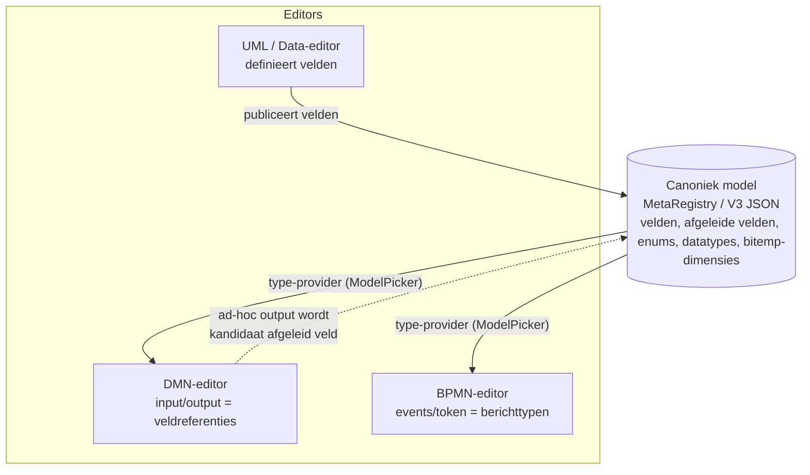
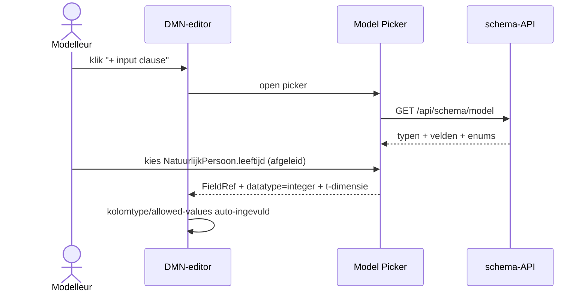
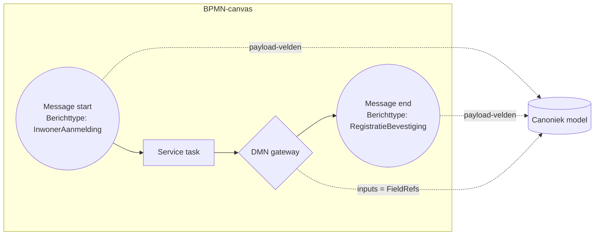
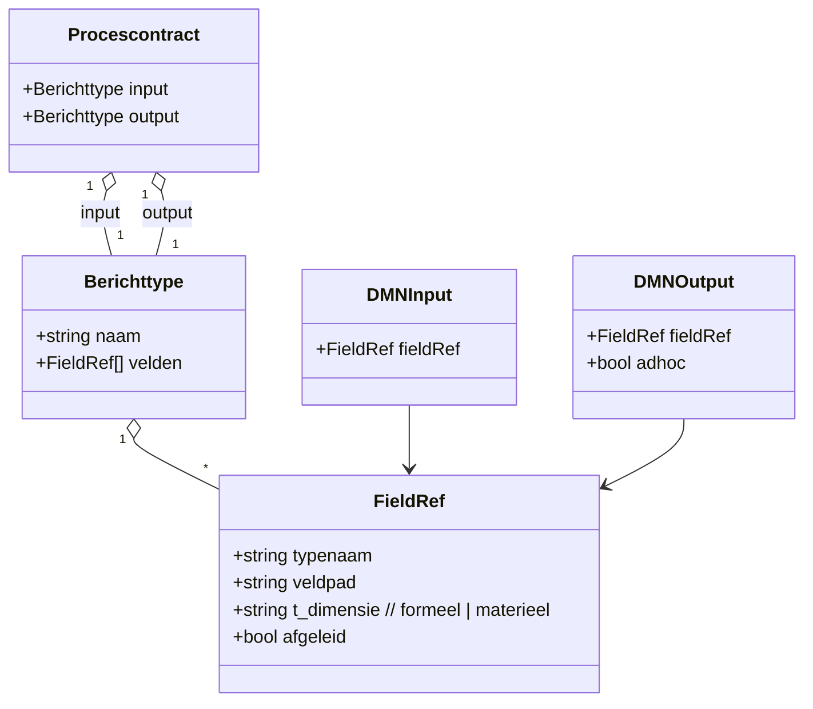
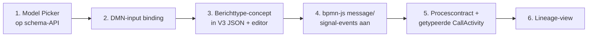

# Driehoek Proces – Regels – Data: één canoniek model als naaf

Dit document beschrijft een UI- en formaatvoorstel om **processen (BPMN)**,
**beslisregels (DMN)** en **data (canoniek metamodel)** tot één samenhangend
geheel te maken, waarin álle data die door regels en processen stroomt
herleidbaar is tot velden uit het canoniek model (MetaRegistry / V3 JSON).

Aanleiding: Ritense/Valtimo heeft een eigen BPMN-editor op bpmn.io gebouwd
([github.com/creatoratnight/bpmn-modeler](https://github.com/creatoratnight/bpmn-modeler),
demo op [designer.valtimo.nl](https://designer.valtimo.nl/)) — een bewust
uitgeklede bpmn-js editor. De Valtimo Designer toont maar één start-, één
intermediate- en één eindevent: geen message/signal-events. Dat is een
keuze in palette + properties-panel, **niet** een beperking van bpmn-js.

---

## 1. Uitgangspunt: het canoniek model is de naaf, niet een vierde editor

De driehoek werkt alleen als alle editors **dezelfde type-provider** delen:
de MetaRegistry + schema-API (`/api/schema/model`, V3 JSON). DMN-inputs,
proces-berichten en token-variabelen worden **gebonden** aan velden in plaats
van vrij ingetypt.

---

## 2. Kan bpmn-js message/signal-events aan?

Ja. `bpmn-js` (de engine achter zowel de Camunda Modeler als de Valtimo
Designer) ondersteunt volledig:

- `bpmn:Message` + `MessageEventDefinition` (start / catch / throw)
- `bpmn:Signal` + `SignalEventDefinition`
- timer, error, escalation, conditional event definitions

Wat de Valtimo Designer toont is een uitgekleed palette. Met een custom
**replace-menu entry** + een **custom properties-provider** zet je message/
signal-events er gewoon bij. Dat is precies het haakje dat nodig is om data
het proces in/uit te laten lopen in metamodel-termen.

---

## 3. Drie nieuwe concepten in het metamodel-formaat

Alles wat nu "los" is (DMN-kolomnaam, proces-variabele, message-payload)
wordt een **verwijzing naar het canoniek model**:

| Concept | Wat het is | Waar gebruikt |
|---|---|---|
| **Veldreferentie** (`FieldRef`) | Pointer `{typenaam, veldpad, t-dimensie}` naar een primair óf afgeleid veld | DMN-inputs, proces-variabelen, condition-expressions |
| **Berichttype** (`MessageType`) | Benoemde **projectie/view** over het canoniek model: een geordende bundel veldreferenties (MIM-conform: subset/aggregatie van objecttypen + attribuutsoorten) | Message-events, signals, token-payload |
| **Procescontract** | Input-berichttype + output-berichttype van een proces (en per CallActivity) | BPMN proces-niveau, koppelvlak-documentatie |

Het **Berichttype** is het scharnier dat nu nog ontbreekt. Een message-event
"eet" geen losse velden maar een berichttype, en een berichttype is per
definitie een view over het canoniek model. Daarmee is álle data die een
proces in- of uitgaat herleidbaar tot metamodel-velden.

---

## 4. UI-voorstel

### 4.1 Gedeeld: de Model Picker (één component, overal)

Een herbruikbaar React-paneel gevoed door de schema-API:

- **Boom**: Domein → Entiteit → GE → Veld
- Per veld een **badge**: primair / afgeleid (oranje `/`, zoals de UML-editor
  al doet), datatype, enum, en de **bitemporele dimensie** (formeel `t_f` /
  materieel `t_m`)
- Zoekbaar, en **drag-source**: sleep een veld in een DMN-kolom, een
  message-veld of een proces-variabele

Dit ene component verschijnt als lade in alle drie de editors — één
samenhangende wereld.

### 4.2 DMN-editor: inputs/outputs binden i.p.v. typen

- **Input-clause**: knop "Bind veld" → Model Picker → kolom krijgt
  `typenaam.veldpad`, datatype en (bij enums) toegestane waarden komen
  **automatisch** uit het metamodel. Geen handmatige FEEL-typefouten.
- **Bitemporele keuze** per input: lees je het veld op het **formele**
  peiltijdstip van de registratie of op een **materieel** peilmoment? Klein
  dropdownetje op de clause.
- **Output-clause**: twee opties — (a) **bind aan bestaand veld** (primair of
  afgeleid), of (b) markeer als **ad-hoc tussenresultaat**. Bij (b): één klik
  "promoveer tot afgeleid veld" → teruggeschreven naar het canoniek model als
  afgeleid veld met de DMN als regelbron. Zo lekt data nooit buiten het model.

### 4.3 BPMN-editor: getypeerde events + token-contract

Drie uitbreidingen op het Valtimo/bpmn-js palette:

1. **Getypeerde events**: message-start, message-catch/throw, signal. Elk
   event-property-panel heeft een veld **"Berichttype"** → Model Picker /
   Berichttype-kiezer.
2. **Berichttype-editor** (nieuw, klein): stel een bericht samen als
   projectie over het metamodel — vink velden/subtrees aan (bv.
   `NatuurlijkPersoon.bsn`, `...namen.achternaam`, `bereikbaarheid.locatie_id`).
   Resultaat is een herbruikbaar, MIM-conform berichttype.
3. **Proces-data-contract paneel** (op proces/pool-niveau): **Input-** en
   **Output-berichttype**. Hetzelfde paneel verschijnt op een CallActivity,
   zodat `camunda:in`/`camunda:out` niet meer met `variables="all"` hoeft maar
   **per veld getypeerd** mapt — dat had het `Plaats`-kolom-incident voorkomen.

### 4.4 Driehoek-view: lineage als vierde scherm

Een read-only overzicht dat de cirkel rond maakt:

- Kies een **veld** → zie welke **DMN-regels** het lezen/schrijven en welke
  **processtappen/berichten** het raken.
- Kies een **processtap** → zie welke DMN's worden aangeroepen en welke velden
  in/uit gaan.

Puur afgeleid uit de FieldRefs/Berichttypen, dus "gratis" zodra de binding
bestaat.

---

## 5. Opslag: uitbreiding van V3 JSON

Eén formaat, drie toevoegingen:

- `berichttypen[]`: naam + lijst veldreferenties (projectie)
- Op DMN-artefacten: `inputs[].fieldRef`, `outputs[].fieldRef | adhoc`
- Op BPMN: per message/signal-event een `berichttypeRef`; op proces/
  CallActivity een `contract {inputRef, outputRef}`

Omdat BPMN/DMN hun eigen XML hebben, leg je de binding vast als
**extensionElements** (`<canoniek:fieldRef typenaam=... veldpad=... t=...>`),
net zoals Camunda dat met `camunda:` doet. Zo blijft het bestand een geldig
BPMN/DMN-bestand én metamodel-gekoppeld.

---

## 6. Fasering

1. **Model Picker** als losse React-component op de schema-API — laagste
   risico, direct nut.
2. **DMN-input binding** — grootste, snelste winst: DMN ráákt per definitie
   velden.
3. **Berichttype-concept** in V3 JSON + simpele Berichttype-editor.
4. **bpmn-js message/signal-events** aanzetten + Berichttype-property.
5. **Procescontract** + getypeerde CallActivity-mapping.
6. **Lineage-view**.

---

## 7. Aanbeveling

Begin bij stap 1+2: één gedeelde Model Picker en DMN-inputs die binden aan
velden. Dat bewijst het principe ("data kan niet bestaan buiten het canoniek
model") met minimale code en levert meteen waarde. Het Berichttype-concept is
daarna de sleutel die processen net zo strak aan het model bindt als DMN — en
dat is precies wat Valtimo/Camunda standaard níét bieden. Daar zit de
onderscheidende kracht van de canoniek-model-aanpak.

---

## Referenties

- [process_engine_v01/docs/ontwerp.md](ontwerp.md) — huidige worker-architectuur
- [process_engine_v01/docs/CONTRACTEN.md](CONTRACTEN.md) — procesvariabele-contract
- bpmn-js: [github.com/bpmn-io/bpmn-js](https://github.com/bpmn-io/bpmn-js)
- Valtimo bpmn-modeler: [github.com/creatoratnight/bpmn-modeler](https://github.com/creatoratnight/bpmn-modeler)
