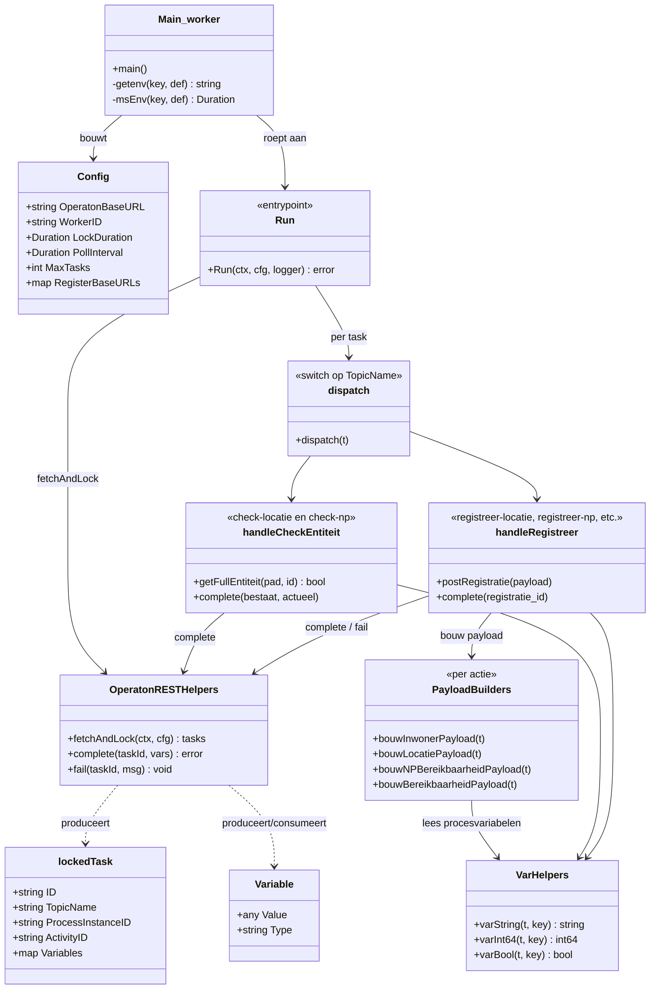
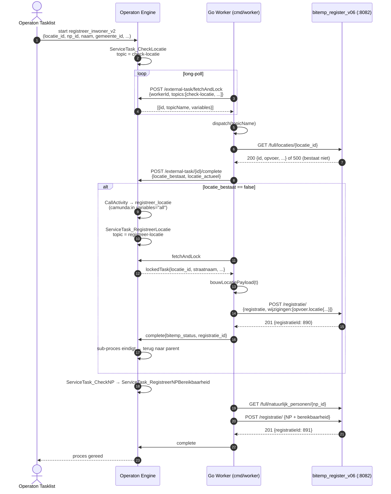
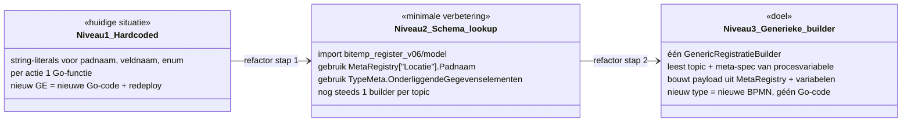
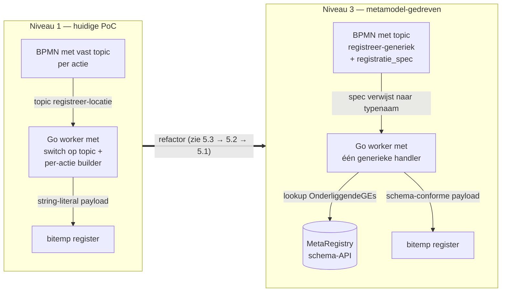

# Ontwerp Process Engine v01 (Go) — uitleg en metamodel-koppeling

Dit document beschrijft de huidige Go-code van `process_engine_v01`: hoe de
mappen zijn opgebouwd, welke code écht draait, hoe een Operaton-aanroep door
het systeem loopt, en op welke punten de code aan het bitemp-metamodel raakt.
Het eindigt met een voorstel om de hardcoded payload-builders te vervangen
door een **metamodel-gedreven** aanpak.

---

## 1. Mappen- en bestandsstructuur

```
process_engine_v01/
├── cmd/
│   ├── process-engine/main.go   ← skeleton-binary: HTTP-gateway + register-config
│   └── worker/main.go           ← productie-binary: long-poll external-task worker
├── internal/
│   ├── operaton/client.go       ← skeleton: dunne Operaton REST-client (leeg)
│   ├── registers/registry.go    ← skeleton: register-config laden (YAML stub)
│   ├── gateway/router.go        ← skeleton: /healthz + /api/process/info
│   ├── adapter/
│   │   ├── variables.go         ← skeleton: typed procesvariabele-contract
│   │   └── resolver.go          ← skeleton: rep_handle → snapshot resolver
│   ├── dmn/evaluator.go         ← skeleton: DMN-evaluator façade
│   └── worker/
│       ├── service_task.go      ← **WERKENDE CODE** (worker + 6 topics)
│       └── cel_script.go        ← skeleton: cel-eval topic
├── deployments/poc/             ← BPMN's + start-payloads
├── config/                      ← register-config (yaml, nog stub)
└── docs/                        ← ontwerp, contracten, plannen
```

| Status      | Bestanden                                                                                                |
|-------------|----------------------------------------------------------------------------------------------------------|
| **Werkend** | `cmd/worker/main.go`, `internal/worker/service_task.go`                                                  |
| **Skeleton**| `cmd/process-engine/main.go`, `internal/{operaton,registers,gateway,adapter,dmn}/*`, `worker/cel_script.go` |

De enige binary die vandaag iets nuttigs doet is `cmd/worker` — een
long-poll loop die taken uit Operaton trekt en doorvertaalt naar HTTP-calls
op het bitemp-register (`bitemp_register_v06`, default poort 8082).

---

## 2. Class-diagram van de werkende code



Alles in `internal/worker/service_task.go` zit in **package-level functies**;
er zijn geen structs of interfaces buiten de DTO's voor Operaton-JSON. Dat
houdt het simpel maar maakt vervanging/extensie ook lastiger (er is geen
"handler-interface" om tegen te programmeren).

---

## 3. Sequence-diagram: één Operaton-procesinstantie

Een typisch v2-pad voor `registreer_inwoner_v2`: de locatie bestaat nog niet
→ sub-proces `registreer_locatie` registreert hem → daarna NP+bereikbaarheid.



**Kernpunten:**

- De worker draait stateless: één `fetchAndLock`-loop trekt taken voor *alle*
  topics tegelijk (`allTopics` array), `dispatch` doet de topic-switch.
- Procesvariabelen reizen via Operaton heen en weer als JSON; ze worden via
  `varString`/`varInt64`/`varBool` getypeerd uitgelezen.
- Bij `complete` worden alleen het statusveld en het nieuwe `registratie_id`
  teruggegeven; bij `fail` wordt de incident-tekst doorgegeven en
  `retries: 0` gezet (zie PE13 in BACKLOG — geen retry-strategie nog).

---

## 4. Waar raakt de code het bitemp-metamodel?

De koppeling met het metamodel is op dit moment **expliciet en versnipperd**.
Er is geen import van `bitemp_register_v06/model` — de worker kent het
metamodel niet, en hardcodeert padnamen, JSON-veldnamen en payloadstructuur.

| Plek in code                                         | Wat is metamodel-afhankelijk?                                              | Hoe gecodeerd?                            |
|------------------------------------------------------|----------------------------------------------------------------------------|-------------------------------------------|
| `dispatch()` (case `check-locatie`)                  | `pad = "locaties"` (= `TypeMeta.Padnaam` van Locatie)                      | **String-literal**                        |
| `dispatch()` (case `check-np`)                       | `pad = "natuurlijk_personen"` (= `TypeMeta.Padnaam` van NatuurlijkPersoon) | **String-literal**                        |
| `bouwInwonerPayload()`                               | `"natuurlijkpersoon"` als veldnaam in wijziging                            | **String-literal**                        |
| `bouwInwonerPayload()` → `npOpvoer()`                | `persoonsidentificaties`, `namen`, `aanvang`, `einde`                       | **String-literals** (= JSONRolnamen)      |
| `bouwLocatiePayload()`                               | `"locatie"`, `"adressen"`, `"aanvang"`, `"land"`, `"gemeente"`, ...        | **String-literals**                       |
| `bouwBereikbaarheidPayload()` → `bereikbaarheidOpvoer()` | `"bereikbaarheid"`, `"locatie_id"`, `"natuurlijkpersoon_id"`, `"soort"`     | **String-literals**                       |
| Default `"Woonadres"` als bereikbaarheidssoort       | Enum-waarde uit `Bereikbaarheidssoort`                                     | **String-literal**                        |

Elke nieuwe representatie (bv. een nieuw GE op Locatie of een nieuwe relatie)
vereist dus:

1. een nieuwe `bouwXxxPayload`-functie schrijven
2. de juiste JSON-veldnaam (snake_case, conform `TypeMeta.JSONRolnaam`) raden
   of in de MetaRegistry opzoeken
3. de juiste padnaam idem
4. een nieuw topic + BPMN-ServiceTask aanmaken
5. dispatch() uitbreiden

Dat is de directe reden waarom we de `Plaats`-kolom in de DB pas ontdekten
toen de Go-struct stuk liep: de worker spiegelt het schema niet, hij raadt
het op basis van wat een ontwikkelaar typt.

---

## 5. Is dit hardgecodeerd? Ja — en hoe zou een metamodel-gedreven aanpak eruit zien?

### 5.1 Drie graden van metamodel-koppeling



### 5.2 Voorstel niveau 3: één generieke `registreer`-handler

In plaats van per-actie builders introduceren we **één** topic
`registreer-generiek` waarbij de BPMN-modelleur via een procesvariabele
aangeeft *welk type* hij wil registreren en welke onderliggende GE's hij
meelevert. De Go-code wordt dan een dunne wrapper rond de MetaRegistry.

**Procesvariabele-contract** (sluit aan bij `internal/adapter/variables.go`):

```jsonc
// Procesvariabele "registratie_spec" (Type: Json)
{
  "__kind": "registratie_spec",
  "register_id": "hoofdregister",
  "typenaam": "Locatie",                    // → MetaRegistry-lookup
  "entiteit_id": 9001,
  "opmerking": "via Operaton",
  "ges": {                                  // sleutel = JSONRolnaam uit metaregistry
    "adressen": [
      { "rel_id": 1, "straatnaam": "Teststraat", "huisnummer": "42",
        "postcode": "1234AB", "gemeente": 1680, "land": 0 }
    ],
    "aanvang": { "datum": "2026-05-21" }
  }
}
```

**Pseudo-implementatie** (Go):

```go
func handleRegistreerGeneriek(t lockedTask, cfg Config) error {
    spec := parseRegistratieSpec(t)                  // uit Json-variabele
    meta, ok := model.MetaRegistry[spec.Typenaam]    // ← metamodel-lookup
    if !ok { return fmt.Errorf("onbekend type: %s", spec.Typenaam) }

    payload := map[string]any{
        "registratie": registratieHeader("registratie", spec.Opmerking),
        "wijzigingen": []any{},
    }

    // Hoofd-entiteit
    hoofd := map[string]any{ "id": spec.EntiteitID }
    for _, oge := range meta.OnderliggendeGegevenselementen {   // ← uit MetaRegistry
        if waarde, ok := spec.GEs[oge.JSONRolnaam]; ok {
            hoofd[oge.JSONRolnaam] = waarde
        }
    }
    payload["wijzigingen"] = append(payload["wijzigingen"].([]any),
        map[string]any{"opvoer": map[string]any{ meta.Veldnaam: hoofd }})

    return postRegistratie(cfg, spec.RegisterID, payload)
}
```

**Voordeel:** zodra je een nieuwe representatie in de MetaRegistry zet en
het V3-schema publiceert, kan een BPMN-modelleur direct een
`registreer-generiek`-task aanmaken zonder dat de Go-worker opnieuw gebouwd
hoeft te worden. De koppeling met `TypeMeta` is dan échte single-source-of-truth
i.p.v. duplicatie.

**Aanvullende bouwstenen die hier voor nodig zijn:**

| Stap | Wat                                                                                     | Plaats                                  |
|------|------------------------------------------------------------------------------------------|-----------------------------------------|
| A    | Worker importeert `bitemp_register_v06/model` (of een afgesplitst schema-package)        | `go.mod` + `worker/service_task.go`     |
| B    | Schema laden via `/api/schema/model` van het register (lazy, gecached)                   | nieuwe `internal/schema/loader.go`      |
| C    | Validator op `spec.GEs` tegen `meta.OnderliggendeGegevenselementen`                      | nieuwe `internal/adapter/spec.go`       |
| D    | Generieke check-handler: `check-entiteit` met `typenaam` als variabele i.p.v. fixed pad  | `dispatch()` simpler maken              |
| E    | DMN-tabel die `typenaam` + `actie` afleidt uit business-context (PE11 in BACKLOG)        | `internal/dmn/evaluator.go`             |

### 5.3 Tussenstap (niveau 2) die we vandaag al kunnen doen

Zonder volledige refactor kunnen we direct profijt halen door **één import**
en **drie constanten** te vervangen door MetaRegistry-lookups:

```go
import "github.com/.../bitemp_register_v06/model"

// In dispatch():
case "check-locatie":
    pad := model.MustTypeMeta("Locatie").Padnaam            // i.p.v. "locaties"
    handleCheckEntiteit(..., "locatie_id", pad, "locatie")
case "check-np":
    pad := model.MustTypeMeta("NatuurlijkPersoon").Padnaam  // i.p.v. "natuurlijk_personen"
    handleCheckEntiteit(..., "np_id", pad, "np")
```

Dat dekt de meest kwetsbare laag (padnamen wijzigen mee als de MetaRegistry
verandert) zonder het hele payload-mechanisme om te zetten.

---

## 6. Overzicht: huidige vs. doel-architectuur



---

## 7. Samenvatting (TL;DR)

- **Productie-code zit alleen in `cmd/worker` + `internal/worker/service_task.go`**.
  De rest van `internal/*` is bewust skeleton (fase-plan).
- **Flow**: long-poll `fetchAndLock` → `dispatch(topic)` → check-handler óf
  registreer-handler → HTTP-call op bitemp v06 → `complete` of `fail`.
- **Metamodel-koppeling is vandaag puur via string-literals**: padnamen,
  JSON-veldnamen, enum-waarden en payload-structuur zijn handgetypeerd
  per topic. Er is geen import van `model.MetaRegistry`.
- **Korte termijn (niveau 2)**: vervang padnamen door
  `model.MustTypeMeta(...).Padnaam` om mee te bewegen met schema-wijzigingen.
- **Lange termijn (niveau 3)**: één generieke `registreer-generiek`-handler
  die een `registratie_spec`-procesvariabele leest en de payload opbouwt op
  basis van `TypeMeta.OnderliggendeGegevenselementen`. Nieuwe types
  registreren wordt dan een puur BPMN/V3-actie zonder Go-code.

Zie verder:
- [README.md](../README.md) — projectoverzicht en smoke-test resultaten
- [docs/CONTRACTEN.md](CONTRACTEN.md) — procesvariabele-contract (basis voor niveau 3)
- [docs/BACKLOG.md (v06)](../../bitemp_register_v06/docs/BACKLOG.md) — items PE1–PE16
